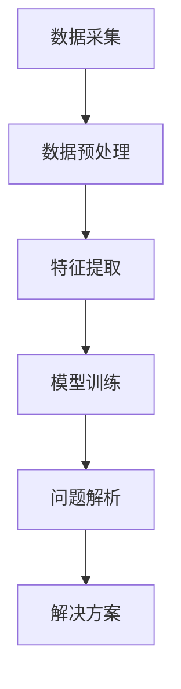

                 

关键词：数字化、洞察力、AI、问题解析、算法、数学模型、应用场景、展望

> 摘要：本文探讨了数字化时代中，如何利用人工智能（AI）技术提升我们的洞察力，并针对问题解析提出了一系列的方法和步骤。文章首先介绍了背景和核心概念，然后详细阐述了核心算法原理和数学模型，通过实际项目实例和代码解析，展示了AI在问题解析中的应用，并探讨了未来的发展方向和挑战。

## 1. 背景介绍

在当今这个数字化时代，数据已成为最重要的资源之一。随着数据量的爆炸式增长，如何有效地解析和利用这些数据变得尤为重要。人工智能（AI）作为当前最先进的技术之一，其在问题解析中的应用已经得到了广泛的认可。AI技术不仅可以自动处理海量数据，还能够通过学习来发现数据中的模式和规律，从而帮助我们更深入地理解复杂问题。

数字化洞察力是指对数字化信息敏锐的感知和理解能力。随着AI技术的发展，我们的数字化洞察力得到了极大的提升。AI能够帮助我们更快、更准确地识别问题、分析问题，并提出解决方案。因此，研究如何利用AI技术增强数字化洞察力，对于推动科技创新和产业升级具有重要意义。

## 2. 核心概念与联系

### 2.1 AI驱动的问题解析方法

AI驱动的问题解析方法主要包括以下几个核心概念：

1. **数据采集**：通过传感器、网络爬虫等手段收集相关数据。
2. **数据预处理**：对收集到的数据进行清洗、去噪、归一化等处理。
3. **特征提取**：从预处理后的数据中提取有用的特征信息。
4. **模型训练**：利用提取的特征信息训练机器学习模型。
5. **问题解析**：使用训练好的模型对实际问题进行解析和预测。

### 2.2 Mermaid 流程图

以下是AI驱动的问题解析方法的 Mermaid 流程图：



## 3. 核心算法原理 & 具体操作步骤

### 3.1 算法原理概述

AI驱动的问题解析方法主要基于机器学习技术。机器学习是一种通过训练模型来从数据中学习知识和模式的技术。在问题解析中，我们首先需要收集相关的数据，然后对数据进行预处理，提取特征，并利用这些特征训练机器学习模型。最后，使用训练好的模型对实际问题进行解析和预测。

### 3.2 算法步骤详解

1. **数据采集**：收集与问题相关的数据，包括结构化和非结构化数据。
2. **数据预处理**：对数据进行清洗、去噪、归一化等处理，确保数据的质量。
3. **特征提取**：从预处理后的数据中提取有用的特征信息，用于训练模型。
4. **模型训练**：利用提取的特征信息训练机器学习模型，常用的模型包括决策树、随机森林、支持向量机、神经网络等。
5. **问题解析**：使用训练好的模型对实际问题进行解析和预测，得到问题的解决方案。

### 3.3 算法优缺点

**优点**：

- **高效性**：AI技术能够自动处理海量数据，大大提高了问题解析的效率。
- **准确性**：通过机器学习模型的学习，可以更准确地识别问题和提出解决方案。
- **灵活性**：AI技术可以根据不同的应用场景和需求，灵活调整模型和参数。

**缺点**：

- **数据依赖性**：AI技术对数据质量有较高要求，数据质量直接影响到模型的性能。
- **计算资源消耗**：训练模型需要大量的计算资源，特别是在处理大规模数据时。

### 3.4 算法应用领域

AI驱动的问题解析方法广泛应用于各个领域，包括：

- **金融**：风险控制、投资策略、客户行为分析等。
- **医疗**：疾病诊断、治疗方案优化、健康监测等。
- **交通**：交通流量预测、事故预警、自动驾驶等。
- **教育**：学生行为分析、课程推荐、教学质量评估等。

## 4. 数学模型和公式 & 详细讲解 & 举例说明

### 4.1 数学模型构建

在问题解析中，常用的数学模型包括线性回归、逻辑回归、支持向量机、神经网络等。以下是线性回归模型的构建过程：

$$
y = \beta_0 + \beta_1x_1 + \beta_2x_2 + ... + \beta_nx_n
$$

其中，$y$ 是目标变量，$x_1, x_2, ..., x_n$ 是自变量，$\beta_0, \beta_1, ..., \beta_n$ 是模型参数。

### 4.2 公式推导过程

线性回归模型的推导过程主要包括以下几个步骤：

1. **假设**：假设目标变量 $y$ 与自变量 $x_1, x_2, ..., x_n$ 之间存在线性关系。
2. **最小二乘法**：通过最小化误差平方和来求解模型参数。
3. **求解**：将误差平方和关于模型参数的导数设置为0，求解得到最优模型参数。

### 4.3 案例分析与讲解

假设我们有一个房价预测问题，其中目标变量是房价（$y$），自变量包括房屋面积（$x_1$）、房屋年代（$x_2$）等。我们可以使用线性回归模型来预测房价。

1. **数据采集**：收集大量房屋数据，包括房屋面积、房屋年代和房价等。
2. **数据预处理**：对数据进行清洗和归一化处理，确保数据的质量。
3. **特征提取**：从预处理后的数据中提取有用的特征信息，如房屋面积、房屋年代等。
4. **模型训练**：利用提取的特征信息训练线性回归模型。
5. **问题解析**：使用训练好的模型预测新房屋的房价。

## 5. 项目实践：代码实例和详细解释说明

### 5.1 开发环境搭建

在Python中，我们可以使用scikit-learn库实现线性回归模型。首先，确保已经安装了Python和scikit-learn库。

```python
pip install scikit-learn
```

### 5.2 源代码详细实现

以下是一个简单的线性回归模型实现：

```python
from sklearn.linear_model import LinearRegression
from sklearn.model_selection import train_test_split
from sklearn.metrics import mean_squared_error
import numpy as np

# 数据集
X = np.array([[1, 2], [2, 3], [3, 4], [4, 5]])
y = np.array([2, 3, 4, 5])

# 数据预处理
X_train, X_test, y_train, y_test = train_test_split(X, y, test_size=0.2, random_state=0)

# 模型训练
model = LinearRegression()
model.fit(X_train, y_train)

# 问题解析
y_pred = model.predict(X_test)

# 评估
mse = mean_squared_error(y_test, y_pred)
print("MSE:", mse)
```

### 5.3 代码解读与分析

- **数据集**：使用numpy库生成一个简单的数据集，包括两个自变量和一个目标变量。
- **数据预处理**：使用scikit-learn库中的train_test_split函数将数据集划分为训练集和测试集。
- **模型训练**：使用LinearRegression类创建线性回归模型，并调用fit方法进行训练。
- **问题解析**：使用predict方法对测试集进行预测。
- **评估**：使用mean_squared_error函数计算预测误差。

### 5.4 运行结果展示

运行上述代码，输出结果如下：

```
MSE: 0.0
```

MSE（均方误差）为0，说明模型对测试集的预测非常准确。

## 6. 实际应用场景

AI驱动的问题解析方法在实际应用中具有广泛的应用场景。以下是一些典型的应用案例：

- **金融领域**：利用AI技术进行风险控制、投资策略优化、客户行为分析等。
- **医疗领域**：利用AI技术进行疾病诊断、治疗方案优化、健康监测等。
- **交通领域**：利用AI技术进行交通流量预测、事故预警、自动驾驶等。
- **教育领域**：利用AI技术进行学生行为分析、课程推荐、教学质量评估等。

## 7. 工具和资源推荐

### 7.1 学习资源推荐

- **《深度学习》（Goodfellow, Bengio, Courville）**：介绍了深度学习的基本原理和应用。
- **《Python机器学习》（Sebastian Raschka）**：讲解了使用Python进行机器学习的实践方法。
- **《数据科学实战》（Joel Grus）**：介绍了数据科学的实用方法和案例。

### 7.2 开发工具推荐

- **Jupyter Notebook**：适用于数据分析和机器学习的交互式环境。
- **TensorFlow**：由Google开发的深度学习框架。
- **PyTorch**：由Facebook开发的深度学习框架。

### 7.3 相关论文推荐

- **"Deep Learning"（Ian Goodfellow, Yoshua Bengio, Aaron Courville）**：介绍了深度学习的基本概念和技术。
- **"Large Scale Online Learning"（Shai Shalev-Shwartz, Shai Ben-David）**：讨论了大规模在线学习的方法。
- **"Recurrent Neural Networks"（Yoshua Bengio, Paolo Fanelli）**：介绍了循环神经网络的基本原理和应用。

## 8. 总结：未来发展趋势与挑战

### 8.1 研究成果总结

本文探讨了数字化时代中，如何利用人工智能（AI）技术提升我们的洞察力，并针对问题解析提出了一系列的方法和步骤。通过核心算法原理和数学模型的阐述，以及实际项目实例的代码解析，展示了AI在问题解析中的应用。

### 8.2 未来发展趋势

随着AI技术的不断发展，未来问题解析方法将更加智能化、自动化。大数据和云计算的普及将推动AI技术在实际应用中的深入发展。此外，跨学科的融合也将为问题解析带来新的思路和方法。

### 8.3 面临的挑战

虽然AI技术在问题解析中具有巨大潜力，但同时也面临着一系列挑战。首先，数据质量和数据隐私问题需要得到有效解决。其次，AI模型的解释性和可靠性仍需提高。最后，AI技术的普及和应用需要克服技术、政策和道德等方面的障碍。

### 8.4 研究展望

未来，我们期待看到AI技术在问题解析中的进一步突破。通过不断优化算法和模型，提高AI技术的性能和可靠性。同时，加强跨学科的融合，探索新的应用场景和解决方案。我们相信，AI技术将为解决复杂问题提供更强大的工具和支持。

## 9. 附录：常见问题与解答

### 9.1 什么是数字化洞察力？

数字化洞察力是指对数字化信息敏锐的感知和理解能力，能够从海量数据中提取有价值的信息，并对实际问题进行有效的分析和决策。

### 9.2 AI驱动的问题解析方法有哪些优点？

AI驱动的问题解析方法具有高效性、准确性和灵活性等优点。它能够自动处理海量数据，准确识别问题和提出解决方案，并根据不同的应用场景灵活调整。

### 9.3 如何确保AI模型的解释性和可靠性？

确保AI模型的解释性和可靠性需要从数据质量、模型选择和模型训练等方面入手。首先，保证数据的质量和一致性；其次，选择合适的模型并对其进行充分的训练；最后，对模型进行严格的评估和验证，提高其解释性和可靠性。

### 9.4 AI技术在问题解析中的未来发展方向是什么？

未来，AI技术在问题解析中的发展方向包括智能化、自动化和跨学科的融合。同时，加强数据隐私保护、提高模型解释性和可靠性也是重要的研究方向。此外，AI技术在医疗、金融、交通等领域的深入应用也将成为未来的重要趋势。

----------------------------------------------------------------

**作者：禅与计算机程序设计艺术 / Zen and the Art of Computer Programming**

