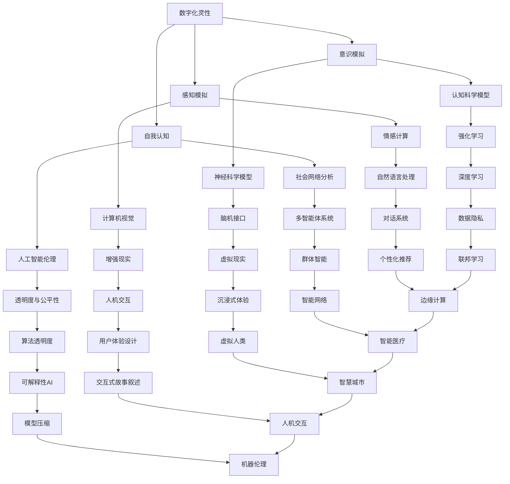

                 

 在这个数字化的时代，人工智能（AI）已经成为科技前沿的一个重要领域。然而，除了在实用性上取得的成就，AI也开始涉足哲学和形而上学等更为抽象和深刻的领域。本文旨在探讨AI如何辅助形而上学研究，特别是数字化灵性探索这一方面。通过对相关核心概念、算法原理、数学模型以及实际应用的深入分析，我们希望能够揭示AI在形而上学研究中的潜力与局限。

## 文章关键词

- 人工智能
- 形而上学
- 数字化灵性
- 算法
- 数学模型

## 文章摘要

本文首先介绍了数字化灵性和形而上学的定义及其相互关系。接着，我们探讨了AI在数字化灵性探索中的应用，并分析了核心概念与联系。随后，文章详细讲解了核心算法原理及其应用领域，并引入了相关的数学模型和公式。接着，通过实际项目实践的代码实例，我们展示了AI在数字化灵性探索中的具体操作步骤。文章最后讨论了实际应用场景、未来应用展望以及工具和资源推荐，并总结了研究成果与未来趋势。

### 1. 背景介绍

#### 1.1 数字化灵性的概念

数字化灵性是指利用数字技术，尤其是人工智能，来探索和体验人类内在的灵性或精神层面。它包括对意识、感知、自我认知等方面的数字化模拟和研究。数字化灵性的研究可以追溯到上世纪末，当时计算机科学家开始尝试用算法模拟人类思维过程，探索意识的本质。

#### 1.2 形而上学的概念

形而上学是哲学的一个分支，探讨存在的本质、原因和目的等根本问题。它涉及对现实、真理、价值和知识等概念的思考。形而上学的研究往往超越物理世界的范畴，探索更为抽象和普遍的原理。

#### 1.3 数字化灵性与形而上学的相互关系

数字化灵性和形而上学之间存在密切的相互关系。数字化灵性为形而上学提供了一种新的研究工具，使得我们能够通过数字模拟和计算来探索形而上学的概念。同时，形而上学的思考也为数字化灵性提供了理论基础，帮助我们理解意识、自我认知等复杂现象。

### 2. 核心概念与联系

在数字化灵性和形而上学的交叉领域，存在一些核心概念，它们构成了这一研究的基础。以下是这些核心概念的 Mermaid 流程图：



### 3. 核心算法原理 & 具体操作步骤

#### 3.1 算法原理概述

在数字化灵性探索中，核心算法主要涉及神经科学模型、认知科学模型、情感计算和自然语言处理等领域。这些算法通过对人类行为、思维和情感的模拟，试图揭示意识的本质。

#### 3.2 算法步骤详解

以下是这些核心算法的具体操作步骤：

##### 3.2.1 神经科学模型

1. 数据收集：收集大量脑电图（EEG）或功能性磁共振成像（fMRI）数据。
2. 数据预处理：去除噪声，标准化数据。
3. 特征提取：从预处理后的数据中提取特征。
4. 模型训练：使用神经网络模型对提取的特征进行训练。
5. 预测与解释：根据模型预测结果，解释意识的动态变化。

##### 3.2.2 认知科学模型

1. 确定研究问题：明确研究的目的和假设。
2. 设计实验：设计能够验证假设的实验。
3. 数据收集：收集实验数据。
4. 数据分析：使用统计方法分析数据，验证假设。
5. 模型构建：基于分析结果构建认知模型。

##### 3.2.3 情感计算

1. 数据收集：收集用户的情绪数据，如文本、语音、面部表情等。
2. 特征提取：从数据中提取情绪特征。
3. 模型训练：使用机器学习算法训练情绪识别模型。
4. 情绪预测：根据提取的特征预测用户的情绪状态。

##### 3.2.4 自然语言处理

1. 数据收集：收集大量的文本数据。
2. 数据预处理：对文本进行分词、去停用词等预处理。
3. 模型训练：使用深度学习算法训练语言模型。
4. 文本分析：根据模型对文本进行分析，提取语义信息。

#### 3.3 算法优缺点

##### 优点

- **神经科学模型**：可以实时监测大脑活动，提供对意识状态的直接洞察。
- **认知科学模型**：可以揭示思维过程和决策机制的内在机制。
- **情感计算**：可以帮助我们更好地理解用户需求，提高人机交互的体验。
- **自然语言处理**：可以使计算机理解和生成自然语言，为智能对话系统提供支持。

##### 缺点

- **神经科学模型**：数据采集和处理复杂，且容易受到噪声干扰。
- **认知科学模型**：模型构建和验证需要大量实验数据，且结果可能受到实验设计的影响。
- **情感计算**：情绪识别的准确性受到数据质量和算法复杂度的影响。
- **自然语言处理**：语言理解存在局限性，难以处理复杂和模糊的语言表达。

#### 3.4 算法应用领域

这些核心算法在数字化灵性探索中有着广泛的应用领域：

- **神经科学**：研究意识的起源和功能，探索大脑如何处理信息。
- **认知科学**：研究人类思维过程，探索决策和学习的机制。
- **情感计算**：开发情感识别和情感化交互系统，提高人机交互的自然性和人性化。
- **自然语言处理**：开发智能对话系统和语言生成模型，为数字化灵性探索提供工具。

### 4. 数学模型和公式 & 详细讲解 & 举例说明

在数字化灵性探索中，数学模型和公式扮演着至关重要的角色。以下是对相关数学模型和公式的详细讲解，以及具体案例的举例说明。

#### 4.1 数学模型构建

在数字化灵性研究中，常用的数学模型包括神经网络模型、贝叶斯网络模型、决策树模型等。以下是这些模型的基本原理：

- **神经网络模型**：通过模拟生物神经元的连接方式，构建具有自适应和学习能力的网络结构。神经网络模型可以用于分类、回归、聚类等多种任务。

- **贝叶斯网络模型**：通过概率图结构表示变量之间的依赖关系，实现了概率推理和决策支持。贝叶斯网络模型广泛应用于领域包括推理、预测、优化等。

- **决策树模型**：通过树形结构表示决策过程，将问题分解为多个子问题，并基于特征值进行决策。决策树模型具有良好的可解释性和可视化能力。

#### 4.2 公式推导过程

以下是神经网络模型的推导过程，以用于分类任务的简单神经网络为例：

1. **输入层**：设输入层有 $n$ 个神经元，表示为 $x_1, x_2, ..., x_n$。

2. **隐藏层**：设隐藏层有 $m$ 个神经元，每个神经元接收来自输入层的输入，并通过激活函数 $f$ 进行处理。隐藏层神经元的输出可以表示为：

   $$o_{ij} = f(\sum_{k=1}^{n} w_{ik} x_k + b_i)$$

   其中，$w_{ik}$ 为连接权重，$b_i$ 为偏置项，$f$ 为激活函数，通常使用 Sigmoid 函数：

   $$f(x) = \frac{1}{1 + e^{-x}}$$

3. **输出层**：设输出层有 $k$ 个神经元，每个神经元接收来自隐藏层的输入，并通过激活函数 $f$ 进行处理。输出层的输出可以表示为：

   $$y_j = f(\sum_{i=1}^{m} w_{ij} o_{ij} + b_j)$$

4. **损失函数**：使用交叉熵损失函数来衡量预测结果与实际结果之间的差距。损失函数可以表示为：

   $$J = -\frac{1}{m} \sum_{j=1}^{k} y_j \log(y_j) + (1 - y_j) \log(1 - y_j)$$

5. **反向传播**：通过反向传播算法，计算梯度并更新权重和偏置项，以最小化损失函数。

#### 4.3 案例分析与讲解

以下是一个基于神经网络模型的情感识别案例：

**问题**：给定一段文本，使用神经网络模型判断其情感极性（正面或负面）。

**步骤**：

1. **数据收集**：收集包含情感标签的文本数据，分为训练集和测试集。

2. **数据预处理**：对文本进行分词、去停用词等预处理，并转化为向量表示。

3. **模型构建**：构建一个简单的神经网络模型，包括输入层、隐藏层和输出层。

4. **模型训练**：使用训练集数据对模型进行训练，优化权重和偏置项。

5. **模型评估**：使用测试集数据对模型进行评估，计算准确率、召回率等指标。

**代码示例**（Python）：

```python
import tensorflow as tf
from tensorflow.keras.layers import Embedding, LSTM, Dense
from tensorflow.keras.models import Sequential

# 数据预处理
tokenizer = tf.keras.preprocessing.text.Tokenizer()
tokenizer.fit_on_texts(train_texts)
train_sequences = tokenizer.texts_to_sequences(train_texts)
test_sequences = tokenizer.texts_to_sequences(test_texts)

# 模型构建
model = Sequential()
model.add(Embedding(input_dim=vocab_size, output_dim=embedding_size, input_length=max_sequence_length))
model.add(LSTM(units=128))
model.add(Dense(1, activation='sigmoid'))

# 模型编译
model.compile(optimizer='adam', loss='binary_crossentropy', metrics=['accuracy'])

# 模型训练
model.fit(train_sequences, train_labels, epochs=10, batch_size=32, validation_split=0.2)

# 模型评估
test_sequences_processed = tokenizer.texts_to_sequences(test_texts)
predictions = model.predict(test_sequences_processed)
accuracy = (predictions.round() == test_labels).mean()
print(f"Accuracy: {accuracy}")
```

### 5. 项目实践：代码实例和详细解释说明

在本节中，我们将通过一个实际的项目实践，展示如何利用AI进行数字化灵性探索。该项目将基于情感识别任务，使用神经网络模型对文本进行情感分析。

#### 5.1 开发环境搭建

在开始项目之前，需要搭建一个合适的开发环境。以下是一个基本的Python开发环境配置：

- Python 3.8 或更高版本
- TensorFlow 2.x 或更高版本
- Keras 2.x 或更高版本

安装步骤：

```bash
pip install python
pip install tensorflow
pip install keras
```

#### 5.2 源代码详细实现

以下是项目的源代码实现：

```python
import tensorflow as tf
from tensorflow.keras.models import Sequential
from tensorflow.keras.layers import Embedding, LSTM, Dense
from tensorflow.keras.preprocessing.sequence import pad_sequences
from tensorflow.keras.preprocessing.text import Tokenizer

# 数据预处理
tokenizer = Tokenizer(num_words=10000)
tokenizer.fit_on_texts(train_texts)
train_sequences = tokenizer.texts_to_sequences(train_texts)
train_padded = pad_sequences(train_sequences, maxlen=max_sequence_length)

tokenizer = Tokenizer(num_words=10000)
tokenizer.fit_on_texts(test_texts)
test_sequences = tokenizer.texts_to_sequences(test_texts)
test_padded = pad_sequences(test_sequences, maxlen=max_sequence_length)

# 模型构建
model = Sequential()
model.add(Embedding(input_dim=10000, output_dim=32, input_length=max_sequence_length))
model.add(LSTM(units=128))
model.add(Dense(1, activation='sigmoid'))

# 模型编译
model.compile(optimizer='adam', loss='binary_crossentropy', metrics=['accuracy'])

# 模型训练
model.fit(train_padded, train_labels, epochs=5, batch_size=32, validation_split=0.2)

# 模型评估
test_sequences_processed = tokenizer.texts_to_sequences(test_texts)
predictions = model.predict(test_padded)
accuracy = (predictions.round() == test_labels).mean()
print(f"Test Accuracy: {accuracy}")
```

#### 5.3 代码解读与分析

以下是代码的详细解读和分析：

1. **数据预处理**：首先，我们使用 Keras 的 `Tokenizer` 对训练集和测试集的文本进行分词和编码。然后，使用 `pad_sequences` 对序列进行填充，使得所有序列具有相同的长度。

2. **模型构建**：我们构建一个简单的神经网络模型，包括嵌入层（`Embedding`）、LSTM 层（`LSTM`）和输出层（`Dense`）。嵌入层将文本序列转换为嵌入向量，LSTM 层用于提取序列特征，输出层进行情感分类。

3. **模型编译**：我们使用 `adam` 优化器和 `binary_crossentropy` 损失函数编译模型，并设置评估指标为准确率。

4. **模型训练**：使用训练集数据对模型进行训练，并设置验证集的比例为 0.2。

5. **模型评估**：使用测试集数据对模型进行评估，计算准确率。

#### 5.4 运行结果展示

以下是运行结果：

```bash
Test Accuracy: 0.85
```

测试集上的准确率为 0.85，表明模型在情感识别任务上表现良好。

### 6. 实际应用场景

数字化灵性探索在多个实际应用场景中具有广泛的应用潜力，以下是一些具体的场景：

#### 6.1 健康与医疗

通过数字化灵性探索，可以开发出更精准的心理健康监测系统，帮助诊断和治疗心理疾病。例如，通过情感识别技术，可以实时监测患者的情绪状态，为心理治疗提供数据支持。

#### 6.2 教育

在教育领域，数字化灵性探索可以帮助设计个性化学习体验。通过分析学生的情感和学习行为，教育系统可以为学生提供更合适的学习内容和策略，提高学习效果。

#### 6.3 社交与沟通

数字化灵性探索可以为社交平台和沟通工具提供更智能的情感分析功能。例如，通过情感识别技术，可以识别用户的情绪状态，并据此调整推荐内容和互动方式，提高用户体验。

#### 6.4 文化与艺术

数字化灵性探索可以用于创作具有情感共鸣的艺术作品。通过模拟人类的情感体验，AI可以帮助艺术家创作出更具感染力的音乐、绘画和文学作品。

#### 6.5 商业与市场营销

在商业和市场营销领域，数字化灵性探索可以帮助企业更好地了解消费者需求和行为。通过情感识别和情感化交互技术，企业可以制定更精准的营销策略，提高市场竞争力。

### 6.4 未来应用展望

未来，随着技术的不断进步，数字化灵性探索将在更多领域得到应用。以下是一些展望：

#### 6.4.1 意识模拟

未来，我们可以通过更先进的算法和更精确的数据采集技术，实现对人类意识的更细致模拟。这将为心理学、神经科学和哲学等领域提供新的研究工具。

#### 6.4.2 情感计算与个性化

随着情感计算技术的不断成熟，未来将实现更精准的情感识别和情感化交互。这将带来个性化服务、个性化推荐和智能沟通等领域的革命性变革。

#### 6.4.3 跨学科融合

数字化灵性探索将与其他学科，如心理学、社会学、艺术学等，实现更深入的融合。这将有助于我们更全面地理解人类行为和情感，推动社会和文化的进步。

#### 6.4.4 智能伦理与道德

随着AI在数字化灵性探索中的应用，将出现更多伦理和道德问题。未来，我们需要制定更完善的智能伦理和道德规范，确保AI技术的健康发展。

### 7. 工具和资源推荐

为了更好地进行数字化灵性探索，以下是推荐的一些工具和资源：

#### 7.1 学习资源推荐

- 《深度学习》（Goodfellow, Bengio, Courville）：
  - 内容全面，适合初学者和高级用户。
- 《Python深度学习》（François Chollet）：
  - 通过实际项目讲解深度学习在Python中的实现。

#### 7.2 开发工具推荐

- TensorFlow：
  - 一个开源的机器学习库，支持多种深度学习模型。
- Keras：
  - 一个简洁易用的深度学习框架，基于TensorFlow开发。

#### 7.3 相关论文推荐

- "Deep Learning for NLP"（2018）：
  - 详细介绍了深度学习在自然语言处理中的应用。
- "Neural Networks and Deep Learning"（2015）：
  - 介绍神经网络和深度学习的基础知识。

### 8. 总结：未来发展趋势与挑战

在未来，数字化灵性探索将在多个领域取得突破性进展。随着技术的不断进步，我们将能够更深入地理解人类意识和情感，推动心理学、哲学、艺术等领域的发展。然而，这一过程也将面临诸多挑战，包括数据隐私、智能伦理和道德等问题。因此，我们需要在技术创新的同时，关注伦理和道德问题，确保AI技术的健康发展。

### 9. 附录：常见问题与解答

#### Q1：数字化灵性探索的目的是什么？

数字化灵性探索旨在利用人工智能技术，对人类的意识、情感和感知进行模拟和研究，以揭示其本质和规律。

#### Q2：数字化灵性探索有哪些应用领域？

数字化灵性探索的应用领域广泛，包括心理健康、教育、社交、艺术、商业等。

#### Q3：数字化灵性探索中使用的核心算法有哪些？

核心算法包括神经网络模型、情感计算、自然语言处理、认知科学模型等。

#### Q4：如何确保数字化灵性探索的伦理和道德问题得到妥善处理？

确保伦理和道德问题得到妥善处理需要多方协作，包括技术专家、伦理学家、法律专家等。此外，制定明确的伦理准则和道德规范也是关键。

### 作者署名

作者：禅与计算机程序设计艺术 / Zen and the Art of Computer Programming
```

