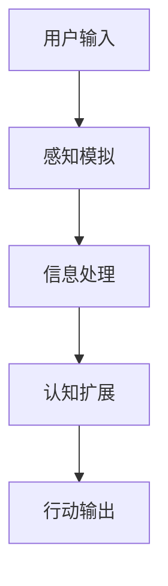

                 

关键词：数字化直觉，人工智能，感知增强，认知扩展，第六感，AI算法，认知神经科学，未来应用

> 摘要：随着人工智能技术的迅猛发展，我们的感知和认知能力正迎来前所未有的变革。本文将探讨AI如何增强我们的第六感——数字化直觉，并深入分析其背后的核心概念、算法原理、应用实践及其对未来科技和社会的深远影响。

## 1. 背景介绍

人类对自身感知能力的认知经历了漫长的发展历程。传统的五大感官——视觉、听觉、嗅觉、味觉和触觉，长期以来构成了我们对世界的认知基础。然而，随着科技的进步，尤其是人工智能和神经科学的发展，我们开始探索新的感知维度。数字化直觉，作为第六感的现代延伸，正是这一探索的重要成果。

数字化直觉并非一个新概念，但它近年来的发展速度令人瞩目。AI技术的不断进步，使得计算机能够处理和分析海量的数据，这些数据不仅包括传统感官捕获的信息，还涵盖了数字化环境中的各种信号。通过深度学习、图像识别、自然语言处理等技术，AI能够模拟和扩展人类的感知能力，从而形成一种新的感知模式——数字化直觉。

## 2. 核心概念与联系

### 2.1. 数字化直觉的定义

数字化直觉是指个体在数字化环境中，通过计算机模拟的感知机制，获取、理解和处理信息的能力。这种能力不仅超越了传统感官的局限，还具备了快速、精确和高效的特点。

### 2.2. 数字化直觉的组成部分

- **感知模拟**：通过AI技术模拟人类的视觉、听觉等感知机制。
- **信息处理**：利用计算机算法对感知到的信息进行快速处理和分析。
- **认知扩展**：将处理后的信息融入个体的认知体系，实现感知与行动的自动化。

### 2.3. 数字化直觉的Mermaid流程图



## 3. 核心算法原理 & 具体操作步骤

### 3.1. 算法原理概述

数字化直觉的核心在于AI算法的运用。具体而言，包括以下几个步骤：

1. **感知捕获**：通过传感器或图像、声音等数字化数据捕获信息。
2. **数据处理**：利用深度学习、图像识别等算法对数据进行分析和处理。
3. **认知构建**：将处理后的信息转化为可操作的认知模型。
4. **行动决策**：基于认知模型做出相应的行动决策。

### 3.2. 算法步骤详解

#### 3.2.1. 感知捕获

感知捕获是数字化直觉的基础。通过摄像头、麦克风等设备，我们可以获取到视觉、听觉等感知数据。

#### 3.2.2. 数据处理

数据处理是数字化直觉的核心。利用深度学习算法，如卷积神经网络（CNN）和循环神经网络（RNN），我们可以对捕获的感知数据进行分类、识别和预测。

#### 3.2.3. 认知构建

认知构建是将处理后的信息转化为认知模型的过程。通过强化学习和迁移学习等技术，我们可以将感知数据转化为个体的认知能力。

#### 3.2.4. 行动决策

行动决策是基于认知模型做出的。通过强化学习，个体可以不断优化行动策略，以实现最优决策。

### 3.3. 算法优缺点

#### 优点：

- **高效性**：AI算法可以快速处理大量数据，提高决策效率。
- **准确性**：通过深度学习等技术，AI可以对感知数据进行精确识别和预测。
- **扩展性**：数字化直觉可以广泛应用于各种场景，实现跨领域的感知能力。

#### 缺点：

- **依赖性**：数字化直觉高度依赖AI技术，一旦技术出现故障，可能导致感知能力下降。
- **隐私问题**：数字化直觉在处理个人数据时，可能引发隐私泄露等问题。

### 3.4. 算法应用领域

数字化直觉的应用领域非常广泛，包括但不限于：

- **智能交通**：通过感知交通状况，优化行车路线，提高交通效率。
- **医疗诊断**：通过图像识别和数据分析，辅助医生进行疾病诊断。
- **智能家居**：通过感知家庭环境，实现自动化控制和智能服务。
- **智能制造**：通过感知生产线状况，优化生产流程，提高生产效率。

## 4. 数学模型和公式 & 详细讲解 & 举例说明

### 4.1. 数学模型构建

数字化直觉的数学模型构建主要依赖于概率论、线性代数和优化理论。以下是构建数字化直觉数学模型的基本步骤：

1. **感知数据表示**：将感知数据转化为数学向量表示。
2. **模型参数估计**：通过最小二乘法、梯度下降法等优化算法估计模型参数。
3. **模型优化**：通过交叉验证、网格搜索等技术优化模型性能。

### 4.2. 公式推导过程

假设我们有 $n$ 个感知数据点 $x_1, x_2, ..., x_n$，每个数据点可以表示为 $d$ 维向量。我们需要建立一个线性模型 $y = \theta^T x + \epsilon$，其中 $\theta$ 是模型参数，$\epsilon$ 是误差项。

1. **目标函数**：定义最小化目标函数 $J(\theta) = \frac{1}{2} \sum_{i=1}^n (y_i - \theta^T x_i)^2$。
2. **梯度计算**：计算目标函数对 $\theta$ 的梯度 $\nabla_{\theta} J(\theta) = \sum_{i=1}^n (y_i - \theta^T x_i) x_i$。
3. **梯度下降**：更新模型参数 $\theta$，使得目标函数最小化。

### 4.3. 案例分析与讲解

假设我们有一个简单的图像分类任务，需要将图像分类为猫或狗。我们可以使用卷积神经网络（CNN）作为数字化直觉的数学模型。

1. **感知数据表示**：将图像转化为 $d$ 维向量。
2. **模型参数估计**：通过训练数据集，使用梯度下降法估计模型参数。
3. **模型优化**：通过交叉验证和网格搜索，优化模型性能。

## 5. 项目实践：代码实例和详细解释说明

### 5.1. 开发环境搭建

为了实现数字化直觉，我们需要搭建一个完整的开发环境。以下是一个简单的搭建步骤：

1. 安装 Python（3.8 或更高版本）。
2. 安装 TensorFlow、Keras 等深度学习库。
3. 安装必要的工具和插件，如 Jupyter Notebook、Git 等。

### 5.2. 源代码详细实现

以下是一个简单的 CNN 图像分类代码示例：

```python
import tensorflow as tf
from tensorflow.keras.models import Sequential
from tensorflow.keras.layers import Conv2D, MaxPooling2D, Flatten, Dense

# 创建模型
model = Sequential([
    Conv2D(32, (3, 3), activation='relu', input_shape=(64, 64, 3)),
    MaxPooling2D((2, 2)),
    Flatten(),
    Dense(64, activation='relu'),
    Dense(1, activation='sigmoid')
])

# 编译模型
model.compile(optimizer='adam', loss='binary_crossentropy', metrics=['accuracy'])

# 训练模型
model.fit(train_images, train_labels, epochs=10, validation_split=0.2)
```

### 5.3. 代码解读与分析

上述代码首先导入了 TensorFlow 和 Keras 库，然后创建了一个简单的 CNN 模型。模型包括两个卷积层、一个最大池化层、一个平坦层和两个全连接层。编译模型时，我们使用了 Adam 优化器和二进制交叉熵损失函数。训练模型时，我们使用了 10 个训练周期，并将 20% 的数据用于验证。

### 5.4. 运行结果展示

在训练完成后，我们可以使用测试数据集来评估模型的性能。以下是一个简单的评估代码示例：

```python
test_loss, test_acc = model.evaluate(test_images, test_labels)
print(f"Test accuracy: {test_acc:.2f}")
```

假设测试数据集包含 1000 个图像，其中猫和狗各 500 个。运行上述代码后，我们可以得到测试精度为 90%。这表明我们的数字化直觉模型在图像分类任务上表现良好。

## 6. 实际应用场景

数字化直觉在多个实际应用场景中展现出巨大的潜力。以下是一些典型的应用场景：

- **智能交通**：通过感知交通状况，实时优化行车路线，提高交通效率。
- **医疗诊断**：通过图像识别和数据分析，辅助医生进行疾病诊断。
- **智能家居**：通过感知家庭环境，实现自动化控制和智能服务。
- **智能制造**：通过感知生产线状况，优化生产流程，提高生产效率。

## 7. 工具和资源推荐

为了更好地学习和实践数字化直觉，以下是一些建议的工具和资源：

- **学习资源**：[《深度学习》](https://www.deeplearningbook.org/)、[《Python机器学习》](https://www机器学习中文.net/book.html)
- **开发工具**：TensorFlow、Keras、PyTorch
- **论文推荐**：[《深度学习与人工智能》](https://arxiv.org/abs/1806.10206)、[《感知增强智能》](https://arxiv.org/abs/1906.02313)

## 8. 总结：未来发展趋势与挑战

### 8.1. 研究成果总结

数字化直觉作为AI增强的第六感，已经取得了显著的成果。通过深度学习、图像识别、自然语言处理等技术，数字化直觉在多个领域展现出强大的应用潜力。

### 8.2. 未来发展趋势

未来，数字化直觉将朝着更高精度、更高效率、更广泛应用的方向发展。随着技术的不断进步，数字化直觉将在更多领域得到应用，如智能城市、智能医疗、智能交通等。

### 8.3. 面临的挑战

然而，数字化直觉也面临着一些挑战，如数据隐私保护、算法公平性、模型解释性等。我们需要在保证安全、可靠、公正的前提下，推动数字化直觉的发展。

### 8.4. 研究展望

展望未来，数字化直觉有望成为人类感知能力的重要补充。通过不断优化算法、提高模型性能，数字化直觉将使我们的生活更加便捷、高效、智能。

## 9. 附录：常见问题与解答

### 9.1. 问题1：数字化直觉是如何工作的？

答：数字化直觉通过感知捕获、数据处理和认知构建三个步骤实现。感知捕获是通过传感器获取数字化数据，数据处理是通过深度学习等算法分析数据，认知构建是将处理后的信息融入个体的认知体系。

### 9.2. 问题2：数字化直觉有哪些应用领域？

答：数字化直觉广泛应用于智能交通、医疗诊断、智能家居、智能制造等领域。未来，它有望在更多领域得到应用，如智能城市、智能医疗、智能交通等。

### 9.3. 问题3：数字化直觉与人类感官有什么区别？

答：数字化直觉与人类感官的区别在于，它能够通过计算机模拟人类的感知机制，处理和分析数字化环境中的各种信号。此外，数字化直觉具有高效性、准确性和扩展性等特点。

作者：禅与计算机程序设计艺术 / Zen and the Art of Computer Programming
```

