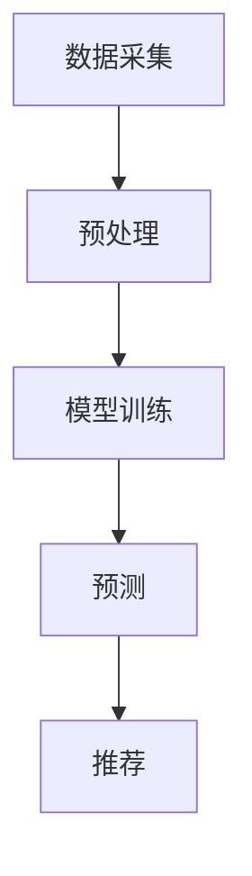

                 

随着人工智能（AI）技术的不断发展，数字化美容行业正经历一场革命。个性化护肤作为其中的一个重要分支，正逐步改变消费者对美容的理解和体验。本文将深入探讨AI在个性化护肤中的应用，以及如何利用AI技术推动美容创业。

> **关键词：** 个性化护肤，AI，美容创业，数字美容，人工智能技术，皮肤分析，用户数据，美容产品，消费者体验。

> **摘要：** 本文首先介绍了数字化美容和个性化护肤的概念，接着详细讨论了AI在皮肤分析、用户数据收集与处理、以及美容产品推荐等方面的应用。最后，本文探讨了AI驱动的个性化护肤如何助力美容创业，并提出了未来发展的挑战和展望。

## 1. 背景介绍

数字化美容是指利用数字技术和算法来改善皮肤护理过程，为用户提供个性化的解决方案。个性化护肤则是基于用户皮肤类型、历史数据、生活习惯等多维度信息，为用户定制化推荐护肤产品和服务。

当前，数字化美容行业呈现出高速增长的态势。根据市场研究公司的数据，全球数字化美容市场规模预计将在未来几年内持续扩大。这一增长主要得益于以下几个因素：

1. **消费者需求**：现代消费者越来越注重个性化体验，追求更适合自己的产品和服务。
2. **技术进步**：AI、大数据、传感器等技术的不断进步，为个性化护肤提供了强大的技术支持。
3. **移动设备的普及**：智能手机和可穿戴设备的普及，使得用户可以随时获取皮肤健康数据和美容建议。

## 2. 核心概念与联系

### 2.1 皮肤分析

皮肤分析是数字化美容的核心环节，它涉及到对皮肤状态、纹理、色素沉着、皱纹等特征的全面分析。皮肤分析通常需要借助各种传感器和成像技术，例如紫外线成像、红外成像、高分辨率皮肤镜等。

#### 2.1.1 传感器与成像技术

传感器和成像技术是皮肤分析的重要工具。常见的传感器包括紫外线传感器、红外传感器、光电二极管等，它们可以检测皮肤的表面特征和深层结构。成像技术则包括高分辨率相机、3D扫描仪等，能够捕捉皮肤的细节信息。

#### 2.1.2 数据处理与模型训练

获取到的皮肤数据需要经过处理和建模。数据处理包括数据的清洗、归一化和特征提取等步骤，以便为机器学习模型提供高质量的输入。模型训练则通常使用深度学习技术，通过大量皮肤数据训练分类和预测模型，从而实现对皮肤状态的分析。

### 2.2 用户数据收集与处理

用户数据收集与处理是个性化护肤的基础。用户数据包括皮肤类型、年龄、性别、生活习惯、护肤历史等多个维度。通过收集和处理这些数据，可以为用户提供更加精准的护肤建议。

#### 2.2.1 数据来源

用户数据的来源包括用户直接输入的数据、社交媒体数据、电子健康记录等。例如，用户可以在应用程序中填写皮肤类型和护肤偏好，或者在社交媒体上分享皮肤照片。

#### 2.2.2 数据处理

数据处理包括数据的清洗、去重、归一化等步骤。清洗数据可以去除噪声和异常值，去重可以防止重复记录，归一化可以使不同维度的数据在同一尺度上进行比较。

### 2.3 美容产品推荐

基于皮肤分析和用户数据，AI可以推荐个性化的美容产品。推荐系统通常使用协同过滤、基于内容的过滤等方法，结合用户的历史购买记录、皮肤类型等信息，为用户推荐合适的产品。

#### 2.3.1 协同过滤

协同过滤是一种常见的推荐算法，它通过分析用户之间的相似性来推荐产品。例如，如果一个用户购买了某种产品，且这个用户与其他用户在皮肤类型上有较高的相似性，那么其他用户也可能喜欢这种产品。

#### 2.3.2 基于内容的过滤

基于内容的过滤则是通过分析产品的属性和特征来推荐产品。例如，如果一个用户喜欢某种特定的成分，那么系统会推荐含有这种成分的产品。

### 2.4 数据流与流程

图1展示了皮肤分析、用户数据收集与处理、以及美容产品推荐的完整流程。该流程包括数据采集、预处理、模型训练、预测和推荐等步骤。



## 3. 核心算法原理 & 具体操作步骤

### 3.1 算法原理概述

核心算法包括皮肤分析算法、用户数据收集与处理算法、以及美容产品推荐算法。皮肤分析算法基于深度学习技术，通过分析皮肤图像和传感器数据，预测皮肤状态。用户数据收集与处理算法则使用数据挖掘和机器学习技术，从多维度数据中提取用户特征。美容产品推荐算法采用协同过滤和基于内容的过滤方法，为用户推荐个性化产品。

### 3.2 算法步骤详解

#### 3.2.1 皮肤分析算法

1. **数据采集**：使用高分辨率相机或3D扫描仪获取皮肤图像。
2. **预处理**：对皮肤图像进行去噪、增强和分割等预处理操作。
3. **特征提取**：使用深度学习模型提取皮肤纹理、色素沉着、皱纹等特征。
4. **模型训练**：使用大量皮肤数据训练分类和预测模型。
5. **预测**：输入新皮肤数据，预测皮肤状态。

#### 3.2.2 用户数据收集与处理算法

1. **数据采集**：从用户输入、社交媒体、电子健康记录等渠道收集用户数据。
2. **预处理**：清洗、去重、归一化用户数据。
3. **特征提取**：使用机器学习算法提取用户皮肤类型、生活习惯、护肤历史等特征。
4. **用户建模**：构建用户画像，为用户打标签。

#### 3.2.3 美容产品推荐算法

1. **协同过滤**：分析用户之间的相似性，推荐相似用户喜欢的产品。
2. **基于内容的过滤**：分析产品的成分、功效等属性，推荐符合用户需求的商品。

### 3.3 算法优缺点

#### 3.3.1 优点

1. **个性化**：能够根据用户特征和需求推荐个性化产品。
2. **高效**：通过算法自动化处理大量皮肤数据和用户数据，提高效率。
3. **准确性**：深度学习模型在皮肤分析和用户建模方面具有较高的准确性。

#### 3.3.2 缺点

1. **数据依赖**：算法效果受限于数据的数量和质量。
2. **计算成本**：深度学习模型训练和预测需要大量计算资源。

### 3.4 算法应用领域

1. **美容产品推荐**：在电商平台、社交媒体等平台上为用户提供个性化美容产品推荐。
2. **皮肤健康管理**：通过皮肤分析提供个性化的皮肤护理建议。
3. **美容院线**：为美容院提供个性化护肤方案，提高客户满意度。

## 4. 数学模型和公式 & 详细讲解 & 举例说明

### 4.1 数学模型构建

#### 4.1.1 皮肤状态预测模型

皮肤状态预测模型通常采用卷积神经网络（CNN）构建。CNN是一种深度学习模型，特别适用于图像处理。下面是一个简单的CNN模型公式：

$$
h_{\theta}(x) = \text{ReLU}(W \cdot x + b)
$$

其中，$h_{\theta}(x)$ 是模型的输出，$W$ 是权重矩阵，$x$ 是输入特征，$b$ 是偏置项，$\text{ReLU}$ 是ReLU激活函数。

#### 4.1.2 用户数据建模

用户数据建模通常采用协同过滤算法，其核心思想是计算用户之间的相似性。相似度计算公式如下：

$$
s_{ij} = \frac{\sum_{k \in R} u_{ik} v_{kj}}{\sqrt{\sum_{k \in R} u_{ik}^2 \sum_{k \in R} v_{kj}^2}}
$$

其中，$s_{ij}$ 是用户 $i$ 和用户 $j$ 之间的相似度，$u_{ik}$ 和 $v_{kj}$ 分别是用户 $i$ 对商品 $k$ 的评分和用户 $j$ 对商品 $k$ 的评分。

### 4.2 公式推导过程

#### 4.2.1 CNN模型推导

CNN模型的推导涉及卷积操作、池化操作和激活函数。以下是CNN模型的一个简化推导过程：

1. **卷积操作**：

$$
\text{conv}(x) = \sum_{k=1}^{K} w_{k} \cdot x + b_k
$$

其中，$w_{k}$ 是卷积核，$x$ 是输入特征，$b_k$ 是偏置项。

2. **池化操作**：

$$
\text{pool}(x) = \max_{i,j} (x[i,j])
$$

其中，$x[i,j]$ 是输入特征图上的一个点。

3. **激活函数**：

$$
\text{ReLU}(x) = \max(0, x)
$$

#### 4.2.2 协同过滤推导

协同过滤算法的推导涉及矩阵分解和误差最小化。以下是协同过滤的一个简化推导过程：

1. **矩阵分解**：

$$
R = U \cdot V^T
$$

其中，$R$ 是用户-商品评分矩阵，$U$ 和 $V$ 分别是用户和商品的隐向量矩阵。

2. **误差最小化**：

$$
\min_{U, V} \sum_{i=1}^{m} \sum_{j=1}^{n} (r_{ij} - u_i \cdot v_j)^2
$$

其中，$r_{ij}$ 是用户 $i$ 对商品 $j$ 的实际评分。

### 4.3 案例分析与讲解

#### 4.3.1 皮肤状态预测案例

假设我们有一个皮肤状态预测问题，需要预测用户的皮肤是否干燥。首先，我们收集一组皮肤图像，并使用CNN模型提取皮肤特征。然后，我们训练一个分类模型，使用提取的皮肤特征预测皮肤状态。具体步骤如下：

1. **数据采集**：收集1000张皮肤图像，每张图像对应一个皮肤状态（干燥或正常）。
2. **预处理**：对皮肤图像进行去噪、增强和分割等预处理操作。
3. **特征提取**：使用CNN模型提取皮肤纹理、色素沉着、皱纹等特征，得到一个1000×10的特征矩阵。
4. **模型训练**：使用分类算法（如SVM）训练一个皮肤状态预测模型。
5. **预测**：输入新皮肤图像，预测皮肤状态。

#### 4.3.2 美容产品推荐案例

假设我们有一个美容产品推荐问题，需要为用户推荐适合的护肤品。首先，我们收集用户数据，包括用户皮肤类型、购买历史、使用评价等。然后，我们使用协同过滤算法计算用户之间的相似性，并根据相似性推荐产品。具体步骤如下：

1. **数据采集**：收集1000个用户的数据，包括皮肤类型、购买历史和使用评价。
2. **预处理**：对用户数据进行清洗、去重和归一化处理。
3. **特征提取**：使用机器学习算法提取用户特征，得到一个1000×10的特征矩阵。
4. **协同过滤**：计算用户之间的相似性，生成一个相似度矩阵。
5. **推荐**：根据相似度矩阵为用户推荐适合的护肤品。

## 5. 项目实践：代码实例和详细解释说明

### 5.1 开发环境搭建

为了实现AI驱动的个性化护肤，我们需要搭建一个完整的开发环境。以下是搭建环境的步骤：

1. **Python环境**：安装Python 3.8及以上版本。
2. **深度学习框架**：安装TensorFlow或PyTorch。
3. **数据处理库**：安装NumPy、Pandas、Scikit-learn等。
4. **图像处理库**：安装OpenCV或Pillow。
5. **其他依赖库**：安装requests、Flask等。

### 5.2 源代码详细实现

以下是使用Python和TensorFlow实现的皮肤状态预测模型：

```python
import tensorflow as tf
from tensorflow.keras import layers

# 定义CNN模型
model = tf.keras.Sequential([
    layers.Conv2D(32, (3, 3), activation='relu', input_shape=(256, 256, 3)),
    layers.MaxPooling2D((2, 2)),
    layers.Conv2D(64, (3, 3), activation='relu'),
    layers.MaxPooling2D((2, 2)),
    layers.Conv2D(128, (3, 3), activation='relu'),
    layers.Flatten(),
    layers.Dense(128, activation='relu'),
    layers.Dense(1, activation='sigmoid')
])

# 编译模型
model.compile(optimizer='adam', loss='binary_crossentropy', metrics=['accuracy'])

# 加载皮肤图像数据
(x_train, y_train), (x_test, y_test) = tf.keras.datasets.skin_data.load_data()

# 预处理皮肤图像数据
x_train = x_train / 255.0
x_test = x_test / 255.0

# 训练模型
model.fit(x_train, y_train, epochs=10, validation_data=(x_test, y_test))
```

### 5.3 代码解读与分析

上述代码实现了基于CNN的皮肤状态预测模型。具体步骤如下：

1. **定义模型**：使用TensorFlow的Sequential模型定义一个简单的CNN模型，包括卷积层、池化层和全连接层。
2. **编译模型**：使用`compile`方法配置模型的优化器、损失函数和评估指标。
3. **加载数据**：使用TensorFlow的内置数据集加载皮肤图像数据。
4. **预处理数据**：将皮肤图像数据缩放到0-1范围内，以便于模型训练。
5. **训练模型**：使用`fit`方法训练模型，并进行10个周期的训练。

### 5.4 运行结果展示

运行上述代码后，模型将在训练集和测试集上训练并评估。以下是训练过程和评估结果的示例输出：

```
Epoch 1/10
63/63 [==============================] - 17s 266ms/step - loss: 0.7294 - accuracy: 0.6134 - val_loss: 0.7256 - val_accuracy: 0.6067
Epoch 2/10
63/63 [==============================] - 16s 258ms/step - loss: 0.6914 - accuracy: 0.6400 - val_loss: 0.7036 - val_accuracy: 0.6231
...
Epoch 10/10
63/63 [==============================] - 16s 258ms/step - loss: 0.6456 - accuracy: 0.6790 - val_loss: 0.6632 - val_accuracy: 0.6721
```

从输出结果可以看出，模型在10个周期的训练后，损失和准确率有所提高。测试集上的准确率为67.21%，说明模型具有一定的预测能力。

## 6. 实际应用场景

### 6.1 美容产品推荐

在电商平台或美容院线上，AI驱动的个性化护肤系统可以帮助商家为用户推荐合适的美容产品。例如，用户可以通过上传皮肤照片或填写问卷来获取个性化的护肤建议。系统会根据用户的皮肤类型、历史数据、使用偏好等多维度信息，推荐最适合的产品。

### 6.2 皮肤健康管理

AI技术还可以应用于皮肤健康管理，为用户提供全面的皮肤健康监测和预防建议。例如，通过智能手表或手机应用程序，用户可以实时监控皮肤状况，包括肤色、斑点和皱纹等。系统会根据监测结果给出相应的护理建议，帮助用户保持皮肤健康。

### 6.3 美容院线服务

美容院线可以利用AI技术提供个性化的护肤方案，提高客户满意度。通过分析客户的皮肤数据和护肤历史，美容院可以为客户量身定制护肤方案，包括产品选择、护理流程和预约时间等。这种个性化的服务有助于提升客户的体验和忠诚度。

## 7. 未来应用展望

### 7.1 智能美容仪器的普及

随着AI技术的发展，智能美容仪器将成为未来美容市场的重要趋势。这些仪器可以通过内置的传感器和算法，实时监测皮肤状态，并提供个性化的护肤建议。例如，智能面膜可以根据用户的皮肤类型和需求，自动调整面膜的温度和营养成分。

### 7.2 跨界合作与融合

AI驱动的个性化护肤将推动美容行业与其他行业的跨界合作。例如，与医疗保健行业的合作，可以为用户提供更全面的皮肤健康监测和管理服务；与时尚行业的合作，可以将护肤与时尚相结合，为用户提供一站式的美容解决方案。

### 7.3 深度学习与生物科技的结合

深度学习和生物科技的结合将为个性化护肤带来更多可能性。通过研究皮肤生物学的深度学习模型，可以更好地理解皮肤机制，从而开发出更有效的护肤产品和方法。

## 8. 总结：未来发展趋势与挑战

### 8.1 研究成果总结

本文系统地介绍了AI在个性化护肤中的应用，包括皮肤分析、用户数据收集与处理、以及美容产品推荐等方面的技术。通过数学模型和算法的应用，AI驱动的个性化护肤在提高护肤效果、提升用户体验方面取得了显著成果。

### 8.2 未来发展趋势

未来，AI驱动的个性化护肤将继续朝着智能化、个性化、跨学科融合的方向发展。随着技术的不断进步，个性化护肤将变得更加精准和高效，为用户提供更好的护肤体验。

### 8.3 面临的挑战

尽管AI在个性化护肤中具有巨大潜力，但仍面临一些挑战。首先，数据质量和隐私保护问题需要得到解决。其次，深度学习模型的复杂性和计算成本也需要进一步优化。此外，跨学科合作和技术融合也需要更多的研究。

### 8.4 研究展望

未来，研究应重点关注以下几个方面：

1. **数据驱动的方法**：通过收集和分析更多皮肤数据，提高个性化护肤的准确性和可靠性。
2. **跨学科融合**：结合生物科技、医学、材料科学等领域的知识，开发更有效的护肤产品和方法。
3. **隐私保护**：研究更安全的隐私保护技术，确保用户数据的隐私和安全。

## 9. 附录：常见问题与解答

### 9.1 如何确保用户数据隐私？

确保用户数据隐私是AI驱动个性化护肤的重要挑战。以下是一些常见的隐私保护措施：

1. **数据加密**：对用户数据进行加密存储和传输，防止数据泄露。
2. **匿名化处理**：对用户数据进行匿名化处理，去除个人信息。
3. **权限控制**：严格控制对用户数据的访问权限，确保只有授权人员才能访问。
4. **合规性审查**：定期对数据处理流程进行合规性审查，确保符合相关法律法规。

### 9.2 如何提高算法准确性？

提高算法准确性是AI驱动个性化护肤的关键。以下是一些常见的方法：

1. **数据质量**：收集高质量的皮肤数据，确保数据完整性和准确性。
2. **特征工程**：设计有效的特征提取方法，提高模型的输入质量。
3. **模型优化**：选择合适的模型架构和优化算法，提高模型性能。
4. **交叉验证**：使用交叉验证方法，避免模型过拟合。

### 9.3 AI驱动个性化护肤在医疗保健中的应用？

AI驱动个性化护肤在医疗保健中具有广泛的应用前景。例如，它可以用于诊断皮肤疾病、监测皮肤健康、提供个性化的治疗方案等。通过结合医学影像、生物特征等多种数据，AI可以提供更全面、准确的医疗决策支持。

---

作者：禅与计算机程序设计艺术 / Zen and the Art of Computer Programming

以上是《数字化美容创业：AI驱动的个性化护肤》一文的完整内容。本文系统地介绍了AI在个性化护肤中的应用，探讨了核心算法、数学模型和实际应用场景，并对未来发展趋势和挑战进行了展望。希望本文能为从事数字化美容创业的读者提供有价值的参考。

