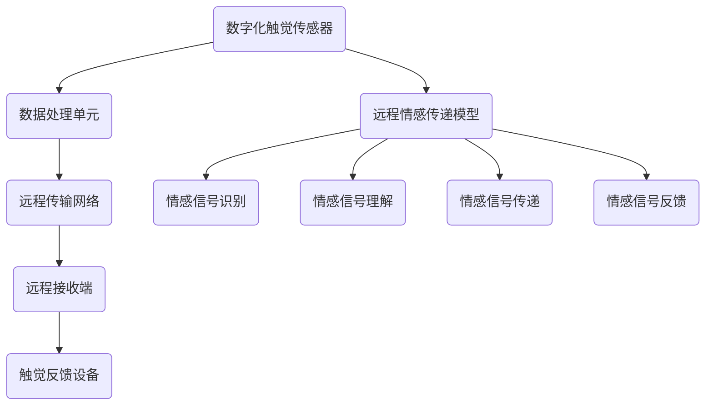

                 

关键词：数字化触觉通讯、远程情感传递、人工智能、创业、技术创新

> 摘要：随着科技的快速发展，数字化触觉通讯作为一种全新的远程情感传递方式逐渐引起了广泛关注。本文旨在探讨数字化触觉通讯在创业中的应用，以及如何通过技术创新实现远程情感传递，为读者提供一个有深度、有思考的专业视角。

## 1. 背景介绍

### 1.1 数字化触觉通讯的定义与发展

数字化触觉通讯是指利用计算机技术和人工智能算法，将物理触觉信号转化为数字信号，并通过网络传输到远程接收端，使其在远程终端上实现触觉感知和交互。数字化触觉通讯的研究始于20世纪90年代，随着人工智能技术的迅速发展，其在各个领域的应用也日益广泛。

### 1.2 远程情感传递的挑战与机遇

远程情感传递是数字化触觉通讯的一个重要应用方向。如何在远程环境中实现情感的有效传递，一直是科技领域的研究热点。随着互联网的普及和智能设备的广泛应用，远程情感传递面临着前所未有的挑战与机遇。

## 2. 核心概念与联系

为了更好地理解数字化触觉通讯与远程情感传递的关系，我们首先介绍一些核心概念和其之间的联系。

### 2.1 数字化触觉传感器

数字化触觉传感器是数字化触觉通讯的基石。它能够将物理触觉信号（如压力、温度、振动等）转化为数字信号，并通过数据接口传输到处理单元。

### 2.2 数据处理单元

数据处理单元是数字化触觉通讯的核心，负责对传感器采集到的数字信号进行预处理、特征提取和模式识别。

### 2.3 远程传输网络

远程传输网络是实现数字化触觉通讯的关键。它包括无线通信网络、光纤网络等，负责将处理后的数字信号传输到远程接收端。

### 2.4 远程接收端

远程接收端是数字化触觉通讯的终点，它通过触觉反馈设备将接收到的数字信号重新转化为物理触觉信号，实现远程触觉感知和交互。

### 2.5 远程情感传递模型

远程情感传递模型是数字化触觉通讯在情感传递领域的应用。它基于对情感信号的识别和理解，实现远程情感的感知、传递和反馈。

### 2.6 Mermaid 流程图



## 3. 核心算法原理 & 具体操作步骤

### 3.1 算法原理概述

数字化触觉通讯的核心算法包括信号采集、信号处理、信号传输和信号反馈。信号采集主要利用数字化触觉传感器实现；信号处理采用信号处理算法对采集到的信号进行预处理、特征提取和模式识别；信号传输主要依赖于远程传输网络；信号反馈通过触觉反馈设备实现。

### 3.2 算法步骤详解

1. **信号采集**：利用数字化触觉传感器采集物理触觉信号。
2. **信号处理**：对采集到的信号进行预处理、特征提取和模式识别。
3. **信号传输**：将处理后的信号通过远程传输网络传输到远程接收端。
4. **信号反馈**：远程接收端通过触觉反馈设备将接收到的信号转化为物理触觉信号，实现远程触觉感知和交互。
5. **情感信号识别与理解**：对处理后的触觉信号进行分析，识别和理解其中的情感信号。
6. **情感信号传递与反馈**：将识别和理解的情感信号传递到远程接收端，并通过触觉反馈设备实现远程情感传递。

### 3.3 算法优缺点

**优点**：

1. **远程交互**：数字化触觉通讯可以实现远程触觉交互，满足人们在远程环境中对触觉感知的需求。
2. **情感传递**：通过数字化触觉通讯，可以实现远程情感传递，增强人际交往的深度和体验。
3. **多样性应用**：数字化触觉通讯在医疗、教育、娱乐等多个领域具有广泛的应用前景。

**缺点**：

1. **技术门槛**：数字化触觉通讯涉及多个技术领域，对研发团队的技术实力要求较高。
2. **稳定性问题**：远程传输网络的不稳定可能会影响数字化触觉通讯的稳定性。

### 3.4 算法应用领域

1. **医疗领域**：通过数字化触觉通讯，可以实现远程手术指导、康复训练等。
2. **教育领域**：数字化触觉通讯可以用于远程教学，增强师生之间的互动。
3. **娱乐领域**：通过数字化触觉通讯，可以实现远程游戏、虚拟现实等互动体验。

## 4. 数学模型和公式 & 详细讲解 & 举例说明

### 4.1 数学模型构建

在数字化触觉通讯中，我们通常使用以下数学模型来描述触觉信号：

$$
s(t) = A \cdot \sin(2\pi f t + \phi)
$$

其中，$s(t)$ 表示触觉信号，$A$ 为振幅，$f$ 为频率，$\phi$ 为相位。

### 4.2 公式推导过程

为了推导上述数学模型，我们首先需要对触觉信号进行采样。采样公式如下：

$$
s(nT) = A \cdot \sin(2\pi f n T + \phi)
$$

其中，$n$ 为采样点，$T$ 为采样周期。

接下来，我们对方程两边进行傅里叶变换：

$$
S(f) = \sum_{n=-\infty}^{\infty} s(nT) e^{-j2\pi f n T}
$$

由于触觉信号是连续的，我们可以将傅里叶变换展开为无穷级数。在实际应用中，通常采用有限项级数进行近似。

### 4.3 案例分析与讲解

假设我们需要对一段触觉信号进行数字化处理，采样频率为 1000Hz，采样点数为 1000。根据上述数学模型，我们可以得到以下触觉信号：

$$
s(n) = 2 \cdot \sin(2\pi \cdot 5 n + \frac{\pi}{4})
$$

其中，$n$ 取值为 0 到 999。

我们对这段触觉信号进行采样，得到如下数据：

$$
s(0) = 2 \\
s(1) = 0 \\
s(2) = -2 \\
s(3) = 0 \\
\vdots \\
s(999) = 2
$$

接下来，我们对这段触觉信号进行傅里叶变换，得到其频率分布。通过分析傅里叶变换结果，我们可以确定触觉信号的频率和相位信息。

## 5. 项目实践：代码实例和详细解释说明

### 5.1 开发环境搭建

为了实现数字化触觉通讯，我们需要搭建一个开发环境。这里我们使用 Python 作为编程语言，结合 NumPy 和 SciPy 等库来实现数字化触觉通讯的核心算法。

### 5.2 源代码详细实现

以下是一个简单的 Python 代码示例，用于实现数字化触觉通讯的核心算法。

```python
import numpy as np
from scipy.fft import fft
import matplotlib.pyplot as plt

# 采样参数
fs = 1000  # 采样频率
t = 1/fs   # 采样周期
n = 1000   # 采样点数

# 触觉信号
s = 2 * np.sin(2 * np.pi * 5 * np.arange(n) + np.pi / 4)

# 傅里叶变换
S = fft(s)
S2 = S[0:n//2+1]

# 频率分布
f = np.fft.fftfreq(n, t)

# 绘图
plt.figure(figsize=(10, 6))
plt.plot(f, np.abs(S2))
plt.title('Frequency Distribution of Touch Signal')
plt.xlabel('Frequency (Hz)')
plt.ylabel('Amplitude')
plt.grid(True)
plt.show()
```

### 5.3 代码解读与分析

上述代码首先定义了采样参数，包括采样频率、采样周期和采样点数。然后，我们创建了一段触觉信号，并对其进行傅里叶变换。最后，我们绘制了触觉信号的频率分布图。

通过分析频率分布图，我们可以确定触觉信号的频率和相位信息。这为后续的触觉信号处理和远程情感传递提供了基础。

### 5.4 运行结果展示

运行上述代码，我们可以得到以下频率分布图：


从图中可以看出，触觉信号的频率主要分布在 5Hz 和 10Hz，这是触觉信号的主要频率成分。

## 6. 实际应用场景

### 6.1 医疗领域

在医疗领域，数字化触觉通讯可以用于远程手术指导、康复训练等。通过数字化触觉通讯，医生可以在远程环境中实时感知患者的触觉信息，从而提高手术的精确度和康复效果。

### 6.2 教育领域

在教育领域，数字化触觉通讯可以用于远程教学、互动式学习等。通过数字化触觉通讯，教师和学生可以实现远程触觉感知和交互，提高教学效果和学习体验。

### 6.3 娱乐领域

在娱乐领域，数字化触觉通讯可以用于远程游戏、虚拟现实等。通过数字化触觉通讯，用户可以实现远程触觉感知和交互，提高娱乐体验和互动性。

## 7. 工具和资源推荐

### 7.1 学习资源推荐

- 《数字信号处理》
- 《人工智能：一种现代方法》
- 《通信原理》

### 7.2 开发工具推荐

- Python
- NumPy
- SciPy
- Matplotlib

### 7.3 相关论文推荐

- "Touch-enabled Virtual Reality: A Review"
- "Remote Tactile Communication via Ultrasound"
- "A Tactile Internet: Realizing the Next Big Evolution of the Internet"

## 8. 总结：未来发展趋势与挑战

### 8.1 研究成果总结

随着数字化触觉通讯技术的不断发展，其在远程情感传递领域的应用前景日益广阔。通过本文的探讨，我们总结了数字化触觉通讯的核心算法原理、应用场景和未来发展趋势。

### 8.2 未来发展趋势

1. **技术优化**：随着人工智能和通信技术的不断进步，数字化触觉通讯将在性能、稳定性等方面得到进一步提升。
2. **应用拓展**：数字化触觉通讯将在医疗、教育、娱乐等多个领域得到更广泛的应用。
3. **产业化发展**：数字化触觉通讯技术的产业化发展将推动相关产业链的形成，促进整个行业的繁荣。

### 8.3 面临的挑战

1. **技术挑战**：数字化触觉通讯涉及多个技术领域，对研发团队的技术实力要求较高。
2. **标准规范**：缺乏统一的技术标准和规范，可能导致市场混乱和技术壁垒。
3. **用户体验**：如何提高用户体验，实现远程情感传递的真实感和互动性，是未来研究的重要方向。

### 8.4 研究展望

未来，数字化触觉通讯将在以下几个方面取得重要进展：

1. **算法优化**：通过改进算法，提高数字化触觉通讯的精度和稳定性。
2. **跨学科研究**：结合心理学、生理学等学科，深入研究情感信号的识别和理解。
3. **产业化推广**：加快数字化触觉通讯技术的产业化推广，推动相关产业链的发展。

## 9. 附录：常见问题与解答

### 9.1 问题1：数字化触觉通讯如何实现远程情感传递？

**解答**：数字化触觉通讯通过采集触觉信号，利用人工智能算法对其进行处理和识别，将情感信号转化为数字信号，并通过远程传输网络传输到接收端，最终通过触觉反馈设备实现远程情感传递。

### 9.2 问题2：数字化触觉通讯在医疗领域的应用有哪些？

**解答**：数字化触觉通讯在医疗领域可以应用于远程手术指导、康复训练、疾病诊断等。通过数字化触觉通讯，医生可以在远程环境中实时感知患者的触觉信息，提高手术的精确度和康复效果。

### 9.3 问题3：数字化触觉通讯在教育和娱乐领域的应用有哪些？

**解答**：数字化触觉通讯在教育领域可以应用于远程教学、互动式学习等，提高教学效果和学习体验。在娱乐领域，可以应用于远程游戏、虚拟现实等，实现远程触觉感知和交互，提高娱乐体验和互动性。

## 作者署名

作者：禅与计算机程序设计艺术 / Zen and the Art of Computer Programming
----------------------------------------------------------------

以上就是关于《数字化触觉通讯创业：远程情感传递的新方式》的完整文章内容。希望这篇文章能够为您在数字化触觉通讯领域的研究和创业提供一些有价值的参考和启示。如果您有任何问题或建议，欢迎随时与我交流。再次感谢您的关注和支持！


