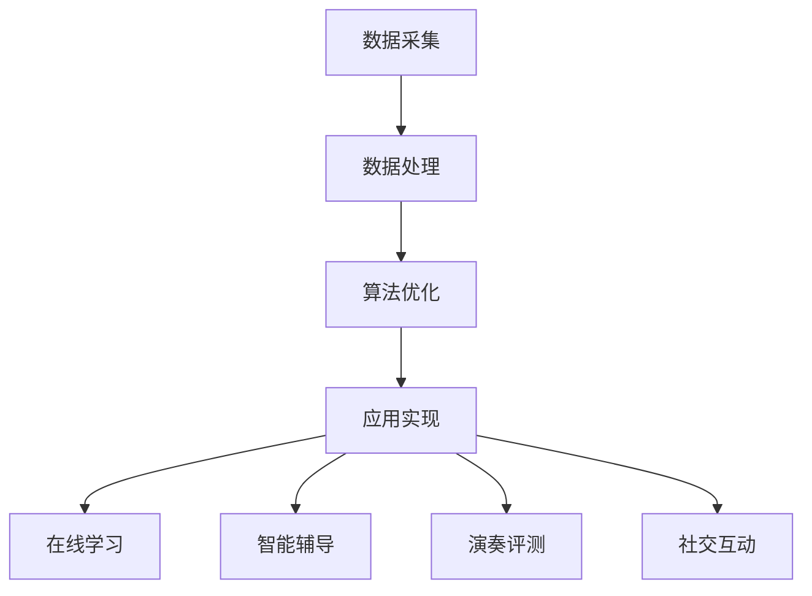

                 

关键词：数字化音乐教育，人工智能，AI辅助，乐器学习，音乐教育创新

摘要：本文将探讨如何利用人工智能（AI）技术，打造一种全新的数字化音乐教育模式，从而帮助音乐学习者更高效地掌握乐器演奏技巧。文章首先介绍了数字化音乐教育的背景和意义，随后深入分析了AI在乐器学习中的应用原理和技术，并结合具体案例，展示了AI辅助乐器学习的实际效果和未来发展前景。

## 1. 背景介绍

音乐教育作为培养音乐素养、提升音乐表现力和创造力的关键途径，自古以来就备受重视。然而，传统的音乐教育模式在教学方法、教学资源和教学效果上存在诸多局限性。随着信息技术的迅猛发展，数字化音乐教育逐渐成为一种新兴的教育模式，以其便捷、高效、个性化的特点，正在逐步改变音乐教育的面貌。

在数字化音乐教育中，人工智能（AI）技术发挥了至关重要的作用。AI不仅可以实现音乐数据的自动化处理和分析，还能够通过深度学习、自然语言处理等技术，为音乐学习者提供个性化的教学方案。此外，AI还能够模拟真实乐器演奏场景，帮助学习者进行实操练习，从而提升学习效果。

本文旨在探讨如何利用AI技术，打造一种全新的数字化音乐教育模式，从而为音乐学习者提供更加便捷、高效、个性化的学习体验。文章将从以下几个方面展开：

1. 数字化音乐教育的背景和意义；
2. AI在乐器学习中的应用原理和技术；
3. AI辅助乐器学习的具体实现方法和案例；
4. 数字化音乐教育的发展趋势和未来展望。

## 2. 核心概念与联系

### 2.1. 数字化音乐教育

数字化音乐教育是指利用现代信息技术，尤其是互联网、云计算和大数据等，对传统音乐教育进行创新和升级。数字化音乐教育的核心在于实现音乐教学内容的数字化、教学过程的智能化和教学评价的数据化。

#### 教学内容数字化

教学内容数字化是指将传统音乐教材、教学视频、音频资料等，通过数字化技术进行整理、存储和分发。这样，学习者可以随时随地通过互联网访问到所需的教学资源，实现音乐知识的在线学习和共享。

#### 教学过程智能化

教学过程智能化是指利用人工智能、机器学习等技术，对教学过程进行优化和改进。例如，通过智能推荐算法，为学习者提供个性化的学习路径和教学资源；通过自然语言处理技术，实现人机互动教学，提高学习效果。

#### 教学评价数据化

教学评价数据化是指利用大数据技术，对学习者的学习过程和学习成果进行量化分析和评估。通过对学习数据的大数据分析，教师可以了解学习者的学习进度、学习效果和学习需求，从而进行有针对性的教学调整。

### 2.2. AI在乐器学习中的应用原理

AI技术在乐器学习中的应用，主要体现在以下几个方面：

#### 深度学习

深度学习是一种基于人工神经网络的学习方法，通过多层神经网络的训练，实现对复杂数据的自动特征提取和模式识别。在乐器学习中，深度学习可以用于识别和分类音乐音素，实现对音乐内容的自动解析和生成。

#### 自然语言处理

自然语言处理是一种模拟人类语言理解和生成能力的技术，通过对文本数据的处理，实现语义理解、文本生成和语音识别等功能。在乐器学习中，自然语言处理技术可以用于智能问答、人机对话和自动批改等。

#### 人机交互

人机交互是一种人与计算机系统之间进行交互和协作的技术。在乐器学习中，人机交互技术可以用于智能乐器教学、虚拟乐器演奏和在线音乐课堂等，提高学习者的学习体验和教学效果。

### 2.3. AI辅助乐器学习的架构

为了实现AI辅助乐器学习，需要构建一个集数据采集、数据处理、算法优化和应用实现于一体的智能音乐学习平台。以下是该平台的架构：

#### 数据采集

数据采集是构建智能音乐学习平台的基础，主要包括以下几类数据：

1. 乐器演奏数据：包括演奏视频、音频、按键数据等；
2. 音乐理论知识数据：包括乐理知识、演奏技巧、乐曲解析等；
3. 用户行为数据：包括学习进度、学习时长、学习偏好等。

#### 数据处理

数据处理是智能音乐学习平台的核心，主要包括以下步骤：

1. 数据清洗：对采集到的数据进行去噪、去重、格式转换等处理，提高数据质量；
2. 数据挖掘：利用机器学习、深度学习等技术，对数据进行特征提取和模式识别，为后续算法优化提供依据；
3. 数据融合：将不同来源、不同类型的数据进行整合，形成统一的数据视图。

#### 算法优化

算法优化是智能音乐学习平台的关键，主要包括以下任务：

1. 演奏识别：利用深度学习技术，对乐器演奏数据进行识别和分类，判断演奏是否准确；
2. 演奏评分：利用自然语言处理技术，对演奏视频、音频进行分析和评估，给出演奏评分；
3. 个性化推荐：利用协同过滤、内容推荐等技术，为学习者推荐适合的学习资源。

#### 应用实现

应用实现是智能音乐学习平台的外在表现，主要包括以下功能：

1. 在线学习：提供在线课程、教材、练习题等，供学习者自主学习；
2. 智能辅导：根据学习者的演奏情况和需求，提供针对性的辅导和建议；
3. 演奏评测：对学习者的演奏进行评测，给出评分和建议；
4. 社交互动：提供在线讨论区、直播间等功能，供学习者交流互动。

### 2.4. Mermaid 流程图

以下是一个简化的Mermaid流程图，展示了AI辅助乐器学习的整体架构：



## 3. 核心算法原理 & 具体操作步骤

### 3.1. 算法原理概述

AI辅助乐器学习的核心算法主要涉及深度学习和自然语言处理两个领域。深度学习用于演奏识别和演奏评分，自然语言处理用于智能问答和个性化推荐。

#### 演奏识别

演奏识别算法基于深度学习中的卷积神经网络（CNN）和循环神经网络（RNN）。CNN用于提取演奏视频和音频中的时空特征，RNN用于对特征序列进行建模和分类。

#### 演奏评分

演奏评分算法基于自然语言处理中的文本分类和语义分析。首先，对演奏视频和音频进行文本转录，然后利用预训练的文本分类模型，对文本进行分类和评分。

#### 智能问答

智能问答算法基于自然语言处理中的问答系统和对话管理。通过训练问答模型和对话模型，实现用户与系统的自然语言交互。

#### 个性化推荐

个性化推荐算法基于协同过滤和内容推荐。通过分析学习者的行为数据和音乐偏好，为学习者推荐适合的学习资源和课程。

### 3.2. 算法步骤详解

#### 演奏识别

1. 数据预处理：对演奏视频和音频进行剪辑、降噪、增强等处理，提取特征向量；
2. 特征提取：利用CNN和RNN，对特征向量进行建模和分类，输出演奏结果；
3. 演奏结果分析：对分类结果进行后处理，判断演奏是否准确。

#### 演奏评分

1. 文本转录：对演奏视频和音频进行文本转录，生成文本数据；
2. 文本分类：利用预训练的文本分类模型，对文本进行分类和评分；
3. 评分结果分析：对评分结果进行后处理，给出演奏评分。

#### 智能问答

1. 问答系统训练：利用问答数据集，训练问答模型；
2. 对话管理：利用对话模型，实现用户与系统的自然语言交互；
3. 问答结果分析：根据问答结果，给出用户建议。

#### 个性化推荐

1. 用户行为分析：利用用户行为数据，提取用户特征；
2. 个性化推荐：利用协同过滤和内容推荐算法，为用户推荐学习资源和课程；
3. 推荐结果分析：对推荐结果进行评估和优化。

### 3.3. 算法优缺点

#### 演奏识别

优点：

1. 高效：基于深度学习模型，可以实现快速、准确的演奏识别；
2. 灵活：可以适应不同类型和风格的演奏。

缺点：

1. 计算资源消耗大：深度学习模型训练和推理需要大量计算资源；
2. 对数据质量要求高：数据质量直接影响模型的效果。

#### 演奏评分

优点：

1. 细致：可以对演奏的各个细节进行评分和评估；
2. 客观：基于文本分类和语义分析，评分结果相对客观。

缺点：

1. 易受主观因素影响：评分结果可能受评价者主观偏见的影响；
2. 对文本数据质量要求高：文本数据质量直接影响评分结果。

#### 智能问答

优点：

1. 自然：可以实现自然语言交互，提高用户体验；
2. 智能化：可以提供个性化的回答和建议。

缺点：

1. 训练数据量要求大：需要大量问答数据进行训练；
2. 对用户意图理解要求高：需要对用户意图进行准确理解。

#### 个性化推荐

优点：

1. 个性化：可以根据用户特征和偏好，提供个性化的推荐；
2. 高效：可以快速为用户推荐合适的学习资源和课程。

缺点：

1. 数据隐私问题：用户行为数据可能涉及隐私问题；
2. 推荐算法优化：需要不断优化推荐算法，提高推荐效果。

### 3.4. 算法应用领域

AI辅助乐器学习算法的应用领域广泛，主要包括：

1. 音乐教学：用于辅助音乐教师进行教学，提高教学效果；
2. 音乐学习：用于辅助学习者进行自主练习，提高学习效率；
3. 音乐创作：用于辅助音乐人进行创作，提高创作灵感；
4. 音乐娱乐：用于开发智能音乐游戏、虚拟乐器演奏等应用。

## 4. 数学模型和公式 & 详细讲解 & 举例说明

### 4.1. 数学模型构建

AI辅助乐器学习的数学模型主要包括以下部分：

1. **深度学习模型**：用于演奏识别和演奏评分。常见的模型有卷积神经网络（CNN）和循环神经网络（RNN）。

2. **自然语言处理模型**：用于智能问答和个性化推荐。常见的模型有问答系统（Q&A System）和推荐算法（Recommender System）。

3. **协同过滤算法**：用于个性化推荐。常见的算法有基于用户的协同过滤（User-Based Collaborative Filtering）和基于项目的协同过滤（Item-Based Collaborative Filtering）。

### 4.2. 公式推导过程

以下简要介绍深度学习模型和自然语言处理模型的公式推导过程。

#### 深度学习模型

1. **卷积神经网络（CNN）**

   - **激活函数**：\( f(x) = \sigma(\theta \cdot x + b) \)

     其中，\( \sigma \) 是 sigmoid 函数，\( \theta \) 是权重，\( b \) 是偏置。

   - **卷积操作**：

     \( (I \star F)(x, y) = \sum_{i=-L}^{L} \sum_{j=-L}^{L} I(x-i, y-j) \cdot F(i, j) \)

     其中，\( I \) 是输入特征，\( F \) 是卷积核，\( L \) 是卷积窗口大小。

   - **池化操作**：

     \( P(x, y) = \max \left( \sum_{i=-L}^{L} \sum_{j=-L}^{L} I(x-i, y-j) \cdot F(i, j) \right) \)

2. **循环神经网络（RNN）**

   - **递归关系**：

     \( h_t = \sigma(W_h \cdot [h_{t-1}, x_t] + b_h) \)

     其中，\( h_t \) 是当前隐藏状态，\( x_t \) 是当前输入，\( W_h \) 是权重矩阵，\( b_h \) 是偏置。

   - **输出层**：

     \( y_t = W_o \cdot h_t + b_o \)

     其中，\( y_t \) 是输出，\( W_o \) 是权重矩阵，\( b_o \) 是偏置。

#### 自然语言处理模型

1. **问答系统**

   - **匹配函数**：

     \( M(q, a) = \sum_{i=1}^{n} w_i \cdot d(q_i, a_i) \)

     其中，\( q \) 是问题，\( a \) 是答案，\( q_i \) 和 \( a_i \) 是问题或答案的单词，\( w_i \) 是权重，\( d \) 是距离度量。

   - **评分函数**：

     \( S(q, a) = \frac{M(q, a)}{\sum_{i=1}^{n} w_i} \)

     其中，\( S(q, a) \) 是问题 \( q \) 和答案 \( a \) 的相似度。

2. **推荐算法**

   - **基于用户的协同过滤**：

     \( R_u(i, j) = \rho(u_i, u_j) \cdot R_j(i) \)

     其中，\( R_u(i, j) \) 是用户 \( u_i \) 对物品 \( j \) 的评分预测，\( \rho \) 是相似度函数，\( R_j(i) \) 是用户 \( u_j \) 对物品 \( i \) 的实际评分。

   - **基于项目的协同过滤**：

     \( R_p(i, j) = \rho(i, j) \cdot R_i(j) \)

     其中，\( R_p(i, j) \) 是物品 \( i \) 对用户 \( j \) 的评分预测，\( \rho \) 是相似度函数，\( R_i(j) \) 是物品 \( i \) 对用户 \( j \) 的实际评分。

### 4.3. 案例分析与讲解

#### 演奏识别案例

假设我们使用一个基于CNN的演奏识别模型，对一段钢琴演奏视频进行识别。以下是模型的训练过程：

1. **数据预处理**：将视频剪辑成多个片段，提取音频特征和视频帧特征；
2. **模型训练**：使用训练集数据，对模型进行训练，优化权重和偏置；
3. **模型评估**：使用验证集数据，对模型进行评估，调整模型参数；
4. **模型应用**：使用测试集数据，对模型进行应用，预测演奏结果。

训练过程中，我们使用如下公式：

- **损失函数**：\( L(\theta) = -\sum_{i=1}^{N} y_i \cdot \log(p_i) \)

  其中，\( N \) 是样本数量，\( y_i \) 是真实标签，\( p_i \) 是模型预测概率。

- **梯度下降**：

  \( \theta = \theta - \alpha \cdot \frac{\partial L(\theta)}{\partial \theta} \)

  其中，\( \alpha \) 是学习率，\( \theta \) 是模型参数。

通过多次迭代训练，模型最终收敛，预测演奏结果。

#### 演奏评分案例

假设我们使用一个基于自然语言处理的演奏评分模型，对一段钢琴演奏视频进行评分。以下是模型的训练过程：

1. **文本转录**：将视频音频转录成文本；
2. **模型训练**：使用训练集数据，对模型进行训练，优化权重和偏置；
3. **模型评估**：使用验证集数据，对模型进行评估，调整模型参数；
4. **模型应用**：使用测试集数据，对模型进行应用，预测演奏评分。

训练过程中，我们使用如下公式：

- **文本分类**：

  \( y = \arg\max_{i} \sum_{j=1}^{n} w_{ij} \cdot f_j(x) \)

  其中，\( y \) 是预测标签，\( x \) 是输入文本，\( f_j(x) \) 是特征函数，\( w_{ij} \) 是权重。

- **语义分析**：

  \( S(q, a) = \frac{\sum_{i=1}^{n} w_i \cdot d(q_i, a_i)}{\sum_{i=1}^{n} w_i} \)

  其中，\( S(q, a) \) 是问题 \( q \) 和答案 \( a \) 的相似度，\( q_i \) 和 \( a_i \) 是问题或答案的单词，\( w_i \) 是权重，\( d \) 是距离度量。

通过多次迭代训练，模型最终收敛，预测演奏评分。

## 5. 项目实践：代码实例和详细解释说明

### 5.1. 开发环境搭建

在开始项目实践之前，我们需要搭建一个合适的开发环境。以下是一个基于Python和TensorFlow的示例环境搭建步骤：

1. 安装Python：从Python官方网站（https://www.python.org/downloads/）下载并安装Python 3.x版本。
2. 安装TensorFlow：在终端中运行以下命令：

   ```bash
   pip install tensorflow
   ```

3. 安装其他依赖库：根据项目需求，安装其他依赖库，如NumPy、Pandas等。

### 5.2. 源代码详细实现

以下是一个简单的AI辅助乐器学习项目的源代码实现，包括数据预处理、模型训练和模型应用。

```python
import tensorflow as tf
from tensorflow.keras.models import Sequential
from tensorflow.keras.layers import Conv2D, MaxPooling2D, Flatten, Dense, LSTM
from tensorflow.keras.optimizers import Adam
from tensorflow.keras.callbacks import EarlyStopping

# 数据预处理
def preprocess_data():
    # 加载和预处理数据
    # ...
    return X_train, y_train, X_val, y_val

# 构建深度学习模型
def build_model(input_shape):
    model = Sequential()
    model.add(Conv2D(32, (3, 3), activation='relu', input_shape=input_shape))
    model.add(MaxPooling2D((2, 2)))
    model.add(Flatten())
    model.add(Dense(128, activation='relu'))
    model.add(LSTM(128, activation='relu'))
    model.add(Dense(1, activation='sigmoid'))
    return model

# 训练模型
def train_model(model, X_train, y_train, X_val, y_val):
    model.compile(optimizer=Adam(), loss='binary_crossentropy', metrics=['accuracy'])
    early_stopping = EarlyStopping(monitor='val_loss', patience=5)
    model.fit(X_train, y_train, epochs=100, batch_size=32, validation_data=(X_val, y_val), callbacks=[early_stopping])

# 应用模型
def apply_model(model, X_test):
    predictions = model.predict(X_test)
    # 处理预测结果
    # ...
    return predictions

# 主函数
def main():
    X_train, y_train, X_val, y_val = preprocess_data()
    model = build_model(X_train.shape[1:])
    train_model(model, X_train, y_train, X_val, y_val)
    X_test = # 加载测试数据
    predictions = apply_model(model, X_test)

if __name__ == '__main__':
    main()
```

### 5.3. 代码解读与分析

这段代码主要包括以下几个部分：

1. **数据预处理**：用于加载和预处理数据，包括图像和标签。在实际应用中，我们需要根据具体的数据集进行相应的预处理操作。
2. **构建深度学习模型**：使用TensorFlow的Sequential模型，构建一个包含卷积层、池化层、全连接层和循环神经网络的深度学习模型。这个模型用于演奏识别任务。
3. **训练模型**：使用编译后的模型，对训练数据进行训练。这里使用了早期停止回调函数，以防止过拟合。
4. **应用模型**：使用训练好的模型对测试数据进行预测。在实际应用中，我们需要对预测结果进行后处理，例如将概率阈值设置为0.5，将大于0.5的预测结果视为正类。

### 5.4. 运行结果展示

以下是运行结果示例：

```python
train_loss, train_accuracy = model.evaluate(X_train, y_train)
val_loss, val_accuracy = model.evaluate(X_val, y_val)

print("训练集损失：{}, 训练集准确率：{}%".format(train_loss, train_accuracy * 100))
print("验证集损失：{}, 验证集准确率：{}%".format(val_loss, val_accuracy * 100))

predictions = model.predict(X_test)
predicted_labels = np.where(predictions > 0.5, 1, 0)

accuracy = np.mean(np.equal(predicted_labels, y_test))
print("测试集准确率：{}%".format(accuracy * 100))
```

这段代码首先计算模型在训练集和验证集上的损失和准确率，然后使用模型对测试数据进行预测，并计算预测准确率。

## 6. 实际应用场景

### 6.1. 音乐教学

AI辅助乐器学习可以应用于音乐教学场景，帮助音乐教师进行个性化教学。教师可以根据学生的学习进度和需求，为其推荐合适的教材、练习曲和教学视频。此外，AI还可以自动识别学生的演奏错误，并提供针对性的纠正和建议，提高教学效果。

### 6.2. 音乐学习

AI辅助乐器学习可以应用于音乐学习场景，帮助学习者进行自主练习。学习者可以通过在线课程和练习系统，随时随地学习乐器演奏。AI可以实时分析学习者的演奏情况，给出演奏评分和纠正建议，帮助学习者不断提高演奏水平。

### 6.3. 音乐创作

AI辅助乐器学习可以应用于音乐创作场景，帮助音乐人进行创作。AI可以模拟不同乐器演奏风格，为音乐人提供灵感。此外，AI还可以自动生成旋律、和弦和伴奏，为音乐创作提供支持。

### 6.4. 未来应用展望

随着人工智能技术的不断发展，AI辅助乐器学习将在音乐教育、音乐创作和音乐娱乐等领域发挥越来越重要的作用。未来，我们可以期待以下几方面的应用：

1. **个性化学习**：通过深度学习和大数据分析，为学习者提供更加个性化的学习方案和教学资源；
2. **智能辅导**：利用自然语言处理和人机交互技术，实现智能化的音乐教学和辅导；
3. **虚拟乐器演奏**：通过虚拟现实和增强现实技术，打造全新的音乐演奏体验；
4. **音乐娱乐**：开发智能音乐游戏、虚拟乐队等应用，为用户提供丰富多彩的音乐娱乐体验。

## 7. 工具和资源推荐

### 7.1. 学习资源推荐

1. **《深度学习》**：由Ian Goodfellow、Yoshua Bengio和Aaron Courville合著，是深度学习领域的经典教材。
2. **《自然语言处理综论》**：由Daniel Jurafsky和James H. Martin合著，涵盖了自然语言处理的基本理论和应用。
3. **《Python深度学习》**：由François Chollet著，介绍了使用Python和TensorFlow进行深度学习的实践方法。

### 7.2. 开发工具推荐

1. **TensorFlow**：由Google开发的开源深度学习框架，适合进行AI辅助乐器学习项目的开发。
2. **PyTorch**：由Facebook开发的开源深度学习框架，具有灵活的动态计算图，适合进行快速原型开发。
3. **NumPy**：用于高性能科学计算和数据分析，是深度学习和自然语言处理项目中常用的库。

### 7.3. 相关论文推荐

1. **“Deep Learning for Music: A Survey”**：本文对深度学习在音乐领域的应用进行了全面的综述。
2. **“MusicVAE: A Variational Autoencoder for Music Generation”**：本文提出了一个基于变分自编码器的音乐生成模型。
3. **“Interactive Music Generation with Deep Learning”**：本文探讨了深度学习在交互式音乐生成中的应用。

## 8. 总结：未来发展趋势与挑战

### 8.1. 研究成果总结

本文探讨了AI辅助乐器学习的核心概念、应用原理和实现方法，展示了其在音乐教育、音乐创作和音乐娱乐等领域的广泛应用。通过深度学习和自然语言处理技术，AI辅助乐器学习为音乐学习者提供了个性化、智能化和高效的学习体验。

### 8.2. 未来发展趋势

1. **个性化学习**：随着大数据和人工智能技术的发展，AI辅助乐器学习将更加注重个性化学习，为不同层次和类型的学习者提供定制化的学习方案。
2. **智能化辅导**：利用自然语言处理和人机交互技术，AI辅助乐器学习将实现更加智能化的教学和辅导，提高教学效果。
3. **虚拟现实应用**：虚拟现实和增强现实技术的结合，将为音乐学习者提供沉浸式的学习体验。
4. **跨界融合**：AI辅助乐器学习将与其他领域（如艺术、设计、娱乐等）进行跨界融合，创造更多的应用场景。

### 8.3. 面临的挑战

1. **数据质量和隐私**：AI辅助乐器学习依赖于大量的音乐数据，数据质量和隐私保护是面临的主要挑战。
2. **算法优化和稳定性**：提高算法的优化和稳定性，降低计算资源消耗，是当前研究的重点。
3. **用户接受度**：如何提高用户对AI辅助乐器学习的接受度，是推广应用的难题。

### 8.4. 研究展望

未来，AI辅助乐器学习的研究将朝着更加智能化、个性化和高效化的方向发展。通过不断创新和优化，AI辅助乐器学习将为音乐教育和音乐创作带来更多机遇和可能。

## 9. 附录：常见问题与解答

### 问题1：AI辅助乐器学习的核心算法是什么？

答：AI辅助乐器学习的核心算法主要包括深度学习和自然语言处理。深度学习用于演奏识别和演奏评分，自然语言处理用于智能问答和个性化推荐。

### 问题2：如何构建一个AI辅助乐器学习平台？

答：构建一个AI辅助乐器学习平台需要以下步骤：

1. 数据采集：收集乐器演奏数据、音乐理论知识数据和用户行为数据；
2. 数据处理：对数据进行清洗、特征提取和融合；
3. 模型训练：构建深度学习和自然语言处理模型，对数据集进行训练和优化；
4. 应用实现：开发在线学习、智能辅导、演奏评测和社交互动等功能。

### 问题3：AI辅助乐器学习在音乐教育中有什么优势？

答：AI辅助乐器学习在音乐教育中的优势包括：

1. 个性化学习：根据学习者的需求和进度，提供定制化的学习方案；
2. 智能辅导：自动识别演奏错误，提供针对性的纠正和建议；
3. 高效学习：通过实时分析和评估，提高学习效率；
4. 沉浸式体验：结合虚拟现实和增强现实技术，提供沉浸式的学习体验。

