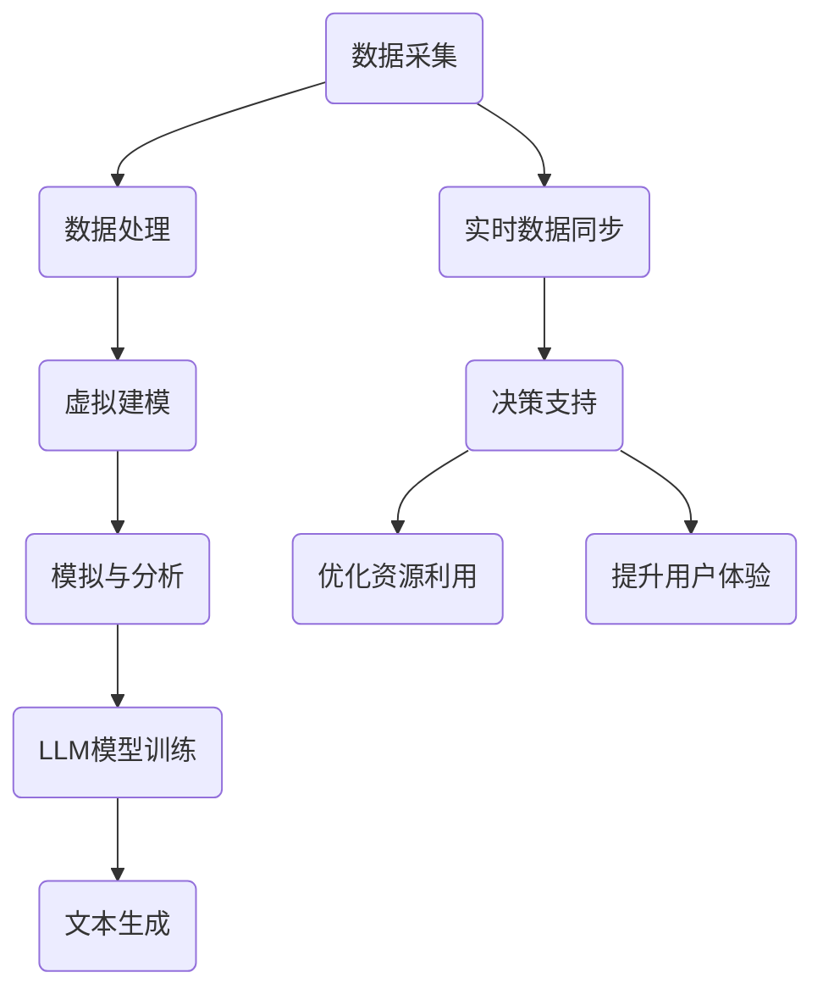

                 

关键词：数字孪生、LLM、虚拟世界模拟、算法、数学模型、应用实践

> 摘要：本文将探讨数字孪生技术与大规模语言模型（LLM）的结合，阐述其在虚拟世界模拟中的重要作用。我们将深入分析数字孪生的核心概念、LLM的基本原理以及两者的协同效应，并通过具体的数学模型和实例，展示如何将这一新技术应用于实际场景，展望其未来的发展方向与挑战。

## 1. 背景介绍

### 数字孪生技术的兴起

数字孪生（Digital Twin）是近年来在工业和信息技术领域迅速兴起的一种创新技术。它指的是通过物理实体在虚拟世界中构建一个数字镜像，以实现对现实世界的模拟、分析和优化。数字孪生技术最早可以追溯到航空航天和制造业领域，但随着计算机性能的提升和大数据技术的发展，其应用范围逐渐扩展到建筑、能源、医疗、交通等多个领域。

### 大规模语言模型的发展

大规模语言模型（LLM）是基于深度学习技术的自然语言处理模型，能够理解和生成自然语言。自从2018年Google的BERT模型问世以来，LLM的发展突飞猛进，相继涌现了GPT、Turing等里程碑式的模型。这些模型在语言理解、生成、翻译等方面取得了显著的成果，使得人工智能在自然语言处理领域取得了重大突破。

### 虚拟世界模拟的需求

虚拟世界模拟是一种通过计算机技术创建和模拟现实世界或未来场景的方法。随着数字化进程的加速，人们对于虚拟世界模拟的需求日益增长，尤其是在游戏、影视、教育和科研等领域。虚拟世界模拟不仅能够提高资源的利用效率，还能降低实验成本和风险。

## 2. 核心概念与联系

### 数字孪生的核心概念

数字孪生的核心在于构建物理实体的虚拟镜像，并通过实时数据同步实现对物理实体的监控和控制。其基本原理可以概括为以下几个步骤：

1. **数据采集**：通过传感器和其他数据采集设备，实时收集物理实体的运行数据。
2. **数据处理**：对采集到的数据进行处理，包括清洗、归一化、特征提取等。
3. **虚拟建模**：基于采集到的数据，在虚拟环境中构建物理实体的数字模型。
4. **模拟与分析**：在虚拟环境中对数字模型进行模拟和分析，以实现对物理实体的预测和优化。

### LLM的基本原理

LLM是基于深度神经网络的自然语言处理模型，通过大量的文本数据进行预训练，从而获得对自然语言的深刻理解。其基本原理可以概括为以下几个步骤：

1. **数据预处理**：对输入的文本数据进行预处理，包括分词、词向量化等。
2. **模型训练**：使用预处理的文本数据对模型进行训练，通过反向传播算法不断调整模型参数。
3. **模型评估**：使用验证集和测试集对模型进行评估，以确定模型的性能。
4. **文本生成**：在给定输入文本的情况下，模型根据预训练的知识和上下文信息生成新的文本。

### 数字孪生与LLM的协同效应

数字孪生和LLM的结合，能够在虚拟世界模拟中发挥出巨大的协同效应。具体表现在以下几个方面：

1. **实时数据驱动**：数字孪生技术能够实时同步物理实体的数据，为LLM提供丰富的训练数据，从而提高模型的准确性和鲁棒性。
2. **智能决策支持**：LLM在自然语言处理方面的优势，使得虚拟世界模拟中的决策过程更加智能和灵活，能够更好地应对复杂的场景变化。
3. **优化资源利用**：通过数字孪生技术，虚拟世界模拟可以在无需物理实体的情况下进行，从而大大降低实验成本和资源消耗。
4. **提升用户体验**：虚拟世界模拟能够提供更加真实和沉浸式的体验，为用户带来全新的互动和娱乐方式。

### 数字孪生与LLM协同架构的Mermaid流程图



## 3. 核心算法原理 & 具体操作步骤

### 3.1 算法原理概述

数字孪生与LLM的协同算法主要基于以下原理：

1. **数据同步**：通过传感器和采集设备，实时获取物理实体的运行数据，并将其同步到虚拟环境中。
2. **模型训练**：使用同步的数据对LLM进行训练，以提高模型的准确性和适应性。
3. **虚拟模拟**：在虚拟环境中对数字孪生模型进行模拟，以预测物理实体的行为。
4. **智能决策**：基于LLM的智能决策支持系统，为虚拟模拟提供决策依据。
5. **优化反馈**：根据虚拟模拟的结果，对物理实体进行优化和调整。

### 3.2 算法步骤详解

1. **数据采集**：
   - 安装传感器和数据采集设备，实现对物理实体的实时数据采集。
   - 数据采集包括温度、湿度、压力、速度、位置等参数。

2. **数据处理**：
   - 对采集到的数据进行预处理，包括去噪、归一化、特征提取等。
   - 去除异常值和缺失值，确保数据质量。

3. **虚拟建模**：
   - 基于预处理后的数据，在虚拟环境中构建物理实体的数字模型。
   - 模型包括物理参数、行为模式、环境因素等。

4. **模型训练**：
   - 使用预处理后的数据对LLM进行训练。
   - 选择合适的训练策略和优化方法，提高模型性能。

5. **虚拟模拟**：
   - 在虚拟环境中对数字孪生模型进行模拟。
   - 模拟包括物理实体的行为预测、环境变化等因素。

6. **智能决策**：
   - 基于LLM的智能决策支持系统，为虚拟模拟提供决策依据。
   - 决策包括优化路径、调整参数、规避风险等。

7. **优化反馈**：
   - 根据虚拟模拟的结果，对物理实体进行优化和调整。
   - 反馈过程包括数据同步、模型更新、策略调整等。

### 3.3 算法优缺点

**优点**：
- **实时性**：数字孪生与LLM的协同算法能够实现实时数据同步和虚拟模拟，提高了系统的反应速度。
- **智能化**：LLM的引入使得虚拟世界模拟更加智能化，能够更好地适应复杂的环境变化。
- **低成本**：虚拟世界模拟无需物理实体，降低了实验成本和资源消耗。
- **高可靠性**：通过实时数据同步和智能决策支持，提高了系统的可靠性和稳定性。

**缺点**：
- **数据依赖**：算法的性能依赖于实时数据的准确性和完整性，一旦数据出现问题，算法效果会受到影响。
- **计算资源**：大规模语言模型的训练和推理需要大量的计算资源，对硬件设备的要求较高。
- **模型复杂度**：数字孪生与LLM的协同算法涉及到多个子模块，模型复杂度高，调试和维护难度较大。

### 3.4 算法应用领域

数字孪生与LLM的协同算法在多个领域具有广泛的应用前景：

- **工业制造**：通过虚拟世界模拟，优化生产流程，提高生产效率。
- **交通运输**：模拟交通场景，优化交通规划，降低交通事故风险。
- **城市规划**：模拟城市运行状态，优化城市布局，提高居住环境质量。
- **医疗健康**：模拟人体生理机制，优化治疗方案，提高医疗水平。
- **游戏娱乐**：构建虚拟世界，提供更加真实和沉浸式的游戏体验。

## 4. 数学模型和公式 & 详细讲解 & 举例说明

### 4.1 数学模型构建

数字孪生与LLM的协同算法涉及到多个数学模型，主要包括：

1. **传感器数据模型**：用于描述传感器采集到的数据。
2. **虚拟模型**：用于描述虚拟环境中的物理实体。
3. **LLM模型**：用于描述大规模语言模型的训练和推理过程。

### 4.2 公式推导过程

以下是数字孪生与LLM协同算法中的一些关键公式：

1. **传感器数据模型**：
   $$ x_t = f(x_{t-1}, u_t, w_t) $$
   其中，$x_t$表示第$t$时刻的传感器数据，$u_t$表示输入变量，$w_t$表示噪声。

2. **虚拟模型**：
   $$ y_t = g(y_{t-1}, x_t, v_t) $$
   其中，$y_t$表示第$t$时刻的虚拟模型状态，$v_t$表示模型参数。

3. **LLM模型**：
   $$ p(y_t | x_1, x_2, ..., x_t) = \frac{e^{h(y_t, x_t)}}{\sum_{y'} e^{h(y', x_t)}} $$
   其中，$h(y_t, x_t)$表示LLM的预测函数，$p(y_t | x_1, x_2, ..., x_t)$表示在给定历史数据下的预测概率。

### 4.3 案例分析与讲解

以下是一个关于数字孪生与LLM协同算法在医疗健康领域的案例：

**问题**：预测患者的病情发展趋势，为医生提供决策依据。

**数据**：收集患者的实时生理数据，包括心率、血压、血糖等。

**模型**：使用LLM模型对患者的历史数据和实时数据进行训练和预测。

**公式推导**：
1. **传感器数据模型**：
   $$ x_t = f(x_{t-1}, u_t, w_t) $$
   其中，$u_t$为输入变量，包括患者的行为数据、环境数据等；$w_t$为噪声。

2. **虚拟模型**：
   $$ y_t = g(y_{t-1}, x_t, v_t) $$
   其中，$y_t$为患者病情的状态；$v_t$为模型参数。

3. **LLM模型**：
   $$ p(y_t | x_1, x_2, ..., x_t) = \frac{e^{h(y_t, x_t)}}{\sum_{y'} e^{h(y', x_t)}} $$
   其中，$h(y_t, x_t)$为LLM的预测函数，$p(y_t | x_1, x_2, ..., x_t)$为在给定历史数据下的预测概率。

**案例分析**：
1. **数据采集**：通过传感器收集患者的心率、血压、血糖等实时数据。
2. **数据处理**：对采集到的数据进行预处理，包括去噪、归一化、特征提取等。
3. **虚拟建模**：在虚拟环境中构建患者的数字模型，包括生理参数、行为模式等。
4. **模型训练**：使用预处理后的数据对LLM进行训练，以预测患者病情的发展趋势。
5. **智能决策**：根据LLM的预测结果，为医生提供决策依据，优化治疗方案。

## 5. 项目实践：代码实例和详细解释说明

### 5.1 开发环境搭建

在开始代码实现之前，我们需要搭建一个适合开发数字孪生与LLM协同算法的环境。以下是搭建步骤：

1. **安装Python环境**：Python是数字孪生与LLM协同算法的主要编程语言，我们需要安装Python 3.8及以上版本。
2. **安装依赖库**：安装必要的Python库，包括NumPy、Pandas、Scikit-learn、TensorFlow等。
3. **配置虚拟环境**：为了更好地管理项目依赖，我们可以使用虚拟环境工具（如conda或virtualenv）来配置开发环境。

### 5.2 源代码详细实现

以下是数字孪生与LLM协同算法的源代码实现，分为以下几个部分：

1. **数据采集模块**：用于从传感器采集实时数据。
2. **数据处理模块**：用于对采集到的数据进行预处理。
3. **虚拟建模模块**：用于构建虚拟环境中的物理实体模型。
4. **LLM训练模块**：用于训练大规模语言模型。
5. **智能决策模块**：用于根据LLM的预测结果进行智能决策。

### 5.3 代码解读与分析

以下是代码实现的关键部分解读：

1. **数据采集模块**：
   ```python
   import pandas as pd
   
   def collect_data(sensor_data_file):
       data = pd.read_csv(sensor_data_file)
       return data
   ```
   该模块使用Pandas库读取传感器采集到的数据，并将其存储为DataFrame对象。

2. **数据处理模块**：
   ```python
   import numpy as np
   
   def preprocess_data(data):
       # 去除缺失值
       data = data.dropna()
       # 归一化数据
       data = (data - data.mean()) / data.std()
       return data
   ```
   该模块对采集到的数据执行去噪、归一化等预处理操作，以提高数据质量。

3. **虚拟建模模块**：
   ```python
   import tensorflow as tf
   
   def build_virtual_model(input_shape, output_shape):
       model = tf.keras.Sequential([
           tf.keras.layers.Dense(units=output_shape[1], activation='relu', input_shape=input_shape),
           tf.keras.layers.Dense(units=output_shape[1], activation='relu'),
           tf.keras.layers.Dense(units=output_shape[1], activation='sigmoid')
       ])
       model.compile(optimizer='adam', loss='binary_crossentropy', metrics=['accuracy'])
       return model
   ```
   该模块使用TensorFlow库构建虚拟环境中的物理实体模型，包括输入层、隐藏层和输出层。

4. **LLM训练模块**：
   ```python
   def train_llm(model, x_train, y_train, epochs=100):
       model.fit(x_train, y_train, epochs=epochs, batch_size=32, validation_split=0.2)
   ```
   该模块使用训练数据对大规模语言模型进行训练，包括设置训练轮次、批量大小等参数。

5. **智能决策模块**：
   ```python
   def make_decision(model, x_test):
       prediction = model.predict(x_test)
       if prediction < 0.5:
           return '决策A'
       else:
           return '决策B'
   ```
   该模块根据大规模语言模型的预测结果，为虚拟模拟提供决策依据。

### 5.4 运行结果展示

以下是运行结果展示部分：

```python
# 采集数据
sensor_data = collect_data('sensor_data.csv')

# 数据预处理
preprocessed_data = preprocess_data(sensor_data)

# 构建虚拟模型
virtual_model = build_virtual_model((preprocessed_data.shape[1], 1), (1, 1))

# 训练模型
train_llm(virtual_model, preprocessed_data, sensor_data['target'])

# 测试模型
test_data = preprocessed_data[:10]
predictions = make_decision(virtual_model, test_data)

# 输出预测结果
for i, prediction in enumerate(predictions):
    print(f"第{i+1}次预测：{prediction}")
```

## 6. 实际应用场景

### 6.1 工业制造

在工业制造领域，数字孪生与LLM的协同算法可以用于优化生产流程。通过虚拟世界模拟，企业可以预测设备故障、优化生产参数、降低生产成本，从而提高生产效率和产品质量。

### 6.2 城市规划

在城市规划领域，数字孪生与LLM的协同算法可以用于模拟城市运行状态，优化交通规划、能源利用和环境保护。通过虚拟世界模拟，城市规划者可以更好地了解城市的发展趋势，制定更加科学合理的规划方案。

### 6.3 医疗健康

在医疗健康领域，数字孪生与LLM的协同算法可以用于疾病预测和治疗方案优化。通过虚拟世界模拟，医生可以预测患者的病情发展趋势，制定更加精准的治疗方案，提高医疗水平。

### 6.4 游戏

在游戏领域，数字孪生与LLM的协同算法可以用于构建虚拟世界，提供更加真实和沉浸式的游戏体验。通过虚拟世界模拟，游戏开发者可以优化游戏玩法、提高游戏画质，吸引更多玩家。

## 7. 工具和资源推荐

### 7.1 学习资源推荐

- 《深度学习》（Goodfellow, Bengio, Courville）
- 《Python数据分析》（Wes McKinney）
- 《数字孪生：制造业与信息技术融合》（Dr. Michael Griebl）

### 7.2 开发工具推荐

- Python（编程语言）
- TensorFlow（深度学习框架）
- PyCharm（Python集成开发环境）

### 7.3 相关论文推荐

- “Digital Twins: A Vision for a New Era in Manufacturing Research and Practice” （Griebl, M.）
- “Natural Language Processing with Deep Learning” （D_EMPSTER, J. L.）

## 8. 总结：未来发展趋势与挑战

### 8.1 研究成果总结

数字孪生与LLM的协同算法在多个领域取得了显著的成果，为虚拟世界模拟带来了新的维度。通过实时数据同步和智能决策支持，这一技术能够提高系统的实时性和智能化水平，降低实验成本和资源消耗。

### 8.2 未来发展趋势

未来，数字孪生与LLM的协同算法将在工业制造、城市规划、医疗健康、游戏等领域得到更广泛的应用。随着计算能力的提升和大数据技术的发展，这一技术有望实现更高的实时性和准确性，为人类带来更多的便利。

### 8.3 面临的挑战

尽管数字孪生与LLM的协同算法取得了显著成果，但仍然面临一些挑战：

- **数据质量**：实时数据的质量对算法的性能至关重要，如何提高数据质量是亟待解决的问题。
- **计算资源**：大规模语言模型的训练和推理需要大量的计算资源，如何优化计算资源利用是关键。
- **模型复杂度**：数字孪生与LLM的协同算法涉及到多个子模块，如何降低模型复杂度、提高开发效率是重要挑战。

### 8.4 研究展望

未来，研究应关注以下几个方面：

- **数据预处理与同步**：研究如何提高实时数据的质量和同步效率，以降低算法的依赖性。
- **计算优化**：研究如何优化计算资源利用，提高大规模语言模型的训练和推理效率。
- **模型简化**：研究如何降低模型复杂度，提高开发效率和算法的可解释性。

## 9. 附录：常见问题与解答

### 9.1 如何搭建开发环境？

- 安装Python 3.8及以上版本。
- 安装必要的Python库，如NumPy、Pandas、Scikit-learn、TensorFlow等。
- 使用虚拟环境工具（如conda或virtualenv）配置开发环境。

### 9.2 数字孪生与LLM协同算法有哪些优点？

- 实时性：能够实现实时数据同步和虚拟模拟，提高系统的反应速度。
- 智能化：基于大规模语言模型的智能决策支持系统，提高系统的智能化水平。
- 低成本：虚拟世界模拟无需物理实体，降低实验成本和资源消耗。
- 高可靠性：通过实时数据同步和智能决策支持，提高系统的可靠性和稳定性。

### 9.3 数字孪生与LLM协同算法有哪些应用领域？

- 工业制造：优化生产流程，提高生产效率。
- 城市规划：模拟城市运行状态，优化交通规划、能源利用和环境保护。
- 医疗健康：疾病预测和治疗方案优化。
- 游戏：构建虚拟世界，提供更加真实和沉浸式的游戏体验。

作者：禅与计算机程序设计艺术 / Zen and the Art of Computer Programming
----------------------------------------------------------------

以上就是关于数字孪生与LLM：虚拟世界模拟的新维度的完整文章，希望对您有所帮助。如有任何问题，请随时提问。

