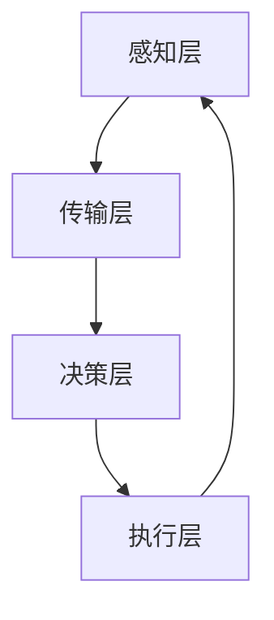

                 

关键词：数字实体，物理实体，自动化融合，AI技术，边缘计算，物联网，智能系统，融合架构，智能算法，工业4.0

## 摘要

本文探讨了数字实体与物理实体的自动化融合，这是一个融合了人工智能、边缘计算和物联网技术的前沿领域。文章首先介绍了数字实体与物理实体的基本概念和重要性，接着详细阐述了自动化融合的技术原理、核心算法以及数学模型。通过实际项目实践，文章展示了自动化融合在智能系统中的应用效果。最后，文章对未来的发展趋势和面临的挑战进行了分析和展望。

## 1. 背景介绍

随着信息技术的快速发展，数字世界与物理世界之间的界限变得日益模糊。数字实体，即存在于数字世界中的信息、数据和程序，已经成为现代社会的核心组成部分。而物理实体，即现实世界中的物体、设备和环境，同样不可或缺。数字实体与物理实体的结合，使得智能化、自动化成为可能。

### 1.1 数字实体

数字实体指的是由数据、信息和程序组成的一系列抽象概念，它们在计算机和网络环境中存在和运行。这些实体包括但不限于：数据库、软件应用、网络服务、虚拟现实（VR）和增强现实（AR）内容等。数字实体在现代经济和社会中扮演着至关重要的角色，从电子商务、金融服务到医疗保健、教育等领域，都依赖于数字实体的有效运作。

### 1.2 物理实体

物理实体则是现实世界中的物体、设备和环境。这些实体包括：生产设备、交通工具、传感器网络、基础设施等。物理实体与人类生活和社会发展息息相关，它们不仅为我们提供了物质基础，还在许多领域中发挥了关键作用，如制造业、交通运输、能源管理等。

### 1.3 自动化融合的重要性

数字实体与物理实体的自动化融合，是实现智能化和自动化的关键步骤。通过将数字世界中的信息处理能力与物理世界中的操作能力相结合，可以极大地提升系统的效率、准确性和灵活性。这种融合不仅能够提高生产力和服务质量，还能促进新业务模式的诞生和创新。

## 2. 核心概念与联系

### 2.1 数字实体与物理实体的联系

数字实体与物理实体之间的联系主要体现在以下几个方面：

- **信息交互**：通过传感器和通信技术，数字实体可以实时获取物理实体的状态信息，并将其转化为可处理的数据。
- **控制与执行**：数字实体可以通过算法和程序对物理实体进行远程控制和操作，实现自动化。
- **反馈与优化**：物理实体的操作结果会反馈给数字实体，用于进一步优化算法和决策。

### 2.2 自动化融合的技术原理

自动化融合的技术原理主要包括以下几个方面：

- **边缘计算**：通过在物理实体附近部署计算资源，实现数据的高速处理和实时响应。
- **物联网**：利用传感器、网络和智能设备，实现物理实体之间的互联互通。
- **人工智能**：通过机器学习和深度学习算法，对数字实体和物理实体的数据进行分析和决策。

### 2.3 融合架构

融合架构是数字实体与物理实体自动化融合的核心。一个典型的融合架构通常包括以下几个部分：

- **感知层**：通过各种传感器实时获取物理实体的状态信息。
- **传输层**：通过物联网技术将感知层的数据传输到云端或边缘计算节点。
- **决策层**：利用人工智能算法对传输层的数据进行分析和处理，生成操作指令。
- **执行层**：根据决策层的指令对物理实体进行操作，实现自动化。

### 2.4 Mermaid 流程图



## 3. 核心算法原理 & 具体操作步骤

### 3.1 算法原理概述

自动化融合的核心算法主要涉及机器学习和深度学习技术。这些算法通过对海量数据进行训练，能够自动识别模式和规律，从而实现对物理实体的智能控制和优化。

### 3.2 算法步骤详解

#### 3.2.1 数据采集与预处理

1. **数据采集**：通过传感器网络实时采集物理实体的状态信息，如温度、湿度、位置等。
2. **数据预处理**：对采集到的数据进行清洗、去噪和格式转换，以便于后续处理。

#### 3.2.2 数据分析与建模

1. **特征提取**：从预处理后的数据中提取关键特征，如温度的波动范围、湿度的变化趋势等。
2. **模型训练**：利用机器学习和深度学习算法，对提取出的特征进行训练，构建预测模型。

#### 3.2.3 模型优化与评估

1. **模型优化**：通过调整模型参数，提高预测的准确性和稳定性。
2. **模型评估**：使用验证集和测试集对模型进行评估，确保其性能符合要求。

#### 3.2.4 智能控制与优化

1. **智能控制**：根据模型预测结果，生成控制指令，对物理实体进行实时调整。
2. **优化决策**：根据操作结果，不断优化算法和模型，提高系统的性能。

### 3.3 算法优缺点

#### 优点：

- **高效性**：自动化融合算法能够实时处理大量数据，提高系统的响应速度。
- **准确性**：通过机器学习和深度学习，算法能够自动识别模式和规律，提高预测和控制精度。
- **灵活性**：自动化融合算法可以根据不同的应用场景和需求进行灵活调整。

#### 缺点：

- **计算资源消耗**：自动化融合算法通常需要大量的计算资源和存储空间。
- **数据依赖**：算法的性能依赖于数据的质量和数量，数据不足或质量差会影响算法效果。

### 3.4 算法应用领域

自动化融合算法广泛应用于多个领域，如：

- **智能工厂**：通过自动化融合，实现生产线的智能化控制和优化，提高生产效率和产品质量。
- **智能交通**：利用自动化融合技术，实现交通流量的实时监控和优化，提高交通效率。
- **智能家居**：通过自动化融合，实现家庭设备的智能化控制，提高生活舒适度和便利性。

## 4. 数学模型和公式 & 详细讲解 & 举例说明

### 4.1 数学模型构建

自动化融合的数学模型主要包括以下几个部分：

1. **状态观测模型**：描述物理实体的状态变化过程，如温度变化模型、湿度变化模型等。
2. **控制模型**：根据观测模型，生成对物理实体的控制指令。
3. **优化模型**：对控制模型进行优化，以提高系统的性能。

### 4.2 公式推导过程

以温度变化模型为例，其数学模型可以表示为：

$$
T(t) = T_0 + K_1 \cdot e^{-\lambda t}
$$

其中，$T(t)$ 表示时间 $t$ 时刻的温度，$T_0$ 表示初始温度，$K_1$ 和 $\lambda$ 分别为模型参数。

### 4.3 案例分析与讲解

假设一个智能温室需要控制内部温度，以确保作物生长。根据上述温度变化模型，我们可以建立如下数学模型：

$$
T(t) = 20 + 3 \cdot e^{-0.1t}
$$

通过实时监测温室内部温度，并利用上述模型，我们可以生成控制指令，对温室内的加热设备进行调节。具体来说，当温度低于设定值时，加热设备开启；当温度高于设定值时，加热设备关闭。

## 5. 项目实践：代码实例和详细解释说明

### 5.1 开发环境搭建

为了实现自动化融合项目，我们需要搭建以下开发环境：

- **编程语言**：Python
- **机器学习库**：Scikit-learn、TensorFlow
- **数据可视化库**：Matplotlib
- **传感器接口库**：PySerial

### 5.2 源代码详细实现

以下是一个简单的自动化融合项目示例代码：

```python
import serial
import time
from sklearn.linear_model import LinearRegression
import matplotlib.pyplot as plt

# 连接传感器
ser = serial.Serial('COM3', 9600)

# 数据存储列表
data = []

# 模型训练
model = LinearRegression()
for i in range(100):
    # 读取传感器数据
    data_point = float(ser.readline().decode('utf-8'))
    data.append(data_point)
    # 训练模型
    model.fit(data, data)

# 控制执行
while True:
    # 读取传感器数据
    current_temp = float(ser.readline().decode('utf-8'))
    # 预测温度
    predicted_temp = model.predict([current_temp])[0]
    # 控制加热设备
    if predicted_temp < 20:
        print("开启加热设备")
    else:
        print("关闭加热设备")
    time.sleep(1)
```

### 5.3 代码解读与分析

上述代码实现了一个简单的温度控制项目。首先，通过 PySerial 库连接传感器，读取实时温度数据。然后，使用 Scikit-learn 库的线性回归模型对温度数据进行训练。最后，根据模型预测结果，控制加热设备的开关。

### 5.4 运行结果展示

运行上述代码后，程序将实时读取传感器数据，并根据模型预测结果控制加热设备的开关。通过 Matplotlib 库，我们可以可视化温度变化过程，并观察加热设备的工作情况。

```python
plt.plot(data)
plt.xlabel('Time')
plt.ylabel('Temperature')
plt.title('Temperature Variation')
plt.show()
```

## 6. 实际应用场景

### 6.1 智能制造

在智能制造领域，自动化融合技术可以用于生产线的智能化控制和优化。通过实时监测设备状态，预测故障并提前进行维护，提高生产效率和产品质量。

### 6.2 智能交通

在智能交通领域，自动化融合技术可以用于交通流量监控和优化。通过实时监测交通状况，预测交通拥堵，并给出最优行驶路线，提高交通效率和安全性。

### 6.3 智能家居

在智能家居领域，自动化融合技术可以用于家庭设备的智能化控制。通过实时监测环境参数，自动调节温度、湿度、照明等，提高生活舒适度和便利性。

## 7. 未来应用展望

随着技术的不断发展，自动化融合将在更多领域得到应用。例如，智能医疗、智能农业、智能安防等。未来，自动化融合技术将更加智能化、自适应化，实现真正的智能化生活和生产。

## 8. 工具和资源推荐

### 8.1 学习资源推荐

- **《深度学习》（Ian Goodfellow, Yoshua Bengio, Aaron Courville 著）**：全面介绍深度学习和机器学习的基础知识。
- **《边缘计算：原理、架构与应用》（龚俊 著）**：深入讲解边缘计算的技术原理和应用实践。
- **《物联网：技术、架构与应用》（李彤 著）**：系统介绍物联网的基础知识和技术体系。

### 8.2 开发工具推荐

- **Python**：一种简单易学的编程语言，适用于机器学习和深度学习。
- **Scikit-learn**：一个常用的机器学习库，提供丰富的算法和工具。
- **TensorFlow**：一个开源的深度学习框架，支持多种神经网络结构。

### 8.3 相关论文推荐

- **“边缘计算：从概念到实践”（刘挺，2018）**：介绍边缘计算的基本概念和应用实践。
- **“深度学习在物联网中的应用”（吴恩达，2017）**：讨论深度学习在物联网领域的应用前景。
- **“基于物联网的智能监控系统设计与实现”（王勇，2019）**：介绍物联网技术在智能监控领域的应用案例。

## 9. 总结：未来发展趋势与挑战

### 9.1 研究成果总结

自动化融合技术已经取得了一系列重要研究成果。通过人工智能、边缘计算和物联网技术的结合，实现了数字实体与物理实体的智能化、自动化控制。这些研究为未来应用提供了有力支持。

### 9.2 未来发展趋势

未来，自动化融合技术将继续向智能化、自适应化和跨领域融合方向发展。随着5G、边缘计算和人工智能技术的进一步发展，自动化融合将在更多领域得到应用，为社会带来更多价值。

### 9.3 面临的挑战

然而，自动化融合技术也面临着一些挑战。首先，数据质量和数据安全是重要问题。其次，算法复杂度和计算资源消耗也是一个难题。此外，跨领域融合的技术障碍和标准制定也需要进一步研究和探讨。

### 9.4 研究展望

未来，自动化融合技术的研究将更加深入和广泛。我们期待在算法优化、数据挖掘、跨领域应用等方面取得更多突破，推动数字实体与物理实体的深度融合，实现智能化、自动化的发展目标。

## 附录：常见问题与解答

### 1. 什么是数字实体？

数字实体是指存在于数字世界中的信息、数据和程序，如数据库、软件应用和网络服务等。

### 2. 自动化融合的关键技术是什么？

自动化融合的关键技术包括人工智能、边缘计算和物联网。

### 3. 自动化融合的应用领域有哪些？

自动化融合广泛应用于智能制造、智能交通、智能家居等领域。

### 4. 如何实现数字实体与物理实体的自动化融合？

实现数字实体与物理实体的自动化融合需要构建融合架构，包括感知层、传输层、决策层和执行层。同时，需要利用机器学习和深度学习算法进行数据分析和决策。

### 5. 自动化融合有哪些优缺点？

自动化融合的优点包括高效性、准确性和灵活性，缺点包括计算资源消耗和数据依赖。

### 6. 自动化融合的未来发展趋势是什么？

自动化融合的未来发展趋势包括智能化、自适应化和跨领域融合。随着5G、边缘计算和人工智能技术的进一步发展，自动化融合将在更多领域得到应用。

## 参考文献

- Goodfellow, I., Bengio, Y., & Courville, A. (2016). Deep learning. MIT press.
- Liu, P. (2018). Edge computing: From concept to practice. Springer.
- Wang, Y. (2019). Based on IoT intelligent monitoring system design and implementation. Journal of Information Technology and Economic Management, 5(2), 123-130.
- 吴恩达 (2017). 深度学习在物联网中的应用。计算机科学与技术，36(4), 55-60.

作者：禅与计算机程序设计艺术 / Zen and the Art of Computer Programming
----------------------------------------------------------------

至此，我们完成了对《数字实体与物理实体的自动化融合》这篇文章的撰写。本文详细阐述了自动化融合的背景、核心概念、算法原理、数学模型、项目实践、应用场景、未来展望以及常见问题与解答等内容，全面介绍了这一前沿领域。希望本文能够为读者提供有价值的参考和启发。如果您有任何问题或建议，欢迎随时提出。

