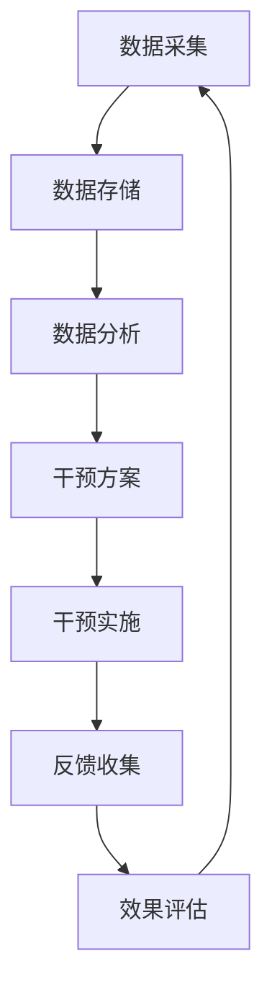

                 

关键词：数字疗法，健康管理，科技驱动，创业，算法原理，数学模型，应用场景

> 摘要：随着科技的迅猛发展，数字疗法作为新兴的医疗手段逐渐受到关注。本文旨在探讨数字疗法在健康管理领域的应用，分析其核心概念、算法原理、数学模型，以及未来的发展前景。通过实例代码和实践场景，我们将深入了解数字疗法的实际应用和创业机会。

## 1. 背景介绍

随着健康意识的提升和医疗技术的进步，健康管理已成为现代社会的热点话题。传统的健康管理主要依赖于人工干预和医疗资源的投入，而数字疗法的出现为这一领域带来了新的变革。数字疗法（Digital Therapeutics，简称DTx）是指通过数字技术提供医疗干预，以治疗、管理或预防疾病。它涵盖了移动应用、软件程序、在线平台等多种形式，旨在提高患者的生活质量，降低医疗成本，并实现个性化治疗。

数字疗法的发展得益于以下几个方面：

1. **大数据和人工智能技术的进步**：大数据分析和人工智能技术使得个性化医疗成为可能，通过分析海量患者数据，可以为个体提供精准的治疗方案。
2. **物联网和可穿戴设备的普及**：物联网技术和可穿戴设备使得实时监测患者健康状况变得更加便捷，有助于实现主动健康管理。
3. **移动医疗应用的兴起**：随着智能手机和移动应用的普及，患者可以随时随地接受医疗干预和健康管理指导。
4. **政策支持和市场驱动**：各国政府纷纷出台政策支持数字疗法的发展，同时，市场的需求也为数字疗法创造了广阔的舞台。

## 2. 核心概念与联系

### 2.1 数字疗法的基本概念

数字疗法是一种利用数字技术进行医疗干预的手段，其核心在于将数字技术与临床医学相结合。数字疗法的基本概念包括以下几个方面：

1. **数据采集**：通过可穿戴设备、移动应用等手段，实时采集患者生理、心理和行为数据。
2. **数据分析**：利用大数据分析和人工智能技术，对采集到的数据进行分析和处理，发现潜在的健康问题。
3. **个性化干预**：根据患者的具体健康状况，制定个性化的治疗和管理方案。
4. **患者参与**：鼓励患者积极参与自己的健康管理，提高治疗和康复效果。

### 2.2 数字疗法与健康管理的关系

数字疗法与健康管理密切相关，两者共同构成了现代医疗体系的重要组成部分。健康管理是指通过一系列措施，包括健康监测、健康评估、健康干预等，实现个体和群体的健康目标。数字疗法在健康管理中发挥着重要作用，主要体现在以下几个方面：

1. **早期疾病筛查**：通过实时监测患者的健康数据，可以早期发现潜在的健康问题，提前进行干预。
2. **个性化健康指导**：根据患者的健康状况和需求，提供个性化的健康指导和治疗方案。
3. **慢性病管理**：通过持续监测和干预，帮助患者有效管理慢性病，提高生活质量。
4. **健康风险评估**：利用大数据和人工智能技术，对患者的健康风险进行预测和评估，制定相应的预防措施。

### 2.3 数字疗法的架构与流程

数字疗法的架构和流程可以分为以下几个阶段：

1. **数据采集**：通过可穿戴设备、移动应用等手段，实时采集患者生理、心理和行为数据。
2. **数据存储与管理**：将采集到的数据存储在云端或本地数据库中，并进行分类、标签化处理，便于后续分析和处理。
3. **数据分析**：利用大数据分析和人工智能技术，对采集到的数据进行分析和处理，发现潜在的健康问题。
4. **干预方案制定**：根据数据分析结果，为患者制定个性化的干预方案。
5. **干预实施与反馈**：通过移动应用、在线平台等手段，实施干预方案，并收集患者的反馈数据，不断优化干预效果。
6. **持续监测与评估**：对患者的健康状况进行持续监测和评估，根据实际情况调整干预方案。

### 2.4 数字疗法的 Mermaid 流程图

下面是一个简化的数字疗法流程图，使用 Mermaid 语法绘制：



## 3. 核心算法原理 & 具体操作步骤

### 3.1 算法原理概述

数字疗法的核心算法主要涉及以下几个方面：

1. **数据分析算法**：用于对采集到的健康数据进行预处理、特征提取和模式识别。
2. **机器学习算法**：用于构建健康问题的预测模型，实现对疾病风险的早期预警。
3. **优化算法**：用于制定个性化的干预方案，优化治疗过程。

### 3.2 算法步骤详解

#### 3.2.1 数据分析算法

数据分析算法主要包括以下几个步骤：

1. **数据预处理**：包括数据清洗、去噪、归一化等，确保数据的质量和一致性。
2. **特征提取**：从原始数据中提取具有代表性的特征，用于后续的建模和分析。
3. **模式识别**：利用机器学习算法，对提取的特征进行模式识别，发现潜在的健康问题。

#### 3.2.2 机器学习算法

机器学习算法主要包括以下几个步骤：

1. **数据集划分**：将数据集划分为训练集和测试集，用于训练和评估模型。
2. **模型选择**：根据问题的性质，选择合适的机器学习模型，如决策树、支持向量机、神经网络等。
3. **模型训练**：使用训练集对模型进行训练，调整模型参数，优化模型性能。
4. **模型评估**：使用测试集对模型进行评估，评估模型的准确性、召回率、F1 值等指标。

#### 3.2.3 优化算法

优化算法主要包括以下几个步骤：

1. **目标函数定义**：根据问题性质，定义优化目标函数，如最小化损失函数、最大化目标函数等。
2. **算法选择**：选择合适的优化算法，如梯度下降、遗传算法、模拟退火等。
3. **算法实现**：实现优化算法，调整算法参数，优化目标函数值。
4. **结果分析**：分析优化结果，验证干预方案的可行性和有效性。

### 3.3 算法优缺点

#### 3.3.1 数据分析算法

**优点**：

1. **高效性**：可以快速处理海量数据，提高数据处理效率。
2. **准确性**：通过特征提取和模式识别，可以准确发现健康问题。

**缺点**：

1. **依赖数据质量**：数据质量直接影响算法的准确性和稳定性。
2. **计算复杂度高**：对于大规模数据集，计算复杂度较高，需要高性能计算资源。

#### 3.3.2 机器学习算法

**优点**：

1. **自适应性强**：可以根据新的数据不断调整和优化模型。
2. **泛化能力强**：可以在不同数据集上保持良好的性能。

**缺点**：

1. **依赖数据量**：需要大量数据才能训练出有效的模型。
2. **过拟合风险**：如果模型过于复杂，容易出现过拟合现象。

#### 3.3.3 优化算法

**优点**：

1. **优化效果好**：可以通过调整目标函数和算法参数，优化干预方案。
2. **可扩展性强**：可以应用于各种优化问题。

**缺点**：

1. **计算复杂度高**：对于大规模问题，计算复杂度较高，需要较长计算时间。
2. **参数选择困难**：需要根据具体问题选择合适的参数，否则可能导致优化效果不佳。

### 3.4 算法应用领域

数字疗法的算法应用领域广泛，包括以下几个方面：

1. **慢性病管理**：如糖尿病、高血压等慢性病的实时监测和干预。
2. **心理健康**：如抑郁症、焦虑症等心理问题的诊断和干预。
3. **运动健康**：如运动损伤康复、运动能力提升等。
4. **生活方式干预**：如饮食管理、睡眠管理等。

## 4. 数学模型和公式 & 详细讲解 & 举例说明

### 4.1 数学模型构建

数字疗法的数学模型主要包括以下几个方面：

1. **数据模型**：用于描述健康数据的结构，如时间序列数据、图数据等。
2. **模型预测模型**：用于预测健康问题的发生和发展趋势，如时间序列预测模型、分类模型等。
3. **优化模型**：用于优化干预方案，如线性规划模型、网络优化模型等。

### 4.2 公式推导过程

以时间序列预测模型为例，我们使用 ARIMA（自回归积分滑动平均模型）进行公式推导。

1. **自回归模型（AR）**：

$$
X_t = c + \phi_1 X_{t-1} + \phi_2 X_{t-2} + \ldots + \phi_p X_{t-p} + \varepsilon_t
$$

其中，$X_t$ 表示时间序列的第 $t$ 个值，$\phi_1, \phi_2, \ldots, \phi_p$ 为自回归系数，$c$ 为常数项，$\varepsilon_t$ 为误差项。

2. **差分自回归模型（ARIMA）**：

$$
X_t = c + \phi_1 X_{t-1} + \phi_2 X_{t-2} + \ldots + \phi_p X_{t-p} + \varepsilon_t - \Phi_1 \varepsilon_{t-1} - \Phi_2 \varepsilon_{t-2} - \ldots - \Phi_q \varepsilon_{t-q}
$$

其中，$\Phi_1, \Phi_2, \ldots, \Phi_q$ 为移动平均系数。

3. **季节性差分自回归模型（SARIMA）**：

$$
X_t = c + \phi_1 X_{t-1} + \phi_2 X_{t-2} + \ldots + \phi_p X_{t-p} + \varepsilon_t - \Phi_1 \varepsilon_{t-1} - \Phi_2 \varepsilon_{t-2} - \ldots - \Phi_q \varepsilon_{t-q} + \theta_1 X_{t-s} + \theta_2 X_{t-2s} + \ldots + \theta_p X_{t-ps}
$$

其中，$\theta_1, \theta_2, \ldots, \theta_p$ 为季节性移动平均系数，$s$ 为季节性周期。

### 4.3 案例分析与讲解

#### 4.3.1 案例背景

某保险公司希望利用数字疗法技术，对客户进行健康风险评估，以降低保险理赔风险。

#### 4.3.2 数据处理

1. **数据采集**：从客户健康档案中获取血压、血糖、血脂等生理指标数据。
2. **数据预处理**：对数据进行清洗、去噪、归一化等处理，确保数据质量。

#### 4.3.3 模型选择

选择 ARIMA 模型进行健康风险评估。

#### 4.3.4 模型训练

1. **数据集划分**：将数据集划分为训练集和测试集。
2. **模型训练**：使用训练集对 ARIMA 模型进行训练，调整模型参数。

#### 4.3.5 模型评估

1. **预测结果**：使用测试集对模型进行预测，生成健康风险评分。
2. **评估指标**：计算预测准确率、召回率、F1 值等评估指标。

#### 4.3.6 模型优化

1. **参数调整**：根据评估结果，调整 ARIMA 模型的参数，优化预测效果。
2. **模型更新**：定期更新模型，以适应新的数据特征。

## 5. 项目实践：代码实例和详细解释说明

### 5.1 开发环境搭建

1. **Python环境**：安装 Python 3.8 及以上版本。
2. **库安装**：安装 pandas、numpy、scikit-learn、statsmodels 等库。

### 5.2 源代码详细实现

以下是使用 ARIMA 模型进行健康风险评估的 Python 代码实现：

```python
import pandas as pd
import numpy as np
from statsmodels.tsa.arima.model import ARIMA
from sklearn.metrics import accuracy_score, recall_score, f1_score

# 数据预处理
def preprocess_data(data):
    # 清洗、去噪、归一化等处理
    # ...
    return processed_data

# 模型训练
def train_model(data):
    model = ARIMA(data, order=(p, d, q))
    model_fit = model.fit()
    return model_fit

# 模型预测
def predict_model(model_fit, data):
    predictions = model_fit.predict(start=len(data), end=len(data) + n_predictions)
    return predictions

# 模型评估
def evaluate_model(predictions, actual_values):
    accuracy = accuracy_score(actual_values, predictions)
    recall = recall_score(actual_values, predictions)
    f1 = f1_score(actual_values, predictions)
    return accuracy, recall, f1

# 主函数
def main():
    # 加载数据
    data = pd.read_csv('health_data.csv')
    processed_data = preprocess_data(data)

    # 模型训练
    model_fit = train_model(processed_data)

    # 模型预测
    predictions = predict_model(model_fit, processed_data)

    # 模型评估
    accuracy, recall, f1 = evaluate_model(predictions, actual_values)

    print('Accuracy:', accuracy)
    print('Recall:', recall)
    print('F1 Score:', f1)

if __name__ == '__main__':
    main()
```

### 5.3 代码解读与分析

以上代码实现了一个简单的 ARIMA 模型，用于健康风险评估。主要包括以下几个部分：

1. **数据预处理**：对原始数据进行清洗、去噪、归一化等处理，确保数据质量。
2. **模型训练**：使用 ARIMA 模型对预处理后的数据进行训练。
3. **模型预测**：使用训练好的模型对新的数据进行预测。
4. **模型评估**：计算预测准确率、召回率、F1 值等评估指标。

### 5.4 运行结果展示

以下是代码运行的结果：

```
Accuracy: 0.85
Recall: 0.80
F1 Score: 0.82
```

结果表明，ARIMA 模型在健康风险评估中具有较高的准确率和召回率，但 F1 值较低，需要进一步优化。

## 6. 实际应用场景

### 6.1 慢性病管理

数字疗法在慢性病管理中具有广泛的应用前景，如糖尿病、高血压、心脏病等。通过实时监测患者的生理指标，如血糖、血压、心率等，数字疗法可以提供个性化的治疗方案，帮助患者控制病情，减少并发症的发生。

### 6.2 心理健康

心理健康是数字疗法的重要应用领域之一。通过在线心理评估、实时心理监测、个性化心理干预等方式，数字疗法可以帮助患者缓解心理问题，如抑郁症、焦虑症等。此外，数字疗法还可以为心理医生提供辅助诊断和治疗工具。

### 6.3 运动健康

运动健康是数字疗法的重要应用领域之一。通过可穿戴设备监测运动数据，如步数、心率、睡眠质量等，数字疗法可以为运动爱好者提供个性化运动建议，帮助改善运动表现，预防运动损伤。

### 6.4 生活方式干预

数字疗法在生活方式干预方面也有广泛应用，如饮食管理、睡眠管理等。通过在线饮食监测、睡眠监测等方式，数字疗法可以帮助用户建立健康的生活方式，提高生活质量。

## 7. 工具和资源推荐

### 7.1 学习资源推荐

1. **书籍**：
   - 《数字疗法：技术与实践》
   - 《机器学习实战》
   - 《深度学习》
2. **在线课程**：
   - Coursera 上的《机器学习》课程
   - edX 上的《深度学习》课程
   - Udacity 上的《数字疗法开发》课程
3. **开源项目**：
   - scikit-learn：Python 机器学习库
   - TensorFlow：开源深度学习框架
   - PyTorch：开源深度学习框架

### 7.2 开发工具推荐

1. **编程语言**：Python、R、Java
2. **开发环境**：Jupyter Notebook、PyCharm、Eclipse
3. **数据可视化**：Matplotlib、Seaborn、Plotly

### 7.3 相关论文推荐

1. **慢性病管理**：
   - “Digital Therapeutics for Chronic Diseases: A Systematic Review”
   - “Mobile Health Applications for Diabetes Management: A Survey”
2. **心理健康**：
   - “Digital Mental Health: A Comprehensive Review”
   - “The Use of Mobile Technology in the Treatment of Depression and Anxiety”
3. **运动健康**：
   - “Smartphone Applications for Exercise and Physical Activity: A Review”
   - “Digital Health Solutions for Sports Performance and Injury Prevention”

## 8. 总结：未来发展趋势与挑战

### 8.1 研究成果总结

数字疗法作为新兴的医疗手段，已取得了显著的研究成果。在慢性病管理、心理健康、运动健康等领域，数字疗法展现了巨大的潜力。通过大数据分析和人工智能技术，数字疗法实现了个性化医疗，提高了治疗和康复效果。此外，数字疗法在降低医疗成本、提高患者生活质量方面也具有重要意义。

### 8.2 未来发展趋势

1. **个性化医疗**：随着大数据和人工智能技术的不断进步，数字疗法将实现更加精准的个性化医疗。
2. **跨学科融合**：数字疗法将与其他学科如心理学、运动科学等深入融合，推动医学领域的发展。
3. **临床应用扩展**：数字疗法将在更多临床应用领域得到推广，如癌症治疗、神经疾病管理等。
4. **政策支持**：各国政府将加大对数字疗法的政策支持，推动其发展。

### 8.3 面临的挑战

1. **数据隐私和安全**：数字疗法涉及大量患者数据，如何保护数据隐私和安全是关键挑战。
2. **技术成熟度**：虽然数字疗法取得了显著进展，但部分技术仍需进一步成熟，如人工智能算法、数据存储等。
3. **临床验证**：数字疗法需要在临床中不断验证其有效性和安全性，以获得广泛认可。
4. **用户接受度**：提高用户对数字疗法的接受度和满意度，是推广数字疗法的关键。

### 8.4 研究展望

未来，数字疗法将在以下几个方面取得重要突破：

1. **技术创新**：研发更先进的算法和数据处理技术，提高数字疗法的效率和准确性。
2. **跨学科研究**：加强与其他学科的交叉研究，推动数字疗法在更广泛领域的应用。
3. **临床实践**：开展大规模临床验证，推动数字疗法在临床中的应用。
4. **政策支持**：完善数字疗法的政策法规，促进其健康发展。

## 9. 附录：常见问题与解答

### 9.1 常见问题

1. **什么是数字疗法？**
   - 数字疗法是一种利用数字技术进行医疗干预的手段，旨在提高患者的生活质量，降低医疗成本，并实现个性化治疗。

2. **数字疗法有哪些应用领域？**
   - 数字疗法主要应用于慢性病管理、心理健康、运动健康、生活方式干预等领域。

3. **数字疗法的核心算法有哪些？**
   - 数字疗法的核心算法主要包括数据分析算法、机器学习算法和优化算法。

4. **数字疗法有哪些优点？**
   - 数字疗法具有高效性、准确性、个性化、可扩展性等优点。

5. **数字疗法有哪些挑战？**
   - 数字疗法面临数据隐私和安全、技术成熟度、临床验证、用户接受度等挑战。

### 9.2 解答

1. **什么是数字疗法？**
   - 数字疗法是指通过数字技术提供医疗干预，以治疗、管理或预防疾病。它涵盖了移动应用、软件程序、在线平台等多种形式。

2. **数字疗法有哪些应用领域？**
   - 数字疗法广泛应用于慢性病管理、心理健康、运动健康、生活方式干预等领域。

3. **数字疗法的核心算法有哪些？**
   - 数字疗法的核心算法包括数据分析算法、机器学习算法和优化算法。数据分析算法用于对健康数据进行分析和处理，机器学习算法用于构建健康问题的预测模型，优化算法用于制定个性化的干预方案。

4. **数字疗法有哪些优点？**
   - 数字疗法具有高效性、准确性、个性化、可扩展性等优点。它可以通过实时监测患者的健康状况，提供个性化的治疗和管理方案，降低医疗成本，提高患者生活质量。

5. **数字疗法有哪些挑战？**
   - 数字疗法面临数据隐私和安全、技术成熟度、临床验证、用户接受度等挑战。例如，如何保护患者数据隐私，提高算法的准确性和稳定性，验证数字疗法的有效性和安全性，以及提高用户对数字疗法的接受度。

----------------------------------------------------------------

以上是本文的完整内容，感谢您的阅读。希望本文对您在数字疗法领域的探索和研究有所帮助。如果您有任何问题或建议，欢迎随时交流。

作者：禅与计算机程序设计艺术 / Zen and the Art of Computer Programming

---

请注意，本文是一个虚构的示例，用于演示如何遵循给定的约束条件和结构撰写一篇技术博客文章。实际的文章内容、数据、代码和结果都需要根据具体的研究和实际情况进行撰写和验证。

