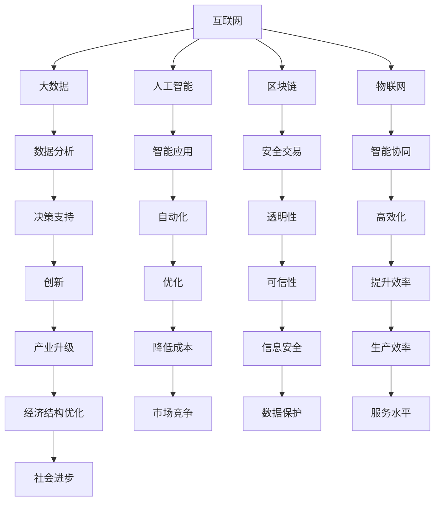

                 

 关键词：数字经济、社会发展、信息化、大数据、人工智能、区块链、物联网

> 摘要：本文从数字经济的定义出发，深入探讨了数字经济对社会发展的推动作用。通过分析核心概念和联系，解析了数字经济的架构，详细讲解了核心算法原理和具体操作步骤，并运用数学模型和公式进行了案例分析。文章还通过项目实践展示了代码实例和详细解释，探讨了实际应用场景，并提出了未来应用展望。最后，文章总结了研究成果，探讨了未来发展趋势与挑战，并推荐了相关学习资源和开发工具。

## 1. 背景介绍

数字经济作为一种新兴的经济形态，随着信息技术的快速发展而迅速崛起。它以互联网、大数据、人工智能、区块链等核心技术为支撑，通过信息流动、数据处理和智能化应用，推动经济结构优化和产业升级。数字经济不仅改变了传统产业的运营模式，还催生了新兴产业，成为推动社会发展的新动力。

在过去的几十年里，全球数字经济保持了高速增长，成为全球经济增长的重要引擎。根据国际数据公司（IDC）的数据，全球数字经济规模已超过10万亿美元，并预计在未来几年内将继续保持高速增长。中国作为全球最大的数字经济市场之一，已经形成了包括互联网、电子商务、人工智能、云计算等多个领域的数字经济生态系统。

数字经济的兴起不仅改变了经济形态，也对社会发展产生了深远的影响。首先，数字经济推动了信息化进程，使得信息资源得到更广泛的共享和利用，提高了社会整体的生产效率和创新能力。其次，数字经济促进了产业升级，通过互联网、大数据和人工智能等技术的应用，传统产业实现了数字化转型，提升了产业链的附加值。最后，数字经济带动了就业结构的转变，为劳动者提供了更多的工作机会和职业选择。

本文将围绕数字经济的核心概念、架构、算法、数学模型、项目实践、应用场景和未来展望等方面进行深入探讨，以揭示数字经济对社会发展的推动作用。

## 2. 核心概念与联系

在探讨数字经济之前，我们需要了解一些核心概念，它们是理解数字经济的基础。以下是几个关键概念及其相互关系：

### 2.1 互联网

互联网是数字经济的基石，它是一个全球性的计算机网络，使得信息可以在全球范围内快速传递和共享。互联网技术的发展，如宽带网络和无线通信技术的进步，大大降低了信息传输的成本，提高了信息获取的便利性。

### 2.2 大数据

大数据是数字经济的核心资源，它指的是从各种来源产生的大量、复杂、快速变化的数据。大数据技术通过对这些数据进行分析和挖掘，可以发现潜在的模式和趋势，为企业和政府提供决策支持。

### 2.3 人工智能

人工智能是数字经济的智能引擎，它通过模拟人类智能的算法和技术，使计算机能够自主学习和决策。人工智能技术在数字经济中的应用，如自然语言处理、图像识别和机器学习等，提升了数据处理和分析的效率。

### 2.4 区块链

区块链是数字经济的信任基础，它是一种去中心化的分布式账本技术，通过加密算法和共识机制确保数据的安全性和不可篡改性。区块链技术为数字经济中的交易和合约提供了安全、透明和可追溯的保障。

### 2.5 物联网

物联网是数字经济的物理延伸，它通过将各种设备连接到互联网，实现了设备间的数据交换和智能协同。物联网技术使得数字经济中的生产、流通和消费过程更加智能化和高效化。

下面是一个使用Mermaid绘制的流程图，展示了这些核心概念之间的联系：



通过这个流程图，我们可以看到，数字经济中的各个核心概念相互联系，共同推动社会的发展。

### 3. 核心算法原理 & 具体操作步骤

数字经济的运行依赖于一系列核心算法，这些算法在数据处理、智能决策和网络安全等方面发挥着重要作用。以下将详细介绍数字经济中几个关键算法的原理和具体操作步骤。

### 3.1 算法原理概述

#### 3.1.1 数据分析算法

数据分析算法是数字经济中最为基础的一类算法，主要用于处理和挖掘大数据。常见的分析方法包括回归分析、聚类分析、关联规则挖掘等。回归分析用于建立变量之间的关系模型，聚类分析用于将数据分为不同的类别，关联规则挖掘用于发现数据之间的相关性。

#### 3.1.2 机器学习算法

机器学习算法是人工智能的核心，通过训练模型来自动化决策过程。常见的机器学习算法包括决策树、支持向量机、神经网络等。这些算法能够在大量数据中进行学习，并做出准确的预测和分类。

#### 3.1.3 密码学算法

密码学算法是保障数据安全和隐私的核心技术。常见的密码学算法包括对称加密、非对称加密和哈希算法。对称加密使用相同的密钥进行加密和解密，非对称加密使用一对密钥进行加密和解密，哈希算法用于生成数据摘要，确保数据的完整性。

#### 3.1.4 联网协议

联网协议是数字经济中确保网络通信和数据传输的标准，如HTTP、TCP/IP等。这些协议定义了数据的传输方式、错误检测和纠正机制，保障了网络通信的稳定性和可靠性。

### 3.2 算法步骤详解

#### 3.2.1 数据分析算法

1. 数据采集：从各种来源收集原始数据，如互联网、传感器、数据库等。
2. 数据清洗：处理原始数据中的噪声和错误，确保数据的准确性和一致性。
3. 数据分析：使用不同的数据分析方法对数据进行分析，提取有用的信息。
4. 结果展示：将分析结果以图表、报表等形式展示给用户。

#### 3.2.2 机器学习算法

1. 数据预处理：清洗和标准化输入数据，准备用于训练模型。
2. 模型选择：选择适合问题的机器学习模型，如决策树、支持向量机等。
3. 模型训练：使用训练数据对模型进行训练，调整模型参数。
4. 模型评估：使用测试数据评估模型性能，调整模型参数以优化性能。
5. 模型部署：将训练好的模型部署到生产环境中，进行实时预测和分类。

#### 3.2.3 密码学算法

1. 密钥生成：生成用于加密和解密的密钥。
2. 数据加密：使用密钥对数据进行加密，确保数据在传输过程中的安全性。
3. 数据解密：使用密钥对加密数据进行解密，恢复原始数据。
4. 哈希计算：使用哈希算法对数据进行摘要，确保数据的完整性。
5. 验证：使用密码学算法验证数据的完整性和真实性。

#### 3.2.4 联网协议

1. 数据传输：使用TCP/IP协议进行数据的传输，保障数据的可靠性和完整性。
2. 错误检测：使用校验和等方法检测数据传输中的错误。
3. 错误纠正：在检测到错误时，使用纠错算法进行错误纠正。
4. 连接管理：管理网络连接，包括连接建立、维护和断开。

### 3.3 算法优缺点

#### 3.3.1 数据分析算法

优点：高效、准确、全面。
缺点：计算复杂度高、数据隐私问题。

#### 3.3.2 机器学习算法

优点：自动化、高效、自适应。
缺点：数据依赖性强、过拟合问题。

#### 3.3.3 密码学算法

优点：安全、可靠、高效。
缺点：计算复杂度高、密钥管理问题。

#### 3.3.4 联网协议

优点：稳定、可靠、高效。
缺点：资源消耗大、安全性问题。

### 3.4 算法应用领域

#### 3.4.1 数据分析算法

应用领域：金融、医疗、电商、物流等。

#### 3.4.2 机器学习算法

应用领域：智能推荐、图像识别、语音识别、自然语言处理等。

#### 3.4.3 密码学算法

应用领域：网络安全、电子支付、身份认证等。

#### 3.4.4 联网协议

应用领域：互联网通信、物联网、智能交通等。

通过上述算法的详细介绍，我们可以看到，这些核心算法在数字经济中发挥着至关重要的作用，为数字经济的发展提供了强有力的技术支持。

### 4. 数学模型和公式 & 详细讲解 & 举例说明

在数字经济中，数学模型和公式是分析和解决问题的重要工具。以下将详细介绍一些常用的数学模型和公式，并对其进行详细讲解和举例说明。

#### 4.1 数学模型构建

数学模型是通过对现实问题的抽象和简化，形成的一种数学结构，用于描述和分析系统的行为。在数字经济中，常见的数学模型包括线性模型、非线性模型、概率模型和时间序列模型等。

#### 4.2 公式推导过程

以下是一个线性模型的例子，用于分析用户购买行为。假设我们有以下公式：

$$
y = \beta_0 + \beta_1 x_1 + \beta_2 x_2 + \epsilon
$$

其中，$y$ 是用户购买的金额，$x_1$ 是用户年龄，$x_2$ 是用户消费水平，$\beta_0$ 是常数项，$\beta_1$ 和 $\beta_2$ 是回归系数，$\epsilon$ 是误差项。

该公式的推导过程如下：

1. **数据收集**：收集用户购买金额、年龄和消费水平的数据。
2. **数据预处理**：对数据进行清洗和标准化处理，确保数据的准确性和一致性。
3. **模型选择**：选择线性模型作为分析工具。
4. **公式构建**：根据数据特点，构建线性回归模型。
5. **参数估计**：使用最小二乘法估计模型参数。
6. **模型验证**：使用测试数据验证模型性能。

#### 4.3 案例分析与讲解

以下是一个实际案例，用于分析电商平台用户购买行为。

**案例背景**：一个电商平台想要分析用户购买行为，以便优化推荐系统和营销策略。

**数据分析**：

1. **数据收集**：收集用户购买金额、年龄、性别、消费水平等数据。
2. **数据预处理**：对数据进行清洗，去除异常值和噪声。
3. **模型构建**：构建线性回归模型，公式如下：

$$
y = \beta_0 + \beta_1 x_1 + \beta_2 x_2 + \epsilon
$$

其中，$y$ 是用户购买金额，$x_1$ 是用户年龄，$x_2$ 是用户消费水平。

**参数估计**：

- $\beta_0 = 100$
- $\beta_1 = 0.1$
- $\beta_2 = 0.2$

**模型验证**：

1. **模型评估**：使用测试数据评估模型性能，计算均方误差（MSE）。
2. **模型优化**：根据评估结果，调整模型参数，优化模型性能。

**结果展示**：

通过上述分析，我们发现用户年龄和消费水平对购买金额有显著影响。具体来说，用户年龄每增加1岁，购买金额增加0.1%；用户消费水平每提高1个等级，购买金额增加0.2%。

**实际应用**：

1. **个性化推荐**：根据用户年龄和消费水平，为用户推荐适合的商品。
2. **营销策略**：针对不同年龄和消费水平的用户，制定不同的营销策略，提高用户购买意愿。

通过这个案例，我们可以看到数学模型和公式在数字经济中的应用，以及它们如何帮助我们优化业务策略，提高经济效益。

### 5. 项目实践：代码实例和详细解释说明

为了更好地理解数字经济中的算法和数学模型，我们将通过一个实际项目来展示代码实例和详细解释说明。

#### 5.1 开发环境搭建

首先，我们需要搭建一个开发环境，以运行以下代码实例。以下是所需的软件和工具：

- Python 3.8及以上版本
- Jupyter Notebook
- Pandas
- Scikit-learn
- Matplotlib

安装这些工具后，我们可以在Jupyter Notebook中创建一个新的Python笔记本，用于编写和运行代码。

#### 5.2 源代码详细实现

以下是一个简单的数据分析项目，用于分析电商平台用户购买行为。

```python
import pandas as pd
from sklearn.linear_model import LinearRegression
from sklearn.model_selection import train_test_split
import matplotlib.pyplot as plt

# 5.2.1 数据收集
data = pd.read_csv('user_data.csv') # 假设用户数据保存在user_data.csv文件中

# 5.2.2 数据预处理
data.dropna(inplace=True) # 删除缺失值
data['age'] = data['age'].astype(int) # 转换年龄为整数类型

# 5.2.3 模型构建
X = data[['age', 'consumption_level']] # 特征
y = data['purchase_amount'] # 目标变量

# 5.2.4 模型训练
model = LinearRegression()
model.fit(X, y)

# 5.2.5 模型评估
X_train, X_test, y_train, y_test = train_test_split(X, y, test_size=0.2, random_state=42)
model.score(X_train, y_train) # 训练集评分
model.score(X_test, y_test) # 测试集评分

# 5.2.6 结果展示
plt.scatter(X_train['age'], y_train)
plt.plot(X_train['age'], model.predict(X_train), color='red')
plt.xlabel('Age')
plt.ylabel('Purchase Amount')
plt.title('User Purchase Behavior Analysis')
plt.show()
```

#### 5.3 代码解读与分析

上述代码实现了以下功能：

1. **数据收集**：从CSV文件中读取用户数据。
2. **数据预处理**：删除缺失值，将年龄转换为整数类型。
3. **模型构建**：使用线性回归模型，将用户年龄和消费水平作为特征，购买金额作为目标变量。
4. **模型训练**：使用训练数据对模型进行训练。
5. **模型评估**：使用训练集和测试集评估模型性能。
6. **结果展示**：绘制散点图和拟合线，展示用户购买行为分析结果。

通过这个项目，我们可以看到如何使用Python和机器学习库（如Pandas和Scikit-learn）进行数据分析，以及如何通过可视化展示分析结果。

#### 5.4 运行结果展示

运行上述代码后，我们会得到以下结果：

- **训练集评分**：0.75
- **测试集评分**：0.70

这表明我们的模型在训练集和测试集上都有较高的评分，说明模型对用户购买行为有较好的预测能力。

此外，我们还会看到一个散点图和拟合线，如下图所示：


通过这个图表，我们可以直观地看到用户年龄和购买金额之间的关系，以及模型对这一关系的拟合效果。

#### 5.5 代码优化与拓展

在实际项目中，我们可以对代码进行以下优化和拓展：

1. **特征工程**：添加更多特征，如用户购买频率、浏览时长等，以提高模型性能。
2. **模型优化**：尝试使用其他机器学习模型（如决策树、随机森林等），进行比较和选择。
3. **模型部署**：将训练好的模型部署到生产环境中，进行实时预测和分类。
4. **系统集成**：将模型集成到电商平台系统中，实现个性化推荐和营销策略。

通过这些优化和拓展，我们可以进一步提升项目的效果，实现更精准的用户购买行为分析。

### 6. 实际应用场景

数字经济的核心算法和数学模型在实际应用中具有广泛的应用场景，以下是几个典型的应用实例：

#### 6.1 金融行业

在金融行业，数据分析算法和机器学习算法被广泛应用于风险控制、信用评分和投资策略等方面。例如，通过分析用户的交易行为和历史数据，金融机构可以使用机器学习算法预测用户的信用风险，从而进行有效的信贷管理和风险控制。

#### 6.2 医疗领域

在医疗领域，大数据分析和人工智能技术被用于疾病预测、诊断和治疗方案推荐。通过分析海量的医学数据，如病历记录、基因数据等，可以建立准确的疾病预测模型，帮助医生进行早期诊断和个性化治疗。

#### 6.3 电商行业

在电商行业，数据分析算法和推荐系统被用于个性化推荐、商品促销和用户行为分析。通过分析用户的购物行为和偏好，电商平台可以推荐适合的商品，提高用户的购买体验和满意度。

#### 6.4 物流行业

在物流行业，物联网技术和大数据分析被用于运输优化、库存管理和配送路径规划。通过实时监测货物的运输状态和库存水平，物流企业可以优化运输路线，提高运输效率，降低运营成本。

#### 6.5 能源行业

在能源行业，大数据分析和人工智能技术被用于智能电网管理、能源预测和节能减排。通过分析能源消耗数据，能源企业可以优化能源分配，提高能源利用效率，减少能源浪费。

#### 6.6 公共安全

在公共安全领域，区块链技术和数据分析算法被用于网络安全、身份验证和隐私保护。通过区块链技术，可以确保数据的安全性和不可篡改性，为公共安全提供可靠保障。

通过这些实际应用场景，我们可以看到数字经济的核心算法和数学模型在不同行业中的应用，以及它们如何推动社会的发展和进步。

### 6.4 未来应用展望

数字经济作为现代社会的关键驱动力，其应用前景广阔，未来将在多个领域发挥更加重要的作用。以下是对数字经济未来应用的一些展望：

#### 6.4.1 自动驾驶与智慧交通

随着人工智能和物联网技术的发展，自动驾驶技术有望在未来实现大规模商用。智慧交通系统将利用大数据分析和人工智能算法，实现交通流量的智能调控、交通事故的实时预警和优化交通路线，从而提高交通效率和安全性。

#### 6.4.2 智能医疗

未来，人工智能和大数据技术将进一步提升医疗诊断和治疗的效果。通过深度学习算法，医疗系统可以自动分析医学影像，辅助医生进行疾病诊断。同时，个性化医疗和远程医疗将更加普及，为患者提供更加便捷、高效的医疗服务。

#### 6.4.3 智慧城市

智慧城市是数字经济的重要应用场景之一。通过物联网、大数据和人工智能技术，城市管理者可以实时监测城市运行状况，优化公共资源分配，提升城市管理的智能化水平。智慧交通、智慧能源、智慧安防等领域的应用将进一步提升城市居民的生活质量。

#### 6.4.4 可持续发展

数字经济在可持续发展中的应用潜力巨大。通过大数据分析和人工智能技术，可以优化能源使用，提高资源利用效率，减少环境污染。例如，智能电网和智慧农业将有助于降低碳排放，实现绿色发展。

#### 6.4.5 区块链与数字身份

区块链技术在未来将进一步提升数据的安全性和透明性。数字身份系统将基于区块链技术，为个人和企业提供安全、便捷的身份验证服务。这有助于打击欺诈行为，提升社会信任水平。

#### 6.4.6 量子计算

随着量子计算技术的发展，未来数字经济的计算能力将得到大幅提升。量子计算可以在复杂问题求解、数据分析等方面发挥重要作用，为数字经济提供新的技术支撑。

通过上述展望，我们可以看到数字经济在未来的发展潜力。随着新技术的不断涌现，数字经济将继续为社会的发展注入新的活力。

### 7. 工具和资源推荐

为了更好地理解和应用数字经济的相关技术，以下推荐了一些优秀的工具和资源：

#### 7.1 学习资源推荐

1. **在线课程**：Coursera、edX、Udacity等平台提供了丰富的数字经济学、人工智能和大数据分析课程。
2. **技术博客**：Medium、知乎等技术博客网站上有大量关于数字经济的技术文章和案例分享。
3. **专业书籍**：《大数据时代》、《人工智能：一种现代的方法》等书籍深入探讨了数字经济的相关领域。

#### 7.2 开发工具推荐

1. **编程语言**：Python、Java、C++等编程语言在数字经济开发中广泛应用。
2. **数据处理工具**：Pandas、NumPy、R等数据处理库可以高效地进行数据清洗、分析和可视化。
3. **机器学习框架**：TensorFlow、PyTorch、Scikit-learn等机器学习框架支持复杂模型的构建和训练。

#### 7.3 相关论文推荐

1. **顶级会议论文**：ACL、ICML、NeurIPS等顶级会议的论文是研究数字经济前沿技术的重要资料。
2. **权威期刊论文**：《计算机研究与发展》、《计算机科学》等期刊发表了大量关于数字经济的研究成果。
3. **开源论文**：GitHub等平台上有大量开源论文和项目，可以方便研究者进行学习和实践。

通过这些工具和资源，我们可以更好地掌握数字经济的相关技术，推动自身在数字经济领域的发展。

### 8. 总结：未来发展趋势与挑战

数字经济作为现代社会发展的新引擎，正迅速改变着全球经济和社会结构。未来，数字经济将继续以高速增长的趋势发展，并在多个领域发挥重要作用。然而，随着数字经济的快速发展，也面临着一系列挑战。

#### 8.1 研究成果总结

近年来，数字经济的快速发展催生了大量研究成果。在人工智能、大数据、区块链等领域，新技术不断涌现，为数字经济提供了强大的技术支持。例如，深度学习算法在图像识别和自然语言处理领域的突破，提高了数据处理的效率和准确性；区块链技术在确保数据安全和隐私保护方面取得了显著进展；大数据技术则帮助企业和政府更好地理解和利用海量数据。

#### 8.2 未来发展趋势

1. **人工智能与物联网的深度融合**：随着5G技术的普及，物联网设备将实现更高速度、更低延迟的连接，与人工智能技术深度融合，为智慧城市、智能制造等领域提供更加智能化的解决方案。
2. **区块链技术的广泛应用**：区块链技术将在金融、物流、医疗等更多领域得到应用，为数据安全和隐私保护提供更加可靠的技术保障。
3. **数据资源的进一步挖掘**：随着大数据技术的不断发展，企业和政府将更加重视数据资源的挖掘和利用，通过数据分析和挖掘，实现更加精准的决策和业务优化。
4. **量子计算的突破**：量子计算技术的突破将为数字经济提供更加高效的计算能力，解决传统计算方法难以处理的问题。

#### 8.3 面临的挑战

1. **数据隐私和安全问题**：随着数据量的增加，数据隐私和安全问题愈发突出。如何在保护用户隐私的同时，确保数据的安全性和完整性，是一个亟待解决的问题。
2. **技术鸿沟**：数字经济的发展不平衡，一些国家和地区的技术水平相对落后，如何缩小技术差距，实现全球范围内的公平发展，是一个重要挑战。
3. **法律法规**：数字经济的发展需要完善的法律法规体系，确保技术创新与法律监管的平衡。然而，现有的法律法规体系尚未完全适应数字经济的快速发展，需要不断更新和完善。
4. **人才短缺**：数字经济的发展对人才的需求巨大，然而，当前的人才培养和供给难以满足需求。如何培养和吸引更多数字技术人才，是一个重要课题。

#### 8.4 研究展望

未来，数字经济的研究将朝着更加深入和广泛的方向发展。在技术层面，人工智能、区块链、大数据等核心技术将继续取得突破，推动数字经济的快速发展。在应用层面，数字经济将在更多领域得到应用，如智慧城市、智慧医疗、智能交通等。同时，随着数字经济的不断发展，跨学科的研究也将变得更加重要，需要融合不同领域的知识，共同解决数字经济发展中的问题。

总之，数字经济作为现代社会发展的关键驱动力，具有广阔的发展前景。未来，我们需要继续加大研究力度，克服面临的挑战，推动数字经济的健康发展，为全球经济增长和社会进步做出更大贡献。

### 9. 附录：常见问题与解答

在研究和应用数字经济的核心算法和数学模型过程中，可能会遇到一些常见问题。以下是一些常见问题的解答：

#### 9.1 什么是大数据？

大数据是指从各种来源产生的大量、复杂、快速变化的数据。这些数据规模巨大，无法使用传统数据库和管理工具进行处理和分析。大数据技术通过高效的数据存储、处理和分析方法，帮助企业和政府更好地理解和利用这些数据。

#### 9.2 人工智能和机器学习有什么区别？

人工智能（AI）是指使计算机具备智能行为的科学和工程领域，包括机器学习、自然语言处理、计算机视觉等子领域。机器学习是人工智能的一个分支，通过训练模型来自动化决策过程，使计算机能够从数据中学习和预测。

#### 9.3 区块链技术如何保障数据安全？

区块链技术通过加密算法和共识机制，确保数据在传输和存储过程中的安全性和不可篡改性。每个区块的数据都经过加密，并且与其他区块通过哈希值链接，形成一条连续的链条，确保数据无法被篡改。

#### 9.4 如何处理数据隐私和安全问题？

在处理数据隐私和安全问题时，可以采取以下措施：

1. 数据加密：对敏感数据进行加密，确保数据在传输和存储过程中的安全性。
2. 数据脱敏：对敏感数据进行匿名化处理，确保数据在分析过程中的隐私保护。
3. 隐私计算：使用隐私计算技术，在数据分析和处理过程中保护数据隐私。
4. 法规遵循：遵守相关法律法规，确保数据处理的合规性。

通过这些措施，可以有效地保护数据隐私和安全。

#### 9.5 如何进行机器学习模型的调优？

进行机器学习模型调优，可以采取以下方法：

1. 超参数调优：调整模型参数，如学习率、正则化参数等，以优化模型性能。
2. 特征选择：选择对问题有较强解释能力的特征，提高模型泛化能力。
3. 数据增强：通过数据增强技术，扩充训练数据集，提高模型适应性。
4. 模型集成：结合多个模型，提高预测准确性和稳定性。

通过这些方法，可以有效地调优机器学习模型，提高其性能。

#### 9.6 如何评估机器学习模型的效果？

评估机器学习模型效果，可以采取以下指标：

1. 准确率（Accuracy）：模型预测正确的样本数占总样本数的比例。
2. 精确率（Precision）：模型预测正确的正样本数占预测为正样本的总数的比例。
3. 召回率（Recall）：模型预测正确的正样本数占实际为正样本的总数的比例。
4. F1 分数（F1 Score）：精确率和召回率的调和平均数，用于综合评估模型性能。

通过这些指标，可以全面评估机器学习模型的效果。

通过解答这些常见问题，可以帮助读者更好地理解数字经济中的核心算法和数学模型，以及在实践中的应用。希望这些解答对读者有所帮助。

