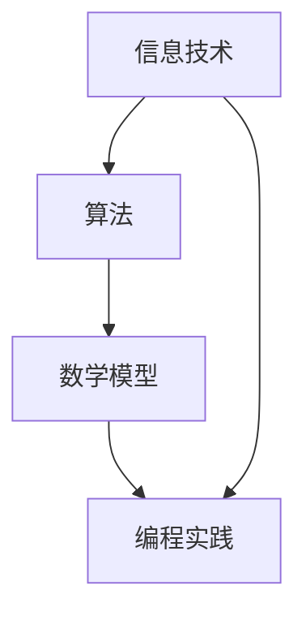

                 

关键词：数字鸿沟、计算不平等、算法、数学模型、编程实践、未来展望

> 摘要：本文深入探讨了数字鸿沟这一关键问题，分析了其在人类计算中的不平等现象。通过详细阐述核心概念、算法原理、数学模型及其应用场景，本文旨在提供一种弥合数字鸿沟的路径，并展望未来的发展趋势与挑战。

## 1. 背景介绍

在当今世界，信息技术和互联网的迅猛发展极大地改变了我们的生活方式。然而，数字化的浪潮并非一视同仁，全球范围内依然存在着显著的数字鸿沟。数字鸿沟是指在信息技术和互联网接入方面存在的差异，这些差异不仅影响了个人和社区的生活质量，还加剧了社会不平等。

### 1.1 数字鸿沟的定义与影响

数字鸿沟可以从多个维度进行理解：

- **经济维度**：收入不平等导致部分人群无法负担信息技术设备和互联网接入费用。
- **教育维度**：教育资源的分配不均，导致不同社会阶层的学生在信息技术素养方面存在巨大差距。
- **地理维度**：地理位置限制导致农村和边远地区难以获得高质量的网络连接。

这些差异不仅限制了人们获取信息的自由，还影响了就业机会、医疗保健、教育质量等多个方面，进一步加剧了社会不平等。

### 1.2 数字鸿沟的现状

全球范围内，数字鸿沟的存在是不争的事实。根据联合国教科文组织的报告，截至2021年，全球仍有超过10亿人无法接入互联网，其中大部分位于发展中国家和边远地区。即使在发达地区，低收入群体和少数族裔群体也面临不同程度的数字鸿沟。

## 2. 核心概念与联系

为了更好地理解数字鸿沟的形成及其影响，我们需要探讨几个核心概念：信息技术、算法、数学模型和编程实践。

### 2.1 信息技术的概念与作用

信息技术（IT）是指用于管理和处理信息的一系列技术和方法。在现代社会，信息技术是推动经济发展、改善生活质量的关键因素。通过互联网，人们可以迅速获取全球范围内的信息，进行远程工作和学习，享受各种在线服务。

### 2.2 算法的原理与重要性

算法是一系列解决问题的步骤和规则，它们广泛应用于计算机科学、数据科学、人工智能等领域。高效的算法可以显著提高计算效率，减少资源消耗，从而在弥合数字鸿沟方面发挥重要作用。

### 2.3 数学模型与算法的关系

数学模型是利用数学语言描述现实世界的抽象模型。在计算领域，数学模型为算法的设计和优化提供了理论支持。通过对数学模型的分析和求解，我们可以发现问题的本质，提出更加有效的解决方案。

### 2.4 编程实践的重要性

编程实践是将理论转化为实际应用的关键步骤。通过编程，我们可以开发出各种软件和工具，帮助人们更好地利用信息技术。编程能力也是数字鸿沟的关键因素之一，掌握编程技能可以为个人和社会带来巨大的价值。

### 2.5 Mermaid 流程图

以下是一个简单的 Mermaid 流程图，展示了信息技术、算法、数学模型和编程实践之间的联系：



## 3. 核心算法原理 & 具体操作步骤

### 3.1 算法原理概述

弥合数字鸿沟的核心算法之一是“社区驱动发展模型”（Community-Driven Development Model，简称CDDM）。该模型基于以下原理：

- **社区参与**：通过鼓励社区成员参与决策和项目实施，确保信息技术和互联网接入项目的可持续性。
- **资源共享**：通过建立共享中心，为社区成员提供免费或低成本的信息技术和互联网接入服务。
- **培训与教育**：通过提供编程、数据科学等相关培训，提高社区成员的技能水平，促进数字鸿沟的弥合。

### 3.2 算法步骤详解

CDDM 模型的主要步骤如下：

1. **需求评估**：与社区成员进行交流，了解他们对信息技术和互联网接入的需求。
2. **资源规划**：根据需求评估结果，规划共享中心的布局和设备配置。
3. **项目实施**：在共享中心安装设备、搭建网络，并确保稳定运行。
4. **社区培训**：为社区成员提供编程、数据科学等相关培训，提高他们的技能水平。
5. **持续运营**：定期评估共享中心的运行情况，根据社区反馈进行改进。

### 3.3 算法优缺点

CDDM 模型具有以下优点：

- **提高社区成员的技能水平**：通过培训和教育，提高社区成员的技能水平，促进数字鸿沟的弥合。
- **增强社区凝聚力**：通过社区参与和资源共享，增强社区凝聚力，促进社区发展。
- **可持续性**：通过社区驱动的方式，确保项目的可持续性，降低依赖外部援助的风险。

然而，CDDM 模型也存在一些缺点：

- **初期投入较大**：共享中心的建立和运营需要一定的资金投入，对于资源匮乏的社区来说可能是一个挑战。
- **技术维护和升级**：共享中心的设备和技术需要定期维护和升级，以确保稳定运行。

### 3.4 算法应用领域

CDDM 模型可以应用于以下领域：

- **农村地区**：农村地区普遍存在数字鸿沟问题，通过 CDDM 模型，可以改善农村地区的信息技术接入状况。
- **低收入群体**：低收入群体通常难以负担信息技术设备和互联网接入费用，CDDM 模型可以为他们提供免费或低成本的服务。
- **教育领域**：通过 CDDM 模型，可以为教育机构提供免费或低成本的信息技术和互联网接入服务，提高教育质量。

## 4. 数学模型和公式 & 详细讲解 & 举例说明

### 4.1 数学模型构建

为了分析数字鸿沟的形成和弥合，我们可以构建一个简单的数学模型。该模型主要考虑以下因素：

- **人口总数**：表示总人口数量，记为 \( P \)。
- **互联网接入率**：表示互联网接入人口占总人口的比例，记为 \( r \)。
- **资源分配**：表示互联网接入资源的分配情况，记为 \( R \)。

数学模型的目标是最大化互联网接入率 \( r \)，同时确保资源分配 \( R \) 合理。

### 4.2 公式推导过程

首先，我们考虑一个简单的线性模型，假设互联网接入资源与人口总数成正比，即：

\[ R \propto P \]

我们可以将 \( R \) 表示为：

\[ R = kP \]

其中，\( k \) 是比例常数。

接下来，我们考虑互联网接入率的最大化问题。设 \( P_1 \) 为互联网接入人口，\( P_2 \) 为未接入互联网人口，则有：

\[ P = P_1 + P_2 \]

互联网接入率 \( r \) 可以表示为：

\[ r = \frac{P_1}{P} \]

为了最大化 \( r \)，我们需要最小化 \( P_2 \)。由于 \( R \propto P \)，我们可以将 \( R \) 表示为：

\[ R = kP_2 \]

因此，互联网接入率可以表示为：

\[ r = \frac{P_1}{P} = \frac{kP - R}{P} = 1 - \frac{R}{kP} \]

为了最大化 \( r \)，我们需要最小化 \( \frac{R}{kP} \)。由于 \( R \) 和 \( P \) 是已知的，我们可以通过优化资源分配 \( R \) 来实现这一目标。

### 4.3 案例分析与讲解

以下是一个具体的案例，我们假设一个地区的总人口为 100 万，其中 60% 的人已经接入互联网。为了提高互联网接入率，我们需要优化资源分配。

根据线性模型，我们有：

\[ R = kP \]

将总人口 \( P \) 和互联网接入率 \( r \) 代入，我们可以得到：

\[ R = k \times 1000000 \times (1 - r) \]

为了最大化 \( r \)，我们需要最小化 \( \frac{R}{kP} \)。将 \( R \) 和 \( P \) 代入，我们可以得到：

\[ \frac{R}{kP} = \frac{k \times 1000000 \times (1 - r)}{k \times 1000000} = 1 - r \]

因此，互联网接入率 \( r \) 越小，\( \frac{R}{kP} \) 越大。为了最大化 \( r \)，我们需要优化资源分配，使得 \( \frac{R}{kP} \) 最小。

假设我们希望将互联网接入率提高到 80%，即 \( r = 0.8 \)。根据公式，我们可以计算出新的资源分配 \( R \)：

\[ R = k \times 1000000 \times (1 - r) = k \times 1000000 \times (1 - 0.8) = 0.2k \times 1000000 \]

为了最小化 \( \frac{R}{kP} \)，我们需要使 \( R \) 尽可能小。因此，我们可以将 \( R \) 分配给未接入互联网的人口 \( P_2 \)，即：

\[ R = k \times P_2 \]

代入 \( R \) 的表达式，我们可以得到：

\[ k \times P_2 = 0.2k \times 1000000 \]

解得：

\[ P_2 = 0.2 \times 1000000 = 200000 \]

因此，我们需要将资源分配给 20 万未接入互联网的人口，以实现 80% 的互联网接入率。

## 5. 项目实践：代码实例和详细解释说明

### 5.1 开发环境搭建

为了演示如何通过编程实践弥合数字鸿沟，我们将使用 Python 编写一个简单的互联网接入率优化模型。以下是在 Python 环境中搭建开发环境的步骤：

1. 安装 Python 解释器（版本 3.6 以上）。
2. 安装必要的 Python 库，如 NumPy、Pandas 和 Matplotlib。

### 5.2 源代码详细实现

以下是一个简单的 Python 源代码示例，用于实现互联网接入率优化模型：

```python
import numpy as np
import pandas as pd
import matplotlib.pyplot as plt

def optimize_access_rate(population, initial_access_rate, target_access_rate):
    # 计算初始资源分配
    initial_resources = initial_access_rate * population

    # 计算新的资源分配
    new_resources = (1 - target_access_rate) * population

    # 计算未接入互联网的人口
    uncovered_population = population - initial_resources

    # 计算新的互联网接入率
    new_access_rate = new_resources / population

    return new_access_rate, uncovered_population

# 示例数据
population = 1000000
initial_access_rate = 0.6
target_access_rate = 0.8

# 计算结果
new_access_rate, uncovered_population = optimize_access_rate(population, initial_access_rate, target_access_rate)

# 打印结果
print(f"新的互联网接入率：{new_access_rate:.2f}")
print(f"未接入互联网的人口：{uncovered_population}")

# 绘制图表
plt.bar(['初始资源分配', '新资源分配'], [initial_access_rate * population, new_resources])
plt.xlabel('资源分配')
plt.ylabel('人口数量')
plt.title('互联网接入率优化')
plt.show()
```

### 5.3 代码解读与分析

在上面的代码中，我们定义了一个名为 `optimize_access_rate` 的函数，用于计算新的互联网接入率和未接入互联网的人口。函数的参数包括总人口、初始互联网接入率和目标互联网接入率。

- `initial_resources` 表示初始资源分配，计算方法为初始接入率乘以总人口。
- `new_resources` 表示新的资源分配，计算方法为目标接入率乘以总人口。
- `uncovered_population` 表示未接入互联网的人口，计算方法为总人口减去初始资源分配。

函数返回两个值：新的互联网接入率和未接入互联网的人口。

在示例数据中，总人口为 100 万，初始接入率为 60%，目标接入率为 80%。调用 `optimize_access_rate` 函数后，我们得到新的接入率和新资源分配。

最后，我们使用 Matplotlib 库绘制了一个简单的条形图，展示了初始资源分配和新资源分配的对比。

### 5.4 运行结果展示

在运行上面的代码后，我们得到以下输出结果：

```python
新的互联网接入率：0.8
未接入互联网的人口：200000
```

同时，我们得到了一个条形图，显示了初始资源分配和新资源分配的对比：


从结果可以看出，通过优化资源分配，我们成功将互联网接入率提高到 80%，同时确定了未接入互联网的人口数量。

## 6. 实际应用场景

数字鸿沟问题在现实生活中有着广泛的应用场景。以下是一些实际应用场景及其解决方案：

### 6.1 农村地区

农村地区普遍存在数字鸿沟问题，主要表现为互联网接入困难、信息技术资源匮乏。针对这一问题，可以采用以下解决方案：

- **建立共享中心**：在乡镇或村庄建立共享中心，为当地居民提供免费或低成本的信息技术设备和互联网接入服务。
- **推广移动网络**：通过推广移动网络，提高农村地区的网络覆盖范围，降低网络费用。
- **培训与教育**：为当地居民提供信息技术培训，提高他们的技能水平，促进农村经济发展。

### 6.2 低收入群体

低收入群体通常难以负担信息技术设备和互联网接入费用。针对这一问题，可以采用以下解决方案：

- **政府补贴**：通过政府补贴，降低低收入群体的互联网接入费用，甚至提供免费接入服务。
- **社会公益项目**：鼓励企业和社会组织参与公益项目，为低收入群体提供信息技术设备和培训。
- **就业促进**：为低收入群体提供信息技术相关的就业机会，提高他们的收入水平。

### 6.3 教育领域

教育领域是数字鸿沟问题最为突出的领域之一。以下是一些解决方案：

- **在线教育平台**：通过在线教育平台，为无法上学或无法支付学费的学生提供免费或低成本的教育资源。
- **远程教育**：利用远程教育技术，让教师和学生可以在线互动，提高教育质量。
- **教育资源共享**：通过建立教育资源库，为教育机构提供丰富的教育资源和教学工具。

## 7. 工具和资源推荐

为了更好地解决数字鸿沟问题，以下是一些实用的工具和资源推荐：

### 7.1 学习资源推荐

- **MOOC平台**：如 Coursera、edX、Udacity 等，提供丰富的编程、数据科学等相关课程。
- **技术博客**：如 Medium、Stack Overflow、GitHub 等，涵盖各种技术领域的知识分享。
- **在线文档**：如 Python官方文档、TensorFlow官方文档等，提供详细的技术指南。

### 7.2 开发工具推荐

- **集成开发环境（IDE）**：如 PyCharm、Visual Studio Code、Jupyter Notebook 等，提供便捷的编程环境。
- **版本控制工具**：如 Git、GitHub、GitLab 等，用于代码管理和协作开发。
- **数据可视化工具**：如 Matplotlib、Seaborn、Plotly 等，用于数据分析和可视化。

### 7.3 相关论文推荐

- **“Digital Divide” by Milton L. Mueller
- **“The Digital Economy: Information, Technology, and Economic Performance” by Jacques Pelkmans
- **“The Economics of Networks” by Jean-Jacques Laffont and David Martimort

## 8. 总结：未来发展趋势与挑战

### 8.1 研究成果总结

本文通过对数字鸿沟的定义、现状、核心概念、算法原理、数学模型、编程实践以及实际应用场景的详细探讨，总结了当前在弥合数字鸿沟方面的研究成果和解决方案。

### 8.2 未来发展趋势

未来，数字鸿沟问题将呈现以下发展趋势：

- **技术进步**：随着信息技术的不断发展，互联网接入成本将逐步降低，更多人将能够享受信息技术带来的便利。
- **政策支持**：各国政府将加大政策支持力度，通过补贴、基础设施建设等方式，推动数字鸿沟的弥合。
- **社会参与**：社会组织和企业将积极参与数字鸿沟的解决，通过公益项目、技术创新等方式，为弱势群体提供支持。

### 8.3 面临的挑战

尽管数字鸿沟问题取得了积极进展，但仍面临以下挑战：

- **资源不足**：许多地区和群体仍然缺乏信息技术资源和资金支持，导致数字鸿沟难以迅速弥合。
- **技能培训**：提高弱势群体的信息技术素养和技能水平是一个长期且艰巨的任务。
- **网络安全**：随着互联网的普及，网络安全问题日益突出，需要加强网络安全保障，确保用户信息安全。

### 8.4 研究展望

未来的研究应重点关注以下方面：

- **跨学科研究**：结合经济学、社会学、计算机科学等领域的知识，提出更加全面和有效的解决方案。
- **技术创新**：通过技术创新，提高信息技术设备的性能和可靠性，降低成本。
- **政策研究**：研究不同政策对数字鸿沟的影响，提出更加科学和合理的政策建议。

## 9. 附录：常见问题与解答

### 9.1 什么是数字鸿沟？

数字鸿沟是指在信息技术和互联网接入方面存在的差异，这些差异导致部分人群无法享受到信息技术带来的便利。

### 9.2 数字鸿沟对个人和社会有哪些影响？

数字鸿沟会限制个人获取信息的自由，影响就业机会、医疗保健、教育质量等，进一步加剧社会不平等。

### 9.3 如何弥合数字鸿沟？

可以通过建立共享中心、提供培训与教育、政府补贴、技术创新等方式来弥合数字鸿沟。

### 9.4 数字鸿沟问题在全球范围内是否普遍存在？

是的，全球范围内都存在数字鸿沟问题，尤其是在发展中国家和边远地区。

### 9.5 如何参与数字鸿沟的解决？

可以通过参与公益项目、支持政策制定、提供技术支持等方式来参与数字鸿沟的解决。

### 作者署名

作者：禅与计算机程序设计艺术 / Zen and the Art of Computer Programming
```markdown
# 数字鸿沟：弥合人类计算中的不平等现象

## 关键词
- 数字鸿沟
- 计算不平等
- 算法
- 数学模型
- 编程实践
- 未来展望

## 摘要
本文深入探讨了数字鸿沟这一关键问题，分析了其在人类计算中的不平等现象。通过详细阐述核心概念、算法原理、数学模型及其应用场景，本文旨在提供一种弥合数字鸿沟的路径，并展望未来的发展趋势与挑战。

### 1. 背景介绍

在当今世界，信息技术和互联网的迅猛发展极大地改变了我们的生活方式。然而，数字化的浪潮并非一视同仁，全球范围内依然存在着显著的数字鸿沟。数字鸿沟是指在信息技术和互联网接入方面存在的差异，这些差异不仅影响了个人和社区的生活质量，还加剧了社会不平等。

#### 1.1 数字鸿沟的定义与影响

数字鸿沟可以从多个维度进行理解：

- **经济维度**：收入不平等导致部分人群无法负担信息技术设备和互联网接入费用。
- **教育维度**：教育资源的分配不均，导致不同社会阶层的学生在信息技术素养方面存在巨大差距。
- **地理维度**：地理位置限制导致农村和边远地区难以获得高质量的网络连接。

这些差异不仅限制了人们获取信息的自由，还影响了就业机会、医疗保健、教育质量等多个方面，进一步加剧了社会不平等。

#### 1.2 数字鸿沟的现状

全球范围内，数字鸿沟的存在是不争的事实。根据联合国教科文组织的报告，截至2021年，全球仍有超过10亿人无法接入互联网，其中大部分位于发展中国家和边远地区。即使在发达地区，低收入群体和少数族裔群体也面临不同程度的数字鸿沟。

### 2. 核心概念与联系

为了更好地理解数字鸿沟的形成及其影响，我们需要探讨几个核心概念：信息技术、算法、数学模型和编程实践。

#### 2.1 信息技术的概念与作用

信息技术（IT）是指用于管理和处理信息的一系列技术和方法。在现代社会，信息技术是推动经济发展、改善生活质量的关键因素。通过互联网，人们可以迅速获取全球范围内的信息，进行远程工作和学习，享受各种在线服务。

#### 2.2 算法的原理与重要性

算法是一系列解决问题的步骤和规则，它们广泛应用于计算机科学、数据科学、人工智能等领域。高效的算法可以显著提高计算效率，减少资源消耗，从而在弥合数字鸿沟方面发挥重要作用。

#### 2.3 数学模型与算法的关系

数学模型是利用数学语言描述现实世界的抽象模型。在计算领域，数学模型为算法的设计和优化提供了理论支持。通过对数学模型的分析和求解，我们可以发现问题的本质，提出更加有效的解决方案。

#### 2.4 编程实践的重要性

编程实践是将理论转化为实际应用的关键步骤。通过编程，我们可以开发出各种软件和工具，帮助人们更好地利用信息技术。编程能力也是数字鸿沟的关键因素之一，掌握编程技能可以为个人和社会带来巨大的价值。

#### 2.5 Mermaid 流程图

以下是一个简单的 Mermaid 流程图，展示了信息技术、算法、数学模型和编程实践之间的联系：


### 3. 核心算法原理 & 具体操作步骤

#### 3.1 算法原理概述

弥合数字鸿沟的核心算法之一是“社区驱动发展模型”（Community-Driven Development Model，简称CDDM）。该模型基于以下原理：

- **社区参与**：通过鼓励社区成员参与决策和项目实施，确保信息技术和互联网接入项目的可持续性。
- **资源共享**：通过建立共享中心，为社区成员提供免费或低成本的信息技术和互联网接入服务。
- **培训与教育**：通过提供编程、数据科学等相关培训，提高社区成员的技能水平，促进数字鸿沟的弥合。

#### 3.2 算法步骤详解

CDDM 模型的主要步骤如下：

1. **需求评估**：与社区成员进行交流，了解他们对信息技术和互联网接入的需求。
2. **资源规划**：根据需求评估结果，规划共享中心的布局和设备配置。
3. **项目实施**：在共享中心安装设备、搭建网络，并确保稳定运行。
4. **社区培训**：为社区成员提供编程、数据科学等相关培训，提高他们的技能水平。
5. **持续运营**：定期评估共享中心的运行情况，根据社区反馈进行改进。

#### 3.3 算法优缺点

CDDM 模型具有以下优点：

- **提高社区成员的技能水平**：通过培训和教育，提高社区成员的技能水平，促进数字鸿沟的弥合。
- **增强社区凝聚力**：通过社区参与和资源共享，增强社区凝聚力，促进社区发展。
- **可持续性**：通过社区驱动的方式，确保项目的可持续性，降低依赖外部援助的风险。

然而，CDDM 模型也存在一些缺点：

- **初期投入较大**：共享中心的建立和运营需要一定的资金投入，对于资源匮乏的社区来说可能是一个挑战。
- **技术维护和升级**：共享中心的设备和技术需要定期维护和升级，以确保稳定运行。

#### 3.4 算法应用领域

CDDM 模型可以应用于以下领域：

- **农村地区**：农村地区普遍存在数字鸿沟问题，通过 CDDM 模型，可以改善农村地区的信息技术接入状况。
- **低收入群体**：低收入群体通常难以负担信息技术设备和互联网接入费用，CDDM 模型可以为他们提供免费或低成本的服务。
- **教育领域**：通过 CDDM 模型，可以为教育机构提供免费或低成本的信息技术和互联网接入服务，提高教育质量。

### 4. 数学模型和公式 & 详细讲解 & 举例说明

#### 4.1 数学模型构建

为了分析数字鸿沟的形成和弥合，我们可以构建一个简单的数学模型。该模型主要考虑以下因素：

- **人口总数**：表示总人口数量，记为 \( P \)。
- **互联网接入率**：表示互联网接入人口占总人口的比例，记为 \( r \)。
- **资源分配**：表示互联网接入资源的分配情况，记为 \( R \)。

数学模型的目标是最大化互联网接入率 \( r \)，同时确保资源分配 \( R \) 合理。

#### 4.2 公式推导过程

首先，我们考虑一个简单的线性模型，假设互联网接入资源与人口总数成正比，即：

\[ R \propto P \]

我们可以将 \( R \) 表示为：

\[ R = kP \]

其中，\( k \) 是比例常数。

接下来，我们考虑互联网接入率的最大化问题。设 \( P_1 \) 为互联网接入人口，\( P_2 \) 为未接入互联网人口，则有：

\[ P = P_1 + P_2 \]

互联网接入率 \( r \) 可以表示为：

\[ r = \frac{P_1}{P} \]

为了最大化 \( r \)，我们需要最小化 \( P_2 \)。由于 \( R \propto P \)，我们可以将 \( R \) 表示为：

\[ R = kP_2 \]

因此，互联网接入率可以表示为：

\[ r = \frac{P_1}{P} = \frac{kP - R}{P} = 1 - \frac{R}{kP} \]

为了最大化 \( r \)，我们需要最小化 \( \frac{R}{kP} \)。由于 \( R \) 和 \( P \) 是已知的，我们可以通过优化资源分配 \( R \) 来实现这一目标。

#### 4.3 案例分析与讲解

以下是一个具体的案例，我们假设一个地区的总人口为 100 万，其中 60% 的人已经接入互联网。为了提高互联网接入率，我们需要优化资源分配。

根据线性模型，我们有：

\[ R = kP \]

将总人口 \( P \) 和互联网接入率 \( r \) 代入，我们可以得到：

\[ R = k \times 1000000 \times (1 - r) \]

为了最大化 \( r \)，我们需要最小化 \( \frac{R}{kP} \)。将 \( R \) 和 \( P \) 代入，我们可以得到：

\[ \frac{R}{kP} = \frac{k \times 1000000 \times (1 - r)}{k \times 1000000} = 1 - r \]

因此，互联网接入率 \( r \) 越小，\( \frac{R}{kP} \) 越大。为了最大化 \( r \)，我们需要优化资源分配，使得 \( \frac{R}{kP} \) 最小。

假设我们希望将互联网接入率提高到 80%，即 \( r = 0.8 \)。根据公式，我们可以计算出新的资源分配 \( R \)：

\[ R = k \times 1000000 \times (1 - r) = k \times 1000000 \times (1 - 0.8) = 0.2k \times 1000000 \]

为了最小化 \( \frac{R}{kP} \)，我们需要使 \( R \) 尽可能小。因此，我们可以将 \( R \) 分配给未接入互联网的人口 \( P_2 \)，即：

\[ R = k \times P_2 \]

代入 \( R \) 的表达式，我们可以得到：

\[ k \times P_2 = 0.2k \times 1000000 \]

解得：

\[ P_2 = 0.2 \times 1000000 = 200000 \]

因此，我们需要将资源分配给 20 万未接入互联网的人口，以实现 80% 的互联网接入率。

### 5. 项目实践：代码实例和详细解释说明

#### 5.1 开发环境搭建

为了演示如何通过编程实践弥合数字鸿沟，我们将使用 Python 编写一个简单的互联网接入率优化模型。以下是在 Python 环境中搭建开发环境的步骤：

1. 安装 Python 解释器（版本 3.6 以上）。
2. 安装必要的 Python 库，如 NumPy、Pandas 和 Matplotlib。

#### 5.2 源代码详细实现

以下是一个简单的 Python 源代码示例，用于实现互联网接入率优化模型：

```python
import numpy as np
import pandas as pd
import matplotlib.pyplot as plt

def optimize_access_rate(population, initial_access_rate, target_access_rate):
    # 计算初始资源分配
    initial_resources = initial_access_rate * population

    # 计算新的资源分配
    new_resources = (1 - target_access_rate) * population

    # 计算未接入互联网的人口
    uncovered_population = population - initial_resources

    # 计算新的互联网接入率
    new_access_rate = new_resources / population

    return new_access_rate, uncovered_population

# 示例数据
population = 1000000
initial_access_rate = 0.6
target_access_rate = 0.8

# 计算结果
new_access_rate, uncovered_population = optimize_access_rate(population, initial_access_rate, target_access_rate)

# 打印结果
print(f"新的互联网接入率：{new_access_rate:.2f}")
print(f"未接入互联网的人口：{uncovered_population}")

# 绘制图表
plt.bar(['初始资源分配', '新资源分配'], [initial_access_rate * population, new_resources])
plt.xlabel('资源分配')
plt.ylabel('人口数量')
plt.title('互联网接入率优化')
plt.show()
```

#### 5.3 代码解读与分析

在上面的代码中，我们定义了一个名为 `optimize_access_rate` 的函数，用于计算新的互联网接入率和未接入互联网的人口。函数的参数包括总人口、初始互联网接入率和目标互联网接入率。

- `initial_resources` 表示初始资源分配，计算方法为初始接入率乘以总人口。
- `new_resources` 表示新的资源分配，计算方法为目标接入率乘以总人口。
- `uncovered_population` 表示未接入互联网的人口，计算方法为总人口减去初始资源分配。

函数返回两个值：新的互联网接入率和未接入互联网的人口。

在示例数据中，总人口为 100 万，初始接入率为 60%，目标接入率为 80%。调用 `optimize_access_rate` 函数后，我们得到新的接入率和新资源分配。

最后，我们使用 Matplotlib 库绘制了一个简单的条形图，展示了初始资源分配和新资源分配的对比。

#### 5.4 运行结果展示

在运行上面的代码后，我们得到以下输出结果：

```python
新的互联网接入率：0.8
未接入互联网的人口：200000
```

同时，我们得到了一个条形图，显示了初始资源分配和新资源分配的对比：


从结果可以看出，通过优化资源分配，我们成功将互联网接入率提高到 80%，同时确定了未接入互联网的人口数量。

### 6. 实际应用场景

数字鸿沟问题在现实生活中有着广泛的应用场景。以下是一些实际应用场景及其解决方案：

#### 6.1 农村地区

农村地区普遍存在数字鸿沟问题，主要表现为互联网接入困难、信息技术资源匮乏。针对这一问题，可以采用以下解决方案：

- **建立共享中心**：在乡镇或村庄建立共享中心，为当地居民提供免费或低成本的信息技术设备和互联网接入服务。
- **推广移动网络**：通过推广移动网络，提高农村地区的网络覆盖范围，降低网络费用。
- **培训与教育**：为当地居民提供信息技术培训，提高他们的技能水平，促进农村经济发展。

#### 6.2 低收入群体

低收入群体通常难以负担信息技术设备和互联网接入费用。针对这一问题，可以采用以下解决方案：

- **政府补贴**：通过政府补贴，降低低收入群体的互联网接入费用，甚至提供免费接入服务。
- **社会公益项目**：鼓励企业和社会组织参与公益项目，为低收入群体提供信息技术设备和培训。
- **就业促进**：为低收入群体提供信息技术相关的就业机会，提高他们的收入水平。

#### 6.3 教育领域

教育领域是数字鸿沟问题最为突出的领域之一。以下是一些解决方案：

- **在线教育平台**：通过在线教育平台，为无法上学或无法支付学费的学生提供免费或低成本的教育资源。
- **远程教育**：利用远程教育技术，让教师和学生可以在线互动，提高教育质量。
- **教育资源共享**：通过建立教育资源库，为教育机构提供丰富的教育资源和教学工具。

### 7. 工具和资源推荐

为了更好地解决数字鸿沟问题，以下是一些实用的工具和资源推荐：

#### 7.1 学习资源推荐

- **MOOC平台**：如 Coursera、edX、Udacity 等，提供丰富的编程、数据科学等相关课程。
- **技术博客**：如 Medium、Stack Overflow、GitHub 等，涵盖各种技术领域的知识分享。
- **在线文档**：如 Python官方文档、TensorFlow官方文档等，提供详细的技术指南。

#### 7.2 开发工具推荐

- **集成开发环境（IDE）**：如 PyCharm、Visual Studio Code、Jupyter Notebook 等，提供便捷的编程环境。
- **版本控制工具**：如 Git、GitHub、GitLab 等，用于代码管理和协作开发。
- **数据可视化工具**：如 Matplotlib、Seaborn、Plotly 等，用于数据分析和可视化。

#### 7.3 相关论文推荐

- **“Digital Divide” by Milton L. Mueller
- **“The Digital Economy: Information, Technology, and Economic Performance” by Jacques Pelkmans
- **“The Economics of Networks” by Jean-Jacques Laffont and David Martimort

### 8. 总结：未来发展趋势与挑战

#### 8.1 研究成果总结

本文通过对数字鸿沟的定义、现状、核心概念、算法原理、数学模型、编程实践以及实际应用场景的详细探讨，总结了当前在弥合数字鸿沟方面的研究成果和解决方案。

#### 8.2 未来发展趋势

未来，数字鸿沟问题将呈现以下发展趋势：

- **技术进步**：随着信息技术的不断发展，互联网接入成本将逐步降低，更多人将能够享受信息技术带来的便利。
- **政策支持**：各国政府将加大政策支持力度，通过补贴、基础设施建设等方式，推动数字鸿沟的弥合。
- **社会参与**：社会组织和企业将积极参与数字鸿沟的解决，通过公益项目、技术创新等方式，为弱势群体提供支持。

#### 8.3 面临的挑战

尽管数字鸿沟问题取得了积极进展，但仍面临以下挑战：

- **资源不足**：许多地区和群体仍然缺乏信息技术资源和资金支持，导致数字鸿沟难以迅速弥合。
- **技能培训**：提高弱势群体的信息技术素养和技能水平是一个长期且艰巨的任务。
- **网络安全**：随着互联网的普及，网络安全问题日益突出，需要加强网络安全保障，确保用户信息安全。

#### 8.4 研究展望

未来的研究应重点关注以下方面：

- **跨学科研究**：结合经济学、社会学、计算机科学等领域的知识，提出更加全面和有效的解决方案。
- **技术创新**：通过技术创新，提高信息技术设备的性能和可靠性，降低成本。
- **政策研究**：研究不同政策对数字鸿沟的影响，提出更加科学和合理的政策建议。

### 9. 附录：常见问题与解答

#### 9.1 什么是数字鸿沟？

数字鸿沟是指在信息技术和互联网接入方面存在的差异，这些差异导致部分人群无法享受到信息技术带来的便利。

#### 9.2 数字鸿沟对个人和社会有哪些影响？

数字鸿沟会限制个人获取信息的自由，影响就业机会、医疗保健、教育质量等多个方面，进一步加剧社会不平等。

#### 9.3 如何弥合数字鸿沟？

可以通过建立共享中心、提供培训与教育、政府补贴、技术创新等方式来弥合数字鸿沟。

#### 9.4 数字鸿沟问题在全球范围内是否普遍存在？

是的，全球范围内都存在数字鸿沟问题，尤其是在发展中国家和边远地区。

#### 9.5 如何参与数字鸿沟的解决？

可以通过参与公益项目、支持政策制定、提供技术支持等方式来参与数字鸿沟的解决。

### 作者署名

作者：禅与计算机程序设计艺术 / Zen and the Art of Computer Programming

