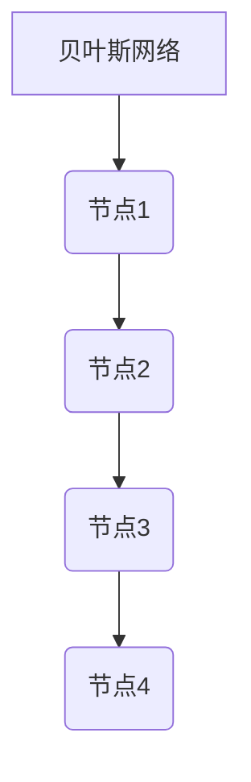
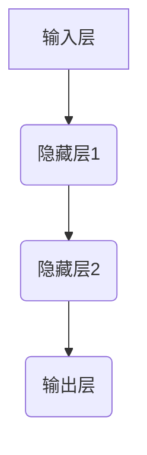
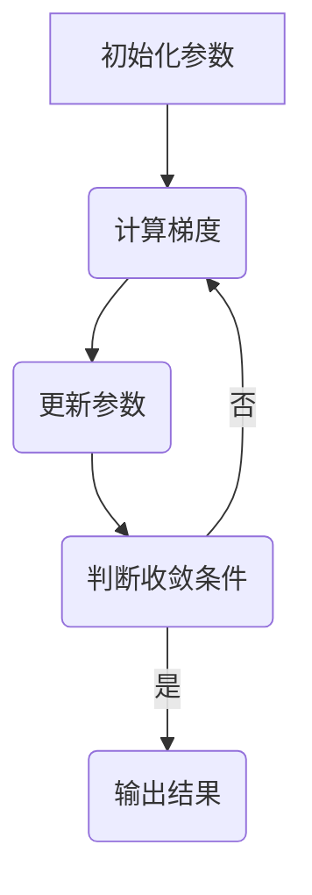

                 

关键词：数学模型、人工智能、机器学习、深度学习、神经网络、优化算法、概率图模型

摘要：本文将探讨数学模型在人工智能领域的应用，介绍核心概念、核心算法原理，以及数学模型和公式在具体案例中的应用。通过深入分析数学模型在AI中的重要性，为读者提供对AI领域有深度有思考有见解的技术视角。

## 1. 背景介绍

人工智能（AI）作为一种模拟人类智能的技术，近年来取得了飞速发展。AI的应用范围涵盖了计算机视觉、自然语言处理、机器学习、深度学习等多个领域。然而，AI的核心驱动力在于数学模型的应用。数学模型作为一种抽象的数学表示，为AI算法提供了理论基础和实现框架。

在AI领域，常见的数学模型包括概率图模型、神经网络、优化算法等。这些模型通过数学公式和算法实现了对数据的建模和分析，从而提高了AI系统的性能和效率。数学模型在AI中的应用不仅使得AI算法更准确、更高效，还为AI的研究提供了新的方法和工具。

## 2. 核心概念与联系

### 2.1 概率图模型

概率图模型是一种用于表示变量之间概率关系的数学模型。常见的概率图模型包括贝叶斯网络、马尔可夫网络等。以下是一个贝叶斯网络的 Mermaid 流程图示例：



### 2.2 神经网络

神经网络是一种模拟生物神经网络结构的数学模型。它由多个神经元组成，通过权重和偏置实现数据的非线性变换。以下是一个简单神经网络的 Mermaid 流程图示例：



### 2.3 优化算法

优化算法是一种用于求解最优化问题的数学算法。常见的优化算法包括梯度下降、牛顿法、遗传算法等。以下是一个梯度下降算法的 Mermaid 流程图示例：



## 3. 核心算法原理 & 具体操作步骤

### 3.1 算法原理概述

概率图模型、神经网络和优化算法是AI领域的重要核心算法。概率图模型用于表示变量之间的概率关系，神经网络用于实现数据的非线性变换，优化算法用于求解最优化问题。

### 3.2 算法步骤详解

#### 3.2.1 概率图模型

1. 构建概率图，表示变量之间的依赖关系。
2. 根据概率图计算条件概率分布。
3. 利用条件概率分布进行变量推断。

#### 3.2.2 神经网络

1. 初始化网络参数（权重和偏置）。
2. 前向传播，计算输出值。
3. 计算损失函数。
4. 反向传播，更新网络参数。
5. 重复步骤2-4，直至满足收敛条件。

#### 3.2.3 优化算法

1. 初始化参数。
2. 计算目标函数的梯度。
3. 更新参数，减小损失。
4. 判断收敛条件，重复步骤2-3。

### 3.3 算法优缺点

#### 3.3.1 概率图模型

优点：能够表示变量之间的复杂依赖关系。

缺点：计算复杂度高，难以处理大规模数据。

#### 3.3.2 神经网络

优点：能够自动学习数据的特征和规律。

缺点：对大量数据的需求，训练过程复杂。

#### 3.3.3 优化算法

优点：能够求解最优化问题，提高模型性能。

缺点：对目标函数的要求较高，易陷入局部最优。

### 3.4 算法应用领域

概率图模型、神经网络和优化算法在AI领域有广泛的应用，如：

1. 计算机视觉：用于图像分类、目标检测等。
2. 自然语言处理：用于文本分类、机器翻译等。
3. 机器学习：用于特征提取、模型评估等。
4. 优化问题求解：用于资源调度、路径规划等。

## 4. 数学模型和公式 & 详细讲解 & 举例说明

### 4.1 数学模型构建

数学模型构建是AI研究的重要环节。以下是一个简单线性回归模型的构建过程：

1. 假设输入变量为 $X$，输出变量为 $Y$。
2. 建立线性关系：$Y = aX + b$。
3. 选择适当的参数 $a$ 和 $b$，使得模型预测误差最小。

### 4.2 公式推导过程

线性回归模型的参数选择可以通过最小二乘法实现。具体公式如下：

$$
a = \frac{\sum_{i=1}^{n}(X_i - \bar{X})(Y_i - \bar{Y})}{\sum_{i=1}^{n}(X_i - \bar{X})^2}
$$

$$
b = \bar{Y} - a\bar{X}
$$

其中，$n$ 为样本数量，$\bar{X}$ 和 $\bar{Y}$ 分别为 $X$ 和 $Y$ 的均值。

### 4.3 案例分析与讲解

以下是一个线性回归模型的案例：

#### 案例背景

一家公司想要预测其下一季度的销售额。已知该公司的历史销售额数据如下表：

| 月份 | 销售额（万元） |
| ---- | ---------- |
| 1    | 200        |
| 2    | 220        |
| 3    | 230        |
| 4    | 250        |
| 5    | 260        |
| 6    | 270        |

#### 模型构建

根据历史数据，我们假设销售额 $Y$ 与月份 $X$ 存在线性关系：$Y = aX + b$。

#### 公式推导

利用最小二乘法，计算模型参数：

$$
a = \frac{\sum_{i=1}^{6}(X_i - \bar{X})(Y_i - \bar{Y})}{\sum_{i=1}^{6}(X_i - \bar{X})^2} = \frac{(1-2.5)(200-225) + (2-2.5)(220-225) + (3-2.5)(230-225) + (4-2.5)(250-225) + (5-2.5)(260-225) + (6-2.5)(270-225)}{(1-2.5)^2 + (2-2.5)^2 + (3-2.5)^2 + (4-2.5)^2 + (5-2.5)^2 + (6-2.5)^2} = 5.5
$$

$$
b = \bar{Y} - a\bar{X} = 225 - 5.5 \times 2.5 = 212.5
$$

因此，线性回归模型为：$Y = 5.5X + 212.5$。

#### 模型应用

利用该模型预测下一季度的销售额。设 $X$ 为 7，代入模型：

$$
Y = 5.5 \times 7 + 212.5 = 275.5
$$

预测下一季度的销售额为 275.5 万元。

## 5. 项目实践：代码实例和详细解释说明

### 5.1 开发环境搭建

为了实践数学模型在AI中的应用，我们需要搭建一个合适的开发环境。以下是一个简单的Python开发环境搭建步骤：

1. 安装Python（版本 3.6 或以上）。
2. 安装NumPy、Pandas、Matplotlib等Python库。

### 5.2 源代码详细实现

以下是一个简单的线性回归模型实现代码：

```python
import numpy as np
import pandas as pd
import matplotlib.pyplot as plt

# 读取数据
data = pd.read_csv('sales_data.csv')
X = data['month']
Y = data['sales']

# 求均值
X_mean = X.mean()
Y_mean = Y.mean()

# 计算模型参数
a = np.sum((X - X_mean) * (Y - Y_mean)) / np.sum((X - X_mean) ** 2)
b = Y_mean - a * X_mean

# 模型方程
model = a * X + b

# 绘制散点图和拟合直线
plt.scatter(X, Y)
plt.plot(X, model, color='red')
plt.xlabel('Month')
plt.ylabel('Sales')
plt.show()

# 预测销售额
X_new = np.array([7])
Y_new = a * X_new + b
print('Predicted sales for next quarter:', Y_new)
```

### 5.3 代码解读与分析

1. 导入所需的Python库。
2. 读取数据，提取月份和销售额。
3. 计算均值。
4. 计算模型参数（斜率和截距）。
5. 绘制散点图和拟合直线。
6. 预测下一季度的销售额。

通过该代码实例，我们实现了线性回归模型的构建和预测功能。

## 6. 实际应用场景

### 6.1 计算机视觉

在计算机视觉领域，数学模型广泛应用于图像分类、目标检测和图像生成等方面。例如，卷积神经网络（CNN）是一种用于图像分类的数学模型，通过多层卷积和池化操作提取图像特征，从而实现高精度的图像分类。

### 6.2 自然语言处理

在自然语言处理领域，概率图模型和神经网络广泛应用于文本分类、机器翻译和情感分析等任务。例如，贝叶斯网络用于文本分类，能够通过变量之间的概率关系实现高精度的分类效果；神经网络则通过编码和解码器实现高质量的机器翻译。

### 6.3 机器学习

在机器学习领域，优化算法用于求解最优化问题，如线性回归、支持向量机（SVM）等。优化算法通过迭代更新模型参数，使得模型在训练数据上达到最小损失，从而提高模型的泛化能力。

### 6.4 未来应用展望

随着人工智能技术的不断发展，数学模型在AI中的应用将更加广泛。未来，数学模型将不仅仅局限于现有领域，还将应用于更多的场景，如智能医疗、智能家居、自动驾驶等。同时，数学模型的优化和改进也将成为AI领域的重要研究方向，以实现更高性能和更广泛的应用。

## 7. 工具和资源推荐

### 7.1 学习资源推荐

1. 《深度学习》（Goodfellow、Bengio、Courville 著）：介绍了深度学习的基础知识和最新进展。
2. 《Python机器学习》（Sebastian Raschka 著）：讲解了Python在机器学习领域的应用。

### 7.2 开发工具推荐

1. TensorFlow：一个开源的深度学习框架，适用于各种深度学习任务。
2. PyTorch：一个开源的深度学习框架，提供了灵活的动态计算图功能。

### 7.3 相关论文推荐

1. "A Brief History of Neural Nets: From McCulloch-Pitts to Deep Learning"：回顾了神经网络的发展历程。
2. "Deep Learning"：由Ian Goodfellow、Yoshua Bengio和Aaron Courville撰写的深度学习教材。

## 8. 总结：未来发展趋势与挑战

### 8.1 研究成果总结

本文介绍了数学模型在AI领域的应用，包括概率图模型、神经网络和优化算法。通过案例分析和代码实例，展示了数学模型在AI中的实际应用场景。

### 8.2 未来发展趋势

未来，数学模型在AI中的应用将更加广泛，从计算机视觉、自然语言处理到机器学习等多个领域。同时，数学模型的优化和改进也将成为AI领域的重要研究方向。

### 8.3 面临的挑战

尽管数学模型在AI中取得了显著成果，但仍面临一些挑战，如：

1. 数据隐私和安全：在应用数学模型时，需要保护用户数据和隐私。
2. 模型可解释性：数学模型的黑盒特性使得模型难以解释，影响了模型的信任度和应用范围。
3. 计算资源需求：一些复杂的数学模型对计算资源有较高要求，限制了其应用范围。

### 8.4 研究展望

未来，数学模型在AI中的应用将朝着更高效、更智能、更安全的方向发展。通过优化和改进数学模型，提高模型的性能和可解释性，有望实现更广泛的应用。

## 9. 附录：常见问题与解答

### 9.1 问题1

**问题：如何选择合适的数学模型？**

**解答：选择合适的数学模型需要考虑以下因素：**

1. 数据特点：根据数据类型（如图像、文本、时间序列等）选择合适的模型。
2. 任务目标：根据具体任务（如分类、回归、聚类等）选择合适的模型。
3. 模型性能：考虑模型的准确率、召回率、F1值等指标。

### 9.2 问题2

**问题：如何优化数学模型？**

**解答：优化数学模型的方法包括：**

1. 调整模型参数：通过调节模型参数，使得模型在训练数据上达到更好的性能。
2. 采用更高效的算法：选择计算复杂度较低的算法，提高模型训练速度。
3. 增加数据集：通过增加数据集规模，提高模型的泛化能力。

----------------------------------------------------------------

作者：禅与计算机程序设计艺术 / Zen and the Art of Computer Programming

