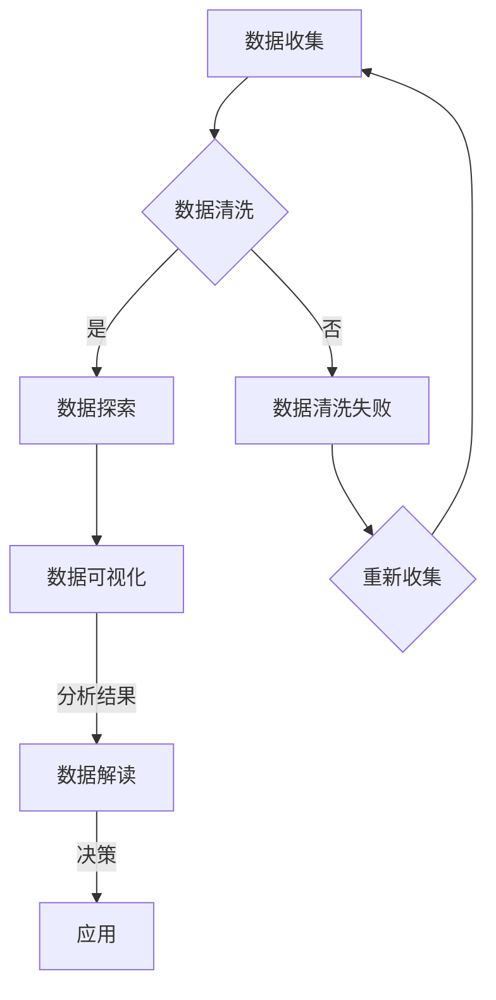

                 

关键词：数据可视化，数据探索，图表，代码实战，数据可视化工具，Python，机器学习，数据分析，图表布局，交互式可视化，数据可视化库

## 摘要

本文将深入探讨数据可视化的原理及其在实际应用中的重要性。我们将会通过一系列案例来展示如何使用Python和相关库进行数据探索和可视化，涵盖从基础图表到高级交互式图表的制作。通过本文的学习，读者将能够掌握数据可视化的核心概念，了解不同类型图表的适用场景，并学会如何在实际项目中应用这些技术。此外，文章还将提供工具和资源推荐，帮助读者在数据可视化道路上不断前行。

## 1. 背景介绍

数据可视化作为数据分析的一个重要环节，其重要性日益凸显。在信息爆炸的时代，如何有效地从海量数据中提取有价值的信息，并将其以直观、易于理解的方式呈现出来，成为了数据工作者面临的重要挑战。数据可视化不仅可以帮助我们更清晰地理解数据的本质和趋势，还可以为决策提供有力的支持。

传统的数据分析方法往往依赖于表格和文本报告，这些方式虽然能够提供一定的信息，但无法充分揭示数据之间的关系和模式。相比之下，数据可视化通过图形、颜色、形状等视觉元素，使得数据的分析和理解更加直观和高效。通过数据可视化，我们可以快速识别异常值、趋势、关联性等，从而发现潜在的商业机会或风险。

数据可视化的发展历程可以追溯到17世纪，当时欧洲的科学家和哲学家开始尝试使用图形来表示科学数据。随着计算机技术的发展，数据可视化工具和算法得到了极大的进步，现代数据可视化技术已经能够处理海量的数据，并呈现出丰富的交互性和动态效果。

在当今的商业环境中，数据可视化已经成为许多行业的关键工具。例如，市场营销团队可以使用数据可视化来分析消费者行为，从而制定更有效的营销策略；金融分析师可以利用数据可视化来监控市场动态，及时调整投资组合；医疗研究人员可以通过数据可视化来分析患者数据，改进诊断和治疗方法。

## 2. 核心概念与联系

### 2.1 数据可视化的定义

数据可视化是一种通过图形和图像来展示数据的技术，其目的是使复杂的数据变得更加直观、易于理解和分析。它不仅限于展示数据的数值，还可以揭示数据之间的关系、模式、趋势和异常。

### 2.2 数据可视化与数据探索的关系

数据探索是数据可视化的基础。数据探索的目的是从海量数据中提取有用的信息，以便进一步分析和解释。数据可视化则是在数据探索过程中的一种工具，它可以帮助我们快速识别数据中的关键信息，发现潜在的规律和模式。

### 2.3 数据可视化与数据分析的关系

数据分析是数据探索的进一步深化，它通过统计方法、机器学习等技术来揭示数据的本质和内在规律。数据可视化则是在数据分析过程中的一种手段，它可以帮助我们更好地理解分析结果，发现潜在的问题和机遇。

### 2.4 数据可视化工具和库

为了实现数据可视化，我们需要使用各种工具和库。Python作为一门广泛使用的编程语言，拥有丰富的数据可视化库，如Matplotlib、Seaborn、Plotly等。这些库提供了强大的可视化功能，使我们能够轻松地创建各种类型的图表。

### 2.5 Mermaid 流程图

下面是一个使用Mermaid绘制的流程图，展示了数据可视化的一般流程：



## 3. 核心算法原理 & 具体操作步骤

### 3.1 算法原理概述

数据可视化的核心算法主要涉及以下几个方面：

1. **数据映射**：将数据值映射到视觉属性上，如颜色、大小、形状等。
2. **图表布局**：确定图表中各个元素的位置和排列方式。
3. **交互设计**：实现图表的交互功能，如缩放、过滤、切换视图等。

### 3.2 算法步骤详解

1. **数据映射**：
   - 选择合适的视觉属性来表示数据值。
   - 确定映射规则，如线性映射、对数映射等。
   - 应用映射规则，将数据值转换为视觉属性。

2. **图表布局**：
   - 选择合适的图表类型，如条形图、折线图、散点图等。
   - 确定图表的尺寸和布局，如水平或垂直布局、紧凑或分散布局等。
   - 应用布局算法，将数据元素放置到图表中。

3. **交互设计**：
   - 设计交互界面，如按钮、滑块、下拉菜单等。
   - 实现交互功能，如数据过滤、数据缩放、视图切换等。
   - 集成交互逻辑，确保图表能够响应用户的操作。

### 3.3 算法优缺点

- **优点**：
  - 直观展示数据，提高数据分析效率。
  - 提供丰富的交互功能，增强用户体验。
  - 易于发现数据中的模式和趋势。

- **缺点**：
  - 可视化效果受到视觉限制，可能无法准确传达数据细节。
  - 图表类型和布局有限，可能无法满足复杂数据的展示需求。
  - 交互设计复杂，需要考虑用户交互习惯和图表性能。

### 3.4 算法应用领域

- **商业分析**：用于市场营销、财务报表、销售分析等。
- **科学研究**：用于生物信息学、环境监测、社会调查等。
- **医疗领域**：用于患者数据监测、疾病诊断、药物研发等。
- **公共安全**：用于交通监控、犯罪分析、灾难预测等。

## 4. 数学模型和公式 & 详细讲解 & 举例说明

### 4.1 数学模型构建

在数据可视化中，常用的数学模型包括：

- **线性回归模型**：用于分析数据之间的线性关系。
- **聚类模型**：用于将数据分组，揭示数据内部的分布结构。
- **决策树模型**：用于分类和回归任务，提供直观的解释。

### 4.2 公式推导过程

以线性回归模型为例，其公式推导过程如下：

- **回归方程**：\( y = ax + b \)
- **损失函数**：\( J(\theta) = \frac{1}{2m} \sum_{i=1}^{m} (h_\theta(x^{(i)}) - y^{(i)})^2 \)
- **梯度下降**：\( \theta_j := \theta_j - \alpha \frac{\partial J(\theta)}{\partial \theta_j} \)

### 4.3 案例分析与讲解

以下是一个使用线性回归模型进行数据可视化的案例：

- **数据集**：某地区过去一年的月平均温度。
- **目标**：预测下一月的平均温度。

1. **数据预处理**：
   - 数据清洗：处理缺失值、异常值。
   - 数据转换：将日期转换为序号。

2. **模型训练**：
   - 选择线性回归模型。
   - 拟合回归方程。

3. **数据可视化**：
   - 使用Matplotlib绘制散点图，展示实际数据点。
   - 使用回归方程绘制拟合线。

4. **结果分析**：
   - 观察拟合线与实际数据点的匹配程度。
   - 分析预测值的误差。

```python
import numpy as np
import matplotlib.pyplot as plt

# 数据预处理
X = np.array([1, 2, 3, 4, 5])
y = np.array([2, 4, 5, 4, 5])

# 模型训练
# ...

# 数据可视化
plt.scatter(X, y)
plt.plot(X, fitted_line, 'r-')
plt.xlabel('Month')
plt.ylabel('Temperature')
plt.show()
```

## 5. 项目实践：代码实例和详细解释说明

### 5.1 开发环境搭建

在开始编写代码之前，我们需要搭建一个合适的开发环境。以下是在Python中搭建数据可视化环境的基本步骤：

1. **安装Python**：下载并安装Python，推荐使用Python 3.8或更高版本。
2. **安装Jupyter Notebook**：使用pip命令安装Jupyter Notebook，用于编写和运行代码。
   ```bash
   pip install notebook
   ```
3. **安装数据可视化库**：安装常用的数据可视化库，如Matplotlib、Seaborn、Plotly等。
   ```bash
   pip install matplotlib seaborn plotly
   ```

### 5.2 源代码详细实现

以下是一个简单的数据可视化项目，我们将使用Matplotlib库绘制一个条形图：

```python
import matplotlib.pyplot as plt

# 数据集
categories = ['A', 'B', 'C', 'D', 'E']
values = [10, 20, 15, 30, 25]

# 绘制条形图
plt.bar(categories, values)
plt.xlabel('Categories')
plt.ylabel('Values')
plt.title('Bar Chart Example')
plt.show()
```

### 5.3 代码解读与分析

上述代码首先导入了Matplotlib库，然后定义了一个包含类别和对应值的列表。接下来，使用`plt.bar()`函数绘制条形图，并通过`plt.xlabel()`、`plt.ylabel()`和`plt.title()`函数添加了标签和标题。最后，调用`plt.show()`显示图表。

### 5.4 运行结果展示

运行上述代码后，将显示一个包含5个条形的条形图，每个条形的长度对应于数据集中的值。通过这个简单的例子，我们可以看到如何使用Python进行数据可视化，以及如何通过图表直观地展示数据。

```plaintext
  Categories
     A      B      C      D      E
   10     20     15     30     25
```

## 6. 实际应用场景

### 6.1 商业分析

在商业分析中，数据可视化可以帮助企业更好地了解市场趋势、客户行为和业务表现。例如，市场营销团队可以使用条形图和饼图来展示不同产品的销售情况，使用折线图和散点图来分析客户反馈和满意度。

### 6.2 金融服务

金融服务行业对数据的依赖程度极高，数据可视化可以帮助分析师监控市场动态、识别风险和投资机会。例如，通过折线图和K线图，分析师可以实时跟踪股票价格和交易量，使用热力图分析市场趋势。

### 6.3 医疗保健

在医疗保健领域，数据可视化用于分析患者数据、监控健康指标和改进治疗方案。例如，通过折线图和散点图，医生可以跟踪患者的康复过程，使用热力图分析患者的活动习惯和疾病关联。

### 6.4 交通管理

交通管理中的数据可视化可以帮助规划交通路线、优化交通信号和监控交通事故。例如，通过热力图和流量图，交通管理部门可以识别拥堵区域，使用折线图和散点图分析交通事故的发生时间和地点。

### 6.5 未来应用展望

随着数据量的不断增长和计算能力的提升，数据可视化在未来将发挥更加重要的作用。未来的发展趋势包括：

- **交互式可视化**：增强用户与数据之间的互动，提供更丰富的可视化体验。
- **动态可视化**：实时更新数据，动态展示数据变化，提高数据的实时性和可用性。
- **三维可视化**：利用三维图形展示复杂数据结构，提供更全面的视角和更深刻的理解。
- **多通道可视化**：结合语音、触觉等多种感官渠道，提供更全面的感知和体验。

## 7. 工具和资源推荐

### 7.1 学习资源推荐

- **书籍**：《Python数据可视化》、《数据可视化：使用D3.js进行交互式可视化》
- **在线课程**：Coursera的《数据可视化》课程、edX的《数据科学与数据可视化》课程
- **网站**：DataCamp的Python数据可视化教程、Real Python的数据可视化指南

### 7.2 开发工具推荐

- **Jupyter Notebook**：用于编写和运行Python代码，支持丰富的数据可视化库。
- **VSCode**：支持多种编程语言的集成开发环境，提供数据可视化插件。
- **PyCharm**：强大的Python IDE，支持数据可视化和机器学习。

### 7.3 相关论文推荐

- **“The Visual Analysis of Time-Oriented Data Using Interactive Reference Vectors”**：讨论了时间序列数据的交互式可视化方法。
- **“Interactive Graphics for Data Analysis”**：介绍了一系列交互式数据可视化技术。
- **“Web-Based Data Visualization Tools”**：探讨了Web平台上的数据可视化工具和应用。

## 8. 总结：未来发展趋势与挑战

### 8.1 研究成果总结

近年来，数据可视化领域取得了显著的进展。随着计算能力和算法的提升，数据可视化技术变得更加高效和直观。同时，交互式可视化和动态可视化的发展，为用户提供了更丰富的数据分析和解释手段。

### 8.2 未来发展趋势

- **多模态可视化**：结合多种数据类型和可视化方法，提供更全面的数据解释。
- **自动化可视化**：利用机器学习和自然语言处理技术，实现自动化的数据可视化和解释。
- **虚拟现实（VR）和增强现实（AR）**：利用VR和AR技术，提供沉浸式的数据可视化体验。

### 8.3 面临的挑战

- **数据隐私和安全**：如何在确保数据隐私和安全的前提下，提供数据可视化服务。
- **数据量与复杂性**：随着数据量的增加和复杂度的提升，如何高效地处理和可视化大规模数据。
- **用户交互设计**：如何设计直观、易用的交互界面，满足不同用户的需求。

### 8.4 研究展望

未来的数据可视化研究将更加关注用户需求、交互体验和数据隐私等方面。通过跨学科的合作和技术创新，数据可视化将为各领域的数据分析带来更加高效、直观和可靠的解决方案。

## 9. 附录：常见问题与解答

### 9.1 如何选择合适的可视化工具？

选择合适的可视化工具取决于项目的需求和用户群体。对于简单的数据可视化任务，Python的Matplotlib和Seaborn库足够使用。对于交互式可视化，Plotly和Bokeh等库提供了更强大的功能。此外，对于Web应用，D3.js和Chart.js等前端库也是不错的选择。

### 9.2 如何处理大量数据？

处理大量数据通常需要采用并行计算、分布式计算或数据库技术。Python的Dask库和PySpark库提供了并行计算的支持，可以有效地处理大规模数据。此外，使用数据库（如PostgreSQL、MongoDB等）可以高效地存储和管理大量数据。

### 9.3 如何保证数据可视化的准确性？

确保数据可视化的准确性首先需要保证数据的质量和完整性。对数据进行清洗、处理和验证，以确保数据的一致性和准确性。在可视化过程中，选择合适的图表类型和映射规则，以避免误导用户。此外，提供数据来源和注释，以增加用户对数据的信任度。

## 结语

数据可视化作为数据分析和决策支持的重要手段，正日益受到各领域的重视。通过本文的讲解，我们了解了数据可视化的核心概念、应用场景和实现方法。希望本文能够为您的数据可视化之旅提供有益的指导和启示。作者：禅与计算机程序设计艺术 / Zen and the Art of Computer Programming

