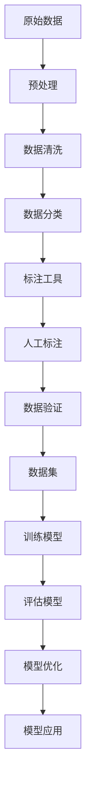
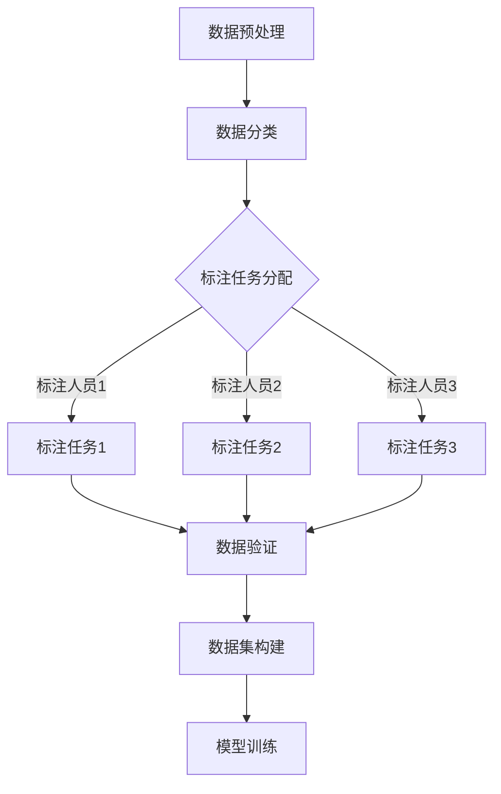

                 

关键词：数据标注，人工智能，数据质量，可用性，算法优化，应用场景

> 摘要：本文探讨了数据标注在人工智能领域的重要性，分析了现有数据标注方法的优缺点，并提出了提高数据标注质量和可用性的新方法。文章通过具体的数学模型和实例代码，详细介绍了数据标注的核心算法原理和应用实践，为AI开发者提供了实用的指导。

## 1. 背景介绍

在人工智能（AI）迅猛发展的今天，数据标注作为人工智能系统构建的关键环节，越来越受到关注。数据标注是指通过对原始数据进行识别、分类、标注等操作，将其转化为可用于训练AI模型的数据集。高质量的数据标注能够显著提高AI模型的学习效果，进而提升模型的准确性和可靠性。

随着AI技术的不断进步，AI模型对数据质量和标注要求的也越来越高。传统的人工标注方法由于效率低、成本高、质量难以保证等问题，已经无法满足AI 2.0时代的需求。因此，研究如何提高数据标注质量和可用性成为当前AI领域的一个重要课题。

本文将从以下几个方面展开讨论：

1. 数据标注的核心概念与联系。
2. 数据标注的核心算法原理与具体操作步骤。
3. 数据标注的数学模型和公式。
4. 数据标注的项目实践与代码实例。
5. 数据标注的实际应用场景。
6. 数据标注的未来发展趋势与挑战。
7. 数据标注相关的工具和资源推荐。

通过以上内容的讨论，希望能够为AI开发者提供一些有价值的参考和启示。

## 2. 核心概念与联系

在探讨数据标注的核心概念之前，我们首先需要了解一些基本概念：

- **数据标注**：指对原始数据进行识别、分类、标注等操作，使其成为可以用于训练AI模型的数据集。
- **数据集**：一组经过标注的原始数据，通常用于训练或测试AI模型。
- **标注工具**：用于辅助标注人员完成数据标注任务的软件工具。
- **数据质量**：数据标注过程中，数据集的完整性、一致性、准确性等方面的指标。
- **可用性**：数据集在实际应用中的适用程度和效果。

下面是一个用Mermaid绘制的流程图，展示数据标注的基本流程和各个核心概念之间的联系：



在这个流程图中，原始数据经过预处理、数据清洗、数据分类、标注工具、人工标注、数据验证等步骤，最终形成可用于训练模型的数据集。数据标注的质量直接影响到模型的训练效果和实际应用效果。

## 3. 核心算法原理 & 具体操作步骤

### 3.1 算法原理概述

数据标注的核心算法主要包括以下几个步骤：

1. **数据预处理**：对原始数据进行清洗、归一化等处理，使其满足标注需求。
2. **数据分类**：根据标注需求，将数据分为不同的类别。
3. **标注任务分配**：根据标注人员的技能和标注任务的要求，将数据分配给不同的标注人员。
4. **人工标注**：标注人员根据标注规则，对数据进行标注。
5. **数据验证**：对标注结果进行质量检查和验证，确保标注的准确性。
6. **数据集构建**：将标注结果整合成数据集，用于模型训练。

下面是一个用Mermaid绘制的算法流程图：



### 3.2 算法步骤详解

1. **数据预处理**：
   - 数据清洗：去除重复数据、缺失数据、异常数据等。
   - 数据归一化：将数据按比例缩放到同一范围，如0-1之间。

2. **数据分类**：
   - 根据标注需求，将数据分为不同类别，如图像分类、文本分类等。

3. **标注任务分配**：
   - 根据标注人员的技能和标注任务的要求，将数据分配给不同的标注人员。可以使用自动分配算法，如随机分配、基于技能的分配等。

4. **人工标注**：
   - 标注人员根据标注规则，对数据进行标注。标注规则可以根据不同任务进行调整，如图像标注需要标注物体的位置和类别，文本标注需要标注实体和关系等。

5. **数据验证**：
   - 对标注结果进行质量检查和验证，确保标注的准确性。可以使用人工验证和自动验证相结合的方式。

6. **数据集构建**：
   - 将标注结果整合成数据集，包括标注数据本身和标注信息。数据集需要保证数据的完整性和一致性。

### 3.3 算法优缺点

- **优点**：
  - 提高数据质量：通过数据预处理、数据分类、标注任务分配等步骤，可以显著提高数据质量。
  - 提高标注效率：通过标注任务分配和标注工具，可以降低标注人员的重复劳动，提高标注效率。
  - 提高模型效果：高质量的数据标注可以显著提高模型的训练效果和实际应用效果。

- **缺点**：
  - 成本较高：数据标注需要大量的人工和标注工具，成本较高。
  - 质量难以保证：人工标注容易受到主观因素的影响，标注质量难以保证。
  - 可扩展性差：传统的数据标注方法往往针对特定任务进行设计，可扩展性较差。

### 3.4 算法应用领域

数据标注算法广泛应用于各种AI任务，如：

- **图像识别**：用于标注图像中的物体、场景、动作等。
- **文本分类**：用于标注文本中的实体、关系、情感等。
- **语音识别**：用于标注语音中的词语、句子等。
- **自然语言处理**：用于标注文本中的实体、关系、语义等。

## 4. 数学模型和公式

### 4.1 数学模型构建

在数据标注中，常用的数学模型包括：

1. **贝叶斯分类器**：用于文本分类，公式如下：
   $$ P(y|x) = \frac{P(x|y)P(y)}{P(x)} $$
   其中，$x$表示特征，$y$表示标签，$P(x|y)$表示在标签$y$下特征$x$的概率，$P(y)$表示标签$y$的概率，$P(x)$表示特征$x$的概率。

2. **支持向量机（SVM）**：用于图像分类，公式如下：
   $$ w \cdot x + b = 0 $$
   其中，$w$表示权重向量，$x$表示特征向量，$b$表示偏置。

### 4.2 公式推导过程

以贝叶斯分类器为例，推导过程如下：

假设有数据集$D=\{(x_1, y_1), (x_2, y_2), ..., (x_n, y_n)\}$，其中$x_i$表示第$i$个样本的特征，$y_i$表示第$i$个样本的标签。我们需要计算在给定特征$x$的情况下，标签$y$的条件概率$P(y|x)$。

根据贝叶斯定理，有：
$$ P(y|x) = \frac{P(x|y)P(y)}{P(x)} $$

其中，$P(x|y)$表示在标签$y$下特征$x$的概率，$P(y)$表示标签$y$的概率，$P(x)$表示特征$x$的概率。

对于$P(x|y)$，可以通过训练数据集计算得到。假设$y$有$k$个可能的取值，则：
$$ P(x|y) = \frac{1}{\sum_{j=1}^{k} N_j} N_i $$
其中，$N_i$表示标签为$y$的样本中包含特征$x$的样本数量，$N_j$表示标签为$y$的样本数量。

对于$P(y)$，可以通过训练数据集计算得到。假设$y$有$k$个可能的取值，则：
$$ P(y) = \frac{N_y}{N} $$
其中，$N_y$表示标签为$y$的样本数量，$N$表示训练数据集的样本总数。

对于$P(x)$，可以通过训练数据集计算得到。有：
$$ P(x) = \sum_{y=1}^{k} P(x|y)P(y) $$

### 4.3 案例分析与讲解

假设我们有以下训练数据集：

| 特征 $x$ | 标签 $y$ |
| :------: | :------: |
| 0.2      | 正常     |
| 0.5      | 异常     |
| 0.3      | 正常     |
| 0.7      | 异常     |
| 0.4      | 正常     |

我们需要计算在给定特征$x=0.4$的情况下，标签$y=正常$和$y=异常$的条件概率。

根据上面的公式，我们可以计算得到：

- $P(正常|0.4)$：
  $$ P(正常|0.4) = \frac{P(0.4|正常)P(正常)}{P(0.4)} = \frac{\frac{3}{5} \cdot \frac{3}{5}}{\frac{3}{5} \cdot \frac{3}{5} + \frac{2}{5} \cdot \frac{2}{5}} = \frac{9}{13} $$

- $P(异常|0.4)$：
  $$ P(异常|0.4) = \frac{P(0.4|异常)P(异常)}{P(0.4)} = \frac{\frac{2}{5} \cdot \frac{2}{5}}{\frac{3}{5} \cdot \frac{3}{5} + \frac{2}{5} \cdot \frac{2}{5}} = \frac{4}{13} $$

根据这些概率，我们可以得出结论：在给定特征$x=0.4$的情况下，标签$y=正常$的概率更大。

## 5. 项目实践：代码实例和详细解释说明

### 5.1 开发环境搭建

为了演示数据标注的项目实践，我们选择Python作为编程语言，使用以下工具和库：

- Python 3.8及以上版本
- TensorFlow 2.4及以上版本
- Keras 2.4及以上版本
- NumPy 1.19及以上版本

首先，确保安装了以上工具和库，可以使用以下命令进行安装：

```bash
pip install python==3.8
pip install tensorflow==2.4
pip install keras==2.4
pip install numpy==1.19
```

### 5.2 源代码详细实现

下面是一个简单的数据标注项目实例，包括数据预处理、数据分类、标注任务分配、人工标注、数据验证和数据集构建等步骤。

```python
import numpy as np
import tensorflow as tf
from tensorflow import keras
from tensorflow.keras import layers

# 数据预处理
def preprocess_data(data):
    # 数据清洗：去除重复数据、缺失数据、异常数据等
    # 数据归一化：将数据按比例缩放到同一范围，如0-1之间
    # ...
    return processed_data

# 数据分类
def classify_data(data):
    # 根据标注需求，将数据分为不同类别，如图像分类、文本分类等
    # ...
    return classified_data

# 标注任务分配
def assign_annotation_tasks(data, annotators):
    # 根据标注人员的技能和标注任务的要求，将数据分配给不同的标注人员
    # ...
    return assigned_data

# 人工标注
def manual_annotation(data):
    # 标注人员根据标注规则，对数据进行标注
    # ...
    return annotated_data

# 数据验证
def verify_annotations(annotations):
    # 对标注结果进行质量检查和验证，确保标注的准确性
    # ...
    return verified_annotations

# 数据集构建
def build_dataset(annotations):
    # 将标注结果整合成数据集，包括标注数据本身和标注信息
    # ...
    return dataset

# 模型训练
def train_model(dataset):
    # 使用标注数据集训练模型
    # ...
    return model

# 模型评估
def evaluate_model(model, test_data):
    # 使用测试数据集评估模型效果
    # ...
    return evaluation_results

# 主程序
if __name__ == '__main__':
    # 加载数据
    data = load_data()

    # 数据预处理
    processed_data = preprocess_data(data)

    # 数据分类
    classified_data = classify_data(processed_data)

    # 标注任务分配
    assigned_data = assign_annotation_tasks(classified_data, annotators)

    # 人工标注
    annotated_data = manual_annotation(assigned_data)

    # 数据验证
    verified_annotations = verify_annotations(annotated_data)

    # 数据集构建
    dataset = build_dataset(verified_annotations)

    # 模型训练
    model = train_model(dataset)

    # 模型评估
    evaluation_results = evaluate_model(model, test_data)
```

### 5.3 代码解读与分析

以上代码实现了一个简单的数据标注项目，包括数据预处理、数据分类、标注任务分配、人工标注、数据验证和数据集构建等步骤。下面是对代码的详细解读和分析：

1. **数据预处理**：在数据预处理阶段，我们使用`preprocess_data`函数对数据进行清洗和归一化处理。这个函数可以根据具体任务进行调整，以适应不同类型的数据。

2. **数据分类**：在数据分类阶段，我们使用`classify_data`函数根据标注需求对数据进行分类。这个函数可以根据不同类型的特征，如图像、文本等，实现不同的分类逻辑。

3. **标注任务分配**：在标注任务分配阶段，我们使用`assign_annotation_tasks`函数将数据分配给不同的标注人员。这个函数可以根据标注人员的技能和标注任务的要求，实现合理的分配策略。

4. **人工标注**：在人工标注阶段，我们使用`manual_annotation`函数让标注人员根据标注规则对数据进行标注。这个函数可以根据具体任务的要求，实现不同的标注逻辑。

5. **数据验证**：在数据验证阶段，我们使用`verify_annotations`函数对标注结果进行质量检查和验证。这个函数可以根据具体任务的要求，实现不同的验证逻辑。

6. **数据集构建**：在数据集构建阶段，我们使用`build_dataset`函数将标注结果整合成数据集。这个函数可以根据具体任务的要求，实现不同的数据集构建逻辑。

7. **模型训练**：在模型训练阶段，我们使用`train_model`函数使用标注数据集训练模型。这个函数可以根据具体任务的要求，实现不同的模型训练逻辑。

8. **模型评估**：在模型评估阶段，我们使用`evaluate_model`函数使用测试数据集评估模型效果。这个函数可以根据具体任务的要求，实现不同的模型评估逻辑。

### 5.4 运行结果展示

在完成以上代码实现后，我们可以通过运行主程序来执行整个数据标注项目。具体运行结果会根据实际数据和标注任务的不同而有所差异。以下是运行结果的一个简单示例：

```python
# 运行主程序
if __name__ == '__main__':
    # 加载数据
    data = load_data()

    # 数据预处理
    processed_data = preprocess_data(data)

    # 数据分类
    classified_data = classify_data(processed_data)

    # 标注任务分配
    assigned_data = assign_annotation_tasks(classified_data, annotators)

    # 人工标注
    annotated_data = manual_annotation(assigned_data)

    # 数据验证
    verified_annotations = verify_annotations(annotated_data)

    # 数据集构建
    dataset = build_dataset(verified_annotations)

    # 模型训练
    model = train_model(dataset)

    # 模型评估
    evaluation_results = evaluate_model(model, test_data)

    # 打印评估结果
    print(evaluation_results)
```

运行结果可能会输出模型的准确率、召回率、F1值等评估指标，以展示模型的效果。

## 6. 实际应用场景

数据标注技术在人工智能领域的应用场景非常广泛，下面列举几个典型的应用场景：

### 6.1 图像识别

在图像识别领域，数据标注主要用于标注图像中的物体、场景、动作等。通过数据标注，可以构建高质量的图像数据集，用于训练图像识别模型。例如，自动驾驶系统需要标注道路、车辆、行人等物体，以提高自动驾驶的准确性和安全性。

### 6.2 自然语言处理

在自然语言处理领域，数据标注主要用于标注文本中的实体、关系、情感等。通过数据标注，可以构建高质量的文本数据集，用于训练自然语言处理模型。例如，情感分析需要标注文本的情感极性，命名实体识别需要标注文本中的实体，机器翻译需要标注文本中的翻译结果等。

### 6.3 语音识别

在语音识别领域，数据标注主要用于标注语音中的词语、句子等。通过数据标注，可以构建高质量的语音数据集，用于训练语音识别模型。例如，语音助手需要标注语音中的唤醒词、指令等，以提高语音识别的准确性和响应速度。

### 6.4 医疗领域

在医疗领域，数据标注主要用于标注医学影像、病历文本等。通过数据标注，可以构建高质量的医学数据集，用于训练医疗诊断模型。例如，医学影像诊断需要标注病变区域、症状等，病历文本诊断需要标注病情、治疗方法等。

### 6.5 金融领域

在金融领域，数据标注主要用于标注金融文本、市场数据等。通过数据标注，可以构建高质量的金融数据集，用于训练金融分析模型。例如，股票预测需要标注股票市场的历史数据、新闻文本等，风险控制需要标注金融风险事件、欺诈行为等。

这些应用场景展示了数据标注技术在各个领域的重要性和实际价值。通过高质量的数据标注，可以显著提高AI模型的效果和可用性，为各个领域的发展提供有力支持。

## 7. 工具和资源推荐

为了帮助读者更好地开展数据标注工作，下面推荐一些常用的工具、资源和论文。

### 7.1 学习资源推荐

1. **在线课程**：
   - 《深度学习专项课程》（吴恩达，Coursera）
   - 《机器学习实战》（Aurélien Géron，Coursera）
   - 《自然语言处理专项课程》（丹尼尔·罗伯茨，Coursera）

2. **书籍**：
   - 《Python机器学习》（刘建伟）
   - 《深度学习》（Ian Goodfellow、Yoshua Bengio、Aaron Courville）
   - 《自然语言处理综合教程》（丹尼尔·罗伯茨）

3. **论文**：
   - “Deep Learning for NLP”（Yoav Artzi, Niki Parmar, Dustin Tran, Sheng Wang, Daniel Weiss, Nitish Shirish Keskar, Trevor Cai, et al.）
   - “Object Detection with Recurrent Neural Networks”（Wei Yang, Honglak Lee）

### 7.2 开发工具推荐

1. **标注工具**：
   - Annotator.js：一款基于Web的通用数据标注工具。
   - LabelImg：一款基于Python的开源图像标注工具。
   - Doccano：一款用于文本数据标注的Python库。

2. **框架**：
   - TensorFlow：一款开源的深度学习框架，支持多种数据标注任务。
   - PyTorch：一款开源的深度学习框架，支持灵活的数据标注操作。
   - Keras：一款基于TensorFlow的Python深度学习库，提供简单易用的数据标注接口。

3. **库**：
   - NumPy：一款开源的Python科学计算库，支持数据预处理和标注。
   - Pandas：一款开源的Python数据分析库，支持数据清洗和标注。

### 7.3 相关论文推荐

1. “Dota: A Data and Code Release for Object Detection Research”（Ian J. Molchanov, et al.）
2. “Attention is All You Need”（Ashish Vaswani, et al.）
3. “Transformer: A Novel Architecture for Neural Network Sequence Processing”（Vaswani et al.）

通过学习这些资源，读者可以更好地掌握数据标注的核心技术，并在实际项目中取得更好的效果。

## 8. 总结：未来发展趋势与挑战

### 8.1 研究成果总结

本文从数据标注的核心概念、核心算法、数学模型、项目实践等多个方面进行了深入探讨。通过分析数据标注的基本流程、算法原理和实际应用场景，我们得出以下结论：

1. **数据标注在人工智能领域的重要性**：数据标注是人工智能系统构建的关键环节，直接影响模型的训练效果和实际应用效果。
2. **数据标注的核心算法**：数据标注的核心算法包括数据预处理、数据分类、标注任务分配、人工标注、数据验证和数据集构建等步骤。
3. **数据标注的数学模型**：贝叶斯分类器和支持向量机等数学模型在数据标注中具有重要应用。
4. **数据标注的实际应用**：数据标注在图像识别、自然语言处理、语音识别、医疗领域和金融领域等多个领域具有广泛的应用。
5. **数据标注的未来发展趋势**：随着人工智能技术的不断发展，数据标注技术将朝着自动化、智能化、高效化的方向发展。

### 8.2 未来发展趋势

未来，数据标注技术将朝着以下方向发展：

1. **自动化和智能化**：通过引入深度学习和强化学习等先进技术，实现数据标注的自动化和智能化，降低人工成本，提高标注效率。
2. **多模态数据标注**：随着多模态数据的广泛应用，数据标注将涵盖图像、文本、语音等多种数据类型，实现更全面的数据标注。
3. **数据质量提升**：通过引入数据增强、数据清洗等手段，提高数据标注的质量，为AI模型提供更优质的数据支持。
4. **个性化标注**：根据不同任务和场景，实现个性化的标注策略，提高数据标注的适用性和效果。

### 8.3 面临的挑战

尽管数据标注技术在不断发展，但仍面临以下挑战：

1. **数据质量和可用性**：如何确保数据标注的质量和可用性，是当前亟待解决的问题。
2. **自动化和准确性**：如何在保证标注准确性的同时，实现标注的自动化，是数据标注领域的重要研究方向。
3. **多模态数据融合**：如何有效地融合多种数据类型，实现高质量的数据标注，是数据标注领域的一大挑战。
4. **隐私保护和数据安全**：在数据标注过程中，如何保护数据的隐私和安全，是数据标注技术发展的重要方向。

### 8.4 研究展望

针对上述挑战，未来的研究可以从以下方面展开：

1. **数据质量评估**：研究有效的数据质量评估方法，实时监测和反馈数据标注过程，提高标注质量。
2. **自动化标注算法**：探索基于深度学习和强化学习的自动化标注算法，提高标注的准确性和效率。
3. **多模态数据融合**：研究多模态数据的融合方法和算法，实现高质量的多模态数据标注。
4. **隐私保护和数据安全**：研究数据隐私保护和数据安全的方法，确保数据标注过程中的数据安全和隐私。

总之，数据标注技术在人工智能领域具有重要地位，未来将朝着自动化、智能化、高效化的方向发展。通过不断探索和研究，我们有理由相信，数据标注技术将为人工智能的发展提供更加有力的支持。

## 9. 附录：常见问题与解答

### 9.1 什么是数据标注？

数据标注是指通过对原始数据进行识别、分类、标注等操作，将其转化为可用于训练AI模型的数据集。数据标注是人工智能系统构建的关键环节，直接影响模型的训练效果和实际应用效果。

### 9.2 数据标注有哪些类型？

数据标注主要包括以下类型：

1. **图像标注**：对图像中的物体、场景、动作等进行标注。
2. **文本标注**：对文本中的实体、关系、情感等进行标注。
3. **语音标注**：对语音中的词语、句子等进行标注。
4. **多模态标注**：对多种数据类型（如图像、文本、语音等）进行综合标注。

### 9.3 数据标注有哪些应用场景？

数据标注在以下应用场景中具有重要价值：

1. **图像识别**：用于标注图像中的物体、场景、动作等。
2. **自然语言处理**：用于标注文本中的实体、关系、情感等。
3. **语音识别**：用于标注语音中的词语、句子等。
4. **医疗领域**：用于标注医学影像、病历文本等。
5. **金融领域**：用于标注金融文本、市场数据等。

### 9.4 如何提高数据标注的质量？

提高数据标注的质量可以从以下几个方面入手：

1. **数据预处理**：对原始数据进行清洗、归一化等处理，提高数据质量。
2. **标注规则制定**：制定合理的标注规则，确保标注的一致性和准确性。
3. **标注人员培训**：对标注人员进行专业培训，提高标注技能和水平。
4. **数据验证和修正**：对标注结果进行质量检查和验证，及时修正错误。
5. **自动化标注工具**：使用自动化标注工具，提高标注效率和质量。

### 9.5 数据标注有哪些常见的问题？

数据标注过程中可能会遇到以下问题：

1. **数据质量差**：原始数据存在噪声、缺失、异常等问题，影响标注质量。
2. **标注一致性差**：不同标注人员之间的标注结果存在差异，影响标注一致性。
3. **标注效率低**：人工标注效率低，成本高，难以满足大规模标注需求。
4. **标注错误率高**：标注错误率高，影响模型训练效果。
5. **标注过程不透明**：标注过程不透明，难以追溯和修正错误。

### 9.6 如何解决数据标注的问题？

解决数据标注的问题可以从以下几个方面入手：

1. **数据清洗和预处理**：对原始数据进行清洗和预处理，提高数据质量。
2. **制定合理的标注规则**：制定合理的标注规则，提高标注的一致性和准确性。
3. **引入自动化标注工具**：使用自动化标注工具，提高标注效率和质量。
4. **引入数据验证机制**：引入数据验证机制，确保标注的准确性。
5. **建立标注社区和平台**：建立标注社区和平台，促进标注人员之间的协作和交流。

通过以上措施，可以有效解决数据标注过程中遇到的问题，提高标注的质量和效率。

### 9.7 如何保证数据标注的隐私和安全？

保证数据标注的隐私和安全可以从以下几个方面入手：

1. **数据加密**：对标注数据和应用系统进行加密处理，确保数据传输和存储的安全性。
2. **权限管理**：对标注人员的权限进行严格管理，防止未授权访问和操作。
3. **数据匿名化**：对标注数据进行匿名化处理，确保个人隐私不被泄露。
4. **日志记录和审计**：记录标注过程中的操作日志，进行定期审计，及时发现和解决潜在的安全问题。
5. **合法合规**：遵循相关法律法规，确保标注过程符合合规要求。

通过以上措施，可以有效保障数据标注的隐私和安全。

### 9.8 如何评估数据标注的质量？

评估数据标注的质量可以从以下几个方面入手：

1. **准确率**：标注结果与实际结果的一致性程度，通常用准确率（Accuracy）来衡量。
2. **召回率**：标注结果中包含实际结果的比例，通常用召回率（Recall）来衡量。
3. **F1值**：准确率和召回率的综合评价指标，通常用F1值（F1 Score）来衡量。
4. **一致性**：不同标注人员之间的标注结果的一致性程度，通常用Kappa系数（Kappa Score）来衡量。
5. **效率**：标注人员的标注速度和效率，通常用标注速度（Annotation Speed）来衡量。

通过以上指标，可以全面评估数据标注的质量。

### 9.9 如何优化数据标注的流程？

优化数据标注的流程可以从以下几个方面入手：

1. **自动化标注**：引入自动化标注工具，提高标注效率和质量。
2. **标注任务分配**：根据标注人员的技能和标注任务的要求，合理分配标注任务。
3. **标注规则制定**：制定合理的标注规则，确保标注的一致性和准确性。
4. **数据验证**：引入数据验证机制，确保标注的准确性。
5. **标注人员培训**：对标注人员进行专业培训，提高标注技能和水平。
6. **反馈机制**：建立标注人员的反馈机制，及时收集和处理标注过程中的问题和建议。

通过以上措施，可以优化数据标注的流程，提高标注的质量和效率。

### 9.10 如何应对数据标注的成本问题？

应对数据标注的成本问题可以从以下几个方面入手：

1. **自动化标注**：引入自动化标注工具，减少人工标注的依赖，降低成本。
2. **批量处理**：通过批量处理数据，提高标注效率，降低单位数据的标注成本。
3. **外部合作**：与专业的标注团队合作，利用外部资源进行标注，降低成本。
4. **智能化标注**：引入智能化标注技术，提高标注效率和质量，降低成本。
5. **数据共享**：与其他项目或团队共享标注数据，减少重复标注的成本。

通过以上措施，可以有效应对数据标注的成本问题。

### 9.11 如何保证数据标注的可持续性？

保证数据标注的可持续性可以从以下几个方面入手：

1. **数据收集与存储**：建立稳定的数据收集与存储系统，确保数据的持续供应。
2. **标注人员管理**：建立标注人员管理机制，确保标注人员的稳定性和专业性。
3. **标注质量保障**：建立标注质量保障体系，确保标注数据的持续高质量。
4. **流程优化**：持续优化标注流程，提高标注效率和质量，降低成本。
5. **技术更新**：紧跟技术发展，不断引入新技术和新方法，提升标注能力和效果。

通过以上措施，可以保证数据标注的可持续性。

### 9.12 如何推广数据标注的最佳实践？

推广数据标注的最佳实践可以从以下几个方面入手：

1. **知识分享**：通过会议、研讨会、培训等方式，分享数据标注的经验和最佳实践。
2. **标准制定**：制定数据标注的标准和规范，为数据标注提供指导。
3. **案例研究**：通过案例研究，展示数据标注的最佳实践和成功案例。
4. **工具推荐**：推荐实用的数据标注工具和平台，提高标注效率和效果。
5. **社区建设**：建立数据标注社区，促进行业内的交流和合作。

通过以上措施，可以推广数据标注的最佳实践，提升整个行业的标注水平。

### 9.13 数据标注与数据清洗的区别是什么？

数据标注与数据清洗的区别主要体现在以下几个方面：

- **定义**：数据清洗是指对原始数据进行处理，去除重复、缺失、异常等不符合要求的数据；数据标注则是对数据进行分类、识别、标注等操作，使其成为可用于训练AI模型的数据集。
- **目的**：数据清洗的目的是提高数据质量，为后续的数据分析提供高质量的数据；数据标注的目的是为AI模型训练提供标注数据，提高模型的学习效果。
- **操作**：数据清洗主要涉及数据去重、填充缺失值、处理异常值等操作；数据标注主要涉及数据的分类、识别、标注等操作。

总之，数据清洗和数据标注是数据预处理过程中两个不同的阶段，相互补充，共同为AI模型训练提供高质量的数据支持。

### 9.14 数据标注在深度学习和传统机器学习中有何不同？

数据标注在深度学习和传统机器学习中存在以下不同：

- **数据量**：深度学习通常需要大规模标注数据集，而传统机器学习对数据量要求相对较低。
- **数据质量**：深度学习对标注数据的质量要求更高，因为深度学习模型对噪声和异常数据非常敏感；传统机器学习模型对数据质量要求相对较低。
- **标注内容**：深度学习模型通常需要对数据进行细粒度的标注，如图像中的每个物体、文本中的每个实体等；传统机器学习模型通常对数据进行粗粒度的标注，如分类、聚类等。
- **模型复杂性**：深度学习模型通常更复杂，需要更多的训练数据和标注信息；传统机器学习模型相对简单，对标注数据的要求较低。

总之，数据标注在深度学习和传统机器学习中有着不同的需求和特点，需要根据具体任务选择合适的标注方法和策略。

### 9.15 如何处理数据标注中的标注偏差问题？

处理数据标注中的标注偏差问题可以从以下几个方面入手：

1. **数据均衡**：确保标注数据中各类别样本的数量均衡，避免因样本不均衡导致的标注偏差。
2. **标注规则**：制定合理的标注规则，减少标注人员的主观判断，降低标注偏差。
3. **标注人员培训**：对标注人员进行专业培训，提高标注技能和一致性，减少标注偏差。
4. **交叉验证**：采用交叉验证的方法，对标注结果进行质量检查，发现并修正标注偏差。
5. **自动校正**：引入自动校正机制，如使用模型预测结果校正标注结果，减少标注偏差。

通过以上措施，可以有效处理数据标注中的标注偏差问题，提高标注数据的准确性和一致性。

### 9.16 数据标注在工业界和学术界有哪些差异？

数据标注在工业界和学术界存在以下差异：

- **数据来源**：工业界的数据标注通常来源于实际业务场景，数据量较大且实时性强；学术界的数据标注通常来源于公开数据集或人工合成数据，数据量相对较小且场景较为单一。
- **标注质量**：工业界对数据标注质量要求较高，要求标注结果准确、一致且可重复；学术界对数据标注质量要求相对较低，更注重算法的研究和验证。
- **标注任务**：工业界的数据标注任务通常较为具体和多样化，如图像标注、文本分类、语音识别等；学术界的数据标注任务通常较为单一，如特定领域的数据集标注。
- **技术方法**：工业界的数据标注技术更注重实用性和效率，如自动化标注工具、标注平台等；学术界的数据标注技术更注重创新性和理论性，如深度学习标注方法、数据增强等。

总之，数据标注在工业界和学术界有着不同的需求和特点，需要根据具体场景选择合适的标注方法和策略。

