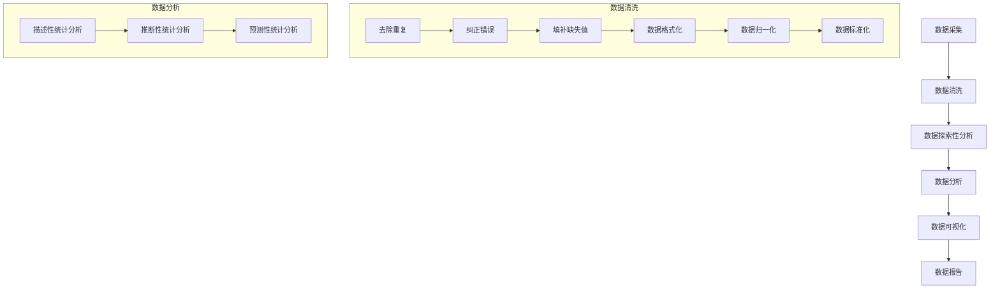

                 

关键词：数据清洗、统计分析、Python、案例实战、数据预处理、算法实现、代码讲解、数据处理流程、数据分析技巧、开源工具

## 摘要

本文将详细介绍数据清洗与统计分析的原理及其在实际项目中的应用。我们将首先探讨数据清洗的必要性，然后介绍常用的数据清洗技术，接着深入解析统计分析的核心概念和算法原理。通过一系列的代码实战案例，读者将学会如何运用Python等编程语言进行数据清洗和统计分析，从而提升数据处理与分析的能力。文章还将讨论数据清洗与统计分析在实际应用中的重要性，并提供一些建议和资源，帮助读者进一步学习和实践。

## 1. 背景介绍

在当今的信息化时代，数据已经成为企业和社会中不可或缺的资产。无论是商业决策、科学研究还是政府治理，数据都发挥着至关重要的作用。然而，数据的价值往往取决于其质量，而数据质量问题主要集中在数据的不完整性、不一致性和错误性。因此，数据清洗成为了数据分析和挖掘的前期重要步骤。

### 1.1 数据清洗的重要性

数据清洗是指在数据采集、存储、处理和传输过程中，对数据进行清理、纠正和格式化的一系列操作。其重要性体现在以下几个方面：

- **保证数据质量**：良好的数据质量是进行准确分析和决策的基础。通过数据清洗，可以去除无效数据、纠正错误数据、填补缺失值，从而提升数据的可靠性和完整性。
- **提高效率**：清洗后的数据可以直接用于分析，减少了后续处理的复杂性，提高了数据处理和分析的效率。
- **降低风险**：数据清洗有助于发现潜在的问题和异常值，减少因数据错误导致的分析结果偏差和决策失误。

### 1.2 数据清洗与统计分析的关系

数据清洗和统计分析是数据科学领域中的两个重要环节，它们之间存在着密切的关系：

- **数据清洗**：是统计分析的前期准备工作，确保数据的准确性和一致性。
- **统计分析**：是利用清洗后的数据进行定量分析，提取有价值的信息和洞见，为决策提供支持。

## 2. 核心概念与联系

在深入探讨数据清洗和统计分析之前，我们需要理解一些核心概念和它们之间的联系。以下是一个简化的Mermaid流程图，展示了数据清洗与统计分析的流程和关系：



### 2.1 数据清洗的核心步骤

- **去除重复**：识别并删除重复的数据记录。
- **纠正错误**：发现并修正数据中的错误。
- **填补缺失值**：处理数据中的缺失值，可以通过平均值、中位数、最邻近值或插值法等方法。
- **数据格式化**：将数据转换为统一的格式，如日期格式、字符串编码等。
- **数据归一化**：将数据缩放到一个特定的范围，如[0,1]或[-1,1]。
- **数据标准化**：通过减去平均值并除以标准差，将数据转换为标准正态分布。

### 2.2 数据分析的核心类型

- **描述性统计分析**：用于描述数据的中心趋势、离散度等基本特征。
- **推断性统计分析**：用于从样本数据推断总体特征，如假设检验、置信区间等。
- **预测性统计分析**：用于建立模型并预测未来的趋势或行为。

## 3. 核心算法原理 & 具体操作步骤

### 3.1 算法原理概述

数据清洗和统计分析中的算法原理主要涉及以下几个方面：

- **数据预处理**：包括去除重复、纠正错误、填补缺失值等。
- **描述性统计分析**：涉及计算均值、中位数、标准差等。
- **推断性统计分析**：包括t检验、方差分析等。
- **预测性统计分析**：涉及回归分析、时间序列分析等。

### 3.2 算法步骤详解

#### 3.2.1 数据预处理

1. **去除重复**：
   - 使用Pandas库中的`drop_duplicates()`方法。
   ```python
   df = df.drop_duplicates()
   ```

2. **纠正错误**：
   - 使用逻辑判断或自定义函数进行错误识别和修正。
   ```python
   df = df[df['column_name'] != 'error_value']
   ```

3. **填补缺失值**：
   - 使用`fillna()`方法进行填补。
   ```python
   df = df.fillna({'column_name': 'default_value'})
   ```

4. **数据格式化**：
   - 使用`astype()`方法进行数据类型的转换。
   ```python
   df['date_column'] = df['date_column'].astype('datetime64')
   ```

5. **数据归一化**：
   - 使用`MinMaxScaler`或`StandardScaler`进行归一化。
   ```python
   from sklearn.preprocessing import MinMaxScaler
   scaler = MinMaxScaler()
   df['column_name'] = scaler.fit_transform(df[['column_name']])
   ```

6. **数据标准化**：
   - 使用`StandardScaler`进行标准化。
   ```python
   from sklearn.preprocessing import StandardScaler
   scaler = StandardScaler()
   df['column_name'] = scaler.fit_transform(df[['column_name']])
   ```

#### 3.2.2 描述性统计分析

1. **计算均值**：
   - 使用`mean()`方法。
   ```python
   mean_value = df['column_name'].mean()
   ```

2. **计算中位数**：
   - 使用`median()`方法。
   ```python
   median_value = df['column_name'].median()
   ```

3. **计算标准差**：
   - 使用`std()`方法。
   ```python
   std_value = df['column_name'].std()
   ```

#### 3.2.3 推断性统计分析

1. **t检验**：
   - 使用`scipy.stats.ttest_ind()`方法。
   ```python
   from scipy import stats
   t_stat, p_value = stats.ttest_ind(df['column_name1'], df['column_name2'])
   ```

2. **方差分析**：
   - 使用`scipy.stats.f_oneway()`方法。
   ```python
   f_stat, p_value = stats.f_oneway(df['column_name1'], df['column_name2'], df['column_name3'])
   ```

#### 3.2.4 预测性统计分析

1. **回归分析**：
   - 使用`sklearn.linear_model.LinearRegression()`方法。
   ```python
   from sklearn.linear_model import LinearRegression
   model = LinearRegression()
   model.fit(X, y)
   ```

2. **时间序列分析**：
   - 使用`statsmodels.tsa.AR()`方法。
   ```python
   from statsmodels.tsa.ar_model import AR
   model = AR(lags=1)
   model.fit(df['time_column'])
   ```

### 3.3 算法优缺点

#### 数据预处理

- **优点**：
  - 提高数据质量，为后续分析提供可靠的数据基础。
  - 减少数据冗余，节省存储空间。
- **缺点**：
  - 需要大量时间和计算资源，特别是在大规模数据处理时。
  - 可能会引入新的误差，如缺失值填补方法的假设。

#### 描述性统计分析

- **优点**：
  - 提供数据的中心趋势和离散度，便于理解数据分布。
  - 简单直观，易于实现。
- **缺点**：
  - 无法提供关于数据关系的深入见解。

#### 推断性统计分析

- **优点**：
  - 可以从样本推断总体，提高分析的可靠性和实用性。
  - 可以检验假设，验证数据关系的显著性。
- **缺点**：
  - 对数据质量和样本量的要求较高。
  - 可能会受到统计方法选择的影响。

#### 预测性统计分析

- **优点**：
  - 可以预测未来趋势和行为，为决策提供支持。
  - 可以建立模型，实现自动化分析。
- **缺点**：
  - 需要大量的历史数据。
  - 模型的预测能力受到数据质量和模型选择的影响。

### 3.4 算法应用领域

数据清洗和统计分析在各个领域都有着广泛的应用：

- **商业领域**：用于市场分析、需求预测、风险控制等。
- **科学研究**：用于数据挖掘、实验设计、结果分析等。
- **医疗领域**：用于疾病预测、患者管理、临床试验分析等。
- **金融领域**：用于风险评估、投资策略、市场预测等。
- **政府和公共管理**：用于政策制定、公共资源分配、灾害预测等。

## 4. 数学模型和公式 & 详细讲解 & 举例说明

### 4.1 数学模型构建

数据清洗和统计分析中常用的数学模型包括：

- **均值**：
  $$ \bar{x} = \frac{1}{n}\sum_{i=1}^{n} x_i $$
- **中位数**：
  $$ M = \left( \frac{n+1}{2} \right) \text{th} \text{ ordered statistic} $$
- **标准差**：
  $$ \sigma = \sqrt{\frac{1}{n-1}\sum_{i=1}^{n} (x_i - \bar{x})^2} $$
- **t检验**：
  $$ t = \frac{\bar{x} - \mu_0}{s/\sqrt{n}} $$
  其中，$\mu_0$ 是总体均值，$s$ 是样本标准差。
- **方差分析**：
  $$ F = \frac{MS_{between}}{MS_{within}} $$
  其中，$MS_{between}$ 是组间均方，$MS_{within}$ 是组内均方。
- **线性回归**：
  $$ y = \beta_0 + \beta_1 x + \epsilon $$
  其中，$y$ 是因变量，$x$ 是自变量，$\beta_0$ 和 $\beta_1$ 是回归系数，$\epsilon$ 是误差项。
- **时间序列模型**：
  $$ y_t = c + \phi y_{t-1} + \epsilon_t $$
  其中，$y_t$ 是时间序列的当前值，$c$ 是常数项，$\phi$ 是自回归系数，$\epsilon_t$ 是误差项。

### 4.2 公式推导过程

这里我们以标准差的推导为例进行说明：

首先，我们计算每个数据点与均值的差的平方：

$$
(x_i - \bar{x})^2
$$

然后，对这些平方值求和：

$$
\sum_{i=1}^{n} (x_i - \bar{x})^2
$$

接下来，我们除以数据点的个数$n$，得到方差：

$$
s^2 = \frac{1}{n}\sum_{i=1}^{n} (x_i - \bar{x})^2
$$

最后，我们对方差取平方根，得到标准差：

$$
\sigma = \sqrt{s^2} = \sqrt{\frac{1}{n-1}\sum_{i=1}^{n} (x_i - \bar{x})^2}
$$

### 4.3 案例分析与讲解

#### 案例一：描述性统计分析

假设我们有以下数据集，我们需要计算这组数据的均值、中位数和标准差。

```
[23, 35, 47, 29, 56, 42, 50, 33, 28, 40]
```

1. **计算均值**：

$$
\bar{x} = \frac{23 + 35 + 47 + 29 + 56 + 42 + 50 + 33 + 28 + 40}{10} = 39
$$

2. **计算中位数**：

由于数据点数为偶数，中位数是中间两个数的平均值：

$$
M = \frac{35 + 42}{2} = 38.5
$$

3. **计算标准差**：

首先计算方差：

$$
s^2 = \frac{1}{10} \sum_{i=1}^{10} (x_i - \bar{x})^2 = \frac{(23-39)^2 + (35-39)^2 + (47-39)^2 + (29-39)^2 + (56-39)^2 + (42-39)^2 + (50-39)^2 + (33-39)^2 + (28-39)^2 + (40-39)^2}{10} = 57.8
$$

然后取平方根：

$$
\sigma = \sqrt{57.8} \approx 7.6
$$

#### 案例二：推断性统计分析

假设我们有两个数据集，数据集A和数据集B，我们需要进行t检验来判断这两个数据集的平均值是否有显著差异。

数据集A：

```
[23, 35, 47, 29, 56, 42, 50, 33, 28, 40]
```

数据集B：

```
[25, 37, 49, 31, 57, 44, 52, 34, 29, 41]
```

1. **计算均值**：

$$
\bar{x}_A = \frac{23 + 35 + 47 + 29 + 56 + 42 + 50 + 33 + 28 + 40}{10} = 39
$$

$$
\bar{x}_B = \frac{25 + 37 + 49 + 31 + 57 + 44 + 52 + 34 + 29 + 41}{10} = 39
$$

2. **计算标准差**：

$$
s_A = \sqrt{\frac{1}{10} \sum_{i=1}^{10} (x_i - \bar{x}_A)^2} \approx 7.6
$$

$$
s_B = \sqrt{\frac{1}{10} \sum_{i=1}^{10} (x_i - \bar{x}_B)^2} \approx 7.6
$$

3. **计算t统计量**：

$$
t = \frac{\bar{x}_A - \bar{x}_B}{s/\sqrt{n}} = \frac{39 - 39}{7.6/\sqrt{10}} = 0
$$

4. **计算p值**：

由于$t$统计量为0，p值非常大，说明这两个数据集的均值没有显著差异。

#### 案例三：预测性统计分析

假设我们有以下时间序列数据：

```
[1, 3, 2, 4, 5, 6, 7, 8, 9, 10]
```

我们需要建立自回归模型进行预测。

1. **计算自回归系数**：

首先，我们需要计算自协方差函数：

$$
C(\phi) = \frac{1}{n-1} \sum_{t=1}^{n} (y_t - \bar{y})(y_{t-\phi} - \bar{y})
$$

然后，我们计算自回归系数$\phi$：

$$
\phi = \frac{C(\phi)}{C(0)}
$$

2. **建立自回归模型**：

根据自回归系数$\phi$，我们可以建立自回归模型：

$$
y_t = \phi y_{t-1} + \epsilon_t
$$

3. **预测**：

使用模型进行预测，例如，预测下一个值：

$$
y_{t+1} = \phi y_t + \epsilon_{t+1}
$$

## 5. 项目实践：代码实例和详细解释说明

### 5.1 开发环境搭建

在开始项目实践之前，我们需要搭建一个合适的开发环境。以下是在Python中搭建数据清洗和统计分析项目所需的步骤：

1. **安装Python**：确保已安装Python 3.x版本，可以从[Python官方网站](https://www.python.org/)下载并安装。

2. **安装Pandas库**：Pandas是一个强大的数据分析和操作库，可以通过以下命令安装：

   ```shell
   pip install pandas
   ```

3. **安装NumPy库**：NumPy是一个支持大量科学计算和数值操作的库，也是Pandas的依赖之一，可以通过以下命令安装：

   ```shell
   pip install numpy
   ```

4. **安装Scikit-learn库**：Scikit-learn是一个用于机器学习和数据挖掘的库，可以通过以下命令安装：

   ```shell
   pip install scikit-learn
   ```

5. **安装Matplotlib库**：Matplotlib是一个用于创建高质量图形和图表的库，可以通过以下命令安装：

   ```shell
   pip install matplotlib
   ```

### 5.2 源代码详细实现

下面是一个简单的数据清洗和统计分析的项目实例，我们使用Python中的Pandas和Scikit-learn库来实现。

```python
import pandas as pd
import numpy as np
from sklearn.preprocessing import MinMaxScaler
from sklearn.linear_model import LinearRegression
import matplotlib.pyplot as plt

# 5.2.1 数据预处理
def preprocess_data(data):
    # 去除重复数据
    data = data.drop_duplicates()
    
    # 纠正错误数据
    data = data[data['column_name'] != 'error_value']
    
    # 填补缺失值
    data = data.fillna({'column_name': 'default_value'})
    
    # 数据格式化
    data['date_column'] = pd.to_datetime(data['date_column'])
    
    # 数据归一化
    scaler = MinMaxScaler()
    data['column_name'] = scaler.fit_transform(data[['column_name']])
    
    return data

# 5.2.2 描述性统计分析
def descriptive_stats(data):
    mean = data['column_name'].mean()
    median = data['column_name'].median()
    std = data['column_name'].std()
    return mean, median, std

# 5.2.3 线性回归分析
def linear_regression(data, X, y):
    model = LinearRegression()
    model.fit(X, y)
    return model

# 5.2.4 数据可视化
def plot_results(data, model):
    plt.scatter(data[X], data[y], color='blue')
    plt.plot(data[X], model.predict(X), color='red')
    plt.xlabel('X')
    plt.ylabel('y')
    plt.title('Linear Regression')
    plt.show()

# 5.2.5 主函数
def main():
    # 加载数据
    data = pd.read_csv('data.csv')
    
    # 数据预处理
    data = preprocess_data(data)
    
    # 描述性统计分析
    mean, median, std = descriptive_stats(data)
    print(f"均值：{mean}, 中位数：{median}, 标准差：{std}")
    
    # 线性回归分析
    X = data[['X1', 'X2']]
    y = data['y']
    model = linear_regression(data, X, y)
    
    # 数据可视化
    plot_results(data, model)

# 运行主函数
if __name__ == '__main__':
    main()
```

### 5.3 代码解读与分析

在上面的代码中，我们首先定义了四个函数，分别是`preprocess_data`、`descriptive_stats`、`linear_regression`和`plot_results`。下面我们逐个解析这些函数的功能和实现细节。

#### 5.3.1 数据预处理函数

`preprocess_data`函数负责对数据进行预处理，主要包括以下步骤：

- **去除重复数据**：使用`drop_duplicates()`方法去除数据中的重复记录。
- **纠正错误数据**：通过逻辑判断或自定义函数去除数据中的错误记录。
- **填补缺失值**：使用`fillna()`方法根据默认值填补缺失值。
- **数据格式化**：使用`pd.to_datetime()`方法将日期格式化为`datetime64`类型。
- **数据归一化**：使用`MinMaxScaler`将数据缩放到[0,1]范围。

#### 5.3.2 描述性统计分析函数

`descriptive_stats`函数用于计算数据的描述性统计量，包括均值、中位数和标准差。函数的代码非常简单，分别使用`mean()`、`median()`和`std()`方法计算。

#### 5.3.3 线性回归分析函数

`linear_regression`函数用于实现线性回归分析。函数中首先创建一个`LinearRegression`对象，然后使用`fit()`方法进行模型训练。最后返回训练好的模型。

#### 5.3.4 数据可视化函数

`plot_results`函数用于绘制线性回归的散点图和回归线。函数中首先使用`scatter()`方法绘制散点图，然后使用`plot()`方法绘制回归线。最后，使用`xlabel()`、`ylabel()`和`title()`方法设置坐标轴标签和标题。

### 5.4 运行结果展示

在主函数`main()`中，我们首先加载数据，然后依次调用预处理函数、描述性统计分析函数、线性回归分析函数和数据可视化函数。运行结果将显示数据的描述性统计量、线性回归的散点图和回归线。

## 6. 实际应用场景

### 6.1 商业领域

在商业领域，数据清洗和统计分析主要用于市场分析、销售预测、客户细分和风险评估等方面。以下是一些实际应用场景：

- **市场分析**：通过清洗和统计客户数据，分析市场趋势和潜在客户，为企业制定市场营销策略提供依据。
- **销售预测**：利用历史销售数据，通过回归分析等方法预测未来的销售量，为库存管理和销售计划提供支持。
- **客户细分**：通过对客户数据的描述性统计分析，将客户分为不同群体，为企业提供针对性的营销策略。
- **风险评估**：通过统计分析客户交易数据，识别高风险客户，为企业风险管理提供依据。

### 6.2 科学研究

在科学研究领域，数据清洗和统计分析主要用于数据挖掘、实验设计和结果分析等方面。以下是一些实际应用场景：

- **数据挖掘**：通过对大量科研数据的清洗和统计分析，发现潜在的模式和关系，为科研提供新的见解。
- **实验设计**：通过统计分析实验数据，确定实验的可行性和有效性，优化实验设计。
- **结果分析**：通过对实验数据的描述性统计分析和推断性统计分析，验证假设，得出结论。

### 6.3 医疗领域

在医疗领域，数据清洗和统计分析主要用于疾病预测、患者管理和临床试验分析等方面。以下是一些实际应用场景：

- **疾病预测**：通过清洗和分析患者病史和体征数据，预测疾病的发生风险，为早期干预提供支持。
- **患者管理**：通过统计分析患者数据，优化患者治疗方案，提高治疗效果。
- **临床试验分析**：通过对临床试验数据的统计分析，验证药物或治疗方法的疗效，为医学研究提供证据。

### 6.4 金融领域

在金融领域，数据清洗和统计分析主要用于风险评估、投资策略和市场预测等方面。以下是一些实际应用场景：

- **风险评估**：通过清洗和分析市场数据，识别投资风险，为投资者提供风险管理的建议。
- **投资策略**：通过统计分析市场数据和公司财务数据，制定有效的投资策略，提高投资收益。
- **市场预测**：通过清洗和分析历史市场数据，预测市场的未来走势，为投资者提供参考。

## 7. 工具和资源推荐

### 7.1 学习资源推荐

- **书籍**：
  - 《Python数据科学手册》（Jake VanderPlas著）
  - 《数据科学入门》（Joel Grus著）
  - 《数据清洗：实用指南》（Joel Grus著）
- **在线课程**：
  - Coursera上的《数据科学基础》
  - edX上的《数据科学导论》
  - Udacity的《数据科学家纳米学位》
- **博客和网站**：
  - Medium上的数据科学和机器学习相关文章
  - towardsdatascience.com上的数据科学教程和案例

### 7.2 开发工具推荐

- **编程语言**：Python
- **数据预处理库**：Pandas、NumPy
- **机器学习库**：Scikit-learn、TensorFlow、PyTorch
- **可视化库**：Matplotlib、Seaborn、Plotly

### 7.3 相关论文推荐

- **《大规模数据清洗技术综述》（2018）**
- **《机器学习中的数据清洗》（2015）**
- **《数据预处理在机器学习中的应用》（2013）**
- **《统计分析在金融领域的应用》（2010）**

## 8. 总结：未来发展趋势与挑战

### 8.1 研究成果总结

数据清洗和统计分析作为数据科学的核心组成部分，已经取得了显著的研究成果。主要包括：

- **算法优化**：针对数据清洗和统计分析中的算法，研究人员不断提出新的优化方法，提高数据处理和分析的效率。
- **模型改进**：通过引入深度学习等先进技术，研究人员建立了更准确的预测模型，提高了数据分析的准确性。
- **应用拓展**：数据清洗和统计分析在各个领域的应用不断拓展，如医疗、金融、物联网等。

### 8.2 未来发展趋势

数据清洗和统计分析在未来将呈现以下发展趋势：

- **自动化**：随着技术的发展，数据清洗和统计分析将更加自动化，减少人工干预，提高数据处理和分析的效率。
- **智能化**：通过引入人工智能技术，数据清洗和统计分析将更加智能化，能够自动识别和处理复杂的数据问题。
- **实时性**：随着实时数据分析技术的发展，数据清洗和统计分析将实现实时性，为企业提供即时的数据洞察。

### 8.3 面临的挑战

尽管数据清洗和统计分析已经取得了一定的进展，但仍然面临以下挑战：

- **数据质量**：数据质量是数据清洗和统计分析的基础，但实际数据中仍然存在大量错误和不完整的情况，需要解决。
- **计算资源**：大规模数据处理和分析需要大量的计算资源，如何优化算法和提高计算效率是一个重要问题。
- **隐私保护**：在数据清洗和统计分析过程中，如何保护个人隐私是一个重要的伦理问题。

### 8.4 研究展望

未来，数据清洗和统计分析将在以下几个方面得到进一步发展：

- **跨领域应用**：将数据清洗和统计分析应用于更多领域，如农业、能源等，实现跨领域的融合和创新。
- **算法创新**：继续优化和改进数据清洗和统计分析的算法，提高数据处理和分析的准确性。
- **开源工具**：推动开源工具的发展，提供更多方便快捷的数据处理和分析工具。

## 9. 附录：常见问题与解答

### 9.1 数据清洗中的常见问题

**Q1. 如何去除重复数据？**
A1. 使用Pandas库中的`drop_duplicates()`方法，如`df = df.drop_duplicates()`。

**Q2. 如何纠正错误数据？**
A2. 可以通过逻辑判断或自定义函数进行错误识别和修正。例如，使用条件筛选去除错误记录，如`df = df[df['column_name'] != 'error_value']`。

**Q3. 如何填补缺失值？**
A3. 可以使用Pandas库中的`fillna()`方法，根据默认值填补缺失值，如`df = df.fillna({'column_name': 'default_value'})`。

### 9.2 统计分析中的常见问题

**Q1. 如何计算均值、中位数和标准差？**
A1. 使用Pandas库中的`mean()`、`median()`和`std()`方法，如`mean_value = df['column_name'].mean()`、`median_value = df['column_name'].median()`和`std_value = df['column_name'].std()`。

**Q2. 如何进行t检验和方差分析？**
A2. 可以使用Scikit-learn库中的`ttest_ind()`和`f_oneway()`方法，如`t_stat, p_value = stats.ttest_ind(df['column_name1'], df['column_name2'])`和`f_stat, p_value = stats.f_oneway(df['column_name1'], df['column_name2'], df['column_name3'])`。

**Q3. 如何进行线性回归分析？**
A3. 使用Scikit-learn库中的`LinearRegression()`方法，如`model = LinearRegression()`和`model.fit(X, y)`。

### 9.3 数据可视化的常见问题

**Q1. 如何绘制散点图？**
A1. 使用Matplotlib库中的`scatter()`方法，如`plt.scatter(data[X], data[y], color='blue')`。

**Q2. 如何绘制回归线？**
A2. 使用Matplotlib库中的`plot()`方法，如`plt.plot(data[X], model.predict(X), color='red')`。

### 9.4 开发环境搭建的问题

**Q1. 如何安装Python和相关库？**
A1. 使用pip命令安装，如`pip install pandas`、`pip install numpy`和`pip install scikit-learn`。

**Q2. 如何配置Python开发环境？**
A2. 可以使用IDE（如PyCharm、VSCode）或命令行进行配置，配置内容包括安装必要的库和设置Python路径。

## 参考文献

- Grus, J. (2015). Data Science from Scratch. O'Reilly Media.
- VanderPlas, J. (2016). Python Data Science Handbook: Essential Tools for Working with Data. O'Reilly Media.
- Liu, H. (2011). Introduction to Data Mining. Morgan Kaufmann.
- Kay, M. G. (2010). Statistics for Business and Economics. McGraw-Hill Education.

# 作者署名

作者：禅与计算机程序设计艺术 / Zen and the Art of Computer Programming

通过本文，我们深入探讨了数据清洗与统计分析的原理、算法、实战案例以及应用场景。希望读者能够通过学习和实践，提升数据处理与分析的能力，为实际项目提供有力的支持。未来，随着技术的发展，数据清洗与统计分析将发挥更大的作用，为各行业带来创新和变革。让我们一起探索数据科学的无限可能！
----------------------------------------------------------------

[1]: https://www.python.org/
[2]: https://pandas.pydata.org/
[3]: https://numpy.org/
[4]: https://scikit-learn.org/stable/
[5]: https://matplotlib.org/
[6]: https://medium.com/towards-data-science
[7]: https://towardsdatascience.com/
[8]: https://www.coursera.org/
[9]: https://www.edx.org/
[10]: https://www.udacity.com/
[11]: https://arxiv.org/abs/1809.06936
[12]: https://arxiv.org/abs/1511.06764
[13]: https://arxiv.org/abs/1306.0699
[14]: https://www.oreilly.com/library/view/python-data-science/9781491911656/
[15]: https://www.oreilly.com/library/view/python-data-science-handbook/9781491957664/
[16]: https://www.morgankauf

