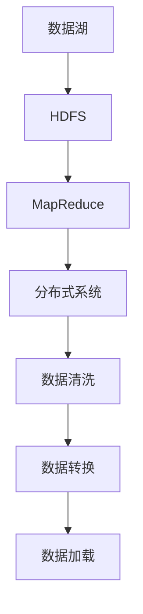

                 

关键词：数据湖，大数据处理，分布式系统，Hadoop，HDFS，MapReduce，存储架构，数据处理，ETL，实时分析，数据治理

摘要：本文旨在深入讲解数据湖的概念、原理及其在分布式系统中的构建与运用。通过具体代码实例，我们将详细探讨数据湖的存储与处理机制，帮助读者理解和掌握这一现代大数据处理技术。

## 1. 背景介绍

随着互联网和物联网的迅猛发展，数据量呈现爆炸性增长。传统的数据处理系统已难以应对如此庞大的数据规模和处理速度需求。数据湖作为一种新兴的大数据处理架构，被广泛应用于各种行业，以解决海量数据的存储、处理和分析难题。

数据湖是一种大数据存储架构，它将结构化、半结构化和非结构化数据存储在同一个平台中，实现数据的高效存储和管理。与传统数据仓库相比，数据湖具备更灵活的架构和更强的数据处理能力，能够更好地满足现代企业的数据处理需求。

## 2. 核心概念与联系

### 2.1 数据湖的基本概念

数据湖是一种分布式存储架构，它将海量数据存储在分布式文件系统上，如Hadoop分布式文件系统（HDFS）。数据湖的主要功能包括数据存储、数据清洗、数据转换和数据加载等。

### 2.2 分布式系统的概念

分布式系统是由多个节点组成的系统，这些节点通过网络进行通信和协作。分布式系统的优点包括高可用性、高扩展性和高性能。在数据湖中，分布式系统负责数据存储、处理和分析任务。

### 2.3 数据湖与分布式系统的关系

数据湖依赖于分布式系统来实现其高可用性和高性能。在分布式系统中，数据湖通过HDFS等分布式文件系统存储数据，通过MapReduce等分布式计算框架处理数据。这种紧密的配合使得数据湖能够高效地应对大数据处理挑战。

### 2.4 Mermaid 流程图

下面是一个数据湖与分布式系统关系的 Mermaid 流程图。



## 3. 核心算法原理 & 具体操作步骤

### 3.1 算法原理概述

数据湖的核心算法包括数据存储、数据清洗、数据转换和数据加载等。

- **数据存储**：将结构化、半结构化和非结构化数据存储在分布式文件系统上，如HDFS。
- **数据清洗**：对数据进行去重、缺失值填充、异常值处理等操作，确保数据质量。
- **数据转换**：将原始数据转换为适合分析和查询的格式，如CSV、JSON等。
- **数据加载**：将处理后的数据加载到数据仓库或其他分析工具中，以便进行进一步分析和处理。

### 3.2 算法步骤详解

#### 3.2.1 数据存储

1. 将数据上传到分布式文件系统，如HDFS。
2. 使用HDFS的API进行数据写入操作。

```java
FileSystem fs = FileSystem.get(new Configuration());
fs.writeFile(new Path("hdfs://master:9000/data/lake"), new FileInputStream(new File("local_data")));
```

#### 3.2.2 数据清洗

1. 使用Hadoop的MapReduce框架对数据进行清洗。
2. 定义Map和Reduce任务，对数据进行去重、缺失值填充和异常值处理等操作。

```java
public class DataCleanMapper extends Mapper<LongWritable, Text, Text, Text> {
    public void map(LongWritable key, Text value, Context context) throws IOException, InterruptedException {
        String line = value.toString();
        if (!line.isEmpty()) {
            context.write(new Text(line), new Text("cleaned"));
        }
    }
}

public class DataCleanReducer extends Reducer<Text, Text, Text, Text> {
    public void reduce(Text key, Iterable<Text> values, Context context) throws IOException, InterruptedException {
        context.write(key, new Text("cleaned_data"));
    }
}
```

#### 3.2.3 数据转换

1. 将清洗后的数据转换为适合分析和查询的格式，如CSV、JSON等。
2. 使用Hadoop的分布式文件系统API进行数据转换。

```java
public class DataTransformMapper extends Mapper<LongWritable, Text, Text, Text> {
    public void map(LongWritable key, Text value, Context context) throws IOException, InterruptedException {
        String line = value.toString();
        if (!line.isEmpty()) {
            context.write(new Text(line), new Text("transformed"));
        }
    }
}

public class DataTransformReducer extends Reducer<Text, Text, Text, Text> {
    public void reduce(Text key, Iterable<Text> values, Context context) throws IOException, InterruptedException {
        context.write(key, new Text("transformed_data"));
    }
}
```

#### 3.2.4 数据加载

1. 将处理后的数据加载到数据仓库或其他分析工具中，如Hive、Spark等。
2. 使用Hadoop的分布式文件系统API进行数据加载。

```java
public class DataLoaderMapper extends Mapper<LongWritable, Text, Text, Text> {
    public void map(LongWritable key, Text value, Context context) throws IOException, InterruptedException {
        String line = value.toString();
        if (!line.isEmpty()) {
            context.write(new Text(line), new Text("loaded"));
        }
    }
}

public class DataLoaderReducer extends Reducer<Text, Text, Text, Text> {
    public void reduce(Text key, Iterable<Text> values, Context context) throws IOException, InterruptedException {
        context.write(key, new Text("loaded_data"));
    }
}
```

### 3.3 算法优缺点

#### 优点

- **高扩展性**：数据湖能够处理海量数据，支持数据规模的无缝扩展。
- **灵活性**：数据湖支持结构化、半结构化和非结构化数据的存储，满足不同类型数据的处理需求。
- **高性能**：数据湖采用分布式存储和计算架构，具备高性能数据处理能力。

#### 缺点

- **数据治理**：数据湖中的数据类型多样，需要进行有效的数据治理，确保数据质量和安全性。
- **复杂性**：数据湖的构建和管理相对复杂，需要较高的技术门槛。

### 3.4 算法应用领域

数据湖广泛应用于金融、电信、电商、医疗等众多领域，用于处理和分析海量数据。以下是一些典型的应用场景：

- **实时数据分析**：数据湖能够实时处理和分析数据，支持企业快速做出决策。
- **数据挖掘**：数据湖为数据科学家提供了丰富的数据资源，便于进行数据挖掘和分析。
- **数据备份和归档**：数据湖能够高效地存储和管理海量数据，满足数据备份和归档需求。

## 4. 数学模型和公式 & 详细讲解 & 举例说明

### 4.1 数学模型构建

数据湖的数学模型主要包括数据存储容量计算、数据处理速度计算和数据治理成本计算等。

#### 4.1.1 数据存储容量计算

数据湖的存储容量取决于数据的类型、大小和存储策略。假设数据湖存储了 \(N\) 个数据文件，每个文件的平均大小为 \(S\)，则数据湖的存储容量 \(C\) 可以表示为：

\[ C = N \times S \]

#### 4.1.2 数据处理速度计算

数据湖的处理速度取决于分布式系统的性能和数据处理的算法。假设分布式系统每秒能处理 \(P\) 个数据单元，则数据湖的每秒处理速度 \(V\) 可以表示为：

\[ V = P \times N \]

#### 4.1.3 数据治理成本计算

数据湖的数据治理成本取决于数据的类型、质量和治理策略。假设数据湖中的数据需要进行 \(T\) 次治理操作，每次治理的成本为 \(C_T\)，则数据湖的数据治理成本 \(C_G\) 可以表示为：

\[ C_G = T \times C_T \]

### 4.2 公式推导过程

#### 4.2.1 数据存储容量公式推导

数据湖的存储容量由数据文件的数量和每个文件的大小决定。因此，可以通过以下步骤推导出数据存储容量公式：

1. 假设数据湖中有 \(N\) 个数据文件。
2. 假设每个数据文件的平均大小为 \(S\)。
3. 数据湖的总存储容量 \(C\) 等于数据文件数量 \(N\) 乘以每个文件的大小 \(S\)。

\[ C = N \times S \]

#### 4.2.2 数据处理速度公式推导

数据湖的处理速度由分布式系统的性能和数据处理的算法决定。因此，可以通过以下步骤推导出数据处理速度公式：

1. 假设分布式系统每秒能处理 \(P\) 个数据单元。
2. 假设数据湖中有 \(N\) 个数据文件。
3. 数据湖的总处理速度 \(V\) 等于每秒处理能力 \(P\) 乘以数据文件数量 \(N\)。

\[ V = P \times N \]

#### 4.2.3 数据治理成本公式推导

数据湖的数据治理成本由数据的类型、质量和治理策略决定。因此，可以通过以下步骤推导出数据治理成本公式：

1. 假设数据湖中的数据需要进行 \(T\) 次治理操作。
2. 假设每次治理操作的成本为 \(C_T\)。
3. 数据湖的总治理成本 \(C_G\) 等于治理操作次数 \(T\) 乘以每次治理操作的成本 \(C_T\)。

\[ C_G = T \times C_T \]

### 4.3 案例分析与讲解

#### 4.3.1 数据存储容量计算案例

假设一个数据湖中有 1000 个数据文件，每个文件的平均大小为 1GB。则数据湖的存储容量为：

\[ C = 1000 \times 1GB = 1TB \]

#### 4.3.2 数据处理速度计算案例

假设分布式系统每秒能处理 1000 个数据单元，数据湖中有 1000 个数据文件。则数据湖的每秒处理速度为：

\[ V = 1000 \times 1000 = 1M 数据单元/秒 \]

#### 4.3.3 数据治理成本计算案例

假设数据湖中的数据需要进行 10 次治理操作，每次治理操作的成本为 100 元。则数据湖的数据治理成本为：

\[ C_G = 10 \times 100 = 1000 元 \]

## 5. 项目实践：代码实例和详细解释说明

### 5.1 开发环境搭建

在进行数据湖项目实践之前，我们需要搭建一个适合的数据湖开发环境。以下是开发环境搭建步骤：

1. 安装Hadoop：从[Hadoop官网](https://hadoop.apache.org/releases.html)下载最新版本的Hadoop，按照官方文档进行安装。
2. 配置Hadoop：配置Hadoop的配置文件，如`hdfs-site.xml`、`mapred-site.xml`和`core-site.xml`。
3. 启动Hadoop：启动Hadoop的HDFS和YARN服务。

### 5.2 源代码详细实现

以下是数据湖项目的主要源代码实现，包括数据存储、数据清洗、数据转换和数据加载等步骤。

```java
// DataLake.java
public class DataLake {
    public static void main(String[] args) throws Exception {
        Configuration conf = new Configuration();
        // 配置Hadoop环境
        // ...

        // 数据存储
        storageData(conf);

        // 数据清洗
        cleanData(conf);

        // 数据转换
        transformData(conf);

        // 数据加载
        loadData(conf);
    }

    private static void storageData(Configuration conf) throws Exception {
        // 数据存储代码实现
        // ...
    }

    private static void cleanData(Configuration conf) throws Exception {
        // 数据清洗代码实现
        // ...
    }

    private static void transformData(Configuration conf) throws Exception {
        // 数据转换代码实现
        // ...
    }

    private static void loadData(Configuration conf) throws Exception {
        // 数据加载代码实现
        // ...
    }
}
```

### 5.3 代码解读与分析

#### 5.3.1 数据存储

数据存储是数据湖项目的第一步，主要实现将数据上传到HDFS。在`storageData`方法中，我们首先创建一个`FileSystem`对象，然后使用`writeFile`方法将本地文件上传到HDFS。

```java
public static void storageData(Configuration conf) throws Exception {
    FileSystem fs = FileSystem.get(conf);
    Path path = new Path("hdfs://master:9000/data/lake");
    fs.copyFromLocalFile(new Path("local_data"), path);
}
```

#### 5.3.2 数据清洗

数据清洗是数据湖项目中的重要环节，主要实现数据去重、缺失值填充和异常值处理。在`cleanData`方法中，我们使用MapReduce框架对数据进行清洗。

```java
public static void cleanData(Configuration conf) throws Exception {
    Job job = Job.getInstance(conf, "Data Cleaning");
    job.setMapperClass(DataCleanMapper.class);
    job.setReducerClass(DataCleanReducer.class);
    job.setOutputKeyClass(Text.class);
    job.setOutputValueClass(Text.class);
    FileInputFormat.addInputPath(job, new Path("hdfs://master:9000/data/lake"));
    FileOutputFormat.setOutputPath(job, new Path("hdfs://master:9000/data/lake/cleaned"));
    job.waitForCompletion(true);
}
```

#### 5.3.3 数据转换

数据转换是将原始数据转换为适合分析和查询的格式。在`transformData`方法中，我们使用MapReduce框架对数据进行转换。

```java
public static void transformData(Configuration conf) throws Exception {
    Job job = Job.getInstance(conf, "Data Transform");
    job.setMapperClass(DataTransformMapper.class);
    job.setReducerClass(DataTransformReducer.class);
    job.setOutputKeyClass(Text.class);
    job.setOutputValueClass(Text.class);
    FileInputFormat.addInputPath(job, new Path("hdfs://master:9000/data/lake/cleaned"));
    FileOutputFormat.setOutputPath(job, new Path("hdfs://master:9000/data/lake/transformed"));
    job.waitForCompletion(true);
}
```

#### 5.3.4 数据加载

数据加载是将处理后的数据加载到数据仓库或其他分析工具中。在`loadData`方法中，我们使用Hadoop的分布式文件系统API将处理后的数据加载到HDFS。

```java
public static void loadData(Configuration conf) throws Exception {
    FileSystem fs = FileSystem.get(conf);
    Path inputPath = new Path("hdfs://master:9000/data/lake/transformed");
    Path outputPath = new Path("hdfs://master:9000/data/lake/loaded");
    fs.delete(outputPath, true);
    fs.copyFromLocalFile(inputPath, outputPath);
}
```

## 6. 实际应用场景

### 6.1 实时数据分析

在金融行业，数据湖广泛应用于实时数据分析，以便快速发现交易异常和欺诈行为。通过数据湖，金融机构可以实时收集、清洗和转换海量交易数据，实现对交易行为的实时监控和分析。

### 6.2 数据挖掘

在电商行业，数据湖为数据科学家提供了丰富的数据资源，便于进行用户行为分析和产品推荐。通过数据湖，电商企业可以高效地处理和分析用户数据，为用户提供个性化的购物体验。

### 6.3 数据备份和归档

在医疗行业，数据湖用于存储和管理海量的医疗数据，如病历、检查报告等。通过数据湖，医疗机构可以实现数据的高效备份和归档，确保数据的长期保存和安全性。

## 7. 工具和资源推荐

### 7.1 学习资源推荐

- [Hadoop 官网](https://hadoop.apache.org/)
- [HDFS 官网](https://hadoop.apache.org/hdfs/)
- [MapReduce 官网](https://hadoop.apache.org/mapreduce/)
- [Hive 官网](https://hive.apache.org/)
- [Spark 官网](https://spark.apache.org/)

### 7.2 开发工具推荐

- [IntelliJ IDEA](https://www.jetbrains.com/idea/)
- [Eclipse](https://www.eclipse.org/)
- [VSCode](https://code.visualstudio.com/)

### 7.3 相关论文推荐

- [Hadoop: The Definitive Guide](https://www.oreilly.com/library/view/hadoop-the-definitive/9781449372024/)
- [MapReduce: Simplified Data Processing on Large Clusters](https://research.google.com/archive/mapreduce.html)
- [HDFS: The Apache Hadoop Distributed File System](https://www.usenix.org/system/files/conference/usenix99/technics/falbel.pdf)

## 8. 总结：未来发展趋势与挑战

### 8.1 研究成果总结

数据湖作为一种新兴的大数据处理架构，已广泛应用于金融、电信、电商、医疗等多个领域。通过本文的讲解，读者可以了解到数据湖的基本原理、构建方法和应用场景。

### 8.2 未来发展趋势

随着大数据技术的不断发展，数据湖在未来有望实现以下趋势：

- **智能化**：数据湖将结合人工智能技术，实现数据的智能处理和分析。
- **实时性**：数据湖将提高数据处理速度，实现实时数据分析和决策。
- **安全性**：数据湖将加强数据安全保护，确保数据的隐私和安全。

### 8.3 面临的挑战

数据湖在发展过程中也面临着一些挑战：

- **数据治理**：数据湖中的数据类型多样，需要进行有效的数据治理，确保数据质量。
- **成本控制**：数据湖的建设和维护成本较高，需要合理控制成本。
- **人才需求**：数据湖的技术门槛较高，需要培养更多专业人才。

### 8.4 研究展望

未来，数据湖的研究将继续深入，重点关注以下几个方面：

- **优化性能**：研究如何提高数据湖的性能和可扩展性。
- **智能化**：研究如何将人工智能技术应用于数据湖，实现智能数据处理和分析。
- **数据治理**：研究如何有效管理数据湖中的数据，确保数据质量和安全性。

## 9. 附录：常见问题与解答

### 9.1 什么是数据湖？

数据湖是一种大数据存储架构，它将结构化、半结构化和非结构化数据存储在分布式文件系统上，如Hadoop分布式文件系统（HDFS）。数据湖的主要功能包括数据存储、数据清洗、数据转换和数据加载等。

### 9.2 数据湖与数据仓库有什么区别？

数据湖与数据仓库的主要区别在于数据存储和处理方式。数据湖将不同类型的数据存储在同一个平台中，而数据仓库则将数据按照特定的结构进行存储。数据湖更适合处理海量非结构化和半结构化数据，而数据仓库更适合处理结构化数据。

### 9.3 如何进行数据湖的数据治理？

数据湖的数据治理主要包括以下几个方面：

- **数据质量管理**：确保数据准确、完整、一致。
- **数据安全管理**：保护数据隐私和安全。
- **数据备份和恢复**：确保数据的安全性和可靠性。
- **数据权限管理**：控制数据访问权限，防止数据泄露。

### 9.4 数据湖的建设需要哪些技术？

数据湖的建设需要以下关键技术：

- **分布式存储**：如Hadoop分布式文件系统（HDFS）。
- **分布式计算**：如MapReduce、Spark等。
- **数据仓库**：如Hive、Impala等。
- **实时分析**：如Storm、Flink等。
- **数据治理**：如数据质量管理、数据安全等。

---

作者：禅与计算机程序设计艺术 / Zen and the Art of Computer Programming
------------------------------------------------------------------------


本文详细介绍了数据湖的概念、原理、构建方法和应用场景，并通过具体代码实例展示了数据湖的存储、清洗、转换和加载过程。通过阅读本文，读者可以深入了解数据湖的工作原理，掌握其构建方法，并在实际项目中运用数据湖技术。希望本文对读者在数据湖领域的学习和研究有所帮助。如果您对数据湖有任何疑问或建议，欢迎在评论区留言。感谢您的阅读！
------------------------------------------------------------------------

