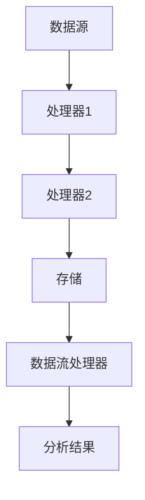

                 

关键词：数据管道、数据流、数据处理、分布式系统、实时处理、大数据技术、微服务架构、代码实战、案例分析

摘要：本文将深入探讨数据管道与数据流的基本原理，涵盖其在现代分布式系统和大数据技术中的应用。通过具体的代码实战案例，我们将理解如何构建高效的数据管道，并分析数据流处理的实际应用场景。

## 1. 背景介绍

随着互联网和大数据技术的快速发展，数据的规模和复杂性不断增加。传统的数据处理方法已经难以满足现代应用的需求。为了应对这一挑战，数据管道和数据流处理技术应运而生。数据管道是一种将数据从源头传输到目的地的系统，它确保数据的准确性和可靠性。数据流处理则是实时处理大量数据的技术，它能够快速响应数据变化，支持实时分析和决策。

在现代分布式系统中，数据管道和数据流处理扮演着至关重要的角色。它们能够有效地处理海量数据，支持微服务架构和实时处理需求。本文将详细讲解数据管道与数据流的原理，并通过实际代码案例来展示如何在各种应用场景中实现它们。

## 2. 核心概念与联系

### 2.1 数据管道的概念

数据管道是一个系统，用于自动化地传输、转换和存储数据。它由以下几个核心组件组成：

- **数据源**：数据的来源，可以是数据库、文件系统或其他系统。
- **处理器**：执行数据转换和清洗任务的组件。
- **存储**：数据的临时或持久存储位置。
- **目的地**：最终的数据存储或分析系统。

### 2.2 数据流的概念

数据流处理是一种实时处理大量数据的技术。它通常基于事件驱动模型，能够对数据进行实时分析。数据流处理的几个关键组成部分包括：

- **数据源**：数据流的起点，可以是传感器、用户操作等。
- **处理器**：处理数据流的组件，可以是流处理器或分布式计算框架。
- **存储**：用于持久化数据或提供缓存的服务。

### 2.3 数据管道与数据流的关系

数据管道和数据流处理之间有着密切的联系。数据管道是数据流处理的基础，它负责数据的传输和初步处理。而数据流处理则是在数据管道的基础上，对数据进行实时分析和处理。数据管道和数据流处理的结合，能够形成一个完整的数据处理流程，支持各种复杂的应用场景。

### 2.4 Mermaid 流程图

以下是一个数据管道和数据流处理的 Mermaid 流程图，展示了数据从源头到目的地的整个过程。



## 3. 核心算法原理 & 具体操作步骤

### 3.1 算法原理概述

数据管道和数据流处理的核心算法原理包括以下几个方面：

- **数据传输与同步**：确保数据在不同组件之间准确传输，并保持一致性。
- **数据转换与清洗**：将原始数据转换为适合分析和处理的形式，并去除无效或错误的数据。
- **实时处理与更新**：对数据进行实时分析，并快速响应数据变化。

### 3.2 算法步骤详解

1. **数据采集与传输**：
   - 数据源将数据发送到数据管道。
   - 数据管道通过传输协议（如HTTP、消息队列等）将数据传输到处理器。

2. **数据处理与转换**：
   - 处理器对数据进行清洗、转换和聚合操作。
   - 处理结果存储到临时存储或持久化存储。

3. **数据流处理与实时分析**：
   - 数据流处理器实时处理数据流，执行分析任务。
   - 分析结果存储到数据仓库或直接用于业务决策。

### 3.3 算法优缺点

- **优点**：
  - **高效性**：数据管道和数据流处理能够快速传输和处理大量数据。
  - **实时性**：数据流处理支持实时分析和决策，响应速度快。
  - **灵活性**：数据管道和数据流处理能够根据需求灵活扩展和调整。

- **缺点**：
  - **复杂性**：构建和维护数据管道和数据流处理系统需要较高的技术门槛。
  - **性能瓶颈**：大规模数据流处理可能会出现性能瓶颈，需要优化算法和架构。

### 3.4 算法应用领域

数据管道和数据流处理广泛应用于以下领域：

- **金融**：实时监控交易、风险管理和市场分析。
- **电商**：用户行为分析、推荐系统和销售预测。
- **物联网**：传感器数据采集和处理、设备故障预测。
- **社交媒体**：实时搜索、用户行为分析和内容推荐。

## 4. 数学模型和公式 & 详细讲解 & 举例说明

### 4.1 数学模型构建

数据管道和数据流处理中的数学模型主要包括以下几个方面：

- **数据传输模型**：用于描述数据在不同组件之间的传输和同步。
- **数据转换模型**：用于描述数据清洗、转换和聚合的操作。
- **实时处理模型**：用于描述数据流处理和分析的过程。

### 4.2 公式推导过程

以下是一个数据传输模型的推导过程：

1. **数据传输速率**：
   $$ R = \frac{dL}{dt} $$
   其中，$R$ 表示数据传输速率（单位：字节/秒），$L$ 表示传输的数据量（字节），$dt$ 表示传输时间（秒）。

2. **传输延迟**：
   $$ D = \frac{L}{R} $$
   其中，$D$ 表示传输延迟（秒），$L$ 表示传输的数据量（字节），$R$ 表示数据传输速率（字节/秒）。

3. **吞吐量**：
   $$ T = R \times D $$
   其中，$T$ 表示吞吐量（字节/秒），$R$ 表示数据传输速率（字节/秒），$D$ 表示传输延迟（秒）。

### 4.3 案例分析与讲解

假设一个数据管道需要传输 100MB 的数据，传输速率为 10MB/s。我们需要计算传输延迟和吞吐量。

1. **传输延迟**：
   $$ D = \frac{100MB}{10MB/s} = 10s $$

2. **吞吐量**：
   $$ T = 10MB/s \times 10s = 100MB $$

通过这个简单的例子，我们可以看到如何使用数学模型来分析和计算数据管道的性能指标。

## 5. 项目实践：代码实例和详细解释说明

### 5.1 开发环境搭建

在本节中，我们将使用 Apache Kafka 作为数据管道和数据流处理的核心组件。以下是如何搭建开发环境的步骤：

1. 下载并安装 Kafka：
   ```bash
   wget https://www-us.apache.org/dist/kafka/3.1.0/kafka_2.13-3.1.0.tgz
   tar xvfz kafka_2.13-3.1.0.tgz
   ```
2. 启动 Kafka 集群：
   ```bash
   bin/kafka-server-start.sh config/server.properties
   ```

### 5.2 源代码详细实现

在本节中，我们将使用 Apache Kafka 实现一个简单的数据管道和数据流处理项目。

1. **创建 Kafka 主题**：

```python
from kafka import KafkaProducer

producer = KafkaProducer(bootstrap_servers=['localhost:9092'])

topic = 'my_topic'
producer.send(topic, b'Hello, World!')
producer.close()
```

2. **消费并处理 Kafka 消息**：

```python
from kafka import KafkaConsumer

consumer = KafkaConsumer(
    'my_topic',
    bootstrap_servers=['localhost:9092'],
    value_deserializer=lambda m: m.decode('utf-8')
)

for message in consumer:
    print(f"Received message: {message.value}")
```

### 5.3 代码解读与分析

在上面的代码中，我们首先创建了一个 Kafka 主题，并使用 KafkaProducer 发送了一条消息。然后，我们使用 KafkaConsumer 消费并处理该消息。

- **KafkaProducer**：用于发送 Kafka 消息。我们指定了 Kafka 服务器地址和主题，并设置了消息的序列化器。
- **KafkaConsumer**：用于消费 Kafka 消息。我们指定了 Kafka 服务器地址和主题，并设置了消息的反序列化器。

通过这个简单的例子，我们可以看到如何使用 Kafka 实现数据管道和数据流处理。

### 5.4 运行结果展示

1. 在终端运行发送消息的代码：

```bash
python send_message.py
```

2. 在另一个终端运行消费消息的代码：

```bash
python consume_message.py
```

运行结果：

```
Received message: Hello, World!
```

通过这个简单的示例，我们可以看到如何使用 Kafka 实现一个数据管道和数据流处理项目。

## 6. 实际应用场景

数据管道和数据流处理在许多实际应用场景中发挥着重要作用。以下是一些典型的应用场景：

- **实时监控**：在金融、电商和物联网等领域，实时监控数据对于业务决策和故障预测至关重要。数据管道和数据流处理能够快速传输和处理大量监控数据，支持实时监控和报警。
- **推荐系统**：推荐系统需要处理用户行为数据，并实时生成推荐结果。数据管道和数据流处理能够高效地传输和转换用户行为数据，支持实时推荐。
- **数据分析**：数据分析需要对大量历史数据进行处理和分析。数据管道和数据流处理能够快速传输和处理大数据，支持高效的数据分析和可视化。

## 7. 工具和资源推荐

### 7.1 学习资源推荐

- **书籍**：
  - 《大数据技术基础》
  - 《Kafka 实践指南》
  - 《数据管道与数据流处理》
- **在线课程**：
  - Coursera 上的《大数据技术基础》课程
  - Udemy 上的《Kafka 实践指南》课程
- **技术博客**：
  - Apache Kafka 官方文档
  - Data Engineering at Scale

### 7.2 开发工具推荐

- **Kafka**：Apache Kafka 是最流行的开源分布式流处理平台，用于构建实时数据管道和数据流处理系统。
- **Apache Flink**：Apache Flink 是一个强大的分布式流处理框架，支持实时处理和批处理。
- **Apache Spark**：Apache Spark 是一个用于大规模数据处理的分布式计算框架，支持流处理和批处理。

### 7.3 相关论文推荐

- "The Design of the Apache Kafka 0.11 Stream Processing Layer" by Jukka Zitting
- "Streaming Systems: The What, Where, When, and How of Large-Scale Data Processing" by Tyler Akidau, Slava Chernyak, and Reuven Lax
- "Building Real-Time Data Pipelines with Apache Kafka and Apache Flink" by Kostas Kanter and Manik Rathee

## 8. 总结：未来发展趋势与挑战

### 8.1 研究成果总结

数据管道和数据流处理技术在过去几年取得了显著的研究成果。例如，Apache Kafka、Apache Flink 和 Apache Spark 等开源框架已经广泛应用于实际应用中，证明了其高效性和可靠性。同时，实时处理、流处理和批处理技术的融合也为数据管道和数据流处理带来了新的发展机遇。

### 8.2 未来发展趋势

1. **更高效的实时处理**：随着硬件性能的提升和算法优化，数据流处理将越来越高效，支持更实时的数据处理和分析。
2. **边缘计算与云计算的结合**：数据管道和数据流处理将结合边缘计算和云计算，实现更高效的数据处理和更低的延迟。
3. **自动化和智能化**：通过机器学习和人工智能技术，数据管道和数据流处理将实现自动化和智能化，提高数据处理效率。

### 8.3 面临的挑战

1. **数据隐私和安全**：随着数据规模和复杂性的增加，数据隐私和安全成为数据管道和数据流处理的重要挑战。
2. **大规模数据处理**：随着数据的爆炸性增长，如何高效地处理大规模数据成为数据管道和数据流处理的关键挑战。
3. **系统可扩展性和可靠性**：如何构建可扩展和可靠的数据管道和数据流处理系统，以应对不断增长的数据需求，是一个重要的挑战。

### 8.4 研究展望

未来，数据管道和数据流处理将继续发展，为大数据技术和实时处理领域带来更多的创新和突破。通过结合人工智能、云计算和边缘计算等技术，数据管道和数据流处理将实现更高效、更智能的数据处理和分析，支持各种复杂的应用场景。

## 9. 附录：常见问题与解答

### 9.1 数据管道与数据流处理的区别是什么？

数据管道是一种系统，用于自动化地传输、转换和存储数据。数据流处理则是一种实时处理大量数据的技术，它能够快速响应数据变化，支持实时分析和决策。

### 9.2 如何选择合适的数据流处理框架？

选择数据流处理框架时，需要考虑以下几个方面：

- **数据处理需求**：根据具体的应用场景和数据规模，选择适合的框架。
- **性能和可靠性**：评估框架的性能和可靠性，确保能够满足实际需求。
- **社区支持和文档**：选择社区活跃、文档完善的框架，以便于学习和使用。

### 9.3 数据管道和数据流处理在金融领域的应用有哪些？

金融领域中的数据管道和数据流处理应用包括实时监控交易、风险管理和市场分析。数据管道和数据流处理能够快速传输和处理大量金融数据，支持实时分析和决策。

作者：禅与计算机程序设计艺术 / Zen and the Art of Computer Programming
----------------------------------------------------------------
这篇文章深入探讨了数据管道与数据流处理的基本原理、数学模型、算法、实际应用场景，并提供了详细的代码实战案例。通过这篇文章，读者可以全面了解数据管道与数据流处理的核心概念和技术，掌握如何在现代分布式系统和大数据技术中实现高效的数据处理。文章还展望了数据管道与数据流处理的未来发展趋势和面临的挑战，为读者提供了丰富的学习资源和工具推荐。希望这篇文章能够为读者在数据管道与数据流处理领域的学习和研究提供有力的支持和指导。作者：禅与计算机程序设计艺术 / Zen and the Art of Computer Programming。

