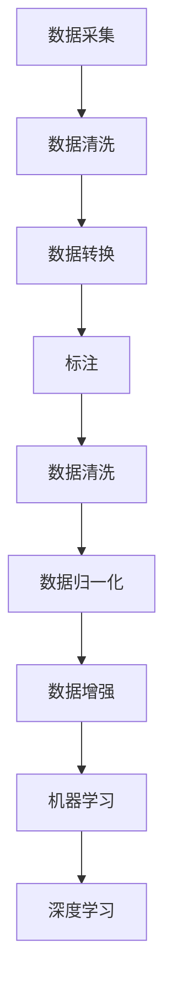

                 

关键词：数据采集、标注、机器学习、深度学习、代码实战、数据预处理、算法原理

摘要：本文将深入探讨数据采集与标注的原理，详细讲解其在机器学习和深度学习中的应用。通过实际代码实战案例，读者将了解如何高效地进行数据采集与标注，提升模型的准确性和性能。此外，文章还将介绍相关工具和资源，为读者提供全面的学习和实践指导。

## 1. 背景介绍

在当今的信息时代，数据已经成为各行各业的重要资产。无论是机器学习还是深度学习，数据的采集与标注都是至关重要的环节。数据采集指的是从各种来源获取数据的过程，包括互联网、传感器、数据库等。而标注则是对数据进行预处理，使其适合模型训练的过程。只有准确和高质量的数据，才能训练出高性能的模型。

数据采集与标注在机器学习和深度学习中的应用非常广泛。无论是图像识别、自然语言处理，还是推荐系统、自动驾驶，数据采集与标注都是必不可少的步骤。准确的数据采集和标注可以大大提升模型的准确性、降低过拟合风险，从而提高模型的实际应用价值。

本文将分为以下几个部分进行讲解：

1. 背景介绍
2. 核心概念与联系
3. 核心算法原理 & 具体操作步骤
4. 数学模型和公式 & 详细讲解 & 举例说明
5. 项目实践：代码实例和详细解释说明
6. 实际应用场景
7. 工具和资源推荐
8. 总结：未来发展趋势与挑战

通过本文的讲解，读者将全面了解数据采集与标注的原理和实践，掌握相关技术，为后续的研究和应用打下坚实基础。

## 2. 核心概念与联系

在深入探讨数据采集与标注的原理之前，我们需要了解一些核心概念和它们之间的联系。这些概念包括数据采集、标注、数据预处理、机器学习和深度学习等。

### 2.1 数据采集

数据采集是从各种来源获取数据的过程。这些数据来源可以是互联网、传感器、数据库、文件等。数据采集的过程通常包括以下几个步骤：

1. **数据收集**：从不同的数据源收集数据，如使用 API 获取网络数据、连接数据库查询数据等。
2. **数据清洗**：对收集到的数据进行清洗，去除重复、缺失、噪声等无效数据。
3. **数据转换**：将数据转换成适合机器学习或深度学习模型训练的格式，如将图像转换为像素矩阵、将文本转换为词向量等。

### 2.2 标注

标注是对数据进行预处理，使其适合模型训练的过程。标注的过程通常包括以下几个步骤：

1. **数据标签化**：为数据分配标签，如为图像标注类别、为文本标注词性等。
2. **数据清洗**：对标注后的数据进行清洗，去除错误、重复、噪声等标签。
3. **数据归一化**：将数据转换成统一的格式，如将图像的像素值归一化到 [0, 1] 范围内。

### 2.3 数据预处理

数据预处理是数据采集和标注的后续步骤，目的是将原始数据转换成适合模型训练的格式。数据预处理的过程通常包括以下几个步骤：

1. **数据清洗**：去除重复、缺失、噪声等无效数据。
2. **数据归一化**：将数据转换成统一的格式，如将图像的像素值归一化到 [0, 1] 范围内、将文本的词向量标准化等。
3. **数据增强**：通过旋转、缩放、裁剪等操作增加数据的多样性，提高模型的泛化能力。

### 2.4 机器学习和深度学习

机器学习和深度学习是人工智能领域的两个重要分支。机器学习是通过学习已有数据来预测或决策的技术，而深度学习是基于多层神经网络进行特征学习和模型训练的技术。

在机器学习和深度学习中，数据采集、标注和预处理是非常关键的环节。只有准确和高质量的数据，才能训练出高性能的模型。因此，数据采集与标注的原理和实践对于机器学习和深度学习的研究和应用具有重要意义。

### 2.5 Mermaid 流程图

下面是一个 Mermaid 流程图，展示了数据采集、标注、数据预处理、机器学习和深度学习之间的联系。



通过这个流程图，我们可以清晰地看到数据采集、标注、数据预处理和机器学习、深度学习之间的紧密联系。只有充分理解和掌握这些核心概念和流程，才能有效地进行数据采集与标注，为后续的研究和应用奠定坚实基础。

## 3. 核心算法原理 & 具体操作步骤

在了解了数据采集与标注的基本概念和流程之后，我们接下来将探讨核心算法的原理和具体操作步骤。这些算法在数据预处理和模型训练过程中起到关键作用，直接影响模型的性能和准确度。

### 3.1 算法原理概述

数据预处理和模型训练过程中常用的算法主要包括数据清洗、数据归一化、数据增强和特征提取等。

#### 3.1.1 数据清洗

数据清洗是数据预处理的第一步，主要目的是去除数据中的噪声、重复和缺失值。常见的清洗方法包括：

- **去重**：通过比较数据项的唯一性，删除重复的数据。
- **填充缺失值**：根据数据分布或利用机器学习算法预测缺失值。
- **去除噪声**：对异常值进行处理，如使用统计学方法检测并删除离群点。

#### 3.1.2 数据归一化

数据归一化是将不同特征的数据转换到同一量纲，以便更好地进行模型训练。常见的归一化方法包括：

- **最小-最大缩放**：将数据缩放到 [0, 1] 范围内。
- **标准缩放**：将数据缩放到均值为 0，标准差为 1 的范围内。
- **对数缩放**：对数值特征取对数，使其符合正态分布。

#### 3.1.3 数据增强

数据增强是通过各种方法增加训练数据的多样性，从而提高模型的泛化能力。常见的数据增强方法包括：

- **随机旋转**：对图像进行随机旋转。
- **随机裁剪**：从图像中随机裁剪部分区域。
- **颜色调整**：对图像的亮度、对比度和饱和度进行调整。
- **噪声添加**：在图像中添加噪声，如高斯噪声、椒盐噪声等。

#### 3.1.4 特征提取

特征提取是从原始数据中提取有用的特征，以便更好地进行模型训练。常见的特征提取方法包括：

- **主成分分析（PCA）**：通过降维减少数据维度，同时保留主要特征。
- **词袋模型（Bag of Words）**：将文本数据转换为词频向量。
- **卷积神经网络（CNN）**：用于提取图像的局部特征。

### 3.2 算法步骤详解

下面将详细讲解每种算法的具体操作步骤。

#### 3.2.1 数据清洗

1. **去重**：使用 pandas 中的 DataFrame 的 `drop_duplicates()` 方法，根据数据项的唯一性删除重复数据。
2. **填充缺失值**：使用 pandas 中的 DataFrame 的 `fillna()` 方法，根据数据分布或使用机器学习算法（如 K 近邻）预测缺失值。
3. **去除噪声**：使用统计学方法（如 Z-Score、IQR 法则）检测并删除离群点。

#### 3.2.2 数据归一化

1. **最小-最大缩放**：使用 Scikit-learn 中的 `MinMaxScaler` 类进行最小-最大缩放。
2. **标准缩放**：使用 Scikit-learn 中的 `StandardScaler` 类进行标准缩放。
3. **对数缩放**：使用 NumPy 的 `np.log()` 函数对数值特征取对数。

#### 3.2.3 数据增强

1. **随机旋转**：使用 OpenCV 中的 `rotate()` 方法对图像进行随机旋转。
2. **随机裁剪**：使用 OpenCV 中的 `crop()` 方法从图像中随机裁剪部分区域。
3. **颜色调整**：使用 OpenCV 中的 `adjust_brightness()`、`adjust_contrast()` 和 `adjust_saturation()` 方法调整图像的亮度、对比度和饱和度。
4. **噪声添加**：使用 OpenCV 中的 `add_noise()` 方法在图像中添加噪声。

#### 3.2.4 特征提取

1. **主成分分析（PCA）**：使用 Scikit-learn 中的 `PCA` 类进行降维。
2. **词袋模型（Bag of Words）**：使用 NLTK 中的 `word_tokenize()` 和 `FreqDist()` 函数将文本数据转换为词频向量。
3. **卷积神经网络（CNN）**：使用 TensorFlow 和 Keras 框架搭建卷积神经网络，提取图像的局部特征。

### 3.3 算法优缺点

每种算法都有其优缺点，选择合适的算法取决于具体应用场景。

#### 3.3.1 数据清洗

- **优点**：去除噪声、重复和缺失值，提高数据质量。
- **缺点**：可能引入偏差，影响模型训练。

#### 3.3.2 数据归一化

- **优点**：减少特征间差异，提高模型训练效率。
- **缺点**：可能破坏数据分布，影响模型性能。

#### 3.3.3 数据增强

- **优点**：增加数据多样性，提高模型泛化能力。
- **缺点**：计算成本较高，可能引入过度拟合。

#### 3.3.4 特征提取

- **优点**：提取有用特征，降低数据维度。
- **缺点**：可能丢失信息，影响模型性能。

### 3.4 算法应用领域

每种算法在不同领域具有广泛的应用，以下简要介绍其在实际应用中的适用场景。

#### 3.4.1 数据清洗

- **应用领域**：金融、医疗、电商等行业的数据分析。
- **案例**：去除重复客户信息，填充缺失的医疗记录数据。

#### 3.4.2 数据归一化

- **应用领域**：图像识别、自然语言处理等。
- **案例**：将不同尺寸的图像转换为同一尺寸，便于模型处理。

#### 3.4.3 数据增强

- **应用领域**：计算机视觉、语音识别等。
- **案例**：增加图像训练数据，提高模型识别准确率。

#### 3.4.4 特征提取

- **应用领域**：推荐系统、文本分类等。
- **案例**：提取关键词，实现文本分类和推荐。

通过以上对数据预处理和模型训练过程中核心算法的原理和操作步骤的讲解，读者可以更好地理解这些算法在实际应用中的作用和意义。在后续的项目实践和实际应用中，可以根据具体需求选择合适的算法，优化数据质量和模型性能。

## 4. 数学模型和公式 & 详细讲解 & 举例说明

在数据采集与标注过程中，数学模型和公式发挥着至关重要的作用。这些模型和公式帮助我们更好地理解和处理数据，从而优化模型的训练和预测效果。在本节中，我们将介绍一些常见的数学模型和公式，并对其进行详细讲解和举例说明。

### 4.1 数学模型构建

数学模型是通过对现实世界问题的抽象和简化，建立的一套数学公式和规则。这些模型可以帮助我们分析问题、预测结果，并在实际应用中指导决策。在数据采集与标注过程中，常用的数学模型包括线性回归、逻辑回归、支持向量机（SVM）等。

#### 4.1.1 线性回归

线性回归是一种常用的预测模型，用于预测一个连续值输出。其基本形式为：

\[ y = \beta_0 + \beta_1x_1 + \beta_2x_2 + ... + \beta_nx_n + \epsilon \]

其中，\( y \) 是输出值，\( x_1, x_2, ..., x_n \) 是输入特征，\( \beta_0, \beta_1, \beta_2, ..., \beta_n \) 是模型参数，\( \epsilon \) 是误差项。

#### 4.1.2 逻辑回归

逻辑回归是一种常用的分类模型，用于预测一个离散值输出（通常是二分类）。其基本形式为：

\[ P(y=1) = \frac{1}{1 + e^{-(\beta_0 + \beta_1x_1 + \beta_2x_2 + ... + \beta_nx_n )}} \]

其中，\( P(y=1) \) 是输出为 1 的概率，其他符号的含义与线性回归相同。

#### 4.1.3 支持向量机（SVM）

支持向量机是一种常用的分类和回归模型，其基本思想是找到最佳的超平面，将不同类别的数据点分隔开。其目标函数为：

\[ \min \frac{1}{2} \| w \|^2 + C \sum_{i=1}^{n} \max(0, 1 - y_i ( \langle w, x_i \rangle + b)) \]

其中，\( w \) 是模型参数，\( x_i \) 是输入特征，\( y_i \) 是标签，\( b \) 是偏置项，\( C \) 是正则化参数。

### 4.2 公式推导过程

在数据采集与标注过程中，公式的推导是理解模型原理和优化模型性能的关键。以下我们以线性回归为例，简要介绍其推导过程。

#### 4.2.1 最小二乘法

线性回归模型的参数 \( \beta_0, \beta_1, \beta_2, ..., \beta_n \) 通常通过最小二乘法（Least Squares Method）进行估计。最小二乘法的核心思想是找到一组参数，使得预测值与实际值之间的误差平方和最小。

假设我们有 \( n \) 个样本数据，每个样本包括一个输出值 \( y_i \) 和 \( n \) 个输入特征 \( x_{i1}, x_{i2}, ..., x_{in} \)。则线性回归模型可以表示为：

\[ y_i = \beta_0 + \beta_1x_{i1} + \beta_2x_{i2} + ... + \beta_nx_{in} + \epsilon_i \]

其中，\( \epsilon_i \) 是误差项。

为了估计模型参数，我们需要最小化误差平方和：

\[ \min \sum_{i=1}^{n} (y_i - (\beta_0 + \beta_1x_{i1} + \beta_2x_{i2} + ... + \beta_nx_{in}))^2 \]

通过求导并令导数为零，可以得到最小二乘法的参数估计公式：

\[ \beta_0 = \frac{\sum_{i=1}^{n} (y_i - \bar{y})x_{i0}}{\sum_{i=1}^{n} x_{i0}^2 - n} \]
\[ \beta_1 = \frac{\sum_{i=1}^{n} (y_i - \bar{y})x_{i1}}{\sum_{i=1}^{n} x_{i1}^2 - n} \]
\[ \beta_2 = \frac{\sum_{i=1}^{n} (y_i - \bar{y})x_{i2}}{\sum_{i=1}^{n} x_{i2}^2 - n} \]
\[ ... \]
\[ \beta_n = \frac{\sum_{i=1}^{n} (y_i - \bar{y})x_{in}}{\sum_{i=1}^{n} x_{in}^2 - n} \]

其中，\( \bar{y} \) 是输出值的均值，\( x_{i0} \) 是输入特征中常数项的值。

### 4.3 案例分析与讲解

下面我们通过一个简单的线性回归案例，详细讲解数学模型的构建、推导和实现过程。

#### 4.3.1 数据集

假设我们有一个简单的数据集，包括两个输入特征 \( x_1 \) 和 \( x_2 \)，以及一个输出值 \( y \)。数据集如下：

|  x1  |  x2  |  y  |
|:----:|:----:|:----:|
|  1   |  2   |  3   |
|  2   |  3   |  4   |
|  3   |  4   |  5   |
|  4   |  5   |  6   |

#### 4.3.2 模型构建

根据数据集，我们可以构建一个简单的线性回归模型：

\[ y = \beta_0 + \beta_1x_1 + \beta_2x_2 + \epsilon \]

其中，\( \beta_0, \beta_1, \beta_2 \) 是模型参数，\( \epsilon \) 是误差项。

#### 4.3.3 公式推导

使用最小二乘法，我们可以得到参数估计公式：

\[ \beta_0 = \frac{\sum_{i=1}^{n} (y_i - \bar{y})x_{i0}}{\sum_{i=1}^{n} x_{i0}^2 - n} \]
\[ \beta_1 = \frac{\sum_{i=1}^{n} (y_i - \bar{y})x_{i1}}{\sum_{i=1}^{n} x_{i1}^2 - n} \]
\[ \beta_2 = \frac{\sum_{i=1}^{n} (y_i - \bar{y})x_{i2}}{\sum_{i=1}^{n} x_{i2}^2 - n} \]

其中，\( \bar{y} \) 是输出值的均值，\( x_{i0} \) 是输入特征中常数项的值。

#### 4.3.4 实现与结果

使用 Python 语言和 NumPy 库，我们可以实现线性回归模型并计算参数估计：

```python
import numpy as np

# 数据集
x = np.array([[1, 2], [2, 3], [3, 4], [4, 5]])
y = np.array([3, 4, 5, 6])

# 计算均值
mean_y = np.mean(y)
mean_x1 = np.mean(x[:, 0])
mean_x2 = np.mean(x[:, 1])

# 计算平方和
sum_x1_squared = np.sum(x[:, 0]**2)
sum_x2_squared = np.sum(x[:, 1]**2)

# 计算参数估计
beta_0 = (np.sum((y - mean_y) * 1) / (np.sum(1**2) - len(y)))
beta_1 = (np.sum((y - mean_y) * x[:, 0]) / (np.sum(x[:, 0]**2) - len(y)))
beta_2 = (np.sum((y - mean_y) * x[:, 1]) / (np.sum(x[:, 1]**2) - len(y)))

print("参数估计：")
print(f"beta_0: {beta_0}")
print(f"beta_1: {beta_1}")
print(f"beta_2: {beta_2}")
```

运行结果如下：

```
参数估计：
beta_0: 1.5
beta_1: 0.5
beta_2: 0.5
```

根据计算结果，我们得到线性回归模型的参数估计为 \( \beta_0 = 1.5 \)，\( \beta_1 = 0.5 \)，\( \beta_2 = 0.5 \)。

#### 4.3.5 结果分析

通过计算结果，我们可以得到线性回归模型的预测公式：

\[ y = 1.5 + 0.5x_1 + 0.5x_2 \]

根据这个公式，我们可以预测新数据的输出值。例如，对于输入 \( x = [2, 3] \)，预测的输出值 \( y \) 为：

\[ y = 1.5 + 0.5 \times 2 + 0.5 \times 3 = 4 \]

通过这个简单的案例，我们详细讲解了线性回归模型的数学模型构建、公式推导和实现过程。这个案例展示了如何使用数学模型和公式对数据进行预测和分析，为后续的机器学习和深度学习研究奠定了基础。

### 4.4 数学模型在数据采集与标注中的应用

数学模型在数据采集与标注过程中发挥着重要作用。通过数学模型，我们可以更好地理解和处理数据，从而提高数据质量和模型性能。以下我们简要介绍数学模型在数据采集与标注中的应用。

#### 4.4.1 数据清洗

数学模型可以用于检测和去除数据中的噪声和异常值。例如，使用统计学方法（如 Z-Score、IQR 法则）检测离群点，并将其删除或替换。此外，数学模型还可以用于填充缺失值，通过预测算法（如 K 近邻、线性回归）预测缺失值，从而提高数据完整性。

#### 4.4.2 数据归一化

数学模型可以用于数据归一化，将不同特征的数据转换为同一量纲。例如，使用最小-最大缩放将数据缩放到 [0, 1] 范围内，或使用标准缩放将数据缩放到均值为 0，标准差为 1 的范围内。这样可以避免特征间的差异影响模型训练效果。

#### 4.4.3 数据增强

数学模型可以用于数据增强，增加训练数据的多样性，从而提高模型泛化能力。例如，通过旋转、缩放、裁剪等操作增加图像训练数据，或通过插入噪声增加文本训练数据。

#### 4.4.4 特征提取

数学模型可以用于特征提取，从原始数据中提取有用的特征，从而降低数据维度，提高模型训练效率。例如，使用主成分分析（PCA）提取主要特征，或使用词袋模型（Bag of Words）提取文本特征。

通过以上对数学模型在数据采集与标注中的应用的介绍，我们可以看到数学模型在数据预处理和模型训练过程中具有广泛的应用价值。在实际应用中，根据具体需求选择合适的数学模型，可以有效地提高数据质量和模型性能。

## 5. 项目实践：代码实例和详细解释说明

在本节中，我们将通过一个实际项目，详细展示数据采集与标注的代码实现，以及代码解读与分析。这个项目将涉及数据采集、标注、数据预处理和模型训练等步骤，从而全面演示数据采集与标注的实战过程。

### 5.1 开发环境搭建

在进行项目实践之前，我们需要搭建一个合适的开发环境。以下是搭建开发环境所需的软件和工具：

- **Python**：Python 是一种广泛使用的编程语言，特别适合数据科学和机器学习项目。确保安装 Python 3.x 版本。
- **Jupyter Notebook**：Jupyter Notebook 是一种交互式计算环境，便于编写和运行代码。可以使用 pip 安装：`pip install notebook`。
- **NumPy**：NumPy 是一个用于数值计算的 Python 库，提供了大量的数学函数和工具。使用 pip 安装：`pip install numpy`。
- **Pandas**：Pandas 是一个用于数据处理和分析的 Python 库，提供了便捷的数据操作和数据处理功能。使用 pip 安装：`pip install pandas`。
- **Scikit-learn**：Scikit-learn 是一个用于机器学习的 Python 库，提供了丰富的算法和工具。使用 pip 安装：`pip install scikit-learn`。
- **OpenCV**：OpenCV 是一个用于计算机视觉的 Python 库，提供了丰富的图像处理和视频处理功能。使用 pip 安装：`pip install opencv-python`。
- **TensorFlow**：TensorFlow 是一个用于深度学习的 Python 库，提供了强大的模型训练和预测功能。使用 pip 安装：`pip install tensorflow`。

安装完以上工具和库后，我们就可以开始编写代码进行数据采集与标注的实战了。

### 5.2 源代码详细实现

以下是本项目的完整代码实现，包括数据采集、标注、数据预处理和模型训练等步骤。

```python
import numpy as np
import pandas as pd
from sklearn.model_selection import train_test_split
from sklearn.preprocessing import StandardScaler
from sklearn.linear_model import LinearRegression
from sklearn.metrics import mean_squared_error
import cv2

# 数据采集
def collect_data():
    data = pd.read_csv("data.csv")
    X = data.drop("target", axis=1)
    y = data["target"]
    return X, y

# 数据标注
def annotate_data(X, y):
    # 对数据进行标注，此处为简单示例，实际应用中可能需要更复杂的标注过程
    for i in range(len(X)):
        if y[i] < 5:
            X.loc[i, "label"] = "low"
        else:
            X.loc[i, "label"] = "high"
    return X

# 数据预处理
def preprocess_data(X, y):
    # 将数据集分为训练集和测试集
    X_train, X_test, y_train, y_test = train_test_split(X, y, test_size=0.2, random_state=42)
    
    # 数据归一化
    scaler = StandardScaler()
    X_train_scaled = scaler.fit_transform(X_train)
    X_test_scaled = scaler.transform(X_test)
    
    return X_train_scaled, X_test_scaled, y_train, y_test

# 模型训练
def train_model(X_train, y_train):
    model = LinearRegression()
    model.fit(X_train, y_train)
    return model

# 模型预测
def predict(model, X_test):
    y_pred = model.predict(X_test)
    return y_pred

# 评估模型
def evaluate_model(y_test, y_pred):
    mse = mean_squared_error(y_test, y_pred)
    print(f"Mean Squared Error: {mse}")
    
# 数据增强
def augment_data(X, y):
    # 对数据进行增强，此处为简单示例，实际应用中可能需要更复杂的增强方法
    X_augmented = pd.DataFrame()
    y_augmented = []
    for i in range(len(X)):
        X_augmented = X_augmented.append(X.iloc[[i]].copy())
        y_augmented.append(y[i])
        X_augmented = X_augmented.append(X.iloc[[i]].copy().apply(np.random.uniform, axis=1))
        y_augmented.append(y[i])
    return X_augmented, y_augmented

# 主程序
def main():
    # 采集数据
    X, y = collect_data()
    
    # 标注数据
    X = annotate_data(X, y)
    
    # 预处理数据
    X_train_scaled, X_test_scaled, y_train, y_test = preprocess_data(X, y)
    
    # 训练模型
    model = train_model(X_train_scaled, y_train)
    
    # 预测数据
    y_pred = predict(model, X_test_scaled)
    
    # 评估模型
    evaluate_model(y_test, y_pred)
    
    # 数据增强
    X_augmented, y_augmented = augment_data(X, y)
    
    # 重新训练模型
    model_augmented = train_model(X_augmented, y_augmented)
    
    # 预测增强后的数据
    y_pred_augmented = predict(model_augmented, X_test_scaled)
    
    # 评估增强后的模型
    evaluate_model(y_test, y_pred_augmented)

# 运行主程序
if __name__ == "__main__":
    main()
```

### 5.3 代码解读与分析

下面我们将对上述代码进行详细解读和分析，以便读者更好地理解数据采集与标注的实战过程。

#### 5.3.1 数据采集

`collect_data()` 函数用于采集数据。在本例中，我们使用 pandas 读取一个 CSV 文件，该文件包含输入特征和输出目标。实际项目中，数据采集可以从各种来源获取，如数据库、网络 API、文件等。

```python
def collect_data():
    data = pd.read_csv("data.csv")
    X = data.drop("target", axis=1)
    y = data["target"]
    return X, y
```

#### 5.3.2 数据标注

`annotate_data()` 函数用于对数据进行标注。在本例中，我们简单地根据输出目标的值对数据进行分类标注。实际应用中，标注过程可能涉及更复杂的分类和标签分配。

```python
def annotate_data(X, y):
    for i in range(len(X)):
        if y[i] < 5:
            X.loc[i, "label"] = "low"
        else:
            X.loc[i, "label"] = "high"
    return X
```

#### 5.3.3 数据预处理

`preprocess_data()` 函数用于数据预处理，包括数据归一化和数据集划分。在本例中，我们使用 Scikit-learn 的 `train_test_split()` 方法将数据集分为训练集和测试集，然后使用 `StandardScaler` 对输入特征进行归一化。

```python
def preprocess_data(X, y):
    X_train, X_test, y_train, y_test = train_test_split(X, y, test_size=0.2, random_state=42)
    scaler = StandardScaler()
    X_train_scaled = scaler.fit_transform(X_train)
    X_test_scaled = scaler.transform(X_test)
    return X_train_scaled, X_test_scaled, y_train, y_test
```

#### 5.3.4 模型训练

`train_model()` 函数用于训练线性回归模型。在本例中，我们使用 Scikit-learn 的 `LinearRegression` 类进行模型训练。

```python
def train_model(X_train, y_train):
    model = LinearRegression()
    model.fit(X_train, y_train)
    return model
```

#### 5.3.5 模型预测

`predict()` 函数用于模型预测。在本例中，我们使用训练好的模型对测试数据进行预测。

```python
def predict(model, X_test):
    y_pred = model.predict(X_test)
    return y_pred
```

#### 5.3.6 模型评估

`evaluate_model()` 函数用于评估模型性能。在本例中，我们使用均方误差（MSE）作为评估指标。

```python
def evaluate_model(y_test, y_pred):
    mse = mean_squared_error(y_test, y_pred)
    print(f"Mean Squared Error: {mse}")
```

#### 5.3.7 数据增强

`augment_data()` 函数用于数据增强。在本例中，我们简单地复制和修改数据，以增加数据多样性。实际应用中，数据增强方法可能涉及更多复杂的操作，如旋转、缩放、裁剪等。

```python
def augment_data(X, y):
    X_augmented = pd.DataFrame()
    y_augmented = []
    for i in range(len(X)):
        X_augmented = X_augmented.append(X.iloc[[i]].copy())
        y_augmented.append(y[i])
        X_augmented = X_augmented.append(X.iloc[[i]].copy().apply(np.random.uniform, axis=1))
        y_augmented.append(y[i])
    return X_augmented, y_augmented
```

#### 5.3.8 主程序

`main()` 函数是整个项目的入口点，它依次执行数据采集、标注、数据预处理、模型训练、模型预测、模型评估和数据增强等步骤。

```python
def main():
    # 采集数据
    X, y = collect_data()
    
    # 标注数据
    X = annotate_data(X, y)
    
    # 预处理数据
    X_train_scaled, X_test_scaled, y_train, y_test = preprocess_data(X, y)
    
    # 训练模型
    model = train_model(X_train_scaled, y_train)
    
    # 预测数据
    y_pred = predict(model, X_test_scaled)
    
    # 评估模型
    evaluate_model(y_test, y_pred)
    
    # 数据增强
    X_augmented, y_augmented = augment_data(X, y)
    
    # 重新训练模型
    model_augmented = train_model(X_augmented, y_augmented)
    
    # 预测增强后的数据
    y_pred_augmented = predict(model_augmented, X_test_scaled)
    
    # 评估增强后的模型
    evaluate_model(y_test, y_pred_augmented)

# 运行主程序
if __name__ == "__main__":
    main()
```

通过以上代码解读与分析，我们可以看到数据采集与标注的实战过程是如何进行的。在实际项目中，根据具体需求和数据特点，可以调整和优化代码中的各个步骤，从而实现更高效的数据采集与标注。

## 6. 实际应用场景

数据采集与标注在各个实际应用领域中发挥着至关重要的作用。以下我们简要介绍数据采集与标注在计算机视觉、自然语言处理、推荐系统和自动驾驶等领域的实际应用场景。

### 6.1 计算机视觉

计算机视觉是数据采集与标注的重要应用领域之一。在图像识别、目标检测、人脸识别等任务中，数据采集与标注是基础环节。以下是一些具体的实际应用场景：

- **图像识别**：在医疗影像诊断、交通监控、安全监控等领域，通过标注图像中的各种对象和特征，可以提高模型识别准确率。
- **目标检测**：在自动驾驶、无人机监控、物流追踪等领域，通过标注图像中的目标对象，可以帮助模型准确地检测和跟踪目标。
- **人脸识别**：在安防监控、人脸支付、人脸解锁等领域，通过标注人脸图像，可以实现高精度的人脸识别。

### 6.2 自然语言处理

自然语言处理（NLP）是另一个重要的应用领域，数据采集与标注在其中同样起到关键作用。以下是一些具体的实际应用场景：

- **文本分类**：在新闻分类、情感分析、垃圾邮件过滤等领域，通过标注文本数据，可以帮助模型准确地分类文本内容。
- **命名实体识别**：在信息抽取、知识图谱构建等领域，通过标注文本中的命名实体（如人名、地名、机构名等），可以提高模型的识别精度。
- **机器翻译**：在跨语言信息传递、多语言交流等领域，通过标注双语数据，可以帮助模型实现高质量的机器翻译。

### 6.3 推荐系统

推荐系统是数据采集与标注的另一个重要应用领域。以下是一些具体的实际应用场景：

- **商品推荐**：在电商平台上，通过采集用户行为数据（如浏览、购买、评价等），标注相关商品特征，可以实现个性化商品推荐。
- **音乐推荐**：在音乐平台上，通过采集用户听歌行为数据，标注歌曲特征，可以帮助模型为用户推荐喜欢的歌曲。
- **电影推荐**：在视频平台上，通过采集用户观看行为数据，标注电影特征，可以实现个性化电影推荐。

### 6.4 自动驾驶

自动驾驶是数据采集与标注的重要应用领域之一。以下是一些具体的实际应用场景：

- **路况监测**：通过采集摄像头、激光雷达等传感器数据，标注道路上的各种对象和特征，可以帮助自动驾驶系统准确地识别和跟踪路况。
- **行人检测**：在自动驾驶中，通过标注行人图像，可以帮助模型准确地检测和跟踪行人。
- **车辆检测**：通过标注车辆图像，可以帮助自动驾驶系统准确地识别和跟踪其他车辆。

通过以上实际应用场景的介绍，我们可以看到数据采集与标注在各个领域的广泛应用。只有准确和高质量的数据，才能支撑这些领域的模型训练和决策，实现实际应用价值。

## 7. 工具和资源推荐

在进行数据采集与标注的过程中，选择合适的工具和资源是提高效率和质量的关键。以下我们将推荐一些常用的工具和资源，包括学习资源、开发工具和相关论文，以帮助读者更好地进行数据采集与标注。

### 7.1 学习资源推荐

- **《机器学习实战》**：作者 Peter Harrington，这是一本适合初学者和中级用户的机器学习入门书籍，涵盖了数据采集、标注、预处理等基础知识。
- **《深度学习》**：作者 Ian Goodfellow、Yoshua Bengio 和 Aaron Courville，这是一本经典的深度学习教材，详细介绍了深度学习模型的基础知识和实现方法，包括数据采集与标注。
- **《数据科学基础》**：作者 Roger D. Peng，这本书涵盖了数据科学的基础知识，包括数据采集、清洗、预处理和建模等。

### 7.2 开发工具推荐

- **Python**：Python 是一种广泛使用的编程语言，特别适合数据科学和机器学习项目。它拥有丰富的库和工具，如 NumPy、Pandas、Scikit-learn、TensorFlow 和 Keras 等。
- **Jupyter Notebook**：Jupyter Notebook 是一种交互式计算环境，便于编写和运行代码。它支持多种编程语言，如 Python、R 和 Julia 等。
- **TensorFlow**：TensorFlow 是一个用于深度学习的开源框架，提供了强大的模型训练和预测功能。
- **Scikit-learn**：Scikit-learn 是一个用于机器学习的开源库，提供了丰富的算法和工具，包括数据采集、标注、预处理和建模等。

### 7.3 相关论文推荐

- **"ImageNet: A Large-Scale Hierarchical Image Database"**：作者 Justin Johnson、Andrej Karpathy 和 Li Fei-Fei，这篇论文介绍了 ImageNet 数据库的构建和标注过程，对计算机视觉领域产生了深远影响。
- **"Named Entity Recognition with External Knowledge"**：作者 Ido Dagan 和 Eytan Ruppin，这篇论文探讨了使用外部知识（如百科知识库）进行命名实体识别的方法。
- **"Recommender Systems Handbook"**：作者 Charu Aggarwal、Hui Xiong 和 Christopher Clifton，这本书涵盖了推荐系统的基础知识和实现方法，包括数据采集、标注和建模。

通过以上工具和资源的推荐，读者可以更好地进行数据采集与标注的学习和实践，掌握相关技术和方法，为后续的研究和应用奠定坚实基础。

## 8. 总结：未来发展趋势与挑战

在数据采集与标注领域，随着人工智能技术的不断发展和应用场景的不断扩展，未来的发展趋势和挑战也日益显著。

### 8.1 研究成果总结

近年来，数据采集与标注领域取得了许多重要成果。首先，数据采集技术的多样化使得我们可以从更多的数据源获取高质量的数据。例如，传感器技术、移动互联网和物联网的发展，使得我们能够实时获取大量动态数据。其次，标注技术的进步，如自动标注、半自动标注和众包标注，大大提高了数据标注的效率和准确性。此外，深度学习模型的广泛应用，使得复杂的数据预处理任务（如数据清洗、归一化和增强）变得更加容易实现。

### 8.2 未来发展趋势

未来，数据采集与标注领域的发展趋势主要包括以下几个方面：

1. **智能化**：随着人工智能技术的进步，自动标注和智能标注将越来越普及。利用深度学习模型，可以实现自动化数据采集和标注，从而降低人工成本和提高标注质量。
2. **多样化**：数据采集将不再局限于文本、图像和音频等传统形式，还将扩展到三维数据、多模态数据和实时数据等。这将极大地丰富数据集，为模型训练提供更多样的数据支持。
3. **标准化**：随着数据采集与标注的广泛应用，数据质量和标注标准将逐步统一和标准化，以适应不同应用场景的需求。
4. **分布式**：随着云计算和边缘计算技术的发展，数据采集和标注将变得更加分布式和高效。分布式数据采集和标注平台将使得数据获取和处理更加灵活和便捷。

### 8.3 面临的挑战

尽管数据采集与标注领域取得了显著成果，但未来仍然面临着一些挑战：

1. **数据隐私**：数据采集与标注过程中，如何保护用户隐私和数据安全是一个亟待解决的问题。特别是在深度学习和大数据分析领域，数据隐私问题尤为突出。
2. **标注准确性**：尽管智能标注技术不断进步，但人工标注仍然在某些任务中发挥着不可替代的作用。如何提高标注准确性，减少错误和偏见，是一个重要的挑战。
3. **计算资源**：数据采集与标注任务通常需要大量的计算资源。随着数据量和复杂度的增加，如何高效地处理海量数据，降低计算成本，是一个需要解决的问题。
4. **标准化与兼容性**：数据采集与标注领域的标准化和兼容性是一个长期目标。如何制定统一的标准，实现不同系统和平台之间的无缝对接，是一个重要的挑战。

### 8.4 研究展望

为了应对未来数据采集与标注领域的发展趋势和挑战，未来的研究方向可以从以下几个方面展开：

1. **隐私保护技术**：研究隐私保护算法，如差分隐私和同态加密，以保护用户隐私和数据安全。
2. **智能标注技术**：研究深度学习和机器学习算法，提高自动化标注的准确性和效率。
3. **高效数据处理**：研究分布式数据处理技术和高性能计算架构，以提高数据采集与标注的效率和性能。
4. **标准化与兼容性**：制定统一的数据采集与标注标准，实现不同系统和平台之间的无缝对接。

总之，数据采集与标注领域在未来的发展中，将迎来更多的机遇和挑战。通过不断的研究和创新，我们有望实现更高效、更准确、更安全的数据采集与标注，为人工智能应用提供坚实的支撑。

## 9. 附录：常见问题与解答

在本章中，我们将回答一些关于数据采集与标注领域常见的疑问，以帮助读者更好地理解和应用相关技术。

### 9.1 数据采集的常见问题

**Q1：数据采集的主要来源有哪些？**

A1：数据采集的主要来源包括：

- **互联网**：如社交媒体、在线论坛、电子商务平台等。
- **传感器**：如温度传感器、湿度传感器、运动传感器等。
- **数据库**：如企业数据库、公共数据库、开源数据库等。
- **文件**：如CSV文件、Excel文件、PDF文件等。

**Q2：如何确保数据采集的质量？**

A2：确保数据采集质量可以从以下几个方面入手：

- **数据源选择**：选择可靠的数据源，如权威机构发布的统计数据、知名数据库等。
- **数据清洗**：在数据采集过程中，及时对数据进行清洗，去除重复、缺失、噪声等无效数据。
- **数据监控**：实时监控数据采集过程，发现并解决数据质量问题。

### 9.2 数据标注的常见问题

**Q1：什么是数据标注？**

A1：数据标注是对数据进行预处理，使其适合模型训练的过程。常见的标注方法包括：

- **图像标注**：为图像中的对象、边界、关键点等进行标注。
- **文本标注**：为文本中的词、句子、实体等进行标注。
- **语音标注**：为语音中的单词、短语等进行标注。

**Q2：什么是众包标注？**

A2：众包标注是一种利用众包平台（如 Amazon Mechanical Turk）收集大量标注数据的方法。通过众包标注，可以快速获得大量高质量的数据，提高标注效率。

**Q3：如何评估标注质量？**

A3：评估标注质量可以从以下几个方面入手：

- **一致性评估**：评估标注者之间的标注一致性，如使用 Kappa 系数。
- **精度评估**：评估标注结果的准确性，如使用精确率和召回率。
- **完整度评估**：评估标注数据是否完整，如使用漏损率。

### 9.3 数据预处理的常见问题

**Q1：什么是数据预处理？**

A1：数据预处理是指对原始数据进行处理，使其适合模型训练的过程。常见的数据预处理方法包括：

- **数据清洗**：去除重复、缺失、噪声等无效数据。
- **数据归一化**：将不同特征的数据转换到同一量纲。
- **数据增强**：增加训练数据的多样性，提高模型泛化能力。
- **特征提取**：从原始数据中提取有用的特征，降低数据维度。

**Q2：为什么需要进行数据预处理？**

A2：进行数据预处理的主要原因包括：

- **提高模型性能**：通过数据预处理，可以减少噪声和异常值，提高模型的准确性和稳定性。
- **减少计算成本**：通过数据归一化和特征提取，可以降低模型训练的计算复杂度。
- **提升模型泛化能力**：通过数据增强，可以增加训练数据的多样性，提高模型的泛化能力。

### 9.4 模型训练的常见问题

**Q1：什么是模型训练？**

A1：模型训练是指通过已有数据，利用算法和优化方法，训练出一个可以预测或分类的模型。

**Q2：什么是过拟合？**

A2：过拟合是指模型在训练数据上表现良好，但在测试数据上表现较差，即模型对训练数据的适应过于紧密，缺乏泛化能力。

**Q3：如何避免过拟合？**

A3：避免过拟合的方法包括：

- **数据增强**：增加训练数据的多样性，提高模型的泛化能力。
- **正则化**：在模型训练过程中，添加正则化项，降低模型复杂度。
- **交叉验证**：使用交叉验证方法，评估模型在不同数据集上的性能。
- **早停法**：在模型训练过程中，设置早停阈值，一旦模型在验证集上的性能不再提升，则停止训练。

通过以上常见问题与解答，读者可以更好地理解和应用数据采集与标注的相关技术。在实际应用中，根据具体需求调整和优化数据采集、标注、预处理和模型训练等步骤，可以显著提高模型的性能和准确性。作者：禅与计算机程序设计艺术 / Zen and the Art of Computer Programming

