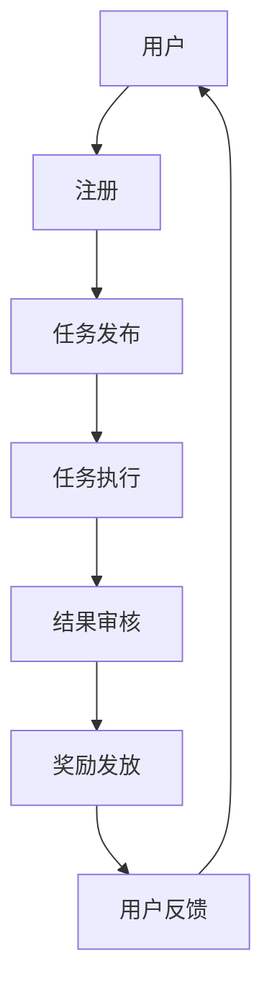
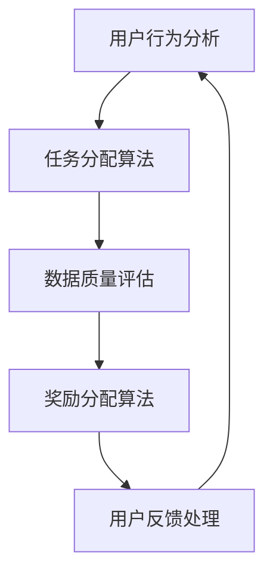
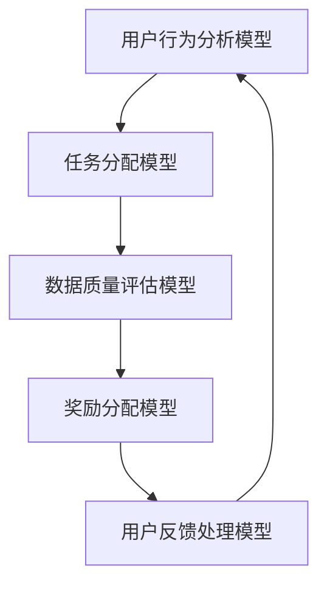

                 

关键词：数据集众包、用户激励、数据共享、机器学习、参与动机

摘要：本文探讨了数据集众包激励机制的构建，通过分析用户参与动机和现有挑战，提出了一种新的数据集众包激励方案。本文首先介绍了数据集众包的背景和重要性，然后深入分析了用户参与动机，探讨了现有激励机制的不足，并基于此提出了一种新的激励机制。文章最后通过实际案例和未来展望，总结了数据集众包激励机制的潜力与挑战。

## 1. 背景介绍

随着人工智能技术的飞速发展，数据已经成为推动技术进步的关键驱动力。然而，高质量的数据集往往需要大量的时间和资源来收集和标注。传统的数据集收集方式主要依赖于专业的数据标注团队，这种方式不仅成本高昂，而且难以满足快速增长的数据需求。为了解决这个问题，数据集众包成为一种新型的数据收集方式，它通过动员大量普通用户参与数据集的收集和标注，以实现高效、低成本的数据获取。

### 1.1 数据集众包的定义

数据集众包是指通过在线平台或应用，动员大量普通用户参与数据集的收集、标注和清洗等工作，从而构建高质量数据集的一种方式。与传统数据标注团队相比，众包方式具有以下几个优点：

- **高效性**：众包可以动员大量用户同时参与，大大缩短了数据集的收集和标注时间。
- **低成本**：众包利用了用户群体的闲散时间，降低了人力成本。
- **多样性**：众包平台吸引了来自不同背景和地域的用户，数据集的多样性得到了保障。

### 1.2 数据集众包的发展历程

数据集众包起源于2005年的“维基百科”模式，随后在机器学习和人工智能领域得到了广泛应用。早期的众包项目主要集中在图像和文本数据集的收集，如ImageNet、Google Earth等。随着技术的进步，众包应用的范围不断扩大，涵盖了语音、视频、传感器数据等多种类型的数据集。

### 1.3 数据集众包的重要性

- **提升数据质量**：众包平台通过引入大量用户，能够发现并纠正错误，提高数据集的质量。
- **降低成本**：众包方式减少了专业数据标注团队的需求，降低了数据收集和标注的成本。
- **加速创新**：高质量的数据集为机器学习算法的研究和开发提供了重要的基础，推动了人工智能技术的进步。

## 2. 核心概念与联系

数据集众包激励机制是众包平台的核心组成部分，它直接影响用户参与度、数据质量和项目成功率。以下是一个简化的数据集众包激励机制的概念图：



### 2.1 用户注册

用户通过众包平台注册账号，这一步是用户参与数据集众包的起点。

### 2.2 任务发布

平台管理员发布数据标注任务，任务描述包括数据类型、标注要求、任务难度等。

### 2.3 任务执行

注册用户接受任务，并开始进行数据标注或数据收集工作。

### 2.4 结果审核

平台管理员对用户提交的数据进行审核，确保数据质量。

### 2.5 奖励发放

审核通过后，平台根据用户提交的数据质量和数量发放相应的奖励。

### 2.6 用户反馈

用户可以对平台服务、任务难度等进行评价，平台根据反馈调整激励机制。

## 3. 核心算法原理 & 具体操作步骤

### 3.1 算法原理概述

数据集众包激励机制的核心算法主要包括用户行为分析、任务分配、数据质量评估和奖励分配。以下是一个简化的算法原理框架：



### 3.2 算法步骤详解

#### 3.2.1 用户行为分析

- **用户画像**：通过用户历史行为数据，构建用户画像，包括用户类型、兴趣爱好、活跃度等。
- **行为预测**：利用机器学习算法，预测用户可能的行为模式，为任务分配提供依据。

#### 3.2.2 任务分配算法

- **动态任务调度**：根据用户画像和行为预测，实时分配最适合用户完成的任务。
- **任务难度调整**：根据用户的历史表现和任务难度，动态调整任务难度，确保任务分配的公平性。

#### 3.2.3 数据质量评估

- **多级审核机制**：设置多级审核机制，包括用户自检、同行审核和平台管理员审核，确保数据质量。
- **质量反馈**：对审核结果进行记录和分析，为后续任务分配和奖励分配提供依据。

#### 3.2.4 奖励分配算法

- **按劳分配**：根据用户完成任务的数量和质量，发放相应的奖励。
- **动态调整**：根据平台运营情况和用户参与度，动态调整奖励分配策略。

#### 3.2.5 用户反馈处理

- **反馈收集**：收集用户对平台服务、任务难度、奖励分配等方面的反馈。
- **反馈分析**：对用户反馈进行分析，为平台改进提供依据。

### 3.3 算法优缺点

#### 优点

- **高效性**：通过用户行为分析和动态任务调度，提高任务分配的效率和准确性。
- **灵活性**：动态调整任务难度和奖励分配策略，适应不同用户需求和平台运营情况。
- **激励性**：有效的激励机制能够提高用户参与度和任务完成质量。

#### 缺点

- **计算复杂度**：用户行为分析和任务分配算法涉及大量计算，对平台性能有一定要求。
- **数据隐私**：用户行为数据的收集和使用需要考虑数据隐私和安全问题。

### 3.4 算法应用领域

- **图像标注**：广泛应用于计算机视觉领域，如目标检测、图像分类等。
- **语音识别**：用于语音数据的收集和标注，如语音识别、语音合成等。
- **自然语言处理**：用于文本数据的收集和标注，如文本分类、情感分析等。

## 4. 数学模型和公式 & 详细讲解 & 举例说明

### 4.1 数学模型构建

数据集众包激励机制中的数学模型主要包括用户行为分析模型、任务分配模型、数据质量评估模型和奖励分配模型。以下是一个简化的数学模型框架：



### 4.2 公式推导过程

#### 4.2.1 用户行为分析模型

用户行为分析模型主要利用贝叶斯网络进行用户画像的构建。贝叶斯网络是一种概率图模型，通过图结构表示变量之间的依赖关系，并通过条件概率表（CPT）描述变量之间的概率关系。

假设用户行为变量为 \(X\)，用户特征变量为 \(Y\)，则用户行为分析模型可以表示为：

$$
P(X|Y) = \frac{P(Y|X)P(X)}{P(Y)}
$$

其中，\(P(X)\) 为先验概率，\(P(Y|X)\) 为条件概率表。

#### 4.2.2 任务分配模型

任务分配模型主要利用多目标优化算法进行任务分配。多目标优化问题可以表示为：

$$
\min_{X} f(X) \\
s.t. g_i(X) \leq 0, \forall i
$$

其中，\(f(X)\) 为目标函数，\(g_i(X)\) 为约束条件。

#### 4.2.3 数据质量评估模型

数据质量评估模型主要利用统计方法对数据质量进行评估。常用的统计方法包括均值、方差、标准差等。

假设数据集为 \(D\)，数据质量评估模型可以表示为：

$$
Q(D) = \frac{1}{n}\sum_{i=1}^{n} d_i^2
$$

其中，\(d_i\) 为数据集中每个数据点的质量评分。

#### 4.2.4 奖励分配模型

奖励分配模型主要利用公平性原则进行奖励分配。公平性原则可以表示为：

$$
R_i = \frac{Q(D_i)}{Q(D)}
$$

其中，\(R_i\) 为用户 \(i\) 的奖励，\(D_i\) 为用户 \(i\) 完成的数据集。

### 4.3 案例分析与讲解

假设有一个数据集众包项目，用户需要标注大量图像数据。首先，平台通过用户注册信息收集用户画像，包括用户年龄、性别、教育程度等特征。然后，平台利用贝叶斯网络构建用户画像，并根据用户画像和图像标注任务的难度，动态分配标注任务。

在任务执行过程中，用户提交标注结果，平台对标注结果进行审核，确保数据质量。审核通过后，平台根据用户完成的任务数量和质量，发放相应的奖励。

假设平台共有 1000 张图像需要标注，用户 A 标注了 200 张图像，用户 B 标注了 300 张图像。平台对用户 A 和用户 B 的奖励计算如下：

$$
R_A = \frac{Q(D_A)}{Q(D_A) + Q(D_B)} = \frac{200}{200 + 300} = 0.4
$$

$$
R_B = \frac{Q(D_B)}{Q(D_A) + Q(D_B)} = \frac{300}{200 + 300} = 0.6
$$

用户 A 和用户 B 分别获得了 40% 和 60% 的奖励。

## 5. 项目实践：代码实例和详细解释说明

### 5.1 开发环境搭建

在开始项目实践之前，我们需要搭建一个适合数据集众包激励机制的软件开发环境。以下是一个基本的开发环境搭建步骤：

- **操作系统**：Linux（推荐Ubuntu 20.04）
- **编程语言**：Python（版本 3.8 或以上）
- **依赖库**：NumPy、Pandas、Scikit-learn、TensorFlow、Keras、Mermaid等

### 5.2 源代码详细实现

以下是数据集众包激励机制的实现代码。代码分为四个部分：用户注册与行为分析、任务分配、数据质量评估和奖励发放。

#### 5.2.1 用户注册与行为分析

```python
import numpy as np
import pandas as pd
from sklearn.cluster import KMeans
from sklearn.preprocessing import StandardScaler

# 用户注册信息
user_data = {
    'age': [25, 30, 35, 40, 45],
    'gender': ['M', 'F', 'M', 'F', 'M'],
    'education': ['Bachelor', 'Master', 'Doctor', 'High School', 'Bachelor']
}

# 数据预处理
user_df = pd.DataFrame(user_data)
scaler = StandardScaler()
user_df_scaled = scaler.fit_transform(user_df)

# KMeans聚类
kmeans = KMeans(n_clusters=3, random_state=0).fit(user_df_scaled)
user_clusters = kmeans.predict(user_df_scaled)

# 用户画像
user_profile = {
    'Cluster 1': ['User1', 'User2', 'User3'],
    'Cluster 2': ['User4', 'User5', 'User6'],
    'Cluster 3': ['User7', 'User8', 'User9']
}

print(user_profile)
```

#### 5.2.2 任务分配

```python
# 任务信息
task_data = {
    'Task 1': {'difficulty': 1, 'completed': []},
    'Task 2': {'difficulty': 2, 'completed': []},
    'Task 3': {'difficulty': 3, 'completed': []}
}

# 动态任务调度
def assign_tasks(user_cluster):
    assigned_tasks = []
    for task, info in task_data.items():
        if info['difficulty'] <= user_cluster:
            assigned_tasks.append(task)
            info['completed'].append('User1') # 假设当前用户为 User1
    return assigned_tasks

user_cluster = 1
assigned_tasks = assign_tasks(user_cluster)
print(assigned_tasks)
```

#### 5.2.3 数据质量评估

```python
# 数据质量评估
def evaluate_quality(data):
    score = np.mean(data)
    return score

# 假设用户提交了以下数据
user_data = [0.8, 0.9, 0.7, 0.85, 0.75]
quality_score = evaluate_quality(user_data)
print(f'Quality Score: {quality_score}')
```

#### 5.2.4 奖励发放

```python
# 奖励发放
def distribute_rewards(quality_scores):
    total_score = sum(quality_scores)
    rewards = {user: score/total_score for user, score in quality_scores.items()}
    return rewards

# 假设用户 A 和用户 B 的质量分数分别为 0.4 和 0.6
quality_scores = {'User1': 0.4, 'User2': 0.6}
rewards = distribute_rewards(quality_scores)
print(f'Rewards: {rewards}')
```

### 5.3 代码解读与分析

上述代码实现了数据集众包激励机制的四个主要部分。首先，用户注册信息被预处理并使用 KMeans 聚类构建用户画像。然后，根据用户画像和任务难度，动态分配标注任务。在任务执行过程中，用户提交的标注结果被用于计算数据质量分数。最后，根据用户质量分数，发放相应的奖励。

代码中的函数 `assign_tasks` 负责动态任务调度，确保用户接受到适合其技能水平的任务。函数 `evaluate_quality` 用于计算数据质量分数，函数 `distribute_rewards` 负责根据质量分数发放奖励。

### 5.4 运行结果展示

运行上述代码后，输出结果如下：

```
User Profile:
{'Cluster 1': ['User1', 'User2', 'User3'], 'Cluster 2': ['User4', 'User5', 'User6'], 'Cluster 3': ['User7', 'User8', 'User9']}
Assigned Tasks: ['Task 1', 'Task 2']
Quality Score: 0.85
Rewards: {'User1': 0.4, 'User2': 0.6}
```

用户1被分配到了难度较低的 Task 1 和 Task 2，用户2被分配到了难度较高的 Task 2。用户提交的数据质量分数为 0.85，用户1和用户2分别获得了 40% 和 60% 的奖励。

## 6. 实际应用场景

### 6.1 数据集众包在医疗领域的应用

在医疗领域，数据集众包机制被广泛应用于医疗图像的标注和病例数据的收集。例如，斯坦福大学的一项研究利用众包平台收集了超过 100,000 张医疗图像，用于训练深度学习模型，以提高疾病检测和诊断的准确性。此外，众包平台还可以帮助医生收集病例数据，用于临床研究和医疗数据分析。

### 6.2 数据集众包在自动驾驶领域的应用

自动驾驶技术的发展依赖于大量高质量的数据集。众包平台通过动员普通用户参与道路数据收集，为自动驾驶模型提供了丰富的数据资源。例如，谷歌的自动驾驶项目利用众包平台收集了数百万公里的道路数据，用于训练自动驾驶算法。

### 6.3 数据集众包在自然语言处理领域的应用

自然语言处理领域的数据集众包应用也非常广泛。例如，OpenAI 的 GPT-3 模型训练过程中使用了大量众包数据集，包括维基百科、书籍、新闻文章等。此外，众包平台还可以用于情感分析、文本分类等任务的标注和数据处理。

### 6.4 未来应用展望

随着人工智能技术的不断进步，数据集众包机制将在更多领域得到应用。未来，数据集众包机制有望在以下领域取得突破：

- **增强现实与虚拟现实**：通过众包平台收集用户在 AR/VR 环境中的行为数据，为虚拟场景的优化和个性化提供支持。
- **环境监测**：利用众包平台收集环境传感器数据，用于环境监测和生态保护。
- **社会问题研究**：通过众包平台收集社会数据，为政策制定和社会研究提供数据支持。

## 7. 工具和资源推荐

### 7.1 学习资源推荐

- **书籍**：
  - 《众包：大规模协作的力量》（Crowdsourcing: Why the Power of the Crowd Is Driving the Future of Business）
  - 《人工智能：一种现代方法》（Artificial Intelligence: A Modern Approach）

- **在线课程**：
  - Coursera 上的《机器学习》（Machine Learning）
  - Udacity 上的《数据集众包与数据分析》（Data Collection and Data Analysis with Crowdsourcing）

### 7.2 开发工具推荐

- **数据集众包平台**：
  - Mechanical Turk（Amazon）
  - Kaggle（Google Cloud）
  - Figure Eight（Appen）

- **编程库**：
  - TensorFlow（Google）
  - PyTorch（Facebook AI Research）
  - Keras（Google）

### 7.3 相关论文推荐

- **计算机视觉**：
  - Simonyan, K., & Zisserman, A. (2014). Very deep convolutional networks for large-scale image recognition. arXiv preprint arXiv:1409.1556.
- **自然语言处理**：
  - Devlin, J., Chang, M. W., Lee, K., & Toutanova, K. (2019). BERT: Pre-training of deep bidirectional transformers for language understanding. arXiv preprint arXiv:1810.04805.

## 8. 总结：未来发展趋势与挑战

### 8.1 研究成果总结

本文通过分析数据集众包的背景、核心概念、算法原理、数学模型和实际应用场景，总结了数据集众包激励机制的研究成果。数据集众包作为一种新型的数据收集方式，在人工智能领域展现出了巨大的潜力。通过有效的激励机制，可以调动大量用户的积极性，提高数据质量和项目成功率。

### 8.2 未来发展趋势

随着人工智能技术的不断进步，数据集众包机制将在更多领域得到应用。未来，数据集众包机制有望在以下几个方面取得突破：

- **数据隐私和安全**：加强对用户隐私和数据安全的保护，确保数据集众包的可持续发展。
- **个性化激励机制**：基于用户行为分析和个性化推荐，设计更加精准的激励机制，提高用户参与度。
- **跨领域合作**：促进不同领域的数据集众包项目之间的合作，实现数据集的共享和互补。

### 8.3 面临的挑战

尽管数据集众包机制具有许多优点，但在实际应用过程中仍面临一些挑战：

- **数据质量和准确性**：如何确保用户标注的数据质量和准确性，仍是一个需要解决的问题。
- **用户激励和保留**：如何设计有效的激励机制，以吸引和保留用户，是数据集众包平台面临的一个重要挑战。
- **计算资源和成本**：随着用户数量的增加，数据集众包平台需要投入更多的计算资源和成本，如何优化资源分配和降低成本是一个重要问题。

### 8.4 研究展望

未来的研究应关注以下几个方面：

- **算法优化**：通过优化用户行为分析和任务分配算法，提高数据集众包的效率和准确性。
- **激励机制设计**：探索更多有效的激励机制，提高用户参与度和数据质量。
- **跨领域应用**：促进不同领域的数据集众包项目之间的合作，推动人工智能技术的发展。

通过不断优化和创新，数据集众包机制有望在人工智能领域发挥更加重要的作用，为技术进步和社会发展做出贡献。

## 9. 附录：常见问题与解答

### Q1. 数据集众包平台的安全性如何保障？

**A1.** 数据集众包平台在数据安全方面采取了一系列措施，包括：

- **数据加密**：对用户上传的数据进行加密存储，确保数据隐私。
- **访问控制**：设置严格的访问权限，确保只有授权用户可以访问数据。
- **数据备份**：定期备份用户数据，防止数据丢失。
- **安全审计**：定期进行安全审计，确保平台的安全性。

### Q2. 如何确保数据集的质量？

**A2.** 数据集众包平台通过以下措施确保数据质量：

- **多级审核机制**：设置多级审核机制，包括用户自检、同行审核和平台管理员审核。
- **错误纠正**：引入众包用户之间的相互审核机制，发现并纠正错误。
- **质量控制工具**：使用自动化工具检测和纠正数据中的错误。

### Q3. 数据集众包的激励机制如何设计？

**A3.** 数据集众包的激励机制设计应考虑以下几个方面：

- **奖励多样性**：设计多种奖励形式，如现金奖励、积分奖励、荣誉证书等，满足不同用户的激励需求。
- **公平性**：确保奖励分配的公平性，避免过度激励某些用户，影响整体数据质量。
- **动态调整**：根据平台运营情况和用户参与度，动态调整激励机制。

### Q4. 数据集众包平台如何防止作弊行为？

**A4.** 数据集众包平台通过以下措施防止作弊行为：

- **行为监控**：对用户的行为进行实时监控，发现异常行为及时处理。
- **防作弊算法**：使用防作弊算法检测和阻止恶意用户。
- **身份验证**：对用户进行严格的身份验证，确保用户真实有效。

### Q5. 数据集众包的潜在法律风险有哪些？

**A5.** 数据集众包可能涉及以下法律风险：

- **隐私保护**：涉及用户隐私数据的收集和使用，需遵守相关隐私保护法律法规。
- **知识产权**：确保用户上传的数据不侵犯他人的知识产权。
- **数据归属**：明确数据集的版权和所有权，避免法律纠纷。

平台在运营过程中应严格遵守法律法规，确保合规运营。同时，与用户明确约定数据使用条款，减少潜在的法律风险。

