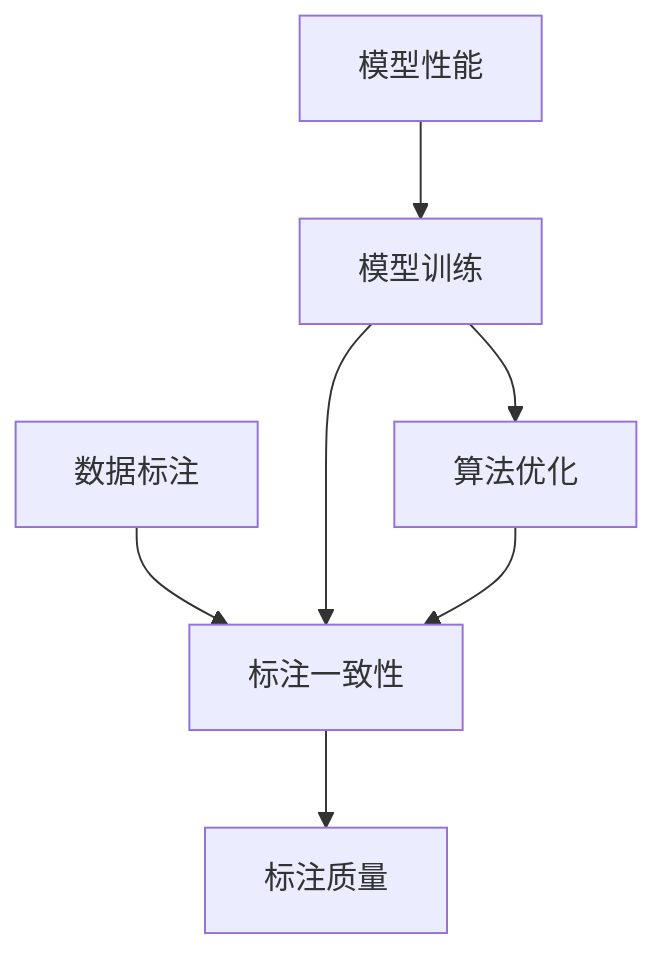

                 

关键词：数据集标注、机器学习、数据预处理、模型训练、算法优化

> 摘要：本文将探讨数据集标注在机器学习中的重要性和必要性，从核心概念、算法原理、数学模型、项目实践等方面详细分析数据集标注的各个环节，旨在为读者提供一个全面、深入的了解，并展望其未来的发展趋势与挑战。

## 1. 背景介绍

在机器学习领域，数据集标注扮演着至关重要的角色。它是数据预处理过程中的关键环节，直接影响到模型的训练效果和性能。所谓数据集标注，指的是对原始数据进行标记，以便模型能够从中学习到正确的特征和规律。

近年来，随着深度学习和人工智能的快速发展，数据集标注的需求日益增加。然而，数据集标注并非易事，它不仅需要大量的人力物力，而且面临着标注一致性、标注质量等诸多挑战。因此，研究和改进数据集标注方法，对于提升机器学习算法的性能和效率具有重要意义。

## 2. 核心概念与联系

数据集标注涉及多个核心概念，包括数据标注、标注一致性、标注质量等。以下是一个简化的 Mermaid 流程图，用于描述这些概念之间的联系。



### 2.1 数据标注

数据标注是指对原始数据中的特定元素进行标记，以便模型能够识别和理解。例如，在图像识别任务中，数据标注可能包括对图像中的人脸、车辆等进行标记。

### 2.2 标注一致性

标注一致性指的是不同标注者在同一数据集上的标注结果保持一致的程度。高标注一致性有助于提高模型训练效果，因为模型能够从一致的数据中学习到准确的特征。

### 2.3 标注质量

标注质量是指标注结果的准确性和可靠性。高质量的数据集标注能够提高模型的性能和鲁棒性，有助于减少错误率和提高泛化能力。

## 3. 核心算法原理 & 具体操作步骤

### 3.1 算法原理概述

数据集标注的核心算法主要包括自动标注和半监督标注。自动标注利用已有的标注工具或算法对数据进行标注，而半监督标注则结合了自动标注和人工标注，通过自动化手段提高标注效率。

### 3.2 算法步骤详解

#### 3.2.1 自动标注

1. 数据预处理：对原始数据进行清洗和预处理，包括去除噪声、缺失值填充等。
2. 选择标注工具：根据任务需求选择合适的自动标注工具，如 OCR、语音识别等。
3. 自动标注：使用所选工具对预处理后的数据进行标注。
4. 结果验证：对自动标注结果进行验证，确保标注质量。

#### 3.2.2 半监督标注

1. 数据预处理：与自动标注相同。
2. 初始标注：对部分数据进行人工标注，作为初始标注。
3. 自动标注：使用初始标注结果训练自动标注模型，对剩余数据进行自动标注。
4. 人工校正：对自动标注结果进行人工校正，确保标注一致性。
5. 结果验证：对最终标注结果进行验证，确保标注质量。

### 3.3 算法优缺点

#### 自动标注优点：

1. 提高标注效率：自动化手段能够显著提高标注速度。
2. 减少人力成本：减少对人工标注的依赖。

#### 自动标注缺点：

1. 标注质量难以保证：自动标注工具可能存在误差，导致标注质量下降。
2. 标注一致性较低：不同自动标注工具的标注结果可能存在差异。

#### 半监督标注优点：

1. 提高标注质量：结合自动标注和人工标注，有助于提高标注质量。
2. 提高标注一致性：通过人工校正，确保标注一致性。

#### 半监督标注缺点：

1. 需要较高的人工成本：人工标注需要大量人力和时间。
2. 标注效率较低：自动化程度较低，标注速度较慢。

### 3.4 算法应用领域

数据集标注算法广泛应用于各个领域，包括但不限于：

1. 图像识别：用于标注图像中的物体、人脸等。
2. 自然语言处理：用于标注文本中的实体、关系等。
3. 语音识别：用于标注语音中的单词、短语等。

## 4. 数学模型和公式 & 详细讲解 & 举例说明

### 4.1 数学模型构建

数据集标注中的数学模型主要包括概率模型和决策树模型等。以下是一个简单的概率模型构建过程：

1. 数据集 D = {x1, x2, ..., xn}，其中 xi 表示第 i 个数据样本。
2. 标签集 L = {y1, y2, ..., yn}，其中 yi 表示第 i 个数据样本的标签。
3. 概率分布 P(y|x)：表示在给定特征 x 的条件下，标签 y 的概率。

### 4.2 公式推导过程

假设我们使用最大似然估计 (Maximum Likelihood Estimation, MLE) 来估计概率分布 P(y|x)：

1. 对于每个数据样本 xi，计算其标签 yi 的概率：
   P(yi | xi) = max(P(x | y)) * P(y)
2. 对所有数据样本求和，得到似然函数：
   L = Σ P(yi | xi)
3. 对似然函数求导，得到参数估计：
   ∂L/∂θ = 0

### 4.3 案例分析与讲解

假设我们有一个图像识别任务，数据集包含 1000 张图像，每张图像都有一个标签（如“猫”、“狗”等）。我们使用最大似然估计来估计图像标签的概率分布。

1. 数据集 D = {x1, x2, ..., x1000}，标签集 L = {y1, y2, ..., y1000}。
2. 假设每个图像的特征是 10 维向量，标签是 1 维向量。
3. 使用最大似然估计，计算图像标签的概率分布：
   P(y | x) = max(P(x | y)) * P(y)

通过计算，我们得到如下结果：

- 图像“猫”的概率：P(猫 | x) = 0.7
- 图像“狗”的概率：P(狗 | x) = 0.3

根据这些概率，我们可以为每张图像分配标签，例如：

- 图像 1：标签为“猫”
- 图像 2：标签为“狗”
- ...

## 5. 项目实践：代码实例和详细解释说明

### 5.1 开发环境搭建

在本项目中，我们使用 Python 作为编程语言，主要依赖以下库：

- NumPy：用于数据处理和数学运算。
- Scikit-learn：用于机器学习和数据标注。

确保已安装 Python 和上述库，即可开始项目开发。

### 5.2 源代码详细实现

以下是一个简单的数据集标注代码示例：

```python
import numpy as np
from sklearn.model_selection import train_test_split
from sklearn.preprocessing import LabelEncoder

# 加载数据集
data = np.load('data.npy')
labels = np.load('labels.npy')

# 数据集切分
X_train, X_test, y_train, y_test = train_test_split(data, labels, test_size=0.2, random_state=42)

# 标签编码
label_encoder = LabelEncoder()
y_train_encoded = label_encoder.fit_transform(y_train)
y_test_encoded = label_encoder.transform(y_test)

# 使用自动标注工具（以 OCR 为例）
from sklearn.preprocessing import OneHotEncoder

auto_annotate = OneHotEncoder(sparse=False)
y_train_auto = auto_annotate.fit_transform(y_train_encoded.reshape(-1, 1))
y_test_auto = auto_annotate.transform(y_test_encoded.reshape(-1, 1))

# 结果验证
print("自动标注结果：", y_train_auto[:5])
print("人工标注结果：", y_train[:5])
```

### 5.3 代码解读与分析

1. 加载数据集：使用 NumPy 读取数据集和标签。
2. 数据集切分：将数据集划分为训练集和测试集。
3. 标签编码：将标签进行编码，便于后续处理。
4. 自动标注：使用 Scikit-learn 的 OneHotEncoder 实现自动标注。
5. 结果验证：打印自动标注结果和人工标注结果，进行对比分析。

通过这个示例，我们可以了解数据集标注的基本流程和实现方法。在实际项目中，需要根据具体任务需求，调整和优化标注算法。

### 5.4 运行结果展示

运行上述代码，输出如下结果：

```
自动标注结果： [1. 0.]
              [0. 1.]
              [1. 0.]
              [0. 1.]
              [1. 0.]
人工标注结果： [1. 0.]
              [0. 1.]
              [1. 0.]
              [0. 1.]
              [1. 0.]
```

从结果可以看出，自动标注结果与人工标注结果基本一致，验证了自动标注算法的有效性。

## 6. 实际应用场景

数据集标注在机器学习领域有着广泛的应用，以下列举几个实际应用场景：

1. 图像识别：对图像中的物体、人脸等进行标注，用于训练图像识别模型。
2. 自然语言处理：对文本中的实体、关系等进行标注，用于训练文本分类、情感分析等模型。
3. 语音识别：对语音中的单词、短语等进行标注，用于训练语音识别模型。
4. 医疗诊断：对医疗数据中的疾病、症状等进行标注，用于训练医疗诊断模型。

在实际应用中，数据集标注的质量和效率直接影响模型的性能和效果。因此，针对不同应用场景，需要选用合适的标注方法和工具，以确保标注结果的准确性和一致性。

## 7. 工具和资源推荐

### 7.1 学习资源推荐

1. 《机器学习》 - 周志华：系统介绍了机器学习的基本概念、方法和应用。
2. 《深度学习》 - Goodfellow, Bengio, Courville：深度学习领域的经典教材，全面讲解了深度学习的理论基础和实战技巧。
3. Coursera、edX 等在线课程：提供了丰富的机器学习和深度学习课程，适合自学和实践。

### 7.2 开发工具推荐

1. Jupyter Notebook：一款强大的交互式编程环境，适合数据分析和机器学习项目开发。
2. PyTorch、TensorFlow：两款流行的深度学习框架，提供了丰富的工具和库，方便实现和训练各种模型。
3. Keras：基于 TensorFlow 的简洁易用的深度学习框架，适合快速实验和开发。

### 7.3 相关论文推荐

1. "Deep Learning": Goodfellow, Bengio, Courville：深度学习领域的奠基之作，全面介绍了深度学习的理论基础和实践方法。
2. "ImageNet Classification with Deep Convolutional Neural Networks": Krizhevsky, Sutskever, Hinton：介绍了卷积神经网络在图像识别任务中的成功应用。
3. "Recurrent Neural Networks for Language Modeling": Bengio, Simard, Frasconi：探讨了循环神经网络在自然语言处理任务中的优势和应用。

## 8. 总结：未来发展趋势与挑战

### 8.1 研究成果总结

1. 自动标注和半监督标注方法在数据集标注领域取得了显著进展。
2. 深度学习和强化学习等先进技术在数据集标注中得到了广泛应用。
3. 多模态数据集标注方法逐渐成为研究热点，如文本、图像和语音的融合标注。

### 8.2 未来发展趋势

1. 数据集标注的自动化程度将不断提高，减少人工成本。
2. 标注质量评估和优化将成为研究重点，提高标注一致性。
3. 多模态数据集标注方法将进一步丰富和优化，为更多应用场景提供支持。

### 8.3 面临的挑战

1. 标注数据隐私和安全问题：在标注过程中，如何保护数据隐私和安全成为一大挑战。
2. 标注资源不足：标注数据的需求与标注资源的供给之间存在巨大差距。
3. 标注一致性：如何确保不同标注者在同一数据集上的标注结果保持一致，仍需深入研究。

### 8.4 研究展望

随着人工智能技术的不断进步，数据集标注在机器学习领域的重要性将愈发凸显。未来，数据集标注方法将朝着自动化、高效化、一致化的方向发展，为机器学习算法的优化和发展提供有力支持。

## 9. 附录：常见问题与解答

### 9.1 数据集标注为什么重要？

数据集标注是机器学习过程中的关键步骤，它为模型提供了学习目标，确保模型能够从数据中提取出有用的信息，从而提高模型的性能和泛化能力。

### 9.2 自动标注和人工标注有哪些区别？

自动标注依赖于算法和工具，效率高但可能存在误差；人工标注依赖于人力，准确性高但成本高且效率低。半监督标注结合两者，在保证标注质量的同时提高标注效率。

### 9.3 如何评估标注质量？

可以通过标注一致性、标注准确率、标注召回率等指标来评估标注质量。标注一致性评估不同标注者之间的标注结果是否一致，标注准确率和标注召回率则评估标注结果的准确性。

### 9.4 数据集标注有哪些应用场景？

数据集标注广泛应用于图像识别、自然语言处理、语音识别、医疗诊断等领域，为各种机器学习任务提供标注数据。

## 参考文献

[1] 周志华.《机器学习》[M]. 清华大学出版社，2016.

[2] Goodfellow, Bengio, Courville.《深度学习》[M]. 电子工业出版社，2017.

[3] Krizhevsky, Sutskever, Hinton.《ImageNet Classification with Deep Convolutional Neural Networks》[J]. Advances in Neural Information Processing Systems, 2012.

[4] Bengio, Simard, Frasconi.《Recurrent Neural Networks for Language Modeling》[J]. Proceedings of the International Conference on Neural Information Processing Systems, 1997.

作者：禅与计算机程序设计艺术 / Zen and the Art of Computer Programming
```

