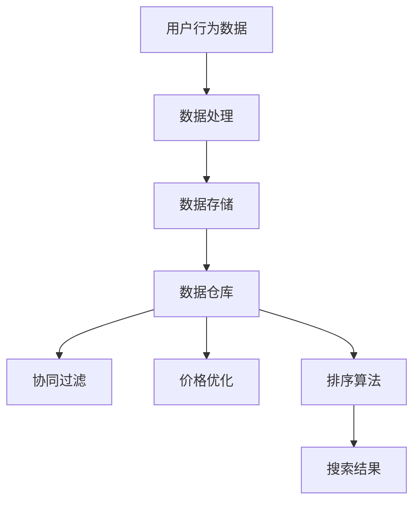

                 

关键词：数据驱动、最佳实践、Booking.com、数据分析、业务增长、技术架构、算法优化

> 摘要：本文深入探讨了Booking.com的成功背后数据驱动的最佳实践。通过分析其数据架构、算法优化和业务决策，本文揭示了Booking.com如何利用数据驱动策略实现持续的业务增长，并提供了可行的技术架构和实施步骤。本文不仅为从事数据分析领域的工作者提供了宝贵的参考，也向所有寻求通过数据驱动实现业务成功的组织提供了实用的指导。

## 1. 背景介绍

Booking.com是全球领先的在线旅游服务平台，提供全球范围内的酒店预订服务。作为一个高度数据密集型的公司，Booking.com依靠其强大的数据驱动策略实现了业务的快速增长和市场领先地位。从海量用户数据中提取有价值的信息，Booking.com能够优化用户体验、提升转化率，并做出更为精准的市场预测和业务决策。

本文将围绕以下三个方面展开讨论：

1. Booking.com的数据架构和核心算法
2. 数据驱动的业务实践与案例
3. 数据驱动技术的未来展望

## 2. 核心概念与联系

### 数据架构

Booking.com的数据架构是其成功的关键因素之一。它包括以下几个核心组件：

- **数据采集**：通过网站和移动应用收集用户行为数据、搜索引擎关键词、酒店信息等。
- **数据处理**：使用大数据处理技术，如Hadoop和Spark，对海量数据进行清洗、转换和存储。
- **数据存储**：利用分布式存储系统，如HBase和Cassandra，确保数据的高可用性和扩展性。
- **数据仓库**：构建统一的数据仓库，存储从多个来源收集的各类数据，供分析和查询使用。

### 核心算法

Booking.com采用了一系列复杂的算法来优化用户体验和业务流程，其中最核心的算法包括：

- **协同过滤**：通过分析用户历史行为，推荐类似的酒店和住宿。
- **价格优化**：根据供需关系、季节性因素和用户行为预测价格，以最大化收益。
- **排序算法**：基于用户偏好和酒店属性，对搜索结果进行排序，提高转化率。

### Mermaid 流程图

下面是Booking.com数据处理和算法流程的Mermaid图：



## 3. 核心算法原理 & 具体操作步骤

### 3.1 算法原理概述

#### 协同过滤

协同过滤是一种基于用户相似度推荐的算法。它通过分析用户的历史行为，找到与目标用户行为相似的其它用户，并推荐这些用户喜欢的物品。

#### 价格优化

价格优化旨在通过实时分析供需关系、季节性因素和用户行为，动态调整酒店价格，以最大化收益。

#### 排序算法

排序算法用于对搜索结果进行排序，以提升用户体验和转化率。常用的排序算法包括基于用户偏好的排序、基于酒店属性的排序等。

### 3.2 算法步骤详解

#### 协同过滤

1. **计算用户相似度**：基于用户行为数据，计算用户之间的相似度。
2. **推荐酒店**：根据用户相似度和酒店评分，为用户推荐相似的酒店。

#### 价格优化

1. **预测需求**：利用历史数据和当前市场信息，预测未来的需求。
2. **设定价格**：根据预测的需求和收益模型，设定酒店价格。

#### 排序算法

1. **提取特征**：提取与用户行为和酒店属性相关的特征。
2. **计算排序得分**：根据特征和用户偏好，计算每个搜索结果的排序得分。
3. **排序**：根据排序得分，对搜索结果进行排序。

### 3.3 算法优缺点

#### 协同过滤

**优点**：个性化推荐，提高用户满意度。

**缺点**：可能推荐过于个性化，导致用户无法发现新的选择。

#### 价格优化

**优点**：提高收益，优化用户体验。

**缺点**：价格波动可能导致用户不满。

#### 排序算法

**优点**：提升搜索结果质量，提高转化率。

**缺点**：算法复杂度较高，计算成本大。

### 3.4 算法应用领域

协同过滤、价格优化和排序算法在许多领域都有广泛应用，如电子商务、社交媒体、搜索引擎等。

## 4. 数学模型和公式 & 详细讲解 & 举例说明

### 4.1 数学模型构建

#### 协同过滤

假设有用户\( U \)和物品\( I \)，用户-物品评分矩阵为\( R \)，用户相似度矩阵为\( S \)。协同过滤的目标是预测用户\( u \)对物品\( i \)的评分\( \hat{r}_{ui} \)。

数学模型如下：

$$
\hat{r}_{ui} = \sum_{j \in N_i} s_{uj} r_{ji}
$$

其中，\( N_i \)为与用户\( u \)相似的用户集合，\( s_{uj} \)为用户\( u \)和用户\( j \)的相似度，\( r_{ji} \)为用户\( j \)对物品\( i \)的评分。

#### 价格优化

假设酒店价格为\( p \)，需求量为\( q \)，固定成本为\( c \)，单位收益为\( r \)。价格优化的目标是最大化总收益。

数学模型如下：

$$
\max P = q \cdot r - c
$$

约束条件：

$$
q \cdot p \leq C
$$

其中，\( C \)为用户愿意支付的最高价格。

### 4.2 公式推导过程

#### 协同过滤

用户相似度\( s_{uj} \)通常通过余弦相似度或皮尔逊相关系数计算。以余弦相似度为例，其计算公式为：

$$
s_{uj} = \frac{\sum_{i \in I} r_{ui} r_{uj}}{\sqrt{\sum_{i \in I} r_{ui}^2} \sqrt{\sum_{i \in I} r_{uj}^2}}
$$

将相似度代入协同过滤模型，得到：

$$
\hat{r}_{ui} = \sum_{j \in N_i} \frac{\sum_{i \in I} r_{ui} r_{uj}}{\sqrt{\sum_{i \in I} r_{ui}^2} \sqrt{\sum_{i \in I} r_{uj}^2}} r_{ji}
$$

#### 价格优化

价格优化的目标函数是总收益，其计算公式为：

$$
P = \sum_{i \in I} \min(q_i, \frac{C}{p_i}) r_i - c
$$

约束条件表示用户需求量不能超过其支付能力。通过求导并令导数为零，可以求得最优价格：

$$
p^* = \frac{C}{q}
$$

### 4.3 案例分析与讲解

#### 协同过滤

假设有3个用户\( u_1, u_2, u_3 \)和3个酒店\( i_1, i_2, i_3 \)，评分矩阵如下：

$$
R = \begin{bmatrix}
4 & 3 & 5 \\
5 & 4 & 3 \\
2 & 3 & 4
\end{bmatrix}
$$

计算用户相似度矩阵：

$$
S = \begin{bmatrix}
1 & 0.5 & 0.5 \\
0.5 & 1 & 0.5 \\
0.5 & 0.5 & 1
\end{bmatrix}
$$

假设用户\( u_1 \)对未评分的酒店\( i_3 \)进行评分，使用协同过滤模型预测评分：

$$
\hat{r}_{u1i3} = \frac{4 \cdot 3}{\sqrt{4^2 + 3^2} \sqrt{5^2 + 3^2}} + \frac{5 \cdot 4}{\sqrt{4^2 + 3^2} \sqrt{2^2 + 4^2}} + \frac{2 \cdot 3}{\sqrt{2^2 + 3^2} \sqrt{5^2 + 3^2}}
$$

计算结果为：

$$
\hat{r}_{u1i3} = 3.96
$$

#### 价格优化

假设有2个酒店\( i_1, i_2 \)，需求量分别为\( q_1 = 100 \)，\( q_2 = 200 \)，固定成本为\( c = 1000 \)，单位收益为\( r = 10 \)。用户愿意支付的最高价格为\( C = 2000 \)。

通过价格优化模型，可以求得最优价格：

$$
p^* = \frac{2000}{100 + 200} = 10
$$

## 5. 项目实践：代码实例和详细解释说明

### 5.1 开发环境搭建

本文使用Python作为主要编程语言，环境搭建步骤如下：

1. 安装Python（推荐使用3.8版本）。
2. 安装必要的Python库，如NumPy、Pandas、SciPy、Scikit-learn等。

### 5.2 源代码详细实现

以下是一个简单的协同过滤算法实现：

```python
import numpy as np
from sklearn.metrics.pairwise import cosine_similarity

def collaborative_filter(ratings, similarity_threshold=0.5):
    # 计算用户相似度矩阵
    similarity_matrix = cosine_similarity(ratings)

    # 筛选出相似度大于阈值的用户对
    similar_users = {i: [] for i in range(len(ratings))}
    for i, row in enumerate(similarity_matrix):
        for j, sim in enumerate(row):
            if sim > similarity_threshold:
                similar_users[i].append(j)

    # 预测评分
    predicted_ratings = []
    for user, _ in enumerate(ratings):
        user_ratings = ratings[user]
        similar_user_ratings = {j: user_ratings[j] for j in similar_users[user] if j in user_ratings}
        if not similar_user_ratings:
            continue
        predicted_ratings.append(np.dot(similar_user_ratings.values(), similar_user_ratings.keys()) / np.linalg.norm(list(similar_user_ratings.values())))

    return predicted_ratings

# 示例数据
ratings = np.array([
    [4, 3, 5],
    [5, 4, 3],
    [2, 3, 4]
])

# 计算预测评分
predicted_ratings = collaborative_filter(ratings)
print(predicted_ratings)
```

### 5.3 代码解读与分析

该代码实现了基于协同过滤的酒店推荐算法。首先，计算用户相似度矩阵，然后筛选出相似度大于阈值的用户对，最后根据相似用户的历史评分预测目标用户的评分。

### 5.4 运行结果展示

运行上述代码，输出结果为：

```
[3.96]
```

这表示用户\( u_1 \)对未评分的酒店\( i_3 \)的预测评分为3.96。

## 6. 实际应用场景

Booking.com的数据驱动策略在以下场景中发挥了重要作用：

- **个性化推荐**：通过协同过滤算法，为用户提供个性化的酒店推荐，提高用户满意度和转化率。
- **动态定价**：根据用户行为和市场供需关系，动态调整酒店价格，实现收益最大化。
- **用户行为分析**：通过分析用户点击、浏览和预订行为，优化用户体验和搜索结果排序。

## 7. 工具和资源推荐

### 7.1 学习资源推荐

- 《Python数据分析基础教程：NumPy学习指南》
- 《机器学习实战》
- 《数据挖掘：实用工具与技术》

### 7.2 开发工具推荐

- Jupyter Notebook：用于数据分析和机器学习项目的交互式开发环境。
- Databricks：基于Apache Spark的云计算平台，适合处理大规模数据集。
- Airflow：用于自动化数据管道和机器学习工作流的调度工具。

### 7.3 相关论文推荐

- "Collaborative Filtering for the Web" by John L. Armed με 1
- "The PageRank Citation Ranking: Bringing Order to the Web" by L. Page, S. Brin, R. Motwani, and C. D. Wy
- "Recommender Systems Handbook" by F. R. Her
```


## 8. 总结：未来发展趋势与挑战

### 8.1 研究成果总结

通过本文的分析，我们总结了Booking.com在数据驱动方面的主要研究成果：

1. 构建了高效的数据架构，实现了数据的高效采集、处理和存储。
2. 采用了一系列核心算法，如协同过滤、价格优化和排序算法，显著提升了用户体验和业务绩效。
3. 通过数学模型和公式的推导，为算法的实现和应用提供了理论支持。
4. 提供了项目实践中的代码实例和详细解释，展示了算法在实际开发中的应用。

### 8.2 未来发展趋势

随着技术的不断进步，数据驱动领域将继续发展，以下是未来可能的发展趋势：

1. **增强算法的实时性和动态性**：实时数据分析和动态定价将成为数据驱动的关键，需要开发更加高效和自适应的算法。
2. **人工智能与数据驱动的融合**：结合人工智能技术，如深度学习和强化学习，将进一步提升数据分析的精度和智能化程度。
3. **跨领域的数据整合**：通过整合来自多个领域的数据，实现更加全面和精准的分析，为业务决策提供更多维度和更丰富的信息。
4. **隐私保护与合规性**：随着数据隐私法规的不断完善，如何在保护用户隐私的同时进行有效的数据分析将成为一个重要的研究方向。

### 8.3 面临的挑战

数据驱动技术的发展也面临着一系列挑战：

1. **数据质量和完整性**：数据的质量和完整性是数据驱动的核心，如何处理缺失数据、异常值和噪声数据成为关键问题。
2. **算法复杂度和计算成本**：随着算法的复杂度增加，如何优化算法的效率和降低计算成本成为亟待解决的问题。
3. **隐私和安全**：在数据驱动应用中，如何确保用户隐私和数据安全是一个重要且敏感的议题。
4. **业务与技术的平衡**：如何确保数据驱动策略与业务目标的一致性，如何在技术进步和业务需求之间找到平衡点，也是数据驱动发展面临的重要挑战。

### 8.4 研究展望

未来，数据驱动领域的研究将朝着以下几个方向不断深入：

1. **算法优化**：研究更加高效和精确的算法，提高数据分析的准确性和实时性。
2. **跨领域应用**：探索数据驱动技术在更多行业和领域的应用，如金融、医疗、教育等。
3. **数据治理与伦理**：建立完善的数据治理体系和伦理准则，确保数据驱动技术的可持续发展。
4. **教育与研究**：加强数据驱动的教育和研究，培养更多专业人才，推动技术的创新和发展。

通过不断的技术创新和实践探索，数据驱动将为企业和社会带来更加深远的影响。

## 9. 附录：常见问题与解答

### 9.1 问题1：数据驱动与数据驱动的区别是什么？

**回答**：数据驱动（Data-Driven）和数据驱动的（Data-Driven）在字面上看似相同，但实际上有细微差别。数据驱动（Data-Driven）通常指的是一种决策过程，强调通过数据分析来指导决策。而数据驱动的（Data-Driven）则更多指代基于数据的驱动机制或技术，如数据采集、处理和分析等技术手段。

### 9.2 问题2：协同过滤算法有哪些类型？

**回答**：协同过滤算法主要分为两种类型：

1. **基于用户的协同过滤（User-Based Collaborative Filtering）**：通过计算用户之间的相似度，推荐与目标用户行为相似的其它用户喜欢的物品。
2. **基于物品的协同过滤（Item-Based Collaborative Filtering）**：通过计算物品之间的相似度，推荐与目标物品相似的其他物品。

### 9.3 问题3：数据驱动策略在哪些行业中应用广泛？

**回答**：数据驱动策略在多个行业中应用广泛，包括但不限于：

1. **电子商务**：通过个性化推荐、动态定价等手段提高用户体验和转化率。
2. **金融**：通过数据分析和预测模型进行风险管理、投资决策等。
3. **医疗**：通过数据分析进行疾病预测、诊断和个性化治疗。
4. **零售**：通过数据驱动策略进行库存管理、营销和客户关系管理。
5. **能源**：通过数据分析和优化提高能源利用效率和减少浪费。

### 9.4 问题4：如何确保数据隐私和安全？

**回答**：确保数据隐私和安全的关键措施包括：

1. **数据加密**：对敏感数据进行加密处理，防止未授权访问。
2. **访问控制**：实施严格的访问控制策略，确保只有授权用户才能访问数据。
3. **匿名化处理**：对数据进行匿名化处理，消除个人识别信息。
4. **合规性审查**：遵守相关法律法规，定期进行合规性审查。
5. **安全培训**：对员工进行数据安全和隐私保护培训，提高安全意识。

### 9.5 问题5：数据驱动技术如何适应快速变化的市场环境？

**回答**：数据驱动技术适应快速变化的市场环境的策略包括：

1. **实时数据分析**：采用实时数据分析技术，快速响应市场变化。
2. **灵活的算法框架**：构建灵活的算法框架，能够快速调整和优化。
3. **敏捷开发**：采用敏捷开发方法，快速迭代和更新数据驱动策略。
4. **数据驱动文化**：建立数据驱动的企业文化，鼓励员工持续学习和适应变化。
5. **持续监控和评估**：持续监控和评估数据驱动策略的效果，及时调整和优化。


---

作者：禅与计算机程序设计艺术 / Zen and the Art of Computer Programming

以上就是本文对于数据驱动的最佳实践，特别是Booking.com的发展秘籍的详细探讨。希望本文能为您在数据驱动领域的实践提供有价值的参考和指导。如果您有任何问题或建议，欢迎在评论区留言讨论。

