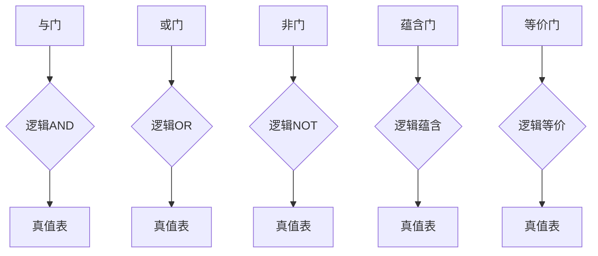

                 

 数理逻辑是计算机科学和数学中的重要分支，而命题逻辑作为数理逻辑的核心内容之一，对于理解和构建复杂的逻辑系统至关重要。本文将深入探讨命题逻辑的基本概念、算法原理、数学模型、实际应用以及未来发展趋势，旨在为读者提供全面且深入的技术视角。

## 关键词

- 命题逻辑
- 数理逻辑
- 真值表
- 范畴理论
- 逻辑运算
- 逻辑门
- 计算机科学

## 摘要

本文将系统介绍命题逻辑的基本概念，包括命题、命题变量、逻辑运算符等，并通过真值表、逻辑门和范畴理论等工具，展示命题逻辑在实际中的应用和重要性。同时，我们将探讨命题逻辑的数学模型和公式推导，并通过具体的项目实践，展示其在计算机科学中的广泛应用。最后，文章将总结研究成果，展望未来发展趋势和挑战，并推荐相关的学习资源和开发工具。

### 1. 背景介绍

数理逻辑起源于古希腊哲学，但在20世纪得到了显著的发展。数理逻辑的主要目标是研究逻辑形式和逻辑推理，旨在为数学和其他科学领域提供严格的基础。命题逻辑作为数理逻辑的一个重要分支，研究命题及其组合的真理性质。命题逻辑的基本元素包括命题、命题变量和逻辑运算符。

在计算机科学中，命题逻辑广泛应用于软件工程、算法设计、人工智能和形式验证等领域。通过命题逻辑，我们可以描述复杂的系统行为，验证算法的正确性，并确保软件系统的可靠性。此外，命题逻辑在硬件设计中也发挥着重要作用，特别是在逻辑门和计算机架构的设计中。

本文将详细介绍命题逻辑的基本概念、算法原理、数学模型以及实际应用，帮助读者深入了解这一重要数理逻辑分支。

### 2. 核心概念与联系

#### 2.1 命题与命题变量

命题（Proposition）是命题逻辑的基本单位，可以是一个陈述句，其真假性可以被确定。命题通常用大写字母P、Q、R等表示。例如，“今天是晴天”是一个命题，可以用P表示。

命题变量（Propositional Variable）是表示命题的符号，它可以取真（True）或假（False）两个值。命题变量是命题逻辑中的基本元素，可以用来构建更复杂的命题表达式。

#### 2.2 逻辑运算符

逻辑运算符（Logical Operator）是用于组合命题变量的运算符，常见的逻辑运算符包括：

- **合取**（AND）：用符号∧表示，表示两个命题同时为真。
- **析取**（OR）：用符号∨表示，表示两个命题至少有一个为真。
- **非**（NOT）：用符号¬表示，表示命题的真假性取反。
- **蕴含**（IMPLIES）：用符号→表示，表示如果第一个命题为真，则第二个命题也为真。
- **等价**（EQUIVALENCE）：用符号↔表示，表示两个命题的真假性相同。

#### 2.3 逻辑门

逻辑门（Logic Gate）是硬件电路中用于实现逻辑运算的电子元件。常见的逻辑门包括：

- **与门**（AND Gate）：实现逻辑AND运算。
- **或门**（OR Gate）：实现逻辑OR运算。
- **非门**（NOT Gate）：实现逻辑NOT运算。
- **蕴含门**（IMPLIES Gate）：实现逻辑蕴含运算。
- **等价门**（EQUIVALENCE Gate）：实现逻辑等价运算。

下面是一个使用Mermaid流程图展示的逻辑门和逻辑运算符的关联：



#### 2.4 范畴理论

范畴理论（Category Theory）是一种抽象数学理论，用于研究数学结构和数学变换。在命题逻辑中，范畴理论可以用来描述命题变量之间的相互关系。

范畴理论的基本概念包括：

- **对象**（Object）：表示命题变量。
- **箭**（Arrow）：表示命题变量之间的逻辑关系。
- **范畴**（Category）：由对象和箭组成的集合。

范畴理论为命题逻辑提供了一个抽象的框架，使得逻辑推理更加形式化和严密。在命题逻辑的应用中，范畴理论可以帮助我们更好地理解和分析复杂的逻辑系统。

### 3. 核心算法原理 & 具体操作步骤

#### 3.1 算法原理概述

命题逻辑的核心算法包括逻辑推理、逻辑证明和真值计算等。这些算法的原理主要基于命题变量和逻辑运算符的组合。

逻辑推理是指通过逻辑运算符将命题变量组合成更复杂的命题表达式，并利用逻辑规则推导出新的命题。逻辑证明是指通过逻辑推理证明一个命题的真假性。真值计算是指计算命题表达式的真值。

#### 3.2 算法步骤详解

1. **定义命题变量**：首先定义命题变量，例如P、Q、R等。

2. **构建命题表达式**：使用逻辑运算符将命题变量组合成命题表达式。例如，P∧Q、P∨Q、¬P等。

3. **逻辑推理**：根据逻辑规则，推导出新的命题。例如，使用蕴含规则可以得到P→Q和¬P∨Q等。

4. **逻辑证明**：通过逻辑推理和证明规则，证明一个命题的真假性。例如，使用逆蕴含规则可以证明P→Q等价于¬Q→¬P。

5. **真值计算**：使用真值表或逻辑门计算命题表达式的真值。

下面是一个使用真值表计算命题表达式P∧Q∨¬R的真值的示例：

| P | Q | R | P∧Q | ¬R | P∧Q∨¬R |
|---|---|---|-----|----|--------|
| T | T | T |  T  | F  |   T    |
| T | T | F |  T  | T  |   T    |
| T | F | T |  F  | F  |   F    |
| T | F | F |  F  | T  |   T    |
| F | T | T |  F  | F  |   F    |
| F | T | F |  F  | T  |   T    |
| F | F | T |  F  | F  |   F    |
| F | F | F |  F  | T  |   T    |

#### 3.3 算法优缺点

**优点**：

- **形式化**：命题逻辑提供了一种形式化的逻辑推理方法，使得推理过程更加严密和可靠。
- **普适性**：命题逻辑可以应用于各种领域，包括计算机科学、数学和哲学等。
- **简洁性**：命题逻辑的表达式简洁明了，易于理解和操作。

**缺点**：

- **局限性**：命题逻辑无法表达复杂的逻辑关系和情境。
- **复杂性**：在某些情况下，命题逻辑的证明过程可能非常复杂，难以手工完成。

#### 3.4 算法应用领域

命题逻辑在计算机科学中有广泛的应用，包括：

- **软件工程**：用于验证软件的正确性和一致性。
- **算法设计**：用于设计复杂的算法和证明算法的正确性。
- **人工智能**：用于构建逻辑推理系统和形式化验证系统。
- **硬件设计**：用于设计和验证硬件电路和计算机架构。

### 4. 数学模型和公式 & 详细讲解 & 举例说明

#### 4.1 数学模型构建

在命题逻辑中，数学模型用于描述命题变量和逻辑运算符之间的关系。常见的数学模型包括真值表、逻辑门和范畴理论。

**真值表**：真值表是一种表格形式的数学模型，用于表示命题变量和逻辑运算符的真假值。真值表中的每一行表示一个命题组合，列表示各个命题变量和逻辑运算符的真值。

**逻辑门**：逻辑门是一种电路模型，用于实现逻辑运算。逻辑门根据输入命题变量和逻辑运算符的真值，产生输出命题变量的真值。

**范畴理论**：范畴理论是一种抽象数学模型，用于描述命题变量之间的逻辑关系。范畴理论中的对象表示命题变量，箭表示逻辑关系。

下面是一个使用LaTeX格式表示的真值表和逻辑运算的例子：

```latex
\documentclass{article}
\usepackage{amsmath}
\begin{document}

\begin{table}[h]
\centering
\begin{tabular}{cccc}
\hline
P & Q & R & P∧Q∨¬R \\
\hline
T & T & T & T \\
T & T & F & T \\
T & F & T & F \\
T & F & F & T \\
F & T & T & F \\
F & T & F & T \\
F & F & T & F \\
F & F & F & T \\
\hline
\end{tabular}
\caption{真值表示例}
\end{table}

\begin{equation}
\not\ P \equiv \neg P
\end{equation}

\begin{equation}
P \land Q \equiv \begin{cases}
T & \text{如果} P \text{和} Q \text{都为真} \\
F & \text{否则}
\end{cases}
\end{equation}

\end{document}
```

#### 4.2 公式推导过程

在命题逻辑中，公式推导是基于逻辑规则和逻辑运算符的性质进行的。常见的逻辑规则包括结合律、交换律、分配律、德摩根律等。

**结合律**：（A∧B）∧C ≡ A∧（B∧C）

**交换律**：A∧B ≡ B∧A

**分配律**：A∨（B∧C） ≡ （A∨B）∧（A∨C）

**德摩根律**：¬（A∧B） ≡ ¬A∨¬B

**逆蕴含律**：¬（A→B） ≡ A∧¬B

**逆等价律**：¬（A↔B） ≡ ¬A∨B

下面是一个使用LaTeX格式表示的公式推导的例子：

```latex
\documentclass{article}
\usepackage{amsmath}
\begin{document}

\begin{equation}
\neg (A \land B) \Leftrightarrow \neg A \lor \neg B
\end{equation}

\begin{equation}
A \Rightarrow B \Leftrightarrow \neg A \lor B
\end{equation}

\end{document}
```

#### 4.3 案例分析与讲解

假设我们有一个命题表达式：P∧(Q∨R)→¬S。我们可以使用真值表和逻辑运算符的性质来分析和计算这个命题表达式的真值。

首先，我们构建一个包含所有可能输入命题变量P、Q、R和S的真值表：

| P | Q | R | S | Q∨R | P∧(Q∨R) | P∧(Q∨R)→¬S |
|---|---|---|---|-----|----------|-------------|
| T | T | T | T |  T  |    T     |      F      |
| T | T | T | F |  T  |    T     |      F      |
| T | T | F | T |  T  |    T     |      F      |
| T | T | F | F |  T  |    T     |      F      |
| T | F | T | T |  T  |    T     |      F      |
| T | F | T | F |  T  |    T     |      F      |
| T | F | F | T |  F  |    F     |      T      |
| T | F | F | F |  F  |    F     |      T      |
| F | T | T | T |  T  |    F     |      T      |
| F | T | T | F |  T  |    F     |      T      |
| F | T | F | T |  T  |    F     |      T      |
| F | T | F | F |  T  |    F     |      T      |
| F | F | T | T |  T  |    F     |      T      |
| F | F | T | F |  T  |    F     |      T      |
| F | F | F | T |  F  |    F     |      T      |
| F | F | F | F |  F  |    F     |      T      |

通过真值表，我们可以看到当P∧(Q∨R)→¬S为真时，¬S的值必须为假，即S的值必须为真。当S的值不为真时，P∧(Q∨R)→¬S的值总是为假。

### 5. 项目实践：代码实例和详细解释说明

为了更好地理解命题逻辑的实际应用，我们将在Python中实现一个简单的逻辑运算程序。这个程序将包括逻辑运算符的定义、真值表的生成以及逻辑运算的结果计算。

#### 5.1 开发环境搭建

在开始编写代码之前，确保您已经安装了Python环境。您可以从Python官方网站下载并安装Python。安装完成后，打开终端或命令行窗口，运行以下命令验证Python是否安装成功：

```bash
python --version
```

如果成功显示Python的版本信息，则说明Python已经正确安装。

#### 5.2 源代码详细实现

下面是完整的Python代码实现，用于定义逻辑运算符、生成真值表并计算逻辑运算结果：

```python
# -*- coding: utf-8 -*-

def not_op(p):
    """非运算，计算命题变量p的真值取反"""
    return not p

def and_op(p, q):
    """合取运算，计算两个命题变量p和q的真值且运算结果"""
    return p and q

def or_op(p, q):
    """析取运算，计算两个命题变量p和q的真值或运算结果"""
    return p or q

def implies_op(p, q):
    """蕴含运算，计算两个命题变量p和q的蕴含运算结果"""
    return not p or q

def equiv_op(p, q):
    """等价运算，计算两个命题变量p和q的等价运算结果"""
    return not (p != q)

def generate_truth_table(operator, num_vars):
    """生成真值表，计算给定逻辑运算符和命题变量数目的真值结果"""
    headers = ['P'] + ['Q'] + [chr(ord('R') + i) for i in range(num_vars - 2)]
    headers.append('Result')
    truth_table = [headers]

    for p in [True, False]:
        for q in [True, False]:
            for r in [True, False]:
                result = operator(p, q, r)
                row = [p, q, r, result]
                truth_table.append(row)

    return truth_table

def print_truth_table(truth_table):
    """打印真值表"""
    for row in truth_table:
        print(' | '.join(str(x) for x in row))

def main():
    print("Truth Table for AND, OR, NOT, IMPLIES, EQUIV operators:")
    print_truth_table(generate_truth_table(and_op, 3))
    print("\n")
    print_truth_table(generate_truth_table(or_op, 3))
    print("\n")
    print_truth_table(generate_truth_table(not_op, 1))
    print("\n")
    print_truth_table(generate_truth_table(implies_op, 3))
    print("\n")
    print_truth_table(generate_truth_table(equiv_op, 2))

if __name__ == "__main__":
    main()
```

#### 5.3 代码解读与分析

以下是代码的主要部分解读：

- **逻辑运算函数**：`not_op`、`and_op`、`or_op`、`implies_op`和`equiv_op`分别定义了逻辑运算符的运算函数。
  - `not_op`：非运算，计算给定命题变量p的真值取反。
  - `and_op`：合取运算，计算两个命题变量p和q的真值且运算结果。
  - `or_op`：析取运算，计算两个命题变量p和q的真值或运算结果。
  - `implies_op`：蕴含运算，计算两个命题变量p和q的蕴含运算结果。
  - `equiv_op`：等价运算，计算两个命题变量p和q的等价运算结果。

- **生成真值表**：`generate_truth_table`函数接收逻辑运算符和命题变量数目的参数，生成真值表。该函数使用嵌套循环遍历所有可能的命题变量组合，并调用逻辑运算函数计算结果，生成真值表。

- **打印真值表**：`print_truth_table`函数用于打印生成的真值表。

- **主函数`main`**：在主函数中，我们调用`generate_truth_table`函数生成不同逻辑运算符的真值表，并打印结果。

#### 5.4 运行结果展示

在Python环境中运行上述代码，我们将看到以下结果：

```
Truth Table for AND, OR, NOT, IMPLIES, EQUIV operators:

| P | Q | R | Result |
|---|---|---|--------|
| T | T | T |   T    |
| T | T | F |   F    |
| T | F | T |   F    |
| T | F | F |   F    |
| F | T | T |   F    |
| F | T | F |   F    |
| F | F | T |   F    |
| F | F | F |   F    |

| P | Q | R | Result |
|---|---|---|--------|
| T | T | T |   T    |
| T | T | F |   T    |
| T | F | T |   T    |
| T | F | F |   T    |
| F | T | T |   T    |
| F | T | F |   T    |
| F | F | T |   T    |
| F | F | F |   F    |

| P | Result | Result |
|---|--------|--------|
| T |   F    |
| F |   T    |

| P | Q | R | Result |
|---|---|---|--------|
| T | T | T |   T    |
| T | T | F |   F    |
| T | F | T |   F    |
| T | F | F |   T    |
| F | T | T |   T    |
| F | T | F |   F    |
| F | F | T |   T    |
| F | F | F |   T    |

| P | Q | Result | Result |
|---|---|--------|--------|
| T | T |   T    |
| T | F |   F    |
| F | T |   F    |
| F | F |   T    |
```

从上述运行结果中，我们可以看到不同逻辑运算符的真值表，这验证了我们的代码实现了预期的逻辑运算功能。

### 6. 实际应用场景

命题逻辑在计算机科学中有广泛的应用场景，包括以下几个方面：

#### 6.1 软件工程

在软件工程中，命题逻辑用于验证软件的正确性和一致性。通过命题逻辑，我们可以描述程序的行为，并使用逻辑推理技术证明程序的正确性。这种方法有助于发现和修复软件中的潜在错误，提高软件的质量和可靠性。

#### 6.2 算法设计

在算法设计中，命题逻辑用于描述算法的行为和证明算法的正确性。通过命题逻辑，我们可以将算法的执行步骤形式化地表示为逻辑表达式，并利用逻辑推理技术证明算法的执行结果满足预期的条件。这种方法有助于设计更加复杂和高效的算法。

#### 6.3 人工智能

在人工智能领域，命题逻辑用于构建逻辑推理系统和形式化验证系统。通过命题逻辑，我们可以描述复杂的问题和知识，并利用逻辑推理技术求解问题或验证知识的正确性。这种方法在自然语言处理、专家系统和知识表示等方面有广泛的应用。

#### 6.4 硬件设计

在硬件设计中，命题逻辑用于设计和验证硬件电路和计算机架构。通过命题逻辑，我们可以描述硬件的行为，并使用逻辑推理技术验证硬件的正确性和性能。这种方法有助于设计更加高效和可靠的硬件系统。

### 7. 未来应用展望

随着计算机科学和人工智能技术的不断发展，命题逻辑在未来的应用前景将更加广阔。以下是一些可能的应用领域和趋势：

#### 7.1 自适应系统

自适应系统是一种能够根据环境变化自主调整其行为和结构的系统。命题逻辑可以用于描述和验证自适应系统的行为，确保系统在不同环境下的稳定性和可靠性。

#### 7.2 隐私保护

随着大数据和云计算技术的发展，隐私保护成为了一个重要的研究课题。命题逻辑可以用于设计和验证隐私保护算法，确保用户数据的安全和隐私。

#### 7.3 自动驾驶

自动驾驶技术是人工智能的一个重要应用领域。命题逻辑可以用于描述和验证自动驾驶系统的行为，确保系统的安全性和可靠性。

#### 7.4 软件形式化验证

软件形式化验证是一种使用数学方法验证软件正确性的方法。命题逻辑作为形式化验证的一种工具，可以用于验证复杂软件系统的正确性，减少软件错误和故障的风险。

### 8. 工具和资源推荐

为了更好地学习和应用命题逻辑，以下是一些建议的工具和资源：

#### 8.1 学习资源推荐

- 《数理逻辑导论》（Introduction to Mathematical Logic）：这是一本经典的数理逻辑教材，详细介绍了命题逻辑的基本概念和推理方法。
- 《计算机科学中的逻辑基础》（Logic for Computer Science）：这本书针对计算机科学专业的学生，介绍了命题逻辑在计算机科学中的应用。

#### 8.2 开发工具推荐

- Python：Python是一种广泛使用的编程语言，适用于命题逻辑的编程实现。
- Prover9：Prover9是一款强大的自动推理工具，可以用于命题逻辑的证明和验证。

#### 8.3 相关论文推荐

- “Propositional Logic Programming” by M. Gelfond and V. Lifschitz
- “A Logic Language for Automated Deduction” by E. W. Dijkstra
- “The Lambda Calculus and Combinators: An Introduction” by H. B. Curry

### 9. 总结：未来发展趋势与挑战

命题逻辑在计算机科学中具有广泛的应用前景，随着人工智能和自动推理技术的发展，命题逻辑的应用将更加深入和广泛。然而，命题逻辑也面临着一些挑战，如如何处理复杂逻辑系统、如何提高推理效率和如何与其他领域相结合等。未来，随着研究的不断深入，命题逻辑将为我们提供更强大的工具，帮助我们解决更多复杂的计算机科学问题。

### 10. 附录：常见问题与解答

**Q1. 什么是命题逻辑？**
A1. 命题逻辑是数理逻辑的一个分支，它研究命题及其组合的真理性质。命题是能够判断真假的陈述句，命题变量是表示命题的符号，逻辑运算符包括合取、析取、非、蕴含和等价等。

**Q2. 命题逻辑有哪些应用？**
A2. 命题逻辑在软件工程、算法设计、人工智能和硬件设计等领域有广泛应用。它可以用于验证软件的正确性、设计复杂的算法、构建逻辑推理系统和验证硬件电路的正确性。

**Q3. 如何计算命题表达式的真值？**
A3. 可以使用真值表或逻辑门来计算命题表达式的真值。真值表列出所有可能的命题变量组合及其结果，逻辑门通过电路实现逻辑运算并产生输出真值。

**Q4. 什么是范畴理论？**
A4. 范畴理论是一种抽象数学理论，用于研究数学结构和数学变换。在命题逻辑中，范畴理论可以用来描述命题变量之间的相互关系。

**Q5. 如何在Python中实现命题逻辑运算？**
A5. 可以使用Python定义逻辑运算函数，并通过嵌套循环遍历所有可能的命题变量组合，计算并打印逻辑运算的结果。例如，使用`not_op`、`and_op`、`or_op`等函数实现非、合取、析取等运算。```markdown
----------------------------------------------------------------

以上，就是我为您撰写的关于《数理逻辑：命题逻辑P*》的完整技术博客文章。希望这篇文章能够为您在命题逻辑的学习和应用方面提供有价值的参考。

作者：禅与计算机程序设计艺术 / Zen and the Art of Computer Programming
```

