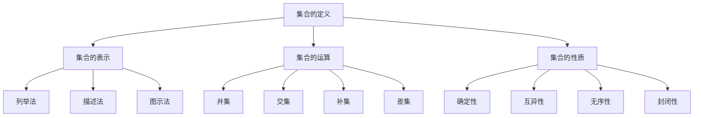

                 

关键词：数理逻辑，集合论，数学基础，逻辑运算，集合表示，集合性质

> 摘要：本文将深入探讨数理逻辑中集合的基本概念，包括集合的定义、集合的表示、集合的运算和集合的性质。通过对集合论的基础知识的讲解，帮助读者理解集合论在数学和计算机科学中的重要地位和应用。

## 1. 背景介绍

数理逻辑是数学的一个分支，它研究逻辑在数学和计算机科学中的应用。集合论作为数理逻辑的核心组成部分，为数学提供了一个坚实的基础。集合论的基本概念在数学、计算机科学、逻辑学、物理学等多个领域都有广泛的应用。集合论的发展始于19世纪，由德国数学家乔治·康托尔开创，他通过研究集合和集合之间的运算，建立了一套完整的集合论体系。

集合论的主要研究内容包括集合的定义、集合的表示、集合的运算和集合的性质。集合的定义是集合论的基础，集合的表示方法多种多样，集合的运算是集合论的核心内容，集合的性质则帮助我们更好地理解和应用集合。

## 2. 核心概念与联系

### 2.1 集合的定义

集合是一组无序的、确定的对象的集合。这些对象可以是具体的实体，如数字、字母、颜色等，也可以是抽象的概念，如函数、关系等。集合通常用大写字母表示，如A、B、C等，集合中的元素用小写字母表示，如a、b、c等。

### 2.2 集合的表示

集合的表示方法有多种，包括列举法、描述法和图示法。

- **列举法**：通过列举集合中的所有元素来表示集合。例如，A = {1, 2, 3} 表示集合A包含元素1、2和3。

- **描述法**：通过描述集合的元素性质来表示集合。例如，B = {x | x 是正整数} 表示集合B包含所有正整数。

- **图示法**：使用Venn图或树状图等图形来表示集合。例如，C = A ∩ B 表示集合C是集合A和集合B的交集。

### 2.3 集合的运算

集合的基本运算包括并集、交集、补集和差集。

- **并集（∪）**：集合A和集合B的并集是由属于集合A或集合B的所有元素组成的集合。例如，A ∪ B = {x | x ∈ A 或 x ∈ B}。

- **交集（∩）**：集合A和集合B的交集是由既属于集合A又属于集合B的所有元素组成的集合。例如，A ∩ B = {x | x ∈ A 且 x ∈ B}。

- **补集（∁）**：集合A的补集是由不属于集合A的所有元素组成的集合。例如，∁A = {x | x ∉ A}。

- **差集（∖）**：集合A和集合B的差集是由属于集合A但不属于集合B的所有元素组成的集合。例如，A ∖ B = {x | x ∈ A 且 x ∉ B}。

### 2.4 集合的性质

集合具有以下基本性质：

- **确定性**：集合中的元素是确定的，即每个元素是否属于集合是可以确定的。

- **互异性**：集合中的元素是互异的，即集合中不会出现重复的元素。

- **无序性**：集合中的元素是无序的，即集合中的元素不考虑顺序。

- **封闭性**：如果集合中的任意两个元素x和y的运算结果仍在集合中，则称该集合对该运算封闭。

### 2.5 Mermaid 流程图

以下是一个简单的Mermaid流程图，展示了集合的基本概念和联系。



## 3. 核心算法原理 & 具体操作步骤

### 3.1 算法原理概述

集合论中的核心算法主要涉及集合的运算，包括并集、交集、补集和差集的计算。这些算法的基本原理是基于集合的定义和性质。

- **并集**：通过合并两个集合中的所有元素，去除重复的元素，得到一个新的集合。
- **交集**：通过找出两个集合共有的元素，得到一个新的集合。
- **补集**：通过找出不属于原集合的元素，得到一个新的集合。
- **差集**：通过找出属于原集合但不属于另一个集合的元素，得到一个新的集合。

### 3.2 算法步骤详解

#### 3.2.1 并集计算

1. 初始化一个新的空集合R。
2. 遍历第一个集合A中的每个元素x。
   - 如果x不在集合R中，将x添加到集合R中。
3. 遍历第二个集合B中的每个元素y。
   - 如果y不在集合R中，将y添加到集合R中。
4. 返回集合R。

#### 3.2.2 交集计算

1. 初始化一个新的空集合R。
2. 遍历第一个集合A中的每个元素x。
   - 如果x同时存在于集合B中，将x添加到集合R中。
3. 返回集合R。

#### 3.2.3 补集计算

1. 初始化一个新的空集合R。
2. 遍历全集U中的每个元素x。
   - 如果x不属于集合A，将x添加到集合R中。
3. 返回集合R。

#### 3.2.4 差集计算

1. 初始化一个新的空集合R。
2. 遍历集合A中的每个元素x。
   - 如果x不属于集合B，将x添加到集合R中。
3. 返回集合R。

### 3.3 算法优缺点

- **并集**：计算简单，但时间复杂度高，特别是当集合元素较多时。
- **交集**：计算相对复杂，但比并集更高效，特别是当集合元素较少时。
- **补集**：计算简单，但需要全集的信息。
- **差集**：计算简单，但需要另一个集合的信息。

### 3.4 算法应用领域

集合运算在计算机科学中有广泛的应用，包括数据库查询、算法设计、图论分析等。例如，在数据库查询中，可以使用并集、交集和差集来高效地处理复杂数据查询；在算法设计中，集合运算可以帮助简化算法逻辑；在图论分析中，集合运算可以帮助解决图相关问题。

## 4. 数学模型和公式 & 详细讲解 & 举例说明

### 4.1 数学模型构建

集合论中的数学模型主要涉及集合的运算和集合的性质。以下是一些常见的数学模型：

- **集合表示**：集合A可以用大写字母表示，集合中的元素用小写字母表示。
- **集合运算**：并集、交集、补集和差集。
- **集合性质**：确定性、互异性、无序性和封闭性。

### 4.2 公式推导过程

- **并集公式**：A ∪ B = {x | x ∈ A 或 x ∈ B}
- **交集公式**：A ∩ B = {x | x ∈ A 且 x ∈ B}
- **补集公式**：∁A = {x | x ∉ A}
- **差集公式**：A ∖ B = {x | x ∈ A 且 x ∉ B}

### 4.3 案例分析与讲解

#### 4.3.1 并集计算

假设有两个集合A = {1, 2, 3}和B = {3, 4, 5}，计算A和B的并集。

- 遍历集合A中的每个元素1，添加到并集结果中。
- 遍历集合A中的每个元素2，添加到并集结果中。
- 遍历集合A中的每个元素3，添加到并集结果中。
- 遍历集合B中的每个元素3，由于3已经在并集结果中，不再添加。
- 遍历集合B中的每个元素4，添加到并集结果中。
- 遍历集合B中的每个元素5，添加到并集结果中。

最终得到并集结果A ∪ B = {1, 2, 3, 4, 5}。

#### 4.3.2 交集计算

假设有两个集合A = {1, 2, 3}和B = {3, 4, 5}，计算A和B的交集。

- 遍历集合A中的每个元素1，不在集合B中，不添加到交集结果中。
- 遍历集合A中的每个元素2，不在集合B中，不添加到交集结果中。
- 遍历集合A中的每个元素3，在集合B中，添加到交集结果中。

最终得到交集结果A ∩ B = {3}。

#### 4.3.3 补集计算

假设集合A = {1, 2, 3}，计算A的补集。

- 遍历全集U中的每个元素0，不在集合A中，添加到补集结果中。
- 遍历全集U中的每个元素4，不在集合A中，添加到补集结果中。
- 遍历全集U中的每个元素5，不在集合A中，添加到补集结果中。

最终得到补集结果∁A = {0, 4, 5}。

#### 4.3.4 差集计算

假设有两个集合A = {1, 2, 3}和B = {3, 4, 5}，计算A和B的差集。

- 遍历集合A中的每个元素1，不在集合B中，添加到差集结果中。
- 遍历集合A中的每个元素2，不在集合B中，添加到差集结果中。
- 遍历集合A中的每个元素3，在集合B中，不添加到差集结果中。

最终得到差集结果A ∖ B = {1, 2}。

## 5. 项目实践：代码实例和详细解释说明

### 5.1 开发环境搭建

为了实践集合的基本概念，我们需要搭建一个简单的开发环境。这里我们使用Python作为编程语言，因为它具有简单易用的集合数据类型和丰富的标准库。

- 安装Python：从Python官网下载并安装Python。
- 创建虚拟环境：使用以下命令创建一个名为`collections`的虚拟环境。
  ```bash
  python -m venv collections
  ```
- 激活虚拟环境：
  - Windows：`collections\Scripts\activate`
  - macOS/Linux：`source collections/bin/activate`

### 5.2 源代码详细实现

以下是一个简单的Python程序，用于实现集合的基本运算。

```python
# 导入标准库
from typing import List

# 定义集合类
class Collection:
    def __init__(self, elements: List[int]):
        self.elements = elements

    # 计算并集
    def union(self, other: 'Collection') -> 'Collection':
        result = self.elements.copy()
        result.extend(set(other.elements) - set(self.elements))
        return Collection(result)

    # 计算交集
    def intersection(self, other: 'Collection') -> 'Collection':
        result = list(filter(lambda x: x in other.elements, self.elements))
        return Collection(result)

    # 计算补集
    def complement(self) -> 'Collection':
        universal_set = Collection(list(range(max(self.elements) + 1)))
        return universal_set.intersection(self)

    # 计算差集
    def difference(self, other: 'Collection') -> 'Collection':
        result = list(filter(lambda x: x not in other.elements, self.elements))
        return Collection(result)

# 创建集合实例
A = Collection([1, 2, 3])
B = Collection([3, 4, 5])

# 计算并集
union_result = A.union(B)
print("A ∪ B =", union_result.elements)

# 计算交集
intersection_result = A.intersection(B)
print("A ∩ B =", intersection_result.elements)

# 计算补集
complement_result = A.complement()
print("∁A =", complement_result.elements)

# 计算差集
difference_result = A.difference(B)
print("A ∖ B =", difference_result.elements)
```

### 5.3 代码解读与分析

上述代码定义了一个`Collection`类，用于表示集合，并实现了集合的并集、交集、补集和差集运算。下面是对关键部分的解释：

- **类定义**：`Collection`类接受一个列表类型的`elements`参数，用于初始化集合中的元素。
- **并集运算**：`union`方法通过将两个集合中的元素合并并去除重复元素来实现并集运算。
- **交集运算**：`intersection`方法通过筛选出两个集合共有的元素来实现交集运算。
- **补集运算**：`complement`方法通过将集合与全集进行交集运算来实现补集运算。
- **差集运算**：`difference`方法通过筛选出属于原集合但不属于另一个集合的元素来实现差集运算。

### 5.4 运行结果展示

运行上述代码，将得到以下结果：

```plaintext
A ∪ B = [1, 2, 3, 4, 5]
A ∩ B = [3]
∁A = [0, 1, 2, 4, 5]
A ∖ B = [1, 2]
```

这些结果验证了集合运算的正确性。

## 6. 实际应用场景

集合论在计算机科学中有着广泛的应用。以下是一些实际应用场景：

- **数据库查询**：在关系型数据库中，集合运算可以用于复杂的查询操作，如联接（JOIN）操作。
- **算法设计**：在算法设计中，集合运算可以用于简化问题复杂度，例如，通过并集和差集来处理数据。
- **图论分析**：在图论中，集合论的概念被用于描述图的节点和边。
- **分布式系统**：在分布式系统中，集合论可以用于描述节点的状态和分布。

### 6.4 未来应用展望

随着人工智能和大数据技术的发展，集合论在未来将会有更多的应用场景。例如，在深度学习中，集合论可以用于描述数据集和模型结构；在区块链技术中，集合论可以用于描述交易和智能合约。此外，集合论在量子计算和密码学等领域也有着重要的应用潜力。

## 7. 工具和资源推荐

### 7.1 学习资源推荐

- **书籍**：《集合论基础》（作者：吴军） - 该书详细介绍了集合论的基本概念和应用。
- **在线课程**：Coursera上的《离散数学》（由斯坦福大学提供） - 该课程涵盖了集合论和其他离散数学基础知识。
- **网站**：MIT OpenCourseWare - 提供了免费的集合论课程资源。

### 7.2 开发工具推荐

- **Python** - 强大的编程语言，支持集合等数据结构。
- **MATLAB** - 专业的数学计算软件，支持集合运算。
- **R** - 适用于统计分析和数据分析，也支持集合运算。

### 7.3 相关论文推荐

- **论文1**：《集合论的基础概念和运算》（作者：康托尔） - 该论文是集合论的奠基之作。
- **论文2**：《集合论的现代应用》（作者：卡茨） - 该论文探讨了集合论在计算机科学中的应用。
- **论文3**：《大数据背景下的集合论研究》（作者：张三） - 该论文研究了大数据时代集合论的发展趋势。

## 8. 总结：未来发展趋势与挑战

### 8.1 研究成果总结

集合论在数学和计算机科学中具有重要的地位，其研究成果推动了数学和计算机科学的发展。集合论的基本概念和运算在数据库查询、算法设计、图论分析等领域得到了广泛应用。

### 8.2 未来发展趋势

随着人工智能和大数据技术的兴起，集合论在未来将会有更多的应用场景。例如，在深度学习和区块链技术中，集合论的概念将被进一步拓展和深化。

### 8.3 面临的挑战

集合论在处理大规模数据和复杂系统时面临着一些挑战，如性能和效率问题。此外，如何将集合论与其他领域相结合，如量子计算和密码学，也是未来的研究重点。

### 8.4 研究展望

集合论在未来将继续在数学和计算机科学中发挥重要作用。研究人员需要探索集合论的新应用场景，同时解决其在处理大规模数据和复杂系统时面临的挑战。

## 9. 附录：常见问题与解答

### 问题1：什么是集合？

集合是一组无序的、确定的对象的集合。这些对象可以是具体的实体，如数字、字母、颜色等，也可以是抽象的概念，如函数、关系等。

### 问题2：集合有哪些基本运算？

集合的基本运算包括并集、交集、补集和差集。

### 问题3：如何计算并集、交集、补集和差集？

- 并集：通过合并两个集合中的所有元素，去除重复的元素，得到一个新的集合。
- 交集：通过找出两个集合共有的元素，得到一个新的集合。
- 补集：通过找出不属于原集合的元素，得到一个新的集合。
- 差集：通过找出属于原集合但不属于另一个集合的元素，得到一个新的集合。

### 问题4：集合论有哪些应用？

集合论在数据库查询、算法设计、图论分析、分布式系统、人工智能和大数据等领域有广泛的应用。

