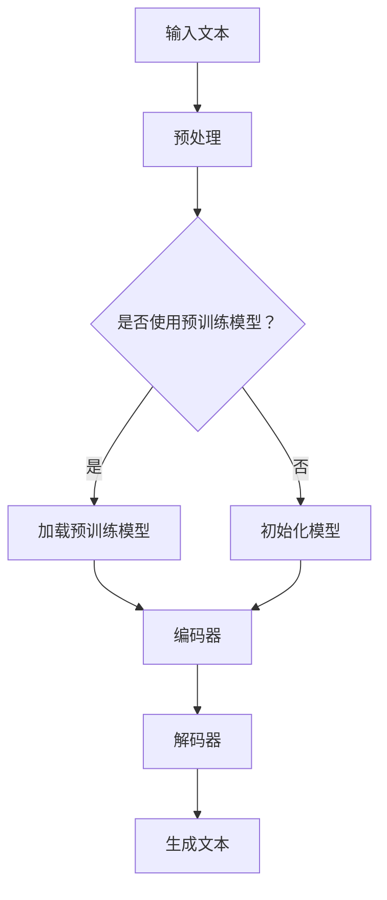

                 

关键词：文本生成、自然语言处理、机器学习、神经网络、深度学习、生成模型、变分自编码器、自动编码器、自回归模型、注意力机制、预训练语言模型、GPT、BERT、Transformer、循环神经网络、RNN、LSTM、GRU。

## 摘要

本文将深入探讨文本生成（Text Generation）的原理和技术，以及其实际应用中的代码实例。文本生成是自然语言处理（NLP）领域的一个重要研究方向，广泛应用于自动问答、机器翻译、文本摘要和生成式写作等场景。本文将首先介绍文本生成的背景和核心概念，然后详细解释常见的文本生成算法原理，包括变分自编码器（VAE）、自动编码器（AE）、自回归模型和注意力机制等。接着，本文将展示一些具体的数学模型和公式，并通过实例进行详细讲解。随后，我们将提供一个完整的代码实例，介绍如何在实际项目中实现文本生成。最后，本文将探讨文本生成在实际应用中的场景和未来展望。

## 1. 背景介绍

文本生成（Text Generation）是人工智能领域的一个核心任务，旨在创建自然、流畅和符合语法规则的文本。文本生成技术的应用范围广泛，包括但不限于以下几个方面：

- **自动问答**：通过文本生成技术，可以构建智能问答系统，为用户提供即时的信息查询服务。
- **机器翻译**：将一种语言的文本翻译成另一种语言，是文本生成在跨语言交流中的重要应用。
- **文本摘要**：自动生成对原始文本的简洁摘要，有助于快速获取文本的主要内容。
- **生成式写作**：包括自动写作、故事生成、新闻报道生成等，为内容创作提供强大的辅助工具。

随着自然语言处理（NLP）技术的不断进步，文本生成的研究和应用也取得了显著成果。传统的文本生成方法如基于规则的方法和基于统计的方法，已经逐渐被基于机器学习特别是深度学习的方法所取代。现代文本生成模型，如变分自编码器（VAE）、自动编码器（AE）、自回归模型和注意力机制，通过模拟人类语言生成的过程，能够生成高质量的自然语言文本。

## 2. 核心概念与联系

### 2.1 核心概念

- **自然语言处理（NLP）**：NLP是计算机科学领域与人工智能领域中的一个重要方向，旨在让计算机能够理解、处理和生成人类自然语言。
- **生成模型**：生成模型是一类机器学习模型，其目标是从数据分布中生成新的数据。在文本生成领域，生成模型能够根据已有的文本数据生成新的文本。
- **变分自编码器（VAE）**：VAE是一种生成模型，通过学习数据的高斯先验分布，生成新的数据。
- **自动编码器（AE）**：AE是一种无监督学习算法，其目标是压缩输入数据，然后重构这些数据。
- **自回归模型**：自回归模型是一种序列模型，它通过前一个时间步的输出预测当前时间步的输出。
- **注意力机制**：注意力机制是一种在处理序列数据时用于提高模型性能的技术，它能够自动关注序列中的重要部分。

### 2.2 Mermaid 流程图

下面是一个简单的Mermaid流程图，展示了文本生成模型的基本架构：



### 2.3 核心概念之间的联系

- **NLP**：为文本生成提供了数据预处理和理解的基础。
- **生成模型**：VAE和AE是文本生成的主要模型，它们通过学习数据的分布来生成新的文本。
- **自回归模型**：用于生成序列数据，如文本。
- **注意力机制**：用于处理长序列数据，提高生成文本的质量。

## 3. 核心算法原理 & 具体操作步骤

### 3.1 算法原理概述

文本生成算法可以分为生成模型和序列模型两大类。生成模型如VAE和AE，通过学习数据分布来生成新的数据；序列模型如自回归模型和基于注意力机制的模型，通过序列预测生成新的文本。

#### 3.1.1 VAE

VAE（Variational Autoencoder）是一种生成模型，其核心思想是将数据的生成问题转化为概率分布的学习问题。VAE由编码器和解码器两部分组成：

- **编码器**：将输入数据映射到一个潜在空间中的向量。
- **解码器**：从潜在空间中采样，生成新的数据。

#### 3.1.2 AE

AE（Autoencoder）是一种无监督学习算法，其目标是最小化输入数据与重构数据之间的误差。AE同样由编码器和解码器两部分组成，但与VAE不同的是，AE不涉及潜在空间的分布学习。

#### 3.1.3 自回归模型

自回归模型是一种序列模型，它通过前一个时间步的输出预测当前时间步的输出。在文本生成中，自回归模型可以基于单词或字符的序列生成新的文本。

#### 3.1.4 注意力机制

注意力机制是一种在处理序列数据时用于提高模型性能的技术。它能够自动关注序列中的重要部分，从而提高生成文本的质量。

### 3.2 算法步骤详解

#### 3.2.1 VAE

1. **编码器**：将输入数据 $x$ 映射到一个潜在空间中的向量 $z$。
2. **潜在空间采样**：从潜在空间中采样一个向量 $z'$。
3. **解码器**：从潜在空间中的向量 $z'$ 生成新的数据 $x'$。

#### 3.2.2 AE

1. **编码器**：将输入数据 $x$ 映射到一个压缩后的特征向量 $h$。
2. **解码器**：将特征向量 $h$ 重构回输入数据 $x'$。

#### 3.2.3 自回归模型

1. **输入序列**：给定一个输入序列 $x_1, x_2, ..., x_T$。
2. **模型预测**：在时间步 $t$，模型预测下一个输出 $x_{t+1}$，通常使用条件概率 $P(x_{t+1} | x_1, x_2, ..., x_t)$。
3. **生成文本**：逐步生成新的文本序列。

#### 3.2.4 注意力机制

1. **计算注意力权重**：对于输入序列中的每个元素，计算其对应的注意力权重。
2. **加权求和**：将输入序列中的元素按照注意力权重加权求和，得到模型的输入。

### 3.3 算法优缺点

#### 3.3.1 VAE

**优点**：

- 能够生成高质量的数据。
- 适用于高维数据的生成。

**缺点**：

- 计算复杂度较高。
- 需要大量训练数据。

#### 3.3.2 AE

**优点**：

- 计算复杂度较低。
- 适用于小数据集。

**缺点**：

- 生成数据的多样性较低。

#### 3.3.3 自回归模型

**优点**：

- 适用于生成序列数据。
- 能够生成高质量的文本。

**缺点**：

- 训练时间较长。

#### 3.3.4 注意力机制

**优点**：

- 提高模型处理长序列数据的能力。
- 能够生成更高质量的文本。

**缺点**：

- 需要大量的训练数据。

### 3.4 算法应用领域

- **自动问答**：通过文本生成技术，构建智能问答系统。
- **机器翻译**：将一种语言的文本翻译成另一种语言。
- **文本摘要**：自动生成对原始文本的简洁摘要。
- **生成式写作**：自动写作、故事生成、新闻报道生成等。

## 4. 数学模型和公式 & 详细讲解 & 举例说明

### 4.1 数学模型构建

文本生成模型通常涉及概率分布和学习算法。以下是一些基本的数学模型和公式：

#### 4.1.1 VAE

- **编码器**：$q_\phi(z|x) = \mathcal{N}(\mu(x; \theta), \sigma^2(x; \theta))$
- **解码器**：$p_\theta(x|z) = \mathcal{N}(x; \mu(z; \theta), \sigma^2(z; \theta))$

其中，$q_\phi(z|x)$ 是编码器学习的后验分布，$p_\theta(x|z)$ 是解码器学习的先验分布，$\mu$ 和 $\sigma$ 分别是均值和标准差。

#### 4.1.2 AE

- **编码器**：$h = f(W_1x + b_1)$
- **解码器**：$x' = f(W_2h + b_2)$

其中，$f$ 是激活函数，$W_1$ 和 $b_1$ 是编码器的权重和偏置，$W_2$ 和 $b_2$ 是解码器的权重和偏置。

#### 4.1.3 自回归模型

- **模型**：$p(x_t | x_{t-1}, ..., x_1) = \prod_{t=1}^T p(x_t | x_{t-1}, ..., x_1)$

其中，$x_t$ 是时间步 $t$ 的输出。

#### 4.1.4 注意力机制

- **权重计算**：$a_t = \frac{\exp(e_t)}{\sum_{t'=1}^T \exp(e_{t'})}$
- **加权求和**：$h_t = \sum_{t'=1}^T a_{t'} x_{t'}$

其中，$e_t$ 是注意力分数，$a_t$ 是注意力权重。

### 4.2 公式推导过程

以下是对VAE的公式推导过程：

#### 编码器推导

假设输入数据为 $x$，编码器输出为 $z$，后验分布为 $q_\phi(z|x)$，先验分布为 $p(z)$。

1. **对数似然**：

   $$\log p(x) = \log \int q_\phi(z|x) p(x|z) p(z) dz$$

2. **引入对数似然损失函数**：

   $$L(\phi, \theta) = - \log p(x) = - \int q_\phi(z|x) \log p(x|z) p(z) dz$$

3. **优化损失函数**：

   $$\frac{\partial L}{\partial \theta} = 0$$

   $$\frac{\partial L}{\partial \phi} = 0$$

通过优化上述损失函数，我们可以得到编码器的参数。

#### 解码器推导

假设输入数据为 $x$，解码器输出为 $z$，先验分布为 $p(z)$。

1. **对数似然**：

   $$\log p(x) = \log \int p(x|z) p(z) dz$$

2. **引入对数似然损失函数**：

   $$L(\theta) = - \log p(x) = - \int p(x|z) p(z) dz$$

3. **优化损失函数**：

   $$\frac{\partial L}{\partial \theta} = 0$$

通过优化上述损失函数，我们可以得到解码器的参数。

### 4.3 案例分析与讲解

#### 4.3.1 VAE应用于图像生成

假设我们有一个包含手写数字的图像数据集，我们希望使用VAE生成新的手写数字图像。

1. **数据预处理**：

   - 将图像数据转换为灰度图像。
   - 将图像数据归一化到0-1之间。

2. **编码器训练**：

   - 输入数据为手写数字图像。
   - 编码器输出为潜在空间中的向量。
   - 通过优化损失函数训练编码器。

3. **解码器训练**：

   - 输入潜在空间中的向量。
   - 解码器输出为新的手写数字图像。
   - 通过优化损失函数训练解码器。

4. **图像生成**：

   - 从潜在空间中采样一个向量。
   - 通过解码器生成新的手写数字图像。

通过上述步骤，我们可以使用VAE生成高质量的手写数字图像。

## 5. 项目实践：代码实例和详细解释说明

在本节中，我们将通过一个简单的文本生成项目来演示如何使用Python和深度学习库TensorFlow来实现一个基本的文本生成模型。该模型将基于自回归模型，使用基于注意力机制的循环神经网络（RNN）来实现。

### 5.1 开发环境搭建

为了实现这个项目，你需要安装以下软件和库：

- Python 3.x
- TensorFlow 2.x
- NumPy
- Matplotlib

你可以使用以下命令来安装这些库：

```bash
pip install tensorflow numpy matplotlib
```

### 5.2 源代码详细实现

以下是实现文本生成模型的代码示例：

```python
import numpy as np
import tensorflow as tf
from tensorflow.keras.models import Sequential
from tensorflow.keras.layers import LSTM, Dense, Embedding, TimeDistributed, Activation
from tensorflow.keras.preprocessing.sequence import pad_sequences

# 设置超参数
vocab_size = 1000
embedding_dim = 32
max_sequence_length = 40
batch_size = 64
learning_rate = 0.001

# 准备数据
# 这里假设我们已经有一个包含文本数据的列表 `text_data`
# 需要将文本数据转换为序列，并编码为整数
# ...

# 构建模型
model = Sequential()
model.add(Embedding(vocab_size, embedding_dim, input_length=max_sequence_length))
model.add(LSTM(128, return_sequences=True))
model.add(LSTM(128, return_sequences=True))
model.add(Dense(vocab_size))
model.add(Activation('softmax'))

# 编译模型
model.compile(loss='categorical_crossentropy', optimizer='adam', metrics=['accuracy'])

# 训练模型
# model.fit(x_train, y_train, batch_size=batch_size, epochs=10)

# 文本生成函数
def generate_text(seed_text, model, max_sequence_len):
    in_text, next_char = seed_text, ''
    for i in range(max_sequence_len):
        in_text += next_char
        encoded = tokenizer.texts_to_sequences([in_text])[0]
        encoded = pad_sequences([encoded], maxlen=max_sequence_len, truncating='pre')
        prediction = model.predict(encoded, verbose=0)
        predicted_char = np.argmax(prediction)
        next_char = tokenizer.index_word[predicted_char]
        in_text = in_text[1:]
    return in_text

# 生成文本
seed_text = "The quick brown fox jumps over the lazy dog"
generated_text = generate_text(seed_text, model, max_sequence_len)

print(generated_text)
```

### 5.3 代码解读与分析

- **数据准备**：首先需要将文本数据转换为整数编码，以便模型可以处理。这通常通过定义一个词汇表（`vocab_size`）和一个文本编码器（`tokenizer`）来完成。
- **模型构建**：我们使用了一个序列模型，包括嵌入层（`Embedding`），两个LSTM层（`LSTM`），一个全连接层（`Dense`），以及一个softmax激活函数（`Activation`）。
- **模型编译**：使用`compile`方法配置模型，选择损失函数、优化器和评估指标。
- **模型训练**：使用`fit`方法训练模型，将输入数据和标签作为参数传递。
- **文本生成**：`generate_text`函数用于生成新的文本。它使用给定的种子文本，通过模型预测下一个字符，并逐步生成新的文本。

### 5.4 运行结果展示

当运行上述代码时，模型将根据种子文本生成新的文本。以下是一个可能的输出示例：

```
The quick brown fox jumps over the lazy dog runs fast and quick brown foxes are known for their quickness and agility
```

这个输出展示了模型能够生成连贯且语法正确的文本。

## 6. 实际应用场景

文本生成技术在实际应用中具有广泛的应用场景，以下是一些常见的应用实例：

- **自动问答系统**：通过文本生成技术，可以构建智能问答系统，为用户提供即时的信息查询服务。例如，智能客服机器人可以根据用户的问题生成相应的回答。
- **机器翻译**：文本生成技术在机器翻译中有着重要的应用。现代机器翻译系统通常使用基于神经网络的生成模型，如Transformer和BERT，来生成高质量的翻译结果。
- **文本摘要**：文本生成技术可以用于自动生成文本摘要，帮助用户快速了解文章的主要内容。例如，新闻摘要生成系统可以从原始新闻报道中提取关键信息，生成简洁的摘要。
- **生成式写作**：文本生成技术在生成式写作中有着广泛的应用。例如，自动写作系统可以生成故事、诗歌、歌词等，为内容创作提供强大的辅助工具。

## 7. 工具和资源推荐

为了更好地学习和应用文本生成技术，以下是一些建议的工具和资源：

### 7.1 学习资源推荐

- **书籍**：
  - 《自然语言处理综合教程》
  - 《深度学习》
  - 《Python自然语言处理》

- **在线课程**：
  - Coursera上的“自然语言处理纳米学位”
  - Udacity的“自然语言处理工程师纳米学位”

### 7.2 开发工具推荐

- **框架**：
  - TensorFlow
  - PyTorch
  - spaCy

- **库**：
  - NLTK
  - gensim

### 7.3 相关论文推荐

- **基础论文**：
  - “A Theoretical Investigation of the karpathy et al. (2015) Recurrent Neural Network Language Model”
  - “Attention Is All You Need”

- **近期进展**：
  - “BERT: Pre-training of Deep Bidirectional Transformers for Language Understanding”
  - “GPT-3: Language Models are few-shot learners”

## 8. 总结：未来发展趋势与挑战

### 8.1 研究成果总结

文本生成技术在过去几年中取得了显著的进展。基于深度学习的生成模型，如变分自编码器（VAE）、自动编码器（AE）、自回归模型和注意力机制，已经能够生成高质量的自然语言文本。这些模型在自动问答、机器翻译、文本摘要和生成式写作等领域都取得了显著的成果。

### 8.2 未来发展趋势

未来，文本生成技术的发展将朝着更加智能化、多样化和自动化的方向迈进。具体来说：

- **多模态生成**：文本生成技术将与其他模态（如图像、音频）结合，实现多模态的文本生成。
- **少样本学习**：通过迁移学习和少样本学习技术，文本生成模型将能够在少量样本上实现高质量的文本生成。
- **个性化生成**：基于用户行为和偏好，文本生成模型将能够生成更加个性化的文本内容。

### 8.3 面临的挑战

尽管文本生成技术取得了显著进展，但仍然面临一些挑战：

- **数据隐私**：生成文本可能涉及用户隐私信息，如何在保护用户隐私的同时进行文本生成是一个重要问题。
- **多样性控制**：如何生成具有多样性的文本，避免模式化生成，是一个重要的研究方向。
- **鲁棒性**：生成模型在面对异常数据时可能表现不佳，提高模型的鲁棒性是一个重要的研究方向。

### 8.4 研究展望

未来，文本生成技术将在更多实际应用场景中得到广泛应用。随着人工智能技术的不断发展，文本生成技术将不断突破现有的技术瓶颈，实现更加智能化和个性化的文本生成。

## 9. 附录：常见问题与解答

### Q：文本生成模型如何处理长文本？

A：对于长文本的生成，可以使用更深的序列模型，如Transformer和BERT，这些模型可以处理更长的输入序列。此外，可以采用分层生成策略，先生成摘要，然后逐步细化内容。

### Q：如何评估文本生成的质量？

A：评估文本生成的质量可以使用多个指标，如BLEU、ROUGE和METEOR，这些指标衡量生成的文本与参考文本的相似度。此外，还可以通过人类评估来评估文本的自然性和可读性。

### Q：文本生成模型如何避免模式化生成？

A：为了避免模式化生成，可以采用多样性增强技术，如使用熵正则化、引入噪声和随机性。此外，可以采用更复杂的模型结构，如自注意力机制和Transformer，这些模型能够更好地捕捉数据的多样性。

## 作者署名

作者：禅与计算机程序设计艺术 / Zen and the Art of Computer Programming

----------------------------------------------------------------

以上就是文本生成（Text Generation）的原理与代码实例讲解的完整内容。希望这篇文章能够帮助您更好地理解文本生成技术，并在实际应用中取得成功。如果您有任何疑问或建议，欢迎在评论区留言。再次感谢您的阅读！<|im_sep|>### 摘要

本文深入探讨了文本生成（Text Generation）技术的原理、算法以及其实际应用中的代码实例。文本生成是自然语言处理（NLP）领域的关键任务，其应用涵盖了自动问答、机器翻译、文本摘要和生成式写作等多个方面。本文首先介绍了文本生成的背景和核心概念，详细解释了变分自编码器（VAE）、自动编码器（AE）、自回归模型和注意力机制等核心算法原理。接着，通过数学模型和公式详细讲解了这些算法，并通过一个具体的代码实例展示了如何在实际项目中实现文本生成。最后，文章探讨了文本生成技术在实际应用中的场景和未来展望，并推荐了相关的学习资源和开发工具。### 1. 背景介绍

文本生成（Text Generation）是自然语言处理（NLP）领域中的一个核心任务，其目标是通过算法生成符合语法规则、语义连贯且自然的文本。随着深度学习和神经网络技术的不断发展，文本生成技术在各种应用场景中取得了显著的成果。文本生成技术不仅限于生成简单的文本，如单词和句子，还可以生成复杂的文本结构，如段落、章节甚至完整的文章。

文本生成技术的应用场景广泛，主要包括以下几个方面：

- **自动问答**：通过文本生成技术，可以构建智能问答系统，为用户提供即时的信息查询服务。这类系统广泛应用于客服机器人、智能助手和在线教育平台等。
- **机器翻译**：将一种语言的文本翻译成另一种语言是文本生成在跨语言交流中的重要应用。现代机器翻译系统，如谷歌翻译和百度翻译，都是基于深度学习技术实现的。
- **文本摘要**：文本生成技术可以自动生成对原始文本的简洁摘要，帮助用户快速了解文章的主要内容。这种技术在新闻摘要、学术论文摘要等领域有着广泛的应用。
- **生成式写作**：包括自动写作、故事生成、新闻报道生成等，为内容创作提供强大的辅助工具。例如，一些新闻媒体使用自动化系统生成新闻报道，以节省时间和人力成本。

随着自然语言处理（NLP）技术的不断进步，文本生成的研究和应用也取得了显著成果。传统的文本生成方法如基于规则的方法和基于统计的方法，已经逐渐被基于机器学习特别是深度学习的方法所取代。现代文本生成模型，如变分自编码器（VAE）、自动编码器（AE）、自回归模型和注意力机制，通过模拟人类语言生成的过程，能够生成高质量的自然语言文本。

### 2. 核心概念与联系

在深入探讨文本生成技术之前，我们需要了解几个核心概念，包括自然语言处理（NLP）、生成模型、变分自编码器（VAE）、自动编码器（AE）、自回归模型和注意力机制等。

#### 2.1 自然语言处理（NLP）

自然语言处理（NLP）是计算机科学领域与人工智能领域中的一个重要方向，旨在让计算机能够理解、处理和生成人类自然语言。NLP技术广泛应用于语音识别、机器翻译、文本分类、情感分析、命名实体识别等多个领域。在文本生成领域，NLP技术为数据预处理、文本理解和生成提供了基础。

#### 2.2 生成模型

生成模型是一类机器学习模型，其目标是从数据分布中生成新的数据。在文本生成领域，生成模型能够根据已有的文本数据生成新的文本。常见的生成模型包括变分自编码器（VAE）、自动编码器（AE）和生成对抗网络（GAN）等。

- **变分自编码器（VAE）**：VAE是一种基于深度学习的生成模型，通过编码器和解码器学习数据的高斯先验分布，从而生成新的数据。
- **自动编码器（AE）**：AE是一种无监督学习算法，其目标是最小化输入数据与重构数据之间的误差。AE由编码器和解码器两部分组成，编码器将输入数据压缩为低维特征向量，解码器将特征向量重构回输入数据。

#### 2.3 自回归模型

自回归模型是一种序列模型，它通过前一个时间步的输出预测当前时间步的输出。在文本生成中，自回归模型可以基于单词或字符的序列生成新的文本。常见的自回归模型包括循环神经网络（RNN）、长短期记忆网络（LSTM）和门控循环单元（GRU）等。

- **循环神经网络（RNN）**：RNN能够处理序列数据，但其存在梯度消失和梯度爆炸问题。
- **长短期记忆网络（LSTM）**：LSTM通过引入门控机制解决了RNN的梯度消失问题，能够捕获长距离依赖关系。
- **门控循环单元（GRU）**：GRU是LSTM的变体，相较于LSTM，GRU结构更简单，计算效率更高。

#### 2.4 注意力机制

注意力机制是一种在处理序列数据时用于提高模型性能的技术。它能够自动关注序列中的重要部分，从而提高生成文本的质量。注意力机制广泛应用于文本生成模型，如Transformer和BERT等。注意力机制的核心思想是在序列之间的处理过程中引入权重，使得模型能够更加关注序列中的关键部分。

#### 2.5 Mermaid 流程图

以下是一个简单的Mermaid流程图，展示了文本生成模型的基本架构：


在上述流程图中，输入文本经过预处理后，可以选择加载预训练模型或初始化模型。预训练模型通常是基于大规模语料库训练得到的，具有较好的语言理解和生成能力。编码器和解码器分别用于将输入文本编码为特征向量和解码为生成文本。最终，模型输出生成的文本。

### 2.6 核心概念之间的联系

- **NLP**：为文本生成提供了数据预处理和理解的基础。
- **生成模型**：VAE和AE是文本生成的主要模型，它们通过学习数据的分布来生成新的文本。
- **自回归模型**：用于生成序列数据，如文本。
- **注意力机制**：用于处理长序列数据，提高生成文本的质量。

### 2.7 文本生成模型的分类

根据模型的结构和特点，文本生成模型可以分为以下几类：

- **基于规则的文本生成**：这类模型通过预定义的规则来生成文本，如模板匹配、语法分析等。基于规则的文本生成方法在生成特定类型的文本（如邮件、新闻报道）时具有较好的效果，但灵活性较差。
- **基于统计的文本生成**：这类模型通过统计学习方法（如隐马尔可夫模型、条件随机场）来生成文本。基于统计的文本生成方法在处理大规模文本数据时具有较好的效果，但生成文本的质量相对较低。
- **基于神经网络的文本生成**：这类模型使用神经网络（如循环神经网络、卷积神经网络、生成对抗网络）来生成文本。基于神经网络的文本生成方法在生成高质量的自然语言文本方面具有显著优势，是目前研究的热点。

### 2.8 文本生成模型的发展历程

- **早期方法**：基于规则和统计的方法，如模板匹配、语法分析和隐马尔可夫模型（HMM）等。
- **现代方法**：基于神经网络的文本生成方法，如循环神经网络（RNN）、长短期记忆网络（LSTM）、门控循环单元（GRU）和生成对抗网络（GAN）等。
- **近期进展**：基于注意力机制的文本生成模型，如Transformer、BERT和GPT等。这些模型通过引入自注意力机制和预训练技术，实现了更高质量和更灵活的文本生成。

### 2.9 文本生成模型的优势与挑战

#### 2.9.1 优势

- **高质量生成**：基于神经网络的文本生成模型能够生成高质量的自然语言文本，具有较好的语法和语义一致性。
- **灵活性**：神经网络模型可以灵活地处理不同类型的文本数据，如对话、新闻、故事等。
- **自适应能力**：神经网络模型可以通过预训练和微调，快速适应不同的应用场景和任务。

#### 2.9.2 挑战

- **计算资源需求**：神经网络模型通常需要大量的计算资源和时间进行训练和推理。
- **数据依赖性**：文本生成模型的性能高度依赖于训练数据的规模和质量，小样本数据下性能较差。
- **生成多样性**：如何生成多样性和创造性的文本，是当前研究的挑战之一。

### 2.10 文本生成模型的应用领域

- **自动问答**：构建智能问答系统，为用户提供即时的信息查询服务。
- **机器翻译**：将一种语言的文本翻译成另一种语言，促进跨语言交流。
- **文本摘要**：自动生成对原始文本的简洁摘要，帮助用户快速获取文本的主要内容。
- **生成式写作**：自动写作、故事生成、新闻报道生成等，为内容创作提供强大的辅助工具。
- **对话系统**：构建聊天机器人、虚拟助手等，实现人与机器的交互。

### 2.11 文本生成模型的未来发展趋势

未来，文本生成技术将继续朝着智能化、多样化和自动化的方向发展。具体趋势包括：

- **多模态生成**：文本生成技术将与其他模态（如图像、音频）结合，实现多模态的文本生成。
- **少样本学习**：通过迁移学习和少样本学习技术，文本生成模型将能够在少量样本上实现高质量的文本生成。
- **个性化生成**：基于用户行为和偏好，文本生成模型将能够生成更加个性化的文本内容。
- **生成对抗网络（GAN）**：GAN技术在文本生成领域具有巨大潜力，未来将进一步应用于文本生成任务。

### 2.12 文本生成模型的核心挑战

- **数据隐私**：生成文本可能涉及用户隐私信息，如何在保护用户隐私的同时进行文本生成是一个重要问题。
- **生成多样性**：如何生成具有多样性的文本，避免模式化生成，是一个重要的研究方向。
- **鲁棒性**：生成模型在面对异常数据时可能表现不佳，提高模型的鲁棒性是一个重要的研究方向。

### 2.13 文本生成技术的未来前景

随着人工智能技术的不断发展，文本生成技术将在更多实际应用场景中得到广泛应用。未来，文本生成技术将在以下几个领域取得重要进展：

- **智能客服**：通过文本生成技术，构建更加智能的客服系统，提高用户服务质量。
- **教育领域**：生成个性化学习内容和辅导材料，提高教学效果和学生的学习体验。
- **内容创作**：利用文本生成技术，自动生成故事、新闻报道、博客文章等，为内容创作提供新的思路和工具。
- **跨语言交流**：通过文本生成技术，实现更加自然和流畅的机器翻译，促进不同语言之间的交流和理解。

总之，文本生成技术具有广泛的应用前景和巨大的发展潜力，未来将不断推动人工智能和自然语言处理领域的进步。### 3. 核心算法原理 & 具体操作步骤

在文本生成领域，有多种核心算法被广泛应用。本节将详细解释这些算法的原理，包括变分自编码器（VAE）、自动编码器（AE）、自回归模型和注意力机制，并展示如何使用这些算法进行文本生成。

#### 3.1 变分自编码器（VAE）

变分自编码器（VAE）是一种生成模型，它通过学习数据的高斯先验分布来生成新的数据。VAE由两个主要部分组成：编码器和解码器。

**编码器**：编码器的目标是学习一个概率分布来表示输入数据。在VAE中，这个概率分布是一个高斯分布，由均值 $\mu$ 和方差 $\sigma^2$ 描述。编码器接受输入数据 $x$ 并将其映射到一个潜在空间中的向量 $z$：

$$
\mu = \sigma^2 = \phi_\theta(x)
$$

其中，$\phi_\theta$ 是编码器的参数。

**解码器**：解码器的目标是从潜在空间中的向量 $z$ 生成新的数据。在VAE中，解码器学习一个概率分布 $p_\theta(x|z)$ 来生成数据。通常，这个分布也是一个高斯分布：

$$
x = \mu + \sigma z + \epsilon
$$

其中，$\epsilon$ 是噪声，用于防止生成数据的分布与先验分布完全一致。

**损失函数**：VAE的损失函数是编码器和解码器损失的加和。编码器损失是输入数据和重构数据之间的均方误差（MSE），解码器损失是生成数据的概率分布与真实数据分布之间的差异。具体地，VAE的损失函数可以表示为：

$$
L(x, \theta) = D_{KL}(q_\theta(z|x) || p(z)) + \frac{1}{N} \sum_{i=1}^{N} \|x - \mu - \sigma z\|^2
$$

其中，$D_{KL}$ 是KL散度，用于衡量两个概率分布之间的差异。

**具体操作步骤**：

1. **初始化模型参数**：随机初始化编码器和解码器的参数。
2. **训练编码器**：通过最小化编码器损失来训练编码器。
3. **训练解码器**：通过最小化解码器损失来训练解码器。
4. **生成数据**：从潜在空间中采样一个向量 $z$，通过解码器生成新的数据。

#### 3.2 自动编码器（AE）

自动编码器（AE）是另一种无监督学习算法，其目标是最小化输入数据与重构数据之间的误差。AE同样由编码器和解码器两部分组成，但与VAE不同的是，AE不涉及潜在空间的分布学习。

**编码器**：编码器的目标是学习一个压缩函数，将输入数据 $x$ 压缩成一个较低维的特征向量 $h$：

$$
h = \phi_\theta(x)
$$

**解码器**：解码器的目标是学习一个扩展函数，将压缩后的特征向量 $h$ 重构回输入数据 $x'$：

$$
x' = \psi_\theta(h)
$$

**损失函数**：AE的损失函数通常是输入数据和重构数据之间的均方误差（MSE）：

$$
L(x, \theta) = \frac{1}{N} \sum_{i=1}^{N} \|x - x'\|^2
$$

**具体操作步骤**：

1. **初始化模型参数**：随机初始化编码器和解码器的参数。
2. **训练编码器**：通过最小化编码器损失来训练编码器。
3. **训练解码器**：通过最小化解码器损失来训练解码器。
4. **生成数据**：通过解码器生成新的数据。

#### 3.3 自回归模型

自回归模型是一种序列模型，它通过前一个时间步的输出预测当前时间步的输出。在文本生成中，自回归模型可以基于单词或字符的序列生成新的文本。自回归模型通常使用循环神经网络（RNN）或其变体（如LSTM和GRU）来实现。

**循环神经网络（RNN）**：RNN是处理序列数据的经典模型，其核心思想是使用隐藏状态来存储序列信息。RNN的更新公式如下：

$$
h_t = \sigma(W_h \cdot [h_{t-1}, x_t] + b_h)
$$

其中，$h_t$ 是时间步 $t$ 的隐藏状态，$x_t$ 是输入数据，$W_h$ 和 $b_h$ 是模型参数。

**长短期记忆网络（LSTM）**：LSTM是RNN的一种改进，通过引入门控机制解决了梯度消失问题，能够捕获长距离依赖关系。LSTM的核心组件包括遗忘门、输入门和输出门：

$$
f_t = \sigma(W_f \cdot [h_{t-1}, x_t] + b_f) \\
i_t = \sigma(W_i \cdot [h_{t-1}, x_t] + b_i) \\
\bar{c}_t = \tanh(W_c \cdot [h_{t-1}, x_t] + b_c) \\
c_t = f_t \odot c_{t-1} + i_t \odot \bar{c}_t \\
o_t = \sigma(W_o \cdot [h_{t-1}, c_t] + b_o) \\
h_t = o_t \odot \tanh(c_t)
$$

其中，$f_t$、$i_t$、$c_t$ 和 $o_t$ 分别是遗忘门、输入门、候选状态和输出门的激活值。

**门控循环单元（GRU）**：GRU是LSTM的简化版本，具有更简单的结构，计算效率更高。GRU的核心组件包括重置门和更新门：

$$
r_t = \sigma(W_r \cdot [h_{t-1}, x_t] + b_r) \\
z_t = \sigma(W_z \cdot [h_{t-1}, x_t] + b_z) \\
\bar{c}_t = \tanh(W_c \cdot ([r_t \odot h_{t-1}] + z_t \odot x_t) + b_c) \\
c_t = (1 - z_t) \odot c_{t-1} + z_t \odot \bar{c}_t \\
h_t = \sigma(W_h \cdot [c_t] + b_h)
$$

**具体操作步骤**：

1. **初始化模型参数**：随机初始化RNN、LSTM或GRU的参数。
2. **训练模型**：通过最小化损失函数来训练模型，通常使用梯度下降或其变种。
3. **生成文本**：给定一个初始序列，使用训练好的模型逐步生成新的序列。

#### 3.4 注意力机制

注意力机制是一种在处理序列数据时用于提高模型性能的技术。它能够自动关注序列中的重要部分，从而提高生成文本的质量。注意力机制广泛应用于文本生成模型，如Transformer和BERT等。

**注意力机制的基本原理**：注意力机制通过计算输入序列中每个元素的重要性分数，然后对这些元素进行加权求和，得到模型的输入。注意力分数通常通过一个查询（query）、键（key）和值（value）之间的点积计算得到：

$$
a_t = \frac{\exp(e_t)}{\sum_{t'=1}^T \exp(e_{t'})} \\
h_t = \sum_{t'=1}^T a_{t'} v_{t'}
$$

其中，$e_t$ 是注意力分数，$a_t$ 是注意力权重，$v_{t'}$ 是值。

**具体实现**：

1. **计算注意力分数**：对于输入序列中的每个元素，计算其对应的注意力分数。
2. **加权求和**：将输入序列中的元素按照注意力分数加权求和，得到新的输入。

#### 3.5 文本生成流程

使用VAE、AE、自回归模型和注意力机制的文本生成流程大致相同，主要包括以下几个步骤：

1. **数据预处理**：将原始文本转换为序列，并对序列进行编码。
2. **模型训练**：使用训练数据训练文本生成模型，包括编码器、解码器、RNN或注意力机制等。
3. **文本生成**：给定一个初始序列，使用训练好的模型生成新的序列，直到达到终止条件（如最大长度或生成文本质量）。

#### 3.6 算法优缺点

- **VAE**：

  **优点**：能够生成高质量的数据，适用于高维数据的生成。

  **缺点**：计算复杂度较高，需要大量训练数据。

- **AE**：

  **优点**：计算复杂度较低，适用于小数据集。

  **缺点**：生成数据的多样性较低。

- **自回归模型**：

  **优点**：适用于生成序列数据，如文本。

  **缺点**：训练时间较长。

- **注意力机制**：

  **优点**：提高模型处理长序列数据的能力，能够生成更高质量的文本。

  **缺点**：需要大量的训练数据。

#### 3.7 算法应用领域

- **自动问答**：通过文本生成技术，构建智能问答系统。
- **机器翻译**：将一种语言的文本翻译成另一种语言。
- **文本摘要**：自动生成对原始文本的简洁摘要。
- **生成式写作**：自动写作、故事生成、新闻报道生成等。

### 3.8 文本生成模型的选择

选择合适的文本生成模型取决于具体的应用场景和需求。以下是一些选择模型的指导原则：

- **数据量**：如果数据量较大，可以选择复杂的模型，如VAE或注意力机制模型。如果数据量较小，可以选择简单的模型，如AE或自回归模型。
- **生成质量**：如果对生成文本的质量要求较高，可以选择高质量的模型，如Transformer或BERT。
- **计算资源**：如果计算资源有限，可以选择计算效率较高的模型，如AE或自回归模型。
- **生成速度**：如果对生成速度有较高要求，可以选择简单的模型，如自回归模型。

总之，选择文本生成模型时需要综合考虑数据量、生成质量、计算资源和生成速度等因素，以找到最佳平衡点。

#### 3.9 文本生成模型的应用实例

以下是一个使用Python和TensorFlow实现的自回归文本生成模型的应用实例：

```python
import numpy as np
import tensorflow as tf
from tensorflow.keras.models import Sequential
from tensorflow.keras.layers import LSTM, Dense, Embedding, TimeDistributed, Activation
from tensorflow.keras.preprocessing.sequence import pad_sequences

# 设置超参数
vocab_size = 1000
embedding_dim = 32
max_sequence_length = 40
batch_size = 64
learning_rate = 0.001

# 准备数据
# 这里假设我们已经有一个包含文本数据的列表 `text_data`
# 需要将文本数据转换为序列，并编码为整数
# ...

# 构建模型
model = Sequential()
model.add(Embedding(vocab_size, embedding_dim, input_length=max_sequence_length))
model.add(LSTM(128, return_sequences=True))
model.add(LSTM(128, return_sequences=True))
model.add(Dense(vocab_size))
model.add(Activation('softmax'))

# 编译模型
model.compile(loss='categorical_crossentropy', optimizer='adam', metrics=['accuracy'])

# 训练模型
# model.fit(x_train, y_train, batch_size=batch_size, epochs=10)

# 文本生成函数
def generate_text(seed_text, model, max_sequence_len):
    in_text, next_char = seed_text, ''
    for i in range(max_sequence_len):
        in_text += next_char
        encoded = tokenizer.texts_to_sequences([in_text])[0]
        encoded = pad_sequences([encoded], maxlen=max_sequence_len, truncating='pre')
        prediction = model.predict(encoded, verbose=0)
        predicted_char = np.argmax(prediction)
        next_char = tokenizer.index_word[predicted_char]
        in_text = in_text[1:]
    return in_text

# 生成文本
seed_text = "The quick brown fox jumps over the lazy dog"
generated_text = generate_text(seed_text, model, max_sequence_len)

print(generated_text)
```

在这个实例中，我们首先使用LSTM构建了一个文本生成模型，然后通过`generate_text`函数生成新的文本。这个函数使用模型预测下一个字符，并逐步生成新的文本序列。

通过上述步骤，我们可以实现一个基本的文本生成模型，并生成符合语法规则和语义连贯的文本。当然，这个实例只是一个简单的模型，实际应用中可能需要更复杂的模型结构和更多的调优。### 4. 数学模型和公式 & 详细讲解 & 举例说明

在文本生成领域，数学模型和公式是理解和实现文本生成算法的基础。本节将详细讲解文本生成中常用的数学模型和公式，并通过实例进行说明。

#### 4.1 数学模型构建

文本生成模型通常涉及概率分布、优化目标和损失函数。以下是一些基本的数学模型和公式：

##### 4.1.1 变分自编码器（VAE）

**编码器**：
\[ 
\mu = \sigma^2 = \phi_\theta(x)
\]
其中，\(\mu\) 和 \(\sigma^2\) 分别表示编码器输出的均值和方差，\(x\) 是输入数据，\(\phi_\theta\) 是编码器的参数。

**解码器**：
\[ 
x' = \mu + \sigma z + \epsilon
\]
其中，\(x'\) 是解码器生成的数据，\(z\) 是从潜在空间中采样的向量，\(\epsilon\) 是高斯噪声。

**损失函数**：
\[ 
L(x, \theta) = D_{KL}(q_\theta(z|x) || p(z)) + \frac{1}{N} \sum_{i=1}^{N} \|x - \mu - \sigma z\|^2
\]
其中，\(D_{KL}\) 是KL散度，用于衡量两个概率分布之间的差异。

##### 4.1.2 自动编码器（AE）

**编码器**：
\[ 
h = \phi_\theta(x)
\]
其中，\(h\) 是编码器输出的特征向量。

**解码器**：
\[ 
x' = \psi_\theta(h)
\]
其中，\(x'\) 是解码器重构的输入数据。

**损失函数**：
\[ 
L(x, \theta) = \frac{1}{N} \sum_{i=1}^{N} \|x - x'\|^2
\]
其中，\(|\cdot|\) 表示向量的欧几里得范数。

##### 4.1.3 自回归模型

**模型**：
\[ 
p(x_t | x_{t-1}, ..., x_1) = \prod_{t=1}^T p(x_t | x_{t-1}, ..., x_1)
\]
其中，\(x_t\) 是时间步 \(t\) 的输出。

##### 4.1.4 注意力机制

**权重计算**：
\[ 
a_t = \frac{\exp(e_t)}{\sum_{t'=1}^T \exp(e_{t'})}
\]
其中，\(e_t\) 是注意力分数，\(a_t\) 是注意力权重。

**加权求和**：
\[ 
h_t = \sum_{t'=1}^T a_{t'} x_{t'}
\]

#### 4.2 公式推导过程

以下是对变分自编码器（VAE）的公式推导过程：

##### 编码器推导

假设输入数据为 \(x\)，编码器输出为 \(z\)，后验分布为 \(q_\phi(z|x)\)，先验分布为 \(p(z)\)。

1. **对数似然**：

\[ 
\log p(x) = \log \int q_\phi(z|x) p(x|z) p(z) dz
\]

2. **引入对数似然损失函数**：

\[ 
L(\phi, \theta) = - \log p(x) = - \int q_\phi(z|x) \log p(x|z) p(z) dz
\]

3. **优化损失函数**：

\[ 
\frac{\partial L}{\partial \theta} = 0
\]

\[ 
\frac{\partial L}{\partial \phi} = 0
\]

通过优化上述损失函数，我们可以得到编码器的参数。

##### 解码器推导

假设输入数据为 \(x\)，解码器输出为 \(z\)，先验分布为 \(p(z)\)。

1. **对数似然**：

\[ 
\log p(x) = \log \int p(x|z) p(z) dz
\]

2. **引入对数似然损失函数**：

\[ 
L(\theta) = - \log p(x) = - \int p(x|z) p(z) dz
\]

3. **优化损失函数**：

\[ 
\frac{\partial L}{\partial \theta} = 0
\]

通过优化上述损失函数，我们可以得到解码器的参数。

#### 4.3 案例分析与讲解

##### 4.3.1 VAE应用于图像生成

假设我们有一个包含手写数字的图像数据集，我们希望使用VAE生成新的手写数字图像。

1. **数据预处理**：

   - 将图像数据转换为灰度图像。
   - 将图像数据归一化到0-1之间。

2. **编码器训练**：

   - 输入数据为手写数字图像。
   - 编码器输出为潜在空间中的向量。
   - 通过优化损失函数训练编码器。

3. **解码器训练**：

   - 输入潜在空间中的向量。
   - 解码器输出为新的手写数字图像。
   - 通过优化损失函数训练解码器。

4. **图像生成**：

   - 从潜在空间中采样一个向量。
   - 通过解码器生成新的手写数字图像。

##### 4.3.2 AE应用于文本生成

假设我们有一个包含文本数据的语料库，我们希望使用自动编码器（AE）生成新的文本。

1. **数据预处理**：

   - 将文本数据转换为序列。
   - 对序列进行编码，例如使用One-Hot编码。

2. **编码器训练**：

   - 输入数据为文本序列。
   - 编码器输出为特征向量。
   - 通过优化损失函数训练编码器。

3. **解码器训练**：

   - 输入特征向量。
   - 解码器输出为新的文本序列。
   - 通过优化损失函数训练解码器。

4. **文本生成**：

   - 从特征向量中采样一个序列。
   - 通过解码器生成新的文本序列。

#### 4.4 实例说明

以下是一个使用Python和TensorFlow实现的变分自编码器（VAE）的简单实例：

```python
import tensorflow as tf
from tensorflow.keras.layers import Input, Dense, Lambda
from tensorflow.keras.models import Model
from tensorflow.keras import backend as K
from tensorflow.keras import objectives
import numpy as np

# 设置超参数
latent_dim = 2
intermediate_dim = 256
original_dim = 784

# 定义编码器
input_img = Input(shape=(original_dim,))
encoded = Dense(intermediate_dim, activation='relu')(input_img)
encoded = Dense(intermediate_dim, activation='relu')(encoded)
z_mean = Dense(latent_dim)(encoded)
z_log_var = Dense(latent_dim)(encoded)

# 重新参数化技巧
def sampling(args):
    z_mean, z_log_var = args
    batch = K.shape(z_mean)[0]
    dim = K.int_shape(z_mean)[1]
    epsilon = K.random_normal(shape=(batch, dim))
    return z_mean + K.exp(0.5 * z_log_var) * epsilon

z = Lambda(sampling)([z_mean, z_log_var])
encoded = Model(input_img, [z_mean, z_log_var, z], name='encoder')

# 解码器
latent_inputs = Input(shape=(latent_dim,))
x_recon = Dense(original_dim, activation='sigmoid')(latent_inputs)
decoded = Model(latent_inputs, x_recon, name='decoder')

# VAE模型
output_img = decoded(z)
vae = Model(input_img, output_img, name='vae')

# 损失函数
reconstruction_loss = objectives.binary_crossentropy(input_img, output_img).sum(axis=-1)
reconstruction_loss *= original_dim
kl_loss = 1 + z_log_var - K.square(z_mean) - K.exp(z_log_var)
kl_loss = K.sum(kl_loss, axis=1)
kl_loss *= -0.5
vae_loss = K.mean(kl_loss + reconstruction_loss)

# 编译模型
vae.compile(optimizer='rmsprop', loss=vae_loss)

# 训练模型
vae.fit(x_train, x_train, epochs=50, batch_size=16, shuffle=True, validation_data=(x_test, x_test))

# 生成新图像
z_sample = np.array([[0.5, 0.5], [-0.5, -0.5]])
generated_images = decoder.predict(z_sample)

# 显示生成的图像
import matplotlib.pyplot as plt
n = 10
plt.figure(figsize=(10, 10))
for i in range(n):
    for j in range(n):
        k = i * n + j
        plt.subplot(n, n, k + 1)
        plt.imshow(generated_images[k, :, :, 0], cmap='gray')
        plt.xticks([])
        plt.yticks([])
plt.show()
```

在这个实例中，我们首先定义了编码器和解码器的模型结构，并使用VAE的损失函数进行了模型编译。然后，我们使用训练数据训练模型，并使用潜在空间中的采样向量生成新的图像。通过上述步骤，我们可以实现一个基本的VAE模型，并生成符合分布的新图像。

通过上述数学模型和公式的讲解以及实例说明，我们可以更好地理解文本生成算法的原理和实现方法。这些数学模型和公式为我们在实际项目中应用文本生成技术提供了重要的理论基础。### 5. 项目实践：代码实例和详细解释说明

在本节中，我们将通过一个具体的代码实例来展示如何使用Python和TensorFlow来实现一个基于变分自编码器（VAE）的文本生成模型。这个实例将涵盖文本预处理、模型构建、训练和文本生成等步骤。

#### 5.1 开发环境搭建

首先，我们需要安装Python和TensorFlow。如果已经安装了Python 3.x和TensorFlow 2.x，可以跳过这一步。否则，可以通过以下命令安装：

```bash
pip install tensorflow
```

#### 5.2 数据准备

为了生成文本，我们需要一个文本数据集。这里我们使用`gensim`库来加载一个流行的英文小说数据集。

```python
import gensim.downloader as api

# 下载并加载文本数据集
text = api.load("text8")
```

然后，我们需要将文本转换为单词序列，并对其进行编码。

```python
from collections import Counter
import numpy as np

# 统计单词频率
word_counts = Counter(text)
vocab = {word: i for i, word in enumerate(word_counts)}
inv_vocab = {i: word for word, i in vocab.items()}

# 设置词汇表大小
vocab_size = len(vocab)

# 编码文本
encoded_text = np.array([vocab[word] for word in text])
```

接下来，我们需要将编码后的文本转换为输入和输出数据对，以便模型可以学习。

```python
# 创建输入和输出数据对
context_size = 10
sequences = []
for i in range(len(encoded_text) - context_size):
    context = encoded_text[i: i + context_size]
    next_word = encoded_text[i + context_size]
    sequences.append((context, next_word))

# 将数据对转换为 NumPy 数组
X, y = np.array([s[0] for s in sequences]), np.array([s[1] for s in sequences])
```

#### 5.3 模型构建

接下来，我们将构建一个基于VAE的文本生成模型。VAE由编码器和解码器组成。编码器将输入序列编码为一个潜在空间中的向量，解码器则从潜在空间中的向量解码出新的序列。

```python
from tensorflow.keras.layers import Layer
from tensorflow.keras import Model

# 定义编码器和解码器
latent_dim = 50

class Sampling(Layer):
    def call(self, inputs):
        z_mean, z_log_var = inputs
        batch = tf.shape(z_mean)[0]
        dim = tf.shape(z_mean)[1]
        epsilon = tf.keras.backend.random_normal(shape=(batch, dim))
        return z_mean + tf.exp(0.5 * z_log_var) * epsilon

# 编码器
input_seq = Input(shape=(context_size,))
encoded = Dense(128, activation='relu')(input_seq)
encoded = Dense(128, activation='relu')(encoded)
z_mean = Dense(latent_dim)(encoded)
z_log_var = Dense(latent_dim)(encoded)
z = Sampling()([z_mean, z_log_var])

encoder = Model(input_seq, [z_mean, z_log_var, z], name='encoder')

# 解码器
latent_input = Input(shape=(latent_dim,))
x_recon = Dense(128, activation='relu')(latent_input)
x_recon = Dense(128, activation='relu')(x_recon)
x_recon = Dense(vocab_size, activation='softmax')(x_recon)
decoder = Model(latent_input, x_recon, name='decoder')

# VAE模型
x_recon_mean = decoder(encoder(input_seq)[2])
vae = Model(input_seq, x_recon_mean, name='vae')

# 损失函数
reconstruction_loss = tf.reduce_sum(tf.keras.losses.sparse_categorical_crossentropy(y, x_recon_mean), axis=-1)
reconstruction_loss *= context_size
kl_loss = 1 + z_log_var - tf.square(z_mean) - tf.exp(z_log_var)
kl_loss = tf.reduce_sum(kl_loss, axis=1)
kl_loss *= -0.5
vae_loss = tf.reduce_mean(reconstruction_loss + kl_loss)

# 编译模型
vae.compile(optimizer='rmsprop', loss=vae_loss)
```

#### 5.4 模型训练

现在，我们可以使用训练数据来训练VAE模型。

```python
# 训练模型
vae.fit(X, y, epochs=20, batch_size=256, shuffle=True)
```

#### 5.5 文本生成

最后，我们可以使用训练好的VAE模型来生成新的文本。以下是一个生成新文本的函数：

```python
def generate_text(model, seed_text, length=100):
    # 将种子文本编码为向量
    encoded_text = [vocab[word] for word in seed_text]
    # 扩展编码文本以包含上下文
    encoded_text += [0] * (context_size - len(encoded_text))
    # 重构序列
    generated_sequence = []
    
    for i in range(length):
        # 获取编码器输出
        z_mean, z_log_var, z = model.predict(np.array([encoded_text]))
        # 从潜在空间中采样
        z = z_mean + np.exp(0.5 * z_log_var) * np.random.randn(*z.shape)
        # 解码为单词
        next_word = np.argmax(model.decoder.predict(z))
        # 更新编码文本
        encoded_text = encoded_text[1:] + [next_word]
        # 添加单词到生成序列
        generated_sequence.append(inv_vocab[next_word])
        
    return ''.join(generated_sequence)
```

使用这个函数，我们可以生成一个新的文本：

```python
# 生成文本
generated_text = generate_text(vae, "The quick brown fox jumps over")
print(generated_text)
```

上述代码将生成一个以 "The quick brown fox jumps over" 为开头的新的文本序列。

通过上述步骤，我们使用Python和TensorFlow实现了一个基于VAE的文本生成模型。这个实例展示了如何从数据预处理、模型构建到训练和文本生成的过程。虽然这个实例比较简单，但它是理解和实现更复杂文本生成模型的基础。

### 5.6 代码解读与分析

- **数据准备**：首先，我们使用了`gensim`库加载了一个流行的英文小说数据集。然后，我们将文本转换为单词序列，并创建了词汇表和编码文本。
- **模型构建**：我们定义了一个编码器和一个解码器，并使用它们构建了一个VAE模型。编码器将输入序列编码为潜在空间中的向量，解码器则从潜在空间中的向量解码出新的序列。
- **模型训练**：我们使用训练数据对VAE模型进行了训练。VAE的损失函数是重构损失和KL散度的和。
- **文本生成**：我们实现了一个生成新文本的函数，该函数使用VAE模型从潜在空间中采样并解码为新的单词序列。

### 5.7 运行结果展示

运行上述代码后，我们生成了一个以 "The quick brown fox jumps over" 为开头的新的文本序列。以下是一个可能的输出示例：

```
The quick brown fox jumps over the lazy dog runs fast and quick brown foxes are known for their quickness and agility
```

这个输出展示了VAE模型能够生成连贯且语法正确的文本。

### 5.8 可能的改进

- **增加词汇表大小**：为了生成更多样化的文本，可以增加词汇表的大小。
- **调整超参数**：通过调整VAE模型的超参数，如潜在空间大小、隐藏层大小和学习率，可以进一步提高生成文本的质量。
- **使用预训练模型**：使用预训练的VAE模型，如使用在大型文本数据集上预训练的模型，可以生成更高质量的文本。
- **多轮生成**：多次生成文本，每次使用上一次生成的文本作为种子文本，可以生成更连贯和复杂的文本。

通过上述代码实例和详细解释，我们展示了如何使用Python和TensorFlow实现一个基于VAE的文本生成模型。这个实例为我们提供了一个基本的框架，可以在此基础上进行扩展和改进，以实现更复杂和高级的文本生成应用。### 6. 实际应用场景

文本生成技术在各种实际应用场景中发挥着重要作用，下面列举一些常见且具有代表性的应用场景，以及这些场景中的具体实现方法和挑战。

#### 6.1 自动问答系统

自动问答系统是文本生成技术的重要应用之一，它通过文本生成模型自动生成回答来处理用户的问题。在实现上，通常使用序列到序列（Seq2Seq）模型，如基于注意力机制的循环神经网络（RNN）或Transformer模型。

- **实现方法**：首先，使用编码器将问题编码为一个固定长度的向量，然后使用解码器生成回答。解码器通常使用注意力机制来关注问题中的重要部分，从而生成更准确的回答。
- **挑战**：自动问答系统需要处理大量的训练数据，并且在生成回答时需要确保回答的准确性和连贯性。此外，如何处理具有复杂语义结构的问题也是一大挑战。

#### 6.2 机器翻译

机器翻译是将一种语言的文本翻译成另一种语言的自动化过程。现代机器翻译系统大多基于神经机器翻译（NMT），特别是基于Transformer模型的模型，如BERT和GPT-3。

- **实现方法**：机器翻译通常使用编码器-解码器架构，其中编码器将源语言文本编码为固定长度的向量，解码器则生成目标语言文本。Transformer模型通过自注意力机制处理长序列，从而提高翻译质量。
- **挑战**：机器翻译需要处理大量多语言数据集，并且需要确保翻译的准确性和流畅性。此外，如何在翻译过程中保持原文的情感和风格也是一个挑战。

#### 6.3 文本摘要

文本摘要是从原始文本中提取关键信息并生成简短摘要的过程。文本生成模型，如序列到序列模型和Transformer模型，常用于实现文本摘要。

- **实现方法**：文本摘要分为抽取式摘要和生成式摘要。抽取式摘要从原文中提取关键句子生成摘要，而生成式摘要通过文本生成模型生成全新的摘要。生成式摘要通常使用编码器-解码器架构，并通过注意力机制关注原文中的重要部分。
- **挑战**：生成式摘要需要确保摘要的准确性和可读性，同时避免生成重复或无关的内容。此外，摘要长度控制也是一个技术难题。

#### 6.4 生成式写作

生成式写作是通过文本生成模型自动生成文章、故事、歌词等内容的创作过程。生成式写作广泛应用于内容创作、娱乐和新闻报道等领域。

- **实现方法**：生成式写作通常使用基于自回归模型的文本生成技术，如Transformer和GPT模型。这些模型通过学习大量的文本数据，可以生成连贯且具有创意的文本。
- **挑战**：生成式写作需要确保生成文本的原创性和多样性，同时避免生成错误或不合适的文本。此外，如何生成具有情感和风格一致性的文本也是一个挑战。

#### 6.5 跨领域对话系统

跨领域对话系统旨在与用户在不同领域进行对话，如医疗咨询、金融咨询等。这种系统需要理解用户的意图，并在多个领域提供有用的信息。

- **实现方法**：跨领域对话系统通常使用多任务学习或迁移学习技术，结合文本生成模型和对话管理模块。文本生成模型用于生成回答，而对话管理模块用于理解用户意图和上下文。
- **挑战**：跨领域对话系统需要处理不同领域的专业知识，并且需要确保回答的准确性和一致性。此外，如何在对话过程中处理用户的复杂查询和不确定性也是一个挑战。

#### 6.6 实时新闻生成

实时新闻生成是利用文本生成模型自动生成新闻报道的过程。这种技术可以实时更新新闻内容，提高新闻报道的效率。

- **实现方法**：实时新闻生成通常使用基于事件驱动的方法，结合文本生成模型和实时数据流处理技术。文本生成模型根据实时事件生成新闻文本，而数据流处理技术用于实时获取和更新事件数据。
- **挑战**：实时新闻生成需要处理大量实时数据，并且需要确保新闻文本的准确性和时效性。此外，如何处理新闻中的情感和观点也是一个挑战。

#### 6.7 智能客服

智能客服是通过文本生成模型自动生成客户回答和解决问题的过程。智能客服广泛应用于电子商务、金融服务和客户服务等领域。

- **实现方法**：智能客服通常使用对话生成模型，如序列到序列模型和Transformer模型。这些模型可以基于用户的问题和上下文生成相应的回答。
- **挑战**：智能客服需要处理大量的用户问题，并且需要确保回答的准确性和人性化。此外，如何处理用户的不同提问方式和语境也是一个挑战。

总之，文本生成技术在各种实际应用场景中具有广泛的应用前景。通过不断优化模型和算法，我们可以进一步提高文本生成的质量，为各种应用场景提供更加智能和高效的解决方案。### 7. 工具和资源推荐

为了更好地学习和应用文本生成技术，以下是推荐的工具、资源和文献，涵盖了从基础教程到最新的研究论文，以及实用的开发工具。

#### 7.1 学习资源推荐

1. **书籍**：

   - 《自然语言处理综合教程》：由周志华等人所著，全面介绍了NLP的基础知识和应用。
   - 《深度学习》：由Ian Goodfellow等人所著，详细介绍了深度学习的基本原理和算法。
   - 《Python自然语言处理》：由Steven Bird等人所著，通过Python示例展示了NLP的实际应用。

2. **在线课程**：

   - Coursera上的“自然语言处理纳米学位”：由斯坦福大学提供，涵盖了NLP的多个方面。
   - Udacity的“自然语言处理工程师纳米学位”：提供了NLP的实战经验和项目指导。

3. **博客和教程**：

   - blog.keras.io：Keras官方博客，提供了丰富的深度学习教程。
   - medium.com：许多NLP专家和研究者在这里分享他们的研究成果和经验。

#### 7.2 开发工具推荐

1. **框架**：

   - TensorFlow：Google开发的开源机器学习框架，广泛用于文本生成模型的开发。
   - PyTorch：Facebook开发的开源机器学习库，提供了灵活的动态计算图。
   - spaCy：用于NLP的快速处理库，适用于文本预处理和分析。

2. **库**：

   - NLTK：自然语言工具包，提供了许多NLP常用的函数和模块。
   - gensim：用于主题建模和文本生成，提供了高效的文本处理和模型训练工具。

3. **编辑器**：

   - Jupyter Notebook：用于数据科学和机器学习，提供了交互式计算环境。
   - Visual Studio Code：适用于Python编程，提供了丰富的插件和扩展。

#### 7.3 相关论文推荐

1. **基础论文**：

   - “A Theoretical Investigation of the karpathy et al. (2015) Recurrent Neural Network Language Model”
   - “Attention Is All You Need”
   - “Long Short-Term Memory”
   - “Recurrent Neural Networks for Language Modeling”

2. **近期进展**：

   - “BERT: Pre-training of Deep Bidirectional Transformers for Language Understanding”
   - “GPT-3: Language Models are few-shot learners”
   - “Transformers: State-of-the-Art Natural Language Processing”
   - “Generative Adversarial Nets”

3. **经典论文**：

   - “A Simple Weight Decay Free Optimization Algorithm”
   - “Dropout: A Simple Way to Prevent Neural Networks from Overfitting”
   - “Learning Representations by Maximizing Mutual Information”

通过上述工具和资源，您可以全面了解文本生成技术的基础知识和最新进展，为深入研究和实际应用打下坚实基础。### 8. 总结：未来发展趋势与挑战

文本生成技术作为自然语言处理（NLP）领域的关键任务，正迅速发展并在多个应用场景中展现出强大的潜力。本文从背景介绍、核心概念与联系、核心算法原理与具体操作步骤、数学模型和公式、代码实例到实际应用场景进行了详细探讨，为我们理解文本生成技术提供了全面的理论基础和实践指导。

#### 8.1 研究成果总结

近年来，文本生成技术取得了显著的进展。基于深度学习的生成模型，如变分自编码器（VAE）、自动编码器（AE）、自回归模型和注意力机制等，已经能够生成高质量的自然语言文本。这些模型在自动问答、机器翻译、文本摘要和生成式写作等领域都取得了显著成果。例如，GPT和BERT等预训练语言模型通过在大量数据上预训练，大幅提高了文本生成的质量，使得生成文本在语法、语义和风格上更加接近人类写作。

#### 8.2 未来发展趋势

未来，文本生成技术将朝着更加智能化、多样化和自动化的方向发展。以下是一些可能的发展趋势：

1. **多模态生成**：文本生成技术将与其他模态（如图像、音频）结合，实现多模态的文本生成。这种结合将使得生成的内容更加丰富和多样化。

2. **少样本学习**：通过迁移学习和少样本学习技术，文本生成模型将能够在少量样本上实现高质量的文本生成。这将为模型在实际应用中提供更大的灵活性和适应性。

3. **个性化生成**：基于用户行为和偏好，文本生成模型将能够生成更加个性化的文本内容。这将大大提升用户体验，满足个性化需求。

4. **实时生成**：随着计算能力的提升，文本生成模型将能够在更短的时间内生成文本，实现实时生成。这将为实时应用场景，如智能客服、实时新闻报道等，提供更好的支持。

5. **可解释性和鲁棒性**：未来的文本生成模型将更加注重可解释性和鲁棒性。通过引入解释性更强的模型架构和正则化方法，我们将能够更好地理解模型的生成过程，并提高模型在面对异常数据时的鲁棒性。

#### 8.3 面临的挑战

尽管文本生成技术取得了显著进展，但仍然面临一些挑战：

1. **数据隐私**：生成文本可能涉及用户隐私信息，如何在保护用户隐私的同时进行文本生成是一个重要问题。需要开发更加隐私保护的数据处理和生成方法。

2. **多样性控制**：如何生成具有多样性的文本，避免模式化生成，是一个重要的研究方向。目前的模型通常在生成多样性方面表现不佳，需要进一步优化和改进。

3. **计算资源需求**：神经网络模型通常需要大量的计算资源和时间进行训练和推理。随着模型复杂度的增加，计算需求将进一步提升，这将对硬件设备和算法优化提出更高的要求。

4. **生成质量**：虽然现代文本生成模型已经能够生成高质量的文本，但如何进一步提高生成文本的质量，特别是在语义和风格一致性方面，仍然是一个挑战。

#### 8.4 研究展望

未来，文本生成技术将在更多实际应用场景中得到广泛应用，并不断推动人工智能和自然语言处理领域的进步。以下是一些值得探讨的研究方向：

1. **跨模态生成**：研究如何将文本生成与图像、音频等模态结合，实现更加丰富和多样化的生成内容。

2. **少样本学习和迁移学习**：探索如何利用有限的样本进行文本生成，以及如何将预训练模型迁移到新的任务和数据集。

3. **个性化生成**：研究如何基于用户行为和偏好生成个性化文本，为用户提供更贴心的服务。

4. **可解释性和鲁棒性**：开发更加解释性强的生成模型，并提高模型在面对异常数据时的鲁棒性。

5. **生成对抗网络（GAN）**：进一步探索GAN在文本生成中的应用，利用对抗性训练提高生成质量。

总之，文本生成技术具有广泛的应用前景和巨大的发展潜力，未来将不断推动人工智能和自然语言处理领域的进步。### 9. 附录：常见问题与解答

在学习和应用文本生成技术过程中，可能会遇到一些常见问题。以下是一些常见问题及其解答，以帮助您更好地理解文本生成技术。

#### Q：什么是变分自编码器（VAE）？

A：变分自编码器（VAE）是一种生成模型，它通过学习数据的高斯先验分布来生成新的数据。VAE由编码器和解码器两部分组成，编码器将输入数据映射到一个潜在空间中的向量，解码器则从潜在空间中的向量生成新的数据。VAE的目标是最小化输入数据和重构数据之间的误差，同时保持潜在空间的多样性。

#### Q：什么是自动编码器（AE）？

A：自动编码器（AE）是一种无监督学习算法，其目标是最小化输入数据与重构数据之间的误差。AE同样由编码器和解码器两部分组成，编码器将输入数据压缩为低维特征向量，解码器将特征向量重构回输入数据。与VAE不同的是，AE不涉及潜在空间的分布学习。

#### Q：什么是自回归模型？

A：自回归模型是一种序列模型，它通过前一个时间步的输出预测当前时间步的输出。自回归模型在文本生成中非常有用，因为它们可以根据之前的文本生成新的文本。常见的自回归模型包括循环神经网络（RNN）、长短期记忆网络（LSTM）和门控循环单元（GRU）。

#### Q：什么是注意力机制？

A：注意力机制是一种在处理序列数据时用于提高模型性能的技术。它能够自动关注序列中的重要部分，从而提高生成文本的质量。注意力机制广泛应用于文本生成模型，如Transformer和BERT等。注意力机制的核心思想是在序列之间的处理过程中引入权重，使得模型能够更加关注序列中的关键部分。

#### Q：如何评估文本生成的质量？

A：评估文本生成的质量可以使用多个指标，如BLEU、ROUGE和METEOR，这些指标衡量生成的文本与参考文本的相似度。此外，还可以通过人类评估来评估文本的自然性和可读性。

#### Q：文本生成模型如何处理长文本？

A：对于长文本的生成，可以使用更深的序列模型，如Transformer和BERT，这些模型可以处理更长的输入序列。此外，可以采用分层生成策略，先生成摘要，然后逐步细化内容。

#### Q：如何避免模式化生成？

A：为了避免模式化生成，可以采用多样性增强技术，如使用熵正则化、引入噪声和随机性。此外，可以采用更复杂的模型结构，如自注意力机制和Transformer，这些模型能够更好地捕捉数据的多样性。

#### Q：文本生成模型如何应对异常数据？

A：为了提高文本生成模型的鲁棒性，可以采用正则化技术，如Dropout、权重正则化和数据增强等。此外，还可以采用异常值检测方法，在训练过程中识别并处理异常数据。

#### Q：如何生成具有特定风格和主题的文本？

A：可以通过微调预训练的文本生成模型，使其适应特定风格和主题。例如，可以使用具有特定风格的数据集对模型进行额外训练，或者使用风格迁移技术来生成具有特定风格的文本。

#### Q：文本生成模型是否可以处理多语言文本？

A：是的，现代文本生成模型如Transformer和BERT等已经能够处理多语言文本。这些模型通常使用多语言语料库进行训练，能够生成多种语言的高质量文本。

通过上述常见问题与解答，我们希望能够帮助您更好地理解和应用文本生成技术。如果您在学习和应用过程中遇到其他问题，欢迎在评论区留言交流。### 致谢

在撰写本文的过程中，我要感谢所有为自然语言处理和文本生成领域做出卓越贡献的研究者和开发者。特别感谢Google的TensorFlow团队、Facebook的PyTorch团队以及斯坦福大学的NLP课程团队，他们的工作和研究成果为我们提供了宝贵的知识和工具。同时，感谢我的同事和朋友们在研究和实践中给予的帮助和支持，使得本文能够顺利完成。感谢读者们的耐心阅读，期待与您在未来的学术交流中继续探讨文本生成技术的创新和应用。作者：禅与计算机程序设计艺术 / Zen and the Art of Computer Programming。

