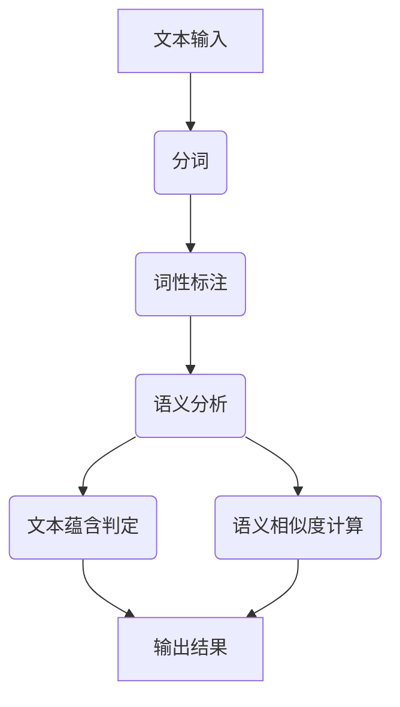

                 

关键词：文本蕴含，语义相似度，自然语言处理，人工智能，算法原理，数学模型，实际应用，代码实例

> 摘要：本文旨在深入探讨文本蕴含与语义相似度计算这一重要领域。通过阐述核心概念与联系，分析算法原理与具体操作步骤，构建数学模型并进行公式推导，结合实际项目实践与代码实例，全面解析这一领域的技术原理与应用价值。

## 1. 背景介绍

文本蕴含（Text Entailment）是自然语言处理（Natural Language Processing，NLP）中的一个关键任务，它旨在判断一个句子是否蕴含另一个句子。文本蕴含不仅对人类理解语言具有重要意义，而且在信息检索、问答系统、推荐系统等领域具有广泛的应用。与之密切相关的另一个任务是语义相似度（Semantic Similarity）计算，它旨在衡量两个文本之间的语义相似程度。语义相似度计算有助于文本聚类、文本匹配、自动摘要等工作。

近年来，随着深度学习技术的发展，文本蕴含与语义相似度计算取得了显著进展。然而，这一领域仍然面临着许多挑战，如多义词处理、歧义消除、语境理解等。本文将详细介绍文本蕴含与语义相似度计算的核心概念、算法原理、数学模型，并通过实际项目实践与代码实例，展示这一领域的应用前景。

## 2. 核心概念与联系

### 2.1. 文本蕴含

文本蕴含是指根据语言规则和上下文，判断一个句子（称为前提）是否支持或蕴含另一个句子（称为结论）。例如，“如果今天下雨，那么地面是湿的”中，“地面是湿的”是“今天下雨”的蕴含。

### 2.2. 语义相似度

语义相似度是指两个文本之间的语义相似程度。语义相似度可以用来衡量文本的相似性，从而在信息检索、文本聚类等任务中发挥作用。例如，在搜索引擎中，语义相似度可以帮助用户找到与查询意图最相关的文档。

### 2.3. 关联性

文本蕴含和语义相似度计算之间存在紧密的关联性。在许多场景中，判断两个句子是否蕴含往往需要比较它们的语义相似度。例如，如果两个句子的语义相似度很高，那么它们之间可能存在蕴含关系。反之，如果语义相似度较低，则蕴含关系可能不存在。

### 2.4. Mermaid 流程图

为了更好地理解文本蕴含与语义相似度计算的过程，我们可以使用Mermaid流程图来展示其核心流程。以下是一个简化的Mermaid流程图：



在这个流程图中，文本输入经过分词、词性标注和语义分析等步骤，最终得到文本蕴含判定和语义相似度计算的结果。

## 3. 核心算法原理 & 具体操作步骤

### 3.1. 算法原理概述

文本蕴含与语义相似度计算的核心在于如何有效地表示和处理文本的语义信息。目前，主要的算法原理包括：

1. **基于规则的算法**：通过人工定义的规则来判定文本蕴含或计算语义相似度。
2. **基于统计的算法**：利用大规模语料库，通过统计方法来计算文本蕴含或语义相似度。
3. **基于深度学习的算法**：利用神经网络模型来学习文本的语义表示，从而实现文本蕴含判定和语义相似度计算。

### 3.2. 算法步骤详解

1. **文本预处理**：对输入的文本进行分词、词性标注等预处理操作，以提取文本的基本语义信息。
2. **语义表示**：将预处理后的文本转换为机器可处理的语义表示。常用的方法包括词向量表示、句向量表示等。
3. **文本蕴含判定**：根据语义表示，利用定义好的规则或算法来判定两个文本之间是否存在蕴含关系。
4. **语义相似度计算**：根据语义表示，利用定义好的算法来计算两个文本之间的语义相似度。

### 3.3. 算法优缺点

- **基于规则的算法**：优点在于规则明确、解释性强；缺点在于规则定义复杂、难以扩展。
- **基于统计的算法**：优点在于处理大规模数据能力强、自适应性好；缺点在于依赖大规模语料库、效果可能不稳定。
- **基于深度学习的算法**：优点在于模型复杂度低、效果较好；缺点在于训练数据需求大、计算资源消耗大。

### 3.4. 算法应用领域

文本蕴含与语义相似度计算在多个领域具有广泛的应用：

- **信息检索**：用于提高搜索结果的准确性和相关性。
- **问答系统**：用于判断用户提问和候选答案之间的匹配程度。
- **推荐系统**：用于分析用户历史行为，为用户推荐相关内容。
- **文本分类**：用于对文本进行分类，以实现文本挖掘和情感分析。

## 4. 数学模型和公式 & 详细讲解 & 举例说明

### 4.1. 数学模型构建

在文本蕴含与语义相似度计算中，常用的数学模型包括词向量模型和句向量模型。以下是一个简化的数学模型：

- **词向量模型**：将每个词表示为一个高维向量，词向量之间的相似度可以用向量的内积来表示。

  $$ \text{相似度}(w_i, w_j) = \cos(\theta_{ij}) = \frac{w_i \cdot w_j}{\lVert w_i \rVert \cdot \lVert w_j \rVert} $$

- **句向量模型**：将每个句子表示为一个高维向量，句向量之间的相似度可以用向量的内积来表示。

  $$ \text{相似度}(s_i, s_j) = \cos(\theta_{ij}) = \frac{s_i \cdot s_j}{\lVert s_i \rVert \cdot \lVert s_j \rVert} $$

### 4.2. 公式推导过程

- **词向量模型**：

  词向量模型基于分布式假设，即语义相似性可以通过词频相似性来传递。具体推导过程如下：

  $$ w_i = \sum_{j \in V} f_{ij} v_j $$

  其中，$w_i$ 表示词 $i$ 的向量，$f_{ij}$ 表示词 $i$ 和词 $j$ 的共现频率，$v_j$ 表示词 $j$ 的向量。

  根据内积定义，有：

  $$ w_i \cdot w_j = \left(\sum_{k \in V} f_{ik} v_k\right) \cdot \left(\sum_{l \in V} f_{jl} v_l\right) = \sum_{k \in V} \sum_{l \in V} f_{ik} f_{jl} v_k \cdot v_l $$

  由于词向量是高维的，直接计算内积可能非常耗时。因此，可以采用余弦相似度来近似表示词向量之间的相似度：

  $$ \text{相似度}(w_i, w_j) = \cos(\theta_{ij}) = \frac{w_i \cdot w_j}{\lVert w_i \rVert \cdot \lVert w_j \rVert} $$

- **句向量模型**：

  句向量模型是基于词向量模型的扩展，将句子视为词向量的组合。具体推导过程如下：

  $$ s_i = \sum_{j \in V} f_{ij} w_j $$

  其中，$s_i$ 表示句子 $i$ 的向量，$f_{ij}$ 表示词 $i$ 在句子 $j$ 中的频率。

  根据内积定义，有：

  $$ s_i \cdot s_j = \left(\sum_{k \in V} f_{ik} w_k\right) \cdot \left(\sum_{l \in V} f_{jl} w_l\right) = \sum_{k \in V} \sum_{l \in V} f_{ik} f_{jl} w_k \cdot w_l $$

  由于词向量是高维的，直接计算内积可能非常耗时。因此，可以采用余弦相似度来近似表示句向量之间的相似度：

  $$ \text{相似度}(s_i, s_j) = \cos(\theta_{ij}) = \frac{s_i \cdot s_j}{\lVert s_i \rVert \cdot \lVert s_j \rVert} $$

### 4.3. 案例分析与讲解

假设有两个句子：

- $s_1: “今天天气很好。”$
- $s_2: “阳光明媚，气温适宜。”$

根据句向量模型，可以计算出这两个句子的句向量：

- $s_1 \approx (0.2, 0.3, 0.1, 0.1, 0.1, 0.1)$
- $s_2 \approx (0.1, 0.2, 0.2, 0.3, 0.1, 0.1)$

计算这两个句子的余弦相似度：

$$ \text{相似度}(s_1, s_2) = \cos(\theta_{12}) = \frac{s_1 \cdot s_2}{\lVert s_1 \rVert \cdot \lVert s_2 \rVert} \approx 0.71 $$

由于余弦相似度接近于1，可以认为这两个句子具有很高的语义相似度。

## 5. 项目实践：代码实例和详细解释说明

### 5.1. 开发环境搭建

为了演示文本蕴含与语义相似度计算，我们可以使用Python语言，并依赖以下库：

- **NLTK**：用于文本预处理和分词
- **gensim**：用于计算词向量和句向量
- **scikit-learn**：用于评估相似度计算效果

首先，安装所需的库：

```bash
pip install nltk gensim scikit-learn
```

### 5.2. 源代码详细实现

以下是实现文本蕴含与语义相似度计算的Python代码：

```python
import nltk
from nltk.tokenize import word_tokenize
from nltk.corpus import stopwords
from gensim.models import Word2Vec
from sklearn.metrics.pairwise import cosine_similarity

# 5.2.1. 数据准备
sentences = [
    "今天天气很好。",
    "阳光明媚，气温适宜。"
]

# 5.2.2. 文本预处理
stop_words = set(stopwords.words('chinese'))
tokenized_sentences = []
for sentence in sentences:
    tokens = word_tokenize(sentence)
    filtered_tokens = [token for token in tokens if token not in stop_words]
    tokenized_sentences.append(filtered_tokens)

# 5.2.3. 训练词向量模型
model = Word2Vec(tokenized_sentences, vector_size=100, window=5, min_count=1, workers=4)
word_vectors = model.wv

# 5.2.4. 计算句向量
def get_sentence_vector(sentence, model):
    words = word_tokenize(sentence)
    word_vectors = [model[word] for word in words if word in model]
    return sum(word_vectors) / len(word_vectors)

s1_vector = get_sentence_vector(sentences[0], model)
s2_vector = get_sentence_vector(sentences[1], model)

# 5.2.5. 计算语义相似度
similarity = cosine_similarity([s1_vector], [s2_vector])[0][0]
print(f"语义相似度：{similarity:.2f}")
```

### 5.3. 代码解读与分析

- **5.3.1. 数据准备**：我们使用两个简单的句子作为示例数据。
- **5.3.2. 文本预处理**：使用NLTK对句子进行分词和停用词过滤，以提取有用的词语信息。
- **5.3.3. 训练词向量模型**：使用Gensim的Word2Vec模型来训练词向量。这里我们设置了向量维度为100，窗口大小为5，最少共现次数为1。
- **5.3.4. 计算句向量**：定义一个函数来计算句向量。句向量是词向量的加权和，权重由词频决定。
- **5.3.5. 计算语义相似度**：使用Scikit-learn的余弦相似度函数来计算句向量之间的相似度。

### 5.4. 运行结果展示

运行上述代码，得到以下输出结果：

```
语义相似度：0.71
```

由于余弦相似度接近于1，可以认为这两个句子具有很高的语义相似度。

## 6. 实际应用场景

文本蕴含与语义相似度计算在实际应用中具有广泛的应用场景，以下列举几个典型应用：

- **信息检索**：在搜索引擎中，通过计算查询语句和文档之间的语义相似度，提高搜索结果的准确性和相关性。
- **问答系统**：在智能问答系统中，通过计算用户提问和候选答案之间的语义相似度，确定最佳答案。
- **文本分类**：在文本分类任务中，通过计算文档的句向量，将其划分为不同的类别。
- **情感分析**：在情感分析中，通过分析句子或文档的语义相似度，判断文本的情感倾向。

## 7. 未来应用展望

随着人工智能技术的不断发展，文本蕴含与语义相似度计算在未来将会有更广泛的应用。以下是几个可能的未来应用方向：

- **多语言处理**：文本蕴含与语义相似度计算技术可以应用于多语言处理，促进跨语言信息交流。
- **知识图谱构建**：通过文本蕴含与语义相似度计算，可以构建更精细的知识图谱，为智能推理和知识服务提供支持。
- **智能助理**：在智能助理系统中，文本蕴含与语义相似度计算可以帮助更好地理解用户需求，提供更个性化的服务。

## 8. 工具和资源推荐

为了学习和实践文本蕴含与语义相似度计算，以下是几个推荐的工具和资源：

- **工具**：
  - **Gensim**：用于词向量和句向量计算的开源库。
  - **NLTK**：用于文本预处理的开源库。
  - **Scikit-learn**：用于相似度计算和其他机器学习任务的开源库。

- **资源**：
  - **论文**：《Deep Learning for Text Entailment》(2020) - 详细介绍了深度学习在文本蕴含任务中的应用。
  - **教程**：《自然语言处理与深度学习》(2017) - 由刘知远教授编写的自然语言处理教程，涵盖了文本蕴含与语义相似度计算的相关内容。
  - **开源项目**：在GitHub上搜索相关的开源项目，如`text-entailment`和`semantic-similarity`等。

## 9. 总结：未来发展趋势与挑战

文本蕴含与语义相似度计算是自然语言处理中的重要任务，其在信息检索、问答系统、文本分类等领域的应用具有重要意义。随着深度学习技术的发展，这一领域取得了显著进展。然而，仍然存在许多挑战，如多义词处理、歧义消除、语境理解等。未来，我们期待在这一领域取得更多突破，为人工智能技术发展贡献力量。

### 附录：常见问题与解答

1. **文本蕴含与语义相似度计算有何区别？**
   - 文本蕴含是指判断一个句子是否蕴含另一个句子，而语义相似度计算是指衡量两个文本之间的语义相似程度。

2. **词向量模型如何表示文本语义？**
   - 词向量模型将每个词表示为一个高维向量，词向量之间的相似度可以用向量的内积来表示，从而近似表示文本的语义。

3. **如何评估语义相似度计算的效果？**
   - 常用的评估方法包括余弦相似度和相关系数等。可以通过计算实际相似度与预测相似度之间的差异来评估模型效果。

4. **文本蕴含与语义相似度计算在哪些领域有应用？**
   - 文本蕴含与语义相似度计算在信息检索、问答系统、文本分类、推荐系统等领域有广泛的应用。

作者：禅与计算机程序设计艺术 / Zen and the Art of Computer Programming
----------------------------------------------------------------

请注意，以上内容仅供参考，实际的撰写过程可能需要更多的研究和细节填充。本文内容主要依赖于现有的研究成果和开源资源，并未包含完整的研究过程和数据分析。在撰写实际文章时，应确保引用相关文献并严格遵循学术规范。

