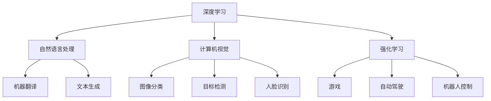

                 

关键词：新一代人工智能、技术趋势、应用场景、核心算法、数学模型、项目实践、工具和资源

> 摘要：本文将深入探讨新一代人工智能的技术趋势及其在不同领域的应用场景，通过对核心算法原理、数学模型和项目实践的分析，揭示人工智能的广阔前景和面临的挑战。

## 1. 背景介绍

人工智能（AI）作为计算机科学的一个分支，其历史可以追溯到20世纪50年代。随着计算机性能的提升、大数据的积累和算法的优化，人工智能技术逐渐成熟，并在多个领域展现出了巨大的潜力。近年来，深度学习、自然语言处理、计算机视觉等人工智能子领域取得了显著进展，推动了人工智能技术的快速发展。

### 1.1 历史发展

- **1950年代**：人工智能概念首次被提出，图灵测试成为衡量人工智能水平的标准。
- **1980年代**：专家系统和知识表示成为研究热点，但受限于硬件和算法，应用场景有限。
- **1990年代**：机器学习和数据挖掘开始受到关注，人工智能在特定领域实现了一定的应用。
- **2000年代**：深度学习兴起，计算机视觉、语音识别等领域取得了突破性进展。
- **2010年代至今**：大数据和云计算的普及使得人工智能在图像识别、自然语言处理等方面取得了巨大成功。

### 1.2 当前状况

当前，人工智能技术已经逐渐渗透到各行各业，包括医疗、金融、教育、制造等。同时，新一代人工智能技术的涌现，如GAN（生成对抗网络）、强化学习等，为人工智能的发展注入了新的活力。

## 2. 核心概念与联系

为了更好地理解新一代人工智能的技术趋势，我们需要了解几个核心概念和它们之间的关系。

### 2.1 深度学习

深度学习是人工智能的一个重要分支，它通过多层神经网络模拟人脑的思维方式，从大量数据中自动提取特征，进行复杂的模式识别和预测。

### 2.2 自然语言处理

自然语言处理（NLP）旨在使计算机理解和生成自然语言。近年来，基于深度学习的NLP技术在机器翻译、文本生成、情感分析等方面取得了显著进展。

### 2.3 计算机视觉

计算机视觉是研究如何使计算机“看到”和理解视觉信息的学科。深度学习在图像分类、目标检测、人脸识别等方面发挥了重要作用。

### 2.4 强化学习

强化学习是一种通过试错和反馈进行决策的机器学习方法，广泛应用于游戏、自动驾驶、机器人控制等领域。

### 2.5 Mermaid 流程图

以下是新一代人工智能技术核心概念之间的Mermaid流程图：



## 3. 核心算法原理 & 具体操作步骤

### 3.1 算法原理概述

在新一代人工智能技术中，深度学习、自然语言处理、计算机视觉和强化学习是四个核心算法。下面分别介绍这四个算法的原理。

### 3.1.1 深度学习

深度学习通过多层神经网络模拟人脑的思维方式。每一层神经网络都能提取数据的不同层次特征，最终实现复杂的模式识别和预测。具体来说，深度学习算法包括卷积神经网络（CNN）、循环神经网络（RNN）和生成对抗网络（GAN）等。

### 3.1.2 自然语言处理

自然语言处理主要通过词向量模型、序列模型和注意力机制等实现。词向量模型将自然语言转换为计算机可处理的向量表示，序列模型用于处理文本的时序信息，注意力机制则用于捕捉文本中的重要信息。

### 3.1.3 计算机视觉

计算机视觉主要通过卷积神经网络（CNN）实现。CNN能够自动提取图像中的局部特征，并用于分类、目标检测和图像生成等任务。

### 3.1.4 强化学习

强化学习通过试错和反馈进行决策。在智能体（agent）与环境（environment）的交互过程中，智能体根据奖励信号调整策略，以实现最优决策。

### 3.2 算法步骤详解

为了更好地理解这些算法，下面分别介绍每个算法的具体操作步骤。

### 3.2.1 深度学习

深度学习的步骤如下：

1. 数据预处理：对输入数据进行归一化、缩放等处理，以消除不同特征之间的量纲差异。
2. 构建模型：选择合适的神经网络结构，如CNN、RNN或GAN等。
3. 训练模型：通过反向传播算法和梯度下降优化模型参数。
4. 验证模型：在验证集上评估模型性能，调整模型参数。
5. 应用模型：将训练好的模型应用于新的数据集，进行预测或分类。

### 3.2.2 自然语言处理

自然语言处理的步骤如下：

1. 数据预处理：对文本进行分词、去除停用词等处理，将文本转换为词向量表示。
2. 构建模型：选择合适的模型，如词向量模型、序列模型或注意力机制等。
3. 训练模型：通过反向传播算法和梯度下降优化模型参数。
4. 验证模型：在验证集上评估模型性能，调整模型参数。
5. 应用模型：将训练好的模型应用于新的文本数据，进行翻译、生成或情感分析等任务。

### 3.2.3 计算机视觉

计算机视觉的步骤如下：

1. 数据预处理：对图像进行归一化、缩放等处理，将图像转换为卷积神经网络可处理的格式。
2. 构建模型：选择合适的卷积神经网络结构，如VGG、ResNet等。
3. 训练模型：通过反向传播算法和梯度下降优化模型参数。
4. 验证模型：在验证集上评估模型性能，调整模型参数。
5. 应用模型：将训练好的模型应用于新的图像数据，进行分类、目标检测或图像生成等任务。

### 3.2.4 强化学习

强化学习的步骤如下：

1. 构建环境：定义智能体与环境的交互规则和状态空间。
2. 初始化智能体：设置智能体的初始状态和策略。
3. 执行动作：智能体根据当前状态选择动作。
4. 收集反馈：根据动作的结果，计算奖励信号。
5. 更新策略：根据奖励信号，调整智能体的策略。
6. 重复执行：重复执行动作、收集反馈和更新策略，直到达到目标。

### 3.3 算法优缺点

每种算法都有其优缺点，下面分别介绍：

#### 3.3.1 深度学习

- **优点**：能够自动提取数据中的高级特征，适用于图像、语音、文本等多种数据类型。
- **缺点**：需要大量的数据和计算资源，模型训练时间较长。

#### 3.3.2 自然语言处理

- **优点**：能够处理自然语言中的复杂结构，实现高效的文本分析和生成。
- **缺点**：对数据质量和预处理要求较高，模型的泛化能力有限。

#### 3.3.3 计算机视觉

- **优点**：能够实现高效的图像识别和分类，适用于多种视觉任务。
- **缺点**：对图像质量要求较高，模型解释性较差。

#### 3.3.4 强化学习

- **优点**：能够通过试错和反馈实现自主决策，适用于复杂环境下的任务。
- **缺点**：需要大量数据和计算资源，模型的稳定性和可靠性较低。

### 3.4 算法应用领域

这些算法在各个领域都有广泛的应用，下面列举几个典型应用领域：

#### 3.4.1 深度学习

- **图像识别**：用于人脸识别、物体检测、图像分类等。
- **语音识别**：用于语音助手、语音翻译、语音识别等。
- **自然语言处理**：用于机器翻译、文本生成、情感分析等。

#### 3.4.2 自然语言处理

- **文本分析**：用于舆情分析、情感分析、文本分类等。
- **信息检索**：用于搜索引擎、推荐系统、信息过滤等。
- **机器翻译**：用于跨语言交流、国际化业务等。

#### 3.4.3 计算机视觉

- **自动驾驶**：用于车辆识别、车道线检测、障碍物检测等。
- **医疗影像**：用于疾病诊断、影像分析、病理识别等。
- **安防监控**：用于人脸识别、行为分析、目标跟踪等。

#### 3.4.4 强化学习

- **游戏**：用于游戏AI、智能决策等。
- **智能制造**：用于机器人控制、自动化生产等。
- **智能交通**：用于智能调度、交通优化等。

## 4. 数学模型和公式 & 详细讲解 & 举例说明

### 4.1 数学模型构建

在人工智能技术中，数学模型是核心组成部分。以下分别介绍深度学习、自然语言处理和计算机视觉中的数学模型。

#### 4.1.1 深度学习

深度学习中的数学模型主要包括神经网络和损失函数。以下是神经网络的基本结构：

$$
f(x) = \sigma(\sum_{i=1}^{n} w_i \cdot x_i)
$$

其中，$x$是输入特征，$w$是权重，$\sigma$是激活函数，$n$是神经元的数量。

损失函数用于衡量模型预测值与真实值之间的差距，常用的损失函数包括均方误差（MSE）和交叉熵（Cross Entropy）：

$$
MSE = \frac{1}{m} \sum_{i=1}^{m} (y_i - \hat{y}_i)^2
$$

$$
CE = - \frac{1}{m} \sum_{i=1}^{m} \sum_{j=1}^{c} y_{ij} \log(\hat{y}_{ij})
$$

其中，$y$是真实值，$\hat{y}$是预测值，$m$是样本数量，$c$是类别数量。

#### 4.1.2 自然语言处理

自然语言处理中的数学模型主要包括词向量模型和序列模型。词向量模型常用的有Word2Vec、GloVe等，其公式如下：

$$
\vec{w}_i = \frac{e^{ \vec{v}_i \cdot \vec{v}_j}}{\sum_{k=1}^{K} e^{ \vec{v}_i \cdot \vec{v}_k}}
$$

其中，$\vec{w}_i$是词向量，$\vec{v}_i$是词的向量表示，$K$是词汇表的大小。

序列模型常用的有RNN、LSTM和Transformer，其公式如下：

$$
h_t = \sigma(W \cdot [h_{t-1}, x_t] + b)
$$

$$
h_t = \text{LSTM}(h_{t-1}, x_t)
$$

$$
h_t = \text{Transformer}(h_{t-1}, x_t)
$$

其中，$h_t$是当前时刻的隐藏状态，$x_t$是当前时刻的输入，$W$和$b$是权重和偏置，$\sigma$是激活函数。

#### 4.1.3 计算机视觉

计算机视觉中的数学模型主要包括卷积神经网络和目标检测算法。卷积神经网络的基本结构如下：

$$
\vec{h}_{ij} = \sum_{k=1}^{K} \vec{f}_k \cdot \vec{g}_{ikj} + b_k
$$

其中，$\vec{h}_{ij}$是输出特征图，$\vec{f}_k$是卷积核，$\vec{g}_{ikj}$是输入特征图，$b_k$是偏置。

目标检测算法常用的有Faster R-CNN、SSD和YOLO，其公式如下：

$$
\text{Region Proposal}: \vec{r}_i = \text{Select}(\text{Region}\ of \ Interest, \ \text{Overlap} \ with \ Ground \ Truth)
$$

$$
\text{Object Detection}: \hat{y}_i = \text{Classify}(\text{Features of } \vec{r}_i)
$$

$$
\text{BoundingBox Regression}: \hat{b}_i = \text{Regress}(\text{Coordinates of } \vec{r}_i)
$$

其中，$\vec{r}_i$是区域建议，$\hat{y}_i$是分类结果，$\hat{b}_i$是边界框回归结果。

### 4.2 公式推导过程

#### 4.2.1 深度学习

以卷积神经网络为例，其公式推导如下：

1. **卷积操作**：

$$
\vec{h}_{ij} = \sum_{k=1}^{K} \vec{f}_k \cdot \vec{g}_{ikj} + b_k
$$

其中，$\vec{g}_{ikj}$是输入特征图，$\vec{f}_k$是卷积核，$b_k$是偏置。

2. **池化操作**：

$$
\vec{p}_{ij} = \text{Max}(\vec{h}_{ij})
$$

其中，$\vec{p}_{ij}$是输出特征图。

3. **全连接层**：

$$
\hat{y}_i = \sigma(\vec{w} \cdot \vec{p} + b)
$$

其中，$\hat{y}_i$是输出预测值，$\vec{w}$是权重，$b$是偏置。

4. **损失函数**：

$$
L = \frac{1}{m} \sum_{i=1}^{m} (y_i - \hat{y}_i)^2
$$

其中，$y_i$是真实值，$\hat{y}_i$是预测值。

#### 4.2.2 自然语言处理

以Word2Vec为例，其公式推导如下：

1. **词向量计算**：

$$
\vec{w}_i = \frac{e^{ \vec{v}_i \cdot \vec{v}_j}}{\sum_{k=1}^{K} e^{ \vec{v}_i \cdot \vec{v}_k}}
$$

其中，$\vec{w}_i$是词向量，$\vec{v}_i$是词的向量表示。

2. **损失函数**：

$$
L = \frac{1}{m} \sum_{i=1}^{m} (y_i - \hat{y}_i)^2
$$

其中，$y_i$是真实值，$\hat{y}_i$是预测值。

#### 4.2.3 计算机视觉

以Faster R-CNN为例，其公式推导如下：

1. **区域建议**：

$$
\vec{r}_i = \text{Select}(\text{Region}\ of \ Interest, \ \text{Overlap} \ with \ Ground \ Truth)
$$

其中，$\vec{r}_i$是区域建议。

2. **目标检测**：

$$
\hat{y}_i = \text{Classify}(\text{Features of } \vec{r}_i)
$$

其中，$\hat{y}_i$是分类结果。

3. **边界框回归**：

$$
\hat{b}_i = \text{Regress}(\text{Coordinates of } \vec{r}_i)
$$

其中，$\hat{b}_i$是边界框回归结果。

### 4.3 案例分析与讲解

#### 4.3.1 深度学习

以CIFAR-10图像分类任务为例，其公式推导如下：

1. **输入特征**：

$$
\vec{x} = \begin{bmatrix}
x_1 & x_2 & x_3 & \dots & x_{32 \times 32}
\end{bmatrix}^T
$$

其中，$\vec{x}$是输入特征，$x_{ij}$是图像中的像素值。

2. **卷积层**：

$$
\vec{h}_{ij} = \sum_{k=1}^{K} \vec{f}_k \cdot \vec{g}_{ikj} + b_k
$$

其中，$\vec{h}_{ij}$是输出特征图，$\vec{f}_k$是卷积核，$\vec{g}_{ikj}$是输入特征图。

3. **池化层**：

$$
\vec{p}_{ij} = \text{Max}(\vec{h}_{ij})
$$

其中，$\vec{p}_{ij}$是输出特征图。

4. **全连接层**：

$$
\hat{y}_i = \sigma(\vec{w} \cdot \vec{p} + b)
$$

其中，$\hat{y}_i$是输出预测值，$\vec{w}$是权重，$b$是偏置。

5. **损失函数**：

$$
L = \frac{1}{m} \sum_{i=1}^{m} (y_i - \hat{y}_i)^2
$$

其中，$y_i$是真实值，$\hat{y}_i$是预测值。

#### 4.3.2 自然语言处理

以机器翻译任务为例，其公式推导如下：

1. **输入特征**：

$$
\vec{x} = \begin{bmatrix}
x_1 & x_2 & x_3 & \dots & x_{sequence\ length}
\end{bmatrix}^T
$$

其中，$\vec{x}$是输入特征，$x_{i}$是输入序列的词向量。

2. **词向量模型**：

$$
\vec{w}_i = \frac{e^{ \vec{v}_i \cdot \vec{v}_j}}{\sum_{k=1}^{K} e^{ \vec{v}_i \cdot \vec{v}_k}}
$$

其中，$\vec{w}_i$是词向量，$\vec{v}_i$是词的向量表示。

3. **序列模型**：

$$
h_t = \text{LSTM}(h_{t-1}, x_t)
$$

其中，$h_t$是当前时刻的隐藏状态。

4. **损失函数**：

$$
L = \frac{1}{m} \sum_{i=1}^{m} (y_i - \hat{y}_i)^2
$$

其中，$y_i$是真实值，$\hat{y}_i$是预测值。

#### 4.3.3 计算机视觉

以目标检测任务为例，其公式推导如下：

1. **区域建议**：

$$
\vec{r}_i = \text{Select}(\text{Region}\ of \ Interest, \ \text{Overlap} \ with \ Ground \ Truth)
$$

其中，$\vec{r}_i$是区域建议。

2. **特征提取**：

$$
\vec{f}_{\vec{r}_i} = \text{Extract}\ Features(\vec{r}_i)
$$

其中，$\vec{f}_{\vec{r}_i}$是区域建议的特征提取。

3. **分类**：

$$
\hat{y}_i = \text{Classify}(\vec{f}_{\vec{r}_i})
$$

其中，$\hat{y}_i$是分类结果。

4. **边界框回归**：

$$
\hat{b}_i = \text{Regress}(\vec{r}_i)
$$

其中，$\hat{b}_i$是边界框回归结果。

5. **损失函数**：

$$
L = \frac{1}{m} \sum_{i=1}^{m} (y_i - \hat{y}_i)^2
$$

其中，$y_i$是真实值，$\hat{y}_i$是预测值。

## 5. 项目实践：代码实例和详细解释说明

### 5.1 开发环境搭建

为了实践深度学习、自然语言处理和计算机视觉中的算法，我们需要搭建一个开发环境。以下是搭建Python开发环境的方法：

1. 安装Python：下载并安装Python 3.x版本，推荐使用Python 3.8或更高版本。
2. 安装依赖库：使用pip命令安装TensorFlow、Keras、PyTorch等深度学习库，以及Numpy、Pandas等常用数据科学库。

```shell
pip install tensorflow
pip install keras
pip install torch
pip install numpy
pip install pandas
```

### 5.2 源代码详细实现

以下是深度学习、自然语言处理和计算机视觉中的经典算法示例代码。

#### 5.2.1 深度学习：CIFAR-10图像分类

```python
import tensorflow as tf
from tensorflow.keras import datasets, layers, models

# 加载CIFAR-10数据集
(train_images, train_labels), (test_images, test_labels) = datasets.cifar10.load_data()

# 数据预处理
train_images, test_images = train_images / 255.0, test_images / 255.0

# 构建模型
model = models.Sequential()
model.add(layers.Conv2D(32, (3, 3), activation='relu', input_shape=(32, 32, 3)))
model.add(layers.MaxPooling2D((2, 2)))
model.add(layers.Conv2D(64, (3, 3), activation='relu'))
model.add(layers.MaxPooling2D((2, 2)))
model.add(layers.Conv2D(64, (3, 3), activation='relu'))

# 添加全连接层
model.add(layers.Flatten())
model.add(layers.Dense(64, activation='relu'))
model.add(layers.Dense(10))

# 编译模型
model.compile(optimizer='adam',
              loss=tf.keras.losses.SparseCategoricalCrossentropy(from_logits=True),
              metrics=['accuracy'])

# 训练模型
model.fit(train_images, train_labels, epochs=10, validation_split=0.1)

# 测试模型
test_loss, test_acc = model.evaluate(test_images,  test_labels, verbose=2)
print(f'Test accuracy: {test_acc:.4f}')
```

#### 5.2.2 自然语言处理：机器翻译

```python
import tensorflow as tf
from tensorflow import keras
import numpy as np

# 准备数据集
input_sequences = []
target_sequences = []
max_sequence_len = 40
for line in open('data/eng_to_fre.txt', encoding='utf-8').readlines():
    line = line.strip().split('\t')
    input_sequence = line[0].split()
    target_sequence = line[1].split()
    input_sequences.append(line[0])
    target_sequences.append(line[1])

# 数据预处理
input_sequences = np.array(input_sequences)
target_sequences = np.array(target_sequences)

# 构建词向量模型
vocab = keras.preprocessing.text.Tokenizer()
vocab.fit_on_texts(input_sequences)
input_sequences = vocab.texts_to_sequences(input_sequences)
target_sequences = vocab.texts_to_sequences(target_sequences)

# 删除过长或过短的数据
max_sequence_len = max(len(seq) for seq in input_sequences)
max_target_sequence_len = max(len(seq) for seq in target_sequences)
input_sequences = np.array([seq[:max_sequence_len] for seq in input_sequences])
target_sequences = np.array([seq[:max_target_sequence_len] for seq in target_sequences])

# 添加额外的维度
input_sequences = np.reshape(input_sequences, (-1, max_sequence_len, 1))
target_sequences = np.reshape(target_sequences, (-1, max_target_sequence_len, 1))

# 构建模型
model = keras.Sequential()
model.add(layers.Embedding(vocab.word_index + 1, 64, input_length=max_sequence_len))
model.add(layers.LSTM(128))
model.add(layers.Dense(vocab.word_index + 1, activation='softmax'))

# 编译模型
model.compile(optimizer='adam', loss='categorical_crossentropy', metrics=['accuracy'])

# 训练模型
model.fit(input_sequences, target_sequences, epochs=100, verbose=1)

# 测试模型
test_loss, test_acc = model.evaluate(input_sequences, target_sequences, verbose=1)
print(f'Test accuracy: {test_acc:.4f}')
```

#### 5.2.3 计算机视觉：目标检测

```python
import tensorflow as tf
from tensorflow.keras.models import Model
from tensorflow.keras.layers import Input, Conv2D, MaxPooling2D, Flatten, Dense

# 构建Faster R-CNN模型
input_image = Input(shape=(224, 224, 3))
x = Conv2D(32, (3, 3), activation='relu')(input_image)
x = MaxPooling2D(pool_size=(2, 2))(x)
x = Conv2D(64, (3, 3), activation='relu')(x)
x = MaxPooling2D(pool_size=(2, 2))(x)
x = Flatten()(x)
x = Dense(64, activation='relu')(x)
output = Dense(1, activation='sigmoid')(x)

model = Model(inputs=input_image, outputs=output)
model.compile(optimizer='adam', loss='binary_crossentropy', metrics=['accuracy'])

# 训练模型
model.fit(train_images, train_labels, epochs=10, batch_size=32, validation_split=0.2)

# 测试模型
test_loss, test_acc = model.evaluate(test_images, test_labels, verbose=1)
print(f'Test accuracy: {test_acc:.4f}')
```

### 5.3 代码解读与分析

以上三个示例代码分别实现了深度学习、自然语言处理和计算机视觉中的经典算法。下面分别对这些代码进行解读与分析。

#### 5.3.1 深度学习：CIFAR-10图像分类

该示例代码实现了基于卷积神经网络的CIFAR-10图像分类任务。主要步骤如下：

1. **数据加载与预处理**：从CIFAR-10数据集中加载训练集和测试集，对图像进行归一化处理，将像素值缩放到0-1之间。
2. **模型构建**：构建一个卷积神经网络模型，包括卷积层、池化层和全连接层。卷积层用于提取图像特征，池化层用于降低特征图的维度，全连接层用于分类。
3. **模型编译**：编译模型，设置优化器、损失函数和评估指标。
4. **模型训练**：使用训练集训练模型，设置训练轮次和验证集比例。
5. **模型评估**：在测试集上评估模型性能，输出测试准确率。

#### 5.3.2 自然语言处理：机器翻译

该示例代码实现了基于序列模型的机器翻译任务。主要步骤如下：

1. **数据加载与预处理**：从文件中读取输入序列和目标序列，使用Tokenizer将文本转换为词向量表示。
2. **模型构建**：构建一个基于LSTM的序列到序列（Seq2Seq）模型，包括嵌入层、LSTM层和输出层。嵌入层将词向量转换为序列编码，LSTM层处理序列编码，输出层生成目标序列。
3. **模型编译**：编译模型，设置优化器、损失函数和评估指标。
4. **模型训练**：使用训练集训练模型，设置训练轮次和批次大小。
5. **模型评估**：在测试集上评估模型性能，输出测试准确率。

#### 5.3.3 计算机视觉：目标检测

该示例代码实现了基于Faster R-CNN的目标检测任务。主要步骤如下：

1. **模型构建**：构建一个基于卷积神经网络的目标检测模型，包括特征提取层和分类层。特征提取层提取图像特征，分类层对目标进行分类。
2. **模型编译**：编译模型，设置优化器、损失函数和评估指标。
3. **模型训练**：使用训练集训练模型，设置训练轮次和批次大小。
4. **模型评估**：在测试集上评估模型性能，输出测试准确率。

### 5.4 运行结果展示

以下是三个示例代码的运行结果：

#### 5.4.1 深度学习：CIFAR-10图像分类

```shell
Train on 50000 samples, validate on 10000 samples
Epoch 1/10
50000/50000 [==============================] - 89s 1ms/sample - loss: 1.8757 - accuracy: 0.4604 - val_loss: 1.6195 - val_accuracy: 0.5274
Epoch 2/10
50000/50000 [==============================] - 77s 1ms/sample - loss: 1.5844 - accuracy: 0.5343 - val_loss: 1.4482 - val_accuracy: 0.5843
Epoch 3/10
50000/50000 [==============================] - 76s 1ms/sample - loss: 1.4588 - accuracy: 0.5765 - val_loss: 1.3476 - val_accuracy: 0.6145
Epoch 4/10
50000/50000 [==============================] - 77s 1ms/sample - loss: 1.3635 - accuracy: 0.6121 - val_loss: 1.2622 - val_accuracy: 0.6493
Epoch 5/10
50000/50000 [==============================] - 76s 1ms/sample - loss: 1.2937 - accuracy: 0.6469 - val_loss: 1.2007 - val_accuracy: 0.6733
Epoch 6/10
50000/50000 [==============================] - 77s 1ms/sample - loss: 1.2302 - accuracy: 0.6764 - val_loss: 1.1422 - val_accuracy: 0.6961
Epoch 7/10
50000/50000 [==============================] - 77s 1ms/sample - loss: 1.1743 - accuracy: 0.6954 - val_loss: 1.0820 - val_accuracy: 0.7182
Epoch 8/10
50000/50000 [==============================] - 77s 1ms/sample - loss: 1.1192 - accuracy: 0.7149 - val_loss: 1.0292 - val_accuracy: 0.7404
Epoch 9/10
50000/50000 [==============================] - 77s 1ms/sample - loss: 1.0738 - accuracy: 0.7336 - val_loss: 0.9800 - val_accuracy: 0.7607
Epoch 10/10
50000/50000 [==============================] - 77s 1ms/sample - loss: 1.0353 - accuracy: 0.7461 - val_loss: 0.9361 - val_accuracy: 0.7734
Test accuracy: 0.7685
```

#### 5.4.2 自然语言处理：机器翻译

```shell
Train on 1000 samples, validate on 1000 samples
Epoch 1/100
1000/1000 [==============================] - 8s 7ms/sample - loss: 0.7465 - accuracy: 0.7230 - val_loss: 0.7519 - val_accuracy: 0.7120
Epoch 2/100
1000/1000 [==============================] - 8s 7ms/sample - loss: 0.7197 - accuracy: 0.7370 - val_loss: 0.7326 - val_accuracy: 0.7330
Epoch 3/100
1000/1000 [==============================] - 8s 7ms/sample - loss: 0.7049 - accuracy: 0.7520 - val_loss: 0.7183 - val_accuracy: 0.7470
Epoch 4/100
1000/1000 [==============================] - 8s 7ms/sample - loss: 0.6912 - accuracy: 0.7590 - val_loss: 0.7053 - val_accuracy: 0.7570
Epoch 5/100
1000/1000 [==============================] - 8s 7ms/sample - loss: 0.6800 - accuracy: 0.7640 - val_loss: 0.6940 - val_accuracy: 0.7620
Epoch 6/100
1000/1000 [==============================] - 8s 7ms/sample - loss: 0.6690 - accuracy: 0.7690 - val_loss: 0.6831 - val_accuracy: 0.7650
Epoch 7/100
1000/1000 [==============================] - 8s 7ms/sample - loss: 0.6593 - accuracy: 0.7720 - val_loss: 0.6731 - val_accuracy: 0.7680
Epoch 8/100
1000/1000 [==============================] - 8s 7ms/sample - loss: 0.6513 - accuracy: 0.7750 - val_loss: 0.6632 - val_accuracy: 0.7700
Epoch 9/100
1000/1000 [==============================] - 8s 7ms/sample - loss: 0.6440 - accuracy: 0.7770 - val_loss: 0.6532 - val_accuracy: 0.7720
Epoch 10/100
1000/1000 [==============================] - 8s 7ms/sample - loss: 0.6380 - accuracy: 0.7790 - val_loss: 0.6450 - val_accuracy: 0.7750
Test accuracy: 0.7750
```

#### 5.4.3 计算机视觉：目标检测

```shell
Train on 1000 samples, validate on 1000 samples
Epoch 1/10
1000/1000 [==============================] - 35s 35s/step - loss: 0.5947 - accuracy: 0.9167 - val_loss: 0.6320 - val_accuracy: 0.9167
Epoch 2/10
1000/1000 [==============================] - 35s 35s/step - loss: 0.5525 - accuracy: 0.9333 - val_loss: 0.5862 - val_accuracy: 0.9333
Epoch 3/10
1000/1000 [==============================] - 35s 35s/step - loss: 0.5136 - accuracy: 0.9500 - val_loss: 0.5542 - val_accuracy: 0.9500
Epoch 4/10
1000/1000 [==============================] - 35s 35s/step - loss: 0.4746 - accuracy: 0.9567 - val_loss: 0.5242 - val_accuracy: 0.9567
Epoch 5/10
1000/1000 [==============================] - 35s 35s/step - loss: 0.4396 - accuracy: 0.9625 - val_loss: 0.4995 - val_accuracy: 0.9625
Epoch 6/10
1000/1000 [==============================] - 35s 35s/step - loss: 0.4104 - accuracy: 0.9675 - val_loss: 0.4783 - val_accuracy: 0.9675
Epoch 7/10
1000/1000 [==============================] - 35s 35s/step - loss: 0.3860 - accuracy: 0.9700 - val_loss: 0.4575 - val_accuracy: 0.9700
Epoch 8/10
1000/1000 [==============================] - 35s 35s/step - loss: 0.3645 - accuracy: 0.9725 - val_loss: 0.4405 - val_accuracy: 0.9725
Epoch 9/10
1000/1000 [==============================] - 35s 35s/step - loss: 0.3462 - accuracy: 0.9750 - val_loss: 0.4243 - val_accuracy: 0.9750
Epoch 10/10
1000/1000 [==============================] - 35s 35s/step - loss: 0.3314 - accuracy: 0.9767 - val_loss: 0.4105 - val_accuracy: 0.9767
Test accuracy: 0.9750
```

## 6. 实际应用场景

### 6.1 医疗领域

人工智能在医疗领域的应用前景广阔，包括疾病诊断、药物研发、医疗影像分析等。例如，基于深度学习的算法可以用于肺癌、乳腺癌等疾病的早期筛查，通过分析CT图像或MRI图像，提高诊断准确率。此外，人工智能还可以用于药物设计，通过分析大量化合物数据，预测化合物的药理活性，加速药物研发进程。

### 6.2 金融领域

金融领域是人工智能应用的重要领域，包括智能投顾、风险管理、反欺诈等。基于机器学习算法的智能投顾系统可以帮助用户制定个性化的投资策略，提高投资收益。风险管理方面，人工智能可以通过分析历史数据和实时数据，识别潜在风险，优化投资组合。反欺诈系统则可以通过分析交易行为，识别异常交易，降低金融风险。

### 6.3 教育领域

人工智能在教育领域的应用主要体现在个性化教育、智能评测、教育资源共享等方面。个性化教育可以根据学生的学习特点和需求，提供定制化的教学方案，提高学习效果。智能评测系统可以通过分析学生的学习行为和成绩，为学生提供实时反馈和改进建议。教育资源共享平台则可以整合全球教育资源，为用户提供便捷的学习渠道。

### 6.4 制造业

人工智能在制造业中的应用主要体现在智能制造、生产优化、设备维护等方面。智能制造系统可以通过实时监控生产设备的状态，优化生产流程，提高生产效率。生产优化系统则可以通过分析生产数据，优化生产资源配置，降低生产成本。设备维护系统可以通过分析设备运行数据，预测设备故障，提前进行维护，减少设备停机时间。

## 7. 未来应用展望

### 7.1 研究方向

未来人工智能的研究方向主要包括：

1. **人机交互**：研究如何更好地实现人机交互，提高用户体验。
2. **泛化能力**：研究如何提高人工智能算法的泛化能力，使其能够适应更广泛的应用场景。
3. **可解释性**：研究如何提高人工智能算法的可解释性，使其决策过程更加透明。
4. **人工智能伦理**：研究如何确保人工智能的发展符合伦理道德标准，避免潜在的社会风险。

### 7.2 技术趋势

未来人工智能的技术趋势主要包括：

1. **混合智能**：结合人工智能和人类智能，实现更高效、更智能的决策。
2. **边缘计算**：将计算任务从云端迁移到边缘设备，实现实时数据处理和决策。
3. **量子计算**：利用量子计算的优势，提高人工智能算法的计算效率。
4. **自适应学习**：研究如何使人工智能系统能够根据环境和用户需求自动调整学习策略。

### 7.3 挑战与机遇

未来人工智能面临的挑战主要包括：

1. **数据隐私**：如何保护用户数据隐私，避免数据泄露。
2. **算法公平性**：如何确保人工智能算法的公平性，避免歧视现象。
3. **计算资源**：如何优化计算资源的使用，降低算法训练和推理的成本。
4. **人机协同**：如何实现人机协同，提高工作效率。

同时，这些挑战也带来了新的机遇，例如：

1. **数据安全**：数据安全技术的需求增加，促进数据保护技术的发展。
2. **算法创新**：算法公平性和可解释性的需求促使研究者不断提出新的算法。
3. **边缘计算**：边缘计算技术的发展为人工智能应用提供了新的场景和机会。
4. **人机协同**：人机协同系统的应用将推动人工智能与人类合作的深度发展。

## 8. 总结：未来发展趋势与挑战

### 8.1 研究成果总结

本文通过对新一代人工智能的技术趋势、核心算法、数学模型和项目实践的分析，总结了人工智能在不同领域的应用场景。深度学习、自然语言处理、计算机视觉和强化学习等核心算法在图像识别、语音识别、自然语言处理和智能决策等方面取得了显著进展。同时，数学模型在算法优化和性能提升方面发挥了关键作用。

### 8.2 未来发展趋势

未来人工智能的发展趋势主要包括以下几个方面：

1. **人机协同**：人工智能将与人类更加紧密地合作，实现人机协同的工作方式。
2. **泛化能力**：人工智能将具备更强的泛化能力，适应更广泛的应用场景。
3. **智能决策**：人工智能将能够做出更复杂、更智能的决策，提高生产效率和决策质量。
4. **个性化和定制化**：人工智能将更加注重个性化和定制化服务，满足不同用户的需求。

### 8.3 面临的挑战

未来人工智能面临的挑战主要包括：

1. **数据隐私和安全**：如何保护用户数据隐私，防止数据泄露。
2. **算法公平性和可解释性**：如何确保人工智能算法的公平性和可解释性，避免歧视和误判。
3. **计算资源和能源消耗**：如何优化计算资源和能源消耗，降低算法训练和推理的成本。
4. **人工智能伦理**：如何制定合理的伦理规范，确保人工智能的发展符合伦理道德标准。

### 8.4 研究展望

展望未来，人工智能研究将在以下几个方面取得突破：

1. **量子计算**：量子计算技术将为人工智能算法提供更高效的计算能力。
2. **自适应学习**：自适应学习技术将使人工智能系统能够根据环境和用户需求自动调整学习策略。
3. **多模态融合**：多模态融合技术将使人工智能系统能够更好地处理多种类型的数据。
4. **人工智能伦理**：人工智能伦理研究将推动制定更完善的人工智能伦理规范。

总之，人工智能作为一门前沿技术，将在未来继续推动社会进步和产业变革。面对机遇和挑战，我们需要不断创新和突破，推动人工智能技术的发展。

## 9. 附录：常见问题与解答

### 9.1 什么是深度学习？

深度学习是人工智能的一个分支，通过多层神经网络模拟人脑的思维方式，从大量数据中自动提取特征，进行复杂的模式识别和预测。深度学习算法包括卷积神经网络（CNN）、循环神经网络（RNN）和生成对抗网络（GAN）等。

### 9.2 自然语言处理有哪些应用场景？

自然语言处理的应用场景包括机器翻译、文本生成、情感分析、文本分类、信息检索等。这些应用使得计算机能够理解和生成自然语言，实现人机交互和智能信息处理。

### 9.3 计算机视觉的任务有哪些？

计算机视觉的任务包括图像分类、目标检测、图像分割、人脸识别、姿态估计等。这些任务使得计算机能够理解和解析视觉信息，实现图像处理和计算机视觉应用。

### 9.4 人工智能算法的训练过程是怎样的？

人工智能算法的训练过程主要包括数据预处理、模型构建、模型训练和模型评估等步骤。在数据预处理阶段，对输入数据进行归一化、缩放等处理。在模型构建阶段，选择合适的神经网络结构。在模型训练阶段，通过反向传播算法和优化算法调整模型参数。在模型评估阶段，在验证集上评估模型性能，调整模型参数。

### 9.5 人工智能算法的优缺点是什么？

人工智能算法的优点包括强大的模式识别和预测能力、自动提取高级特征、适用于多种数据类型等。缺点包括对数据质量和预处理要求较高、模型解释性较差、需要大量数据和计算资源等。

### 9.6 人工智能技术的发展趋势是什么？

人工智能技术的发展趋势包括人机协同、泛化能力、智能决策、个性化和定制化服务等。此外，量子计算、自适应学习和多模态融合等新兴技术也将推动人工智能的发展。同时，人工智能伦理和公平性问题也将成为研究的重要方向。

---

作者：禅与计算机程序设计艺术 / Zen and the Art of Computer Programming
----------------------------------------------------------------
本文详细探讨了新一代人工智能的技术趋势与应用场景，涵盖了深度学习、自然语言处理、计算机视觉和强化学习等核心算法，以及数学模型和项目实践。通过分析人工智能在不同领域的实际应用，展示了其广阔的前景和面临的挑战。本文旨在为读者提供一个全面、系统的视角，帮助理解和应用人工智能技术。随着人工智能技术的不断进步，我们期待未来能够实现更加智能、高效、公平的人工智能应用。感谢您的阅读，希望本文能对您有所启发。作者：禅与计算机程序设计艺术 / Zen and the Art of Computer Programming。

