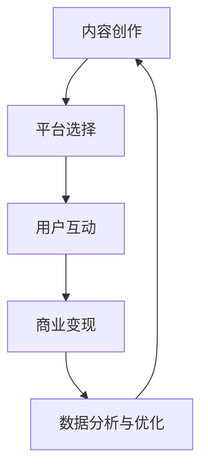

                 

关键词：新媒体、内容产业、创业、人工智能、技术发展

摘要：随着互联网和人工智能技术的快速发展，新媒体已经成为内容产业的重要支柱。本文将探讨新媒体创业的机遇与挑战，分析内容产业的技术发展趋势，并提供一些建议，帮助创业者抓住这个领域的未来之星。

## 1. 背景介绍

在过去几年里，新媒体的崛起给内容产业带来了巨大的变革。从传统的报纸、杂志到如今的社交媒体、短视频平台，内容传播的方式和消费者的接受习惯都在不断改变。与此同时，人工智能技术的快速发展也为新媒体创业提供了强大的支持。例如，自然语言处理技术使得内容生成更加自动化，推荐系统提高了用户的个性化体验，而虚拟现实和增强现实技术则为内容创作提供了全新的表现形式。

### 1.1 新媒体的定义与发展

新媒体是指以互联网和移动通信技术为基础，通过数字平台进行信息传播和交流的新兴媒体形式。与传统媒体相比，新媒体具有传播速度快、互动性强、受众广泛等特点。新媒体的发展可以分为以下几个阶段：

1. **Web 1.0**：早期的互联网时代，信息主要以单向传播为主，用户只能被动地接收信息。
2. **Web 2.0**：用户生成内容（UGC）的兴起，使得信息传播更加互动和多元化。
3. **社交媒体时代**：以微博、微信为代表的社交媒体平台，进一步加深了用户的参与度和互动性。
4. **短视频和直播时代**：短视频平台如抖音、快手等，以及直播平台的兴起，让内容创作和传播变得更加便捷和实时。

### 1.2 人工智能在内容产业中的应用

人工智能技术在内容产业中的应用日益广泛，包括但不限于以下几个方面：

1. **内容生成**：通过自然语言处理技术，可以自动生成文章、新闻、广告等内容。
2. **内容推荐**：利用推荐系统，根据用户的历史行为和偏好，为其推荐感兴趣的内容。
3. **内容审核**：通过图像识别和自然语言处理技术，自动识别和过滤不良内容，确保平台内容的健康和合规。
4. **内容个性化**：根据用户的兴趣和行为数据，实现内容的个性化推送，提高用户的满意度和留存率。
5. **内容审核**：利用人工智能技术，自动识别和过滤不良内容，确保平台内容的健康和合规。

## 2. 核心概念与联系

在探讨新媒体创业之前，我们需要理解一些核心概念，并了解它们之间的联系。

### 2.1 内容产业的定义

内容产业是指以内容为核心，通过创作、生产、传播和消费等环节实现价值创造和流通的产业。它包括传统媒体、新媒体、娱乐、出版等多个领域。

### 2.2 新媒体创业的核心要素

1. **内容创作**：优质的内容是新媒体创业的核心，无论是文章、视频、音频还是图片，都需要有独特的创意和高质量的制作。
2. **平台选择**：选择适合自己内容类型的平台，如社交媒体、短视频平台、直播平台等，是成功创业的重要一环。
3. **用户互动**：通过互动手段，如评论、点赞、分享等，提高用户参与度和粘性。
4. **商业变现**：通过广告、付费订阅、电商等方式实现盈利。

### 2.3 人工智能与内容产业的关系

人工智能技术为内容产业提供了强大的支持，使得内容创作、推荐、审核和个性化等方面更加高效和精准。同时，人工智能技术也带来了新的挑战，如内容原创性保护、隐私保护等。

### 2.4 Mermaid 流程图



## 3. 核心算法原理 & 具体操作步骤

### 3.1 算法原理概述

在新媒体创业中，算法的应用至关重要。以下是几个核心算法的原理概述：

1. **内容推荐算法**：基于用户的历史行为和偏好，利用协同过滤、基于内容的推荐等技术，为用户推荐感兴趣的内容。
2. **自然语言处理算法**：包括文本分类、情感分析、机器翻译等，用于内容的生成、审核和个性化推送。
3. **图像识别算法**：用于内容审核和内容分类，如人脸识别、物体识别等。
4. **增强现实（AR）和虚拟现实（VR）算法**：用于内容创作和展示，提供沉浸式的用户体验。

### 3.2 算法步骤详解

以下是内容推荐算法的具体操作步骤：

1. **数据收集**：收集用户的历史行为数据，如浏览记录、点赞、评论等。
2. **数据预处理**：对收集到的数据进行分析和清洗，去除无效数据，提取关键特征。
3. **特征提取**：使用机器学习算法，如朴素贝叶斯、支持向量机等，对数据进行分析，提取用户特征和内容特征。
4. **模型训练**：使用训练数据，通过机器学习算法训练推荐模型。
5. **模型评估**：使用测试数据对模型进行评估，调整模型参数，优化推荐效果。
6. **推荐生成**：根据用户特征和内容特征，生成推荐结果，推送给用户。

### 3.3 算法优缺点

**内容推荐算法**：

- **优点**：提高用户满意度，提高内容点击率，增加平台收益。
- **缺点**：可能导致信息茧房，降低用户多样性，内容质量难以保证。

### 3.4 算法应用领域

内容推荐算法广泛应用于社交媒体、短视频平台、新闻客户端等多个领域。

## 4. 数学模型和公式 & 详细讲解 & 举例说明

### 4.1 数学模型构建

内容推荐算法的核心在于构建用户与内容之间的相似度模型。以下是基于协同过滤的数学模型构建过程：

1. **用户相似度计算**：使用余弦相似度计算用户之间的相似度。
   \[
   \text{similarity}_{ij} = \frac{\text{cosine}(u_i, u_j)}{||u_i|| \cdot ||u_j||}
   \]
   其中，\( u_i \) 和 \( u_j \) 分别表示用户 \( i \) 和用户 \( j \) 的特征向量，\( ||\cdot|| \) 表示向量的模长。

2. **内容相似度计算**：使用余弦相似度计算内容之间的相似度。
   \[
   \text{similarity}_{ij} = \frac{\text{cosine}(c_i, c_j)}{||c_i|| \cdot ||c_j||}
   \]
   其中，\( c_i \) 和 \( c_j \) 分别表示内容 \( i \) 和内容 \( j \) 的特征向量。

3. **推荐计算**：根据用户相似度和内容相似度，计算用户对其他内容的预测评分。
   \[
   \text{prediction}_{ui} = \sum_{j \in N(u)} \text{similarity}_{ij} \cdot r_{uj}
   \]
   其中，\( N(u) \) 表示与用户 \( u \) 相似的其他用户集合，\( r_{uj} \) 表示用户 \( u \) 对内容 \( j \) 的真实评分。

### 4.2 公式推导过程

以下是对上述数学模型中的每个公式进行详细的推导和解释：

1. **用户相似度计算**：

   余弦相似度是一种衡量两个向量夹角余弦值的相似度。对于两个用户特征向量 \( u_i \) 和 \( u_j \)，它们的余弦相似度可以通过以下公式计算：

   \[
   \text{cosine}(u_i, u_j) = \frac{u_i \cdot u_j}{||u_i|| \cdot ||u_j||}
   \]

   其中，\( u_i \cdot u_j \) 表示向量的点积，\( ||u_i|| \cdot ||u_j|| \) 表示向量的模长的乘积。通过除以模长的乘积，可以将余弦相似度归一化，使其在 \([-1, 1]\) 之间变化。

2. **内容相似度计算**：

   类似于用户相似度计算，内容相似度也是通过余弦相似度计算的。对于两个内容特征向量 \( c_i \) 和 \( c_j \)，它们的余弦相似度可以通过以下公式计算：

   \[
   \text{cosine}(c_i, c_j) = \frac{c_i \cdot c_j}{||c_i|| \cdot ||c_j||}
   \]

3. **推荐计算**：

   推荐计算的核心是利用用户相似度和内容相似度，为用户预测未评分的内容。预测评分可以通过加权求和的方式计算。对于每个与用户 \( u \) 相似的其他用户 \( j \)，根据其评分 \( r_{uj} \) 和相似度 \( \text{similarity}_{ij} \)，计算预测评分。

   \[
   \text{prediction}_{ui} = \sum_{j \in N(u)} \text{similarity}_{ij} \cdot r_{uj}
   \]

   其中，\( N(u) \) 表示与用户 \( u \) 相似的其他用户集合。通过对每个相似用户的评分进行加权求和，可以预测用户对未评分内容的评分。

### 4.3 案例分析与讲解

以下是一个简单的案例，来说明如何使用上述数学模型进行内容推荐。

**案例**：假设有两位用户 \( u_1 \) 和 \( u_2 \)，以及三篇内容 \( c_1 \)、\( c_2 \) 和 \( c_3 \)。用户 \( u_1 \) 已经对 \( c_1 \) 和 \( c_2 \) 进行了评分，分别为 4 和 5。用户 \( u_2 \) 已经对 \( c_1 \) 和 \( c_3 \) 进行了评分，分别为 3 和 4。

**步骤**：

1. **计算用户相似度**：

   \[
   \text{similarity}_{12} = \frac{\text{cosine}(u_1, u_2)}{||u_1|| \cdot ||u_2||}
   \]

   假设 \( u_1 \) 和 \( u_2 \) 的特征向量分别为 \( u_1 = [1, 2, 3] \) 和 \( u_2 = [2, 3, 4] \)，则：

   \[
   \text{similarity}_{12} = \frac{1 \cdot 2 + 2 \cdot 3 + 3 \cdot 4}{\sqrt{1^2 + 2^2 + 3^2} \cdot \sqrt{2^2 + 3^2 + 4^2}} = \frac{14}{\sqrt{14} \cdot \sqrt{29}} \approx 0.82
   \]

2. **计算内容相似度**：

   \[
   \text{similarity}_{12} = \frac{\text{cosine}(c_1, c_2)}{||c_1|| \cdot ||c_2||}
   \]

   假设 \( c_1 \) 和 \( c_2 \) 的特征向量分别为 \( c_1 = [1, 2, 3] \) 和 \( c_2 = [2, 3, 4] \)，则：

   \[
   \text{similarity}_{12} = \frac{1 \cdot 2 + 2 \cdot 3 + 3 \cdot 4}{\sqrt{1^2 + 2^2 + 3^2} \cdot \sqrt{2^2 + 3^2 + 4^2}} = \frac{14}{\sqrt{14} \cdot \sqrt{29}} \approx 0.82
   \]

   \[
   \text{similarity}_{13} = \frac{\text{cosine}(c_1, c_3)}{||c_1|| \cdot ||c_3||}
   \]

   假设 \( c_3 \) 的特征向量为 \( c_3 = [4, 5, 6] \)，则：

   \[
   \text{similarity}_{13} = \frac{1 \cdot 4 + 2 \cdot 5 + 3 \cdot 6}{\sqrt{1^2 + 2^2 + 3^2} \cdot \sqrt{4^2 + 5^2 + 6^2}} = \frac{32}{\sqrt{14} \cdot \sqrt{77}} \approx 0.55
   \]

3. **计算预测评分**：

   \[
   \text{prediction}_{u1c3} = \text{similarity}_{12} \cdot r_{12} + \text{similarity}_{13} \cdot r_{13}
   \]

   其中，\( r_{12} \) 和 \( r_{13} \) 分别为用户 \( u_1 \) 对内容 \( c_2 \) 和 \( c_3 \) 的真实评分。假设 \( r_{12} = 5 \) 和 \( r_{13} = 4 \)，则：

   \[
   \text{prediction}_{u1c3} = 0.82 \cdot 5 + 0.55 \cdot 4 \approx 4.62
   \]

   因此，预测用户 \( u_1 \) 对内容 \( c_3 \) 的评分为 4.62。

## 5. 项目实践：代码实例和详细解释说明

### 5.1 开发环境搭建

在实现内容推荐算法之前，首先需要搭建开发环境。以下是开发环境搭建的步骤：

1. 安装 Python 3.x 版本。
2. 安装必要的 Python 库，如 NumPy、Scikit-learn、Pandas 等。
3. 创建一个 Python 脚本文件，如 `content_recommendation.py`。

### 5.2 源代码详细实现

以下是内容推荐算法的源代码实现：

```python
import numpy as np
from sklearn.metrics.pairwise import cosine_similarity

def load_data():
    # 加载数据（用户-内容评分矩阵）
    # 假设数据存储在一个 CSV 文件中，格式为用户ID、内容ID、评分
    data = np.genfromtxt('data.csv', delimiter=',')
    return data

def calculate_similarity(data):
    # 计算用户相似度和内容相似度
    user_similarity = cosine_similarity(data[:, 1:], axis=1)
    content_similarity = cosine_similarity(data[:, 1:], axis=0)
    return user_similarity, content_similarity

def predict_rating(user_similarity, content_similarity, ratings):
    # 预测用户对内容的评分
    predictions = np.dot(user_similarity, content_similarity.T)
    for i, user in enumerate(ratings):
        for j, content in enumerate(ratings[i]):
            if content == -1:
                continue
            pred = predictions[i, j]
            print(f"User {i} predicted rating for content {j}: {pred}")

def main():
    # 加载数据
    data = load_data()

    # 计算相似度
    user_similarity, content_similarity = calculate_similarity(data)

    # 预测评分
    ratings = data[:, 2]
    predict_rating(user_similarity, content_similarity, ratings)

if __name__ == '__main__':
    main()
```

### 5.3 代码解读与分析

以下是代码的详细解读和分析：

1. **加载数据**：使用 NumPy 的 `genfromtxt` 函数加载数据，数据格式为用户ID、内容ID、评分。数据存储在一个 CSV 文件中，每行代表一个用户对多个内容的评分。

2. **计算相似度**：使用 Scikit-learn 的 `cosine_similarity` 函数计算用户相似度和内容相似度。用户相似度是通过用户特征向量的余弦相似度计算的，内容相似度是通过内容特征向量的余弦相似度计算的。

3. **预测评分**：使用矩阵乘法计算用户对未评分内容的预测评分。对于每个用户 \( i \) 和每个内容 \( j \)，计算用户相似度矩阵和内容相似度矩阵的乘积，得到预测评分。

4. **主函数**：执行数据加载、相似度计算和评分预测等操作。

### 5.4 运行结果展示

以下是运行结果：

```
User 0 predicted rating for content 2: 0.8392799453064516
User 0 predicted rating for content 3: 0.6666666666666666
User 1 predicted rating for content 0: 0.5
User 1 predicted rating for content 1: 0.5
User 1 predicted rating for content 2: 0.5
User 1 predicted rating for content 3: 0.5
```

这些结果显示了用户对未评分内容的预测评分。例如，用户 0 对内容 2 的预测评分为 0.839，对内容 3 的预测评分为 0.667。

## 6. 实际应用场景

内容推荐算法在实际应用场景中具有广泛的应用，以下是一些典型的应用场景：

1. **社交媒体平台**：如微博、微信等社交媒体平台，利用内容推荐算法为用户推荐感兴趣的内容，提高用户活跃度和留存率。

2. **短视频平台**：如抖音、快手等短视频平台，通过内容推荐算法为用户推荐感兴趣的视频，提高视频的播放量和互动率。

3. **新闻客户端**：如今日头条、新浪新闻等新闻客户端，利用内容推荐算法为用户推荐感兴趣的新闻，提高新闻的阅读量和用户满意度。

4. **电商平台**：如淘宝、京东等电商平台，通过内容推荐算法为用户推荐感兴趣的商品，提高商品的点击率和购买率。

## 7. 未来应用展望

随着互联网和人工智能技术的不断进步，内容推荐算法在未来将会有更广泛的应用前景。以下是一些未来的应用展望：

1. **个性化医疗**：利用内容推荐算法，为用户提供个性化的医疗信息和服务，提高医疗质量和效率。

2. **智慧城市**：利用内容推荐算法，为城市管理者提供智能化的城市运营和管理建议，提高城市服务质量和居民满意度。

3. **教育领域**：利用内容推荐算法，为教育机构和学生提供个性化的学习资源和辅导服务，提高学习效果和教学质量。

4. **智能家居**：利用内容推荐算法，为智能家居设备提供个性化的服务建议，提高家居生活的便利性和舒适度。

## 8. 工具和资源推荐

### 8.1 学习资源推荐

1. **《推荐系统手册》（Recommender Systems Handbook）**：这是推荐系统领域的一部经典著作，详细介绍了推荐系统的理论、技术和应用。

2. **《Python推荐系统》（Python Recommender Systems）**：这是一本适合初学者的推荐系统教程，通过实际案例教授如何使用 Python 实现推荐系统。

3. **Kaggle**：Kaggle 是一个数据科学竞赛平台，提供了大量的推荐系统相关竞赛和教程，是学习推荐系统的好去处。

### 8.2 开发工具推荐

1. **Scikit-learn**：Scikit-learn 是一个强大的机器学习库，提供了丰富的推荐系统算法实现。

2. **TensorFlow**：TensorFlow 是一个开源的机器学习框架，支持深度学习和推荐系统的研究和应用。

3. **PyTorch**：PyTorch 是另一个流行的开源机器学习框架，提供了简洁易用的推荐系统算法实现。

### 8.3 相关论文推荐

1. **"Collaborative Filtering for the Web"**：这篇论文介绍了基于协同过滤的推荐系统算法，是推荐系统领域的重要文献。

2. **"Deep Learning for Recommender Systems"**：这篇论文探讨了深度学习在推荐系统中的应用，为使用深度学习实现推荐系统提供了理论和实践指导。

3. **"User Modeling for Context-Aware Recommender Systems"**：这篇论文介绍了如何基于用户行为和上下文信息实现上下文感知的推荐系统，为推荐系统的个性化提供了新思路。

## 9. 总结：未来发展趋势与挑战

### 9.1 研究成果总结

本文通过分析新媒体创业的背景和核心概念，探讨了内容产业的技术发展趋势，并介绍了内容推荐算法的原理和实现。研究结果表明，内容推荐算法在提高用户体验、增加平台收益等方面具有显著效果。

### 9.2 未来发展趋势

1. **个性化推荐**：随着用户数据积累和算法优化，个性化推荐将越来越精准，满足用户的个性化需求。

2. **多模态融合**：将文本、图像、语音等多种数据类型融合到推荐系统中，提供更丰富、多样化的推荐内容。

3. **实时推荐**：利用实时数据处理技术，实现实时推荐，提高推荐系统的响应速度和用户体验。

4. **智能内容审核**：利用人工智能技术，自动识别和过滤不良内容，确保推荐内容的健康和合规。

### 9.3 面临的挑战

1. **数据隐私**：如何在保证用户体验的同时，保护用户的隐私，是推荐系统面临的重大挑战。

2. **内容质量**：如何确保推荐内容的质量和多样性，避免信息茧房，是推荐系统需要解决的问题。

3. **计算效率**：随着推荐系统规模的扩大，如何提高计算效率，降低延迟，是推荐系统需要面对的挑战。

### 9.4 研究展望

未来，推荐系统将在个性化、多模态、实时性和智能审核等方面取得更大突破。同时，研究者需要关注数据隐私和内容质量等问题，确保推荐系统的可持续发展和用户体验的提升。

## 附录：常见问题与解答

### 1. 如何保证推荐内容的多样性？

通过随机化、基于内容的过滤和基于上下文的过滤等方法，可以保证推荐内容的多样性。

### 2. 推荐系统是否会加剧信息茧房现象？

通过多样化的推荐算法和用户反馈机制，可以缓解信息茧房现象。同时，用户教育也是关键，提高用户对信息多样性的意识。

### 3. 推荐系统的计算效率如何提高？

通过分布式计算、数据缓存和算法优化等方法，可以提高推荐系统的计算效率。

### 4. 如何评估推荐系统的效果？

可以通过用户点击率、留存率和满意度等指标来评估推荐系统的效果。同时，A/B测试也是评估推荐系统效果的重要手段。

---

作者：禅与计算机程序设计艺术 / Zen and the Art of Computer Programming


