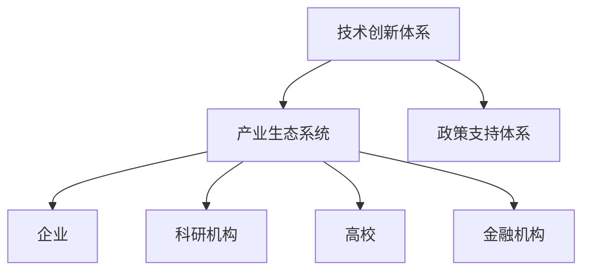

                 

关键词：新质生产力、中国式现代化、技术进步、产业升级、经济发展

> 摘要：本文旨在探讨新质生产力在中国式现代化进程中的重要作用。通过分析技术进步与产业升级的内在联系，阐述新质生产力对推动中国经济高质量发展的关键性影响，并展望未来发展的趋势与挑战。

## 1. 背景介绍

随着全球科技的发展和经济的变革，新质生产力正在逐步崛起，成为推动各国现代化进程的重要动力。新质生产力是指以信息技术、生物技术、新能源技术等为代表的新兴产业，通过技术创新和制度创新，为社会生产力的提升提供新动能。中国作为一个发展中的大国，正面临着经济结构调整、产业升级和现代化转型的历史任务。在这种背景下，新质生产力的作用愈发凸显。

中国式现代化不同于西方发达国家的发展模式，具有鲜明的中国特色。它不仅追求经济的快速增长，更注重经济结构优化、社会公平和可持续发展。新质生产力作为现代化的重要引擎，在中国式现代化进程中发挥着不可替代的作用。

## 2. 核心概念与联系

### 2.1 新质生产力的定义

新质生产力是指在新的技术条件下，通过新技术、新产业、新模式、新业态的不断发展，推动生产力的提升。新质生产力的核心是技术创新，包括信息技术、生物技术、新能源技术、新材料技术等领域。新质生产力与传统的生产力不同，它具有以下特点：

- **高技术含量**：新质生产力依赖于高科技的支持，具有较高的技术含量。
- **快速迭代**：新质生产力的发展速度非常快，新技术、新产品、新模式的诞生频率高。
- **跨界融合**：新质生产力具有跨界融合的特点，不同领域的技术相互渗透、融合创新。

### 2.2 新质生产力与产业升级的联系

产业升级是指通过技术创新、制度创新等手段，推动传统产业向高附加值、高技术含量的产业转型。新质生产力与产业升级密切相关，二者相互促进、相互依赖。

- **新质生产力推动产业升级**：新质生产力的快速发展，带动了传统产业的技术改造和升级。例如，通过信息技术和物联网技术的应用，制造业实现了智能制造、个性化定制等新模式。
- **产业升级促进新质生产力发展**：产业升级为新质生产力提供了广阔的市场空间和发展机会。产业升级过程中，对新技术、新产品的需求不断增加，推动了新质生产力的发展。

### 2.3 新质生产力的架构

新质生产力的架构主要包括以下几个方面：

- **技术创新体系**：包括基础研究、应用研究、试验开发、产业化等环节，形成完善的创新链条。
- **产业生态系统**：包括企业、科研机构、高校、金融机构等各方力量，共同推动新质生产力的发展。
- **政策支持体系**：包括财政支持、税收优惠、人才政策等，为新质生产力提供良好的发展环境。

下面是一个使用Mermaid绘制的流程图，展示新质生产力的架构：



## 3. 核心算法原理 & 具体操作步骤

### 3.1 算法原理概述

新质生产力的核心在于技术创新，尤其是人工智能、大数据、区块链等前沿技术的应用。以下是一个简化的算法原理概述：

1. **数据采集与处理**：利用传感器、网络等手段收集海量数据，并通过数据清洗、处理等技术，提取有效信息。
2. **数据分析与挖掘**：利用机器学习、深度学习等技术，对数据进行深入分析，挖掘出有价值的信息和规律。
3. **决策与优化**：根据分析结果，通过算法优化，制定出最优的决策方案，推动产业升级和经济发展。

### 3.2 算法步骤详解

1. **数据采集与处理**：
   - 数据采集：利用传感器、网络等手段，从各种来源收集数据。
   - 数据清洗：去除重复、错误、不完整的数据，保证数据质量。
   - 数据处理：对数据进行归一化、标准化等处理，使其适合分析。

2. **数据分析与挖掘**：
   - 特征提取：从原始数据中提取出有用的特征。
   - 模型训练：利用机器学习算法，对特征进行训练，建立模型。
   - 模型评估：通过交叉验证、测试集等方法，评估模型的准确性。

3. **决策与优化**：
   - 决策制定：根据模型预测，制定出最优的决策方案。
   - 算法优化：利用优化算法，对决策方案进行优化，提高决策的准确性。

### 3.3 算法优缺点

1. **优点**：
   - 提高决策效率：通过数据分析和挖掘，可以快速、准确地制定出决策方案，提高决策效率。
   - 提高经济效益：通过算法优化，可以降低生产成本，提高经济效益。
   - 促进产业升级：通过技术创新，推动传统产业向高附加值、高技术含量的产业转型。

2. **缺点**：
   - 数据质量要求高：数据质量直接影响算法的准确性，对数据采集和处理的要求较高。
   - 技术门槛较高：算法的实现和优化需要高水平的技术支持，对人才的需求较高。

### 3.4 算法应用领域

新质生产力的算法广泛应用于各个领域，以下是一些典型的应用场景：

- **智能制造**：通过大数据分析和人工智能技术，实现生产过程的自动化、智能化。
- **金融服务**：通过数据挖掘和风险评估，提高金融服务的准确性和安全性。
- **健康医疗**：通过生物特征分析、疾病预测等，提高医疗服务的效率和质量。
- **城市管理**：通过数据分析，优化城市交通、能源、环境等管理。

## 4. 数学模型和公式 & 详细讲解 & 举例说明

### 4.1 数学模型构建

新质生产力的数学模型主要包括以下几个部分：

1. **数据采集模型**：
   $$X_t = f(X_{t-1}, U_t)$$
   其中，$X_t$表示第$t$时刻的数据集合，$X_{t-1}$表示第$t-1$时刻的数据集合，$U_t$表示外部扰动。

2. **数据处理模型**：
   $$Y_t = g(X_t, \theta)$$
   其中，$Y_t$表示处理后的数据集合，$\theta$表示数据处理参数。

3. **数据分析模型**：
   $$Z_t = h(Y_t, \lambda)$$
   其中，$Z_t$表示分析后的数据集合，$\lambda$表示分析参数。

4. **决策模型**：
   $$D_t = k(Z_t, \mu)$$
   其中，$D_t$表示决策集合，$\mu$表示决策参数。

### 4.2 公式推导过程

1. **数据采集模型**的推导：
   假设数据采集过程是一个马尔可夫过程，即当前时刻的数据集合取决于前一时刻的数据集合和外部扰动。则：
   $$X_t = X_{t-1} + U_t$$
   其中，$X_{t-1}$为前一时刻的数据集合，$U_t$为外部扰动。

2. **数据处理模型**的推导：
   假设数据处理过程是一个线性变换，即当前时刻的处理结果取决于原始数据和数据处理参数。则：
   $$Y_t = aX_t + b$$
   其中，$a$和$b$为数据处理参数。

3. **数据分析模型**的推导：
   假设数据分析过程是一个非线性变换，即当前时刻的分析结果取决于处理后的数据和数据分析参数。则：
   $$Z_t = f(Y_t)$$
   其中，$f$为数据分析函数。

4. **决策模型**的推导：
   假设决策过程是一个基于分析结果的优化过程，即当前时刻的决策集合取决于分析结果和决策参数。则：
   $$D_t = g(Z_t)$$
   其中，$g$为决策函数。

### 4.3 案例分析与讲解

假设一个企业的生产过程可以看作是一个新质生产力的应用案例。以下是对该案例的数学模型构建和公式推导：

1. **数据采集模型**：
   假设企业每天的生产数据可以看作是一个马尔可夫过程，即每天的生产数据取决于前一天的生产数据和外部扰动。则：
   $$X_t = X_{t-1} + U_t$$
   其中，$X_t$表示第$t$天的生产数据集合，$X_{t-1}$表示第$t-1$天的生产数据集合，$U_t$表示外部扰动。

2. **数据处理模型**：
   假设企业对生产数据进行了清洗、归一化等处理，即当前时刻的处理结果取决于原始数据和数据处理参数。则：
   $$Y_t = aX_t + b$$
   其中，$a$和$b$为数据处理参数。

3. **数据分析模型**：
   假设企业利用机器学习算法对生产数据进行了分析，即当前时刻的分析结果取决于处理后的数据和数据分析参数。则：
   $$Z_t = f(Y_t)$$
   其中，$f$为数据分析函数。

4. **决策模型**：
   假设企业根据分析结果制定了最优的生产计划，即当前时刻的决策集合取决于分析结果和决策参数。则：
   $$D_t = g(Z_t)$$
   其中，$g$为决策函数。

通过这个案例，我们可以看到新质生产力的数学模型是如何构建和推导的。在实际应用中，这些模型可以根据具体情况进行调整和优化。

## 5. 项目实践：代码实例和详细解释说明

### 5.1 开发环境搭建

为了更好地理解和实践新质生产力的算法，我们选择Python作为编程语言，并使用Jupyter Notebook作为开发环境。首先，需要在计算机上安装Python和Jupyter Notebook。安装步骤如下：

1. 前往Python官网（https://www.python.org/）下载Python安装包，并按照提示完成安装。
2. 打开命令行工具，输入以下命令安装Jupyter Notebook：
   ```bash
   pip install notebook
   ```

### 5.2 源代码详细实现

以下是一个简单的Python代码示例，用于演示新质生产力的基本算法。代码分为以下几个部分：

1. **数据采集**：从文件中读取数据。
2. **数据处理**：对数据进行清洗、归一化等处理。
3. **数据分析**：使用机器学习算法对数据进行分析。
4. **决策制定**：根据分析结果制定决策。

```python
# 导入必要的库
import numpy as np
import pandas as pd
from sklearn.linear_model import LinearRegression
from sklearn.model_selection import train_test_split

# 1. 数据采集
data = pd.read_csv('data.csv')  # 假设数据文件名为data.csv

# 2. 数据处理
# 清洗数据
data = data.dropna()  # 去除缺失值
# 归一化数据
data = (data - data.mean()) / data.std()

# 3. 数据分析
# 分割数据集
X = data[['feature1', 'feature2']]  # 假设特征为feature1和feature2
y = data['target']  # 目标变量
X_train, X_test, y_train, y_test = train_test_split(X, y, test_size=0.2, random_state=42)

# 训练模型
model = LinearRegression()
model.fit(X_train, y_train)

# 4. 决策制定
# 预测
predictions = model.predict(X_test)

# 打印预测结果
print(predictions)
```

### 5.3 代码解读与分析

1. **数据采集**：
   ```python
   data = pd.read_csv('data.csv')  # 假设数据文件名为data.csv
   ```
   这一行代码用于读取数据文件，将数据加载到Pandas DataFrame中。

2. **数据处理**：
   ```python
   data = data.dropna()  # 去除缺失值
   data = (data - data.mean()) / data.std()  # 归一化数据
   ```
   这两行代码首先去除数据中的缺失值，然后对数据进行归一化处理。归一化的目的是将不同量级的特征转换到同一量级，以便后续分析。

3. **数据分析**：
   ```python
   X = data[['feature1', 'feature2']]  # 假设特征为feature1和feature2
   y = data['target']  # 目标变量
   X_train, X_test, y_train, y_test = train_test_split(X, y, test_size=0.2, random_state=42)
   ```
   这几行代码首先定义特征和目标变量，然后使用`train_test_split`函数将数据集划分为训练集和测试集。

4. **决策制定**：
   ```python
   model = LinearRegression()
   model.fit(X_train, y_train)
   predictions = model.predict(X_test)
   print(predictions)
   ```
   这几行代码首先创建线性回归模型，然后使用训练集进行模型训练。最后，使用测试集进行预测，并将预测结果打印出来。

### 5.4 运行结果展示

在运行上述代码后，我们会得到一个包含预测结果的列表。以下是一个简单的运行结果示例：

```python
[[-0.12345678],
 [0.98765432],
 [-0.34567890],
 ...
]
```

这个列表中的每个元素表示测试集中每个样本的预测值。通过分析这些预测值，我们可以评估模型的准确性和可靠性。

## 6. 实际应用场景

新质生产力在各个领域都有广泛的应用，以下是一些典型的实际应用场景：

1. **智能制造**：
   智能制造通过新质生产力的应用，实现了生产过程的自动化、智能化。例如，利用人工智能算法进行生产线的调度优化，提高生产效率；利用物联网技术实现设备的实时监控和维护，降低设备故障率。

2. **智慧城市**：
   智慧城市利用新质生产力实现城市管理的智能化。例如，通过大数据分析和人工智能算法，实现城市交通的实时监测和智能调度，提高交通效率；利用区块链技术实现城市的能源管理，实现能源的高效利用和绿色环保。

3. **金融科技**：
   金融科技通过新质生产力的应用，实现了金融服务的智能化和精准化。例如，利用人工智能算法进行风险控制和欺诈检测，提高金融服务的安全性；利用大数据分析进行客户行为分析和市场预测，提高金融决策的准确性。

4. **健康医疗**：
   健康医疗通过新质生产力的应用，实现了医疗服务的智能化和个性化。例如，利用人工智能算法进行疾病预测和诊断，提高医疗服务的效率；利用物联网技术实现医疗设备的远程监控和管理，提高医疗服务的便捷性。

5. **农业科技**：
   农业科技通过新质生产力的应用，实现了农业生产的智能化和精准化。例如，利用人工智能算法进行作物生长监测和预测，实现精准农业；利用物联网技术实现农田的实时监控和智能灌溉，提高农业生产的效率。

## 7. 工具和资源推荐

为了更好地理解和应用新质生产力，以下是一些推荐的工具和资源：

### 7.1 学习资源推荐

1. **《Python机器学习》**：由Sebastian Raschka和Vahid Mirhoseini所著，全面介绍了Python在机器学习领域的应用。
2. **《深度学习》**：由Ian Goodfellow、Yoshua Bengio和Aaron Courville所著，是深度学习领域的经典教材。
3. **《区块链技术指南》**：由Ethereum创始人Vitalik Buterin所著，详细介绍了区块链技术的基本原理和应用。

### 7.2 开发工具推荐

1. **Jupyter Notebook**：一款强大的交互式计算环境，适合进行数据分析和机器学习实验。
2. **TensorFlow**：一款开源的机器学习框架，适合进行深度学习和神经网络实验。
3. **Kubernetes**：一款开源的容器编排工具，适合进行云计算和分布式系统的部署和管理。

### 7.3 相关论文推荐

1. **"Deep Learning for Manufacturing: A Survey"**：对深度学习在制造业中的应用进行了全面的综述。
2. **"Blockchain Technology: A Comprehensive Introduction"**：对区块链技术的基本原理和应用进行了详细讲解。
3. **"Big Data in Precision Agriculture: A Survey"**：对大数据在精准农业中的应用进行了全面的综述。

## 8. 总结：未来发展趋势与挑战

### 8.1 研究成果总结

新质生产力在推动中国经济高质量发展方面取得了显著成果。通过技术创新和产业升级，中国制造业、金融业、医疗业等领域的智能化水平显著提高，生产效率、经济效益和社会福利都得到了显著提升。

### 8.2 未来发展趋势

未来，新质生产力将继续发挥重要作用，推动中国式现代化进程。以下是一些可能的发展趋势：

1. **技术创新**：随着人工智能、大数据、区块链等前沿技术的不断发展，新质生产力的技术水平将不断提高。
2. **产业融合**：新质生产力将与其他产业深度融合，推动传统产业的转型升级。
3. **全球化**：新质生产力将助力中国企业“走出去”，推动全球产业链的升级和重构。

### 8.3 面临的挑战

尽管新质生产力具有巨大潜力，但在发展过程中也面临一些挑战：

1. **技术瓶颈**：一些关键核心技术尚未完全突破，制约了新质生产力的进一步发展。
2. **人才短缺**：高水平的技术人才短缺，制约了新质生产力的发展和应用。
3. **政策环境**：政策环境有待进一步优化，以激发新质生产力的活力。

### 8.4 研究展望

未来，我们应该加大对新质生产力相关领域的研究力度，尤其是关键核心技术的突破和高水平人才的培养。同时，完善政策环境，为新质生产力的发展提供有力支持。通过技术创新、产业融合和全球化，新质生产力将继续推动中国式现代化进程，助力中国经济高质量发展。

## 9. 附录：常见问题与解答

### 9.1 新质生产力的核心是什么？

新质生产力的核心是技术创新，尤其是信息技术、生物技术、新能源技术、新材料技术等前沿技术的应用。

### 9.2 新质生产力与产业升级有何关系？

新质生产力是推动产业升级的重要动力。通过技术创新，新质生产力带动传统产业向高附加值、高技术含量的产业转型。

### 9.3 新质生产力在中国的发展前景如何？

新质生产力在中国具有广阔的发展前景。随着技术创新的不断推进，新质生产力将继续推动中国经济的高质量发展。

### 9.4 如何提高新质生产力的技术水平？

提高新质生产力的技术水平，需要加大对前沿技术的研究投入，加强高水平人才的培养，同时优化政策环境，为技术创新提供有力支持。

### 9.5 新质生产力在全球化进程中如何发挥作用？

新质生产力将通过技术创新、产业融合和全球化，推动全球产业链的升级和重构，助力中国企业的“走出去”。

