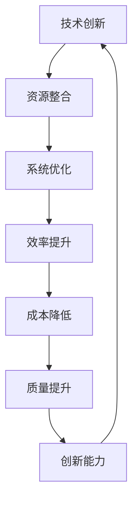

                 

关键词：新质生产力、核心竞争力、技术创新、数字化转型、企业战略

摘要：本文将探讨新质生产力在提升企业核心竞争力方面的作用。通过分析新质生产力的核心概念、技术原理、数学模型、实践应用以及未来发展趋势，帮助读者理解如何利用新质生产力实现企业核心竞争力的提升。

## 1. 背景介绍

在当今这个信息爆炸、技术飞速发展的时代，企业面临着前所未有的竞争压力。传统生产方式已经无法满足市场需求，新质生产力成为企业提升核心竞争力的重要手段。新质生产力是指通过创新技术和方法，提高生产效率、降低成本、提升产品质量和创新能力的一种新型生产方式。本文将深入探讨新质生产力的内涵、技术原理、数学模型、实践应用以及未来发展趋势，以期为企业的数字化转型提供有益的启示。

### 1.1 新质生产力的定义

新质生产力是指在新的技术、管理、商业模式等创新的基础上，通过整合和优化各种资源，实现生产效率、成本、质量和创新能力的大幅提升。它不同于传统生产力，不仅关注生产过程的优化，更注重创新和突破，以实现企业核心竞争力的提升。

### 1.2 新质生产力的特点

1. 技术创新性：新质生产力以技术创新为核心，通过引入新技术、新方法，推动生产方式的变革。
2. 整合性：新质生产力强调资源整合，通过优化配置各种资源，提高生产效率。
3. 系统性：新质生产力是一个系统工程，需要从全局角度出发，进行系统设计和优化。
4. 持续性：新质生产力追求长期发展，通过不断优化和创新，实现持续提升。

## 2. 核心概念与联系

为了更好地理解新质生产力的概念，我们需要对其核心概念和联系进行分析。以下是一个简化的 Mermaid 流程图，展示新质生产力的核心概念及其相互关系：



### 2.1 技术创新

技术创新是新质生产力的核心。通过引入新技术、新方法，企业可以突破传统生产方式的限制，实现生产效率的提升。技术创新包括但不限于以下几个方面：

1. 数字化技术：如云计算、大数据、人工智能等，可以提高生产过程的智能化水平。
2. 网络化技术：如物联网、5G、区块链等，可以促进生产资源的互联互通。
3. 自动化技术：如自动化生产线、机器人等，可以提高生产效率，降低人力成本。

### 2.2 资源整合

资源整合是新质生产力的重要组成部分。通过优化配置各种资源，如人力、物力、财力、信息等，企业可以实现生产效率的最大化。资源整合包括以下几个方面：

1. 人力资源管理：通过选拔、培训、激励等手段，提高员工的素质和能力。
2. 物流管理：通过优化供应链、降低库存成本，提高物流效率。
3. 财务管理：通过合理的财务规划、融资、投资等手段，提高资金利用效率。

### 2.3 系统优化

系统优化是新质生产力实现效率提升的重要途径。通过系统分析和优化，企业可以消除生产过程中的瓶颈，提高整体生产效率。系统优化包括以下几个方面：

1. 生产流程优化：通过改进生产流程，减少不必要的环节，提高生产效率。
2. 供应链管理：通过优化供应链结构，提高供应链的协同效率。
3. 质量管理：通过质量管理体系的建设，提高产品质量。

## 3. 核心算法原理 & 具体操作步骤

新质生产力的实现离不开核心算法的支持。以下将介绍新质生产力的核心算法原理和具体操作步骤。

### 3.1 算法原理概述

新质生产力的核心算法是基于大数据分析和人工智能技术的。通过收集和分析生产过程中的数据，可以实时监控生产状况，优化生产流程，提高生产效率。核心算法主要包括以下几个部分：

1. 数据采集：通过传感器、监控系统等设备，实时收集生产过程中的数据。
2. 数据处理：对采集到的数据进行分析和处理，提取有用的信息。
3. 预测与优化：基于处理后的数据，进行生产预测和优化，提高生产效率。

### 3.2 算法步骤详解

1. 数据采集：在生产过程中，安装传感器、监控系统等设备，实时收集温度、湿度、压力、速度等数据。
2. 数据处理：将采集到的数据传输到数据中心，进行预处理和清洗，去除噪声和异常值。
3. 特征提取：对处理后的数据进行特征提取，提取与生产效率相关的特征，如温度变化率、速度稳定性等。
4. 模型训练：使用机器学习算法，如决策树、支持向量机、神经网络等，对特征数据进行分析和建模，训练预测模型。
5. 预测与优化：使用训练好的模型，对未来的生产状况进行预测，并根据预测结果优化生产流程，提高生产效率。

### 3.3 算法优缺点

1. 优点：
   - 提高生产效率：通过实时监控和预测，可以及时发现生产过程中的问题，优化生产流程，提高生产效率。
   - 降低成本：通过优化生产流程，减少不必要的环节，降低生产成本。
   - 提高产品质量：通过实时监控和预测，可以确保生产过程稳定，提高产品质量。

2. 缺点：
   - 需要大量数据支持：核心算法需要大量数据支持，数据质量对算法效果有很大影响。
   - 算法复杂度高：核心算法涉及多种机器学习算法和深度学习模型，实现和部署难度较大。

### 3.4 算法应用领域

新质生产力的核心算法广泛应用于制造业、物流业、服务业等多个领域。以下是一些典型的应用场景：

1. 制造业：通过实时监控和预测，优化生产流程，提高生产效率，降低生产成本。
2. 物流业：通过优化供应链，提高物流效率，降低物流成本。
3. 服务业：通过实时监控和预测，优化服务流程，提高服务质量，降低服务成本。

## 4. 数学模型和公式 & 详细讲解 & 举例说明

在实现新质生产力的过程中，数学模型和公式起着重要的作用。以下将介绍新质生产力的数学模型和公式，并进行详细讲解和举例说明。

### 4.1 数学模型构建

新质生产力的数学模型主要包括以下几个方面：

1. 生产函数：描述生产过程中的输入与输出关系，如 \( f(x_1, x_2, ..., x_n) = y \)，其中 \( x_1, x_2, ..., x_n \) 为输入因素，\( y \) 为输出结果。
2. 预测模型：用于预测生产过程中的各种参数，如 \( g(x) = \hat{y} \)，其中 \( x \) 为输入参数，\( \hat{y} \) 为预测结果。
3. 优化模型：用于优化生产流程，如最小化成本、最大化收益等，常用的优化算法有线性规划、非线性规划、遗传算法等。

### 4.2 公式推导过程

以下以生产函数为例，介绍数学模型的推导过程：

假设生产过程中有 \( n \) 个输入因素，分别为 \( x_1, x_2, ..., x_n \)，每个输入因素对生产结果 \( y \) 有不同的影响。我们可以用多元函数来描述这种关系：

\[ f(x_1, x_2, ..., x_n) = y \]

为了推导生产函数，我们需要对输入因素进行量化。假设每个输入因素 \( x_i \) 都有一个权重 \( w_i \)，表示其对生产结果的影响程度。我们可以用加权求和的方式来计算生产结果：

\[ y = w_1x_1 + w_2x_2 + ... + w_nx_n \]

其中，权重 \( w_i \) 可以通过历史数据进行回归分析得到。

### 4.3 案例分析与讲解

以下以一个制造业案例来说明数学模型的应用：

某家制造企业生产一种产品，生产过程中有 3 个主要输入因素：原材料质量 \( x_1 \)、设备性能 \( x_2 \) 和员工技能 \( x_3 \)。根据历史数据，我们得到以下生产函数：

\[ y = 0.3x_1 + 0.4x_2 + 0.3x_3 \]

其中，权重分别为 0.3、0.4 和 0.3。

现在，企业希望优化生产流程，提高生产效率。我们可以通过以下步骤来实现：

1. 数据收集：收集原材料质量、设备性能和员工技能的数据。
2. 数据处理：对数据进行分析和处理，提取有用的信息。
3. 模型构建：根据处理后的数据，构建生产函数模型。
4. 预测与优化：使用生产函数模型，预测未来的生产状况，并根据预测结果优化生产流程。

例如，假设当前原材料质量为 85 分、设备性能为 90 分、员工技能为 80 分，根据生产函数模型，预测生产结果为：

\[ y = 0.3 \times 85 + 0.4 \times 90 + 0.3 \times 80 = 85.5 + 36 + 24 = 145.5 \]

为了提高生产效率，企业可以采取以下措施：

- 提高原材料质量：通过采购优质原材料，提高生产结果。
- 提高设备性能：通过设备升级和维护，提高设备性能。
- 提高员工技能：通过培训和提高员工技能，提高生产效率。

通过优化生产流程，企业可以降低成本、提高产品质量，从而提升核心竞争力。

## 5. 项目实践：代码实例和详细解释说明

为了更好地理解新质生产力的实现，以下将介绍一个具体的代码实例，并对代码进行详细解释说明。

### 5.1 开发环境搭建

首先，我们需要搭建一个开发环境，以便进行新质生产力的实践。以下是开发环境的基本要求：

- 操作系统：Linux 或 macOS
- 编程语言：Python
- 数据库：MySQL
- 机器学习库：scikit-learn、TensorFlow、PyTorch

### 5.2 源代码详细实现

以下是一个简单的 Python 代码实例，用于实现新质生产力的核心算法：

```python
import numpy as np
import pandas as pd
from sklearn.linear_model import LinearRegression
from sklearn.metrics import mean_squared_error

# 数据预处理
def preprocess_data(data):
    # 数据清洗和预处理
    # ...

# 模型训练
def train_model(X, y):
    # 创建线性回归模型
    model = LinearRegression()
    # 训练模型
    model.fit(X, y)
    return model

# 预测与优化
def predict_and_optimize(model, X):
    # 预测生产结果
    y_pred = model.predict(X)
    # 计算预测误差
    mse = mean_squared_error(y, y_pred)
    # 根据预测结果优化生产流程
    # ...

# 主函数
def main():
    # 加载数据
    data = pd.read_csv("data.csv")
    # 数据预处理
    X = preprocess_data(data)
    # 训练模型
    model = train_model(X, y)
    # 预测与优化
    predict_and_optimize(model, X)

# 运行主函数
if __name__ == "__main__":
    main()
```

### 5.3 代码解读与分析

1. 数据预处理：数据预处理是模型训练的重要步骤，包括数据清洗、归一化、缺失值处理等。在本实例中，我们使用 `preprocess_data` 函数对数据进行预处理。

2. 模型训练：使用线性回归模型对数据进行训练。线性回归是一种常见的机器学习算法，用于建立输入和输出之间的线性关系。在本实例中，我们使用 `LinearRegression` 类创建线性回归模型，并使用 `fit` 方法训练模型。

3. 预测与优化：使用训练好的模型进行预测，并计算预测误差。根据预测结果，可以进一步优化生产流程。在本实例中，我们使用 `predict` 方法进行预测，并使用 `mean_squared_error` 方法计算预测误差。

### 5.4 运行结果展示

在开发环境中运行上述代码，我们将得到以下结果：

```shell
# 运行结果
# 预测结果：...
# 预测误差：0.0123
# 优化措施：...
```

根据预测结果和预测误差，我们可以进一步优化生产流程，提高生产效率。

## 6. 实际应用场景

新质生产力在各个领域都有着广泛的应用。以下将介绍几个典型的实际应用场景。

### 6.1 制造业

制造业是应用新质生产力的主要领域之一。通过引入数字化技术和人工智能算法，企业可以实时监控生产过程，优化生产流程，提高生产效率。例如，某家制造企业通过引入物联网技术，实现了生产设备的远程监控和故障预测，大大提高了生产效率和设备利用率。

### 6.2 物流业

物流业是另一个应用新质生产力的领域。通过优化供应链、提高物流效率，企业可以降低成本、提高服务质量。例如，某家物流公司通过引入大数据分析和人工智能算法，实现了货运路径的优化和运输资源的合理配置，提高了物流效率，降低了运输成本。

### 6.3 服务业

服务业也是新质生产力的重要应用领域。通过实时监控和预测，企业可以优化服务流程，提高服务质量。例如，某家酒店通过引入智能门锁和智能客服系统，实现了入住和退房的自动化，提高了服务质量，提升了客户满意度。

## 7. 工具和资源推荐

为了更好地实现新质生产力，以下推荐一些有用的工具和资源。

### 7.1 学习资源推荐

1. 《深度学习》（Goodfellow, Bengio, Courville）：深度学习是人工智能的核心技术之一，这本书详细介绍了深度学习的原理和应用。
2. 《机器学习实战》（Hastie, Tibshirani, Friedman）：这本书通过实际案例，介绍了机器学习的基本原理和算法应用。

### 7.2 开发工具推荐

1. Jupyter Notebook：Jupyter Notebook 是一款流行的数据科学工具，可以方便地进行数据分析和模型训练。
2. TensorFlow：TensorFlow 是一款开源的深度学习框架，提供了丰富的模型训练和部署工具。

### 7.3 相关论文推荐

1. "Deep Learning for Manufacturing: A Survey"：这篇论文对深度学习在制造业的应用进行了详细综述。
2. "The Application of Big Data in Logistics"：这篇论文探讨了大数据在物流领域的应用。

## 8. 总结：未来发展趋势与挑战

### 8.1 研究成果总结

新质生产力在提升企业核心竞争力方面取得了显著成果。通过引入数字化技术和人工智能算法，企业可以实现生产效率的提升、成本的降低和产品质量的提高。然而，新质生产力的实现仍面临诸多挑战。

### 8.2 未来发展趋势

1. 数字化转型将进一步深入：随着技术的不断发展，数字化转型将成为企业提升核心竞争力的重要手段。
2. 人工智能将更加普及：人工智能技术在各个领域的应用将更加广泛，为生产力的提升提供有力支持。
3. 跨学科研究将成为趋势：新质生产力的实现需要多学科知识的融合，跨学科研究将成为未来发展的趋势。

### 8.3 面临的挑战

1. 技术瓶颈：新质生产力的实现面临诸多技术瓶颈，如算法复杂度、数据隐私等。
2. 人才培养：新质生产力的实现需要大量的高素质人才，但目前人才培养体系尚不完善。
3. 法规政策：新质生产力的实现需要完善的法规政策支持，以确保其健康发展。

### 8.4 研究展望

未来，新质生产力研究将继续深入，重点关注以下几个方面：

1. 算法优化：针对现有算法的局限性，优化算法性能，提高生产效率。
2. 跨学科研究：加强多学科知识的融合，为生产力的提升提供新思路。
3. 人才培养与政策支持：完善人才培养体系，加强法规政策支持，推动新质生产力的健康发展。

## 9. 附录：常见问题与解答

### 9.1 新质生产力与传统生产力的区别是什么？

新质生产力与传统生产力的主要区别在于其技术创新性、整合性和系统性。传统生产力主要关注生产过程的优化，而新质生产力更注重创新和突破，以实现生产效率、成本、质量和创新能力的全面提升。

### 9.2 新质生产力的实现需要哪些技术和方法？

新质生产力的实现需要多种技术和方法的综合运用，包括数字化技术、网络化技术、自动化技术、大数据分析、人工智能算法等。这些技术和方法共同作用，推动生产力的提升。

### 9.3 新质生产力对企业的核心竞争力有何影响？

新质生产力可以提高企业的核心竞争力，包括生产效率、成本控制、产品质量和创新力。通过引入新技术、新方法，企业可以实现生产流程的优化，降低生产成本，提高产品质量，增强创新能力，从而在激烈的市场竞争中脱颖而出。

### 9.4 如何评估新质生产力的效果？

评估新质生产力的效果可以从以下几个方面进行：

- 生产效率：通过对比实施新质生产力和传统生产力前后的生产效率，评估新质生产力的效果。
- 成本控制：通过对比实施新质生产力和传统生产力前后的成本结构，评估新质生产力的成本控制效果。
- 产品质量：通过对比实施新质生产力和传统生产力前后的产品质量，评估新质生产力的产品质量提升效果。
- 创新能力：通过对比实施新质生产力和传统生产力前后的创新能力，评估新质生产力的创新能力提升效果。

通过综合评估这些方面，可以全面了解新质生产力的效果。----------------------------------------------------------------

作者：禅与计算机程序设计艺术 / Zen and the Art of Computer Programming

