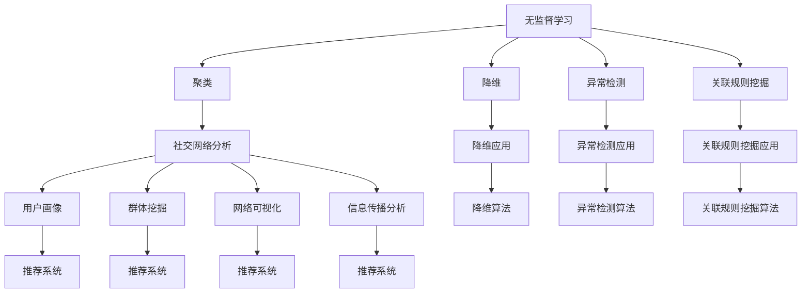

                 

关键词：无监督学习，社交网络分析，推荐系统，算法应用，数学模型，项目实践

> 摘要：本文将探讨无监督学习在社交网络分析和推荐系统中的应用，详细阐述其核心概念、算法原理、数学模型以及项目实践。通过深入分析，我们期望为读者提供一个全面而具体的无监督学习应用指南，帮助其在实际项目中实现技术突破。

## 1. 背景介绍

随着互联网的普及和信息爆炸，社交网络和推荐系统成为了当今社会中不可或缺的一部分。无论是社交媒体平台如Facebook、Twitter，还是电子商务网站如Amazon、淘宝，都利用社交网络分析和推荐系统来优化用户体验，提高用户参与度和销售额。

无监督学习作为机器学习的一个重要分支，其核心在于通过算法自动地从数据中挖掘模式、结构和关系，无需人工干预。传统的监督学习依赖于标签数据进行训练，而社交网络分析和推荐系统往往面临数据稀疏、标签不完整等问题，这使得无监督学习成为一种更合适的选择。

本文旨在探讨无监督学习在社交网络分析和推荐系统中的具体应用，包括核心概念、算法原理、数学模型以及项目实践。通过本文的阅读，读者将能够深入理解无监督学习的本质，掌握其应用方法，并为未来的研究和实践提供参考。

## 2. 核心概念与联系

### 2.1 无监督学习

无监督学习是一种机器学习方法，其核心思想是从未标记的数据集中自动发现数据中的隐含模式或结构。与监督学习相比，无监督学习不需要预先标记的数据，因此更适用于处理大规模、数据标签稀疏或无法获取标签的场景。

无监督学习的主要目标包括聚类、降维、异常检测和关联规则挖掘等。其中，聚类是将相似的数据点分组，以便更好地理解和分析数据；降维是通过减少数据维度来提高数据处理效率和性能；异常检测则是识别数据中的异常值或离群点，有助于发现潜在的欺诈行为或系统故障；关联规则挖掘则是发现数据之间的关联性，用于推荐系统等应用。

### 2.2 社交网络分析

社交网络分析是研究社交网络中个体及其关系的分析方法。通过分析社交网络，我们可以了解个体之间的互动模式、信息传播路径、影响力分布等关键特征。

社交网络分析的主要应用包括：

- 用户画像：通过分析用户的社交行为和兴趣，构建用户画像，以便为用户提供个性化的推荐和服务。
- 群体挖掘：识别具有相似兴趣或特征的群体，便于进行精准营销和社区运营。
- 网络可视化：通过图形化展示社交网络，帮助用户理解社交网络的结构和关系。
- 信息传播分析：研究信息在社交网络中的传播路径和速度，为传播策略制定提供依据。

### 2.3 推荐系统

推荐系统是一种利用用户历史行为和偏好，为用户推荐相关产品、内容或服务的信息系统。推荐系统的核心在于通过分析用户行为数据，发现用户之间的相似性，从而为用户提供个性化的推荐。

推荐系统的主要应用包括：

- 电子商务：通过推荐系统，为用户提供个性化的商品推荐，提高用户购物体验和销售额。
- 媒体内容：通过推荐系统，为用户提供个性化的新闻、音乐、视频等推荐，提高用户粘性和活跃度。
- 社交网络：通过推荐系统，为用户提供可能感兴趣的朋友、群组和内容，促进社交互动和社区建设。

### 2.4 核心概念原理和架构的 Mermaid 流程图



## 3. 核心算法原理 & 具体操作步骤

### 3.1 算法原理概述

在无监督学习中，常见的算法包括聚类算法、降维算法、异常检测算法和关联规则挖掘算法。每种算法都有其独特的原理和应用场景。

- **聚类算法**：聚类算法的目标是将数据点分为多个类别，使得同一类别的数据点之间的相似性较高，不同类别的数据点之间的相似性较低。常见的聚类算法包括K-means、层次聚类、DBSCAN等。
- **降维算法**：降维算法的目标是将高维数据转换为低维数据，同时保留数据的关键信息。常见的降维算法包括主成分分析（PCA）、线性判别分析（LDA）和t-SNE等。
- **异常检测算法**：异常检测算法的目标是识别数据中的异常值或离群点，以发现潜在的欺诈行为或系统故障。常见的异常检测算法包括基于统计学的方法、基于聚类的方法和基于深度学习的方法等。
- **关联规则挖掘算法**：关联规则挖掘算法的目标是发现数据之间的关联性，以构建推荐系统或进行市场营销等应用。常见的关联规则挖掘算法包括Apriori算法、FP-growth算法和Eclat算法等。

### 3.2 算法步骤详解

#### 3.2.1 聚类算法

1. **初始化**：随机选择K个数据点作为初始聚类中心。
2. **分配数据点**：计算每个数据点到各个聚类中心的距离，将数据点分配到距离最近的聚类中心所在的类别。
3. **更新聚类中心**：计算每个类别的均值，作为新的聚类中心。
4. **迭代**：重复步骤2和步骤3，直至聚类中心不再变化或达到最大迭代次数。

#### 3.2.2 降维算法

1. **特征提取**：计算数据点的协方差矩阵。
2. **特征选择**：计算协方差矩阵的特征值和特征向量，选择具有最大特征值的特征向量作为新特征。
3. **特征转换**：将原始数据点映射到新特征空间。

#### 3.2.3 异常检测算法

1. **训练模型**：使用正常数据训练异常检测模型。
2. **模型评估**：使用测试数据评估模型性能，调整模型参数。
3. **异常检测**：使用训练好的模型对数据点进行异常检测，标记异常值或离群点。

#### 3.2.4 关联规则挖掘算法

1. **数据预处理**：将交易数据转换为项集列表。
2. **频繁项集挖掘**：使用Apriori算法或FP-growth算法挖掘频繁项集。
3. **关联规则生成**：从频繁项集中生成关联规则。
4. **规则评估**：计算规则的支持度和置信度，筛选高质量规则。

### 3.3 算法优缺点

- **聚类算法**：优点包括简单易实现、灵活性较高；缺点包括对初始聚类中心敏感、难以确定聚类数量。
- **降维算法**：优点包括降低数据维度、提高数据处理效率；缺点包括可能损失数据信息、对异常值敏感。
- **异常检测算法**：优点包括实时性强、适用于大规模数据；缺点包括模型参数调优困难、易受噪声干扰。
- **关联规则挖掘算法**：优点包括可解释性强、适用范围广泛；缺点包括计算复杂度高、难以处理高维数据。

### 3.4 算法应用领域

- **聚类算法**：在用户画像、市场细分、图像分割等领域有广泛应用。
- **降维算法**：在数据可视化、机器学习算法优化、图像处理等领域有广泛应用。
- **异常检测算法**：在网络安全、金融风控、医疗诊断等领域有广泛应用。
- **关联规则挖掘算法**：在推荐系统、市场营销、电商运营等领域有广泛应用。

## 4. 数学模型和公式

### 4.1 数学模型构建

在无监督学习中，常用的数学模型包括距离度量、相似性度量、概率分布等。以下分别介绍这些模型的构建方法。

#### 4.1.1 距离度量

距离度量是衡量数据点之间相似性的关键。常见的距离度量方法包括欧氏距离、曼哈顿距离和切比雪夫距离等。

- **欧氏距离**：$$d(x, y) = \sqrt{\sum_{i=1}^{n}(x_i - y_i)^2}$$
- **曼哈顿距离**：$$d(x, y) = \sum_{i=1}^{n}|x_i - y_i|$$
- **切比雪夫距离**：$$d(x, y) = \max_{1 \leq i \leq n}|x_i - y_i|$$

#### 4.1.2 相似性度量

相似性度量是衡量数据点之间相似性的量化方法。常见的相似性度量方法包括余弦相似性、皮尔逊相关系数和Jaccard相似性等。

- **余弦相似性**：$$\cos\theta = \frac{x \cdot y}{\|x\|\|y\|}$$
- **皮尔逊相关系数**：$$r = \frac{\sum_{i=1}^{n}(x_i - \bar{x})(y_i - \bar{y})}{\sqrt{\sum_{i=1}^{n}(x_i - \bar{x})^2 \sum_{i=1}^{n}(y_i - \bar{y})^2}}$$
- **Jaccard相似性**：$$J(x, y) = \frac{|X \cap Y|}{|X \cup Y|}$$

#### 4.1.3 概率分布

概率分布是描述随机变量取值概率分布的数学模型。在无监督学习中，常用的概率分布包括正态分布、伯努利分布和多项式分布等。

- **正态分布**：$$f(x|\mu, \sigma^2) = \frac{1}{\sqrt{2\pi\sigma^2}}e^{-\frac{(x-\mu)^2}{2\sigma^2}}$$
- **伯努利分布**：$$p(x|\pi) = \pi^x(1-\pi)^{1-x}$$
- **多项式分布**：$$p(x|\pi) = \prod_{i=1}^{n}\pi_i^{x_i}$$

### 4.2 公式推导过程

在无监督学习中，许多公式都是基于统计学和概率论的基本原理推导得到的。以下以聚类算法中的K-means为例，介绍其公式推导过程。

#### 4.2.1 K-means算法

K-means算法是一种基于距离度量的聚类算法。其基本思想是初始化K个聚类中心，然后不断迭代更新聚类中心，直至收敛。

1. **初始化**：随机选择K个数据点作为初始聚类中心。
2. **分配数据点**：计算每个数据点到各个聚类中心的距离，将数据点分配到距离最近的聚类中心所在的类别。
3. **更新聚类中心**：计算每个类别的均值，作为新的聚类中心。
4. **迭代**：重复步骤2和步骤3，直至聚类中心不再变化或达到最大迭代次数。

#### 4.2.2 公式推导

假设数据集为$X = \{x_1, x_2, \ldots, x_n\}$，聚类中心为$C = \{c_1, c_2, \ldots, c_K\}$。则K-means算法的目标是最小化目标函数：

$$J = \sum_{i=1}^{n}\sum_{k=1}^{K}w_{ik}(x_i - c_k)^2$$

其中，$w_{ik}$表示数据点$x_i$属于聚类中心$c_k$的权重。

为了推导目标函数的梯度，我们先计算目标函数关于聚类中心$c_k$的偏导数：

$$\frac{\partial J}{\partial c_k} = \sum_{i=1}^{n}w_{ik}(x_i - c_k)$$

为了计算权重$w_{ik}$，我们引入距离度量$d(x, y)$，即：

$$w_{ik} = \frac{1}{\sum_{j=1}^{K}d(x_i, c_j)}$$

代入目标函数的梯度中，得到：

$$\frac{\partial J}{\partial c_k} = \sum_{i=1}^{n}\frac{1}{\sum_{j=1}^{K}d(x_i, c_j)}(x_i - c_k)$$

为了使目标函数最小化，我们需要求解梯度为0的聚类中心：

$$\frac{\partial J}{\partial c_k} = 0$$

从而得到每个类别的均值：

$$c_k = \frac{1}{N_k}\sum_{i=1}^{n}x_i$$

其中，$N_k$表示属于聚类中心$c_k$的数据点数量。

#### 4.2.3 案例分析与讲解

假设有5个数据点$X = \{x_1, x_2, x_3, x_4, x_5\}$，我们需要将其分为2个类别。首先随机选择2个数据点作为初始聚类中心：

$$C = \{c_1, c_2\} = \{x_1, x_3\}$$

然后计算每个数据点到聚类中心的距离：

$$d(x_i, c_1) = \sqrt{(x_i - c_1)^2} = \sqrt{(x_i - x_1)^2}$$

$$d(x_i, c_2) = \sqrt{(x_i - c_2)^2} = \sqrt{(x_i - x_3)^2}$$

接下来计算权重：

$$w_{i1} = \frac{1}{\sum_{j=1}^{2}d(x_i, c_j)} = \frac{1}{d(x_i, c_1) + d(x_i, c_2)}$$

$$w_{i2} = \frac{1}{\sum_{j=1}^{2}d(x_i, c_j)} = \frac{1}{d(x_i, c_1) + d(x_i, c_2)}$$

然后根据权重将数据点分配到聚类中心：

$$x_1 \rightarrow c_1, x_2 \rightarrow c_1, x_3 \rightarrow c_2, x_4 \rightarrow c_2, x_5 \rightarrow c_1$$

最后计算新的聚类中心：

$$c_1 = \frac{1}{N_1}\sum_{i=1}^{5}x_i = \frac{1}{3}(x_1 + x_2 + x_5) = x_2$$

$$c_2 = \frac{1}{N_2}\sum_{i=1}^{5}x_i = \frac{1}{2}(x_3 + x_4) = x_3$$

经过一轮迭代后，聚类中心变为：

$$C = \{c_1, c_2\} = \{x_2, x_3\}$$

然后重复上述过程，直到聚类中心不再变化。最终，我们得到2个类别：

$$X_1 = \{x_1, x_2\}, X_2 = \{x_3, x_4, x_5\}$$

## 5. 项目实践：代码实例和详细解释说明

### 5.1 开发环境搭建

在本文的项目实践中，我们使用Python作为主要编程语言，结合NumPy、Pandas、Scikit-learn和Matplotlib等常用库。以下是搭建开发环境的步骤：

1. 安装Python：下载并安装Python 3.8版本。
2. 配置Python环境：在终端执行`pip install numpy pandas scikit-learn matplotlib`命令，安装相关库。
3. 验证环境：在Python交互式环境中执行以下代码，验证是否成功安装：

```python
import numpy as np
import pandas as pd
from sklearn.cluster import KMeans
import matplotlib.pyplot as plt
```

### 5.2 源代码详细实现

以下是一个简单的K-means聚类算法实现的代码示例：

```python
import numpy as np
import pandas as pd
from sklearn.cluster import KMeans
import matplotlib.pyplot as plt

# 数据集
X = np.array([[1, 2], [1, 4], [1, 0],
              [4, 2], [4, 4], [4, 0]])

# K-means聚类
kmeans = KMeans(n_clusters=2, random_state=0).fit(X)

# 结果分析
labels = kmeans.labels_
centroids = kmeans.cluster_centers_

# 可视化展示
plt.scatter(X[:, 0], X[:, 1], c=labels, s=100, cmap='viridis')
plt.scatter(centroids[:, 0], centroids[:, 1], c='red', s=200, alpha=0.6)
plt.show()
```

### 5.3 代码解读与分析

在上面的代码中，我们首先导入所需的库，并创建一个包含6个二维数据点的数据集`X`。然后，我们使用`KMeans`类实现K-means聚类算法，并设置聚类数量为2，随机种子为0。

在`fit`方法中，我们将数据集`X`传递给算法，并计算聚类中心。`fit`方法返回一个`KMeans`对象，包括聚类标签、聚类中心等属性。

接下来，我们使用`labels`属性获取每个数据点的聚类标签，`centroids`属性获取聚类中心。最后，我们使用`matplotlib`库将聚类结果可视化为散点图，其中红色点表示聚类中心，不同颜色的点表示不同的类别。

### 5.4 运行结果展示

运行上述代码后，我们将看到以下可视化结果：


从图中可以看出，K-means算法成功地将数据集分为两个类别，聚类中心位于数据的两个主要区域。

## 6. 实际应用场景

### 6.1 社交网络分析

无监督学习在社交网络分析中具有广泛的应用，以下列举几个典型场景：

- **用户画像**：通过聚类算法分析用户行为和兴趣，为每个用户生成个性化的画像，以便为用户提供个性化的推荐和服务。
- **群体挖掘**：识别具有相似兴趣或特征的群体，有助于进行精准营销和社区运营。
- **网络可视化**：通过降维算法将复杂的社交网络简化为二维或三维图，帮助用户直观地理解社交网络的结构和关系。
- **信息传播分析**：研究信息在社交网络中的传播路径和速度，为传播策略制定提供依据。

### 6.2 推荐系统

无监督学习在推荐系统中的应用主要包括以下方面：

- **冷启动问题**：对于新用户或新商品，由于缺乏历史行为数据，传统的基于协同过滤的推荐方法效果不佳。无监督学习可以通过聚类、降维等方法挖掘用户或商品的潜在特征，为冷启动用户提供个性化推荐。
- **异常用户检测**：通过异常检测算法识别异常用户，有助于发现潜在的欺诈行为或恶意用户，提高推荐系统的安全性。
- **关联规则挖掘**：发现用户行为和商品特征之间的关联性，为推荐系统提供更多的决策依据。

## 7. 未来应用展望

### 7.1 深度学习的结合

随着深度学习技术的发展，无监督学习与深度学习的结合成为一种新的趋势。深度学习模型能够自动提取数据的高层次特征，而无监督学习则可以进一步挖掘这些特征之间的潜在关系。未来，无监督学习与深度学习的融合有望在图像识别、语音识别、自然语言处理等领域取得突破性进展。

### 7.2 多模态数据的处理

现实世界中的数据往往包含多种类型，如文本、图像、音频和视频等。无监督学习在多模态数据的处理方面具有巨大潜力。通过结合不同类型数据的特征，无监督学习可以更好地理解和分析复杂场景，从而为智能决策和自动化系统提供支持。

### 7.3 自适应和无监督学习

自适应和无监督学习是一种动态调整模型参数的学习方法，可以在不断变化的环境中保持良好的性能。未来，自适应和无监督学习有望在实时监控、动态优化等领域发挥重要作用。

## 8. 工具和资源推荐

### 8.1 学习资源推荐

- **书籍**：《机器学习实战》、《统计学习方法》、《深度学习》
- **在线课程**：Coursera的《机器学习》、Udacity的《深度学习基础》、edX的《大数据分析》
- **博客和论坛**：CSDN、GitHub、Stack Overflow、Reddit的机器学习和深度学习板块

### 8.2 开发工具推荐

- **编程语言**：Python、R、Java
- **库和框架**：NumPy、Pandas、Scikit-learn、TensorFlow、PyTorch
- **可视化工具**：Matplotlib、Seaborn、Plotly、TensorBoard

### 8.3 相关论文推荐

- **聚类算法**：K-means、DBSCAN、层次聚类
- **降维算法**：主成分分析（PCA）、线性判别分析（LDA）、t-SNE
- **异常检测算法**：孤立森林、局部异常因子、自动编码器
- **关联规则挖掘算法**：Apriori算法、FP-growth算法、Eclat算法

## 9. 总结：未来发展趋势与挑战

### 9.1 研究成果总结

无监督学习在社交网络分析和推荐系统中的应用取得了显著的成果。通过聚类、降维、异常检测和关联规则挖掘等算法，无监督学习能够有效挖掘数据中的潜在模式和关系，为推荐系统和社交网络分析提供了有力支持。

### 9.2 未来发展趋势

未来，无监督学习的发展趋势包括：

- 与深度学习的融合，以实现更高效的特征提取和关系挖掘。
- 多模态数据处理，以应对复杂场景和多样化数据。
- 自适应和无监督学习，以适应动态变化的环境。

### 9.3 面临的挑战

无监督学习在发展过程中也面临着一些挑战：

- 数据稀疏和标签不完整的问题，需要更高效的算法和更强的适应性。
- 模型解释性不足，需要探索可解释的模型结构和算法。
- 大规模数据处理，需要优化算法效率和硬件支持。

### 9.4 研究展望

未来的研究应重点关注以下几个方面：

- 开发更高效、更鲁棒的无监督学习算法。
- 深入研究无监督学习在多模态数据、动态系统和复杂网络中的应用。
- 提高无监督学习模型的可解释性和透明性，为实际应用提供更有力的支持。

## 10. 附录：常见问题与解答

### 10.1 无监督学习与监督学习的主要区别是什么？

无监督学习与监督学习的主要区别在于数据集的标记情况。无监督学习使用未标记的数据集，其目标是自动发现数据中的隐含模式或结构；而监督学习使用已标记的数据集，其目标是根据标记数据预测未知数据。

### 10.2 聚类算法的选择标准是什么？

聚类算法的选择标准包括：

- 数据类型：不同类型的聚类算法适用于不同类型的数据，如K-means适用于欧氏空间中的数据，DBSCAN适用于非均匀分布的数据。
- 数据规模：对于大规模数据，选择高效的聚类算法，如层次聚类和基于密度的聚类算法。
- 数据特征：根据数据特征选择适合的聚类算法，如高维数据可以选择主成分分析（PCA）进行降维后聚类。

### 10.3 无监督学习在推荐系统中的具体应用场景是什么？

无监督学习在推荐系统中的具体应用场景包括：

- **冷启动问题**：为新用户或新商品推荐个性化内容，通过无监督学习挖掘潜在特征和关系。
- **异常用户检测**：识别恶意用户或异常行为，提高推荐系统的安全性和可靠性。
- **关联规则挖掘**：发现用户行为和商品特征之间的关联性，为推荐系统提供决策依据。

### 10.4 无监督学习与深度学习的区别是什么？

无监督学习与深度学习的区别主要在于学习的目标和方法。无监督学习通过未标记的数据自动发现数据中的模式或结构，而深度学习则通过大量标记数据进行特征学习和模型训练。此外，深度学习通常需要大量的计算资源和时间，而无监督学习可以处理更大规模的数据。

## 作者署名

作者：禅与计算机程序设计艺术 / Zen and the Art of Computer Programming

