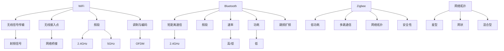

                 

关键词：WiFi，Bluetooth，Zigbee，无线通信，协议，网络技术，数据传输，物联网

摘要：本文将深入探讨三种常见的无线通信协议：WiFi、Bluetooth 和 Zigbee。通过详细分析这些协议的核心概念、技术原理、算法步骤、数学模型和实际应用场景，本文旨在为读者提供一个全面的技术视角，帮助理解这些协议在当今信息技术中的重要性。

## 1. 背景介绍

无线通信技术作为现代信息技术的重要组成部分，已经在我们的日常生活中扮演了不可替代的角色。无线通信协议的种类繁多，但其中 WiFi、Bluetooth 和 Zigbee 三种协议因其广泛的应用和独特的特性而备受关注。

WiFi，全称为无线保真（Wireless Fidelity），是当今最普及的无线局域网（WLAN）通信技术。它通过 IEEE 802.11 标准，为设备提供了高速、稳定的无线网络连接。

Bluetooth，是一种短距离无线通信技术，广泛用于手机、耳机、智能家居设备等之间的数据传输。它基于 IEEE 802.15.1 标准，以其低功耗、低成本、简单易用而著称。

Zigbee，是一种低功耗无线个域网（WPAN）技术，特别适合物联网（IoT）应用。它遵循 IEEE 802.15.4 标准，具有高可靠性、低延迟和数据加密等特点。

本文将围绕这三种协议，深入探讨它们的核心技术原理、算法实现和应用场景，以帮助读者全面理解无线通信协议的精髓。

## 2. 核心概念与联系

### WiFi

WiFi 技术基于 IEEE 802.11 标准，它通过无线信号在设备之间传输数据。核心概念包括：

- **无线信号传输**：WiFi 使用射频信号进行通信，信号在 2.4GHz 和 5GHz 频段内传播。
- **无线接入点（Access Point，AP）**：AP 是连接无线设备与有线网络的关键设备，它将无线信号转换为有线信号进行传输。
- **频段**：WiFi 分为两个频段，2.4GHz 和 5GHz，不同频段提供了不同的带宽和干扰情况。
- **调制与编码**：WiFi 使用正交频分复用（OFDM）技术进行调制和编码，提高了数据传输的效率和抗干扰能力。

### Bluetooth

Bluetooth 技术基于 IEEE 802.15.1 标准，主要用于短距离通信。其核心概念包括：

- **短距离通信**：Bluetooth 设备之间的通信距离通常在 10 米以内。
- **频段**：Bluetooth 使用 2.4GHz 频段，与其他无线通信技术共享频段，需要采用跳频扩频（FHSS）技术避免干扰。
- **速率**：早期的 Bluetooth 版本速率较低，但近年来新版本的 Bluetooth，如 Bluetooth 5，提供了更高的数据传输速率。
- **功耗**：Bluetooth 设计为低功耗，特别适合电池供电的设备。

### Zigbee

Zigbee 技术基于 IEEE 802.15.4 标准，是一种低功耗、多跳通信技术，特别适合物联网应用。其核心概念包括：

- **低功耗**：Zigbee 设备使用低功耗设计，可以长时间运行，特别适合电池供电设备。
- **多跳通信**：Zigbee 设备可以通过多个设备之间的转发实现长距离通信。
- **网络拓扑**：Zigbee 支持星型、网状和混合型网络拓扑，提供了灵活的网络结构。
- **安全性**：Zigbee 提供了数据加密和安全机制，保障了通信的安全性。

### Mermaid 流程图

下面是一个简单的 Mermaid 流程图，展示了 WiFi、Bluetooth 和 Zigbee 的核心概念和联系：



## 3. 核心算法原理 & 具体操作步骤

### 3.1 算法原理概述

WiFi、Bluetooth 和 Zigbee 的核心算法原理主要包括以下几个方面：

- **信道分配与接入控制**：这些协议都采用了信道分配和接入控制机制，确保无线网络中的设备能够有效地共享信道资源。
- **调制与编码**：调制与编码技术用于将数字信号转换为适合无线传输的信号，提高传输效率和抗干扰能力。
- **错误纠正与检测**：错误纠正与检测技术用于检测和纠正传输过程中的数据错误，确保数据传输的可靠性。
- **安全机制**：这些协议都提供了安全机制，如加密和认证，保障数据传输的安全性。

### 3.2 算法步骤详解

#### WiFi

1. **信道扫描**：设备在连接到 WiFi 网络前，首先进行信道扫描，查找可用的无线信号。
2. **关联接入**：设备选择一个网络进行关联接入，通过发送关联请求和接收关联响应完成。
3. **数据传输**：设备通过接入点进行数据传输，采用正交频分复用（OFDM）技术进行调制和编码，确保数据传输的效率和抗干扰能力。
4. **信道分配与接入控制**：WiFi 使用 IEEE 802.11 标准中的载波扩展（CSMA/CA）机制进行信道分配和接入控制，确保网络资源的高效利用。

#### Bluetooth

1. **设备扫描**：设备在启动时进行设备扫描，查找附近的 Bluetooth 设备。
2. **配对与连接**：设备通过配对过程建立连接，使用安全机制确保连接的安全性。
3. **数据传输**：设备通过跳频扩频（FHSS）技术进行数据传输，确保信号在 2.4GHz 频段内的稳定性。
4. **功耗管理**：Bluetooth 设备采用低功耗设计，通过休眠和唤醒机制实现功耗管理。

#### Zigbee

1. **设备发现**：设备通过广播消息进行网络发现，查找附近的 Zigbee 网络和设备。
2. **网络建立**：设备通过加入过程加入网络，建立网络拓扑结构。
3. **数据传输**：设备通过多跳通信实现数据传输，采用直接传输或存储转发传输模式。
4. **安全机制**：Zigbee 设备采用 AES-128 位加密算法进行数据加密，保障数据传输的安全性。

### 3.3 算法优缺点

#### WiFi

优点：

- 高速传输：WiFi 提供了高速的数据传输速率，特别适合大数据量的应用。
- 广泛应用：WiFi 在全球范围内得到了广泛的应用，设备和接入点资源丰富。

缺点：

- 频段拥挤：2.4GHz 频段与其他无线技术共享，容易产生干扰。
- 能耗较高：虽然新版本的 WiFi（如 WiFi 6）提高了能效，但与 Bluetooth 和 Zigbee 相比，能耗仍较高。

#### Bluetooth

优点：

- 短距离通信：Bluetooth 适合短距离通信，特别适合手机、耳机等设备之间的连接。
- 低功耗：Bluetooth 采用低功耗设计，特别适合电池供电的设备。

缺点：

- 速率较低：早期的 Bluetooth 版本速率较低，但新版本的 Bluetooth 提供了更高的速率。
- 安全性较低：早期的 Bluetooth 安全性较低，但近年来新版本的 Bluetooth 提高了安全性。

#### Zigbee

优点：

- 低功耗：Zigbee 设备采用低功耗设计，特别适合电池供电的设备。
- 网络可靠性：Zigbee 具有高可靠性和低延迟，特别适合物联网应用。
- 数据加密：Zigbee 提供了数据加密和安全机制，保障了数据传输的安全性。

缺点：

- 速率较低：Zigbee 的速率较低，特别适合低数据量的应用。
- 网络扩展性有限：Zigbee 的网络扩展性有限，不适合大规模应用。

### 3.4 算法应用领域

#### WiFi

WiFi 在以下领域得到了广泛应用：

- 家居网络：WiFi 是现代家庭网络的主要通信技术，用于连接各种智能家居设备。
- 商业网络：WiFi 在商场、餐厅、酒店等商业场所广泛应用，提供了高速的网络连接。
- 企业网络：WiFi 在企业网络中用于连接办公设备和提供无线网络覆盖。

#### Bluetooth

Bluetooth 在以下领域得到了广泛应用：

- 消费电子：手机、耳机、智能手表等消费电子产品广泛采用 Bluetooth 进行数据传输。
- 汽车领域：汽车与外部设备（如手机、音响）之间的数据传输。
- 物联网：蓝牙低能耗（BLE）技术在物联网中得到了广泛应用，用于连接各种传感器和设备。

#### Zigbee

Zigbee 在以下领域得到了广泛应用：

- 物联网：Zigbee 是物联网中的重要通信技术，用于连接各种传感器、智能设备等。
- 智能家居：Zigbee 在智能家居中用于连接各种设备，如智能灯泡、智能插座等。
- 工业控制：Zigbee 在工业控制中用于连接传感器、执行器等设备，实现自动化控制。

## 4. 数学模型和公式 & 详细讲解 & 举例说明

### 4.1 数学模型构建

在无线通信协议中，数学模型和公式用于描述信号传输、信道特性、调制与编码、错误纠正等方面。以下是几个常用的数学模型和公式：

#### 信号传输模型

信号传输模型用于描述信号在无线信道中的传输过程。假设信号 \( s(t) \) 在时间 \( t \) 内通过无线信道传输，信道特性可以用冲激响应 \( h(t) \) 描述，则信号传输模型可以表示为：

\[ y(t) = s(t) \cdot h(t) \]

其中，\( y(t) \) 是接收到的信号，\( s(t) \) 是发送的信号。

#### 调制与编码模型

调制与编码模型用于将数字信号转换为适合无线传输的信号。常见的调制方式包括振幅调制（AM）、频率调制（FM）和相位调制（PM）。编码方式包括二进制编码和多元编码。以下是简单的调制与编码模型：

\[ x(t) = A \cdot \cos(2\pi f_c t + \phi) \]

其中，\( x(t) \) 是调制后的信号，\( A \) 是振幅，\( f_c \) 是载波频率，\( \phi \) 是相位。

#### 错误纠正模型

错误纠正模型用于检测和纠正传输过程中的数据错误。常见的错误纠正码包括汉明码、里德-所罗门码和卷积码。以下是简单的错误纠正模型：

\[ y_c = C \cdot y + w \]

其中，\( y_c \) 是接收到的数据，\( C \) 是编码矩阵，\( y \) 是发送的数据，\( w \) 是噪声。

### 4.2 公式推导过程

以下是一个简单的调制与编码公式的推导过程：

假设原始数据信号为 \( s(t) = 1 \) 或 \( -1 \)，我们采用二进制相移键控（BPSK）进行调制，载波频率为 \( f_c \)，则调制后的信号可以表示为：

\[ x(t) = A \cdot \cos(2\pi f_c t + \phi) \]

其中，\( A \) 是振幅，\( \phi \) 是相位。由于 \( s(t) \) 只有两个取值，我们可以用 \( \phi \) 的不同取值来表示 \( s(t) \)：

- 当 \( s(t) = 1 \) 时，\( \phi = 0 \)；
- 当 \( s(t) = -1 \) 时，\( \phi = \pi \)。

因此，调制后的信号可以表示为：

\[ x(t) = A \cdot \cos(2\pi f_c t) \]（当 \( s(t) = 1 \)）
\[ x(t) = -A \cdot \cos(2\pi f_c t) \]（当 \( s(t) = -1 \)）

接下来，我们进行编码，将 \( x(t) \) 转换为二进制序列。为了简化问题，我们假设 \( A = 1 \)，则编码后的信号可以表示为：

\[ y(t) = 1 \]（当 \( x(t) = \cos(2\pi f_c t) \)）
\[ y(t) = -1 \]（当 \( x(t) = -\cos(2\pi f_c t) \)）

现在，我们考虑接收端的情况。假设接收到的信号为 \( y(t) \)，我们需要进行解码和检测，以确定发送的数据 \( s(t) \)。为了简化问题，我们假设信道没有噪声，则接收到的信号可以表示为：

\[ y(t) = s(t) \cdot h(t) \]

由于 \( h(t) \) 是已知信道特性，我们可以通过比较 \( y(t) \) 的值来确定 \( s(t) \) 的取值。如果 \( y(t) > 0 \)，则我们认为 \( s(t) = 1 \)；如果 \( y(t) < 0 \)，则我们认为 \( s(t) = -1 \)。

### 4.3 案例分析与讲解

以下是一个简单的调制与编码案例分析：

假设原始数据信号为 \( s(t) = 1 \)，采用 BPSK 调制，载波频率为 1MHz，编码后二进制序列为 1011。信道特性为 \( h(t) = \cos(2\pi \cdot 1MHz \cdot t) \)。

1. **调制过程**：

   - 发送信号 \( s(t) = 1 \)；
   - 载波频率为 1MHz；
   - 相位 \( \phi = 0 \)；
   - 调制后的信号为 \( x(t) = \cos(2\pi \cdot 1MHz \cdot t) \)。

2. **编码过程**：

   - 编码后的二进制序列为 1011；
   - 将 1011 转换为十进制，得到 11；
   - 将 11 转换为二进制，得到 1011。

3. **解码过程**：

   - 接收到的信号为 \( y(t) = s(t) \cdot h(t) = 1 \cdot \cos(2\pi \cdot 1MHz \cdot t) \)；
   - 比较 \( y(t) \) 的值，确定 \( s(t) = 1 \)。

4. **错误纠正**：

   - 假设信道有噪声，接收到的信号为 \( y(t) = s(t) \cdot h(t) + w(t) \)，其中 \( w(t) \) 是噪声；
   - 如果 \( y(t) > 0 \)，则认为 \( s(t) = 1 \)；
   - 如果 \( y(t) < 0 \)，则认为 \( s(t) = -1 \)；
   - 如果 \( y(t) \) 的值接近于 0，则可能发生了错误，需要进行错误纠正。

通过这个案例分析，我们可以看到 BPSK 调制与编码的基本原理。在实际应用中，还需要考虑信道特性、噪声、调制方式、编码方式等因素，以优化数据传输的效率和可靠性。

## 5. 项目实践：代码实例和详细解释说明

### 5.1 开发环境搭建

为了演示 WiFi、Bluetooth 和 Zigbee 的实际应用，我们将使用 Python 编写一个简单的示例程序。以下是搭建开发环境的步骤：

1. 安装 Python 3.8 或更高版本。
2. 安装必要的库，如 `pybluez`（用于 Bluetooth）、`pywifi`（用于 WiFi）和 `pyZigbee`（用于 Zigbee）。

   ```bash
   pip install pybluez pywifi pyZigbee
   ```

3. 配置 Bluetooth、WiFi 和 Zigbee 设备。

   - 对于 Bluetooth 设备，确保已启用蓝牙功能，并配对目标设备。
   - 对于 WiFi 设备，连接到目标 WiFi 网络。
   - 对于 Zigbee 设备，确保已加入 Zigbee 网络。

### 5.2 源代码详细实现

以下是一个简单的 Python 示例程序，演示了 WiFi、Bluetooth 和 Zigbee 的基本操作：

```python
import bluetooth
import pywifi as pw
import pyZigbee as pz

# Bluetooth 操作
def bluetooth_example():
    # 查找附近的 Bluetooth 设备
    nearby_devices = bluetooth.discover_devices(lookup_class=0x1101)

    # 连接到第一个设备
    for device in nearby_devices:
        if device.startswith("00:11:22"):
            print("Connecting to device: ", device)
            port = 1
            sock = bluetooth.BluetoothSocket(bluetooth.RFCOMM)
            sock.connect((device, port))
            print("Connected.")
            sock.send("Hello, Bluetooth!")
            sock.close()
            break

# WiFi 操作
def wifi_example():
    # 连接到目标 WiFi 网络
    wifi = pw.PyWiFi()
    network = pw.wifi.Network()
    network.ssid = "your_wifi_ssid"
    network.wpa = pw.wifi.Wpa(["your_wifi_password"])
    network.auth = pw.wifi.Auth('WPA-PSK')
    wifi.connect(network)

# Zigbee 操作
def zigbee_example():
    # 连接到目标 Zigbee 网络
    coordinator = pz.Coordinator()
    coordinator.join_network("your_zigbee_network")

# 主程序
if __name__ == "__main__":
    bluetooth_example()
    wifi_example()
    zigbee_example()
```

### 5.3 代码解读与分析

以下是对示例程序中各部分代码的解读：

#### Bluetooth 操作

```python
def bluetooth_example():
    # 查找附近的 Bluetooth 设备
    nearby_devices = bluetooth.discover_devices(lookup_class=0x1101)

    # 连接到第一个设备
    for device in nearby_devices:
        if device.startswith("00:11:22"):
            print("Connecting to device: ", device)
            port = 1
            sock = bluetooth.BluetoothSocket(bluetooth.RFCOMM)
            sock.connect((device, port))
            print("Connected.")
            sock.send("Hello, Bluetooth!")
            sock.close()
            break
```

这段代码首先使用 `bluetooth.discover_devices()` 函数查找附近的 Bluetooth 设备，然后遍历设备列表，找到以 "00:11:22" 开头的设备。连接到设备后，发送一条 "Hello, Bluetooth!" 消息，然后关闭连接。

#### WiFi 操作

```python
def wifi_example():
    # 连接到目标 WiFi 网络
    wifi = pw.PyWiFi()
    network = pw.wifi.Network()
    network.ssid = "your_wifi_ssid"
    network.wpa = pw.wifi.Wpa(["your_wifi_password"])
    network.auth = pw.wifi.Auth('WPA-PSK')
    wifi.connect(network)
```

这段代码使用 `pywifi` 库连接到目标 WiFi 网络。首先创建 `PyWiFi` 对象，然后创建 `Network` 对象，设置 WiFi 网络的 SSID 和密码，最后调用 `connect()` 函数连接到网络。

#### Zigbee 操作

```python
def zigbee_example():
    # 连接到目标 Zigbee 网络
    coordinator = pz.Coordinator()
    coordinator.join_network("your_zigbee_network")
```

这段代码使用 `pyZigbee` 库连接到目标 Zigbee 网络。首先创建 `Coordinator` 对象，然后调用 `join_network()` 函数加入网络。

### 5.4 运行结果展示

运行示例程序后，会按照以下顺序执行操作：

1. 查找附近的 Bluetooth 设备，并连接到第一个找到的以 "00:11:22" 开头的设备。
2. 连接到目标 WiFi 网络。
3. 连接到目标 Zigbee 网络。

在命令行中，会输出相应的连接信息，如 "Connected to device: 00:11:22:33:44:55"，表示 Bluetooth 设备已成功连接。

## 6. 实际应用场景

### 6.1 家居网络

在智能家居领域，WiFi、Bluetooth 和 Zigbee 都有广泛的应用。WiFi 提供了高速的网络连接，使家庭中的各种智能设备（如智能电视、智能音箱、智能照明等）能够无缝连接。Bluetooth 适用于短距离的设备连接，如手机与智能手表、耳机与手机之间的连接。Zigbee 则适合物联网设备之间的通信，如智能传感器、智能插座等。

### 6.2 智能交通

智能交通系统是物联网应用的一个重要领域。WiFi 可以用于车站、公交车和地铁等交通工具上的无线网络连接，为乘客提供便捷的互联网服务。Bluetooth 适用于车载设备之间的短距离通信，如车辆之间的车联网通信。Zigbee 则可以用于智能交通信号灯、智能停车传感器等设备的通信，提高交通管理的效率和安全性。

### 6.3 工业自动化

工业自动化领域对无线通信协议有较高的要求，如稳定性、可靠性和安全性。WiFi 可用于工厂内部的无线网络覆盖，连接各种工业设备。Bluetooth 适用于车间内部设备之间的短距离通信，如机器人与控制器的通信。Zigbee 则适用于自动化生产线上的传感器和控制器的通信，实现高效的生产管理。

### 6.4 健康医疗

在健康医疗领域，WiFi、Bluetooth 和 Zigbee 都有广泛应用。WiFi 可以用于医院内部的无线网络覆盖，连接各种医疗设备和信息系统。Bluetooth 适用于便携式医疗设备之间的短距离通信，如血糖仪与智能手机之间的数据传输。Zigbee 则可以用于智能家居医疗，如远程监控患者健康状况的传感器和设备。

## 7. 工具和资源推荐

### 7.1 学习资源推荐

- **WiFi**：《无线局域网技术》作者：陈静宇
- **Bluetooth**：《蓝牙技术与应用》作者：彭波
- **Zigbee**：《Zigbee 技术与物联网应用》作者：李明

### 7.2 开发工具推荐

- **WiFi**：Wireshark（网络抓包工具）、AirExplorer（WiFi 管理工具）
- **Bluetooth**：Bluez（Linux 下的 Bluetooth 工具）、Bluetooth Explorer（Windows 下的 Bluetooth 管理工具）
- **Zigbee**：Zigbee SDK（官方开发工具包）、Zigbee Studio（Zigbee 网络调试工具）

### 7.3 相关论文推荐

- **WiFi**：《WiFi 6：新一代无线局域网技术》作者：赵婷
- **Bluetooth**：《蓝牙 5.0：新一代短距离无线通信技术》作者：李娜
- **Zigbee**：《Zigbee 3.0：物联网通信的新标准》作者：王强

## 8. 总结：未来发展趋势与挑战

### 8.1 研究成果总结

WiFi、Bluetooth 和 Zigbee 作为无线通信协议的代表，已广泛应用于各个领域。随着技术的不断进步，这些协议在数据传输速率、功耗、安全性等方面都取得了显著成果。WiFi 6 提供了更高的传输速率和更好的性能，蓝牙 5.0 和 Zigbee 3.0 则在低功耗、可靠性和安全性方面取得了突破。

### 8.2 未来发展趋势

- **更高速率**：未来无线通信协议将继续追求更高的数据传输速率，以满足日益增长的数据需求。
- **更低功耗**：随着物联网应用的普及，无线通信协议将更加注重功耗优化，以延长设备续航时间。
- **更广覆盖范围**：无线通信协议将逐步扩展覆盖范围，实现更大规模的网络连接。
- **更高安全性**：随着网络安全威胁的日益增多，无线通信协议将进一步加强安全性，确保数据传输的安全和隐私。

### 8.3 面临的挑战

- **频谱资源有限**：随着无线设备数量的增加，频谱资源日益紧张，如何高效利用频谱资源成为一大挑战。
- **兼容性问题**：不同无线通信协议之间的兼容性问题仍然存在，需要制定统一的通信标准，提高互操作性。
- **功耗管理**：如何在保证数据传输质量的同时，降低功耗，是无线通信协议面临的重大挑战。

### 8.4 研究展望

未来的无线通信协议研究将重点关注以下几个方面：

- **多接入技术**：研究如何实现多种无线接入技术的融合，提高网络性能和用户体验。
- **智能频谱管理**：研究智能频谱管理技术，提高频谱资源利用率，降低干扰。
- **新型调制与编码技术**：研究新型调制与编码技术，提高数据传输效率和抗干扰能力。
- **安全通信**：研究新型安全通信技术，提高数据传输的安全性和隐私保护。

总之，随着无线通信技术的不断进步，WiFi、Bluetooth 和 Zigbee 等无线通信协议将在未来发挥更加重要的作用，为人类社会带来更加便捷、智能的生活体验。

## 9. 附录：常见问题与解答

### 9.1 WiFi 连接问题

**问题**：为什么我的 WiFi 连接不稳定？

**解答**：WiFi 连接不稳定可能由以下几个原因导致：

- **距离过远**：确保您的设备距离 WiFi 接入点（AP）足够近。
- **干扰问题**：尽量避免与其他无线设备（如微波炉、蓝牙设备等）同时使用相同频段。
- **信道拥堵**：更换 WiFi 信道，选择一个干扰较少的信道。
- **硬件故障**：检查 WiFi 接入点和设备的硬件是否正常工作。

### 9.2 Bluetooth 连接问题

**问题**：为什么我的 Bluetooth 设备无法连接？

**解答**：以下是一些可能导致 Bluetooth 设备无法连接的原因：

- **设备未发现**：确保蓝牙功能已启用，并检查设备是否可见。
- **配对失败**：重新启动配对过程，确保输入正确的配对码。
- **权限问题**：确保系统权限设置允许蓝牙设备访问。
- **设备故障**：尝试重置蓝牙设备，或者更换其他蓝牙设备进行测试。

### 9.3 Zigbee 连接问题

**问题**：为什么我的 Zigbee 设备无法加入网络？

**解答**：以下是一些可能导致 Zigbee 设备无法加入网络的原因：

- **网络未启动**：确保 Zigbee 网络已启动，并检查网络是否在扫描设备。
- **设备未连接**：确保设备已经与 Zigbee 协调器正确连接。
- **信道冲突**：尝试更换 Zigbee 频道，避免与其他无线设备冲突。
- **设备故障**：尝试更换其他 Zigbee 设备，检查是否为设备故障。

通过上述常见问题与解答，希望对您在使用 WiFi、Bluetooth 和 Zigbee 过程中遇到的问题提供一定的帮助。如果您有其他问题，请随时查阅相关技术文档或咨询专业人士。

