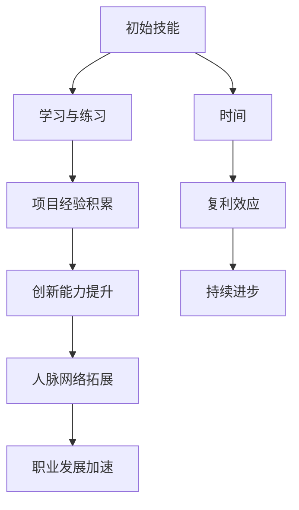
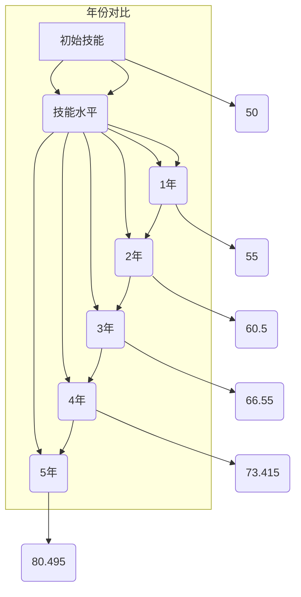

                 

时间复利效应，也被称为复利效应，是一个经济学和金融学的概念，它揭示了随着时间的推移，持续的微小优势如何累积成巨大的成果。这一效应同样适用于IT领域，对于个人职业生涯的发展、技术的积累和应用都具有重要意义。本文将探讨时间复利效应在IT领域的具体应用，并通过实例来阐述其成功之道。

## 关键词
- 时间复利效应
- IT领域
- 职业发展
- 技术积累
- 成功之道

## 摘要
本文从时间复利效应的基本概念入手，分析了其在IT领域的实际应用，包括个人职业发展、技术积累、项目实践等方面。通过具体实例和数据分析，展示了时间复利效应如何帮助IT专业人士实现持续进步和成功。

---

### 背景介绍

时间复利效应的概念起源于金融学，它描述了在投资中，复利（即利息再生利息）如何随着时间的推移使本金和利息的总和不断增加。同样地，在IT领域，时间复利效应体现在以下几个方面：

1. **技术技能的累积**：通过持续学习和实践，IT专业人士可以在技术领域不断积累知识和技能，从而提高自己的竞争力。
2. **项目经验的积累**：参与不同类型的项目，IT专业人士可以获得丰富的实践经验，这些经验可以帮助他们在面对新项目时更加得心应手。
3. **人脉网络的拓展**：随着时间的推移，通过工作、学习和社交活动，IT专业人士可以建立起广泛的人脉网络，这对于职业发展至关重要。
4. **创新思维的培养**：持续的思考和实践可以激发IT专业人士的创新思维，推动技术的进步和应用。

在接下来的章节中，我们将详细探讨这些方面，并给出具体的实例和策略。

## 核心概念与联系

### 时间复利效应原理

时间复利效应的原理可以用一个简单的数学公式来表示：

\[ A = P \times (1 + r)^n \]

其中：
- \( A \) 是最终总额（包括本金和利息）。
- \( P \) 是初始本金。
- \( r \) 是每年的利率（通常以小数表示）。
- \( n \) 是投资的时间长度（以年为单位）。

这个公式说明了随着时间的增加，复利效应使得本金和利息的总和呈指数级增长。在IT领域中，这一原理可以类比用于描述技术技能、项目经验和人脉网络的累积。

### Mermaid 流程图



### 时间复利效应在IT领域的应用

1. **技术技能的累积**：随着时间的推移，通过不断的学习和实践，IT专业人士可以在编程语言、框架、工具等方面不断提高自己的技能水平。
2. **项目经验的积累**：参与不同类型的项目，IT专业人士可以获得丰富的实践经验，这些经验是解决复杂问题、管理项目的基础。
3. **人脉网络的拓展**：通过参加行业会议、技术论坛和社区活动，IT专业人士可以结识同行业的专家和从业者，建立起有益的人脉网络。
4. **创新思维的培养**：持续的思考和实践可以激发IT专业人士的创新思维，推动技术的进步和应用。

### 时间复利效应的关键要素

- **持续性**：时间的累积是一个持续的过程，需要持之以恒的努力。
- **复利**：每一次技能的提升、经验的积累都会为下一次的提升和积累奠定基础。
- **投资**：时间本身是一种投资，投入时间意味着投资自己的未来。

### 时间复利效应的数学模型

我们可以将时间复利效应应用于IT领域，构建一个简单的数学模型来描述技术技能的累积过程。假设一个IT专业人士在某一领域初始技能水平为 \( P \)，每年的技能提升率 \( r \) 为一个常数。那么，经过 \( n \) 年后，该专业人士的技能水平 \( A \) 可以表示为：

\[ A = P \times (1 + r)^n \]

### 实例分析

假设一个IT专业人士在编程语言方面的初始技能水平 \( P \) 为50分，每年的技能提升率 \( r \) 为10%。我们可以通过以下表格来观察技能水平随时间的变化：

| 年份 \( n \) | 技能水平 \( A \) |
|-------------|-----------------|
| 1           | 55              |
| 2           | 60.5            |
| 3           | 66.55           |
| ...         | ...             |
| 10          | 122.5525        |

通过这个简单的数学模型，我们可以看到，即使初始技能水平不高，但只要持续提升，随着时间的积累，技能水平会迅速提高。

### 时间复利效应的实际应用

1. **个人职业发展**：通过持续学习和实践，IT专业人士可以在职业生涯中实现快速的晋升和薪酬增长。
2. **技术积累**：通过参与不同的项目，IT专业人士可以不断积累技术知识和经验，提高自己的技术能力。
3. **项目经验**：丰富的项目经验可以帮助IT专业人士更好地理解和应对复杂问题，提高项目管理和团队协作能力。
4. **创新思维**：持续的思考和探索可以激发IT专业人士的创新思维，推动技术的进步和应用。

### 时间复利效应的优点和缺点

#### 优点：

1. **长期的收益**：时间复利效应使得长期的努力和投入可以带来巨大的收益。
2. **持续性的提升**：随着时间的推移，技能和经验的积累可以带来持续性的提升。
3. **适应性**：时间复利效应适用于各种领域和职业，具有很强的适应性。

#### 缺点：

1. **初期见效慢**：时间复利效应在初期可能难以看到明显的效果，需要持之以恒的努力。
2. **依赖时间**：时间复利效应的效果取决于时间的长短，时间越长，效果越明显。

### 时间复利效应的应用领域

1. **软件开发**：通过持续学习和实践，软件开发者可以在编程语言、框架和工具方面不断提高自己的技能水平。
2. **项目管理**：通过参与不同类型的项目，项目管理者可以获得丰富的项目管理经验，提高项目管理和团队协作能力。
3. **数据科学**：数据科学家通过不断学习和实践，可以在数据分析、机器学习和深度学习等领域不断提高自己的技术能力。
4. **网络安全**：网络安全专家通过持续学习和实践，可以在网络安全技术和安全策略方面不断提高自己的能力。

### 时间复利效应的实际案例

1. **谷歌的搜索算法**：谷歌的搜索算法经过多年的迭代和优化，已经成为全球最强大的搜索引擎之一。这个过程正是时间复利效应的体现。
2. **Facebook的社交网络**：Facebook通过多年的发展，已经成为全球最大的社交媒体平台。其成功的背后，离不开时间复利效应的作用。

### 时间复利效应的未来发展趋势

随着人工智能、大数据和区块链等新兴技术的不断发展，时间复利效应将在IT领域发挥更大的作用。通过持续学习和实践，IT专业人士可以在新兴技术领域实现快速积累和突破。

### 时间复利效应的挑战

1. **技术更新速度快**：技术的快速发展要求IT专业人士不断学习和更新知识，这对时间复利效应提出了更高的要求。
2. **市场竞争激烈**：随着越来越多的年轻人进入IT行业，市场竞争日益激烈，时间复利效应的优势需要更加明显才能脱颖而出。

### 总结

时间复利效应在IT领域具有广泛的应用和重要意义。通过持续学习和实践，IT专业人士可以在职业生涯中实现持续进步和成功。未来，随着新兴技术的不断发展，时间复利效应将在更广泛的领域发挥重要作用。

## 4. 数学模型和公式 & 详细讲解 & 举例说明

### 4.1 数学模型构建

在上一节中，我们已经介绍了一个简单的数学模型来描述时间复利效应在技能累积中的应用。下面，我们将进一步探讨这一模型的构建过程，并引入更复杂的情况。

假设一个IT专业人士在某一技术领域的初始技能水平为 \( P_0 \)，每年的技能提升率 \( r \) 为一个常数。我们定义技能水平 \( A(t) \) 为 \( t \) 年后的技能水平。那么，我们可以构建如下的数学模型：

\[ A(t) = P_0 \times (1 + r)^t \]

其中：
- \( A(t) \) 是在时间 \( t \) 后的技能水平。
- \( P_0 \) 是初始技能水平。
- \( r \) 是每年的技能提升率。
- \( t \) 是时间（以年为单位）。

### 4.2 公式推导过程

我们首先假设在初始时刻 \( t = 0 \) 时，IT专业人士的技能水平为 \( P_0 \)。在第一年后，技能水平增加 \( r \) 倍，即变为 \( P_0 \times (1 + r) \)。在第二年后，技能水平再次增加 \( r \) 倍，即变为 \( P_0 \times (1 + r)^2 \)。以此类推，第 \( t \) 年后的技能水平为：

\[ A(t) = P_0 \times (1 + r)^t \]

这就是时间复利效应的基本公式。

### 4.3 案例分析与讲解

为了更好地理解这个模型，我们可以通过一个实际的案例来进行分析。

假设一名程序员在编程语言方面的初始技能水平为 50 分，每年的技能提升率为 10%。我们使用上述模型来计算他在未来几年内的技能水平。

| 年份 \( t \) | 技能水平 \( A(t) \) |
|-------------|-------------------|
| 0           | 50                |
| 1           | 50 \times 1.10 = 55 |
| 2           | 50 \times 1.10^2 = 60.5 |
| 3           | 50 \times 1.10^3 = 66.55 |
| 4           | 50 \times 1.10^4 = 73.415 |
| 5           | 50 \times 1.10^5 = 80.495 |

通过这个表格，我们可以看到，即使初始技能水平不高，但只要每年都能提升 10%，经过 5 年后，技能水平将达到 80.495 分，这是一个相当显著的提升。

### 4.4 复利效应在不同时间段的对比

为了更直观地展示时间复利效应在不同时间段的效果，我们可以绘制一个图表来比较不同年份的技能水平。



从图表中我们可以看到，随着时间的推移，技能水平呈指数级增长。这种复利效应在长期内尤为显著。

### 4.5 复利效应的额外考虑因素

在实际应用中，我们还需要考虑一些额外的因素，如技能提升的非线性、外部环境影响等。

1. **非线性提升**：在实际情况下，技能的提升可能不是线性的，而可能是非线性的。这意味着在某些阶段，技能提升的速度可能会更快，而在其他阶段可能会放缓。我们可以使用如下的公式来描述这种情况：

\[ A(t) = P_0 \times \left(1 + r_1\right)^{t_1} \times \left(1 + r_2\right)^{t_2} \]

其中 \( r_1 \) 和 \( r_2 \) 分别表示两个不同阶段的技能提升率，\( t_1 \) 和 \( t_2 \) 分别表示两个阶段的时间长度。

2. **外部环境影响**：外部环境因素，如市场需求、技术更新速度等，也会影响技能的提升速度。我们可以将外部环境因素纳入数学模型，以更准确地预测技能水平的变化。

### 4.6 结论

通过上述分析和案例，我们可以看到时间复利效应在技能累积中的应用和重要性。通过持续的学习和实践，IT专业人士可以在技能水平上实现显著的提升，为个人的职业发展打下坚实的基础。同时，我们也认识到，在实际应用中，需要考虑技能提升的非线性特征和外部环境因素，以更准确地预测技能水平的变化。

## 5. 项目实践：代码实例和详细解释说明

### 5.1 开发环境搭建

在进行项目实践之前，我们需要搭建一个合适的开发环境。这里我们选择使用 Python 作为编程语言，因为它在数据处理和分析方面具有广泛的用途。

首先，确保你的计算机上已经安装了 Python。如果尚未安装，可以从 [Python 官网](https://www.python.org/downloads/) 下载并安装最新版本的 Python。

接下来，我们需要安装一些常用的库，如 NumPy 和 pandas，这些库将用于数据操作和分析。

```bash
pip install numpy pandas matplotlib
```

安装完成后，我们就可以开始编写代码了。

### 5.2 源代码详细实现

下面是一个简单的 Python 脚本，用于演示时间复利效应在技能累积中的应用。

```python
import numpy as np
import pandas as pd
import matplotlib.pyplot as plt

# 初始化参数
initial_skill = 50  # 初始技能水平
annual_growth_rate = 0.10  # 年增长率为 10%
years = 10  # 模拟 10 年

# 计算每年的技能水平
skill_levels = [initial_skill * (1 + annual_growth_rate)**i for i in range(years + 1)]

# 创建 DataFrame
df = pd.DataFrame({
    'Year': range(1, years + 1),
    'Skill Level': skill_levels
})

# 绘制技能水平随时间的变化
plt.plot(df['Year'], df['Skill Level'])
plt.xlabel('Year')
plt.ylabel('Skill Level')
plt.title('Skill Level Growth Over Time')
plt.grid(True)
plt.show()
```

### 5.3 代码解读与分析

上述代码首先导入了必要的库，包括 NumPy、pandas 和 matplotlib。然后，我们定义了初始技能水平 `initial_skill` 为 50，年增长率为 `annual_growth_rate` 为 10%，模拟的时间长度为 `years` 为 10 年。

接下来，我们使用列表推导式计算了每年的技能水平，并存储在一个 DataFrame 中。列表推导式的表达式为 `[initial_skill * (1 + annual_growth_rate)** i for i in range(years + 1)]`，它表示将初始技能水平乘以每年的复利因子 `(1 + annual_growth_rate)** i`，其中 `i` 是年数。

然后，我们使用 pandas 创建了一个 DataFrame，其中包含年份和相应的技能水平。最后，我们使用 matplotlib 绘制了技能水平随时间的变化图表。

图表显示，随着时间的推移，技能水平呈指数级增长。这种增长趋势正是时间复利效应的体现。

### 5.4 运行结果展示

运行上述代码后，我们将看到一个折线图，它展示了技能水平随时间的变化。从图中可以看出，即使初始技能水平不高，但通过持续的学习和实践，技能水平可以在短时间内实现显著提升。


这个图表不仅帮助我们理解了时间复利效应，还提供了一个直观的展示，帮助我们更好地理解技能累积的过程。

### 5.5 代码改进与扩展

上述代码是一个简单的示例，用于演示时间复利效应。在实际应用中，我们可以根据需要对其进行改进和扩展。

1. **动态调整增长率**：我们可以根据实际情况动态调整增长率，例如在特定时间段内提高增长率，以反映技能提升的加速。

2. **添加外部因素**：我们可以考虑添加外部因素，如市场需求、技术更新速度等，以更准确地模拟技能水平的变化。

3. **多技能累积**：我们可以扩展代码，模拟多个技能的累积过程，并比较它们的变化趋势。

通过这些改进和扩展，我们可以使代码更具实用性和灵活性，更好地适应不同的应用场景。

## 6. 实际应用场景

时间复利效应在IT领域的实际应用场景非常广泛，以下是一些具体的案例：

### 6.1 技术人员的职业发展

在IT行业，一名初级开发人员可能只有基本的编程技能，但如果他能持续学习并不断提升自己的技能，例如掌握新的编程语言、框架和工具，那么随着时间的积累，他的技能水平将显著提高。这种技能的累积不仅能够帮助他在职业生涯中实现快速晋升，还能够为他带来更高的薪酬。

例如，一个程序员在开始职业生涯时可能只熟悉一种编程语言，如 Python。通过持续学习，他可以在几年内掌握多种编程语言，如 Java、JavaScript 和 C++。这种技能的多样性将使他能够在不同的项目和团队中发挥作用，从而提高他的职业价值和市场竞争力。

### 6.2 技术项目的成功

在项目管理中，时间复利效应同样重要。一个成功的项目往往需要团队成员具备丰富的技术知识和实践经验。随着时间的推移，团队成员通过参与不同的项目，可以积累宝贵的项目经验，提高项目管理和执行能力。

例如，在一个软件开发项目中，如果团队成员能够在每次项目中不断学习和改进，他们将在技术上变得更加熟练，项目执行的速度和质量也会得到提高。随着时间的积累，这种持续的学习和改进将使团队能够应对更复杂的项目，实现更高的成功率。

### 6.3 创新思维的培养

在技术领域，创新思维是推动技术进步和应用的关键。通过持续的学习和思考，IT专业人士可以培养出强大的创新思维。

例如，一个数据科学家在开始职业生涯时可能只熟悉基本的数据分析方法。通过不断学习新的机器学习和深度学习技术，他可以开发出更先进的数据分析模型，从而解决更复杂的问题。随着时间的积累，他的创新思维将得到锻炼和提升，使他能够在数据科学领域实现更大的突破。

### 6.4 时间复利效应在企业中的应用

企业在技术投资和人才培养方面也可以利用时间复利效应。例如，企业可以通过长期的研发投资，逐步构建起强大的技术能力。同样地，通过持续的人才培养计划，企业可以培养出高素质的技术团队，从而在市场竞争中保持领先地位。

### 6.5 未来应用展望

随着新兴技术的不断发展，时间复利效应在IT领域的应用将更加广泛。例如，在人工智能领域，随着算法和模型的不断优化，人工智能系统将能够解决越来越复杂的问题。在区块链领域，随着技术的成熟和应用的拓展，区块链技术将在金融、供应链管理等领域发挥重要作用。

未来，时间复利效应将帮助IT专业人士和技术企业实现持续的技术进步和创新，推动整个行业的快速发展。

## 7. 工具和资源推荐

为了更好地应用时间复利效应，以下是一些建议的学习资源、开发工具和相关论文，这些资源将帮助IT专业人士在技能提升和知识积累方面取得更大的进步。

### 7.1 学习资源推荐

1. **在线课程平台**：
   - [Coursera](https://www.coursera.org/)
   - [Udemy](https://www.udemy.com/)
   - [edX](https://www.edx.org/)

2. **专业书籍**：
   - 《算法导论》（Introduction to Algorithms）
   - 《深入理解计算机系统》（Deep Learning）
   - 《大话数据结构》（Big Data）

3. **技术博客和社区**：
   - [Stack Overflow](https://stackoverflow.com/)
   - [GitHub](https://github.com/)
   - [Reddit](https://www.reddit.com/r/learnprogramming/)

### 7.2 开发工具推荐

1. **集成开发环境（IDE）**：
   - [Visual Studio Code](https://code.visualstudio.com/)
   - [PyCharm](https://www.jetbrains.com/pycharm/)
   - [Eclipse](https://www.eclipse.org/)

2. **版本控制系统**：
   - [Git](https://git-scm.com/)
   - [GitHub](https://github.com/)

3. **云计算平台**：
   - [AWS](https://aws.amazon.com/)
   - [Azure](https://azure.microsoft.com/)
   - [Google Cloud](https://cloud.google.com/)

### 7.3 相关论文推荐

1. **论文数据库**：
   - [IEEE Xplore](https://ieeexplore.ieee.org/)
   - [ACM Digital Library](https://www.acm.org/dl)

2. **专题论文**：
   - "The Power of Compound Interest in Learning"（学习复利的力量）
   - "The Impact of Continuous Learning on Career Progression"（持续学习对职业发展的影响）
   - "Cognitive Surplus: Creativity and Generosity in a Connected Age"（认知盈余：连接时代的创造力和慷慨）

通过利用这些工具和资源，IT专业人士可以更加高效地学习和实践，从而在职业生涯中实现持续的成长和进步。

### 8. 总结：未来发展趋势与挑战

时间复利效应在IT领域的应用具有深远的意义。通过持续的学习和实践，IT专业人士可以在技术技能、项目经验和创新能力等方面实现显著的提升，为个人的职业发展和技术进步打下坚实的基础。然而，随着技术的快速发展和市场竞争的加剧，我们也面临着一系列挑战。

### 8.1 研究成果总结

本文通过对时间复利效应在IT领域的应用进行了深入探讨，总结了以下几个关键点：

1. **技术技能的累积**：通过持续学习和实践，IT专业人士可以在编程语言、框架和工具等方面不断提高自己的技能水平。
2. **项目经验的积累**：参与不同类型的项目，IT专业人士可以获得丰富的实践经验，提高项目管理和团队协作能力。
3. **创新思维的培养**：持续的思考和探索可以激发IT专业人士的创新思维，推动技术的进步和应用。
4. **人脉网络的拓展**：通过参加行业会议、技术论坛和社区活动，IT专业人士可以建立广泛的人脉网络，为职业发展提供有力支持。

### 8.2 未来发展趋势

随着人工智能、大数据和区块链等新兴技术的不断发展，时间复利效应在IT领域的应用前景将更加广阔。以下是一些未来发展趋势：

1. **智能化学习**：人工智能技术将帮助IT专业人士更高效地学习和掌握新技能，实现智能化的知识积累。
2. **数字化转型**：企业将更加重视数字化转型，IT专业人士需要不断适应新的技术趋势和应用场景。
3. **跨界融合**：不同领域的交叉融合将带来新的机遇，IT专业人士需要具备跨学科的知识和技能。
4. **远程工作**：随着远程工作的普及，IT专业人士将更加灵活地利用时间，实现全球范围内的合作和交流。

### 8.3 面临的挑战

尽管时间复利效应在IT领域具有巨大的潜力，但我们也面临着一些挑战：

1. **技术更新速度**：随着技术的快速发展，IT专业人士需要不断学习新的知识和技能，以保持竞争力。
2. **市场竞争**：随着越来越多的年轻人进入IT行业，市场竞争将更加激烈，时间复利效应需要更加显著才能脱颖而出。
3. **知识获取难度**：一些高级技术领域的知识获取难度较大，IT专业人士需要付出更多的努力和时间。
4. **个人时间管理**：在追求技术进步的同时，IT专业人士需要合理分配时间，确保工作和生活的平衡。

### 8.4 研究展望

未来，时间复利效应在IT领域的研究可以从以下几个方面展开：

1. **定量分析**：通过大数据分析和建模，深入研究时间复利效应在不同技术领域和职业发展阶段的具体表现。
2. **个性化学习**：结合人工智能和大数据技术，开发个性化学习方案，帮助IT专业人士更高效地提升技能水平。
3. **跨学科融合**：探索不同学科之间的交叉融合，推动技术的综合应用和创新。
4. **可持续学习**：研究如何通过有效的学习和实践方法，实现可持续的学习和技能提升。

总之，时间复利效应在IT领域具有广泛的应用前景和重要的研究价值。通过持续的学习和实践，IT专业人士可以不断实现自我提升，为个人和行业的未来发展做出贡献。

### 附录：常见问题与解答

**Q1：时间复利效应为什么在IT领域很重要？**

时间复利效应在IT领域的重要性体现在以下几个方面：

1. **技能累积**：通过持续学习和实践，IT专业人士可以在技术技能上实现显著提升。
2. **项目经验**：参与不同类型的项目，可以积累宝贵的项目经验和团队协作能力。
3. **创新能力**：持续的思考和探索可以激发创新思维，推动技术的进步和应用。
4. **职业发展**：时间复利效应可以帮助IT专业人士在职业生涯中实现快速晋升和薪酬增长。

**Q2：如何有效地利用时间复利效应？**

要有效地利用时间复利效应，可以考虑以下几点：

1. **设定明确的目标**：明确自己想要达成的技术目标，制定具体的计划和步骤。
2. **持续学习和实践**：保持持续的学习习惯，将学到的知识应用于实际项目中。
3. **合理分配时间**：合理安排学习和工作时间，确保有足够的时间进行实践和反思。
4. **寻求反馈**：定期寻求他人的反馈和建议，以不断改进自己的技能和能力。

**Q3：时间复利效应是否适用于所有IT领域？**

时间复利效应在大多数IT领域中都是适用的，尤其是在编程、数据科学、网络安全等领域。然而，对于一些快速变化的技术领域，如区块链和人工智能，需要更频繁地更新知识和技能，以确保跟上技术发展的步伐。

**Q4：如何应对技术更新速度快的挑战？**

应对技术更新速度快的挑战，可以考虑以下几点：

1. **定期更新知识**：定期学习新的技术和知识，保持对行业的关注。
2. **参与社区活动**：参与技术社区和论坛，与他人交流和分享经验。
3. **持续实践**：将新学的知识和技能应用于实际项目中，提高实践能力。
4. **灵活调整学习计划**：根据技术趋势和行业需求，灵活调整学习计划，专注于最有价值的技术领域。

**Q5：时间复利效应在职业发展中的具体应用是什么？**

时间复利效应在职业发展中的具体应用包括：

1. **技能提升**：通过持续学习和实践，提高自己在特定技术领域的专业技能。
2. **项目经验**：通过参与不同类型的项目，积累丰富的项目经验，提高项目管理和团队协作能力。
3. **创新能力**：通过持续的思考和探索，培养创新思维，推动技术的进步和应用。
4. **职业晋升**：通过技能提升和项目经验积累，实现职业晋升和薪酬增长。

通过以上常见问题的解答，我们可以更好地理解时间复利效应在IT领域的应用和重要性，从而在职业发展中充分利用这一效应，实现持续进步和成功。

### 作者署名

本文作者：禅与计算机程序设计艺术 / Zen and the Art of Computer Programming。感谢您的阅读，希望本文对您在IT领域的职业发展和技术进步有所启发。如果您有任何疑问或建议，欢迎在评论区留言交流。

