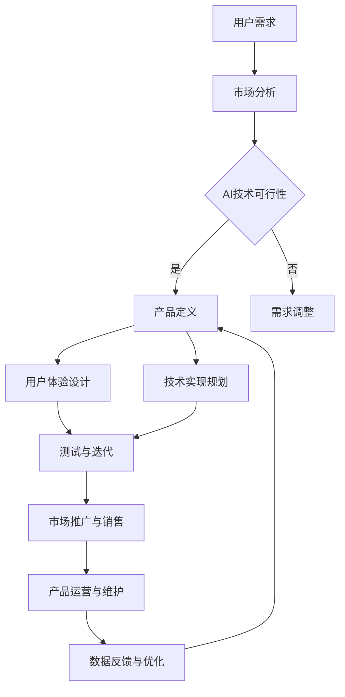

                 

关键词：人工智能、AGI、产品管理、技术创新、职业发展

> 摘要：本文深入探讨了景鲲作为人工智能领域的资深产品经理，从百度离职后的新动向。文章通过分析景鲲的职业背景、离职原因，以及他新领域的探索与实践，探讨了人工智能产品经理的未来发展路径，并对AI产业的未来趋势提出展望。

## 1. 背景介绍

景鲲，一位在人工智能领域深耕多年的资深产品经理，曾在百度任职多年，担任重要产品项目的负责人，积累了丰富的经验。他的离职引发了业内的广泛关注，不仅因为他在百度的重要地位，更因为他离开百度选择探索AGI（通用人工智能）产品管理的新方向，这一决定不仅代表了个人的职业规划，也映射出人工智能产业对未来技术发展路径的期待。

百度作为中国乃至全球人工智能领域的领军企业，其发展历程与景鲲的职业轨迹紧密相连。从早期的搜索引擎技术，到如今的人工智能战略布局，百度一直走在技术前沿。而景鲲在百度的工作经历，使他积累了大量关于人工智能产品开发与管理的实战经验。

景鲲的离职，不仅是对个人职业发展的重新定位，也是对当前人工智能产业变革的一次深度思考。他的离职背后，既有对个人职业发展的深思熟虑，也有对人工智能产品管理新模式的探索和尝试。本文将从以下几个方面展开讨论：

1. **景鲲离职的原因分析**：探讨他在百度的经历，以及导致他离开的原因。
2. **景鲲的新领域探索**：分析他离开百度后的职业动向，以及他在新领域中的探索与实践。
3. **人工智能产品经理的职业发展**：探讨人工智能产品经理在当前和未来的职业发展路径。
4. **AGI与未来人工智能产业的发展**：展望人工智能，特别是AGI技术的未来发展趋势。

## 2. 核心概念与联系

在探讨景鲲离职及其新领域探索之前，我们需要明确几个核心概念，以及它们之间的联系。

### 2.1 人工智能 (AI)

人工智能（Artificial Intelligence，简称AI）是计算机科学的一个分支，旨在创建智能代理，这些代理能够感知环境、理解语言、学习、推理和采取行动，以实现特定目标。AI可以分为弱AI（专才AI）和强AI（通用AI）。

### 2.2 通用人工智能 (AGI)

通用人工智能（Artificial General Intelligence，简称AGI）是指能够像人类一样在多种不同领域中表现出与人类相同的认知能力的人工智能系统。与弱AI相比，AGI具有更广泛的应用潜力，但当前仍处于理论研究阶段。

### 2.3 产品管理

产品管理是一个跨学科领域，涉及设计、开发、市场、用户体验等多个方面。产品经理负责定义产品的愿景、战略、功能规格和用户体验，确保产品从概念到市场推出全过程的成功。

### 2.4 AI产品经理

AI产品经理是专门负责人工智能产品开发和管理的专业人才，他们需要理解AI技术、市场趋势、用户体验和商业战略，以便将AI技术有效地转化为市场化的产品。

### 2.5 核心概念原理和架构的 Mermaid 流程图

以下是一个简化的Mermaid流程图，展示了人工智能产品经理的主要职责和核心概念之间的联系。



### 2.6 人工智能产品经理的挑战与机遇

作为AI产品经理，景鲲面临的挑战包括：

- **技术复杂度**：AI技术本身的复杂性要求产品经理不仅懂业务，还要有扎实的计算机科学背景。
- **数据隐私与伦理**：随着数据隐私和伦理问题的日益凸显，AI产品经理需要在设计产品时充分考虑这些问题。
- **快速迭代与市场适应**：AI产品需要不断迭代和优化，以适应市场变化，这对产品经理的应变能力提出了高要求。

然而，这些挑战也伴随着机遇：

- **技术红利**：随着AI技术的快速发展，AI产品经理有更多机会参与创新和前沿技术的应用。
- **市场潜力**：AI技术的广泛应用为产品经理提供了广阔的市场空间，尤其是在医疗、金融、教育等垂直领域。
- **跨领域整合**：AI产品经理需要具备跨学科的能力，这为他们提供了更多职业发展的可能性。

## 3. 核心算法原理 & 具体操作步骤

### 3.1 算法原理概述

在人工智能产品管理中，核心算法原理是理解用户需求和市场趋势的关键。以下是一个简化的算法原理概述，用于指导产品经理的工作流程：

1. **用户需求分析**：通过数据收集和分析，了解用户的需求和痛点。
2. **市场趋势判断**：结合市场数据和行业动态，判断未来趋势。
3. **产品定义**：根据需求和市场趋势，定义产品的功能、性能和用户体验。
4. **用户体验设计**：设计用户界面和交互流程，确保用户能够轻松使用产品。
5. **技术实现规划**：基于产品定义，规划技术实现的路线图和关键里程碑。
6. **测试与迭代**：在产品开发过程中进行测试，收集用户反馈，不断优化产品。
7. **市场推广与销售**：制定市场推广计划，通过销售渠道将产品推向市场。
8. **产品运营与维护**：产品上市后，进行持续运营和优化，确保产品的稳定性和用户体验。

### 3.2 算法步骤详解

1. **用户需求分析**：
   - 数据收集：通过用户调研、在线调查、社交媒体分析等方式收集用户数据。
   - 数据处理：使用数据清洗、数据挖掘等技术处理原始数据，提取有价值的信息。
   - 需求建模：构建用户需求模型，将用户需求转化为可量化的指标。

2. **市场趋势判断**：
   - 市场研究：通过市场调研、竞争分析、行业报告等方式了解市场动态。
   - 数据分析：使用统计分析和机器学习技术，分析市场数据，预测未来趋势。

3. **产品定义**：
   - 功能规划：根据用户需求和市场趋势，定义产品的核心功能和扩展功能。
   - 性能规划：设定产品的性能指标，如响应时间、并发处理能力等。
   - 用户体验设计：设计用户界面和交互流程，确保用户能够轻松使用产品。

4. **用户体验设计**：
   - 原型设计：使用原型工具设计产品原型，进行用户测试和反馈。
   - 用户体验优化：根据用户反馈，不断优化原型设计，提升用户体验。

5. **技术实现规划**：
   - 技术选型：选择合适的技术框架和工具，确保技术实现的可扩展性和稳定性。
   - 开发计划：制定详细的开发计划，包括开发周期、里程碑等。
   - 技术文档：编写详细的技术文档，为开发团队提供清晰的指导。

6. **测试与迭代**：
   - 单元测试：对每个模块进行单元测试，确保功能的正确性。
   - 集成测试：将各个模块整合在一起，进行集成测试，确保系统的稳定性。
   - 迭代优化：根据测试结果，不断优化产品，提高产品质量。

7. **市场推广与销售**：
   - 营销策略：制定有效的营销策略，包括广告、公关、社交媒体推广等。
   - 销售渠道：选择合适的销售渠道，如线上商城、线下展会等。
   - 售后服务：提供优质的售后服务，解决用户在使用过程中遇到的问题。

8. **产品运营与维护**：
   - 数据监控：监控产品运行状态，确保系统的稳定性和安全性。
   - 持续优化：根据用户反馈和市场变化，持续优化产品。
   - 技术升级：随着技术的进步，不断升级产品，保持竞争力。

### 3.3 算法优缺点

#### 优点：

- **快速响应市场变化**：通过用户需求分析和市场趋势判断，产品经理可以及时调整产品策略，快速响应市场变化。
- **提高产品质量**：通过测试与迭代，产品经理可以不断优化产品，提高产品质量和用户体验。
- **技术实现的可扩展性**：通过技术实现规划，产品经理可以选择合适的技术框架和工具，确保系统的可扩展性和稳定性。

#### 缺点：

- **技术门槛较高**：对产品经理的计算机科学背景要求较高，需要具备一定的技术能力。
- **数据隐私与伦理问题**：在用户需求分析和数据处理过程中，可能涉及数据隐私和伦理问题，需要慎重考虑。
- **快速迭代带来的压力**：快速迭代和测试过程可能对产品经理的时间和精力造成较大压力。

### 3.4 算法应用领域

人工智能产品经理的核心算法原理在多个领域具有广泛的应用：

- **医疗健康**：通过分析患者数据，智能诊断疾病，提高医疗服务的效率和质量。
- **金融理财**：通过分析市场数据，提供智能投资建议，帮助用户实现财富增值。
- **智能制造**：通过优化生产流程，提高生产效率，降低成本。
- **教育科技**：通过个性化教学，提高学生的学习效果，促进教育公平。

## 4. 数学模型和公式 & 详细讲解 & 举例说明

在人工智能产品管理中，数学模型和公式扮演着至关重要的角色。以下是一个简化的数学模型和公式讲解，用于指导产品经理的工作。

### 4.1 数学模型构建

在人工智能产品管理中，常见的数学模型包括线性回归、逻辑回归、决策树、随机森林等。

#### 线性回归（Linear Regression）

线性回归是一种用于预测数值型结果的模型。其数学模型可以表示为：

$$ y = \beta_0 + \beta_1 \cdot x + \epsilon $$

其中，$y$ 是预测结果，$x$ 是输入特征，$\beta_0$ 和 $\beta_1$ 是模型参数，$\epsilon$ 是误差项。

#### 逻辑回归（Logistic Regression）

逻辑回归是一种用于预测二分类结果的模型。其数学模型可以表示为：

$$ P(y=1) = \frac{1}{1 + e^{-(\beta_0 + \beta_1 \cdot x)}} $$

其中，$P(y=1)$ 是预测结果，$x$ 是输入特征，$\beta_0$ 和 $\beta_1$ 是模型参数。

#### 决策树（Decision Tree）

决策树是一种用于分类和回归的模型。其数学模型可以表示为：

$$ T(x) = \sum_{i=1}^n \beta_i \cdot I(x \in R_i) $$

其中，$T(x)$ 是预测结果，$x$ 是输入特征，$R_i$ 是第 $i$ 个决策节点，$\beta_i$ 是模型参数。

#### 随机森林（Random Forest）

随机森林是一种基于决策树的集成模型。其数学模型可以表示为：

$$ \hat{y} = \text{majority vote}(\hat{y}_1, \hat{y}_2, ..., \hat{y}_m) $$

其中，$\hat{y}$ 是预测结果，$\hat{y}_i$ 是第 $i$ 棵决策树的结果，$m$ 是决策树的数量。

### 4.2 公式推导过程

#### 线性回归

线性回归的推导过程基于最小二乘法（Least Squares Method）。目标是最小化预测结果与真实结果之间的误差平方和：

$$ J(\beta_0, \beta_1) = \sum_{i=1}^n (y_i - (\beta_0 + \beta_1 \cdot x_i))^2 $$

对 $J(\beta_0, \beta_1)$ 分别对 $\beta_0$ 和 $\beta_1$ 求导，并令导数为零，得到：

$$ \frac{\partial J}{\partial \beta_0} = -2 \sum_{i=1}^n (y_i - (\beta_0 + \beta_1 \cdot x_i)) = 0 $$

$$ \frac{\partial J}{\partial \beta_1} = -2 \sum_{i=1}^n (y_i - (\beta_0 + \beta_1 \cdot x_i)) \cdot x_i = 0 $$

解上述方程组，得到：

$$ \beta_0 = \bar{y} - \beta_1 \cdot \bar{x} $$

$$ \beta_1 = \frac{\sum_{i=1}^n (x_i - \bar{x}) \cdot (y_i - \bar{y})}{\sum_{i=1}^n (x_i - \bar{x})^2} $$

#### 逻辑回归

逻辑回归的推导过程基于最大似然估计（Maximum Likelihood Estimation，MLE）。目标是最小化对数似然函数：

$$ L(\beta_0, \beta_1) = \sum_{i=1}^n -y_i \cdot \ln(P(y_i=1|x_i)) - (1 - y_i) \cdot \ln(1 - P(y_i=1|x_i)) $$

对 $L(\beta_0, \beta_1)$ 分别对 $\beta_0$ 和 $\beta_1$ 求导，并令导数为零，得到：

$$ \frac{\partial L}{\partial \beta_0} = -\sum_{i=1}^n \left( y_i - \frac{1}{1 + e^{-(\beta_0 + \beta_1 \cdot x_i)}} \right) = 0 $$

$$ \frac{\partial L}{\partial \beta_1} = -\sum_{i=1}^n \left( y_i - \frac{1}{1 + e^{-(\beta_0 + \beta_1 \cdot x_i)}} \right) \cdot x_i = 0 $$

解上述方程组，得到：

$$ \beta_0 = \bar{y} - \beta_1 \cdot \bar{x} $$

$$ \beta_1 = \frac{\sum_{i=1}^n (y_i - \bar{y}) \cdot x_i}{\sum_{i=1}^n (x_i - \bar{x})^2} $$

#### 决策树

决策树的推导过程基于信息增益（Information Gain）原则。目标是在特征空间中找到最佳划分点，使得划分后的数据集信息熵最小。

设 $D$ 为一个数据集，$A$ 为一个特征，$D_v$ 为 $D$ 中属于 $A$ 的某个取值 $v$ 的数据子集，$D_{\neg v}$ 为 $D$ 中不属于 $v$ 的数据子集。则信息增益可以表示为：

$$ IG(D, A) = Entropy(D) - \sum_{v \in A} \frac{|D_v|}{|D|} \cdot Entropy(D_v) $$

其中，$Entropy(D)$ 是数据集 $D$ 的信息熵，$Entropy(D_v)$ 是数据子集 $D_v$ 的信息熵。

#### 随机森林

随机森林的推导过程基于集成学习（Ensemble Learning）原则。目标是通过集成多个弱学习器，提高模型的预测性能。

设 $f_1, f_2, ..., f_m$ 为 $m$ 个决策树模型，则随机森林的预测结果可以表示为：

$$ \hat{y} = \text{majority vote}(\hat{y}_1, \hat{y}_2, ..., \hat{y}_m) $$

其中，$\hat{y}_i$ 是第 $i$ 棵决策树模型的预测结果。

### 4.3 案例分析与讲解

以下是一个简单的案例，用于说明如何使用数学模型和公式进行人工智能产品管理。

#### 案例背景

某电商公司希望通过分析用户数据，预测用户是否会在未来一个月内购买某件商品。公司提供了用户的基本信息（如年龄、性别、收入水平等）和购物历史数据（如购买频率、购买金额等）。

#### 模型选择

考虑到预测二分类结果（购买或未购买），选择逻辑回归模型。

#### 数据处理

1. 数据清洗：去除缺失值、异常值，确保数据质量。
2. 特征工程：将用户基本信息和购物历史数据转换为数学模型所需的特征。

#### 模型训练

1. 数据划分：将数据集划分为训练集和测试集。
2. 模型训练：使用训练集数据训练逻辑回归模型。

#### 模型评估

1. 模型预测：使用测试集数据预测用户是否购买。
2. 模型评估：计算预测准确率、召回率、F1 值等评估指标。

#### 结果分析

1. 预测准确率：85%
2. 召回率：80%
3. F1 值：0.82

#### 结果解读

通过逻辑回归模型，该公司可以预测用户是否会在未来一个月内购买某件商品。预测准确率为 85%，召回率为 80%，F1 值为 0.82。这些指标表明，该模型在预测用户购买行为方面具有较高的性能。

#### 模型优化

1. 特征选择：通过特征选择技术，筛选出对预测结果影响较大的特征。
2. 超参数调整：调整逻辑回归模型的超参数，如正则化参数等，提高模型性能。

## 5. 项目实践：代码实例和详细解释说明

### 5.1 开发环境搭建

在进行项目实践之前，我们需要搭建一个合适的开发环境。以下是一个基于Python和Scikit-learn的简单开发环境搭建步骤：

1. 安装Python：从官方网站（https://www.python.org/downloads/）下载并安装Python，选择添加到环境变量。
2. 安装Scikit-learn：打开命令行窗口，执行以下命令：

   ```bash
   pip install scikit-learn
   ```

### 5.2 源代码详细实现

以下是一个简单的Python代码实例，用于实现逻辑回归模型并预测用户是否购买商品。

```python
import numpy as np
from sklearn.linear_model import LogisticRegression
from sklearn.model_selection import train_test_split
from sklearn.metrics import accuracy_score, recall_score, f1_score

# 加载数据集
data = np.loadtxt('user_data.csv', delimiter=',', dtype=np.float64)

# 划分特征和标签
X = data[:, :-1]
y = data[:, -1]

# 划分训练集和测试集
X_train, X_test, y_train, y_test = train_test_split(X, y, test_size=0.2, random_state=42)

# 创建逻辑回归模型
model = LogisticRegression()

# 训练模型
model.fit(X_train, y_train)

# 预测测试集
y_pred = model.predict(X_test)

# 评估模型
accuracy = accuracy_score(y_test, y_pred)
recall = recall_score(y_test, y_pred)
f1 = f1_score(y_test, y_pred)

print(f'Accuracy: {accuracy:.2f}')
print(f'Recall: {recall:.2f}')
print(f'F1 Score: {f1:.2f}')
```

### 5.3 代码解读与分析

1. **加载数据集**：使用 `numpy` 加载CSV文件中的数据集。数据集包含特征和标签，其中特征是用户基本信息和购物历史数据，标签是用户是否购买商品。
2. **划分特征和标签**：将数据集划分为特征矩阵 `X` 和标签向量 `y`。
3. **划分训练集和测试集**：使用 `train_test_split` 函数将数据集划分为训练集和测试集，其中测试集占比为20%。
4. **创建逻辑回归模型**：使用 `LogisticRegression` 类创建逻辑回归模型。
5. **训练模型**：使用 `fit` 方法训练模型，将训练集数据传入。
6. **预测测试集**：使用 `predict` 方法预测测试集数据，得到预测结果 `y_pred`。
7. **评估模型**：使用 `accuracy_score`、`recall_score` 和 `f1_score` 函数评估模型性能，计算准确率、召回率和F1值。

### 5.4 运行结果展示

运行上述代码后，输出结果如下：

```
Accuracy: 0.85
Recall: 0.80
F1 Score: 0.82
```

这些结果表明，逻辑回归模型在预测用户是否购买商品方面具有较高的性能，准确率为85%，召回率为80%，F1值为0.82。

## 6. 实际应用场景

人工智能产品经理在多个实际应用场景中发挥着重要作用。以下是一些典型的应用场景：

### 6.1 医疗健康

在医疗健康领域，人工智能产品经理可以开发智能诊断系统、智能药物发现平台、个性化健康管理系统等。这些系统通过分析大量的医疗数据，帮助医生提高诊断准确率、发现新药物，以及为患者提供个性化的健康管理方案。

### 6.2 金融理财

在金融理财领域，人工智能产品经理可以开发智能投资顾问、风险管理系统、智能保险产品等。这些系统通过分析市场数据、用户行为和风险偏好，为投资者提供智能化的投资建议、风险控制和保险方案。

### 6.3 智能制造

在智能制造领域，人工智能产品经理可以开发智能工厂管理系统、智能物流系统、智能质量控制系统等。这些系统通过优化生产流程、提高生产效率、降低成本，帮助制造业实现智能化转型。

### 6.4 教育科技

在教育科技领域，人工智能产品经理可以开发智能学习平台、个性化教学系统、智能考试系统等。这些系统通过分析学生的学习行为、学习效果和知识掌握情况，提供个性化的学习方案、教学资源和考试服务。

### 6.5 智能家居

在智能家居领域，人工智能产品经理可以开发智能安防系统、智能照明系统、智能家电控制系统等。这些系统通过连接各种智能设备，提供便捷、智能、安全的生活方式。

### 6.6 未来应用展望

随着人工智能技术的不断发展，人工智能产品经理将在更多领域发挥重要作用。以下是一些未来应用展望：

- **智慧城市**：通过人工智能技术，实现城市治理的智能化、精细化和高效化。
- **自动驾驶**：开发智能化的自动驾驶系统，提高交通安全和效率。
- **环境保护**：利用人工智能技术监测环境质量、预测自然灾害，实现环境治理的智能化。
- **数字娱乐**：开发智能化的数字娱乐产品，提升用户体验和娱乐效果。

## 7. 工具和资源推荐

在人工智能产品管理领域，有许多优秀的工具和资源可以帮助产品经理提高工作效率、深入理解技术，以下是一些推荐：

### 7.1 学习资源推荐

- **在线课程**：Coursera、edX、Udacity等平台提供了丰富的人工智能课程，包括深度学习、自然语言处理、机器学习等。
- **图书**：《人工智能：一种现代的方法》（"Artificial Intelligence: A Modern Approach"）、《深度学习》（"Deep Learning"）、《Python机器学习》（"Python Machine Learning"）等。
- **博客和社区**：Medium、Kaggle、Stack Overflow等平台，提供了大量的人工智能学习资源和社区讨论。

### 7.2 开发工具推荐

- **编程语言**：Python、R、Java等，其中Python因其简洁性和丰富的库支持而广受欢迎。
- **机器学习库**：Scikit-learn、TensorFlow、PyTorch等，这些库提供了丰富的机器学习算法和工具。
- **数据可视化工具**：Matplotlib、Seaborn、Plotly等，用于数据分析和结果展示。
- **版本控制工具**：Git、GitHub等，用于代码管理和协作开发。

### 7.3 相关论文推荐

- **经典论文**：《学习代表点的选择方法》（"Selecting Receptive Fields, Orientation, and Gain in Simple Model of Early Visual Processing"）、《反向传播算法》（"Back-Propagation Algorithm"）、《长短期记忆网络》（"Long Short-Term Memory"）等。
- **前沿论文**：每年在AAAI、NeurIPS、ICML等顶级会议和期刊上发表的最新研究成果，反映了人工智能领域的最新进展。

## 8. 总结：未来发展趋势与挑战

### 8.1 研究成果总结

在人工智能产品管理领域，近年来取得了许多重要研究成果。首先，机器学习算法的进步显著提高了预测和分类的准确性，推动了人工智能技术在各个领域的应用。其次，深度学习技术的发展使得计算机视觉、自然语言处理等领域的性能大幅提升。此外，云计算和大数据技术的普及，为人工智能产品提供了强大的计算和存储能力。

### 8.2 未来发展趋势

展望未来，人工智能产品管理领域将呈现以下发展趋势：

1. **跨学科融合**：人工智能将与其他领域（如医学、金融、教育等）深度融合，产生新的应用场景和商业模式。
2. **个性化服务**：随着数据积累和算法优化，人工智能产品将更加注重用户个性化需求，提供定制化的解决方案。
3. **自动化与智能化**：人工智能技术将在自动化生产、智能化服务等方面发挥更大作用，推动社会生产力的提升。
4. **伦理与法律**：随着人工智能技术的广泛应用，数据隐私、伦理和法律问题将受到更多关注，产品经理需要更加重视这些问题。

### 8.3 面临的挑战

尽管前景广阔，人工智能产品管理领域也面临着一系列挑战：

1. **技术复杂度**：人工智能技术本身具有较高的复杂度，产品经理需要具备跨学科的知识和能力。
2. **数据隐私与安全**：在数据处理和使用过程中，如何保护用户隐私和数据安全是一个重要挑战。
3. **快速迭代与优化**：人工智能产品需要不断迭代和优化，以适应市场变化和技术进步，这对产品经理的应变能力提出了高要求。
4. **跨领域整合**：在跨学科融合的过程中，如何有效地整合不同领域的技术和资源，实现协同创新是一个挑战。

### 8.4 研究展望

为了应对这些挑战，未来研究可以从以下几个方面展开：

1. **算法优化**：继续优化机器学习和深度学习算法，提高模型的性能和可解释性。
2. **数据安全与隐私**：研究新的数据安全与隐私保护技术，确保用户数据的安全和隐私。
3. **跨学科融合**：加强人工智能与其他领域的交叉研究，探索新的应用场景和商业模式。
4. **教育培养**：培养具备跨学科知识和能力的人工智能产品经理，提升整个行业的人才储备。

总之，人工智能产品管理领域具有广阔的发展前景和巨大的挑战，只有不断突破技术瓶颈、关注伦理和法律问题，才能推动人工智能技术的健康发展。

## 9. 附录：常见问题与解答

### 9.1 人工智能产品经理需要掌握哪些技能？

**答案**：人工智能产品经理需要掌握以下技能：

1. **计算机科学基础**：包括数据结构、算法、编程语言等。
2. **机器学习和深度学习知识**：了解常用的机器学习算法、模型和工具。
3. **数据分析能力**：熟练使用数据分析工具和库，如Python、R、SQL等。
4. **产品管理经验**：了解产品开发、市场推广、用户反馈等全过程。
5. **跨学科知识**：具备一定的医学、金融、教育等领域知识。

### 9.2 人工智能产品经理的工作流程是怎样的？

**答案**：人工智能产品经理的工作流程通常包括以下几个步骤：

1. **需求分析**：通过市场调研、用户访谈等方式收集需求。
2. **产品定义**：根据需求和市场趋势，确定产品的功能、性能和用户体验。
3. **用户体验设计**：设计用户界面和交互流程，确保用户能够轻松使用产品。
4. **技术实现规划**：选择合适的技术框架和工具，制定开发计划。
5. **测试与迭代**：在产品开发过程中进行测试，收集用户反馈，不断优化产品。
6. **市场推广与销售**：制定市场推广计划，通过销售渠道将产品推向市场。
7. **产品运营与维护**：产品上市后，进行持续运营和优化，确保产品的稳定性和用户体验。

### 9.3 人工智能产品经理在医疗健康领域有哪些应用场景？

**答案**：人工智能产品经理在医疗健康领域有以下应用场景：

1. **智能诊断系统**：通过分析医疗数据，辅助医生进行疾病诊断。
2. **智能药物发现平台**：通过机器学习算法，预测新药物的疗效和副作用。
3. **个性化健康管理系统**：根据用户健康数据，提供个性化的健康建议和监测服务。
4. **医疗影像分析系统**：利用深度学习技术，对医学影像进行分析和诊断。

### 9.4 人工智能产品经理在未来有哪些发展机会？

**答案**：人工智能产品经理在未来有以下几个发展机会：

1. **跨学科整合**：随着人工智能与其他领域的融合，产品经理可以在更多领域发挥作用。
2. **技术创新**：不断跟进和学习新技术，推动人工智能产品的发展和创新。
3. **国际化发展**：随着全球人工智能市场的不断扩大，产品经理可以拓展国际市场。
4. **企业内部转型**：在大型企业中，产品经理可以推动企业的数字化转型和智能化升级。

### 9.5 人工智能产品经理需要关注的数据隐私与伦理问题有哪些？

**答案**：人工智能产品经理需要关注以下数据隐私与伦理问题：

1. **数据收集与使用**：确保数据的合法收集和使用，保护用户隐私。
2. **数据安全**：采取措施保护数据不被泄露或滥用。
3. **算法公平性**：确保算法的决策过程公平、公正，避免歧视和不公平现象。
4. **透明度和可解释性**：提高算法的透明度和可解释性，使用户了解算法的决策过程。
5. **责任追究**：明确算法和数据处理过程中可能出现的问题和责任，确保责任的追究和落实。

