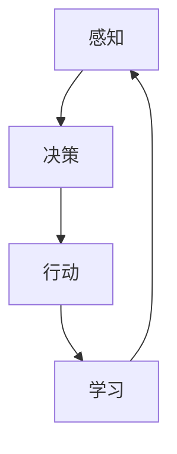

                 

关键词：智能体，自主性，人工智能，交互，多智能体系统，Agent架构

> 摘要：本文深入探讨了智能体的概念、特性及其在人工智能领域的广泛应用。通过分析智能体的核心原理和关键技术，本文旨在为读者提供全面、系统的智能体架构理解，并展望其未来发展方向。

## 1. 背景介绍

智能体（Agent）是人工智能领域中的一个重要概念，起源于多智能体系统（Multi-Agent System，MAS）的研究。在早期的计算机科学中，智能体被视为能够独立行动和作出决策的实体，其目标是实现自主性和协作性。随着人工智能技术的不断发展，智能体的概念逐渐拓展，不仅仅限于计算机程序，还包括机器人、无人车等各种自主实体。

### 1.1 智能体的定义

智能体被定义为能够感知环境、自主决策并执行行动的实体。根据这种定义，智能体可以具有多种形态，如软件程序、机器人、无人驾驶汽车等。智能体的核心特征是自主性，即它们能够根据环境和目标自主地制定行动计划，而不需要外部干预。

### 1.2 智能体的发展历程

智能体的概念最早出现在20世纪80年代，当时主要是为了解决分布式计算和智能控制问题。随着多智能体系统（MAS）理论的提出，智能体研究逐渐成为人工智能领域的一个重要分支。进入21世纪，随着人工智能技术的快速发展，智能体在无人驾驶、智能机器人、智能家居等领域的应用越来越广泛。

## 2. 核心概念与联系

### 2.1 智能体的核心概念

智能体主要包括以下几个核心概念：

1. **感知**：智能体通过传感器感知环境信息，如视觉、听觉、触觉等。
2. **决策**：智能体根据感知到的环境信息，利用决策算法选择合适的行动。
3. **行动**：智能体执行决策，与环境进行交互。
4. **学习**：智能体通过学习不断优化自身的决策和行动策略。

### 2.2 智能体架构的 Mermaid 流程图



在这个流程图中，智能体首先感知环境信息，然后通过决策算法选择行动，执行行动后，智能体会根据行动的结果进行学习，以优化未来的决策。

## 3. 核心算法原理 & 具体操作步骤

### 3.1 算法原理概述

智能体的核心算法主要包括感知、决策、行动和学习四个环节。其中，感知是智能体的基础，决策是智能体的核心，行动是智能体的表现形式，学习是智能体的持续优化手段。

### 3.2 算法步骤详解

1. **感知**：智能体通过传感器收集环境信息，如图像、声音、温度等。
2. **特征提取**：对感知到的环境信息进行特征提取，以便于后续的决策。
3. **决策**：利用机器学习、深度学习等算法对特征进行建模，生成决策模型。
4. **行动**：根据决策模型，智能体选择合适的行动，与环境进行交互。
5. **反馈**：收集行动的结果，将其作为反馈信息，用于后续的学习。
6. **学习**：根据反馈信息，调整决策模型，以优化智能体的性能。

### 3.3 算法优缺点

1. **优点**：
   - **自主性**：智能体能够自主感知、决策和行动，减少了人工干预。
   - **灵活性**：智能体可以根据环境的变化，动态调整决策和行动策略。
   - **高效性**：智能体利用机器学习等技术，能够快速处理大量数据，提高决策效率。

2. **缺点**：
   - **数据依赖**：智能体的决策依赖于大量的数据，数据的质量和数量直接影响智能体的性能。
   - **复杂性**：智能体的算法和架构相对复杂，需要专业的技术和知识。

### 3.4 算法应用领域

智能体的应用领域非常广泛，主要包括以下几个领域：

1. **无人驾驶**：智能体在无人驾驶领域发挥着重要作用，如自动驾驶汽车、无人机等。
2. **智能机器人**：智能体在智能机器人领域，可以实现自主导航、任务规划、人机交互等功能。
3. **智能家居**：智能体在智能家居领域，可以实现自动化控制、远程监控、智能家居系统等功能。
4. **智能制造**：智能体在智能制造领域，可以实现生产过程自动化、产品质量检测、智能决策等功能。

## 4. 数学模型和公式

### 4.1 数学模型构建

智能体的数学模型主要基于概率论和统计学习理论。其中，感知阶段主要涉及特征提取和概率分布模型，决策阶段主要涉及决策规则和优化算法，行动阶段主要涉及控制理论和动态规划，学习阶段主要涉及机器学习和深度学习算法。

### 4.2 公式推导过程

在智能体的感知阶段，假设智能体感知到的环境信息为 $X$，特征提取函数为 $f(X)$，则特征向量 $Z$ 可以表示为：

$$Z = f(X)$$

在决策阶段，假设智能体需要选择行动 $A$，决策规则为 $R(Z)$，则决策函数可以表示为：

$$A = R(Z)$$

在行动阶段，假设智能体需要执行行动 $A$，控制函数为 $C(Z, A)$，则行动结果可以表示为：

$$Y = C(Z, A)$$

在学习阶段，假设智能体通过学习函数 $L(Z, Y)$ 优化自身性能，则学习函数可以表示为：

$$Z' = L(Z, Y)$$

### 4.3 案例分析与讲解

以无人驾驶为例，智能体的感知阶段主要涉及图像处理、语音识别、GPS定位等技术；决策阶段主要涉及路径规划、决策树、神经网络等技术；行动阶段主要涉及控制算法、自动驾驶系统等技术；学习阶段主要涉及深度学习、强化学习等技术。通过这些技术的综合应用，无人驾驶智能体可以实现自主驾驶，提高驾驶安全性和效率。

## 5. 项目实践：代码实例和详细解释说明

### 5.1 开发环境搭建

本文将使用Python作为开发语言，主要依赖以下库：TensorFlow、Keras、NumPy、Pandas等。

### 5.2 源代码详细实现

```python
# 代码示例：智能体感知阶段
import cv2
import numpy as np

# 加载摄像头
cap = cv2.VideoCapture(0)

while True:
    # 读取摄像头图像
    ret, frame = cap.read()
    
    # 图像预处理
    gray = cv2.cvtColor(frame, cv2.COLOR_BGR2GRAY)
    blurred = cv2.GaussianBlur(gray, (5, 5), 0)
    
    # 特征提取
    edges = cv2.Canny(blurred, 30, 150)
    
    # 显示图像
    cv2.imshow('edges', edges)
    
    if cv2.waitKey(1) & 0xFF == ord('q'):
        break

cap.release()
cv2.destroyAllWindows()
```

### 5.3 代码解读与分析

上述代码示例展示了智能体感知阶段的实现过程，主要包括以下步骤：

1. **加载摄像头**：使用OpenCV库加载摄像头。
2. **读取图像**：读取摄像头捕获的图像。
3. **图像预处理**：对图像进行灰度化、高斯模糊等处理。
4. **特征提取**：使用Canny算法提取图像边缘特征。
5. **显示图像**：显示提取到的边缘特征图像。

通过这些步骤，智能体可以感知到周围环境的信息，为后续的决策阶段提供基础。

### 5.4 运行结果展示

运行上述代码，会显示摄像头捕获的实时图像，并提取出图像的边缘特征。

## 6. 实际应用场景

智能体在无人驾驶、智能机器人、智能家居、智能制造等领域都有广泛的应用。以无人驾驶为例，智能体可以感知周围环境，实时规划行驶路径，提高驾驶安全性和效率。在智能机器人领域，智能体可以实现自主导航、任务规划、人机交互等功能，提高机器人的智能化水平。在智能家居领域，智能体可以实现自动化控制、远程监控、智能家居系统等功能，提高家居生活的舒适性和便利性。在智能制造领域，智能体可以实现生产过程自动化、产品质量检测、智能决策等功能，提高生产效率和产品质量。

## 7. 工具和资源推荐

### 7.1 学习资源推荐

- 《人工智能：一种现代的方法》（作者：Stuart Russell & Peter Norvig）
- 《深度学习》（作者：Ian Goodfellow、Yoshua Bengio & Aaron Courville）
- 《机器人学导论》（作者：Oussama Khatib）

### 7.2 开发工具推荐

- Python
- TensorFlow
- Keras
- OpenCV

### 7.3 相关论文推荐

- "A Logical Foundation for Strategic Reasoning"（作者：Cynthia L. M. Baker & Kevin P. Dodd）
- "Multi-Agent Systems: A Modern Approach"（作者：Michael Wooldridge）
- "Deep Learning for Autonomous Driving"（作者：Alexey Dosovitskiy et al.）

## 8. 总结：未来发展趋势与挑战

### 8.1 研究成果总结

智能体作为人工智能领域的一个重要分支，已经取得了显著的成果。在无人驾驶、智能机器人、智能家居、智能制造等领域，智能体都发挥着重要作用。未来，随着人工智能技术的不断发展，智能体的应用前景将更加广阔。

### 8.2 未来发展趋势

1. **智能化水平提升**：随着深度学习、强化学习等技术的不断发展，智能体的智能化水平将不断提升。
2. **跨领域应用**：智能体将在更多领域得到应用，如医疗、金融、教育等。
3. **协同与协作**：智能体之间的协同与协作将成为研究重点，以提高系统的整体性能。

### 8.3 面临的挑战

1. **数据隐私和安全**：智能体在应用过程中，需要处理大量的敏感数据，如何保障数据隐私和安全是一个重要挑战。
2. **算法透明性和解释性**：智能体的决策过程通常较为复杂，如何提高算法的透明性和解释性，以便用户理解和信任，是一个亟待解决的问题。

### 8.4 研究展望

未来，智能体研究将朝着智能化、协同化、安全化的方向发展，为人工智能领域的发展做出更大的贡献。

## 9. 附录：常见问题与解答

### 9.1 智能体与机器人有什么区别？

智能体是一种能够感知环境、自主决策和行动的实体，可以包括机器人、软件程序等。而机器人是一种具体的智能体，通常具有物理形态，能够执行物理任务。

### 9.2 智能体的学习过程是如何进行的？

智能体的学习过程主要包括感知、决策、行动和反馈四个环节。智能体通过感知环境信息，利用机器学习、深度学习等技术，对环境信息进行建模，生成决策模型。然后，智能体根据决策模型执行行动，并收集行动结果作为反馈信息，用于后续的学习和优化。

### 9.3 智能体在无人驾驶中的应用有哪些？

智能体在无人驾驶中的应用主要包括环境感知、路径规划、决策控制等。智能体通过感知周围环境，实时规划行驶路径，并根据环境变化做出相应的决策，以实现自主驾驶。

### 9.4 智能体的安全性如何保障？

智能体的安全性保障主要从数据安全、算法安全、物理安全等方面进行。在数据安全方面，需要采取数据加密、权限控制等措施；在算法安全方面，需要提高算法的透明性和可解释性，以便用户理解和监督；在物理安全方面，需要确保智能体的物理安全，防止恶意攻击和破坏。

作者：禅与计算机程序设计艺术 / Zen and the Art of Computer Programming
----------------------------------------------------------------
这篇文章深入探讨了智能体的概念、特性及其在人工智能领域的广泛应用。通过分析智能体的核心原理和关键技术，本文旨在为读者提供全面、系统的智能体架构理解，并展望其未来发展方向。在未来的发展中，智能体将朝着智能化、协同化、安全化的方向发展，为人工智能领域的发展做出更大的贡献。随着技术的不断进步，我们有望看到智能体在更多领域得到应用，为人类创造更加智能、便捷的生活。

