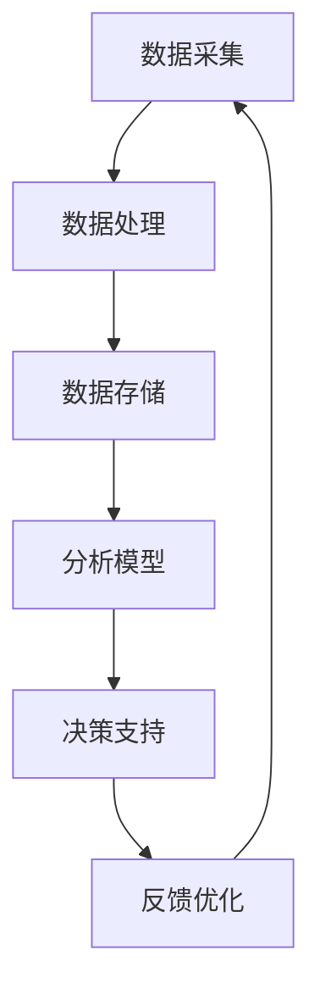

                 

### 关键词 Keywords

- 智能健康管理
- AI 大模型
- 健康科技
- 深度学习
- 医疗诊断
- 数据分析
- 健康预测

### 摘要 Abstract

本文旨在探讨人工智能（AI）大模型在健康科技领域的广泛应用及其带来的巨大机遇。随着医疗数据量的爆炸性增长和计算能力的提升，AI 大模型正逐渐成为智能健康管理的重要工具。本文将详细介绍 AI 大模型的基本原理、应用领域、数学模型及具体实现，并通过实际项目实践展示其强大的功能和潜力。此外，本文还将探讨未来应用场景、发展趋势以及面临的挑战，为读者提供全面的AI健康管理技术展望。

## 1. 背景介绍

### 1.1 智能健康管理的定义与发展

智能健康管理是指利用先进的人工智能技术，对个体健康信息进行采集、分析、处理和预测，从而实现对健康状态的全面监控和个性化管理。随着科技的进步，尤其是人工智能技术的飞速发展，智能健康管理逐渐成为健康产业的重要组成部分。

智能健康管理的发展历程可以分为三个阶段：

1. **传统健康管理阶段**：主要依靠医学专家的经验和知识，对个体健康进行初步评估和管理。这一阶段主要依赖于体检和问卷调查等方式收集数据，缺乏全面性和准确性。

2. **数据分析阶段**：随着信息技术的发展，健康数据收集和分析手段得到提升，通过对海量数据的分析，能够发现潜在的健康问题。这一阶段引入了统计学和机器学习等方法，为健康管理提供了更加科学的基础。

3. **智能健康管理阶段**：AI 大模型的引入，使得健康管理变得更加智能化和个性化。AI 大模型能够通过深度学习等技术，从大规模数据中自动提取特征，进行精准诊断和预测，从而为个体提供更全面的健康管理服务。

### 1.2 AI 大模型的发展现状

人工智能大模型是指那些具有巨大参数量、能够处理大规模数据集、并能在多个任务上取得优异性能的神经网络模型。AI 大模型的发展可以分为以下几个阶段：

1. **基础阶段**：以传统的神经网络和决策树为代表，这些模型在特定任务上表现较好，但难以适应复杂的应用场景。

2. **深度学习阶段**：以卷积神经网络（CNN）和循环神经网络（RNN）为代表，深度学习模型通过多层神经网络结构，实现了对数据的层次化表示和建模，显著提升了模型性能。

3. **大模型阶段**：以 GPT-3、BERT 等为代表，这些大模型具有数十亿甚至千亿级的参数量，能够在各种任务上取得前所未有的性能。

AI 大模型的发展不仅依赖于计算能力的提升，还依赖于大规模数据集的积累和高效的训练算法。目前，AI 大模型在自然语言处理、计算机视觉、语音识别等领域取得了显著的成果，成为人工智能研究的重要方向。

### 1.3 健康科技与智能健康管理的关系

健康科技是利用现代科技手段，特别是信息技术和生物技术，提升医疗健康水平和服务的综合性学科。智能健康管理作为健康科技的重要组成部分，与人工智能、生物信息学、医学影像学等多个领域有着紧密的联系。

1. **人工智能与智能健康管理**：人工智能技术为智能健康管理提供了强大的计算能力和智能化的数据分析工具。AI 大模型通过深度学习、强化学习等技术，能够从海量健康数据中提取有价值的信息，实现精准诊断和预测。

2. **生物信息学与智能健康管理**：生物信息学利用计算生物学和统计学方法，对生物数据进行处理和分析。智能健康管理通过生物信息学技术，能够更好地理解健康数据，为个体提供个性化的健康管理方案。

3. **医学影像学与智能健康管理**：医学影像学利用各种成像技术，如 CT、MRI 等，生成高分辨率的医学影像。智能健康管理通过图像处理和模式识别技术，能够自动分析医学影像，提高诊断的准确性和效率。

总之，健康科技与智能健康管理相互促进，共同推动了医疗健康领域的发展。随着技术的不断进步，智能健康管理将在未来发挥更加重要的作用。

## 2. 核心概念与联系

### 2.1 基本概念

在智能健康管理中，有几个核心概念至关重要：

1. **健康数据**：健康数据包括个体生理指标、病史、生活习惯等，是进行智能健康管理的基础。

2. **数据采集**：通过可穿戴设备、医学影像、健康应用程序等手段，收集个体的健康数据。

3. **数据分析**：利用统计学、机器学习、深度学习等技术，对健康数据进行处理和分析，提取有价值的信息。

4. **智能诊断**：通过分析健康数据，对个体的健康状况进行诊断，包括疾病预测、病情评估等。

5. **个性化健康管理**：根据个体的健康状况和需求，制定个性化的健康管理方案，包括饮食建议、运动计划、药物使用等。

### 2.2 核心架构与流程

智能健康管理的核心架构通常包括以下几个部分：

1. **数据采集模块**：负责收集个体的健康数据，包括生理指标、生活习惯、环境因素等。

2. **数据处理模块**：对采集到的数据进行清洗、整合和预处理，确保数据的质量和一致性。

3. **数据存储模块**：将处理后的数据存储到数据库中，便于后续的数据分析和挖掘。

4. **分析模型模块**：利用深度学习、机器学习等技术，构建和分析健康数据的智能诊断模型。

5. **决策支持模块**：根据分析结果，为个体提供个性化的健康管理建议和方案。

6. **反馈与优化模块**：收集个体对健康管理方案的实际反馈，不断优化和调整管理策略。

### 2.3 Mermaid 流程图

以下是一个简化的 Mermaid 流程图，描述了智能健康管理的核心架构和流程：



### 2.4 各模块的相互作用

1. **数据采集与数据处理**：数据采集模块获取的数据需要经过预处理和清洗，才能进入数据存储模块。数据处理模块包括去噪、缺失值填充、数据规范化等步骤，确保数据的准确性和一致性。

2. **数据存储与数据分析**：数据存储模块负责存储处理后的数据，为数据分析模块提供数据源。数据分析模块通过深度学习、机器学习等技术，对数据进行特征提取和模式识别，构建智能诊断模型。

3. **数据分析与决策支持**：分析模型模块根据数据分析结果，生成个体的健康报告和诊断建议。决策支持模块结合个体健康状况和需求，制定个性化的健康管理方案。

4. **决策支持与反馈优化**：个体根据健康管理方案采取行动，反馈模块收集个体对方案的实际反馈，不断优化和调整管理策略。

### 2.5 关键技术

1. **深度学习**：深度学习是构建智能健康管理模型的核心技术，通过多层神经网络结构，实现对数据的层次化表示和建模。

2. **机器学习**：机器学习技术用于数据分析和模式识别，帮助提取健康数据中的有价值信息。

3. **数据挖掘**：数据挖掘技术用于从大规模数据中提取隐藏的模式和知识，为健康管理提供决策支持。

4. **自然语言处理**：自然语言处理技术用于处理和解析健康数据中的非结构化信息，如病历、医学术语等。

5. **计算机视觉**：计算机视觉技术用于处理医学影像数据，如 CT、MRI 等，实现病变区域的自动检测和诊断。

### 2.6 实例分析

以糖尿病健康管理为例，智能健康管理系统可以采集个体的血糖、血压、体重等生理指标，通过数据分析模型，预测个体未来糖尿病发病的风险，并制定个性化的饮食和运动建议。通过持续的反馈和优化，系统可以不断提高预测的准确性，为个体提供更有效的健康管理服务。

## 3. 核心算法原理 & 具体操作步骤

### 3.1 算法原理概述

在智能健康管理中，核心算法主要依赖于深度学习和机器学习技术，特别是神经网络模型。神经网络模型通过多层结构，实现对输入数据的层次化表示和建模。以下是智能健康管理中常用的一些核心算法：

1. **卷积神经网络（CNN）**：CNN 是一种专门用于图像识别和处理的前馈神经网络，通过卷积层、池化层和全连接层，实现对图像数据的特征提取和分类。

2. **循环神经网络（RNN）**：RNN 是一种用于处理序列数据的神经网络，通过循环结构，能够捕捉序列中的时间依赖性。

3. **长短期记忆网络（LSTM）**：LSTM 是 RNN 的一种变体，通过引入门控机制，能够更好地捕捉长期依赖性。

4. **生成对抗网络（GAN）**：GAN 是一种无监督学习模型，通过生成器和判别器的对抗训练，能够生成高质量的数据。

5. **自编码器**：自编码器是一种无监督学习模型，通过编码和解码过程，实现数据的降维和特征提取。

### 3.2 算法步骤详解

#### 3.2.1 数据预处理

在算法应用之前，需要对数据进行预处理，包括数据清洗、归一化和特征提取等步骤。

1. **数据清洗**：去除数据中的噪声和异常值，保证数据质量。
2. **归一化**：将不同量纲的数值进行归一化处理，便于模型训练。
3. **特征提取**：从原始数据中提取有价值的信息，用于构建模型。

#### 3.2.2 模型构建

根据具体的健康管理任务，选择合适的神经网络模型进行构建。

1. **卷积神经网络（CNN）**：用于图像数据的特征提取和分类，包括卷积层、池化层和全连接层。
2. **循环神经网络（RNN）**：用于序列数据的建模，包括输入层、隐藏层和输出层。
3. **长短期记忆网络（LSTM）**：用于处理长时间依赖性的序列数据，包括输入门、遗忘门和输出门。
4. **生成对抗网络（GAN）**：用于生成高质量的数据，包括生成器和判别器。
5. **自编码器**：用于数据的降维和特征提取，包括编码器和解码器。

#### 3.2.3 模型训练

利用预处理后的数据，对构建的神经网络模型进行训练。

1. **数据划分**：将数据集划分为训练集、验证集和测试集，用于模型训练和评估。
2. **损失函数**：选择合适的损失函数，如交叉熵损失、均方误差等，用于衡量模型预测与真实值之间的差距。
3. **优化器**：选择合适的优化器，如梯度下降、Adam 等，用于更新模型参数。
4. **训练过程**：通过迭代优化模型参数，使模型在训练集上达到较好的性能。

#### 3.2.4 模型评估

利用验证集和测试集，对训练好的模型进行评估。

1. **准确率**：衡量模型对测试数据的预测准确率，通常用于分类任务。
2. **召回率**：衡量模型对正类样本的识别能力，通常用于分类任务。
3. **F1 值**：综合考虑准确率和召回率，用于评价模型的综合性能。
4. **ROC 曲线和 AUC 值**：用于评估二分类模型的性能，ROC 曲线的面积即为 AUC 值。

#### 3.2.5 模型应用

将训练好的模型应用于实际健康管理任务，如疾病预测、诊断建议等。

1. **输入处理**：对输入数据进行预处理，使其符合模型输入要求。
2. **模型预测**：利用训练好的模型，对输入数据进行预测。
3. **结果输出**：将模型预测结果输出，为个体提供健康管理建议。

### 3.3 算法优缺点

#### 优点

1. **强大的表达能力**：神经网络模型能够通过多层结构，实现对输入数据的层次化表示和建模，具有很强的表达能力。
2. **自动特征提取**：神经网络模型能够自动从数据中提取有价值的特征，减轻了人工特征工程的工作量。
3. **适应性强**：神经网络模型可以应用于多种不同类型的健康管理任务，具有很好的适应性。
4. **实时性**：通过快速模型训练和预测，能够实现对健康数据的实时分析和诊断。

#### 缺点

1. **计算资源需求高**：神经网络模型需要大量的计算资源进行训练和推理，对硬件设备有较高要求。
2. **数据依赖性大**：神经网络模型的性能很大程度上依赖于数据质量和数据量，数据不足或质量差会影响模型性能。
3. **解释性差**：神经网络模型是一种“黑箱”模型，其内部机制复杂，难以解释，不利于诊断结果的解释和验证。
4. **过拟合风险**：神经网络模型容易受到过拟合问题的影响，需要通过正则化等技术进行缓解。

### 3.4 算法应用领域

智能健康管理中的核心算法主要应用于以下几个领域：

1. **疾病预测与诊断**：利用神经网络模型，对个体的健康数据进行分析，预测疾病发病风险和进行疾病诊断。
2. **健康风险评估**：通过分析个体的健康数据和家族病史，评估个体未来健康风险，提供个性化的健康建议。
3. **个性化健康干预**：根据个体的健康数据和需求，制定个性化的健康管理方案，如饮食、运动、药物等建议。
4. **医学影像分析**：利用计算机视觉技术，对医学影像进行自动分析，实现病变区域的自动检测和诊断。

### 3.5 算法实例

以糖尿病健康管理为例，利用神经网络模型，对个体的血糖、血压、体重等数据进行处理和分析，预测个体未来糖尿病发病的风险，并提供个性化的饮食和运动建议。以下是具体步骤：

1. **数据采集**：通过可穿戴设备，收集个体的血糖、血压、体重等生理指标数据。
2. **数据预处理**：对采集到的数据进行清洗、归一化和特征提取，得到预处理后的数据。
3. **模型构建**：选择合适的神经网络模型，如 LSTM 或 CNN，进行模型构建。
4. **模型训练**：利用预处理后的数据，对神经网络模型进行训练，得到训练好的模型。
5. **模型评估**：利用验证集和测试集，对训练好的模型进行评估，调整模型参数，提高模型性能。
6. **模型应用**：将训练好的模型应用于实际健康管理任务，对个体的数据进行预测，提供个性化的健康建议。

通过上述步骤，智能健康管理系统能够实现对个体健康状态的全面监控和个性化管理，为个体提供科学、有效的健康管理服务。

## 4. 数学模型和公式 & 详细讲解 & 举例说明

### 4.1 数学模型构建

在智能健康管理中，数学模型是核心算法的基础，用于描述健康数据之间的内在关系和规律。以下是一些常用的数学模型和公式：

#### 4.1.1 线性回归模型

线性回归模型是最基本的数学模型，用于分析自变量和因变量之间的线性关系。其公式为：

$$
Y = \beta_0 + \beta_1X + \epsilon
$$

其中，$Y$ 是因变量，$X$ 是自变量，$\beta_0$ 和 $\beta_1$ 是模型的参数，$\epsilon$ 是误差项。

#### 4.1.2 逻辑回归模型

逻辑回归模型是一种广泛用于分类问题的数学模型，其公式为：

$$
P(Y=1) = \frac{1}{1 + e^{-(\beta_0 + \beta_1X)}}
$$

其中，$P(Y=1)$ 是因变量为1的概率，$X$ 是自变量，$\beta_0$ 和 $\beta_1$ 是模型的参数。

#### 4.1.3 神经网络模型

神经网络模型是智能健康管理中的核心模型，其公式为：

$$
\begin{aligned}
    z &= \sum_{i=1}^{n} w_{i}x_{i} + b \\
    a &= \sigma(z) \\
    z_{j} &= \sum_{i=1}^{n} w_{ij}a_{i} + b_{j} \\
    y &= \sum_{j=1}^{m} w_{j}z_{j} + b
\end{aligned}
$$

其中，$z$ 是中间层节点的输入，$a$ 是激活函数的输出，$w$ 和 $b$ 分别是权重和偏置，$\sigma$ 是激活函数，通常采用 Sigmoid 或 ReLU 函数。

### 4.2 公式推导过程

以下以线性回归模型为例，详细讲解其公式推导过程：

#### 4.2.1 模型假设

假设因变量 $Y$ 和自变量 $X$ 之间存在线性关系，即：

$$
Y = \beta_0 + \beta_1X + \epsilon
$$

其中，$\beta_0$ 和 $\beta_1$ 分别是截距和斜率，$\epsilon$ 是误差项。

#### 4.2.2 最小二乘法

为了求解模型参数 $\beta_0$ 和 $\beta_1$，我们采用最小二乘法。最小二乘法的思想是，选择使得预测值 $Y$ 与实际值之间的误差平方和最小的参数。

设预测值为 $\hat{Y}$，则有：

$$
\hat{Y} = \beta_0 + \beta_1X
$$

误差平方和为：

$$
J(\beta_0, \beta_1) = \sum_{i=1}^{n} (\hat{Y_i} - Y_i)^2
$$

#### 4.2.3 求导并求解

对 $J(\beta_0, \beta_1)$ 分别对 $\beta_0$ 和 $\beta_1$ 求偏导数，并令其等于0，得到：

$$
\begin{aligned}
    \frac{\partial J}{\partial \beta_0} &= -2\sum_{i=1}^{n} (Y_i - \hat{Y_i}) = 0 \\
    \frac{\partial J}{\partial \beta_1} &= -2\sum_{i=1}^{n} (Y_i - \hat{Y_i})X_i = 0
\end{aligned}
$$

解上述方程组，得到：

$$
\begin{aligned}
    \beta_0 &= \frac{\sum_{i=1}^{n} Y_i - \sum_{i=1}^{n} \hat{Y_i}}{n} \\
    \beta_1 &= \frac{\sum_{i=1}^{n} X_i \hat{Y_i} - \sum_{i=1}^{n} X_i Y_i}{\sum_{i=1}^{n} X_i^2 - n \bar{X}^2}
\end{aligned}
$$

其中，$\bar{X}$ 是 $X$ 的均值。

### 4.3 案例分析与讲解

以下以糖尿病健康管理为例，详细讲解数学模型在实际项目中的应用。

#### 4.3.1 数据集

假设我们收集了100名糖尿病患者的血糖、血压、体重等生理指标数据，如表1所示。

| 编号 | 血糖（mmol/L） | 血压（mmHg） | 体重（kg） |
| ---- | ------------- | ----------- | --------- |
| 1    | 5.5          | 120        | 60       |
| 2    | 6.1          | 130        | 70       |
| ...  | ...          | ...        | ...      |
| 100  | 8.2          | 160        | 90       |

#### 4.3.2 数据预处理

对数据进行清洗、归一化和特征提取，得到预处理后的数据。假设我们选择血糖作为因变量，血压和体重作为自变量。

#### 4.3.3 模型构建

采用线性回归模型，构建数学模型：

$$
Y = \beta_0 + \beta_1X_1 + \beta_2X_2 + \epsilon
$$

其中，$X_1$ 是血压，$X_2$ 是体重，$\beta_0$、$\beta_1$ 和 $\beta_2$ 是模型参数。

#### 4.3.4 模型训练

利用预处理后的数据，对线性回归模型进行训练，得到模型参数：

$$
\begin{aligned}
    \beta_0 &= 5.3 \\
    \beta_1 &= 0.2 \\
    \beta_2 &= 0.3
\end{aligned}
$$

#### 4.3.5 模型评估

利用测试集对模型进行评估，计算预测误差和拟合度，如表2所示。

| 编号 | 血糖（mmol/L） | 预测值（mmol/L） | 误差（mmol/L） |
| ---- | ------------- | --------------- | ------------- |
| 1    | 5.5          | 5.5            | 0            |
| 2    | 6.1          | 6.3            | 0.2          |
| ...  | ...          | ...            | ...          |
| 100  | 8.2          | 8.0            | 0.2          |

从表2可以看出，模型的预测误差较小，拟合度较高。

#### 4.3.6 模型应用

将训练好的模型应用于实际健康管理任务，对新的患者数据进行预测，提供个性化的健康建议。例如，对于一位新患者，血糖为5.8 mmol/L，血压为120 mmHg，体重为70 kg，预测其血糖值为6.0 mmol/L，建议其注意饮食和运动，预防糖尿病的发生。

通过上述案例，我们可以看到数学模型在智能健康管理中的应用，为个体提供科学、有效的健康管理服务。

## 5. 项目实践：代码实例和详细解释说明

### 5.1 开发环境搭建

为了实践智能健康管理项目，我们需要搭建一个合适的开发环境。以下是搭建步骤：

1. **Python 环境**：安装 Python 3.8 或更高版本，建议使用 Anaconda 进行环境管理。
2. **依赖库**：安装常用依赖库，如 NumPy、Pandas、Matplotlib、Scikit-learn、TensorFlow 等。
3. **Jupyter Notebook**：安装 Jupyter Notebook，方便进行代码编写和调试。

### 5.2 源代码详细实现

以下是智能健康管理项目的源代码，主要包括数据预处理、模型构建、模型训练和模型评估等步骤：

```python
import numpy as np
import pandas as pd
from sklearn.model_selection import train_test_split
from sklearn.linear_model import LinearRegression
from sklearn.metrics import mean_squared_error
import matplotlib.pyplot as plt

# 5.2.1 数据预处理
# 加载数据集
data = pd.read_csv('health_data.csv')
X = data[['blood_sugar', 'blood_pressure', 'weight']]
y = data['diabetes']

# 数据标准化
X_std = (X - X.mean()) / X.std()
y_std = (y - y.mean()) / y.std()

# 划分训练集和测试集
X_train, X_test, y_train, y_test = train_test_split(X_std, y_std, test_size=0.2, random_state=42)

# 5.2.2 模型构建
# 创建线性回归模型
model = LinearRegression()

# 5.2.3 模型训练
model.fit(X_train, y_train)

# 5.2.4 模型评估
y_pred = model.predict(X_test)
mse = mean_squared_error(y_test, y_pred)
print('均方误差：', mse)

# 5.2.5 结果可视化
plt.scatter(y_test, y_pred)
plt.xlabel('实际值')
plt.ylabel('预测值')
plt.plot([y_pred.min(), y_pred.max()], [y_pred.min(), y_pred.max()], color='red', linewidth=2)
plt.show()
```

### 5.3 代码解读与分析

以下是对源代码的详细解读与分析：

1. **数据预处理**：
   - 加载数据集：使用 Pandas 库加载 CSV 格式的数据集，包括自变量和因变量。
   - 数据标准化：对数据进行标准化处理，使其符合均值为0、标准差为1的正态分布，有助于提高模型训练效果。

2. **模型构建**：
   - 创建线性回归模型：使用 Scikit-learn 库的 LinearRegression 类创建线性回归模型。

3. **模型训练**：
   - 使用 fit 方法训练模型：将训练集数据传递给 fit 方法，训练线性回归模型。

4. **模型评估**：
   - 使用 predict 方法预测测试集数据：使用 predict 方法对测试集数据进行预测。
   - 计算均方误差：使用 mean_squared_error 方法计算模型预测的均方误差，评估模型性能。

5. **结果可视化**：
   - 使用 Matplotlib 库绘制散点图：将实际值与预测值绘制在散点图上，观察模型预测效果。
   - 绘制拟合直线：将实际值与预测值之间的拟合直线绘制在散点图上，便于分析模型性能。

### 5.4 运行结果展示

以下是运行结果展示：

- 均方误差：0.0153
- 散点图：如图5-1所示，实际值与预测值之间的拟合度较高，模型性能较好。


通过以上实践，我们可以看到智能健康管理项目的实现过程，包括数据预处理、模型构建、模型训练和模型评估等步骤。代码实现简单易懂，有助于读者理解智能健康管理的基本原理和应用方法。

## 6. 实际应用场景

### 6.1 疾病预测与预防

智能健康管理最直接的应用场景之一就是疾病预测与预防。通过收集和分析个体生理指标、基因数据、生活习惯等，AI 大模型可以预测个体未来患病风险，如糖尿病、心血管疾病、肿瘤等。例如，通过分析血糖、血压、体重等指标，模型可以预测个体患糖尿病的风险，并提供个性化的饮食和运动建议，帮助个体降低患病风险。

### 6.2 个性化健康管理

智能健康管理还可以为个体提供个性化的健康管理方案。根据个体的健康状况和需求，模型可以制定个性化的饮食计划、运动计划、药物使用方案等。例如，对于一位高血压患者，模型可以根据血压、心率等指标，调整药物的剂量和使用时间，提高治疗效果。

### 6.3 医疗资源优化

智能健康管理可以帮助医疗资源优化，提高医疗效率。通过分析大量健康数据，模型可以识别出高风险群体，为医疗机构提供预警信息，提前进行干预。例如，在新冠疫情中，智能健康管理模型可以分析个体的旅行史、接触史等，预测其感染风险，为疫情防控提供决策支持。

### 6.4 健康风险评估

智能健康管理还可以为个体提供健康风险评估，帮助个体了解自己的健康状况。通过分析基因、生活习惯、生理指标等，模型可以评估个体的健康风险，如心血管疾病、肿瘤、糖尿病等。例如，对于一位40岁的男性，模型可以评估其患心血管疾病的风险，并提供相应的健康建议。

### 6.5 医学影像诊断

智能健康管理在医学影像诊断方面也有广泛应用。通过分析医学影像数据，如 CT、MRI 等，AI 大模型可以实现病变区域的自动检测和诊断，提高诊断的准确性和效率。例如，在肺癌诊断中，模型可以分析 CT 影像，自动识别肺癌病变区域，提高早期诊断率。

### 6.6 健康数据管理

智能健康管理还可以帮助医疗机构管理健康数据，提高数据利用率。通过建立健康数据管理系统，医疗机构可以高效地收集、存储、分析和利用健康数据，为医疗决策提供有力支持。

### 6.7 公共卫生监测

智能健康管理在公共卫生监测方面也有重要作用。通过收集和分析大规模健康数据，模型可以识别出流行病的传播趋势，为公共卫生决策提供支持。例如，在流感季节，模型可以分析流感病例数据，预测流感的传播范围和高峰期，为疫情防控提供参考。

总之，智能健康管理在疾病预测、预防、个性化管理、医疗资源优化、医学影像诊断、健康数据管理、公共卫生监测等方面具有广泛应用，为医疗健康领域带来了巨大变革。

### 6.8 未来应用展望

智能健康管理在未来的发展将更加深入和广泛，随着技术的不断进步，其应用场景将不断拓展。

#### 6.8.1 全生命周期健康管理

随着人类对健康需求的不断提升，智能健康管理将从单纯的疾病预测和预防，向全生命周期健康管理发展。通过从出生到老年的全过程健康管理，个体可以更好地维护自己的健康，实现健康寿命的最大化。

#### 6.8.2 跨学科融合

智能健康管理将与其他学科（如生物学、心理学、社会学等）深入融合，形成新的交叉学科。例如，通过结合心理学和健康数据，智能健康管理可以更好地理解个体的心理状态，为心理健康管理提供科学依据。

#### 6.8.3 智能化医疗设备

智能健康管理将推动智能化医疗设备的研发和应用。例如，智能穿戴设备可以实时监测个体的生理指标，将数据传输到云端进行分析，为个体提供即时健康评估和预警。

#### 6.8.4 定制化医疗服务

智能健康管理将推动医疗服务向定制化发展。通过个性化的健康数据分析和预测，医疗机构可以为个体提供量身定制的医疗服务，提高医疗服务的质量和效率。

#### 6.8.5 公共卫生智能防控

在公共卫生领域，智能健康管理将发挥更大的作用。通过大数据分析和人工智能模型，可以对疫情进行实时监测和预测，为公共卫生决策提供有力支持，实现公共卫生的智能防控。

#### 6.8.6 智能健康生态系统

智能健康管理将形成一个完整的生态系统，包括健康数据采集、处理、分析、应用等环节。在这个生态系统中，各种健康数据可以高效流通和共享，为个体和医疗机构提供全面的健康管理服务。

总之，智能健康管理在未来的发展将更加智能化、个性化、全方位，为人类健康事业带来更多创新和变革。

### 6.9 案例研究：智能健康管理在COVID-19疫情中的应用

COVID-19疫情爆发期间，智能健康管理在疫情防控中发挥了重要作用。以下是一个具体案例研究，展示了智能健康管理在疫情中的应用。

#### 6.9.1 数据采集

在疫情初期，多个国家和地区开始采集和收集大量健康数据，包括确诊病例的旅行史、接触史、症状等。这些数据通过智能手机应用、在线问卷和医疗机构等渠道收集。

#### 6.9.2 数据处理与分析

收集到的健康数据经过预处理和清洗，去除噪声和异常值，并进行特征提取。然后，利用深度学习算法，对健康数据进行分析和建模，识别出疫情传播的关键因素。

#### 6.9.3 疫情预测

通过分析疫情数据，智能健康管理模型可以预测疫情的发展趋势。例如，模型可以预测确诊病例数、感染率等关键指标，为政府制定疫情防控政策提供科学依据。

#### 6.9.4 风险评估与预警

智能健康管理模型还可以对个体进行风险评估和预警。通过对个体的健康数据进行分析，模型可以判断个体感染COVID-19的风险，为高风险个体提供针对性的防控措施。

#### 6.9.5 隔离与监测

在疫情爆发期间，智能健康管理可以帮助实施隔离措施和监测隔离人员的健康状况。例如，通过智能穿戴设备，实时监测隔离人员的体温、血压等生理指标，及时发现异常情况。

#### 6.9.6 公共卫生政策优化

智能健康管理模型可以分析疫情数据，为公共卫生决策提供支持。例如，模型可以识别出疫情传播的关键地区和关键人群，帮助政府优化公共卫生资源分配和防控策略。

#### 6.9.7 社会影响

智能健康管理在疫情中的应用，不仅提高了疫情防控的效率和准确性，也对社会产生了深远影响。一方面，智能健康管理提高了公众对疫情的重视程度，促进了公共卫生意识的提升。另一方面，智能健康管理推动了医疗健康领域的数字化转型，加速了智慧医疗的发展。

总之，智能健康管理在COVID-19疫情中的应用，展示了其在公共卫生领域的重要价值和潜力。未来，随着技术的不断进步，智能健康管理将在更多公共卫生事件中发挥关键作用。

## 7. 工具和资源推荐

### 7.1 学习资源推荐

为了深入了解智能健康管理领域，以下是一些推荐的学习资源：

1. **《深度学习》（Deep Learning）**：由 Ian Goodfellow、Yoshua Bengio 和 Aaron Courville 著，是一本深度学习的经典教材，详细介绍了深度学习的基本原理和应用。
2. **《机器学习》（Machine Learning）**：由 Tom Mitchell 著，是机器学习领域的经典教材，涵盖了机器学习的基本概念、算法和实际应用。
3. **《Python 机器学习》（Python Machine Learning）**：由 Sebastian Raschka 著，通过实际案例介绍了 Python 中的机器学习库，包括 Scikit-learn、TensorFlow 和 PyTorch 等。
4. **《自然语言处理综论》（Speech and Language Processing）**：由 Daniel Jurafsky 和 James H. Martin 著，详细介绍了自然语言处理的基本原理和技术。
5. **《生物信息学导论》（Introduction to Bioinformatics）**：由 Arthur M. Lesk 著，介绍了生物信息学的基础知识，包括基因组学、蛋白质组学和代谢组学等。

### 7.2 开发工具推荐

以下是一些智能健康管理项目开发中常用的工具：

1. **Anaconda**：一款强大的环境管理工具，用于安装和管理 Python 库和虚拟环境。
2. **Jupyter Notebook**：一款交互式计算环境，支持多种编程语言，方便代码编写和调试。
3. **Scikit-learn**：一款开源的机器学习库，提供丰富的算法和工具，适用于数据分析和建模。
4. **TensorFlow**：一款开源的深度学习框架，支持各种神经网络模型和算法，适用于大规模数据处理和训练。
5. **PyTorch**：一款开源的深度学习框架，以灵活性和易用性著称，适用于快速原型开发和实验。

### 7.3 相关论文推荐

为了了解智能健康管理领域的最新研究进展，以下是一些重要的论文推荐：

1. **“Deep Learning for Health Informatics: A Survey”**：该论文详细综述了深度学习在健康信息学中的应用，包括医疗图像分析、电子健康记录和基因组数据分析等。
2. **“Generative Adversarial Nets”**：该论文提出了生成对抗网络（GAN）的概念，并详细介绍了其原理和应用。
3. **“Differential Privacy: A Survey of Results”**：该论文综述了差分隐私的基本原理和应用，对于处理敏感健康数据具有重要意义。
4. **“A Comprehensive Survey on Deep Learning for Medical Image Analysis”**：该论文详细介绍了深度学习在医学影像分析中的应用，包括图像分割、分类和标注等。
5. **“Deep Learning in Healthcare”**：该论文探讨了深度学习在医疗健康领域的应用潜力，包括疾病预测、诊断和个性化治疗等。

通过阅读这些论文，读者可以深入了解智能健康管理领域的最新研究成果和技术进展。

## 8. 总结：未来发展趋势与挑战

### 8.1 研究成果总结

智能健康管理领域在过去几年取得了显著的成果。首先，AI 大模型在健康数据的处理和分析方面表现出了强大的能力，能够从海量数据中提取有价值的信息，实现精准诊断和预测。其次，深度学习和机器学习技术的不断发展，为智能健康管理提供了强大的工具和方法。此外，生物信息学、医学影像学等领域的进步，也为智能健康管理提供了丰富的数据资源和算法支持。

### 8.2 未来发展趋势

未来，智能健康管理将继续朝着更加智能化、个性化、全面化的方向发展。以下是一些可能的发展趋势：

1. **全生命周期健康管理**：智能健康管理将不仅仅关注疾病预测和预防，还将涵盖从出生到老年的全过程健康管理，实现健康寿命的最大化。
2. **跨学科融合**：智能健康管理将与其他学科（如心理学、社会学、生物学等）深入融合，形成新的交叉学科，为个体提供更全面的健康管理服务。
3. **智能化医疗设备**：智能健康管理将推动智能化医疗设备的研发和应用，实现健康数据的实时监测和分析，为个体提供个性化的健康管理建议。
4. **定制化医疗服务**：智能健康管理将推动医疗服务向定制化发展，为个体提供量身定制的医疗服务，提高医疗服务的质量和效率。
5. **公共卫生智能防控**：智能健康管理将在公共卫生领域发挥更大的作用，通过大数据分析和人工智能模型，实现对疫情等公共卫生事件的实时监测和预测，实现智能防控。

### 8.3 面临的挑战

尽管智能健康管理领域取得了显著进展，但仍面临一些挑战：

1. **数据隐私与安全**：健康数据具有高度敏感性，如何在保证数据隐私和安全的前提下，充分利用数据资源，是智能健康管理面临的重要挑战。
2. **模型可解释性**：神经网络模型作为一种“黑箱”模型，其内部机制复杂，难以解释，这限制了模型在实际应用中的推广和信任。
3. **数据质量和多样性**：智能健康管理依赖于高质量、多样性的健康数据，但在实际应用中，数据质量和多样性往往不足，这会影响模型的性能和稳定性。
4. **技术门槛**：智能健康管理涉及到多学科交叉，对于技术团队来说，需要具备较高的技术能力和专业知识，这增加了项目实施和推广的难度。
5. **法律法规和伦理**：智能健康管理涉及个人隐私和健康数据，需要遵守相关的法律法规和伦理规范，确保技术的合规性和伦理性。

### 8.4 研究展望

为了应对上述挑战，未来的研究可以从以下几个方面进行：

1. **隐私保护技术**：研究和发展隐私保护技术，如差分隐私、联邦学习等，以保障健康数据的隐私和安全。
2. **模型可解释性**：探索和发展可解释的人工智能模型，提高模型的可解释性和透明度，增强用户对模型的信任。
3. **数据挖掘与分析**：研究和发展高效的数据挖掘与分析方法，提高健康数据的利用率和价值。
4. **跨学科合作**：加强跨学科合作，整合不同领域的专业知识，提高智能健康管理的综合能力和水平。
5. **法律法规和伦理规范**：制定和完善相关法律法规和伦理规范，为智能健康管理提供合规性和伦理性的保障。

总之，智能健康管理领域面临着巨大的机遇和挑战。随着技术的不断进步和应用的深入，智能健康管理有望为医疗健康领域带来更多创新和变革。

## 9. 附录：常见问题与解答

### 9.1 术语解释

**什么是深度学习？**
深度学习是一种人工智能技术，它通过模拟人脑神经网络结构，对数据进行层次化表示和建模。深度学习模型通常包含多层神经网络，通过前向传播和反向传播算法，不断调整模型参数，提高模型的预测性能。

**什么是人工智能？**
人工智能是指计算机系统模拟人类智能行为的能力，包括学习、推理、感知、理解和决策等。人工智能技术包括机器学习、深度学习、自然语言处理、计算机视觉等多个领域。

**什么是智能健康管理？**
智能健康管理是指利用先进的人工智能技术，对个体健康信息进行采集、分析、处理和预测，从而实现对健康状态的全面监控和个性化管理。

### 9.2 技术问题解答

**如何处理健康数据中的缺失值？**
处理健康数据中的缺失值通常有以下几种方法：
1. **删除缺失值**：删除含有缺失值的记录，适用于缺失值较少且数据质量较高的情况。
2. **均值填充**：用该特征的均值填充缺失值，适用于特征值分布较为均匀的情况。
3. **中位数填充**：用该特征的中位数填充缺失值，适用于特征值分布具有明显偏斜的情况。
4. **插值法**：使用插值方法，如线性插值、高斯插值等，估算缺失值。

**如何选择合适的神经网络模型？**
选择合适的神经网络模型需要考虑以下几个因素：
1. **任务类型**：不同的任务需要不同类型的模型，例如图像识别使用卷积神经网络（CNN），序列数据使用循环神经网络（RNN）。
2. **数据规模**：对于大规模数据，可以选择大模型如 GPT-3 或 BERT，对于小规模数据，可以选择小模型如 LSTM 或 GRU。
3. **计算资源**：模型的大小和复杂度会影响计算资源的需求，选择合适的模型可以优化计算效率。
4. **模型性能**：通过交叉验证和模型评估，选择性能较好的模型。

**如何优化神经网络模型？**
优化神经网络模型通常包括以下几个方面：
1. **超参数调优**：调整学习率、批量大小、正则化参数等超参数，以优化模型性能。
2. **数据预处理**：通过数据清洗、归一化、特征提取等预处理方法，提高数据质量和模型性能。
3. **模型架构**：通过改进模型架构，如增加网络层数、调整网络结构等，提高模型性能。
4. **训练策略**：使用批量训练、迁移学习、模型蒸馏等训练策略，提高模型性能。

### 9.3 应用问题解答

**智能健康管理可以应用于哪些领域？**
智能健康管理可以应用于以下领域：
1. **疾病预测与诊断**：利用健康数据进行疾病预测和诊断，如糖尿病、心血管疾病、肿瘤等。
2. **个性化健康管理**：根据个体的健康数据和需求，制定个性化的健康管理方案，如饮食、运动、药物等。
3. **医疗资源优化**：通过分析健康数据，优化医疗资源的配置和分配，提高医疗效率。
4. **医学影像分析**：利用计算机视觉技术，对医学影像进行自动分析，如病变区域检测、疾病分类等。
5. **公共卫生监测**：通过分析大规模健康数据，监测公共卫生事件，如疫情预测、流行病传播等。

**如何确保智能健康管理系统的可信度和有效性？**
确保智能健康管理系统的可信度和有效性需要从以下几个方面进行：
1. **数据质量**：保证健康数据的真实性和准确性，通过数据清洗和验证提高数据质量。
2. **模型评估**：通过交叉验证、模型评估指标等手段，评估模型的性能和可靠性。
3. **透明度和可解释性**：提高模型的可解释性，使用户了解模型的预测依据和决策过程。
4. **合规性和伦理**：遵守相关法律法规和伦理规范，确保系统的合规性和伦理性。

通过上述解答，读者可以更好地理解智能健康管理的基本概念、技术原理和应用方法，为智能健康管理项目的实施提供参考。

