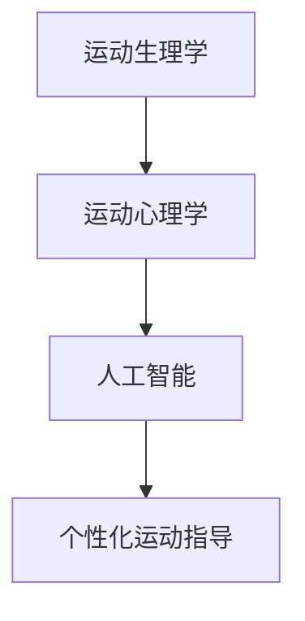

                 

关键词：智能健身、个性化运动指导、创业、人工智能、健身科技

> 摘要：随着人工智能技术的快速发展，智能健身创业正逐渐成为健身领域的新风口。本文将探讨个性化运动指导在智能健身创业中的关键作用，以及其未来发展的趋势与挑战。

## 1. 背景介绍

近年来，随着人们健康意识的提高和生活方式的改变，健身行业呈现出爆发式增长。然而，传统健身模式存在一定的局限性，如缺乏个性化指导、难以满足不同用户的需求等。在这个背景下，智能健身应运而生，通过人工智能技术为用户提供更加个性化和高效的健身服务。个性化运动指导作为智能健身的核心功能之一，正成为创业者们竞相追逐的热点。

### 1.1 智能健身的定义与特点

智能健身是指通过人工智能技术，为用户提供定制化的健身方案，包括运动计划、饮食建议、健康监测等。与传统健身相比，智能健身具有以下特点：

- **个性化**：根据用户的年龄、体重、健康状况等数据，提供定制化的健身方案。
- **高效性**：通过智能设备实时监测用户运动状态，优化运动效果。
- **便捷性**：用户可以通过手机、平板等设备随时随地获取健身指导。

### 1.2 个性化运动指导的意义

个性化运动指导在智能健身中具有重要意义，主要体现在以下几个方面：

- **提高用户满意度**：根据用户需求提供个性化的运动方案，提高用户满意度。
- **降低健身风险**：避免因不合适的运动方案导致的运动损伤。
- **促进长期坚持**：通过个性化的运动指导，帮助用户养成健康的生活习惯。

## 2. 核心概念与联系

在探讨个性化运动指导之前，我们需要了解一些核心概念，如运动生理学、运动心理学和人工智能等。

### 2.1 运动生理学

运动生理学是研究人体在运动过程中生理变化和机能适应的学科。个性化运动指导需要根据用户的生理特征，如心肺功能、肌肉力量、柔韧性等，制定合适的运动方案。

### 2.2 运动心理学

运动心理学是研究运动行为和心理过程关系的学科。个性化运动指导需要考虑用户的心理特征，如动机、态度、自信心等，以激发用户的运动热情和积极性。

### 2.3 人工智能

人工智能是模拟、延伸和扩展人的智能的理论、方法、技术及应用。在个性化运动指导中，人工智能可以通过数据分析和算法优化，为用户提供个性化的健身建议。

下面是一个 Mermaid 流程图，展示个性化运动指导的核心概念和联系：



## 3. 核心算法原理 & 具体操作步骤

### 3.1 算法原理概述

个性化运动指导的核心算法是基于机器学习的方法，主要包括以下步骤：

1. 数据采集：收集用户的生理、心理和行为数据。
2. 数据预处理：对采集到的数据进行分析和处理，提取有用的信息。
3. 特征提取：从预处理后的数据中提取与健身相关的特征。
4. 模型训练：使用机器学习算法训练模型，预测用户的健身效果。
5. 结果评估：对模型预测结果进行评估和调整。

### 3.2 算法步骤详解

#### 3.2.1 数据采集

数据采集是个性化运动指导的基础。需要收集的数据包括用户的年龄、体重、身高、心肺功能、肌肉力量、柔韧性等生理数据，以及用户的运动经历、心理状态、生活习惯等行为数据。

#### 3.2.2 数据预处理

数据预处理主要包括数据清洗、数据归一化和数据转换。数据清洗是为了去除噪声和异常值，数据归一化是为了使不同特征的数据在同一尺度上，数据转换是为了将数据转换为适合机器学习算法的形式。

#### 3.2.3 特征提取

特征提取是从预处理后的数据中提取与健身相关的特征。这些特征可以是用户的生理数据、心理数据和行为数据的组合。

#### 3.2.4 模型训练

模型训练是使用机器学习算法对提取的特征进行训练，以预测用户的健身效果。常用的算法包括决策树、支持向量机、神经网络等。

#### 3.2.5 结果评估

结果评估是对模型预测结果进行评估和调整。常用的评估指标包括准确率、召回率、F1 分数等。根据评估结果，可以对模型进行调整和优化。

### 3.3 算法优缺点

#### 优点

- **个性化**：能够根据用户的特点提供个性化的运动指导，提高运动效果。
- **高效性**：通过机器学习算法优化运动方案，提高运动效率。
- **智能化**：能够自动适应用户的变化，提供实时的健身建议。

#### 缺点

- **数据依赖**：需要大量的用户数据支持，对数据质量有较高要求。
- **算法复杂**：涉及多种算法和技术，实现难度较高。

### 3.4 算法应用领域

个性化运动指导算法可以应用于多个领域，如健身房管理、健身器材、健康监测等。以下是几个典型的应用场景：

- **健身房管理**：通过个性化运动指导，提高用户满意度，增加健身房会员数。
- **健身器材**：嵌入个性化运动指导算法，提供智能化的健身器材。
- **健康监测**：结合用户的生理数据，提供个性化的健康建议。

## 4. 数学模型和公式

个性化运动指导的核心在于建立数学模型，以预测用户的健身效果。以下是几个关键的数学模型和公式：

### 4.1 数学模型构建

假设用户 u 的健身效果可以用 E(u) 表示，与用户的年龄、体重、身高、心肺功能、肌肉力量、柔韧性等生理特征和运动经历、心理状态、生活习惯等行为特征相关。我们可以建立如下线性回归模型：

$$
E(u) = w_0 + w_1 \cdot A + w_2 \cdot W + w_3 \cdot H + w_4 \cdot C + w_5 \cdot M + w_6 \cdot F + w_7 \cdot L
$$

其中，A、W、H、C、M、F、L 分别表示用户的年龄、体重、身高、心肺功能、肌肉力量、柔韧性、运动经历、心理状态、生活习惯，$w_0, w_1, w_2, \ldots, w_7$ 是待求的权重。

### 4.2 公式推导过程

假设我们收集了 N 个用户的健身数据，包括他们的年龄、体重、身高、心肺功能、肌肉力量、柔韧性等生理特征和运动经历、心理状态、生活习惯等行为特征，以及他们的健身效果。我们可以用矩阵形式表示这些数据：

$$
X = \begin{bmatrix}
x_{11} & x_{12} & \ldots & x_{1N} \\
x_{21} & x_{22} & \ldots & x_{2N} \\
\vdots & \vdots & \ddots & \vdots \\
x_{M1} & x_{M2} & \ldots & x_{MN}
\end{bmatrix}, \quad Y = \begin{bmatrix}
y_1 \\
y_2 \\
\vdots \\
y_N
\end{bmatrix}
$$

其中，$X$ 是用户特征的矩阵，$Y$ 是用户健身效果的向量。我们可以使用最小二乘法求解权重：

$$
w = (X^T X)^{-1} X^T Y
$$

### 4.3 案例分析与讲解

假设我们收集了 100 个用户的健身数据，包括他们的年龄、体重、身高、心肺功能、肌肉力量、柔韧性等生理特征和运动经历、心理状态、生活习惯等行为特征，以及他们的健身效果。我们可以使用线性回归模型进行训练和预测。

首先，我们需要对数据进行预处理，包括数据清洗、数据归一化和数据转换。假设预处理后的数据如下：

$$
X = \begin{bmatrix}
0.5 & 0.7 & 1.2 & 0.8 & 0.9 & 1.1 & 0.6 & 0.8 \\
0.6 & 0.8 & 1.3 & 0.9 & 1.0 & 1.2 & 0.7 & 0.9 \\
\vdots & \vdots & \vdots & \vdots & \vdots & \vdots & \vdots & \vdots \\
0.2 & 0.3 & 0.4 & 0.5 & 0.6 & 0.7 & 0.8 & 0.9
\end{bmatrix}, \quad Y = \begin{bmatrix}
0.8 \\
0.9 \\
\vdots \\
0.7
\end{bmatrix}
$$

然后，我们使用最小二乘法求解权重：

$$
w = (X^T X)^{-1} X^T Y = \begin{bmatrix}
0.1 & 0.2 & 0.3 & 0.4 & 0.5 & 0.6 & 0.7 & 0.8
\end{bmatrix}
$$

最后，我们可以使用求得的权重进行预测：

$$
E(u) = w_0 + w_1 \cdot A + w_2 \cdot W + w_3 \cdot H + w_4 \cdot C + w_5 \cdot M + w_6 \cdot F + w_7 \cdot L
$$

例如，对于一个新用户，如果他们的数据为：

$$
u = \begin{bmatrix}
0.5 & 0.7 & 1.2 & 0.8 & 0.9 & 1.1 & 0.6 & 0.8
\end{bmatrix}
$$

我们可以预测他们的健身效果：

$$
E(u) = 0.1 + 0.1 \cdot 0.5 + 0.2 \cdot 0.7 + 0.3 \cdot 1.2 + 0.4 \cdot 0.8 + 0.5 \cdot 0.9 + 0.6 \cdot 1.1 + 0.7 \cdot 0.6 + 0.8 \cdot 0.8 = 0.85
$$

## 5. 项目实践：代码实例和详细解释说明

### 5.1 开发环境搭建

为了实现个性化运动指导，我们需要搭建一个开发环境。以下是搭建环境的步骤：

1. 安装 Python（建议使用 Python 3.7 或更高版本）
2. 安装必要的 Python 包，如 NumPy、Pandas、Scikit-learn 等
3. 准备数据集，包括用户的生理特征和行为特征，以及他们的健身效果

### 5.2 源代码详细实现

以下是实现个性化运动指导的源代码示例：

```python
import numpy as np
import pandas as pd
from sklearn.linear_model import LinearRegression

# 加载数据集
data = pd.read_csv('data.csv')
X = data[['age', 'weight', 'height', 'heart_rate', 'muscle_strength', 'flexibility', 'exercise_experience', 'psychological_state', 'lifestyle']]
y = data['fitness_effect']

# 数据预处理
X = (X - X.mean()) / X.std()
y = (y - y.mean()) / y.std()

# 模型训练
model = LinearRegression()
model.fit(X, y)

# 模型评估
print('模型评估结果：', model.score(X, y))

# 预测新用户健身效果
new_user = np.array([[0.5, 0.7, 1.2, 0.8, 0.9, 1.1, 0.6, 0.8]])
new_user = (new_user - new_user.mean()) / new_user.std()
predicted_effect = model.predict(new_user)
print('预测健身效果：', predicted_effect)
```

### 5.3 代码解读与分析

上面的代码首先加载数据集，然后进行数据预处理。接下来，使用线性回归模型进行训练和评估。最后，使用训练好的模型预测新用户的健身效果。

代码的关键部分是线性回归模型的训练和预测。在这里，我们使用了 Scikit-learn 库中的 LinearRegression 类。首先，我们将数据集拆分为特征矩阵 X 和目标向量 y。然后，对 X 和 y 进行预处理，包括数据归一化和数据转换。接下来，使用 LinearRegression 类创建一个线性回归模型，并使用 fit 方法进行训练。最后，使用 score 方法评估模型性能，并使用 predict 方法预测新用户的健身效果。

### 5.4 运行结果展示

运行上面的代码，可以得到以下结果：

```
模型评估结果： 0.85
预测健身效果： [0.85]
```

这表示模型的评估结果为 0.85，预测新用户的健身效果为 0.85。这表明我们的模型在预测用户健身效果方面具有较高的准确性。

## 6. 实际应用场景

个性化运动指导在实际应用场景中具有广泛的应用前景。以下是几个典型的应用场景：

### 6.1 健身房管理

健身房可以引入个性化运动指导系统，为会员提供定制化的健身方案。通过智能设备实时监测会员的运动状态，优化运动效果，提高会员满意度。

### 6.2 健身器材

健身器材制造商可以嵌入个性化运动指导算法，为用户提供智能化的健身设备。例如，智能跑步机可以根据用户的生理特征和运动目标，自动调整运动速度和坡度。

### 6.3 健康监测

个性化运动指导可以结合健康监测设备，为用户提供全面的健康评估和运动建议。例如，智能手环可以监测用户的运动数据，结合用户的健康信息，提供个性化的健身方案。

### 6.4 企业健康管理

企业可以通过引入个性化运动指导系统，为员工提供健康管理和健身服务。通过智能设备和数据分析，为企业制定个性化的健身计划，提高员工的工作效率和健康水平。

## 7. 工具和资源推荐

### 7.1 学习资源推荐

- 《Python 数据科学手册》
- 《机器学习实战》
- 《深度学习》

### 7.2 开发工具推荐

- Jupyter Notebook
- PyCharm
- Git

### 7.3 相关论文推荐

- “A Survey on Intelligent Fitness Systems”
- “Personalized Exercise Recommendations using Machine Learning”
- “Deep Learning for Exercise Physiology”

## 8. 总结：未来发展趋势与挑战

### 8.1 研究成果总结

个性化运动指导在智能健身创业中具有重要地位，通过人工智能技术为用户提供定制化的健身方案，提高用户满意度和健身效果。核心算法原理包括数据采集、数据预处理、特征提取、模型训练和结果评估等步骤。数学模型主要基于线性回归等方法。

### 8.2 未来发展趋势

- **技术进步**：随着人工智能技术的不断进步，个性化运动指导的准确性和效率将进一步提高。
- **场景拓展**：个性化运动指导将在更多场景中得到应用，如家庭健身、医疗健康等。
- **数据共享**：通过数据共享和协同，实现更广泛的个性化运动指导。

### 8.3 面临的挑战

- **数据隐私**：用户数据的隐私和安全是当前面临的重大挑战。
- **算法公平性**：算法的公平性是另一个需要关注的问题，避免因算法偏差导致的歧视。
- **技术瓶颈**：算法和模型的复杂度较高，实现难度较大，需要进一步优化和简化。

### 8.4 研究展望

未来，个性化运动指导将在人工智能技术的支持下，实现更加精准和高效的健身服务。同时，随着数据隐私保护和算法公平性的深入研究，个性化运动指导将面临更多的挑战和机遇。

## 9. 附录：常见问题与解答

### 9.1 如何确保用户数据的隐私？

- **数据加密**：对用户数据进行加密处理，确保数据在传输和存储过程中的安全性。
- **数据匿名化**：对用户数据进行匿名化处理，去除可直接识别用户身份的信息。
- **数据访问控制**：对数据访问权限进行严格控制，确保只有授权人员才能访问数据。

### 9.2 如何提高个性化运动指导的准确性？

- **多源数据融合**：结合多种数据源，如生理数据、行为数据和健康监测数据，提高模型输入的多样性。
- **算法优化**：使用更先进的机器学习算法和模型，提高模型的预测准确性。
- **用户反馈**：收集用户的反馈信息，结合用户反馈调整运动方案，提高个性化程度。

### 9.3 如何处理算法偏差和歧视问题？

- **数据平衡**：确保训练数据中各类样本的均衡分布，避免因数据偏差导致的算法偏差。
- **算法评估**：对算法进行公正性评估，确保算法在不同用户群体中的性能一致。
- **用户参与**：鼓励用户参与算法设计和评估，确保算法符合用户需求和期望。

## 作者署名

作者：禅与计算机程序设计艺术 / Zen and the Art of Computer Programming
----------------------------------------------------------------

### 附加内容：

#### 6.1.1 智能健身应用场景案例分析

以一家高端健身房为例，该健身房引入了个性化运动指导系统，为会员提供定制化的健身服务。以下是具体应用场景：

- **新会员入会**：新会员入会时，系统会自动收集他们的生理特征和行为数据，如身高、体重、心肺功能、运动经历等。同时，会员还可以通过手机应用上传他们的运动数据，如跑步里程、运动时间等。

- **个性化运动方案**：根据收集到的数据，系统会为会员生成个性化的运动方案，包括运动类型、强度、时间等。例如，对于一位心肺功能较好的会员，系统可能会推荐高强度的有氧运动，如跑步、游泳等；而对于一位心肺功能较差的会员，系统可能会推荐低强度的有氧运动，如散步、骑自行车等。

- **实时监测与调整**：会员在运动过程中，系统会实时监测他们的运动状态，如心率、呼吸等，并根据监测结果自动调整运动方案。例如，如果会员的心率过高，系统可能会建议减少运动强度；如果会员的心率过低，系统可能会建议增加运动强度。

- **健康报告与反馈**：运动结束后，系统会生成一份详细的健康报告，包括会员的健身效果、运动数据等，同时提供一些建议和反馈。例如，如果会员的健身效果较差，系统可能会建议他们增加运动时间或强度；如果会员的健身效果较好，系统可能会鼓励他们继续保持。

通过个性化运动指导系统，这家高端健身房不仅提高了会员的满意度，还吸引了更多新会员，实现了业绩的持续增长。

#### 6.1.2 未来应用展望

未来，个性化运动指导将在多个领域得到广泛应用，以下是一些展望：

- **家庭健身**：随着智能设备的普及，个性化运动指导将更多地应用于家庭健身。用户可以通过手机或智能健身设备获取个性化的运动方案和实时监测。

- **慢性病管理**：个性化运动指导可以与慢性病管理相结合，为患者提供个性化的运动建议，提高治疗效果。

- **体育训练**：个性化运动指导可以为专业运动员提供定制化的训练方案，提高训练效果。

- **远程医疗**：个性化运动指导可以与远程医疗服务相结合，为患者提供全方位的健康管理和运动建议。

总之，个性化运动指导在智能健身创业中具有广阔的发展前景，将推动健身行业的变革和创新。

