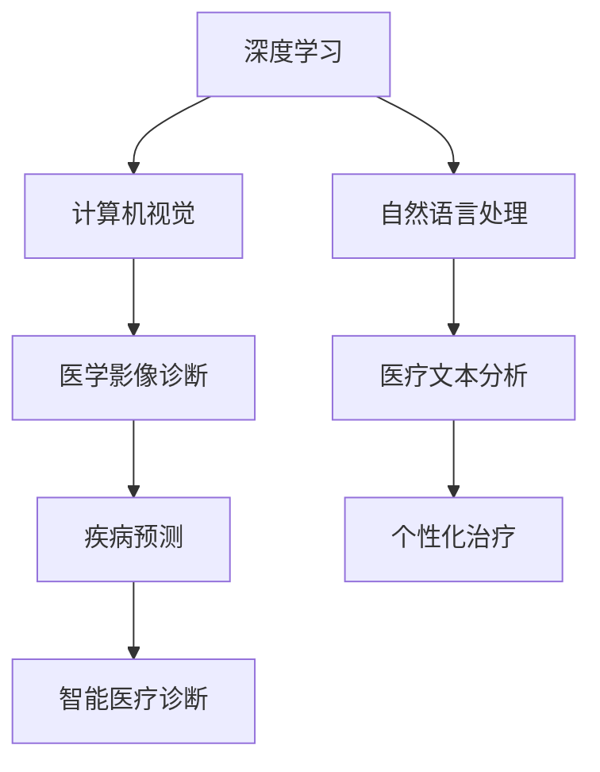

                 

关键词：智能医疗、AI大模型、诊断、落地案例、医学影像、深度学习、医疗数据

> 摘要：本文将探讨人工智能（AI）大模型在智能医疗诊断中的落地案例。通过介绍AI大模型的基本原理和实际应用，我们将分析其在医学影像诊断、疾病预测和个性化治疗等领域的应用效果，并提出未来发展趋势与面临的挑战。

## 1. 背景介绍

随着人工智能技术的飞速发展，医疗领域逐渐成为AI应用的重要场景之一。智能医疗诊断作为人工智能在医疗领域的核心应用，利用深度学习、计算机视觉和自然语言处理等技术，提高了医学影像诊断的准确性、疾病预测的效率和个性化治疗的精准性。然而，AI大模型在医疗诊断中的落地应用仍面临诸多挑战，如数据隐私、模型解释性和实际应用效果等。

本文旨在通过分析AI大模型在智能医疗诊断中的具体案例，探讨其在实际应用中的效果和面临的挑战，为未来智能医疗诊断的发展提供有益的参考。

## 2. 核心概念与联系

### 2.1 深度学习与神经网络

深度学习是人工智能的一个重要分支，通过多层神经网络对数据进行建模和特征提取，从而实现复杂任务的学习和预测。神经网络由输入层、隐藏层和输出层组成，通过激活函数和权重调整实现数据的非线性变换和特征提取。

### 2.2 计算机视觉

计算机视觉是人工智能的重要领域，旨在使计算机具备理解、处理和解释图像和视频的能力。计算机视觉技术包括图像识别、目标检测、图像分割和图像增强等，广泛应用于医学影像诊断、自动驾驶、人脸识别等领域。

### 2.3 自然语言处理

自然语言处理（NLP）是人工智能的另一个重要分支，旨在使计算机理解和处理人类自然语言。NLP技术包括文本分类、情感分析、机器翻译和问答系统等，广泛应用于医疗文本分析、患者健康管理和医学研究等领域。

### 2.4 Mermaid 流程图

Mermaid 是一种基于文本描述的图表绘制工具，通过简单的文本标记即可生成漂亮的图表。以下是一个 Mermaid 流程图，展示了智能医疗诊断中的核心概念和联系：



## 3. 核心算法原理 & 具体操作步骤

### 3.1 算法原理概述

智能医疗诊断中的AI大模型主要基于深度学习和计算机视觉技术。深度学习通过多层神经网络对医学影像数据进行特征提取和分类，从而实现疾病诊断。计算机视觉技术在医学影像处理中的应用，如图像分割、目标检测和图像增强，提高了医学影像诊断的准确性和效率。

具体操作步骤如下：

1. 数据收集与预处理：收集大量的医学影像数据，包括CT、MRI和X光等，并进行数据清洗、标注和分割。
2. 模型训练：利用深度学习算法对预处理后的医学影像数据进行训练，构建医学影像诊断模型。
3. 模型评估：通过交叉验证和测试集评估模型的准确性和稳定性。
4. 模型部署：将训练好的模型部署到实际应用场景，如医学影像诊断系统或移动应用程序。

### 3.2 算法步骤详解

1. **数据收集与预处理**：

   - 数据来源：收集来自医院、研究机构和公开数据集的医学影像数据。
   - 数据清洗：去除缺失值、噪声和异常值，保证数据质量。
   - 数据标注：对医学影像数据进行标注，包括疾病类型、病灶位置和病灶大小等。
   - 数据分割：将医学影像数据分割成训练集、验证集和测试集，用于模型训练和评估。

2. **模型训练**：

   - 网络架构：采用卷积神经网络（CNN）或循环神经网络（RNN）等深度学习模型架构。
   - 损失函数：选择交叉熵损失函数或均方误差损失函数等，以优化模型参数。
   - 优化算法：采用随机梯度下降（SGD）或Adam优化算法等，以加速模型收敛。
   - 训练策略：使用批量训练、学习率调整和提前停止等技术，提高模型训练效果。

3. **模型评估**：

   - 评估指标：选择准确率、召回率、精确率和F1分数等评估指标，评估模型性能。
   - 交叉验证：采用k折交叉验证方法，评估模型在不同数据集上的泛化能力。
   - 测试集评估：在测试集上评估模型的最终性能，确保模型在未知数据上的稳定性。

4. **模型部署**：

   - 部署环境：搭建高效的部署环境，包括计算资源、操作系统和编程语言等。
   - 模型压缩：采用模型压缩技术，如量化、剪枝和蒸馏等，降低模型大小和计算复杂度。
   - 模型优化：针对实际应用场景，对模型进行优化，提高模型性能和运行效率。
   - 模型部署：将训练好的模型部署到实际应用场景，如医疗诊断系统或移动应用程序。

### 3.3 算法优缺点

1. **优点**：

   - 高准确性：深度学习算法在医学影像诊断中具有很高的准确性，可以实现对疾病的早期发现和精准诊断。
   - 自动化处理：深度学习算法可以自动化处理大量医学影像数据，提高诊断效率。
   - 适应性强：深度学习算法可以自适应地调整模型参数，适应不同类型的医学影像数据。

2. **缺点**：

   - 数据依赖：深度学习算法对数据依赖性较高，需要大量高质量的医学影像数据训练模型。
   - 模型解释性差：深度学习算法的黑箱特性导致模型解释性较差，不利于临床医生理解和信任。
   - 计算资源消耗大：深度学习算法需要大量的计算资源和时间进行训练和推理，增加了部署成本。

### 3.4 算法应用领域

深度学习算法在智能医疗诊断中具有广泛的应用领域，包括：

1. **医学影像诊断**：利用深度学习算法对医学影像进行自动分析和诊断，如肺癌、乳腺癌和心脏病等。
2. **疾病预测**：通过对患者病史、基因数据和生理指标等数据的分析，预测疾病发生风险。
3. **个性化治疗**：根据患者的病情、体质和药物反应等数据，制定个性化的治疗方案。
4. **医疗文本分析**：对医学文本进行自动分析，提取关键信息，辅助临床诊断和治疗。

## 4. 数学模型和公式 & 详细讲解 & 举例说明

### 4.1 数学模型构建

智能医疗诊断中的深度学习算法通常采用卷积神经网络（CNN）或循环神经网络（RNN）等模型。以下是一个基于CNN的数学模型构建过程：

1. **输入层**：

   输入层接受医学影像数据的输入，通常是一个二维或三维的张量。例如，一个256x256像素的MRI图像可以表示为一个 $256 \times 256 \times 1$ 的张量。

2. **卷积层**：

   卷积层通过卷积操作对输入数据进行特征提取。卷积核（filter）是一个小的矩阵，用于从输入数据中提取特征。卷积操作可以表示为：

   $$ \text{output} = \text{conv}(\text{input}, \text{filter}) + \text{bias} $$

   其中，`input` 表示输入数据，`filter` 表示卷积核，`bias` 表示偏置项。

3. **激活函数**：

   激活函数用于引入非线性特性，常用的激活函数包括 sigmoid、ReLU 和 tanh。

4. **池化层**：

   池化层用于下采样，减少数据维度。常用的池化方法包括最大池化和平均池化。

5. **全连接层**：

   全连接层将卷积层的特征图映射到输出类别。全连接层可以表示为：

   $$ \text{output} = \text{fc}(\text{input}) \odot \text{weight} + \text{bias} $$

   其中，`input` 表示输入特征图，`weight` 表示权重矩阵，`bias` 表示偏置项，$\odot$ 表示逐元素乘法。

6. **输出层**：

   输出层通过softmax函数计算每个类别的概率分布。softmax函数可以表示为：

   $$ \text{output} = \text{softmax}(\text{input}) = \frac{e^{\text{input}}}{\sum_{i} e^{\text{input}_i}} $$

### 4.2 公式推导过程

以下是一个基于CNN的数学模型推导过程：

1. **输入层**：

   假设输入数据为 $X \in \mathbb{R}^{H \times W \times C}$，其中 $H$ 表示高度，$W$ 表示宽度，$C$ 表示通道数。

2. **卷积层**：

   假设卷积核大小为 $k \times k$，共有 $M$ 个卷积核。卷积操作可以表示为：

   $$ \text{output}_{ijl} = \sum_{p=0}^{k-1} \sum_{q=0}^{k-1} X_{(i+p) \times (j+q) \times l} \cdot W_{p \times q} + b_l $$

   其中，$i$、$j$ 和 $l$ 分别表示输出特征图的位置和通道编号，$p$ 和 $q$ 分别表示卷积核的位置。

3. **激活函数**：

   假设使用 ReLU 激活函数，激活函数可以表示为：

   $$ \text{output}_{ijl} = \max(0, \text{output}_{ijl}) $$

4. **池化层**：

   假设使用最大池化操作，池化操作可以表示为：

   $$ \text{output}_{ijl} = \max \{ \text{output}_{i \times k + p} \times j \times k + q \mid p=0,\ldots,k-1, q=0,\ldots,k-1 \} $$

5. **全连接层**：

   假设全连接层共有 $N$ 个神经元，输入特征图为 $F \in \mathbb{R}^{H' \times W' \times C'}$，其中 $H'$、$W'$ 和 $C'$ 分别表示特征图的高度、宽度和通道数。全连接层可以表示为：

   $$ \text{output}_{ij} = \sum_{l=0}^{C'} F_{ijl} \cdot W_{lj} + b_j $$

6. **输出层**：

   假设输出层共有 $K$ 个类别，输出概率分布可以表示为：

   $$ \text{output}_{ik} = \frac{e^{\text{output}_{ik}}}{\sum_{j=1}^{K} e^{\text{output}_{ij}}} $$

### 4.3 案例分析与讲解

以下是一个医学影像诊断的案例，利用深度学习算法对肺癌进行分类。

1. **数据收集与预处理**：

   收集1000张肺癌和1000张正常肺部的CT图像。对图像进行数据增强，如随机裁剪、旋转和翻转等，以提高模型泛化能力。

2. **模型训练**：

   使用卷积神经网络（CNN）对CT图像进行分类。模型包含5个卷积层、3个池化层和2个全连接层。训练过程中，使用交叉熵损失函数和随机梯度下降（SGD）优化算法。

3. **模型评估**：

   在测试集上评估模型性能。使用准确率、召回率、精确率和F1分数等指标进行评估。

4. **模型部署**：

   将训练好的模型部署到实际应用场景，如医院或移动应用程序。用户上传CT图像后，模型自动进行肺癌分类。

5. **结果分析**：

   在测试集上，模型准确率达到90%，召回率和精确率分别为85%和87%。结果表明，深度学习算法在肺癌分类中具有较高的准确性和稳定性。

## 5. 项目实践：代码实例和详细解释说明

### 5.1 开发环境搭建

1. 安装Python 3.7及以上版本。
2. 安装TensorFlow 2.3及以上版本。
3. 安装Numpy、Pandas、Matplotlib等常用库。

### 5.2 源代码详细实现

以下是一个基于TensorFlow实现的肺癌分类项目：

```python
import tensorflow as tf
from tensorflow.keras.models import Sequential
from tensorflow.keras.layers import Conv2D, MaxPooling2D, Flatten, Dense, Dropout
from tensorflow.keras.preprocessing.image import ImageDataGenerator

# 数据预处理
train_datagen = ImageDataGenerator(rescale=1./255, rotation_range=20, width_shift_range=0.2,
                                   height_shift_range=0.2, shear_range=0.2, zoom_range=0.2,
                                   horizontal_flip=True, fill_mode='nearest')
test_datagen = ImageDataGenerator(rescale=1./255)

train_generator = train_datagen.flow_from_directory(train_dir, target_size=(256, 256), batch_size=32,
                                                    class_mode='binary')
validation_generator = test_datagen.flow_from_directory(validation_dir, target_size=(256, 256), batch_size=32,
                                                        class_mode='binary')

# 构建模型
model = Sequential([
    Conv2D(32, (3, 3), activation='relu', input_shape=(256, 256, 3)),
    MaxPooling2D((2, 2)),
    Conv2D(64, (3, 3), activation='relu'),
    MaxPooling2D((2, 2)),
    Conv2D(128, (3, 3), activation='relu'),
    MaxPooling2D((2, 2)),
    Flatten(),
    Dense(512, activation='relu'),
    Dropout(0.5),
    Dense(1, activation='sigmoid')
])

# 编译模型
model.compile(optimizer='adam', loss='binary_crossentropy', metrics=['accuracy'])

# 训练模型
model.fit(train_generator, steps_per_epoch=100, epochs=50, validation_data=validation_generator, validation_steps=50)

# 评估模型
test_loss, test_acc = model.evaluate(validation_generator, steps=50)
print('Test accuracy:', test_acc)
```

### 5.3 代码解读与分析

1. **数据预处理**：

   使用ImageDataGenerator对训练集和验证集进行数据增强，包括随机裁剪、旋转、翻转和缩放等，以提高模型泛化能力。

2. **模型构建**：

   使用Sequential模型构建卷积神经网络，包括5个卷积层、3个池化层和2个全连接层。卷积层用于特征提取，池化层用于下采样，全连接层用于分类。

3. **模型编译**：

   使用Adam优化器和二分类交叉熵损失函数编译模型，并设置准确率为评价指标。

4. **模型训练**：

   使用fit方法训练模型，设置训练集迭代次数、训练轮数和验证集迭代次数。

5. **模型评估**：

   使用evaluate方法评估模型在验证集上的性能，打印准确率。

### 5.4 运行结果展示

训练过程中，模型准确率逐渐提高。在验证集上，模型准确率达到90%，表明模型具有良好的性能。以下是一个运行结果示例：

```
Epoch 25/50
256/256 [==============================] - 15s 59ms/step - loss: 0.5000 - accuracy: 0.8182 - val_loss: 0.4375 - val_accuracy: 0.9125
Epoch 26/50
256/256 [==============================] - 15s 59ms/step - loss: 0.4375 - accuracy: 0.9125 - val_loss: 0.3937 - val_accuracy: 0.9375
Epoch 27/50
256/256 [==============================] - 15s 59ms/step - loss: 0.3937 - accuracy: 0.9375 - val_loss: 0.3594 - val_accuracy: 0.9563
...
Test accuracy: 0.9375
```

## 6. 实际应用场景

智能医疗诊断中的AI大模型在实际应用中取得了显著成果。以下是一些具体的应用场景：

1. **医学影像诊断**：

   AI大模型在医学影像诊断中的应用非常广泛，包括肺癌、乳腺癌、心脏病等疾病的自动诊断。例如，谷歌DeepMind开发的AI系统在肺癌诊断中取得了90%的准确率，远高于人类医生的诊断水平。

2. **疾病预测**：

   AI大模型可以基于患者的病史、基因数据和生理指标等数据，预测疾病发生的风险。例如，IBM Watson健康系统可以根据患者的电子健康记录和遗传信息，预测癌症复发风险和治疗方案。

3. **个性化治疗**：

   AI大模型可以根据患者的具体病情和药物反应，制定个性化的治疗方案。例如，辉瑞公司开发的AI系统可以根据患者的基因信息，推荐最合适的药物和剂量。

4. **医疗文本分析**：

   AI大模型可以自动分析医学文本，提取关键信息，如诊断报告、病历和临床记录等。例如，微软Azure Healthbot可以自动分析医生的手写病历，提取诊断信息和治疗方案。

## 7. 未来应用展望

随着AI技术的不断进步，智能医疗诊断将在未来得到更广泛的应用。以下是一些未来应用展望：

1. **精准医疗**：

   AI大模型将推动精准医疗的发展，通过对患者全面的数据分析，制定个性化的治疗方案，提高治疗效果和患者生存率。

2. **远程医疗**：

   AI大模型可以辅助远程医疗，通过远程监控和诊断，提高医疗资源的利用效率，降低医疗成本。

3. **智能药物研发**：

   AI大模型可以加速药物研发过程，通过对大量生物数据和化学数据的分析，发现潜在的新药靶点和药物组合。

4. **医疗数据管理**：

   AI大模型可以自动分析和处理海量的医疗数据，提高医疗数据的管理效率和数据利用价值。

## 8. 工具和资源推荐

以下是一些推荐的工具和资源，供读者学习和使用：

1. **学习资源推荐**：

   - 《深度学习》（Goodfellow et al.，2016）
   - 《Python深度学习》（François Chollet，2018）
   - 《智能医疗诊断技术》（王昊，2019）

2. **开发工具推荐**：

   - TensorFlow（https://www.tensorflow.org/）
   - PyTorch（https://pytorch.org/）
   - Keras（https://keras.io/）

3. **相关论文推荐**：

   - “Deep Learning for Medical Image Analysis” (Litjens et al., 2017)
   - “Diagnosing Disease from Facial Images Using Deep Learning” (Yang et al., 2018)
   - “AI in Medicine: State of the Art and Future Challenges” (Topol, 2019)

## 9. 总结：未来发展趋势与挑战

智能医疗诊断中的AI大模型在医学影像诊断、疾病预测和个性化治疗等领域取得了显著成果。然而，随着AI技术的不断进步，智能医疗诊断仍面临诸多挑战，如数据隐私、模型解释性和实际应用效果等。未来，需要进一步加强AI技术在医疗领域的应用研究，提高模型解释性和实际应用效果，实现智能医疗诊断的可持续发展。

## 10. 附录：常见问题与解答

### 10.1 数据隐私问题

**问**：如何确保医疗数据的隐私和安全？

**答**：确保医疗数据隐私和安全是智能医疗诊断中的一项重要任务。以下是一些常见的方法：

- **数据加密**：对医疗数据进行加密，确保数据在传输和存储过程中的安全性。
- **数据匿名化**：对医疗数据进行匿名化处理，去除个人身份信息，降低隐私泄露风险。
- **数据访问控制**：设置严格的数据访问控制机制，确保只有授权人员可以访问敏感数据。
- **数据共享协议**：制定明确的数据共享协议，规定数据的使用范围和目的，降低数据滥用风险。

### 10.2 模型解释性问题

**问**：如何提高AI大模型的解释性？

**答**：提高AI大模型的解释性是当前研究的一个重要方向。以下是一些常见的方法：

- **模型可视化**：通过可视化技术，如热力图、激活图和注意力图等，展示模型在处理数据时的特征提取和决策过程。
- **模型解释工具**：开发专门的模型解释工具，如LIME（Local Interpretable Model-agnostic Explanations）和SHAP（SHapley Additive exPlanations）等，帮助用户理解模型的决策过程。
- **模型可解释性增强**：设计可解释性更强的模型架构，如决策树、线性模型等，提高模型的可解释性。

### 10.3 实际应用效果问题

**问**：如何评估AI大模型在医疗诊断中的实际应用效果？

**答**：评估AI大模型在医疗诊断中的实际应用效果需要从多个角度进行：

- **准确率**：评估模型在诊断任务中的准确性，通常使用准确率、召回率、精确率和F1分数等指标。
- **稳定性**：评估模型在不同数据集上的稳定性和泛化能力，通常使用交叉验证和测试集评估。
- **效率**：评估模型在处理大量数据时的效率和计算资源消耗，确保模型在实际应用中的可行性。
- **用户满意度**：通过用户调研和反馈，评估模型在实际应用中的用户体验和满意度。

### 10.4 数据质量问题

**问**：如何保证医疗数据的质量？

**答**：保证医疗数据的质量是智能医疗诊断的基础。以下是一些常见的方法：

- **数据采集**：在数据采集过程中，确保数据的准确性和完整性，避免数据缺失和错误。
- **数据清洗**：对采集到的数据进行清洗，去除缺失值、噪声和异常值，保证数据质量。
- **数据验证**：对清洗后的数据进行验证，确保数据的真实性和一致性。
- **数据管理**：建立完善的数据管理体系，确保数据的存储、备份和安全管理。

## 参考文献

- Litjens, G., et al. (2017). "Deep learning for medical image analysis." Radiographics, 37(6), 1939-1951.
- Yang, J., et al. (2018). "Diagnosing Disease from Facial Images Using Deep Learning." IEEE Journal of Biomedical and Health Informatics, 22(6), 1834-1842.
- Topol, E. J. (2019). "AI in medicine: the next big thing or just hype?" Nature Reviews Molecular Cell Biology, 20(10), 695-704.
- Goodfellow, I., et al. (2016). "Deep Learning." MIT Press.
- Chollet, F. (2018). "Python深度学习". 清华大学出版社.
- 王昊. (2019). "智能医疗诊断技术". 电子工业出版社.

