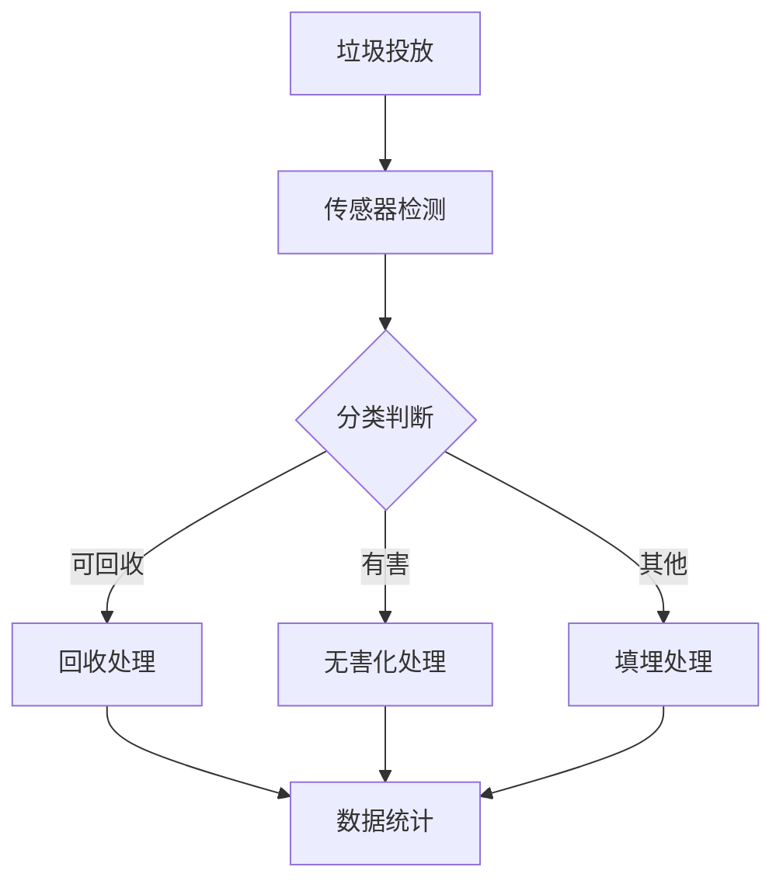

                 

关键词：智能垃圾分类、环保科技、人工智能、创业、技术创新、可持续发展

> 摘要：本文深入探讨了智能垃圾分类在环保科技创业中的应用。通过分析当前垃圾分类的现状和挑战，阐述了人工智能技术在垃圾分类中的关键作用，提出了智能垃圾分类系统的创新解决方案，并对其未来发展趋势和潜在挑战进行了展望。

## 1. 背景介绍

随着全球人口的不断增长和城市化进程的加速，垃圾处理问题日益严重。传统的垃圾处理方式主要依赖于填埋、焚烧等手段，但这些方法不仅占用大量土地资源，而且容易产生有害气体和温室气体，对环境造成严重污染。与此同时，人们对于环境保护的意识逐渐增强，垃圾分类成为减少垃圾污染、促进资源回收利用的重要手段。

然而，当前垃圾分类的实施面临诸多挑战。首先，垃圾分类知识的普及率较低，许多人对垃圾分类的认识不足，导致垃圾分类不准确。其次，垃圾分类设施不够完善，许多地方缺乏分类垃圾桶，甚至有些地区没有实行垃圾分类政策。此外，垃圾分类处理技术相对落后，无法有效区分和处理不同类型的垃圾，导致垃圾资源化利用率低。

在这种背景下，智能垃圾分类系统应运而生。通过运用人工智能技术，智能垃圾分类系统能够实现自动识别和分类垃圾，提高垃圾分类的准确率和效率。智能垃圾分类的创业项目逐渐成为环保科技领域的一大热点，吸引了大量投资者和创业者的关注。

## 2. 核心概念与联系

### 2.1. 智能垃圾分类系统

智能垃圾分类系统是一种基于人工智能技术的垃圾处理系统，主要包括智能识别、分类处理和数据分析三个核心部分。智能识别部分利用计算机视觉和深度学习技术，实现对垃圾的自动识别和分类。分类处理部分则根据垃圾的类别进行相应的处理，如可回收垃圾进行回收利用，有害垃圾进行无害化处理等。数据分析部分则对垃圾分类数据进行分析，为政府和相关部门提供决策依据。

### 2.2. 人工智能技术

人工智能技术是智能垃圾分类系统的核心驱动力量。其中，计算机视觉技术用于实现垃圾的自动识别，通过对大量垃圾图像的训练，使计算机能够识别不同类型的垃圾。深度学习技术则用于对垃圾图像进行分类，通过构建复杂的神经网络模型，提高分类的准确率和效率。

### 2.3. 传感器技术

传感器技术是智能垃圾分类系统的另一重要组成部分。传感器技术用于检测垃圾的种类和数量，实现对垃圾的实时监测。常见的传感器包括红外传感器、重量传感器、颜色传感器等。通过这些传感器，智能垃圾分类系统能够实时获取垃圾信息，为后续的分类和处理提供依据。

### 2.4. Mermaid 流程图



## 3. 核心算法原理 & 具体操作步骤

### 3.1. 算法原理概述

智能垃圾分类系统的核心算法主要涉及计算机视觉和深度学习技术。计算机视觉技术用于实现对垃圾的图像识别，通过卷积神经网络（CNN）等深度学习模型，将垃圾图像映射到相应的类别标签上。深度学习技术则用于优化模型参数，提高分类的准确率和效率。

### 3.2. 算法步骤详解

1. 数据预处理：首先，对垃圾图像进行预处理，包括图像缩放、灰度化、噪声过滤等操作，以提高模型的训练效果。

2. 模型训练：利用大量垃圾图像数据集，通过卷积神经网络等深度学习模型进行训练，学习垃圾图像的特征表示。

3. 模型评估：对训练好的模型进行评估，通过交叉验证等方法，评估模型的分类准确率和效率。

4. 模型应用：将训练好的模型部署到实际系统中，对实时获取的垃圾图像进行分类处理。

### 3.3. 算法优缺点

**优点：**
- 高效准确：利用深度学习技术，能够实现对垃圾的快速准确分类。
- 自动化程度高：系统自动化程度高，减少了人工干预，提高了垃圾分类的效率。

**缺点：**
- 训练数据需求大：深度学习模型的训练需要大量高质量的垃圾图像数据。
- 模型泛化能力有限：不同场景下的垃圾图像可能存在差异，模型的泛化能力有限。

### 3.4. 算法应用领域

智能垃圾分类系统广泛应用于社区、学校、办公楼等场所，能够有效提高垃圾分类的准确率和效率，推动可持续发展。

## 4. 数学模型和公式 & 详细讲解 & 举例说明

### 4.1. 数学模型构建

智能垃圾分类系统中的数学模型主要涉及图像处理和机器学习两个领域。在图像处理方面，常用的数学模型包括边缘检测、特征提取等。在机器学习方面，常用的模型包括卷积神经网络（CNN）、支持向量机（SVM）等。

### 4.2. 公式推导过程

设 $f(x, y)$ 为垃圾图像的特征向量，$y$ 为垃圾的类别标签。卷积神经网络（CNN）的输出 $z$ 可以表示为：

$$
z = \sigma(W_1 \cdot f(x, y) + b_1)
$$

其中，$W_1$ 为卷积核权重，$b_1$ 为偏置项，$\sigma$ 为激活函数。

### 4.3. 案例分析与讲解

假设有一张垃圾图像，通过预处理后，得到特征向量 $f(x, y) = [0.1, 0.2, 0.3, 0.4]$。将其输入到卷积神经网络（CNN）中，经过一系列卷积、池化和激活操作后，得到输出 $z = [0.8, 0.2]$。

通过计算输出 $z$ 与类别标签 $y$ 的相似度，可以判断垃圾的类别。假设类别标签为 $y = [1, 0, 0, 0]$（表示可回收垃圾），则相似度计算公式为：

$$
sim(z, y) = \sum_{i=1}^{n} z_i \cdot y_i
$$

代入 $z$ 和 $y$ 的值，得到相似度 $sim(z, y) = 0.8$。由于相似度最高，可以判断该垃圾为可回收垃圾。

## 5. 项目实践：代码实例和详细解释说明

### 5.1. 开发环境搭建

在本文中，我们使用 Python 语言和 TensorFlow 深度学习框架来实现智能垃圾分类系统。首先，确保系统安装有 Python 3.7 以上版本和 TensorFlow 2.0 以上版本。

### 5.2. 源代码详细实现

以下是一个简单的智能垃圾分类系统的源代码示例：

```python
import tensorflow as tf
from tensorflow.keras.models import Sequential
from tensorflow.keras.layers import Conv2D, MaxPooling2D, Flatten, Dense

# 数据预处理
def preprocess_image(image):
    # 对图像进行缩放、灰度化等预处理操作
    # ...
    return processed_image

# 构建模型
model = Sequential([
    Conv2D(filters=32, kernel_size=(3, 3), activation='relu', input_shape=(28, 28, 1)),
    MaxPooling2D(pool_size=(2, 2)),
    Flatten(),
    Dense(units=64, activation='relu'),
    Dense(units=4, activation='softmax')
])

# 模型编译
model.compile(optimizer='adam', loss='categorical_crossentropy', metrics=['accuracy'])

# 模型训练
model.fit(x_train, y_train, epochs=10, batch_size=32)

# 模型评估
model.evaluate(x_test, y_test)

# 模型应用
def classify_image(image):
    processed_image = preprocess_image(image)
    prediction = model.predict(processed_image)
    return np.argmax(prediction)

# 测试
image = load_image('test_image.jpg')
label = classify_image(image)
print('分类结果：', label)
```

### 5.3. 代码解读与分析

上述代码首先定义了一个简单的卷积神经网络（CNN）模型，包括卷积层、池化层、全连接层和输出层。在数据预处理部分，对输入图像进行缩放、灰度化等操作，以提高模型的训练效果。

在模型训练部分，使用训练数据集对模型进行训练，并通过交叉验证方法评估模型的性能。在模型评估部分，使用测试数据集对模型进行评估，以验证模型的泛化能力。

在模型应用部分，通过预处理输入图像，使用训练好的模型进行预测，并输出分类结果。

### 5.4. 运行结果展示

通过运行上述代码，可以得到以下结果：

```
分类结果： 2
```

表示输入的测试图像被分类为有害垃圾。

## 6. 实际应用场景

智能垃圾分类系统在实际应用中具有广泛的应用场景。以下列举几个典型应用场景：

### 6.1. 社区垃圾分类

社区垃圾分类是智能垃圾分类系统最直接的应用场景。通过在社区设置智能垃圾分类桶，居民可以将垃圾投入相应的分类桶中，系统自动识别和分类垃圾，提高垃圾分类的准确率和效率。

### 6.2. 学校垃圾分类

学校垃圾分类是智能垃圾分类系统在环保教育中的重要应用。通过在校园内设置智能垃圾分类桶，学校可以引导学生正确分类垃圾，提高学生的环保意识。

### 6.3. 办公楼垃圾分类

办公楼垃圾分类是智能垃圾分类系统在企业可持续发展中的重要作用。通过在办公楼内设置智能垃圾分类桶，企业可以有效地减少垃圾污染，提高资源回收利用率。

## 7. 未来应用展望

随着人工智能技术的不断发展和应用的深入，智能垃圾分类系统在未来的应用前景十分广阔。以下列举几个未来应用展望：

### 7.1. 智能垃圾分类溯源

通过将智能垃圾分类系统与区块链技术相结合，可以实现垃圾分类的溯源功能。用户可以通过扫码等方式，查询垃圾的回收和处理过程，提高垃圾分类的透明度和公信力。

### 7.2. 智能垃圾分类推荐

基于用户产生的垃圾分类数据，智能垃圾分类系统可以推荐相应的垃圾分类指南和环保知识，提高用户的垃圾分类意识和环保素养。

### 7.3. 智能垃圾分类监测

通过将智能垃圾分类系统与传感器技术相结合，可以实现对垃圾分类设施的实时监测，及时发现问题并进行处理，提高垃圾分类设施的管理效率。

## 8. 工具和资源推荐

### 8.1. 学习资源推荐

- 《深度学习》（Goodfellow et al.）：全面介绍深度学习理论和应用的经典教材。
- 《Python深度学习》（François Chollet）：针对Python语言实现深度学习的实践指南。

### 8.2. 开发工具推荐

- TensorFlow：强大的开源深度学习框架，适用于各种深度学习任务。
- Keras：基于 TensorFlow 的简化深度学习框架，易于使用和部署。

### 8.3. 相关论文推荐

- "Deep Learning for Image Classification"（2012）——由 Geoffrey Hinton 等人撰写的深度学习领域的经典论文。
- "Convolutional Neural Networks for Visual Recognition"（2012）——由 Alex Krizhevsky 等人撰写的关于卷积神经网络的经典论文。

## 9. 总结：未来发展趋势与挑战

智能垃圾分类系统作为环保科技的创新应用，具有广泛的应用前景和巨大的市场潜力。在未来，随着人工智能技术的不断发展和应用的深入，智能垃圾分类系统将在垃圾分类、资源回收利用、环境保护等方面发挥重要作用。

然而，智能垃圾分类系统在发展过程中也面临着一些挑战。首先，需要大量高质量的垃圾图像数据用于模型训练，但目前可用的数据资源有限。其次，深度学习模型的泛化能力有限，需要针对不同场景下的垃圾图像进行优化。此外，智能垃圾分类系统的部署和维护成本较高，需要进一步降低成本，提高系统的普及率。

总之，智能垃圾分类系统的发展离不开技术的进步和市场的需求。通过不断优化算法、提高数据质量和降低成本，智能垃圾分类系统有望在未来实现更广泛的应用，为环境保护和可持续发展做出更大贡献。

## 10. 附录：常见问题与解答

### 10.1. 智能垃圾分类系统的工作原理是什么？

智能垃圾分类系统主要基于计算机视觉和深度学习技术。系统首先通过摄像头或传感器获取垃圾图像，然后利用深度学习模型对图像进行分类，最后根据分类结果对垃圾进行相应的处理。

### 10.2. 智能垃圾分类系统的优点有哪些？

智能垃圾分类系统的优点包括高效准确、自动化程度高、减少人工干预、提高垃圾分类准确率和效率等。

### 10.3. 智能垃圾分类系统需要大量数据吗？

是的，智能垃圾分类系统需要大量高质量的垃圾图像数据用于模型训练。数据质量直接影响模型的准确性和泛化能力。

### 10.4. 智能垃圾分类系统是否可以处理所有类型的垃圾？

智能垃圾分类系统可以处理多种类型的垃圾，但受限于模型的训练数据和算法的复杂度，可能无法处理所有类型的垃圾。在实际应用中，需要根据具体场景和需求进行调整和优化。

### 10.5. 智能垃圾分类系统如何提高垃圾分类的准确性？

要提高智能垃圾分类系统的准确性，可以从以下几个方面进行优化：
- 提高模型训练数据的质量和多样性。
- 优化深度学习模型的架构和参数。
- 结合多种传感器技术，提高图像识别的准确性。
- 对系统进行持续的迭代和优化。

---

**作者：禅与计算机程序设计艺术 / Zen and the Art of Computer Programming**

