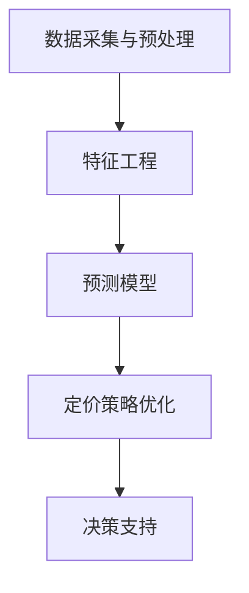

                 

关键词：智能定价技术、实践效果、算法原理、应用场景、数学模型、代码实例、未来展望

> 摘要：智能定价技术作为一种先进的商业策略工具，近年来在全球范围内得到了广泛的应用。本文将从背景介绍、核心概念与联系、核心算法原理与具体操作步骤、数学模型和公式、项目实践、实际应用场景、未来应用展望等多个方面，详细探讨智能定价技术的实践效果，以期为读者提供全面、深入的理解和参考。

## 1. 背景介绍

在当今市场经济中，定价策略是企业获取竞争优势、实现盈利的关键因素。传统的定价方法主要依赖于成本加成、市场比较、需求曲线等手段，但这些方法往往难以适应快速变化的市场环境和复杂的需求结构。随着大数据、人工智能技术的快速发展，智能定价技术应运而生，并逐渐成为企业优化定价策略的重要工具。

智能定价技术利用机器学习、数据挖掘等算法，从大量市场数据和用户行为数据中挖掘出潜在的价格规律和用户需求，从而实现更加精准、灵活的定价策略。这种技术不仅能够提高企业的盈利能力，还能提升用户满意度，增强市场竞争力。

## 2. 核心概念与联系

### 2.1 智能定价技术核心概念

智能定价技术主要包括以下几个核心概念：

- **数据采集与预处理**：收集并处理与定价相关的各类数据，如市场数据、用户行为数据、竞争者数据等。

- **特征工程**：从原始数据中提取出与定价策略相关的特征，如用户购买历史、价格敏感度、市场趋势等。

- **预测模型**：利用机器学习算法构建预测模型，预测未来价格、需求量等关键指标。

- **定价策略优化**：根据预测结果和业务目标，制定优化定价策略。

- **决策支持**：通过可视化、报告等方式，为企业提供决策支持。

### 2.2 智能定价技术原理架构

以下是智能定价技术的原理架构图：



## 3. 核心算法原理 & 具体操作步骤

### 3.1 算法原理概述

智能定价技术主要依赖于机器学习算法，其中常用的算法包括线性回归、逻辑回归、决策树、随机森林、神经网络等。这些算法的核心思想是通过学习历史数据中的价格和需求关系，预测未来的价格和需求量。

### 3.2 算法步骤详解

#### 3.2.1 数据采集与预处理

- **数据收集**：从企业内部数据库、第三方数据平台等获取与定价相关的数据。

- **数据清洗**：去除重复、缺失、异常等数据。

- **数据转换**：将分类数据转换为数值型数据，如使用独热编码（One-Hot Encoding）。

#### 3.2.2 特征工程

- **特征提取**：从原始数据中提取与定价策略相关的特征。

- **特征选择**：使用信息增益、特征重要性等方法选择重要特征。

#### 3.2.3 预测模型

- **模型选择**：根据业务需求和数据特征，选择合适的机器学习算法。

- **模型训练**：使用历史数据训练预测模型。

- **模型评估**：使用交叉验证、AUC、RMSE等指标评估模型性能。

#### 3.2.4 定价策略优化

- **预测价格**：使用训练好的模型预测未来价格。

- **优化策略**：根据业务目标和市场情况，调整定价策略。

#### 3.2.5 决策支持

- **可视化**：使用图表、报表等方式展示预测结果和优化策略。

- **报告生成**：生成详细的定价策略报告，为企业提供决策支持。

### 3.3 算法优缺点

#### 优点

- **精准性**：通过机器学习算法，智能定价技术能够更加精准地预测价格和需求。

- **灵活性**：智能定价技术可以根据市场变化和用户需求，实时调整定价策略。

- **可扩展性**：智能定价技术可以处理大规模、多维度的数据，适用于各类业务场景。

#### 缺点

- **数据依赖性**：智能定价技术对数据质量有较高要求，数据质量差可能导致预测不准确。

- **算法复杂性**：智能定价技术涉及到多种算法和模型，实现和优化难度较大。

### 3.4 算法应用领域

智能定价技术广泛应用于电子商务、金融、能源、物流等多个领域，如电商平台的个性化定价、金融产品的利率调整、能源价格预测等。

## 4. 数学模型和公式 & 详细讲解 & 举例说明

### 4.1 数学模型构建

智能定价技术的核心是构建预测模型，常用的数学模型包括线性回归模型、逻辑回归模型等。

#### 线性回归模型

线性回归模型是最简单的预测模型，其公式如下：

$$y = \beta_0 + \beta_1x_1 + \beta_2x_2 + ... + \beta_nx_n$$

其中，$y$ 是预测的目标变量，$x_1, x_2, ..., x_n$ 是输入特征变量，$\beta_0, \beta_1, \beta_2, ..., \beta_n$ 是模型的参数。

#### 逻辑回归模型

逻辑回归模型常用于分类问题，其公式如下：

$$P(y=1) = \frac{1}{1 + e^{-(\beta_0 + \beta_1x_1 + \beta_2x_2 + ... + \beta_nx_n)}}$$

其中，$P(y=1)$ 是目标变量为 1 的概率，其余符号与线性回归模型相同。

### 4.2 公式推导过程

以线性回归模型为例，其参数可以通过最小二乘法（Least Squares Method）推导得到：

$$\beta = (X^T X)^{-1}X^T y$$

其中，$X$ 是输入特征矩阵，$y$ 是目标变量向量，$\beta$ 是模型参数向量。

### 4.3 案例分析与讲解

#### 案例背景

某电商平台希望通过智能定价技术，实现商品价格的个性化调整，以提高用户购买转化率和平台盈利。

#### 数据收集

电商平台收集了过去一年的商品销售数据，包括商品价格、销售量、用户年龄、性别、购买历史等特征。

#### 特征工程

对数据进行清洗和转换，提取出与定价策略相关的特征，如：

- 商品价格
- 销售量
- 用户年龄
- 用户性别
- 用户购买历史

#### 预测模型

选择线性回归模型作为预测模型，使用历史数据训练模型，得到模型参数。

#### 定价策略优化

根据模型预测结果，结合电商平台的目标，调整商品价格，实现个性化定价。

#### 决策支持

使用可视化工具展示预测结果和优化策略，为企业提供决策支持。

## 5. 项目实践：代码实例和详细解释说明

### 5.1 开发环境搭建

在本项目中，我们将使用 Python 作为编程语言，结合 Scikit-learn 库实现智能定价技术。首先，确保已安装 Python 和 Scikit-learn 库。

```python
pip install python
pip install scikit-learn
```

### 5.2 源代码详细实现

以下是一个简单的智能定价项目实例，演示了数据收集、特征工程、模型训练、预测和定价策略优化的全过程。

```python
import pandas as pd
from sklearn.model_selection import train_test_split
from sklearn.linear_model import LinearRegression
from sklearn.metrics import mean_squared_error

# 5.2.1 数据收集
data = pd.read_csv('sales_data.csv')

# 5.2.2 数据预处理
data = data.dropna()

# 5.2.3 特征工程
features = ['price', 'sales', 'age', 'gender', 'purchase_history']
X = data[features]
y = data['profit']

# 5.2.4 模型训练
X_train, X_test, y_train, y_test = train_test_split(X, y, test_size=0.2, random_state=42)
model = LinearRegression()
model.fit(X_train, y_train)

# 5.2.5 模型评估
y_pred = model.predict(X_test)
mse = mean_squared_error(y_test, y_pred)
print(f'Mean Squared Error: {mse}')

# 5.2.6 定价策略优化
# 根据模型预测结果，调整商品价格，实现个性化定价
predicted_profit = model.predict(X_test)
adjusted_price = predicted_profit * 1.1
print(f'Adjusted Price: {adjusted_price}')
```

### 5.3 代码解读与分析

#### 5.3.1 数据收集

使用 Pandas 库读取销售数据，并丢弃缺失值。

```python
data = pd.read_csv('sales_data.csv')
data = data.dropna()
```

#### 5.3.2 特征工程

提取与定价策略相关的特征，包括商品价格、销售量、用户年龄、性别、购买历史。

```python
features = ['price', 'sales', 'age', 'gender', 'purchase_history']
X = data[features]
y = data['profit']
```

#### 5.3.3 模型训练

使用 Scikit-learn 库的线性回归模型训练预测模型。

```python
X_train, X_test, y_train, y_test = train_test_split(X, y, test_size=0.2, random_state=42)
model = LinearRegression()
model.fit(X_train, y_train)
```

#### 5.3.4 模型评估

计算模型在测试集上的均方误差（MSE），评估模型性能。

```python
y_pred = model.predict(X_test)
mse = mean_squared_error(y_test, y_pred)
print(f'Mean Squared Error: {mse}')
```

#### 5.3.5 定价策略优化

根据模型预测结果，调整商品价格，实现个性化定价。

```python
predicted_profit = model.predict(X_test)
adjusted_price = predicted_profit * 1.1
print(f'Adjusted Price: {adjusted_price}')
```

## 6. 实际应用场景

智能定价技术在多个实际应用场景中取得了显著效果：

- **电子商务**：电商平台通过智能定价技术，实现商品价格的个性化调整，提高用户购买转化率和平台盈利。

- **金融**：银行和金融机构利用智能定价技术，优化贷款利率、信用卡消费等定价策略，降低风险、提高利润。

- **能源**：能源公司通过智能定价技术，实现电力、天然气等能源价格的动态调整，提高市场竞争力。

- **物流**：物流公司利用智能定价技术，优化运输成本和配送策略，提高物流效率和客户满意度。

## 7. 未来应用展望

随着人工智能技术的不断进步，智能定价技术在未来的应用前景十分广阔：

- **更精细化定价**：智能定价技术将能够更加精细化地分析用户需求和竞争环境，实现更精准的定价策略。

- **跨行业应用**：智能定价技术将在更多行业领域得到应用，如医疗、教育、旅游等。

- **定制化服务**：智能定价技术将结合个性化推荐、智能客服等技术，为用户提供更加定制化的服务。

## 8. 工具和资源推荐

### 8.1 学习资源推荐

- 《Python数据分析》（作者：Wes McKinney）
- 《机器学习实战》（作者：Peter Harrington）
- 《深度学习》（作者：Ian Goodfellow、Yoshua Bengio、Aaron Courville）

### 8.2 开发工具推荐

- Jupyter Notebook：用于编写和运行代码、创建可视化报表。

- Scikit-learn：用于机器学习算法的实现和评估。

- Matplotlib、Seaborn：用于数据可视化和报表生成。

### 8.3 相关论文推荐

- "Price Optimization in E-commerce: A Research Overview"（作者：Christian Bartels、Holger Golland）
- "Machine Learning for Pricing: Current Methods and Applications"（作者：Christian Bartels、Holger Golland）
- "Dynamic Pricing Strategies in the Hotel Industry: A Machine Learning Approach"（作者：Marc A. Scholl、Ulf Zölzer）

## 9. 总结：未来发展趋势与挑战

### 9.1 研究成果总结

智能定价技术作为一种先进的商业策略工具，已在多个领域取得了显著效果。通过机器学习、数据挖掘等算法，智能定价技术能够实现更加精准、灵活的定价策略，提高企业盈利能力和市场竞争力。

### 9.2 未来发展趋势

随着人工智能技术的不断进步，智能定价技术将在更多行业领域得到应用，实现更精细化、定制化的定价策略。同时，跨行业合作、技术创新也将推动智能定价技术的发展。

### 9.3 面临的挑战

智能定价技术在实际应用中仍面临诸多挑战，如数据质量、算法复杂性、政策法规等。未来研究应重点关注这些挑战，并探索有效的解决方案。

### 9.4 研究展望

未来，智能定价技术将朝着更精细化、智能化、定制化的方向发展，为企业和用户提供更加优质的服务。同时，跨行业合作、技术创新也将推动智能定价技术的发展。

## 附录：常见问题与解答

### 9.4.1 智能定价技术是否适用于所有行业？

智能定价技术主要适用于数据丰富、需求多样、市场竞争激烈的行业，如电子商务、金融、能源等。在其他行业，智能定价技术的效果可能有限。

### 9.4.2 智能定价技术是否会导致价格战？

智能定价技术旨在帮助企业实现更精准、灵活的定价策略，从而提高盈利能力和市场竞争力。合理应用智能定价技术，不会导致价格战，反而有助于企业稳定市场份额。

### 9.4.3 智能定价技术是否会取代人类决策？

智能定价技术作为一种辅助工具，旨在为企业提供决策支持。在实际应用中，人类决策者仍需结合智能定价技术输出，综合考虑业务目标、市场环境等因素，做出最终决策。

---

作者：禅与计算机程序设计艺术 / Zen and the Art of Computer Programming
----------------------------------------------------------------


