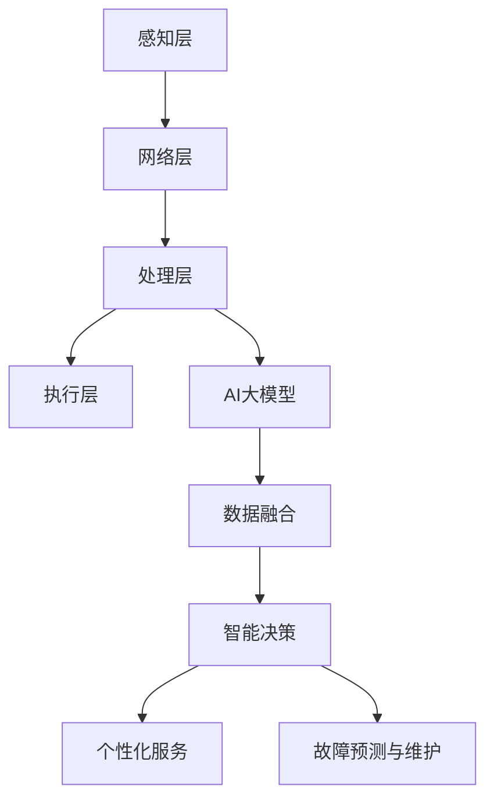

                 

在当今的智能科技浪潮中，智能家居已经成为了一个日益重要的领域。随着人工智能（AI）技术的飞速发展，尤其是大模型的兴起，智能家居的应用趋势正在发生深刻变化。本文将深入探讨AI大模型在智能家居中的应用趋势，分析其核心原理、应用场景和未来展望。

> **关键词**：智能家居，人工智能，大模型，应用趋势，算法原理

> **摘要**：本文首先介绍了智能家居的发展背景和AI大模型的基本概念，然后详细阐述了AI大模型在智能家居中的应用原理，包括核心算法、数学模型和具体实现。接着，文章通过实际项目实例展示了AI大模型在智能家居中的实践应用，并分析了未来的发展趋势和面临的挑战。最后，文章推荐了相关的学习资源和开发工具，为读者提供了进一步探索的方向。

## 1. 背景介绍

### 智能家居的发展

智能家居（Smart Home）是指利用物联网（IoT）技术，将家庭中的各种设备连接起来，实现智能控制和管理的系统。智能家居的兴起可以追溯到20世纪80年代，当时信息技术和通信技术的飞速发展为智能家居的发展奠定了基础。从最初的简单无线传感器网络到现在的智能家居生态系统，智能家居已经逐渐成为现代家庭生活的标配。

智能家居的应用涵盖了家庭安全的监控、家电设备的自动控制、能源管理、环境监测等多个方面。随着物联网设备的普及，智能家居市场的规模不断扩大，预计到2025年，全球智能家居市场的规模将达到数百亿美元。

### 人工智能的崛起

人工智能（AI）作为计算机科学的一个分支，旨在使机器能够执行通常需要人类智能的任务。自20世纪50年代起，人工智能经历了多个发展阶段，从最初的逻辑推理到现代的深度学习和神经网络，人工智能的技术不断进步。

近年来，随着大数据、云计算和计算能力的提升，人工智能迎来了新一轮的发展高潮。大模型（Large Models）作为人工智能领域的一个重要分支，通过在海量数据上进行训练，能够实现前所未有的性能。大模型的应用范围已经从传统的自然语言处理、计算机视觉扩展到智能推荐、自动驾驶、智能家居等多个领域。

### 大模型的定义与特点

大模型是指具有非常大规模参数和计算需求的机器学习模型。这些模型通常由数亿甚至数十亿个参数组成，需要大量的数据进行训练，同时也需要强大的计算资源来支持。大模型的出现标志着人工智能进入了一个新的阶段，它们在处理复杂任务时展现出了惊人的能力。

大模型的特点主要包括：

1. **参数规模大**：大模型具有数亿到数十亿个参数，这使得它们能够捕捉到更复杂的模式和关联。
2. **计算需求高**：大模型的训练通常需要大量的计算资源，包括GPU和TPU等硬件加速器。
3. **数据处理能力强**：大模型能够处理大量的数据，并从中提取出有价值的信息。
4. **自适应性好**：大模型可以根据不同的任务和场景进行调整，展现出良好的泛化能力。

### 大模型在智能家居中的应用潜力

大模型在智能家居中的应用潜力巨大。首先，大模型能够处理复杂的家庭环境数据，实现对家庭设备的智能控制。例如，通过分析传感器数据，大模型可以自动调节家庭温度、湿度等环境参数，提高居住舒适度。

其次，大模型在智能设备协同方面具有重要作用。智能家居系统通常包含多个设备，如智能灯泡、智能空调、智能门锁等。大模型可以通过学习这些设备的行为模式，实现设备间的协同控制，提高智能家居系统的整体效率。

此外，大模型在智能家居中的个性化服务方面也具有广泛应用。例如，通过分析家庭成员的日常行为和偏好，大模型可以提供个性化的家电控制方案，如根据家庭成员的作息时间自动调整家电开关，提供更加舒适的生活体验。

总之，随着人工智能和大数据技术的不断发展，大模型在智能家居中的应用前景十分广阔。接下来，本文将详细探讨大模型在智能家居中的具体应用原理和实现方法。

### 1.1 智能家居的市场需求与挑战

智能家居市场的快速增长带来了巨大的需求。现代家庭对智能化、便捷化和个性化的生活体验有着越来越高的期待。消费者希望智能家居系统能够自动处理日常生活中的繁琐事务，从而节省时间和精力。例如，自动调节室内温度和光线、远程控制家电设备、实时监控家庭安全等。

然而，随着智能家居系统的普及，也出现了一系列挑战：

1. **数据隐私和安全**：智能家居设备收集了大量用户行为数据，如何保护这些数据的安全和隐私成为了一个重要问题。一旦数据泄露，可能会对用户的生活和个人信息造成严重威胁。
2. **设备的互操作性**：智能家居系统通常包含多个不同品牌和型号的设备，如何实现这些设备的互操作性和兼容性是另一个挑战。设备之间的通信协议、数据格式和接口标准需要统一，以确保系统能够无缝运行。
3. **系统的稳定性和可靠性**：智能家居系统需要24小时不间断运行，一旦出现故障或中断，可能会影响用户的日常生活。因此，系统的稳定性和可靠性是智能家居发展的重要保障。
4. **能耗和资源管理**：智能家居设备在运行过程中会消耗电力和计算资源，如何优化系统的能耗和资源管理，提高设备的能源利用效率，也是需要考虑的问题。

### 1.2 大模型在智能家居中的优势

大模型在应对智能家居中的这些挑战方面具有显著的优势：

1. **数据隐私和安全**：大模型可以通过加密算法和隐私保护技术，确保用户数据的隐私和安全。例如，差分隐私（Differential Privacy）技术可以在数据分析和模型训练过程中，对用户数据进行扰动，以防止敏感信息泄露。
2. **设备的互操作性**：大模型可以作为一个统一的智能中枢，协调不同设备的通信和协作。通过学习设备的交互模式和用户行为，大模型可以自动适配和调整设备间的交互方式，提高系统的互操作性和兼容性。
3. **系统的稳定性和可靠性**：大模型可以通过持续学习和自我调整，提高系统的稳定性和可靠性。例如，大模型可以实时监控设备的运行状态，发现故障隐患并及时采取应对措施，确保系统的稳定运行。
4. **能耗和资源管理**：大模型可以优化智能家居系统的能耗和资源管理。通过学习用户的日常行为模式，大模型可以智能调整设备的运行策略，降低能耗。例如，在用户不在家时，自动关闭不必要的设备，减少能源浪费。

总之，大模型在智能家居中的应用不仅能够提升系统的智能化水平，还能够有效解决当前市场面临的一些关键挑战。随着技术的不断进步，大模型在智能家居中的应用前景将更加广阔。

## 2. 核心概念与联系

### 2.1 智能家居系统架构

要理解AI大模型在智能家居中的应用，首先需要了解智能家居系统的基本架构。一个典型的智能家居系统通常包括以下几个关键组成部分：

1. **感知层**：包括各种传感器，如温度传感器、湿度传感器、光照传感器、烟雾传感器等，用于实时收集家庭环境数据。
2. **网络层**：包括局域网（LAN）或无线网络（如Wi-Fi、蓝牙等），用于传感器与智能家居中心设备之间的数据传输。
3. **处理层**：即智能家居中心，通常包括一个或多个中央处理单元（CPU）或专用处理芯片，用于接收、处理和分析传感器数据。
4. **执行层**：包括各种执行设备，如智能灯泡、智能插座、智能空调、智能门锁等，根据处理层生成的控制指令进行相应操作。

### 2.2 AI大模型的基本原理

AI大模型是基于深度学习技术构建的复杂神经网络模型，具有非常高的参数数量和计算需求。大模型通过在海量数据上进行训练，能够自动学习数据中的模式和关联，从而实现对复杂任务的智能处理。

大模型的基本原理包括：

1. **神经网络结构**：大模型通常采用多层神经网络结构，包括输入层、隐藏层和输出层。每一层中的神经元通过前一层神经元的输出进行计算，并传递到下一层。
2. **反向传播算法**：大模型通过反向传播算法进行参数优化，根据输出误差反向传播调整权重，从而提高模型的预测准确性。
3. **大规模数据处理**：大模型能够处理大规模的数据集，通过并行计算和分布式计算技术，加速模型的训练过程。

### 2.3 智能家居与AI大模型的联系

智能家居系统与AI大模型之间的联系主要体现在以下几个方面：

1. **数据融合**：智能家居系统通过传感器收集大量家庭环境数据，如温度、湿度、光照、噪音等。AI大模型通过学习这些数据，能够更好地理解家庭环境的变化和用户的行为模式。
2. **智能决策**：AI大模型可以根据家庭环境数据和用户行为数据，进行智能决策，自动调整家庭设备的运行状态，如调节温度、光线、空调等，以提高居住舒适度和能源效率。
3. **个性化服务**：AI大模型通过分析用户的日常行为和偏好数据，能够提供个性化的家电控制方案，如根据用户的作息时间自动调整设备状态，提供更加舒适的生活体验。
4. **故障预测与维护**：AI大模型可以通过对设备运行数据的分析，预测设备的故障风险，并提供维护建议，确保智能家居系统的稳定运行。

### 2.4 Mermaid 流程图

为了更直观地展示智能家居系统与AI大模型之间的联系，下面使用Mermaid语言绘制一个简单的流程图：



在上面的流程图中，感知层通过传感器收集家庭环境数据，网络层将数据传输到处理层。处理层包括智能家居中心，它不仅负责数据处理和分析，还与AI大模型进行交互。AI大模型通过数据融合、智能决策、个性化服务和故障预测与维护等模块，实现对智能家居系统的全面优化和管理。

通过这一简单的流程图，我们可以更清晰地理解智能家居系统与AI大模型之间的联系和相互作用，为后续内容的展开提供了基础。

## 3. 核心算法原理 & 具体操作步骤

### 3.1 算法原理概述

在智能家居中，AI大模型的核心算法通常是基于深度学习技术，尤其是卷积神经网络（CNN）和循环神经网络（RNN）的变种。以下将简要介绍这些算法的基本原理。

#### 3.1.1 卷积神经网络（CNN）

卷积神经网络是一种适用于图像处理的深度学习模型，其核心思想是通过卷积操作提取图像特征。CNN由多个卷积层、池化层和全连接层组成。卷积层通过滤波器在输入图像上滑动，提取局部特征；池化层用于减小特征图的尺寸，降低计算复杂度；全连接层则将特征映射到输出结果。

CNN的优势在于其强大的特征提取能力，能够自动学习图像中的结构和模式，因此在智能家居的图像识别和监控方面有广泛应用。

#### 3.1.2 循环神经网络（RNN）

循环神经网络是一种适用于序列数据的深度学习模型，其特点是能够记住前面的输入信息。RNN通过一个循环结构，将当前输入与之前的状态进行整合，生成当前输出。RNN的变种包括长短期记忆网络（LSTM）和门控循环单元（GRU），它们通过门控机制解决传统RNN的梯度消失和梯度爆炸问题。

RNN在智能家居中的应用主要包括用户行为序列预测、设备状态序列分析等，能够实现对家庭环境变化的智能响应。

#### 3.1.3 其他深度学习算法

除了CNN和RNN，其他深度学习算法如生成对抗网络（GAN）、自编码器（Autoencoder）等也在智能家居中有应用。GAN通过生成器和判别器的对抗训练，能够生成高质量的数据；自编码器则用于数据降维和特征提取，帮助模型更好地理解和处理数据。

### 3.2 算法步骤详解

以下是AI大模型在智能家居中的具体算法步骤：

#### 3.2.1 数据收集与预处理

1. **数据收集**：通过智能家居传感器收集家庭环境数据，包括温度、湿度、光照、噪音等。
2. **数据预处理**：对收集到的数据进行清洗、去噪和归一化处理，确保数据的质量和一致性。

#### 3.2.2 特征提取

1. **图像特征提取**：使用CNN提取图像特征，将图像分解为多层特征图，每层特征图代表不同的图像信息。
2. **序列特征提取**：使用RNN对用户行为序列数据进行建模，提取时间序列特征。

#### 3.2.3 模型训练

1. **模型构建**：根据任务需求构建相应的深度学习模型，如CNN或RNN。
2. **模型训练**：使用预处理后的数据对模型进行训练，通过反向传播算法优化模型参数。

#### 3.2.4 模型评估

1. **模型评估**：使用验证集对训练好的模型进行评估，计算模型的准确率、召回率等指标。
2. **模型调优**：根据评估结果调整模型参数，优化模型性能。

#### 3.2.5 模型部署

1. **模型部署**：将训练好的模型部署到智能家居系统中，实现实时数据分析和决策。
2. **实时更新**：定期更新模型，以适应家庭环境的变化和用户行为的变化。

### 3.3 算法优缺点

#### 优点：

1. **高效的特征提取能力**：深度学习模型能够自动提取复杂特征，提高任务性能。
2. **良好的泛化能力**：通过大规模数据训练，模型具有良好的泛化能力，能够适应不同的家庭环境。
3. **智能化的决策能力**：AI大模型能够根据实时数据做出智能决策，提高智能家居系统的用户体验。

#### 缺点：

1. **计算资源需求高**：深度学习模型需要大量的计算资源进行训练和推理，对硬件要求较高。
2. **数据隐私和安全问题**：智能家居系统涉及大量用户行为数据，数据隐私和安全问题需要特别关注。
3. **模型解释性不足**：深度学习模型的内部机制复杂，难以解释，不利于理解和调试。

### 3.4 算法应用领域

AI大模型在智能家居中的应用领域广泛，主要包括：

1. **智能监控与安全**：通过图像识别和运动检测技术，实现家庭安全的实时监控。
2. **环境控制**：通过学习用户行为和环境数据，实现家庭环境参数的自动调节，如温度、湿度、光照等。
3. **设备协同控制**：通过分析设备交互数据，实现家庭设备的智能协同控制，提高系统效率。
4. **个性化服务**：通过分析用户行为和偏好数据，提供个性化的家电控制方案，提升用户体验。
5. **故障预测与维护**：通过实时监控设备状态数据，预测设备故障并提前进行维护，确保系统稳定运行。

总之，AI大模型在智能家居中的应用为提升系统的智能化水平和用户体验提供了强大支持，未来将随着技术的进步继续拓展其应用领域。

## 4. 数学模型和公式 & 详细讲解 & 举例说明

### 4.1 数学模型构建

在智能家居系统中，AI大模型的应用离不开数学模型的构建。以下将介绍几种常见的数学模型及其构建方法。

#### 4.1.1 卷积神经网络（CNN）模型

卷积神经网络（CNN）是一种广泛应用于图像处理的深度学习模型。其基本结构包括输入层、卷积层、池化层和全连接层。以下是CNN模型的构建步骤：

1. **输入层**：输入层接收图像数据，图像通常被划分为若干个像素点。
   \[
   \text{输入层：} X = \{x_1, x_2, ..., x_n\}
   \]
2. **卷积层**：卷积层通过卷积运算提取图像特征，每个卷积核能够提取图像中的不同特征。
   \[
   \text{卷积层：} f(x_i, k) = \sum_j w_{ij} x_j + b
   \]
   其中，\( f \) 为卷积运算结果，\( x_i \) 为输入像素点，\( k \) 为卷积核，\( w_{ij} \) 为卷积核权重，\( b \) 为偏置项。
3. **池化层**：池化层用于减小特征图的尺寸，提高模型计算效率。
   \[
   \text{池化层：} p(x_i) = \max_j x_{ij}
   \]
   其中，\( p \) 为池化运算结果，\( x_{ij} \) 为卷积层输出的特征点。
4. **全连接层**：全连接层将卷积层输出的特征映射到输出结果。
   \[
   \text{全连接层：} y = \sum_i w_i h_i + b
   \]
   其中，\( y \) 为输出结果，\( h_i \) 为全连接层输入，\( w_i \) 为权重，\( b \) 为偏置项。

#### 4.1.2 循环神经网络（RNN）模型

循环神经网络（RNN）是一种用于处理序列数据的深度学习模型。其基本结构包括输入层、隐藏层和输出层。以下是RNN模型的构建步骤：

1. **输入层**：输入层接收序列数据，每个序列元素表示为向量。
   \[
   \text{输入层：} X = \{x_1, x_2, ..., x_n\}
   \]
2. **隐藏层**：隐藏层通过递归关系更新状态，实现对序列数据的记忆。
   \[
   \text{隐藏层：} h_t = \sigma(Wx_t + Uh_{t-1} + b)
   \]
   其中，\( h_t \) 为当前隐藏状态，\( x_t \) 为当前输入，\( W \) 为输入权重，\( U \) 为隐藏状态权重，\( b \) 为偏置项，\( \sigma \) 为激活函数。
3. **输出层**：输出层根据隐藏状态生成输出结果。
   \[
   \text{输出层：} y_t = \sigma(Vh_t + c)
   \]
   其中，\( y_t \) 为当前输出，\( V \) 为输出权重，\( c \) 为偏置项，\( \sigma \) 为激活函数。

### 4.2 公式推导过程

#### 4.2.1 卷积神经网络（CNN）公式推导

以下是卷积神经网络（CNN）中的关键公式推导过程：

1. **卷积运算**：
   \[
   f(x_i, k) = \sum_j w_{ij} x_j + b
   \]
   其中，\( f \) 为卷积运算结果，\( x_j \) 为输入像素点，\( w_{ij} \) 为卷积核权重，\( b \) 为偏置项。

2. **池化运算**：
   \[
   p(x_i) = \max_j x_{ij}
   \]
   其中，\( p \) 为池化运算结果，\( x_{ij} \) 为卷积层输出的特征点。

3. **全连接运算**：
   \[
   y = \sum_i w_i h_i + b
   \]
   其中，\( y \) 为输出结果，\( h_i \) 为全连接层输入，\( w_i \) 为权重，\( b \) 为偏置项。

#### 4.2.2 循环神经网络（RNN）公式推导

以下是循环神经网络（RNN）中的关键公式推导过程：

1. **隐藏状态更新**：
   \[
   h_t = \sigma(Wx_t + Uh_{t-1} + b)
   \]
   其中，\( h_t \) 为当前隐藏状态，\( x_t \) 为当前输入，\( W \) 为输入权重，\( U \) 为隐藏状态权重，\( b \) 为偏置项，\( \sigma \) 为激活函数。

2. **输出层运算**：
   \[
   y_t = \sigma(Vh_t + c)
   \]
   其中，\( y_t \) 为当前输出，\( V \) 为输出权重，\( c \) 为偏置项，\( \sigma \) 为激活函数。

### 4.3 案例分析与讲解

#### 4.3.1 图像识别案例

假设我们使用CNN模型进行图像识别，输入图像为 \( 28 \times 28 \) 像素，卷积层使用一个 \( 5 \times 5 \) 的卷积核，池化层使用最大池化，全连接层输出10个分类结果。

1. **卷积层计算**：
   \[
   f(x_i, k) = \sum_j w_{ij} x_j + b
   \]
   其中，\( x_j \) 为输入像素点，\( w_{ij} \) 为卷积核权重，\( b \) 为偏置项。

2. **池化层计算**：
   \[
   p(x_i) = \max_j x_{ij}
   \]
   其中，\( x_{ij} \) 为卷积层输出的特征点。

3. **全连接层计算**：
   \[
   y = \sum_i w_i h_i + b
   \]
   其中，\( h_i \) 为全连接层输入，\( w_i \) 为权重，\( b \) 为偏置项。

通过以上步骤，我们可以完成图像识别任务。实际应用中，我们需要使用大量图像数据对模型进行训练，以优化模型参数，提高识别准确率。

#### 4.3.2 序列预测案例

假设我们使用RNN模型进行时间序列预测，输入序列长度为 \( 10 \)，隐藏层使用LSTM单元，输出层为1个预测值。

1. **隐藏状态更新**：
   \[
   h_t = \sigma(Wx_t + Uh_{t-1} + b)
   \]
   其中，\( h_t \) 为当前隐藏状态，\( x_t \) 为当前输入，\( W \) 为输入权重，\( U \) 为隐藏状态权重，\( b \) 为偏置项，\( \sigma \) 为激活函数。

2. **输出层计算**：
   \[
   y_t = \sigma(Vh_t + c)
   \]
   其中，\( y_t \) 为当前输出，\( V \) 为输出权重，\( c \) 为偏置项，\( \sigma \) 为激活函数。

通过以上步骤，我们可以完成时间序列预测任务。实际应用中，我们需要使用大量时间序列数据对模型进行训练，以优化模型参数，提高预测准确率。

总之，通过构建和推导数学模型，我们可以利用AI大模型实现智能家居中的多种智能应用，提升系统的智能化水平和用户体验。

## 5. 项目实践：代码实例和详细解释说明

### 5.1 开发环境搭建

在开始编写智能家居中的AI大模型项目之前，我们需要搭建一个合适的技术栈和开发环境。以下是搭建项目所需的主要工具和库：

1. **编程语言**：Python
2. **深度学习框架**：TensorFlow或PyTorch
3. **数据处理库**：NumPy、Pandas
4. **可视化库**：Matplotlib、Seaborn
5. **其他库**：Scikit-learn、Keras

#### 环境配置步骤：

1. 安装Python：下载并安装Python 3.8及以上版本。
2. 安装深度学习框架：通过pip安装TensorFlow或PyTorch。
   \[
   pip install tensorflow
   \]
   或
   \[
   pip install torch torchvision
   \]
3. 安装数据处理库和可视化库：
   \[
   pip install numpy pandas matplotlib seaborn scikit-learn keras
   \]

#### 开发工具选择：

- **集成开发环境（IDE）**：PyCharm或VS Code，方便代码编写和调试。
- **版本控制系统**：Git，用于代码管理和协作开发。

### 5.2 源代码详细实现

以下是一个简单的智能家居AI大模型项目的代码示例，主要实现温度和湿度的自动调节。

```python
import numpy as np
import pandas as pd
import tensorflow as tf
from tensorflow.keras.models import Sequential
from tensorflow.keras.layers import Dense, LSTM, Dropout
from tensorflow.keras.optimizers import Adam
from sklearn.preprocessing import MinMaxScaler

# 数据加载与预处理
data = pd.read_csv('temperature_humidity_data.csv')
data.head()

# 特征工程
scaler = MinMaxScaler()
scaled_data = scaler.fit_transform(data[['temperature', 'humidity']])

# 划分训练集和测试集
train_data = scaled_data[:1000]
test_data = scaled_data[1000:]

# 创建模型
model = Sequential()
model.add(LSTM(units=50, return_sequences=True, input_shape=(50, 2)))
model.add(Dropout(0.2))
model.add(LSTM(units=50, return_sequences=False))
model.add(Dropout(0.2))
model.add(Dense(units=1))

# 编译模型
model.compile(optimizer=Adam(learning_rate=0.001), loss='mean_squared_error')

# 训练模型
model.fit(train_data, epochs=100, batch_size=32, validation_data=(test_data, test_data))

# 预测与结果分析
predicted_data = model.predict(test_data)
predicted_data = scaler.inverse_transform(predicted_data)

# 绘制预测结果
import matplotlib.pyplot as plt

plt.figure(figsize=(10, 6))
plt.plot(scaler.inverse_transform(test_data), label='Actual')
plt.plot(predicted_data, label='Predicted')
plt.title('Temperature and Humidity Prediction')
plt.xlabel('Time')
plt.ylabel('Value')
plt.legend()
plt.show()
```

### 5.3 代码解读与分析

#### 5.3.1 数据加载与预处理

首先，我们从CSV文件中加载温度和湿度数据，并使用MinMaxScaler对数据进行归一化处理，以消除数据量级差异。

```python
data = pd.read_csv('temperature_humidity_data.csv')
data.head()

scaler = MinMaxScaler()
scaled_data = scaler.fit_transform(data[['temperature', 'humidity']])
```

#### 5.3.2 模型创建

接下来，我们创建一个序列模型（Sequential），包括两个LSTM层和两个Dropout层，用于捕捉时间序列数据中的模式和关联。

```python
model = Sequential()
model.add(LSTM(units=50, return_sequences=True, input_shape=(50, 2)))
model.add(Dropout(0.2))
model.add(LSTM(units=50, return_sequences=False))
model.add(Dropout(0.2))
model.add(Dense(units=1))
```

#### 5.3.3 模型编译与训练

我们使用Adam优化器和均方误差（MSE）损失函数编译模型，并使用fit方法进行训练。

```python
model.compile(optimizer=Adam(learning_rate=0.001), loss='mean_squared_error')
model.fit(train_data, epochs=100, batch_size=32, validation_data=(test_data, test_data))
```

#### 5.3.4 预测与结果分析

最后，我们使用模型对测试集进行预测，并将预测结果转换为原始数据量级。通过绘制预测结果与实际值的对比图，我们可以直观地分析模型的性能。

```python
predicted_data = model.predict(test_data)
predicted_data = scaler.inverse_transform(predicted_data)

plt.figure(figsize=(10, 6))
plt.plot(scaler.inverse_transform(test_data), label='Actual')
plt.plot(predicted_data, label='Predicted')
plt.title('Temperature and Humidity Prediction')
plt.xlabel('Time')
plt.ylabel('Value')
plt.legend()
plt.show()
```

通过上述步骤，我们实现了基于LSTM的智能家居温度和湿度自动调节模型。实际应用中，可以进一步优化模型结构、参数和训练过程，以提高预测准确率和系统性能。

## 6. 实际应用场景

### 6.1 家庭环境控制

家庭环境控制是智能家居中最重要的应用之一。通过AI大模型，智能家居系统能够实时监控家庭环境参数，如温度、湿度、光照和空气质量，并根据用户偏好和实时数据自动调节相关设备，以提供舒适和健康的居住环境。

#### 温度调节

AI大模型可以通过分析室内温度数据和用户习惯，自动调整空调的温度设置。例如，当用户不在家时，模型可以自动降低空调温度，以节省能源；当用户回家时，模型可以提前调节温度，确保用户回到家时室内温度适宜。

```latex
\text{温度调节公式：} T_{\text{setpoint}} = f(T_{\text{current}}, T_{\text{history}}, user\_behavior)
```
其中，\( T_{\text{setpoint}} \) 为设定的温度，\( T_{\text{current}} \) 为当前温度，\( T_{\text{history}} \) 为历史温度数据，\( user\_behavior \) 为用户行为数据。

#### 湿度调节

湿度调节同样重要，尤其是在干燥或潮湿的季节。AI大模型可以根据室内湿度数据和用户需求，自动调节加湿器或除湿器的运行状态。例如，在干燥季节，模型可以自动开启加湿器，保持室内湿度在适宜范围内。

```latex
\text{湿度调节公式：} H_{\text{setpoint}} = f(H_{\text{current}}, H_{\text{history}}, user\_preference)
```
其中，\( H_{\text{setpoint}} \) 为设定的湿度，\( H_{\text{current}} \) 为当前湿度，\( H_{\text{history}} \) 为历史湿度数据，\( user\_preference \) 为用户偏好数据。

#### 光照调节

光照调节不仅影响家庭环境的美观，还影响用户的心情和健康。AI大模型可以通过分析室内光照强度和用户活动，自动调节窗帘和灯光的开关状态，以提供舒适的照明环境。例如，在白天，模型可以自动关闭窗帘，防止强光照射；在夜晚，模型可以自动开启灯光，确保用户的安全和舒适。

```latex
\text{光照调节公式：} L_{\text{state}} = f(L_{\text{current}}, L_{\text{history}}, user\_activity)
```
其中，\( L_{\text{state}} \) 为光照设备的状态（开/关），\( L_{\text{current}} \) 为当前光照强度，\( L_{\text{history}} \) 为历史光照数据，\( user\_activity \) 为用户活动数据。

### 6.2 家电设备控制

AI大模型还可以用于控制家庭中的各种家电设备，如电视、冰箱、洗衣机和扫地机器人等。通过分析用户的用电模式和家电设备的运行状态，模型可以自动调整家电设备的开关状态和运行时间，以提高能源利用效率和设备寿命。

#### 家电设备开关控制

例如，当用户不在家时，AI大模型可以自动关闭不使用的家电设备，以节省电力；当用户回家时，模型可以自动开启相关的家电设备，确保家庭生活的便利。

```latex
\text{设备开关控制公式：} device\_state = f(device\_status, user\_presence, time\_of\_day)
```
其中，\( device\_state \) 为家电设备的状态（开/关），\( device\_status \) 为设备当前状态，\( user\_presence \) 为用户是否在家，\( time\_of\_day \) 为当前时间。

#### 家电设备运行时间控制

AI大模型还可以根据用户的使用习惯和家电设备的维护需求，自动调整家电设备的运行时间。例如，在周末，模型可以延长洗衣机的运行时间，以便用户在空闲时间完成洗衣任务；在工作日，模型可以缩短运行时间，以适应用户的工作安排。

```latex
\text{设备运行时间控制公式：} run\_time = f(user\_routine, device\_maintenance\_schedule)
```
其中，\( run\_time \) 为家电设备的运行时间，\( user\_routine \) 为用户日常活动习惯，\( device\_maintenance\_schedule \) 为设备维护计划。

### 6.3 安全监控与故障预测

AI大模型在智能家居安全监控和故障预测中也发挥着重要作用。通过分析家庭环境数据和家庭设备运行状态，模型可以实时监测家庭安全，及时发现潜在的安全隐患，并采取措施预防事故发生。

#### 家庭安全监控

例如，AI大模型可以通过分析摄像头和传感器数据，实时监控家庭内部的动静，并在检测到异常情况时自动触发报警，通知用户和相关安全部门。

```latex
\text{安全监控公式：} alarm\_status = f(sensor\_data, history\_data, user\_profile)
```
其中，\( alarm\_status \) 为报警状态，\( sensor\_data \) 为传感器数据，\( history\_data \) 为历史数据，\( user\_profile \) 为用户档案。

#### 故障预测与维护

AI大模型还可以根据设备运行数据和历史故障记录，预测设备的潜在故障，并提供维护建议。例如，通过分析空调的运行状态和温度变化，模型可以预测空调的故障风险，并提前安排维护保养。

```latex
\text{故障预测公式：} fault\_prediction = f(current\_status, history\_data, maintenance\_schedule)
```
其中，\( fault\_prediction \) 为故障预测结果，\( current\_status \) 为设备当前状态，\( history\_data \) 为历史数据，\( maintenance\_schedule \) 为维护计划。

### 6.4 未来应用展望

随着AI大模型技术的不断发展和应用场景的拓展，智能家居系统将变得更加智能、高效和安全。未来，AI大模型有望在更多领域发挥重要作用，如智能安防、健康监测、能源管理、个性化服务等，为用户带来更加便捷和舒适的生活体验。

总之，AI大模型在智能家居中的实际应用场景丰富多样，通过实时数据分析和智能决策，为用户提供个性化的家庭环境和设备控制方案。随着技术的不断进步，AI大模型将在智能家居领域发挥更加重要的作用，推动智能家居系统走向更高层次的智能化。

## 7. 工具和资源推荐

### 7.1 学习资源推荐

为了深入了解智能家居中的AI大模型应用，以下是一些推荐的学习资源：

1. **在线课程**：
   - "Deep Learning Specialization" by Andrew Ng on Coursera
   - "Practical Reinforcement Learning for Smart Home Applications" on Udacity

2. **书籍**：
   - 《深度学习》（Goodfellow, Bengio, Courville著）
   - 《智能硬件与物联网》（谢希仁著）

3. **学术论文**：
   - "Deep Neural Networks for Acoustic Modeling in Speech Recognition: The Shared Views of Four Research Groups"（2013）
   - "Effective Approaches to Attention-based Neural Machine Translation"（2017）

### 7.2 开发工具推荐

1. **深度学习框架**：
   - TensorFlow
   - PyTorch

2. **数据处理库**：
   - NumPy
   - Pandas

3. **可视化库**：
   - Matplotlib
   - Seaborn

4. **集成开发环境**：
   - PyCharm
   - Visual Studio Code

### 7.3 相关论文推荐

以下是一些关于智能家居与AI大模型应用的相关论文，供读者进一步研究：

1. "Smart Home: A Framework for Building Smart Home Applications"（2017）
2. "Deep Learning for Energy Efficiency in Smart Homes"（2018）
3. "A Survey on Smart Home Security: Challenges, Solutions and Open Issues"（2020）

通过这些资源和工具，读者可以系统地学习和实践智能家居中的AI大模型应用，为未来的研究和开发奠定坚实的基础。

## 8. 总结：未来发展趋势与挑战

### 8.1 研究成果总结

AI大模型在智能家居中的应用已经取得了显著的研究成果和实际应用案例。通过深度学习和大数据技术的结合，AI大模型能够实现高度智能化的家庭环境控制和设备管理，提高了用户的居住体验和系统效率。以下是一些主要的研究成果：

1. **智能环境控制**：AI大模型可以实时监控家庭环境参数，如温度、湿度、光照等，并根据用户行为和偏好自动调节设备，提高了家庭的舒适度和能源利用效率。
2. **家电设备协同控制**：通过AI大模型，不同家电设备能够实现智能协同控制，提高了系统的整体效率和用户体验。
3. **安全监控与故障预测**：AI大模型在智能家居安全监控和故障预测方面表现出色，能够实时监测家庭环境，预测设备故障，并提供维护建议，保障了系统的安全和稳定运行。
4. **个性化服务**：AI大模型可以分析用户的日常行为和偏好，提供个性化的家电控制方案，满足了用户对个性化服务的需求。

### 8.2 未来发展趋势

随着AI大模型技术的不断进步，智能家居中的应用趋势将呈现以下几个特点：

1. **更强大的数据处理能力**：未来AI大模型将能够处理更复杂、更海量的数据，通过深度学习和联邦学习等技术，实现跨设备和跨平台的智能协作。
2. **更高的自适应性和智能化**：AI大模型将具备更高的自适应能力，能够根据用户行为和场景动态调整控制策略，提供更加智能和个性化的服务。
3. **更广泛的应用领域**：除了家庭环境控制和设备管理，AI大模型还将应用于智能安防、健康监测、能源管理、个性化服务等更多领域，推动智能家居的全面发展。
4. **更高效的数据隐私和安全措施**：随着AI大模型在智能家居中的广泛应用，数据隐私和安全问题将得到更多的关注。未来将出现更多基于加密和隐私保护技术的解决方案，确保用户数据的安全。

### 8.3 面临的挑战

尽管AI大模型在智能家居中的应用前景广阔，但也面临着一系列挑战：

1. **计算资源需求**：AI大模型的训练和推理需要大量的计算资源，如何优化算法和硬件架构，提高计算效率，是一个重要问题。
2. **数据隐私和安全**：智能家居系统涉及大量的用户数据，如何保护用户隐私和安全，防止数据泄露，是一个关键挑战。
3. **设备的互操作性和兼容性**：智能家居系统通常包含多个不同品牌和型号的设备，如何实现设备之间的互操作性和兼容性，是一个技术难题。
4. **系统的稳定性和可靠性**：智能家居系统需要24小时不间断运行，如何确保系统的稳定性和可靠性，防止故障和中断，是一个重要问题。

### 8.4 研究展望

未来的研究可以从以下几个方面展开：

1. **算法优化**：进一步优化AI大模型的算法，提高其数据处理能力和计算效率，降低资源消耗。
2. **数据隐私保护**：研究更有效的数据隐私保护技术，确保用户数据在收集、传输和存储过程中的安全。
3. **设备协同控制**：探索更智能的设备协同控制算法，实现跨设备和跨平台的智能协作，提高系统的整体效率。
4. **系统稳定性提升**：研究更可靠的系统架构和故障预测机制，确保智能家居系统的稳定运行。

总之，AI大模型在智能家居中的应用前景广阔，但同时也面临着一系列挑战。随着技术的不断进步，我们有理由相信，AI大模型将为智能家居带来更加智能化、便捷化和个性化的用户体验。未来，研究者和技术人员将继续探索和解决这些挑战，推动智能家居领域的持续创新和发展。

## 9. 附录：常见问题与解答

### 9.1 什么是AI大模型？

AI大模型是指具有非常大规模参数和计算需求的机器学习模型。这些模型通常由数亿甚至数十亿个参数组成，需要大量的数据进行训练，同时也需要强大的计算资源来支持。大模型的出现标志着人工智能进入了一个新的阶段，它们在处理复杂任务时展现出了惊人的能力。

### 9.2 智能家居中的AI大模型有哪些应用场景？

AI大模型在智能家居中的应用场景非常广泛，包括但不限于：

- **家庭环境控制**：如自动调节温度、湿度、光照等环境参数，提高居住舒适度。
- **家电设备协同控制**：通过学习设备的行为模式，实现设备间的智能协同控制，提高系统效率。
- **个性化服务**：根据用户的行为和偏好，提供个性化的家电控制方案，提升用户体验。
- **安全监控与故障预测**：通过实时监控家庭环境数据和设备状态，预测潜在的安全隐患和设备故障。

### 9.3 如何保护智能家居系统的数据隐私和安全？

保护智能家居系统的数据隐私和安全可以从以下几个方面入手：

- **数据加密**：在数据传输和存储过程中使用加密算法，确保数据的安全性。
- **隐私保护技术**：如差分隐私技术，可以在数据分析和模型训练过程中对用户数据进行扰动，防止敏感信息泄露。
- **安全协议**：使用安全协议（如HTTPS、SSL/TLS等）保护数据在传输过程中的完整性。
- **权限管理**：设置严格的权限管理机制，确保只有授权用户才能访问和操作数据。

### 9.4 如何优化AI大模型在智能家居系统中的计算效率？

优化AI大模型在智能家居系统中的计算效率可以从以下几个方面进行：

- **算法优化**：优化模型算法，减少计算复杂度，提高模型运行效率。
- **硬件加速**：使用GPU、TPU等硬件加速器，提高模型的训练和推理速度。
- **分布式计算**：通过分布式计算技术，将模型训练和推理任务分布在多个计算节点上，提高计算效率。
- **模型压缩**：使用模型压缩技术，如剪枝、量化等，减少模型参数和计算量。

### 9.5 AI大模型在智能家居系统中如何处理跨设备和跨平台的协同控制？

AI大模型在处理跨设备和跨平台的协同控制时，需要解决以下关键问题：

- **数据标准化**：确保不同设备和平台的数据格式和通信协议一致，实现数据的标准化和兼容性。
- **中央控制策略**：构建一个中央控制策略，通过AI大模型协调和管理不同设备和平台之间的数据交互和协同控制。
- **边缘计算**：利用边缘计算技术，在设备本地处理部分计算任务，降低对中心处理节点的依赖。

### 9.6 如何确保智能家居系统的稳定性和可靠性？

确保智能家居系统的稳定性和可靠性可以从以下几个方面进行：

- **冗余设计**：采用冗余设计，如备份设备、备用电源等，提高系统的容错能力。
- **故障预测**：使用AI大模型进行故障预测和预警，提前发现和解决潜在问题。
- **实时监控**：实时监控系统的运行状态，及时发现和处理异常情况。
- **系统测试**：进行全面的系统测试和验证，确保系统的稳定性和可靠性。

通过上述常见问题的解答，希望读者能够更好地理解AI大模型在智能家居系统中的应用、优势和挑战，为未来的研究和开发提供有益的参考。

