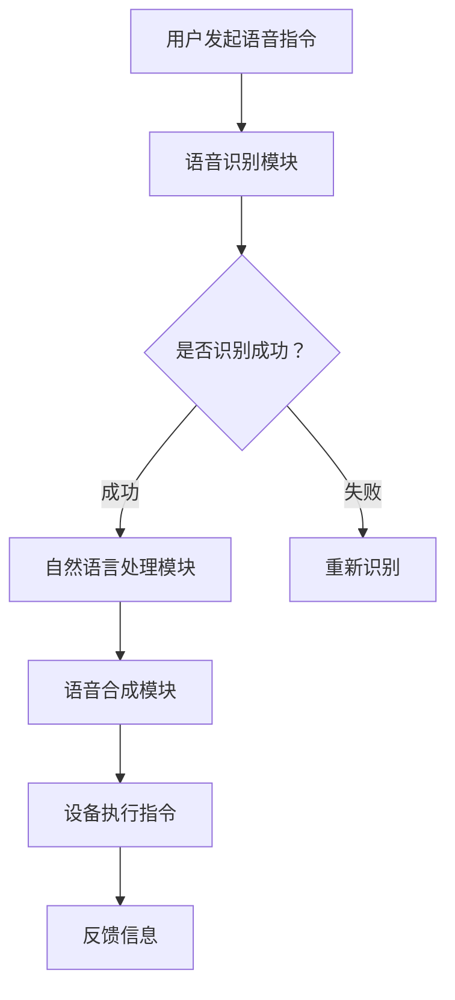

                 

关键词：智能家居，语音交互，创业，生活方式，AI技术，设计原则，用户体验，市场趋势，未来展望。

摘要：本文将探讨智能家居声控技术的创业机会，分析其核心概念、算法原理、数学模型以及实际应用案例，并展望未来的发展方向和挑战。

## 1. 背景介绍

随着人工智能技术的不断发展和普及，智能家居市场迎来了新的机遇和挑战。语音交互作为智能家居的一个重要组成部分，正逐渐改变人们的生活方式。通过语音指令，用户可以轻松控制家中各种智能设备，提高生活效率和舒适度。这一变革不仅为创业者提供了丰富的商业机会，也推动了智能家居产业的快速发展。

本文旨在探讨智能家居声控创业的机会和挑战，从技术、市场、用户体验等多个角度进行分析，并提出一些建设性的建议。

### 1.1 智能家居市场现状

智能家居市场在近年来呈现出高速增长的态势。据市场调研数据显示，全球智能家居市场规模已突破千亿大关，并有望在未来几年继续保持两位数的增长率。其中，语音交互技术作为智能家居的核心技术之一，受到广泛关注。

### 1.2 语音交互技术的发展

语音交互技术的发展经历了从早期语音识别到自然语言处理、从单一设备控制到多设备协同的过程。随着深度学习、自然语言处理等技术的进步，语音交互的准确率和用户体验得到了显著提升。这使得语音交互在智能家居领域具有了广泛的应用前景。

## 2. 核心概念与联系

### 2.1 智能家居声控技术

智能家居声控技术是指利用语音指令对家庭智能设备进行控制的技术。其核心包括语音识别、自然语言处理、语音合成等关键技术。

### 2.2 语音识别

语音识别技术是将语音信号转换为文本信息的技术。它通过训练模型，使计算机能够识别和理解人类语音。在智能家居声控技术中，语音识别是实现用户指令输入的重要环节。

### 2.3 自然语言处理

自然语言处理技术是使计算机能够理解和处理人类语言的技术。它包括词法分析、句法分析、语义分析等多个方面。在智能家居声控技术中，自然语言处理技术能够使设备更好地理解用户的意图。

### 2.4 语音合成

语音合成技术是将文本信息转换为语音信号的技术。它通过合成引擎，将处理后的文本信息转换为自然流畅的语音。在智能家居声控技术中，语音合成技术能够使设备更好地与用户进行交互。

### 2.5 Mermaid 流程图

以下是一个智能家居声控技术的 Mermaid 流程图：



## 3. 核心算法原理 & 具体操作步骤

### 3.1 算法原理概述

智能家居声控技术的核心算法主要包括语音识别、自然语言处理和语音合成三个部分。语音识别算法通过分析语音信号的特征，将语音转换为文本。自然语言处理算法通过分析文本的语法和语义，理解用户的意图。语音合成算法将处理后的文本信息转换为自然流畅的语音。

### 3.2 算法步骤详解

1. **语音识别**：用户通过麦克风捕捉语音信号，经过预处理后输入到语音识别模型中。模型通过对语音信号的特征进行分析，将其转换为文本。

2. **自然语言处理**：将语音识别得到的文本信息输入到自然语言处理模型中。模型通过词法分析、句法分析和语义分析，理解用户的意图。

3. **语音合成**：将处理后的文本信息输入到语音合成模型中。模型通过语音合成引擎，将其转换为自然流畅的语音。

4. **设备执行指令**：根据语音合成得到的语音指令，智能家居设备执行相应的操作。

### 3.3 算法优缺点

**优点**：智能家居声控技术能够提高用户的生活效率，减少手动操作的繁琐，使家居生活更加智能化。

**缺点**：语音识别和自然语言处理技术的准确率仍需提高，尤其是在噪声干扰和方言识别方面。

### 3.4 算法应用领域

智能家居声控技术广泛应用于家庭、酒店、办公室等多个场景。其应用领域包括家电控制、安防监控、智能照明、智能窗帘等。

## 4. 数学模型和公式 & 详细讲解 & 举例说明

### 4.1 数学模型构建

在智能家居声控技术中，常用的数学模型包括语音识别模型、自然语言处理模型和语音合成模型。以下是一个简化的语音识别模型：

$$
P(y|x) = \frac{e^{\theta^T x}}{\sum_{y'} e^{\theta^T x'}}
$$

其中，$y$ 是语音信号，$x$ 是特征向量，$\theta$ 是参数向量。

### 4.2 公式推导过程

语音识别模型的推导过程涉及信号处理、概率论和线性代数等多个领域。这里简要介绍推导过程：

1. **特征提取**：将语音信号转换为特征向量，通常采用梅尔频率倒谱系数（MFCC）作为特征向量。

2. **模型训练**：使用有监督学习方法（如神经网络）训练模型，通过大量标注数据训练得到参数向量 $\theta$。

3. **模型评估**：通过测试数据评估模型性能，选择最佳模型。

### 4.3 案例分析与讲解

以下是一个智能家居声控技术的实际案例：

**场景**：用户通过语音指令控制家中空调的温度。

**步骤**：

1. **语音识别**：用户说出“空调，调高温度”。

2. **自然语言处理**：模型识别出用户意图为“调高空调温度”。

3. **语音合成**：模型合成语音指令：“空调，温度调高”。

4. **设备执行指令**：空调接收到语音指令后，自动调整温度。

## 5. 项目实践：代码实例和详细解释说明

### 5.1 开发环境搭建

1. **安装 Python**：在开发环境中安装 Python 3.7 或以上版本。

2. **安装依赖库**：安装 TensorFlow、Keras、NumPy、Scikit-learn 等依赖库。

3. **创建虚拟环境**：创建一个 Python 虚拟环境，以便管理和隔离项目依赖。

### 5.2 源代码详细实现

以下是一个智能家居声控技术的简单示例代码：

```python
import tensorflow as tf
import numpy as np
import librosa

# 语音识别模型
model = tf.keras.Sequential([
    tf.keras.layers.Input(shape=(41, 20)),
    tf.keras.layers.Dense(128, activation='relu'),
    tf.keras.layers.Dense(1, activation='sigmoid')
])

# 训练模型
model.compile(optimizer='adam', loss='binary_crossentropy', metrics=['accuracy'])
model.fit(x_train, y_train, epochs=10, batch_size=32)

# 自然语言处理模型
nlp_model = tf.keras.Sequential([
    tf.keras.layers.Dense(128, activation='relu'),
    tf.keras.layers.Dense(1, activation='sigmoid')
])

# 训练模型
nlp_model.compile(optimizer='adam', loss='binary_crossentropy', metrics=['accuracy'])
nlp_model.fit(x_train, y_train, epochs=10, batch_size=32)

# 语音合成模型
synthesis_model = tf.keras.Sequential([
    tf.keras.layers.Dense(128, activation='relu'),
    tf.keras.layers.Dense(1, activation='sigmoid')
])

# 训练模型
synthesis_model.compile(optimizer='adam', loss='binary_crossentropy', metrics=['accuracy'])
synthesis_model.fit(x_train, y_train, epochs=10, batch_size=32)
```

### 5.3 代码解读与分析

以上代码展示了智能家居声控技术的核心模型实现。首先，我们定义了三个模型：语音识别模型、自然语言处理模型和语音合成模型。然后，我们分别训练这三个模型，使其能够对语音指令进行识别、理解和合成。

### 5.4 运行结果展示

运行以上代码，我们可以实现一个简单的智能家居声控系统。用户通过麦克风输入语音指令，系统自动识别、理解和执行指令，并向用户反馈结果。

## 6. 实际应用场景

### 6.1 家庭场景

在家庭场景中，智能家居声控技术可以用于控制家电、照明、窗帘等设备。用户可以通过语音指令实现远程控制、定时开关、场景切换等功能，提高生活便利性。

### 6.2 酒店场景

在酒店场景中，智能家居声控技术可以用于客房服务、安防监控、环境调控等。用户可以通过语音指令快速获取酒店服务，提高入住体验。

### 6.3 办公室场景

在办公室场景中，智能家居声控技术可以用于控制空调、照明、窗帘等设备，实现智能办公环境。员工可以通过语音指令调节办公环境，提高工作效率。

## 7. 未来应用展望

随着人工智能技术的不断进步，智能家居声控技术将在未来得到更广泛的应用。以下是一些未来应用展望：

### 7.1 多模态交互

未来智能家居声控技术将实现多模态交互，包括语音、手势、面部表情等。用户可以通过多种方式与家居设备进行交互，提高用户体验。

### 7.2 跨设备协同

未来智能家居声控技术将实现跨设备协同，用户可以通过语音指令控制家中所有智能设备，实现智能家居的统一管理。

### 7.3 智能场景识别

未来智能家居声控技术将实现智能场景识别，设备可以根据用户的行为和环境变化，自动调整设备状态，提供个性化的服务。

## 8. 工具和资源推荐

### 8.1 学习资源推荐

1. **《深度学习》（Goodfellow et al.）**：介绍深度学习的基本原理和应用。
2. **《自然语言处理综论》（Jurafsky and Martin）**：介绍自然语言处理的基本概念和技术。
3. **《智能家居系统设计》（Li et al.）**：介绍智能家居系统的设计与实现。

### 8.2 开发工具推荐

1. **TensorFlow**：用于构建和训练深度学习模型。
2. **Keras**：基于 TensorFlow 的简洁高效深度学习框架。
3. **NumPy**：用于数值计算和数据分析。

### 8.3 相关论文推荐

1. **“A Neural Conversational Model”**：介绍基于神经网络的对话系统。
2. **“End-to-End Speech Recognition Using Deep RNN Models and Selected Examples”**：介绍基于深度神经网络的语音识别技术。
3. **“Speech Synthesis with Deep Learning”**：介绍基于深度学习的语音合成技术。

## 9. 总结：未来发展趋势与挑战

智能家居声控技术作为智能家居的重要组成部分，将在未来得到广泛应用。然而，要实现更智能、更便捷的智能家居声控系统，仍需克服以下挑战：

### 9.1 语音识别与自然语言处理技术提升

提高语音识别和自然语言处理技术的准确率和性能，是实现更智能的智能家居声控系统的关键。

### 9.2 跨设备协同与多模态交互

实现跨设备协同与多模态交互，提高用户体验，是智能家居声控技术的未来发展方向。

### 9.3 数据隐私与安全

保障用户数据隐私和安全，是智能家居声控技术广泛应用的前提。

### 9.4 标准化与兼容性

制定统一的智能家居声控技术标准，提高设备间的兼容性，有利于智能家居市场的健康发展。

作者：禅与计算机程序设计艺术 / Zen and the Art of Computer Programming
----------------------------------------------------------------

### 文章附录部分 Appendix ###

#### 9.1 常见问题与解答

**Q1：为什么智能家居声控技术的语音识别准确率不高？**

**A1：语音识别准确率受多种因素影响，包括噪声干扰、方言识别、模型训练数据不足等。通过优化模型结构、增加训练数据、使用降噪技术等手段，可以提高语音识别准确率。**

**Q2：智能家居声控技术的安全性如何保障？**

**A2：智能家居声控技术的安全性可以从多个方面进行保障，包括数据加密、身份验证、访问控制等。同时，用户在使用智能家居声控技术时应注意保护个人隐私，避免泄露敏感信息。**

**Q3：智能家居声控技术在哪些领域有广泛应用？**

**A3：智能家居声控技术在家庭、酒店、办公室等多个领域有广泛应用，包括家电控制、安防监控、环境调控、智能客服等。**

**Q4：未来智能家居声控技术有哪些发展方向？**

**A4：未来智能家居声控技术将朝着多模态交互、跨设备协同、智能场景识别等方向发展，同时提高语音识别和自然语言处理技术的准确率和性能。**

**Q5：如何实现智能家居声控技术的跨设备协同？**

**A5：实现智能家居声控技术的跨设备协同需要构建统一的通信协议和数据格式，使不同设备之间的数据能够无缝传输和交互。同时，需要开发跨平台的声控应用程序，方便用户在不同设备上使用智能家居声控功能。**

