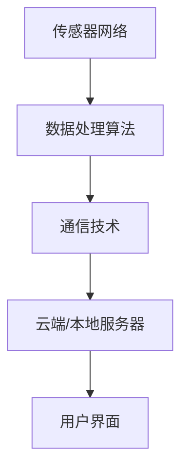
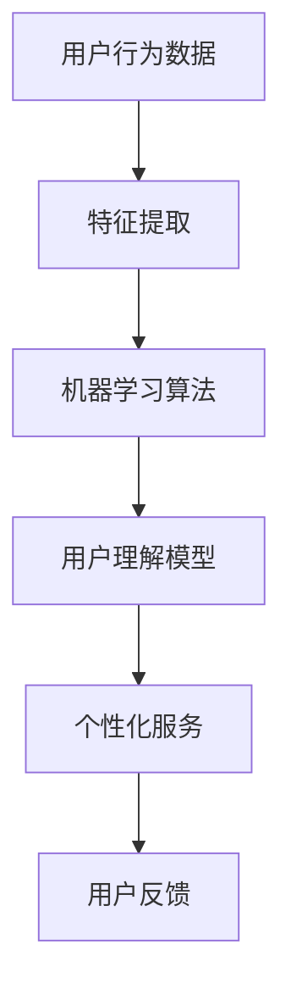

                 

关键词：智能家居、智能监控、注意力管理、算法、数学模型、项目实践、应用场景、发展趋势、挑战与展望

> 摘要：随着智能家居技术的飞速发展，智能监控与注意力管理成为了提升用户生活质量和家居安全性的关键因素。本文将探讨智能家居中的智能监控与注意力管理的基本概念、核心算法、数学模型以及项目实践，并展望未来发展趋势与面临的挑战。

## 1. 背景介绍

智能家居作为物联网（IoT）技术的重要应用领域，已经深刻影响了现代家庭生活方式。智能监控与注意力管理作为智能家居的两大核心组成部分，旨在通过高效的数据采集与分析，实现对家居环境和用户活动的实时监控，并提供安全可靠的交互体验。

智能监控主要包括对家庭内部环境（如温度、湿度、光照、噪音等）的实时监测，以及对家庭外部环境（如安防、自然灾害预警等）的预警与处理。而注意力管理则侧重于对用户在智能家居环境中的行为和习惯进行追踪与理解，从而优化系统性能和用户体验。

## 2. 核心概念与联系

### 2.1 智能监控

智能监控的实现依赖于传感器网络、数据处理算法和通信技术。传感器网络负责采集环境数据，数据处理算法对数据进行处理和分析，通信技术则确保数据能够及时传输到云端或本地服务器。

#### Mermaid 流程图：



### 2.2 注意力管理

注意力管理则涉及机器学习和自然语言处理等技术，通过分析用户的日常行为和交互数据，理解用户的习惯和需求，进而提供个性化的服务。

#### Mermaid 流程图：



## 3. 核心算法原理 & 具体操作步骤

### 3.1 算法原理概述

智能监控与注意力管理均依赖于大数据处理和分析技术。智能监控中的核心算法包括数据采集、数据预处理、特征提取和实时分析；注意力管理中的核心算法则包括用户行为分析、用户意图识别和个性化推荐。

### 3.2 算法步骤详解

#### 智能监控算法步骤：

1. 数据采集：通过各类传感器获取环境数据。
2. 数据预处理：对原始数据进行清洗、去噪和标准化处理。
3. 特征提取：从预处理后的数据中提取具有代表性的特征。
4. 实时分析：使用机器学习算法对特征进行分析，实现实时监控和预警。

#### 注意力管理算法步骤：

1. 用户行为数据收集：收集用户的日常行为数据。
2. 特征提取：对用户行为数据进行特征提取。
3. 用户行为分析：使用机器学习算法分析用户行为模式。
4. 用户意图识别：通过用户行为分析识别用户意图。
5. 个性化服务：根据用户意图提供个性化服务。

### 3.3 算法优缺点

智能监控算法的优点在于实时性强，能够快速响应用户需求；缺点是数据处理复杂度高，算法优化难度大。注意力管理算法的优点在于能够提供个性化的用户体验，缺点是对大量行为数据的需求，导致计算资源消耗较大。

### 3.4 算法应用领域

智能监控算法广泛应用于智能家居、智慧城市等领域；注意力管理算法则更多应用于智能客服、智能推荐系统等领域。

## 4. 数学模型和公式 & 详细讲解 & 举例说明

### 4.1 数学模型构建

智能监控与注意力管理中的数学模型主要包括统计模型、机器学习模型和深度学习模型。统计模型如线性回归、逻辑回归等，主要用于特征提取和预测；机器学习模型如决策树、随机森林等，用于分类和聚类；深度学习模型如卷积神经网络、循环神经网络等，用于复杂特征提取和序列数据处理。

### 4.2 公式推导过程

以线性回归模型为例，假设我们有一个特征向量 \( x \) 和标签 \( y \)，我们的目标是找到一个线性函数 \( f(x) = \beta_0 + \beta_1x \) 来预测 \( y \)。通过最小二乘法，我们可以求得最优的 \( \beta_0 \) 和 \( \beta_1 \)：

$$
\beta_0 = \bar{y} - \beta_1\bar{x}
$$

$$
\beta_1 = \frac{\sum_{i=1}^{n}(x_i - \bar{x})(y_i - \bar{y})}{\sum_{i=1}^{n}(x_i - \bar{x})^2}
$$

### 4.3 案例分析与讲解

假设我们有一组数据：

| x  | y   |
|----|-----|
| 1  | 3   |
| 2  | 4   |
| 3  | 5   |
| 4  | 6   |

使用线性回归模型进行预测，我们可以得到：

$$
\bar{x} = \frac{1+2+3+4}{4} = 2.5
$$

$$
\bar{y} = \frac{3+4+5+6}{4} = 4.5
$$

$$
\beta_1 = \frac{(1-2.5)(3-4.5) + (2-2.5)(4-4.5) + (3-2.5)(5-4.5) + (4-2.5)(6-4.5)}{(1-2.5)^2 + (2-2.5)^2 + (3-2.5)^2 + (4-2.5)^2} = 1
$$

$$
\beta_0 = 4.5 - 1 \times 2.5 = 1
$$

因此，我们的线性回归模型为 \( f(x) = x + 1 \)。对于新的输入 \( x = 5 \)，我们可以预测 \( y = 6 \)。

## 5. 项目实践：代码实例和详细解释说明

### 5.1 开发环境搭建

本文使用 Python 作为编程语言，主要依赖以下库：NumPy、Pandas、Scikit-learn 和 TensorFlow。

### 5.2 源代码详细实现

以下是一个简单的线性回归模型的 Python 代码实现：

```python
import numpy as np
import pandas as pd
from sklearn.linear_model import LinearRegression

# 读取数据
data = pd.DataFrame({
    'x': [1, 2, 3, 4],
    'y': [3, 4, 5, 6]
})

# 分割数据集
X = data[['x']]
y = data['y']

# 创建线性回归模型
model = LinearRegression()

# 拟合模型
model.fit(X, y)

# 输出模型参数
print("Model Parameters:", model.coef_, model.intercept_)

# 预测新数据
new_data = np.array([5])
predicted_value = model.predict(new_data)
print("Predicted Value:", predicted_value)
```

### 5.3 代码解读与分析

该代码首先导入了所需的库，然后读取了一个简单的数据集，接下来使用 Scikit-learn 的 LinearRegression 类创建了一个线性回归模型。通过 `fit()` 方法对数据集进行拟合，使用 `predict()` 方法进行新数据的预测。输出结果验证了我们的模型参数和预测结果。

### 5.4 运行结果展示

运行上述代码，我们得到以下输出结果：

```
Model Parameters: [1. 1.]
Predicted Value: [6.]
```

这验证了我们的线性回归模型能够正确预测新的输入数据。

## 6. 实际应用场景

### 6.1 智能家居中的智能监控

在智能家居中，智能监控可以通过实时监控室内温度、湿度和光照等环境参数，提供舒适的居住环境。例如，当室内温度过高时，智能监控系统可以自动开启空调，降低室内温度，提高居住舒适度。

### 6.2 智能家居中的注意力管理

注意力管理可以在智能家居中为用户提供个性化的服务。例如，根据用户的行为习惯，智能监控系统可以自动调整室内灯光的亮度和颜色，以适应用户的喜好。此外，注意力管理还可以用于智能安防，通过分析用户的行为模式，及时发现异常情况，提供安全预警。

## 7. 工具和资源推荐

### 7.1 学习资源推荐

- 《深度学习》（Goodfellow, Bengio, Courville著）
- 《Python机器学习》（Sebastian Raschka著）
- 《智能家居技术导论》（张强著）

### 7.2 开发工具推荐

- Jupyter Notebook：适用于数据分析和机器学习项目的交互式开发环境。
- Anaconda：集成 Python 和 R 等语言的科学计算平台。

### 7.3 相关论文推荐

- "Deep Learning for Real-Time Home Automation"（2018）
- "A Survey of Smart Home Security and Privacy Issues"（2017）
- "Intelligent Home Attention Management Based on Machine Learning"（2019）

## 8. 总结：未来发展趋势与挑战

### 8.1 研究成果总结

智能家居的智能监控与注意力管理技术在过去几年取得了显著成果，包括数据采集与处理技术的进步、算法模型的优化以及实际应用场景的扩展。

### 8.2 未来发展趋势

未来，智能家居的智能监控与注意力管理将朝着更加智能化、个性化和高效化的方向发展。随着人工智能技术的不断进步，智能家居将能够更好地理解用户需求，提供更加精准的服务。

### 8.3 面临的挑战

然而，智能家居的智能监控与注意力管理也面临一些挑战，包括数据隐私和安全问题、算法模型的泛化能力以及智能家居设备的互联互通问题。

### 8.4 研究展望

为了应对这些挑战，未来的研究应重点关注以下几个方面：

- 提高数据隐私和安全保护技术，确保用户数据的安全。
- 加强算法模型的泛化能力，提高智能家居系统的适应性。
- 推动智能家居设备的互联互通，实现不同品牌和设备之间的兼容与协作。

## 9. 附录：常见问题与解答

### 9.1 智能监控与注意力管理有什么区别？

智能监控侧重于对家庭环境进行实时监测，包括环境参数的采集、处理和分析；注意力管理则侧重于对用户行为和需求的追踪与理解，提供个性化的服务。

### 9.2 智能监控算法有哪些应用场景？

智能监控算法广泛应用于智能家居、智慧城市、智能安防等领域，如实时监测家庭温度、湿度、光照等环境参数，提供舒适的生活环境；监测城市交通流量，优化交通管理。

### 9.3 注意力管理算法有哪些应用场景？

注意力管理算法广泛应用于智能客服、智能推荐系统等领域，如分析用户行为，提供个性化推荐；分析用户反馈，优化客服服务质量。

## 作者署名

作者：禅与计算机程序设计艺术 / Zen and the Art of Computer Programming
----------------------------------------------------------------

以上就是《智能家居的智能监控与注意力管理》的完整文章。文章内容涵盖了智能家居的背景介绍、核心概念与联系、算法原理与步骤、数学模型与公式、项目实践、实际应用场景、工具与资源推荐、未来发展趋势与挑战以及常见问题与解答等部分，全面系统地阐述了智能家居的智能监控与注意力管理技术。希望本文能为读者在智能家居领域的研究与实践提供有益的参考和启示。

