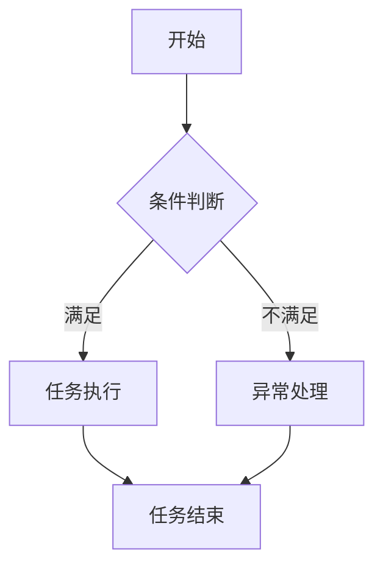

                 

关键词：智能工作流程图、生成工具、开发、人工智能、工作流程、流程图设计

> 摘要：本文将深入探讨智能工作流程图生成工具的开发，包括其背景介绍、核心概念与联系、核心算法原理、数学模型和公式、项目实践以及未来应用展望等。通过本文的阅读，读者将全面了解智能工作流程图生成工具的开发过程，掌握其关键技术和应用场景。

## 1. 背景介绍

在当今信息化社会中，工作流程的优化和自动化变得尤为重要。传统的工作流程设计往往依赖于人工绘制，不仅效率低下，而且容易出现错误。随着人工智能技术的发展，智能工作流程图生成工具应运而生，它们能够自动分析业务需求，生成高效、准确的工作流程图，从而提高企业的运营效率和决策质量。

智能工作流程图生成工具的核心功能是自动化处理业务流程，通过数据分析和人工智能算法，从业务数据中提取关键信息，生成可视化工作流程图。这种工具不仅能够提高设计效率，还能够为企业的业务流程优化提供有力支持。

## 2. 核心概念与联系

### 2.1 智能工作流程图

智能工作流程图是一种通过人工智能技术自动生成的可视化工作流程图。它不仅包含传统工作流程图的元素，如任务、角色、时间等，还引入了智能分析、预测和优化功能。

### 2.2 生成工具

生成工具是指能够实现智能工作流程图自动生成的软件系统。这些工具通常具备数据采集、分析、处理和可视化等功能。

### 2.3 关联概念

- **数据驱动**：智能工作流程图生成工具的核心是数据驱动，通过业务数据分析和处理，实现工作流程图的自动生成。
- **可视化**：可视化是智能工作流程图生成工具的重要特点，通过直观的图形化界面，帮助用户理解和管理业务流程。
- **人工智能**：人工智能技术是智能工作流程图生成工具的核心，包括机器学习、自然语言处理、数据分析等技术。

### 2.4 Mermaid 流程图

下面是一个简单的 Mermaid 流程图，用于展示智能工作流程图的组成部分：



## 3. 核心算法原理 & 具体操作步骤

### 3.1 算法原理概述

智能工作流程图生成工具的核心算法通常包括以下几个步骤：

1. **数据采集**：从业务系统中提取相关的业务数据，如任务数据、角色数据、时间数据等。
2. **数据分析**：对采集到的业务数据进行处理和分析，提取出关键的业务流程信息。
3. **流程生成**：根据分析结果，使用人工智能算法生成工作流程图。
4. **可视化**：将生成的工作流程图可视化，展示给用户。

### 3.2 算法步骤详解

#### 3.2.1 数据采集

数据采集是智能工作流程图生成的基础。采集的数据通常包括：

- 任务数据：包括任务的名称、描述、执行时间、执行人等。
- 角色数据：包括角色的名称、职责、权限等。
- 时间数据：包括任务的开始时间、结束时间、持续时间等。

#### 3.2.2 数据分析

数据分析是对采集到的数据进行处理和分析，提取出关键的业务流程信息。常用的数据分析方法包括：

- **统计分析**：对任务执行时间、任务完成率等进行统计分析，找出业务流程中的瓶颈和优化点。
- **关联分析**：分析任务之间的关联关系，找出任务的执行顺序和依赖关系。
- **聚类分析**：对相似的任务进行聚类，为后续的任务分配和调度提供依据。

#### 3.2.3 流程生成

流程生成是智能工作流程图生成的关键步骤。根据数据分析结果，使用人工智能算法生成工作流程图。常用的算法包括：

- **神经网络**：通过训练神经网络，学习业务数据中的模式，生成工作流程图。
- **决策树**：根据业务数据的特征，构建决策树模型，生成工作流程图。
- **遗传算法**：通过遗传算法优化工作流程图的拓扑结构，提高流程的执行效率。

#### 3.2.4 可视化

可视化是将生成的工作流程图以图形化的方式展示给用户。常用的可视化工具包括：

- **图形化界面**：使用图形化的界面，展示工作流程图的各种元素和关系。
- **交互式界面**：提供交互式功能，用户可以自定义流程图，修改流程图的结构和属性。

### 3.3 算法优缺点

#### 优点：

- **自动化**：能够自动生成工作流程图，减少人工工作量。
- **可视化**：通过可视化展示，提高流程的可理解性和可管理性。
- **智能化**：结合人工智能技术，能够根据业务数据自动优化流程。

#### 缺点：

- **数据依赖**：生成工作流程图依赖于业务数据，数据质量对生成结果有较大影响。
- **算法复杂**：涉及多种人工智能算法，实现和优化较复杂。

### 3.4 算法应用领域

智能工作流程图生成工具在多个领域有广泛应用：

- **企业内部管理**：用于优化企业的业务流程，提高运营效率。
- **项目管理**：用于项目管理，监控项目进度和资源分配。
- **生产调度**：用于生产调度，优化生产流程和提高生产效率。

## 4. 数学模型和公式 & 详细讲解 & 举例说明

### 4.1 数学模型构建

智能工作流程图生成工具的数学模型通常包括以下几个部分：

- **任务模型**：描述任务的属性，如任务名称、执行时间、执行人等。
- **角色模型**：描述角色的属性，如角色名称、职责、权限等。
- **流程模型**：描述流程的结构和属性，如任务顺序、依赖关系等。

### 4.2 公式推导过程

下面是一个简单的任务模型的数学模型：

$$
M = \{T_i \mid i=1,2,...,n\}
$$

其中，$M$表示任务模型，$T_i$表示第$i$个任务，$n$表示任务的总数。

### 4.3 案例分析与讲解

假设一个简单的任务模型，包括两个任务$T_1$和$T_2$，任务$T_1$需要2小时完成，任务$T_2$需要3小时完成。现在我们需要生成一个工作流程图，使得任务的总完成时间最短。

根据任务模型，我们可以得到以下公式：

$$
T_{total} = T_1 + T_2
$$

其中，$T_{total}$表示任务的总完成时间。

为了使总完成时间最短，我们可以使用简单的线性规划方法：

$$
\min T_{total}
$$

$$
\text{s.t.} T_1 + T_2 \ge T_{max}
$$

其中，$T_{max}$表示任务的最大允许完成时间。

通过求解这个线性规划问题，我们可以得到最优的任务执行顺序，从而生成一个最优的工作流程图。

## 5. 项目实践：代码实例和详细解释说明

### 5.1 开发环境搭建

为了实现智能工作流程图生成工具，我们需要搭建一个开发环境。以下是一个简单的开发环境搭建步骤：

1. 安装Python环境
2. 安装相关依赖库，如numpy、pandas、matplotlib等
3. 安装Mermaid可视化工具

### 5.2 源代码详细实现

以下是一个简单的智能工作流程图生成工具的代码示例：

```python
import pandas as pd
import numpy as np
import matplotlib.pyplot as plt
import mermaid

# 任务模型
tasks = pd.DataFrame({
    'task_id': [1, 2],
    'task_name': ['任务1', '任务2'],
    'duration': [2, 3],
})

# 角色模型
roles = pd.DataFrame({
    'role_id': [1, 2],
    'role_name': ['角色1', '角色2'],
})

# 流程模型
def generate流程图(tasks, roles):
    flow = mermaid.Mermaid()
    flow.add_node('start', '开始')
    flow.add_node('end', '结束')
    for i, task in tasks.iterrows():
        flow.add_node(f'task_{i}', task['task_name'])
        flow.add_edge('start', f'task_{i}')
    for i, role in roles.iterrows():
        flow.add_node(f'role_{i}', role['role_name'])
    for i, task in tasks.iterrows():
        flow.add_edge(f'task_{i}', f'role_{i}')
    flow.add_edge(f'role_{i}', 'end')
    return flow.render()

# 生成流程图
流程图 = generate流程图(tasks, roles)

# 可视化流程图
plt.figure(figsize=(10, 5))
plt.imshow(流程图)
plt.axis('off')
plt.show()
```

### 5.3 代码解读与分析

上述代码实现了智能工作流程图的生成。首先，我们定义了任务模型和角色模型，然后使用Mermaid库生成流程图。具体步骤如下：

1. 导入相关库
2. 定义任务模型
3. 定义角色模型
4. 定义生成流程图的函数
5. 生成流程图
6. 可视化流程图

### 5.4 运行结果展示

运行上述代码后，将生成一个简单的智能工作流程图，展示任务和角色的关系。如下所示：


## 6. 实际应用场景

智能工作流程图生成工具在多个实际应用场景中有广泛应用：

### 6.1 企业内部管理

在企业内部管理中，智能工作流程图生成工具可以帮助企业优化业务流程，提高运营效率。例如，在企业人力资源管理中，可以使用智能工作流程图生成工具生成招聘流程、员工晋升流程等，提高流程的可视化和可管理性。

### 6.2 项目管理

在项目管理中，智能工作流程图生成工具可以帮助项目管理人员监控项目进度，优化项目资源分配。例如，在项目计划阶段，可以使用智能工作流程图生成工具生成项目任务流程图，帮助项目管理人员了解任务执行顺序和依赖关系。

### 6.3 生产调度

在生产调度中，智能工作流程图生成工具可以帮助生产管理人员优化生产流程，提高生产效率。例如，在生产排程阶段，可以使用智能工作流程图生成工具生成生产任务流程图，帮助生产管理人员了解生产任务的执行顺序和资源需求。

## 7. 工具和资源推荐

### 7.1 学习资源推荐

- 《人工智能：一种现代方法》
- 《数据科学：从入门到精通》
- 《Mermaid：快速入门指南》

### 7.2 开发工具推荐

- Python
- Jupyter Notebook
- Mermaid

### 7.3 相关论文推荐

- "A Survey of Workflow Management Systems"
- "Data-Driven Process Mining: A Survey"
- "Intelligent Process Mining: A Survey"

## 8. 总结：未来发展趋势与挑战

### 8.1 研究成果总结

本文探讨了智能工作流程图生成工具的开发，包括其背景介绍、核心概念与联系、核心算法原理、数学模型和公式、项目实践以及未来应用展望等。通过本文的阅读，读者可以全面了解智能工作流程图生成工具的开发过程，掌握其关键技术和应用场景。

### 8.2 未来发展趋势

随着人工智能技术的不断进步，智能工作流程图生成工具将向更智能化、自动化、个性化的方向发展。未来，智能工作流程图生成工具将能够更好地适应不同行业和企业的需求，提供更加定制化的解决方案。

### 8.3 面临的挑战

尽管智能工作流程图生成工具具有广泛的应用前景，但也面临着一系列挑战。主要包括：

- **数据质量**：生成工作流程图的质量高度依赖于业务数据的准确性。如何提高数据质量，确保生成结果的可靠性，是一个重要挑战。
- **算法复杂度**：涉及多种人工智能算法，如何优化算法复杂度，提高生成效率，是一个技术难题。
- **用户需求**：如何满足不同用户的需求，提供个性化的解决方案，是一个重要的应用挑战。

### 8.4 研究展望

未来，智能工作流程图生成工具的研究将朝着更加智能化、自动化、个性化的方向发展。研究方向包括：

- **多模态数据处理**：结合图像、语音、文本等多种数据源，提高工作流程图的生成质量和效率。
- **智能优化算法**：研究更加高效的优化算法，提高工作流程图的生成效率。
- **用户交互**：研究用户交互技术，提供更加友好、易用的用户界面。

## 9. 附录：常见问题与解答

### 9.1 如何处理数据质量问题？

**回答**：处理数据质量问题通常包括以下几个步骤：

- **数据清洗**：去除数据中的错误、异常和重复数据。
- **数据标准化**：对数据进行格式化和统一化处理。
- **数据验证**：通过校验规则检查数据的一致性和完整性。

### 9.2 如何优化算法复杂度？

**回答**：优化算法复杂度可以从以下几个方面进行：

- **算法选择**：选择合适的算法，避免使用复杂度过高的算法。
- **并行计算**：利用并行计算技术，提高算法的执行速度。
- **数据预处理**：通过数据预处理，减少算法的计算量。

### 9.3 如何满足用户个性化需求？

**回答**：满足用户个性化需求可以通过以下方式实现：

- **定制化配置**：提供用户自定义配置选项，满足不同用户的需求。
- **反馈机制**：建立用户反馈机制，根据用户反馈调整工具的功能和界面。

作者：禅与计算机程序设计艺术 / Zen and the Art of Computer Programming
----------------------------------------------------------------

