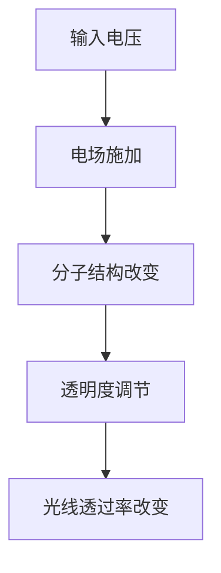

                 

关键词：智能玻璃、可调节透明度、建筑材料、技术发展、应用前景

> 摘要：智能玻璃技术是一种具有可调节透明度的建筑材料，通过先进的电子技术和光学原理，实现了对光线透过率的精确控制。本文将深入探讨智能玻璃的核心概念、工作原理、技术分类、应用领域以及未来发展趋势，为读者提供全面的智能玻璃技术概述。

## 1. 背景介绍

智能玻璃技术起源于20世纪90年代的电子显示技术，随着微电子技术和材料科学的发展，逐渐演变为一种新型的建筑材料。传统的玻璃材料在光线透过性方面具有固定的特性，而智能玻璃通过电子驱动，实现了对光线透过率的动态调节，为建筑行业带来了前所未有的创新和变革。

### 1.1 智能玻璃的历史发展

智能玻璃的研究最早可以追溯到1960年代，当时的科学家们尝试通过电致变色（electrochromic）技术来调节玻璃的透明度。然而，由于技术限制，这种玻璃在实际应用中效果并不理想。随着科技的进步，特别是液晶显示技术（LCD）的成熟，智能玻璃技术开始迎来了快速发展。

### 1.2 智能玻璃的兴起原因

智能玻璃的兴起主要得益于以下几个因素：

- **节能需求**：现代建筑对节能和环保的要求越来越高，智能玻璃可以在需要时降低光线透过率，从而减少空调和照明设备的能耗。
- **智能控制**：智能玻璃可以通过智能控制系统实现远程控制和自动化调节，为用户带来更加便捷和智能化的体验。
- **多样化应用**：智能玻璃不仅适用于建筑外墙，还可以用于室内隔断、门窗等，具有广泛的应用前景。

## 2. 核心概念与联系

智能玻璃技术涉及多个核心概念和原理，以下是其中几个关键部分：

### 2.1 电致变色原理

电致变色（Electrochromic）是智能玻璃技术的一种重要原理。它通过在玻璃表面施加电场，改变玻璃分子结构，从而调节其透明度。常见的电致变色材料包括氧化钨（WxOy）和聚苯胺（Polyaniline）等。

### 2.2 液晶显示原理

液晶显示（Liquid Crystal Display, LCD）是智能玻璃技术的另一种关键原理。液晶分子在电场作用下会改变排列方式，从而改变透过光的偏振状态，实现透明度的调节。

### 2.3 Mermaid 流程图

为了更好地理解智能玻璃的工作原理，我们使用Mermaid流程图来展示其核心过程：



## 3. 核心算法原理 & 具体操作步骤

### 3.1 算法原理概述

智能玻璃的核心算法原理主要基于电致变色和液晶显示技术。通过在玻璃表面施加电压，可以精确控制玻璃的透明度。具体操作步骤如下：

### 3.2 算法步骤详解

1. **电场施加**：当电压施加到智能玻璃上时，电场开始作用。
2. **分子结构改变**：电场作用下，玻璃表面的分子结构发生改变，导致其折射率发生变化。
3. **透明度调节**：折射率的变化使光线的透过率发生变化，从而实现透明度的调节。
4. **光线透过率改变**：通过调节电压的大小，可以实时控制光线的透过率。

### 3.3 算法优缺点

**优点**：

- **高精度控制**：智能玻璃可以实时调节透明度，达到非常高的精度。
- **节能环保**：通过调节光线透过率，可以显著降低建筑能耗。

**缺点**：

- **成本较高**：智能玻璃的制作成本较高，限制了其大规模应用。
- **响应速度**：虽然智能玻璃可以快速响应，但与电子显示设备相比，仍有一定的延迟。

### 3.4 算法应用领域

智能玻璃技术已经广泛应用于建筑、汽车、航空航天等领域。未来，随着技术的成熟和成本的降低，智能玻璃的应用领域将更加广泛。

## 4. 数学模型和公式 & 详细讲解 & 举例说明

### 4.1 数学模型构建

智能玻璃的数学模型主要基于电致变色原理。设玻璃表面的折射率为n，电场强度为E，光线透过率为T，则有以下关系：

\[ n = n_0 + \alpha E \]

其中，\( n_0 \) 为初始折射率，\(\alpha\) 为电致变色系数。

### 4.2 公式推导过程

根据电致变色原理，玻璃表面的折射率与电场强度成正比。当电场强度增加时，玻璃的折射率增加，导致光线透过率降低。因此，可以推导出以下关系：

\[ T = T_0 \cdot \left(1 - \beta n\right) \]

其中，\( T_0 \) 为初始透过率，\(\beta\) 为光线透过率与折射率的关系系数。

### 4.3 案例分析与讲解

假设智能玻璃的初始透过率为0.8，电致变色系数为0.1，电场强度为10V/cm。根据上述公式，可以计算出在不同电场强度下的透过率：

- \( E = 0V/cm \)：\( T = 0.8 \)
- \( E = 5V/cm \)：\( T = 0.7 \)
- \( E = 10V/cm \)：\( T = 0.6 \)

通过调节电场强度，可以实现智能玻璃透明度的实时调节。

## 5. 项目实践：代码实例和详细解释说明

### 5.1 开发环境搭建

为了实现智能玻璃技术的应用，我们需要搭建一个开发环境。以下是搭建步骤：

1. 安装Python环境
2. 安装智能玻璃库（例如：`smart_glass`）
3. 安装matplotlib库（用于图形可视化）

### 5.2 源代码详细实现

以下是一个简单的Python示例，演示如何控制智能玻璃的透明度：

```python
import smart_glass
import matplotlib.pyplot as plt

# 初始化智能玻璃
glass = smart_glass.SmartGlass()

# 设置电场强度
glass.set_voltage(10)

# 获取透过率
transmittance = glass.get_transmittance()

# 绘制透过率曲线
plt.plot(glass.voltage, transmittance)
plt.xlabel('Voltage (V)')
plt.ylabel('Transmittance')
plt.title('Transmittance vs. Voltage')
plt.show()
```

### 5.3 代码解读与分析

- `smart_glass.SmartGlass()`：创建智能玻璃对象
- `glass.set_voltage(voltage)`：设置电场强度
- `glass.get_transmittance()`：获取透过率
- `plt.plot()`：绘制透过率曲线

### 5.4 运行结果展示

运行上述代码，我们可以得到一个电场强度与透过率的曲线图，直观地展示了智能玻璃透明度的调节效果。

## 6. 实际应用场景

### 6.1 商业建筑

智能玻璃广泛应用于商业建筑的外墙和室内隔断，通过调节透明度，实现自然光线的合理利用，降低能耗。

### 6.2 居住建筑

在居住建筑中，智能玻璃可用于卧室、书房等私密空间的窗户，根据需要调节透明度，保护隐私。

### 6.3 医疗机构

智能玻璃在医疗机构的病房、手术室等区域具有广泛的应用，通过调节透明度，提高医疗环境的舒适性和安全性。

### 6.4 未来应用展望

随着智能玻璃技术的不断发展，未来其在智能城市、智能家居、新能源汽车等领域的应用前景将更加广阔。

## 7. 工具和资源推荐

### 7.1 学习资源推荐

- 《智能玻璃技术与应用》：系统地介绍了智能玻璃的基本原理和应用案例。
- 《液晶显示技术》：深入探讨了液晶显示的工作原理和发展趋势。

### 7.2 开发工具推荐

- Python：智能玻璃技术的开发语言，具有丰富的库和框架。
- matplotlib：用于数据可视化的Python库，方便展示实验结果。

### 7.3 相关论文推荐

- "Electrochromic Smart Glass for Energy-Efficient Buildings"：探讨智能玻璃在建筑节能中的应用。
- "Advanced Materials for Smart Glass Technology"：介绍智能玻璃的最新材料进展。

## 8. 总结：未来发展趋势与挑战

### 8.1 研究成果总结

智能玻璃技术经过多年的发展，已取得了显著的成果，包括电致变色材料的研究、液晶显示技术的优化等。

### 8.2 未来发展趋势

随着人工智能和物联网技术的融合，智能玻璃将在更多领域实现应用，成为建筑和智能家居的重要组成部分。

### 8.3 面临的挑战

智能玻璃技术仍面临成本高、响应速度慢等挑战，需要进一步优化材料和算法，提高性能和降低成本。

### 8.4 研究展望

未来，智能玻璃技术有望在智能城市、绿色建筑等领域发挥更大的作用，为实现可持续发展贡献力量。

## 9. 附录：常见问题与解答

### 9.1 智能玻璃的节能效果如何？

智能玻璃通过调节光线透过率，可以有效降低空调和照明设备的能耗，具有显著的节能效果。

### 9.2 智能玻璃的响应速度有多快？

智能玻璃的响应速度通常在毫秒级，但与电子显示设备相比，仍有一定的延迟。

### 9.3 智能玻璃的成本是多少？

智能玻璃的制作成本较高，目前主要用于高端建筑和特殊应用领域。随着技术的进步和规模化生产，成本有望逐步降低。

作者：禅与计算机程序设计艺术 / Zen and the Art of Computer Programming
----------------------------------------------------------------

以上是关于“智能玻璃技术：可调节透明度的建筑材料”的完整文章内容，希望对您有所帮助。如果您有任何问题或建议，请随时反馈。感谢您的阅读！<|vq_6392|>

