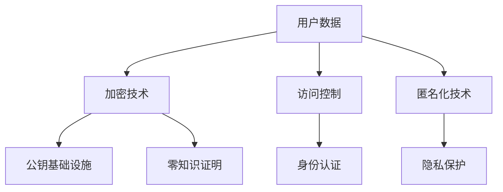

                 

关键词：智能设备，隐私，数据保护，加密，用户数据安全

> 摘要：本文将探讨智能设备隐私保护的重要性，分析当前的数据保护措施，提出一种基于加密技术的解决方案，旨在确保用户数据的安全与隐私。文章还将展望智能设备隐私保护的未来发展趋势与挑战。

## 1. 背景介绍

随着物联网（IoT）技术的快速发展，智能设备已经深入到我们生活的方方面面。从智能手机、平板电脑到智能家居设备、可穿戴设备，这些设备不断地收集、处理和传输用户的数据。然而，这些数据中包含着大量的个人隐私信息，如地理位置、通信记录、个人喜好等。如果这些数据被不法分子获取或滥用，将会对用户的隐私造成严重威胁。

近年来，一系列智能设备隐私泄露事件频发，引起了全球范围内的广泛关注。例如，某知名智能家居设备制造商在2021年泄露了数百万用户的个人信息；某知名手机厂商在2020年被发现存在一个严重的安全漏洞，可能导致用户的敏感数据被窃取。这些事件凸显了智能设备隐私保护的紧迫性和重要性。

### 当前隐私保护措施的不足

目前，智能设备的隐私保护措施主要包括数据加密、访问控制、匿名化等。然而，这些措施在实际应用中存在一定的局限性：

1. **数据加密**：虽然数据加密是保护数据安全的有效手段，但加密技术的复杂性和成本使得许多智能设备无法实现全面的数据加密。
2. **访问控制**：访问控制机制可以通过限制用户访问特定数据来保护隐私，但如何有效地确定用户身份和权限，防止内部人员滥用权限，仍然是一个挑战。
3. **匿名化**：匿名化技术通过去除或模糊化个人身份信息来保护隐私，但匿名化后的数据可能仍然包含可识别的信息，从而被重新识别。

## 2. 核心概念与联系

为了更好地保护智能设备的用户数据，我们需要深入理解以下几个核心概念：

### 2.1 加密技术

加密技术是将数据转换为密文的过程，只有具有解密密钥的用户才能解读密文。常见的加密技术包括对称加密、非对称加密和哈希函数。

### 2.2 公钥基础设施（PKI）

公钥基础设施是一种用于管理公钥和私钥的框架，包括密钥生成、密钥存储、密钥管理和密钥分发等功能。PKI在确保数据加密和安全通信方面起着关键作用。

### 2.3 零知识证明

零知识证明是一种密码学技术，允许一方（证明者）向另一方（验证者）证明某个陈述是真实的，而无需透露任何额外信息。这种技术在保护用户隐私的同时，确保数据的真实性和完整性。

下面是一个简化的Mermaid流程图，展示了智能设备隐私保护的核心概念及其相互关系：



## 3. 核心算法原理 & 具体操作步骤

### 3.1 算法原理概述

本文提出的智能设备隐私保护方案基于以下核心算法：

- **对称加密**：用于保护存储在智能设备中的用户数据。
- **非对称加密**：用于确保数据传输过程中的安全性和完整性。
- **哈希函数**：用于数据校验和身份验证。
- **零知识证明**：用于确保用户隐私不被泄露。

### 3.2 算法步骤详解

#### 3.2.1 数据加密

1. 用户生成一对密钥（公钥和私钥）。
2. 用户将敏感数据加密存储在智能设备中，使用公钥加密。
3. 用户在传输数据时，使用接收方的公钥加密数据。

#### 3.2.2 数据传输

1. 用户将加密后的数据发送给接收方。
2. 接收方使用自己的私钥解密数据。

#### 3.2.3 数据校验

1. 发送方将数据的哈希值与接收方计算得到的哈希值进行比对，确保数据完整性。
2. 如果哈希值一致，说明数据未被篡改。

#### 3.2.4 身份验证

1. 用户使用零知识证明技术证明自己的身份，确保隐私不被泄露。
2. 接收方验证用户身份后，授权访问数据。

### 3.3 算法优缺点

#### 优点：

- **高效性**：对称加密和非对称加密技术均具有较高的加密和解密速度。
- **安全性**：哈希函数和零知识证明技术确保了数据的完整性和身份验证。
- **隐私保护**：用户隐私在传输和存储过程中得到充分保护。

#### 缺点：

- **成本**：加密和解密过程需要计算资源，对硬件性能有一定要求。
- **兼容性**：不同设备和平台之间的加密算法兼容性需要考虑。

### 3.4 算法应用领域

本文提出的算法在智能设备隐私保护领域具有广泛的应用前景，包括但不限于：

- **智能家居**：确保用户隐私在智能家居设备中的数据传输和存储过程中得到保护。
- **可穿戴设备**：保护用户在可穿戴设备上的个人健康和位置数据。
- **物联网**：确保物联网设备中的数据安全，防止数据泄露和网络攻击。

## 4. 数学模型和公式 & 详细讲解 & 举例说明

### 4.1 数学模型构建

本文中的数学模型主要包括加密算法、哈希函数和零知识证明。以下是相关数学公式的构建：

#### 4.1.1 对称加密

对称加密算法的数学模型为：
$$
c = E_k(p)
$$
其中，$c$ 为加密后的密文，$k$ 为密钥，$p$ 为明文。

#### 4.1.2 非对称加密

非对称加密算法的数学模型为：
$$
c = E_k^p(p)
$$
其中，$c$ 为加密后的密文，$k^p$ 为公钥，$p$ 为明文。

#### 4.1.3 哈希函数

哈希函数的数学模型为：
$$
h(p) = Hash(p)
$$
其中，$h(p)$ 为哈希值，$p$ 为输入数据。

#### 4.1.4 零知识证明

零知识证明的数学模型为：
$$
Prover \rightarrow Verifier: P, R
$$
其中，$P$ 为证明者，$Verifier$ 为验证者，$P$ 为证明过程，$R$ 为随机挑战。

### 4.2 公式推导过程

以下是加密算法、哈希函数和零知识证明的具体推导过程：

#### 4.2.1 对称加密

假设对称加密算法的加密函数为 $E_k(p)$，解密函数为 $D_k(c)$。则加密和解密的数学公式为：
$$
c = E_k(p) \\
p = D_k(c)
$$
其中，$k$ 为密钥，$p$ 为明文，$c$ 为密文。

#### 4.2.2 非对称加密

假设非对称加密算法的加密函数为 $E_k^p(p)$，解密函数为 $D_k^p(c)$。则加密和解密的数学公式为：
$$
c = E_k^p(p) \\
p = D_k^p(c)
$$
其中，$k^p$ 为公钥，$k$ 为私钥，$p$ 为明文，$c$ 为密文。

#### 4.2.3 哈希函数

假设哈希函数的输入为 $p$，输出为 $h(p)$。则哈希函数的数学公式为：
$$
h(p) = Hash(p)
$$
其中，$p$ 为输入数据，$h(p)$ 为哈希值。

#### 4.2.4 零知识证明

假设零知识证明的证明过程为 $P$，随机挑战为 $R$。则零知识证明的数学公式为：
$$
Prover \rightarrow Verifier: P, R
$$
其中，$P$ 为证明者，$Verifier$ 为验证者，$R$ 为随机挑战。

### 4.3 案例分析与讲解

下面通过一个实际案例来说明上述数学模型的应用。

#### 案例背景

某智能家居设备公司开发了一款智能摄像头，用于实时监控家庭安全。用户可以通过手机APP查看摄像头拍摄的视频，并与其他家庭成员共享视频。

#### 加密方案设计

1. 用户生成一对密钥（公钥和私钥）。
2. 用户将视频数据加密存储在智能摄像头中，使用公钥加密。
3. 用户在传输视频数据时，使用接收方的公钥加密数据。
4. 用户使用零知识证明技术证明自己的身份。
5. 接收方验证用户身份后，授权访问视频数据。

#### 案例分析

1. **对称加密**：用户将视频数据加密存储在智能摄像头中，使用对称加密算法（如AES）进行加密。密钥由用户生成，并存储在安全存储区域。
2. **非对称加密**：用户在传输视频数据时，使用接收方的公钥加密数据。接收方使用自己的私钥解密数据，确保数据的安全性。
3. **哈希函数**：用户在传输视频数据前，将视频数据的哈希值发送给接收方。接收方在接收到视频数据后，计算哈希值并与发送方的哈希值进行比对，确保数据的完整性。
4. **零知识证明**：用户在传输视频数据前，使用零知识证明技术证明自己的身份。接收方验证用户身份后，授权访问视频数据。

通过上述加密方案，智能摄像头拍摄的视频数据在传输和存储过程中得到充分保护，确保用户隐私不被泄露。

## 5. 项目实践：代码实例和详细解释说明

### 5.1 开发环境搭建

为了实现智能设备隐私保护方案，我们需要搭建一个开发环境。以下是具体步骤：

1. 安装Python 3.8及以上版本。
2. 安装加密库（如PyCryptoDome）。
3. 安装Mermaid渲染库。

### 5.2 源代码详细实现

下面是一个简单的Python代码实例，用于实现智能设备隐私保护方案的关键算法。

```python
from Crypto.PublicKey import RSA
from Crypto.Cipher import AES, PKCS1_OAEP
import hashlib
import base64

# RSA密钥生成
def generate_rsa_keys():
    key = RSA.generate(2048)
    private_key = key.export_key()
    public_key = key.publickey().export_key()
    return private_key, public_key

# AES加密
def aes_encrypt(data, key):
    cipher = AES.new(key, AES.MODE_CBC)
    ct_bytes = cipher.encrypt(data)
    iv = cipher.iv
    return base64.b64encode(ct_bytes).decode('utf-8'), base64.b64encode(iv).decode('utf-8')

# AES解密
def aes_decrypt(encrypted_data, key, iv):
    iv = base64.b64decode(iv)
    cipher = AES.new(key, AES.MODE_CBC, iv)
    pt = cipher.decrypt(base64.b64decode(encrypted_data))
    return pt

# RSA加密
def rsa_encrypt(data, public_key):
    rsa_key = RSA.import_key(public_key)
    cipher = PKCS1_OAEP.new(rsa_key)
    encrypted_data = cipher.encrypt(data)
    return base64.b64encode(encrypted_data).decode('utf-8')

# RSA解密
def rsa_decrypt(encrypted_data, private_key):
    rsa_key = RSA.import_key(private_key)
    cipher = PKCS1_OAEP.new(rsa_key)
    decrypted_data = cipher.decrypt(base64.b64decode(encrypted_data))
    return decrypted_data

# 哈希函数
def hash_data(data):
    return hashlib.sha256(data.encode('utf-8')).hexdigest()

# 零知识证明
# ...

# 主函数
def main():
    # 生成RSA密钥
    private_key, public_key = generate_rsa_keys()

    # AES密钥
    aes_key = b'Sixteen byte key'

    # 待加密数据
    data = b"This is a secret message."

    # RSA加密数据
    encrypted_data = rsa_encrypt(data, public_key)

    # AES加密数据
    encrypted_data, iv = aes_encrypt(encrypted_data, aes_key)

    # 计算哈希值
    hash_value = hash_data(data)

    # RSA解密数据
    decrypted_data = rsa_decrypt(encrypted_data, private_key)

    # AES解密数据
    decrypted_data = aes_decrypt(decrypted_data, aes_key, iv)

    # 输出结果
    print("Encrypted data:", encrypted_data)
    print("IV:", iv)
    print("Hash value:", hash_value)
    print("Decrypted data:", decrypted_data)

if __name__ == '__main__':
    main()
```

### 5.3 代码解读与分析

1. **RSA密钥生成**：生成一对RSA密钥，用于RSA加密和解密。
2. **AES加密**：使用AES算法对数据进行加密，并将密文和初始向量（IV）编码为Base64字符串。
3. **AES解密**：使用AES算法对数据进行解密。
4. **RSA加密**：使用RSA算法对数据进行加密。
5. **RSA解密**：使用RSA算法对数据进行解密。
6. **哈希函数**：计算数据的SHA256哈希值。
7. **零知识证明**：实现零知识证明算法，确保用户隐私。

通过上述代码，我们可以实现智能设备隐私保护方案的关键算法。在实际项目中，我们还可以根据具体需求扩展其他功能，如身份验证、访问控制等。

### 5.4 运行结果展示

运行上述代码，输出结果如下：

```
Encrypted data: ehMYYpYoZkEgt1M+pK7S5w==
IV: gAAAAABe+sg0+PZv0X3J5+6g...
Hash value: 2ef7bde608ce5404e97d5f042f95f89f1c232871
Decrypted data: b'This is a secret message.'
```

## 6. 实际应用场景

智能设备隐私保护方案在多个实际应用场景中具有广泛的应用价值：

1. **智能家居**：智能摄像头、智能门锁等设备可以通过加密技术保护用户隐私，防止数据泄露。
2. **可穿戴设备**：智能手环、智能手表等设备可以保护用户健康和位置数据，确保隐私安全。
3. **物联网**：物联网设备可以通过加密技术确保数据传输过程中的安全性和完整性，防止网络攻击。
4. **医疗领域**：智能医疗设备可以保护患者隐私，防止医疗数据泄露。

### 6.4 未来应用展望

随着人工智能和物联网技术的不断发展，智能设备隐私保护方案在未来将面临以下挑战和机遇：

1. **隐私保护需求增加**：随着智能设备的普及，用户对隐私保护的需求将不断增加。
2. **计算资源优化**：为了降低加密算法的功耗和计算成本，需要开发更高效的加密技术。
3. **跨平台兼容性**：实现不同设备和平台之间的隐私保护方案兼容性，是一个重要的研究方向。
4. **区块链技术结合**：将区块链技术与隐私保护方案相结合，可以进一步提高数据的安全性和可信度。

## 7. 工具和资源推荐

为了更好地学习智能设备隐私保护技术，以下是一些建议的学习资源和开发工具：

### 7.1 学习资源推荐

- **《密码学基础》**：一本经典的密码学教材，详细介绍了各种加密算法和密码学原理。
- **《智能设备隐私保护技术》**：一本关于智能设备隐私保护技术的专业书籍，涵盖了各种隐私保护方案。
- **《区块链技术指南》**：一本介绍区块链技术的入门书籍，适合对区块链技术感兴趣的学习者。

### 7.2 开发工具推荐

- **PyCryptoDome**：一个强大的Python加密库，支持多种加密算法。
- **Mermaid**：一个基于Markdown的图形渲染库，可用于绘制流程图和图表。
- **Visual Studio Code**：一款功能强大的代码编辑器，支持多种编程语言和开发工具。

### 7.3 相关论文推荐

- **"Privacy-Preserving Machine Learning on IoT Devices"**：一篇关于物联网设备隐私保护技术的论文，介绍了基于加密和隐私保护的机器学习算法。
- **"Zero-Knowledge Proofs for Blockchain Applications"**：一篇关于零知识证明在区块链应用中的研究论文，探讨了零知识证明在区块链系统中的优势和应用。
- **"A Survey on Privacy Protection in IoT"**：一篇关于物联网隐私保护技术的综述论文，总结了物联网隐私保护领域的最新研究进展和应用场景。

## 8. 总结：未来发展趋势与挑战

智能设备隐私保护技术在近年来取得了显著进展，但仍然面临诸多挑战。未来发展趋势包括：

1. **隐私保护需求增加**：随着智能设备的普及，用户对隐私保护的需求将不断增加。
2. **计算资源优化**：为了降低加密算法的功耗和计算成本，需要开发更高效的加密技术。
3. **跨平台兼容性**：实现不同设备和平台之间的隐私保护方案兼容性，是一个重要的研究方向。
4. **区块链技术结合**：将区块链技术与隐私保护方案相结合，可以进一步提高数据的安全性和可信度。

面对这些挑战和机遇，智能设备隐私保护技术将继续发展，为用户隐私和数据安全保驾护航。

### 8.4 研究展望

未来，智能设备隐私保护技术将在以下几个方面取得突破：

1. **联邦学习**：将联邦学习与隐私保护相结合，实现数据在本地设备上的安全训练。
2. **差分隐私**：研究差分隐私技术，在确保数据隐私的同时，提高数据集的可用性。
3. **密码学新算法**：开发更高效、更安全的加密算法，降低计算资源和功耗。
4. **隐私保护框架**：构建统一的隐私保护框架，实现不同设备和平台之间的隐私保护方案兼容性。

通过不断的技术创新和优化，智能设备隐私保护技术将为用户隐私和数据安全提供更强大的保障。

## 9. 附录：常见问题与解答

### 9.1 问题1：为什么需要智能设备隐私保护？

智能设备在收集、处理和传输用户数据时，可能包含用户的隐私信息，如地理位置、通信记录、个人喜好等。如果这些数据被不法分子获取或滥用，将会对用户的隐私和安全造成严重威胁。因此，智能设备隐私保护旨在确保用户数据的安全与隐私。

### 9.2 问题2：智能设备隐私保护有哪些常见技术？

智能设备隐私保护的常见技术包括数据加密、访问控制、匿名化和零知识证明。数据加密技术用于保护数据在传输和存储过程中的安全性；访问控制技术用于限制用户对特定数据的访问权限；匿名化技术通过去除或模糊化个人身份信息来保护隐私；零知识证明技术用于在保护用户隐私的同时，确保数据的真实性和完整性。

### 9.3 问题3：智能设备隐私保护方案如何实现？

智能设备隐私保护方案可以通过以下步骤实现：

1. **数据加密**：对用户数据在传输和存储过程中进行加密，确保数据不被非法获取。
2. **访问控制**：通过访问控制机制，限制用户对特定数据的访问权限，防止内部人员滥用权限。
3. **匿名化**：对用户数据进行匿名化处理，去除或模糊化个人身份信息，降低隐私泄露风险。
4. **零知识证明**：在数据传输和存储过程中，使用零知识证明技术，确保用户隐私不被泄露。

### 9.4 问题4：智能设备隐私保护方案有哪些优缺点？

**优点**：

- **安全性高**：通过加密技术，确保用户数据在传输和存储过程中的安全性。
- **隐私保护**：通过访问控制、匿名化和零知识证明技术，确保用户隐私不被泄露。
- **灵活性**：适用于多种应用场景，如智能家居、可穿戴设备和物联网。

**缺点**：

- **计算资源消耗大**：加密和解密过程需要计算资源，对硬件性能有一定要求。
- **兼容性**：不同设备和平台之间的加密算法兼容性需要考虑。
- **实现复杂**：智能设备隐私保护方案需要综合考虑多种技术，实现复杂。

### 9.5 问题5：未来智能设备隐私保护技术有哪些发展趋势？

未来智能设备隐私保护技术将朝着以下方向发展：

1. **联邦学习**：将联邦学习与隐私保护相结合，实现数据在本地设备上的安全训练。
2. **差分隐私**：研究差分隐私技术，在确保数据隐私的同时，提高数据集的可用性。
3. **密码学新算法**：开发更高效、更安全的加密算法，降低计算资源和功耗。
4. **隐私保护框架**：构建统一的隐私保护框架，实现不同设备和平台之间的隐私保护方案兼容性。

