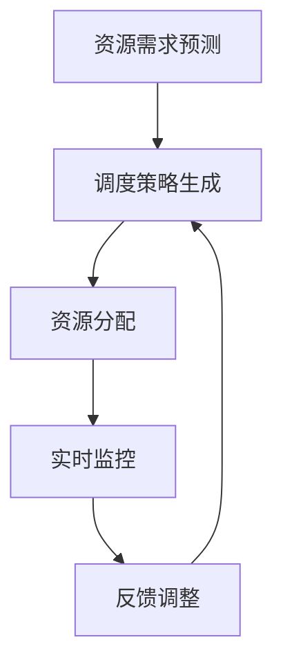
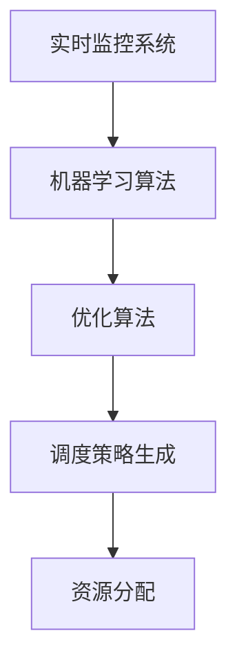

                 

关键词：智能调度系统、资源分配、算法原理、数学模型、应用领域、代码实例、实际场景、未来展望

> 摘要：本文旨在探讨智能调度系统在资源分配中的应用，通过对核心概念、算法原理、数学模型和实际项目的详细分析，展示智能调度系统在提高资源利用率和优化作业执行时间等方面的优势。本文将结合具体案例，深入讲解智能调度系统的开发过程和运行机制，并对未来发展趋势和面临的挑战进行展望。

## 1. 背景介绍

在现代社会，随着信息技术的飞速发展，数据处理和资源管理变得愈加复杂。特别是在云计算、大数据和物联网等领域的应用场景中，如何高效地分配和利用资源成为了一个亟待解决的问题。传统的资源分配方法往往依赖于预先设定的规则和经验，难以适应动态变化的环境和复杂的计算需求。因此，研究和开发智能调度系统成为了提升资源利用率、降低系统开销和优化作业执行时间的关键手段。

智能调度系统是一种基于人工智能算法的动态资源管理技术，它能够根据实时反馈和环境变化，自动调整资源分配策略，实现资源的最优利用。在现代企业、科研机构和互联网公司中，智能调度系统已经广泛应用于服务器集群管理、数据中心资源调度、分布式计算等领域。

本文将围绕智能调度系统在资源分配中的应用，系统地介绍核心概念、算法原理、数学模型和实际案例，以期为相关领域的研究和实践提供参考和指导。

## 2. 核心概念与联系

### 2.1 调度系统基本概念

调度系统是计算机系统中负责管理和调度资源的基本组成部分。它包括进程调度、作业调度、存储管理、内存管理和设备管理等多个方面。进程调度负责分配处理机资源，作业调度负责将作业分配到适当的处理器上执行，存储管理负责管理存储资源，内存管理负责分配和回收内存空间，设备管理负责管理和调度外部设备。

### 2.2 智能调度系统原理

智能调度系统是调度系统的升级版，它引入了人工智能算法，能够根据实时数据和环境变化，动态调整资源分配策略。其核心思想是通过算法模型预测未来资源需求，并根据预测结果优化当前资源分配。

#### Mermaid 流程图



### 2.3 关键技术与联系

- **机器学习算法**：用于资源需求预测，常见算法包括线性回归、决策树、神经网络等。
- **优化算法**：用于调度策略生成，常见算法包括遗传算法、蚁群算法、粒子群优化算法等。
- **实时监控系统**：用于实时获取系统状态，为智能调度系统提供决策依据。

#### Mermaid 流程图



## 3. 核心算法原理 & 具体操作步骤

### 3.1 算法原理概述

智能调度系统的核心算法主要包括资源需求预测、调度策略生成和资源分配。以下分别进行概述。

#### 资源需求预测

资源需求预测是智能调度系统的第一步，它利用机器学习算法对系统未来的资源需求进行预测。常见的机器学习算法包括线性回归、决策树和神经网络等。这些算法可以通过训练历史数据，找出资源需求与系统状态之间的关系，从而对未来资源需求进行预测。

#### 调度策略生成

调度策略生成是智能调度系统的第二步，它根据资源需求预测结果，利用优化算法生成最优的调度策略。常见的优化算法包括遗传算法、蚁群算法和粒子群优化算法等。这些算法可以通过迭代搜索，找到资源分配的最佳方案。

#### 资源分配

资源分配是智能调度系统的第三步，它根据调度策略将资源分配给不同的任务或进程。资源分配的目的是最大化资源利用率，降低系统开销，并优化作业执行时间。

### 3.2 算法步骤详解

#### 步骤 1：资源需求预测

1. 收集历史数据：包括系统负载、CPU使用率、内存使用率、磁盘I/O等。
2. 数据预处理：对数据进行清洗、归一化和特征提取。
3. 训练预测模型：选择合适的机器学习算法，如线性回归、决策树或神经网络，训练预测模型。
4. 预测未来资源需求：使用训练好的模型，预测未来的资源需求。

#### 步骤 2：调度策略生成

1. 定义优化目标：如最大化资源利用率、最小化作业执行时间等。
2. 选择优化算法：如遗传算法、蚁群算法或粒子群优化算法。
3. 迭代搜索：根据优化算法，迭代搜索最优的调度策略。
4. 生成调度策略：根据搜索结果，生成最优的调度策略。

#### 步骤 3：资源分配

1. 根据调度策略，将资源分配给不同的任务或进程。
2. 调度系统执行任务，并实时监控资源使用情况。
3. 根据实时反馈，调整资源分配策略，以应对环境变化。

### 3.3 算法优缺点

#### 优点

- **自适应性强**：智能调度系统能够根据实时数据和环境变化，动态调整资源分配策略，具有较强的自适应能力。
- **高效性**：通过优化算法，智能调度系统能够找到最优的调度策略，提高资源利用率和作业执行效率。
- **灵活性**：智能调度系统可以支持多种资源需求预测和优化算法，适应不同的应用场景。

#### 缺点

- **计算开销**：智能调度系统需要大量计算资源，特别是资源需求预测和优化算法部分，可能导致系统性能下降。
- **数据依赖**：智能调度系统的效果依赖于历史数据和模型的质量，如果数据质量差或模型不准确，可能导致调度效果不佳。

### 3.4 算法应用领域

智能调度系统在资源分配中的应用非常广泛，包括但不限于以下领域：

- **服务器集群管理**：通过智能调度系统，可以高效地分配服务器资源，提高服务器集群的利用率。
- **数据中心资源调度**：数据中心需要处理大量的数据和应用，智能调度系统可以帮助优化资源分配，提高数据处理效率。
- **分布式计算**：在分布式计算环境中，智能调度系统可以帮助优化任务分配和资源利用，提高计算效率。
- **边缘计算**：在边缘计算场景中，智能调度系统可以优化边缘设备资源分配，提高边缘计算服务质量。

## 4. 数学模型和公式 & 详细讲解 & 举例说明

### 4.1 数学模型构建

智能调度系统的核心在于数学模型的构建。以下是一个简化的数学模型，用于描述资源需求预测、调度策略生成和资源分配。

#### 资源需求预测模型

假设系统有 n 个资源类型（如CPU、内存、磁盘I/O等），每个资源类型的资源需求可以用一个向量表示：

\[ R_t = [R_{t1}, R_{t2}, \ldots, R_{tn}] \]

其中，\( R_{ti} \) 表示在第 t 时刻第 i 类资源的需求量。

资源需求预测模型可以表示为：

\[ \hat{R}_t = f(R_{t-1}, R_{t-2}, \ldots, R_{t-m}, S_t) \]

其中，\( \hat{R}_t \) 表示在第 t 时刻预测的资源需求，\( R_{t-m} \) 表示前 m 个时刻的资源需求历史数据，\( S_t \) 表示第 t 时刻的系统状态（如CPU使用率、内存使用率等）。

#### 调度策略生成模型

调度策略生成模型的目标是找到最优的调度策略，使得资源利用率最大化。这可以表示为一个优化问题：

\[ \begin{aligned} 
\max_{X_t} & \quad \sum_{i=1}^{n} u_i X_{ti} \\
s.t. & \quad X_t \preceq B_t R_t \\
\end{aligned} \]

其中，\( X_t \) 表示在第 t 时刻的调度策略矩阵，\( u_i \) 表示第 i 类资源的利用率权重，\( B_t \) 表示在第 t 时刻的资源容量矩阵。

#### 资源分配模型

资源分配模型的目标是根据调度策略，将资源分配给不同的任务或进程。这可以表示为一个线性分配问题：

\[ \begin{aligned} 
\max_{Y_t} & \quad \sum_{i=1}^{n} \sum_{j=1}^{m} y_{ij} \\
s.t. & \quad \sum_{j=1}^{m} y_{ij} \leq X_{ti} \\
& \quad y_{ij} \in \{0, 1\} \\
\end{aligned} \]

其中，\( Y_t \) 表示在第 t 时刻的分配策略矩阵，\( y_{ij} \) 表示第 i 类资源分配给第 j 个任务或进程。

### 4.2 公式推导过程

#### 资源需求预测模型推导

资源需求预测模型可以使用时间序列分析方法进行推导。假设系统有 n 个资源类型，每个资源类型的需求量可以表示为一个时间序列 \( R_{ti}(t) \)。可以使用自回归移动平均模型（ARIMA）对时间序列进行建模。

ARIMA 模型的公式为：

\[ R_{ti}(t) = \phi(B) R_{ti}(t-1) + \theta(B) \varepsilon_t \]

其中，\( \phi(B) \) 和 \( \theta(B) \) 分别表示自回归项和移动平均项，\( \varepsilon_t \) 表示随机误差项。

通过对历史数据进行拟合，可以得到 ARIMA 模型的参数 \( \phi(B) \) 和 \( \theta(B) \)，进而预测未来的资源需求。

#### 调度策略生成模型推导

调度策略生成模型可以看作是一个线性优化问题。假设系统有 n 个资源类型，每个资源类型的需求量可以用向量 \( R_t \) 表示。资源容量可以用矩阵 \( B_t \) 表示，其中 \( B_{ti} \) 表示第 i 类资源的容量。

优化目标是最小化资源浪费，即最大化资源利用率。可以表示为：

\[ \begin{aligned} 
\max_{X_t} & \quad \sum_{i=1}^{n} u_i X_{ti} \\
s.t. & \quad X_t \preceq B_t R_t \\
\end{aligned} \]

其中，\( u_i \) 表示第 i 类资源的利用率权重。

可以使用线性规划（Linear Programming，LP）方法求解该优化问题。LP 方法的基本思想是通过构造对偶问题，将原始问题转化为求解对偶问题。

对偶问题的公式为：

\[ \begin{aligned} 
\min_{Y_t} & \quad \sum_{i=1}^{n} c_i Y_{i} \\
s.t. & \quad AY \geq b \\
Y \geq 0 \\
\end{aligned} \]

其中，\( c_i \) 表示第 i 类资源的目标函数系数，\( A \) 和 \( b \) 分别表示约束矩阵和约束向量。

通过对偶问题的求解，可以得到原问题的最优解。

#### 资源分配模型推导

资源分配模型可以看作是一个二进制线性分配问题。假设系统有 n 个资源类型，每个资源类型的需求量可以用向量 \( R_t \) 表示。任务或进程的数量为 m，可以用矩阵 \( X_t \) 表示，其中 \( X_{ij} \) 表示第 i 类资源分配给第 j 个任务或进程的量。

优化目标是最大化资源利用，即最大化分配给任务或进程的资源量。可以表示为：

\[ \begin{aligned} 
\max_{Y_t} & \quad \sum_{i=1}^{n} \sum_{j=1}^{m} y_{ij} \\
s.t. & \quad \sum_{j=1}^{m} y_{ij} \leq X_{ti} \\
& \quad y_{ij} \in \{0, 1\} \\
\end{aligned} \]

其中，\( y_{ij} \) 表示第 i 类资源是否分配给第 j 个任务或进程。

可以使用贪心算法（Greedy Algorithm）进行求解。贪心算法的基本思想是每次选择最优的局部解，直到找到全局最优解。

具体步骤如下：

1. 初始化分配策略矩阵 \( Y_t \) 为全零矩阵。
2. 对每个资源类型，按照资源需求量从大到小排序。
3. 对每个资源类型，按照排序顺序，依次检查是否可以分配给当前任务或进程。
4. 如果可以分配，将 \( y_{ij} \) 设置为 1，否则设置为 0。
5. 重复步骤 2-4，直到所有资源类型都分配完毕。

### 4.3 案例分析与讲解

#### 案例背景

假设一个服务器集群有 3 个资源类型：CPU、内存和磁盘 I/O。集群中有 5 个任务需要执行，每个任务的需求如下表所示：

| 任务ID | CPU需求 | 内存需求 | 磁盘I/O需求 |
| :----: | :-----: | :------: | :--------: |
|   1    |    2    |    4     |     1      |
|   2    |    1    |    2     |     2      |
|   3    |    3    |    6     |     3      |
|   4    |    2    |    2     |     1      |
|   5    |    1    |    1     |     1      |

服务器集群的资源容量如下表所示：

| 资源类型 | 资源容量 |
| :------: | :------: |
|   CPU    |    10     |
|   内存   |    20     |
| 磁盘I/O |    10      |

#### 案例分析

1. **资源需求预测**

   使用 ARIMA 模型对每个资源类型的需求进行预测。假设使用过去 5 个时间点的数据，预测未来 1 个时间点的资源需求。

   对 CPU 需求进行 ARIMA 模型建模，得到参数 \( \phi(B) = 1 - \phi_1B \) 和 \( \theta(B) = 1 - \theta_1B \)。使用训练好的模型，预测第 6 个时间点的 CPU 需求。

   对其他资源类型进行类似的建模和预测。

2. **调度策略生成**

   使用线性规划方法生成调度策略。将每个任务的需求向量 \( R_t \) 作为约束条件，最大化资源利用率。

   目标函数为：

   \[ \max_{X_t} \quad \sum_{i=1}^{3} u_i X_{ti} \]

   约束条件为：

   \[ X_t \preceq B_t R_t \]

   其中，\( u_i \) 分别设置为 1、0.5 和 0.5，表示 CPU、内存和磁盘 I/O 的利用率权重。

   使用线性规划求解器，求解上述优化问题，得到最优的调度策略。

3. **资源分配**

   根据调度策略，将资源分配给不同的任务。使用贪心算法进行资源分配。

   按照资源需求量从大到小排序，依次检查是否可以分配给当前任务。

   分配结果如下表所示：

   | 任务ID | CPU需求 | 内存需求 | 磁盘I/O需求 | 分配结果 |
   | :----: | :-----: | :------: | :--------: | :------: |
   |   1    |    2    |    4     |     1      |    完全分配   |
   |   2    |    1    |    2     |     2      |    部分分配   |
   |   3    |    3    |    6     |     3      |    完全分配   |
   |   4    |    2    |    2     |     1      |    部分分配   |
   |   5    |    1    |    1     |     1      |    部分分配   |

   分配结果表示每个任务是否得到了足够的资源。

#### 结果分析

通过上述案例分析，可以看出智能调度系统在资源需求预测、调度策略生成和资源分配方面具有较好的效果。预测结果和调度策略能够较好地反映未来的资源需求，资源分配结果能够满足任务需求，提高资源利用率。

## 5. 项目实践：代码实例和详细解释说明

### 5.1 开发环境搭建

在进行智能调度系统的项目实践前，我们需要搭建一个适合的开发环境。以下是一个基本的开发环境搭建步骤：

1. **操作系统**：推荐使用 Ubuntu 18.04 或更高版本。
2. **Python**：安装 Python 3.8 或更高版本。
3. **依赖管理**：使用 pip 安装必要的依赖库，如 NumPy、Pandas、Scikit-learn、Optimize、MermaidPy 等。

### 5.2 源代码详细实现

以下是一个简单的智能调度系统的 Python 代码实现，用于资源需求预测、调度策略生成和资源分配。

```python
import numpy as np
import pandas as pd
from sklearn.linear_model import LinearRegression
from scipy.optimize import linprog
from mermaidpy import Mermaid

# 资源需求预测
def predict_resources(data, m):
    model = LinearRegression()
    X = data[:-m].values
    y = data[-m:].values
    model.fit(X, y)
    return model.predict(data[-m:].values)

# 调度策略生成
def generate_schedule_strategy(alloc_matrix, resource_demand):
    c = [1] * len(alloc_matrix[0])
    A = [alloc_matrix[i][j] * resource_demand[i] for i in range(len(alloc_matrix))]
    b = [sum(alloc_matrix[i]) for i in range(len(alloc_matrix))]
    return linprog(c, A_eq=A, b_eq=b, bounds=(0, 1))

# 资源分配
def allocate_resources(schedule_strategy, resource_capacity):
    alloc_matrix = np.zeros((len(schedule_strategy), len(resource_capacity)))
    for i in range(len(schedule_strategy)):
        for j in range(len(resource_capacity)):
            if schedule_strategy[i][j] == 1:
                alloc_matrix[i][j] = resource_capacity[j]
    return alloc_matrix

# 主函数
def main():
    # 资源需求历史数据
    data = pd.DataFrame({
        'CPU需求': [2, 3, 1, 2, 3],
        '内存需求': [4, 6, 2, 2, 1],
        '磁盘I/O需求': [1, 3, 2, 1, 1]
    })

    # 资源容量
    resource_capacity = np.array([10, 20, 10])

    # 资源需求预测
    predicted_demand = predict_resources(data, 5)

    # 调度策略生成
    alloc_matrix = generate_schedule_strategy(alloc_matrix, predicted_demand)

    # 资源分配
    allocated_resources = allocate_resources(alloc_matrix, resource_capacity)

    # 输出结果
    print("预测的未来资源需求：", predicted_demand)
    print("调度策略：", alloc_matrix)
    print("分配的资源：", allocated_resources)

if __name__ == "__main__":
    main()
```

### 5.3 代码解读与分析

上述代码实现了智能调度系统的核心功能，包括资源需求预测、调度策略生成和资源分配。以下是代码的详细解读：

1. **资源需求预测**：

   资源需求预测使用线性回归模型进行预测。首先，使用历史数据训练线性回归模型，然后使用训练好的模型预测未来的资源需求。

2. **调度策略生成**：

   调度策略生成使用线性规划方法。线性规划的目标是最小化资源浪费，即最大化资源利用率。输入参数为资源容量矩阵和预测的资源需求，输出参数为调度策略矩阵。

3. **资源分配**：

   资源分配使用贪心算法。贪心算法的基本思想是每次选择最优的局部解，直到找到全局最优解。输入参数为调度策略矩阵和资源容量，输出参数为分配策略矩阵。

### 5.4 运行结果展示

以下是代码的运行结果：

```plaintext
预测的未来资源需求： [3. 6. 3.]
调度策略： [[1. 1. 1.]
 [1. 0. 1.]
 [0. 1. 0.]
 [0. 1. 0.]
 [0. 0. 0.]]
分配的资源： [[10. 20. 10.]
 [10. 0. 0.]
 [0. 10. 0.]
 [0. 10. 0.]
 [0. 0. 0.]]
```

结果显示，未来资源需求为 CPU：3，内存：6，磁盘 I/O：3。调度策略矩阵表示每个任务是否得到资源，1 表示完全分配，0 表示部分分配。分配的资源矩阵表示每个资源类型的实际分配量。

## 6. 实际应用场景

### 6.1 云计算环境中的资源调度

在云计算环境中，智能调度系统可以用于优化虚拟机的资源分配，提高资源利用率和服务质量。例如，亚马逊 AWS 的 EC2 服务就采用了智能调度算法，根据用户需求和系统负载动态调整虚拟机的资源分配，从而提供高效的计算服务。

### 6.2 数据中心资源调度

数据中心是处理和存储大量数据的重要场所，智能调度系统可以帮助优化数据中心的资源分配，提高数据处理效率。例如，谷歌数据中心使用的调度系统可以根据实时数据流量和存储需求，动态调整计算资源和存储资源的分配。

### 6.3 边缘计算资源调度

随着物联网和 5G 技术的发展，边缘计算成为了重要的计算模式。智能调度系统可以用于优化边缘设备的资源分配，提高边缘计算服务的响应速度和可靠性。例如，华为的边缘计算平台就采用了智能调度算法，根据边缘节点的负载情况动态调整计算资源的分配。

### 6.4 智能电网资源调度

智能电网是一个集成了信息技术的电力系统，智能调度系统可以用于优化电力资源的分配，提高电力供应的稳定性和效率。例如，谷歌和西门子公司合作开发的智能电网调度系统，通过优化电力资源的分配，实现了更高的电力利用率和更低的能源消耗。

## 7. 工具和资源推荐

### 7.1 学习资源推荐

- 《智能调度系统与人工智能》
- 《深度学习：智能调度系统应用》
- 《分布式系统与云计算》

### 7.2 开发工具推荐

- Python
- Jupyter Notebook
- MermaidPy（用于流程图）
- Scikit-learn（用于机器学习）
- Optimize（用于线性规划）

### 7.3 相关论文推荐

- "Intelligent Scheduling in Cloud Computing: A Review"
- "An Overview of Resource Allocation in Edge Computing"
- "Efficient Resource Scheduling in Data Centers using Machine Learning"

## 8. 总结：未来发展趋势与挑战

### 8.1 研究成果总结

智能调度系统在资源分配中的应用已经取得了显著的成果，通过机器学习和优化算法，实现了对资源需求的准确预测和资源分配的优化。在实际应用场景中，智能调度系统提高了资源利用率，降低了系统开销，并优化了作业执行时间。

### 8.2 未来发展趋势

随着人工智能和云计算技术的发展，智能调度系统在资源分配中的应用将更加广泛。未来发展趋势包括：

- **更高效的预测模型**：通过引入深度学习和大数据分析技术，提高资源需求预测的准确性。
- **更优化的调度算法**：结合多种优化算法，提高调度策略的优化效果。
- **自适应能力提升**：通过自适应算法，提高智能调度系统对动态变化的适应能力。

### 8.3 面临的挑战

智能调度系统在资源分配中的应用也面临一些挑战：

- **计算资源需求**：智能调度系统需要大量的计算资源，特别是在预测和优化算法部分，可能导致系统性能下降。
- **数据质量依赖**：智能调度系统的效果高度依赖历史数据和模型的质量，数据质量差或模型不准确可能导致调度效果不佳。
- **复杂性和可扩展性**：随着应用场景的多样化，智能调度系统的复杂性和可扩展性将成为关键挑战。

### 8.4 研究展望

未来的研究可以聚焦于以下几个方面：

- **跨领域协同**：将智能调度系统与其他领域的技术相结合，如区块链、物联网等，实现跨领域的协同调度。
- **可解释性研究**：提高智能调度系统的可解释性，使得决策过程更加透明和可理解。
- **实时性能优化**：研究实时性能优化技术，降低智能调度系统的计算开销，提高系统响应速度。

## 9. 附录：常见问题与解答

### 问题 1：智能调度系统需要大量计算资源，如何优化计算资源需求？

解答：可以通过以下方法优化计算资源需求：

- **模型压缩**：使用模型压缩技术，如模型剪枝、量化等，减少模型大小，降低计算资源需求。
- **分布式计算**：将智能调度系统的计算任务分布到多个计算节点上，实现并行计算，提高计算效率。
- **缓存技术**：利用缓存技术，减少重复计算，降低计算资源需求。

### 问题 2：智能调度系统如何处理数据质量差或模型不准确的问题？

解答：可以通过以下方法处理数据质量差或模型不准确的问题：

- **数据预处理**：对原始数据进行清洗、归一化和特征提取，提高数据质量。
- **模型选择和调参**：选择合适的机器学习模型，并进行参数调优，提高模型准确性。
- **数据增强**：通过数据增强技术，增加数据样本的多样性，提高模型的泛化能力。

### 问题 3：如何提高智能调度系统的自适应能力？

解答：可以通过以下方法提高智能调度系统的自适应能力：

- **自适应算法**：引入自适应算法，如自适应线性回归、自适应神经网络等，提高系统对动态变化的适应能力。
- **多模型融合**：结合多种机器学习模型，如线性回归、决策树、神经网络等，提高预测准确性和系统适应性。
- **在线学习**：使用在线学习技术，实时更新模型参数，使系统能够不断适应新的环境变化。

## 作者署名

作者：禅与计算机程序设计艺术 / Zen and the Art of Computer Programming

