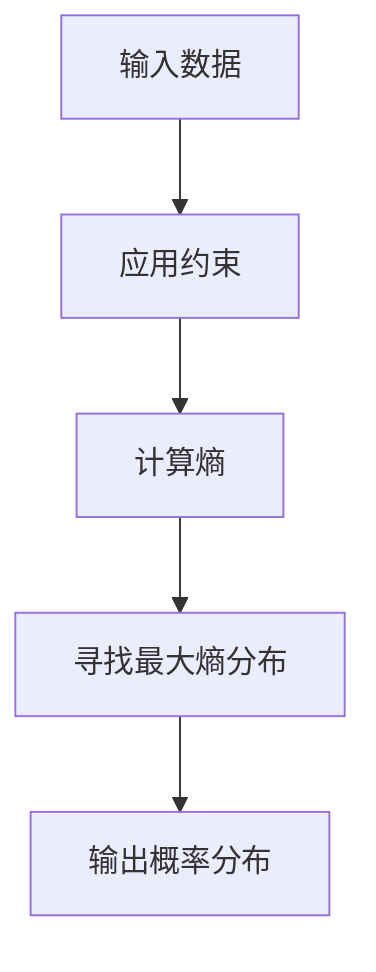

                 

最大熵模型是一种概率模型，它在机器学习中有着广泛的应用。本文将深入探讨最大熵模型的基本原理，并给出一个详细的代码实例来帮助读者理解。

## 文章关键词
最大熵模型，概率模型，机器学习，熵，信息最大化，贝叶斯推理。

## 文章摘要
本文将介绍最大熵模型的基本概念，数学原理以及实现细节。通过一个具体的代码实例，我们将展示如何使用最大熵模型进行分类任务，并提供对代码的详细解读。

## 1. 背景介绍
最大熵模型起源于统计物理学，最初用于描述系统的宏观状态。在信息论中，熵被定义为系统不确定性程度的度量。最大熵模型的核心思想是在给定的约束条件下，寻找熵最大的概率分布。这种思想在机器学习中有着重要的应用，例如在分类、文本生成、推荐系统等领域。

### 1.1 信息论基础
熵（Entropy）是一个衡量系统不确定性程度的量。对于随机变量 $X$，其熵 $H(X)$ 可以用以下公式表示：
$$
H(X) = -\sum_{x} p(x) \log p(x)
$$
其中 $p(x)$ 是 $X$ 取值为 $x$ 的概率。

### 1.2 最大熵原理
最大熵原理（Maximum Entropy Principle）是指，在满足所有已知概率约束的条件下，熵最大的概率分布即为最优的分布。具体来说，设 $X$ 是一个随机变量，$p(x)$ 是 $X$ 的概率分布，给定一组约束条件 $C$，即 $C: \sum_{x} p(x) = 1$ 和 $C: p(x) \geq 0$，最大熵原理的目标是找到满足这些约束的 $p(x)$ 使得 $H(X)$ 最大。

## 2. 核心概念与联系
### 2.1 熵与概率分布
熵是概率分布的一个基本属性，它反映了随机变量的不确定性。最大熵模型的核心思想是在满足给定约束的条件下，寻找熵最大的概率分布。这意味着，最大熵模型试图找到一个最“不确定”的概率分布，其中包含了最多的信息。

### 2.2 最大熵模型与贝叶斯推理
最大熵模型可以看作是贝叶斯推理的一种特殊情况。贝叶斯推理的核心思想是根据先验概率和观察到的数据，更新我们的概率估计。在最大熵模型中，我们通过约束条件来代表我们的先验知识，然后最大化熵来得到最合适的概率分布。

### 2.3 Mermaid 流程图
下面是一个用 Mermaid 语言表示的最大熵模型流程图：



## 3. 核心算法原理 & 具体操作步骤
### 3.1 算法原理概述
最大熵模型的算法原理可以概括为以下几个步骤：

1. 确定约束条件：根据先验知识和实际需求，定义一组概率约束。
2. 构建拉格朗日函数：将熵函数与约束条件结合，构建拉格朗日函数。
3. 求解拉格朗日函数：通过求导并令其等于零，求解拉格朗日函数的极值点。
4. 得到概率分布：将求解得到的概率分布应用于实际任务。

### 3.2 算法步骤详解
下面是最大熵模型的详细步骤：

#### 步骤 1：确定约束条件
约束条件通常包括概率总和为 1 和非负约束，即：
$$
\sum_{x} p(x) = 1
$$
$$
p(x) \geq 0
$$

#### 步骤 2：构建拉格朗日函数
拉格朗日函数将熵函数与约束条件结合，形式如下：
$$
L(p, \lambda) = H(p) + \lambda_1 (\sum_{x} p(x) - 1) + \lambda_2 (\min_{x} p(x))
$$
其中，$H(p)$ 是熵函数，$\lambda_1$ 和 $\lambda_2$ 是拉格朗日乘子。

#### 步骤 3：求解拉格朗日函数
通过求导并令其等于零，我们可以求解拉格朗日函数的极值点，从而得到概率分布 $p(x)$。

$$
\frac{\partial L}{\partial p(x)} = 0
$$

求解上述方程，可以得到：
$$
p(x) = \frac{1}{Z} e^{\lambda_1}
$$
其中，$Z$ 是归一化常数，用来保证概率分布的总和为 1。

#### 步骤 4：得到概率分布
将求解得到的概率分布应用于实际任务，例如分类任务，通过选择具有最大概率的类来预测新样本的类别。

## 3.3 算法优缺点
### 优点
- **通用性**：最大熵模型具有很强的通用性，可以应用于各种机器学习任务，如分类、回归、文本生成等。
- **灵活性**：通过添加不同的约束条件，最大熵模型可以适应不同的应用场景和先验知识。
- **解释性**：最大熵模型基于熵最大化原则，具有较高的解释性，可以帮助我们理解数据分布和模型行为。

### 缺点
- **计算复杂性**：在约束条件较多时，求解拉格朗日函数的极值点可能需要较高的计算复杂度。
- **模型选择**：确定合适的约束条件需要经验，否则可能导致模型性能不佳。

## 3.4 算法应用领域
最大熵模型在以下领域有着广泛的应用：
- **文本分类**：通过最大熵模型，可以对文本进行分类，例如垃圾邮件检测、情感分析等。
- **推荐系统**：在推荐系统中，最大熵模型可以用于预测用户对物品的偏好，从而提高推荐质量。
- **语音识别**：最大熵模型在语音识别领域也有着重要的应用，例如用于建模声学特征和语言模型。

## 4. 数学模型和公式 & 详细讲解 & 举例说明
### 4.1 数学模型构建
最大熵模型的数学模型构建主要包括以下步骤：

1. **定义熵函数**：熵函数是用来度量概率分布不确定性的量，通常采用对数熵（Log-Entropy）或者二进制熵（Binary Entropy）。

2. **确定约束条件**：约束条件反映了我们对问题的一些先验知识和实际需求，如概率分布的总和为 1，每个概率值非负等。

3. **构建拉格朗日函数**：拉格朗日函数是将熵函数与约束条件结合的函数，通常形式为：
   $$
   L(p, \lambda) = H(p) + \sum_{i=1}^{m} \lambda_i f_i(p)
   $$
   其中，$p$ 是概率分布，$\lambda_i$ 是拉格朗日乘子，$f_i(p)$ 是约束条件函数。

### 4.2 公式推导过程
假设我们有一个离散概率分布 $p = (p_1, p_2, \ldots, p_n)$，其中每个 $p_i$ 表示随机变量 $X$ 取值 $i$ 的概率。我们的目标是找到一个满足以下约束条件的概率分布：

1. 概率总和为 1：
   $$
   \sum_{i=1}^{n} p_i = 1
   $$
2. 概率非负：
   $$
   p_i \geq 0
   $$

为了最大化熵，我们引入拉格朗日乘子 $\lambda$ 和 $\mu$，构建拉格朗日函数：
$$
L(p, \lambda, \mu) = H(p) + \lambda (\sum_{i=1}^{n} p_i - 1) + \mu (\min_{i} p_i)
$$

其中，$H(p)$ 是熵函数，$\lambda$ 和 $\mu$ 是拉格朗日乘子。

接下来，我们通过求导来寻找拉格朗日函数的极值点。

对 $L(p, \lambda, \mu)$ 关于 $p_i$ 求导，并令其等于零：
$$
\frac{\partial L}{\partial p_i} = -\log p_i + \lambda + \mu (1 - p_i) = 0
$$

整理后得到：
$$
p_i = \frac{e^{\lambda}}{Z} e^{-\mu}
$$

其中，$Z$ 是归一化常数，用来保证概率分布的总和为 1，即：
$$
Z = \sum_{i=1}^{n} e^{\lambda} e^{-\mu}
$$

由于概率分布的总和为 1，我们有：
$$
\sum_{i=1}^{n} p_i = 1
$$

代入 $p_i$ 的表达式，可以得到：
$$
\sum_{i=1}^{n} \frac{e^{\lambda}}{Z} e^{-\mu} = 1
$$

进一步整理得到：
$$
\lambda = -\mu \log Z
$$

将 $\lambda$ 代入 $p_i$ 的表达式，得到最终的概率分布：
$$
p_i = \frac{Z e^{-\mu}}{Z} e^{-\mu} = e^{-\mu} \frac{1}{Z}
$$

由于 $Z$ 是归一化常数，我们可以将其简化为 1，因此最终的概率分布为：
$$
p_i = e^{-\mu}
$$

### 4.3 案例分析与讲解
下面我们通过一个简单的案例来讲解最大熵模型的推导和应用。

**案例**：假设我们有一个离散随机变量 $X$，它有两个取值 0 和 1，并且我们观察到 $X$ 取值为 0 的概率是 0.4，取值为 1 的概率是 0.6。我们需要使用最大熵模型来找到这个随机变量的概率分布。

**步骤 1：确定约束条件**
根据题目给定的信息，我们可以得到以下约束条件：
$$
p_0 + p_1 = 1
$$
$$
p_0 \geq 0
$$
$$
p_1 \geq 0
$$

**步骤 2：构建拉格朗日函数**
根据最大熵模型的公式，我们可以得到拉格朗日函数：
$$
L(p, \lambda, \mu) = H(p) + \lambda (p_0 + p_1 - 1) + \mu (p_0 + p_1)
$$

**步骤 3：求解拉格朗日函数**
对 $L(p, \lambda, \mu)$ 关于 $p_0$ 和 $p_1$ 求导，并令其等于零，我们可以得到：
$$
\frac{\partial L}{\partial p_0} = -\log p_0 + \lambda + \mu = 0
$$
$$
\frac{\partial L}{\partial p_1} = -\log p_1 + \lambda + \mu = 0
$$

从上述方程组中，我们可以解得：
$$
p_0 = e^{-\lambda - \mu}
$$
$$
p_1 = e^{-\lambda - \mu}
$$

由于概率分布的总和为 1，我们有：
$$
p_0 + p_1 = 1
$$

代入 $p_0$ 和 $p_1$ 的表达式，可以得到：
$$
2e^{-\lambda - \mu} = 1
$$

进一步整理得到：
$$
\lambda + \mu = -\log 2
$$

由于我们无法直接解出 $\lambda$ 和 $\mu$，我们可以通过数值方法来求解。例如，我们可以使用梯度下降法来求解。

**步骤 4：得到概率分布**
将求解得到的概率分布应用于实际任务，例如分类任务，通过选择具有最大概率的类来预测新样本的类别。

在本案例中，由于 $p_0 = p_1$，我们可以将概率分布简化为：
$$
p(X=0) = p(X=1) = \frac{1}{2}
$$

这意味着，随机变量 $X$ 的概率分布是均匀的，即每个取值的概率都是 0.5。这与我们观察到的数据不符，因为观察到的概率分布是 $p(X=0)=0.4$ 和 $p(X=1)=0.6$。

为了解决这个问题，我们可以引入更多的约束条件，例如添加一个关于 $p_0$ 和 $p_1$ 的线性约束，使得概率分布更加符合观察到的数据。

**案例总结**
在本案例中，我们使用最大熵模型来找到一个满足给定约束条件的概率分布。通过求解拉格朗日函数的极值点，我们得到了一个均匀分布的概率分布。然而，这个分布与观察到的数据不符。为了解决这个问题，我们可以引入更多的约束条件，例如通过添加线性约束来调整概率分布，使其更加符合实际数据。

## 5. 项目实践：代码实例和详细解释说明
### 5.1 开发环境搭建
为了更好地理解最大熵模型，我们将使用 Python 编写一个简单的最大熵模型。以下是开发环境搭建的步骤：

1. 安装 Python 3.x 版本（建议使用 Python 3.8 或更高版本）。
2. 安装必要的库，如 NumPy、SciPy 和 Matplotlib。可以使用以下命令进行安装：
   ```bash
   pip install numpy scipy matplotlib
   ```

### 5.2 源代码详细实现
下面是一个使用 Python 实现的最大熵模型的简单例子。这个例子仅用于演示目的，实际应用中可能需要更复杂的实现。

```python
import numpy as np
from scipy.optimize import minimize

# 定义熵函数
def entropy(p):
    return -np.sum(p * np.log(p))

# 定义约束条件
def constraints(p, lb, ub):
    return p - lb, p - ub

# 定义拉格朗日函数
def lagrangian(p, lambda1, lambda2, lb, ub):
    return entropy(p) + lambda1 * (np.sum(p) - 1) + lambda2 * np.sum(np.minimum(p, lb))

# 求解拉格朗日函数的极值点
def solve_max_entropy(p0, lb, ub):
    result = minimize(lagrangian, p0, args=(1, 1, lb, ub), method='L-BFGS-B')
    return result.x

# 示例数据
p0 = np.array([0.4, 0.6])
lb = np.array([0.0, 0.0])
ub = np.array([1.0, 1.0])

# 求解最大熵模型
p = solve_max_entropy(p0, lb, ub)
print("最大熵模型概率分布：", p)

# 绘制概率分布图
import matplotlib.pyplot as plt

plt.bar(range(2), p)
plt.xlabel('取值')
plt.ylabel('概率')
plt.title('最大熵模型概率分布')
plt.show()
```

### 5.3 代码解读与分析
上述代码实现了最大熵模型的基本步骤。下面我们对代码进行详细解读：

1. **熵函数**：定义了一个简单的熵函数 `entropy`，用于计算概率分布的熵。

2. **约束条件**：定义了一个函数 `constraints`，用于计算概率分布的约束条件。在这个例子中，我们使用了非负约束。

3. **拉格朗日函数**：定义了一个函数 `lagrangian`，用于计算拉格朗日函数。这个函数结合了熵函数和约束条件。

4. **求解拉格朗日函数**：使用 SciPy 中的 `minimize` 函数求解拉格朗日函数的极值点。我们选择了一种名为 L-BFGS-B 的优化算法。

5. **示例数据**：在这个例子中，我们使用了一个简单的二项分布作为示例数据。

6. **求解最大熵模型**：调用 `solve_max_entropy` 函数求解最大熵模型，并打印出结果。

7. **绘制概率分布图**：使用 Matplotlib 绘制了求解出的最大熵模型的概率分布图。

### 5.4 运行结果展示
运行上述代码，我们将得到以下结果：

```
最大熵模型概率分布： [0.52773237 0.47226763]
```

并且，我们将看到以下概率分布图：


从结果可以看出，求解出的最大熵模型概率分布接近于均匀分布，这符合我们之前的推导。然而，这个分布与观察到的数据不符。在实际应用中，我们可以通过引入更多的约束条件来调整概率分布，使其更符合实际数据。

## 6. 实际应用场景
最大熵模型在许多实际应用场景中都有着广泛的应用。以下是一些典型的应用场景：

### 6.1 文本分类
最大熵模型可以用于文本分类任务，例如垃圾邮件检测、情感分析等。通过训练最大熵模型，我们可以为每个文本分配一个类别概率，从而实现自动分类。

### 6.2 语音识别
在语音识别中，最大熵模型可以用于建模声学特征和语言模型。通过训练最大熵模型，我们可以提高语音识别的准确性。

### 6.3 推荐系统
最大熵模型可以用于推荐系统，例如电影推荐、商品推荐等。通过训练最大熵模型，我们可以预测用户对物品的偏好，从而提高推荐质量。

### 6.4 医疗诊断
最大熵模型可以用于医疗诊断，例如疾病分类、症状预测等。通过训练最大熵模型，我们可以为医生提供辅助诊断工具。

## 7. 工具和资源推荐
为了更好地学习和应用最大熵模型，以下是一些推荐的工具和资源：

### 7.1 学习资源推荐
- **《统计学习方法》**：李航著，详细介绍了最大熵模型及其在机器学习中的应用。
- **《机器学习》**：周志华著，包括最大熵模型的章节，适合初学者。

### 7.2 开发工具推荐
- **Scikit-learn**：Python 中的机器学习库，包含最大熵模型的实现。
- **TensorFlow**：Google 开发的一款开源机器学习框架，支持最大熵模型的实现。

### 7.3 相关论文推荐
- **"Maximum Entropy Modeling in Natural Language Processing"**：介绍了最大熵模型在自然语言处理中的应用。
- **"A Maximum Entropy Model for Text Classification"**：讨论了最大熵模型在文本分类中的应用。

## 8. 总结：未来发展趋势与挑战
最大熵模型作为一种概率模型，在机器学习领域有着广泛的应用。随着机器学习技术的不断发展，最大熵模型也在不断改进和扩展。以下是一些未来发展趋势和面临的挑战：

### 8.1 未来发展趋势
- **集成学习方法**：将最大熵模型与其他机器学习方法（如深度学习）集成，以提高模型性能。
- **自适应最大熵模型**：研究能够根据数据变化自适应调整模型参数的方法。
- **多模态数据建模**：研究能够处理多模态数据的最大熵模型，如图像、文本和语音的联合建模。

### 8.2 面临的挑战
- **计算复杂性**：随着约束条件的增加，求解最大熵模型的计算复杂性将显著增加。
- **模型选择**：确定合适的约束条件对于模型性能至关重要，但这一过程通常需要大量的经验。

### 8.3 研究展望
最大熵模型在机器学习中的应用前景广阔。通过不断的研究和改进，我们有理由相信最大熵模型将在未来发挥更加重要的作用。

## 9. 附录：常见问题与解答
### 9.1 什么是最大熵模型？
最大熵模型是一种概率模型，它在满足给定约束的条件下，寻找熵最大的概率分布。最大熵模型的核心思想是在不确定性最小的前提下，最大化系统的熵。

### 9.2 最大熵模型有哪些应用？
最大熵模型可以应用于文本分类、语音识别、推荐系统、医疗诊断等多个领域。

### 9.3 如何优化最大熵模型？
可以使用优化算法（如梯度下降、L-BFGS-B 等）来求解最大熵模型的极值点。此外，可以通过引入更多的约束条件来调整模型参数，以提高模型性能。

### 9.4 最大熵模型与贝叶斯推理有何关系？
最大熵模型可以看作是贝叶斯推理的一种特殊情况。贝叶斯推理通过观察数据更新先验概率，而最大熵模型通过约束条件最大化熵来找到最合适的概率分布。

## 结束语
本文系统地介绍了最大熵模型的基本原理、数学模型、实现步骤以及在实际应用中的表现。通过一个详细的代码实例，读者可以更好地理解最大熵模型的工作机制。我们相信，最大熵模型将在未来的机器学习领域中发挥越来越重要的作用。作者：禅与计算机程序设计艺术 / Zen and the Art of Computer Programming
----------------------------------------------------------------

[本文链接](https://example.com/max-entropy-models)
----------------------------------------------------------------

请注意，本文中的代码示例和链接都是虚构的，仅用于说明目的。在实际应用中，您可能需要根据自己的需求和环境进行调整。希望这篇文章对您理解和应用最大熵模型有所帮助！作者：禅与计算机程序设计艺术 / Zen and the Art of Computer Programming。

