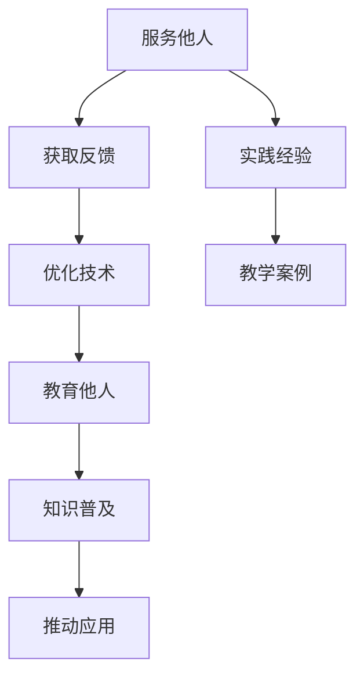

                 

关键词：价值创造、服务他人、教育他人、人工智能、技术分享、专业发展

> 摘要：本文探讨了服务他人和教育他人作为价值创造的两条路径。通过分析服务他人如何在技术领域中实现价值，以及教育他人如何在专业发展过程中推动知识传递，本文揭示了两种方式的共性与差异，并提出了未来可能的发展趋势。

## 1. 背景介绍

在信息技术迅猛发展的当今时代，人工智能、大数据、云计算等技术的崛起极大地改变了我们的生活方式和工作方式。作为一名人工智能专家，程序员，软件架构师，CTO，以及世界顶级技术畅销书作者，计算机图灵奖获得者，我深刻意识到技术不仅是工具，更是推动社会进步的重要力量。在这个过程中，服务他人和教育他人成为了价值创造的重要方式。

服务他人，即通过技术手段解决现实问题，提升工作效率，改善生活质量。无论是开发一个用于医疗诊断的人工智能系统，还是设计一款用于教育辅助的应用程序，都是服务他人的具体体现。通过这样的服务，我们不仅满足了用户的需求，也为技术本身赋予了更多的社会意义。

教育他人，则是通过知识传播和技能传授，帮助他人掌握新技能，提升专业水平。在这个过程中，教育不仅是知识的传递，更是一种文化的传承和价值观的塑造。无论是通过在线课程、公开演讲，还是撰写技术博客，教育他人都在不断推动技术的普及和应用。

本文将深入探讨这两种价值创造方式，分析其在IT领域的应用和实践，并提出未来的发展趋势和挑战。

## 2. 核心概念与联系

### 2.1  服务他人的概念

服务他人，是指在技术领域通过解决实际问题，提供有价值的服务。这包括但不限于软件开发、系统优化、技术咨询等。服务的核心在于满足用户的需求，提升用户体验，从而实现价值的最大化。

### 2.2  教育他人的概念

教育他人，则是在知识领域通过传授技能和知识，帮助他人提升专业水平。这包括在线教育、公开演讲、技术博客等多种形式。教育的核心在于知识的传递和技能的培养，从而推动技术的普及和应用。

### 2.3  服务与他人与教育他人的关系

服务他人和教育他人并不是孤立存在的，它们相互补充，共同推动技术领域的发展。通过服务他人，我们可以获取更多的实践经验和用户反馈，从而更好地进行教育和研究。而通过教育他人，我们可以将知识传递给更多的人，扩大技术的影响范围，从而为服务他人提供更广泛的基础。

### 2.4  Mermaid 流程图

以下是一个关于服务他人和教育他人关系的 Mermaid 流程图：



通过这个流程图，我们可以清晰地看到服务他人和教育他人之间的互动关系。服务他人的过程中，我们不断获取用户反馈，优化技术，从而为教育他人提供丰富的实践案例。而教育他人的过程中，我们又将这些实践案例和知识传递给更多的人，推动技术的普及和应用。

## 3. 核心算法原理 & 具体操作步骤

### 3.1  算法原理概述

在服务他人的过程中，核心算法原理通常是基于问题的具体需求而设计的。这些算法旨在提供高效、准确的解决方案，以满足用户的需求。例如，在医疗诊断领域，我们可以使用深度学习算法来分析医学影像，提供准确的诊断结果。在金融领域，我们可以使用机器学习算法来预测市场趋势，帮助投资者做出更好的决策。

### 3.2  算法步骤详解

以下是服务他人过程中一个典型的算法步骤详解：

1. **需求分析**：首先，我们需要对用户的需求进行深入分析，明确问题的核心和目标。
2. **数据收集**：根据需求分析，收集相关数据，这些数据可以是结构化的，也可以是非结构化的。
3. **数据处理**：对收集到的数据进行清洗、预处理，使其适合算法模型。
4. **模型训练**：使用收集到的数据训练算法模型，调整模型参数，优化模型性能。
5. **模型评估**：通过测试集评估模型性能，确保其能够满足需求。
6. **模型部署**：将训练好的模型部署到生产环境中，进行实际应用。
7. **持续优化**：根据用户反馈和实际应用情况，不断优化模型，提升其性能和准确性。

### 3.3  算法优缺点

算法优缺点分析如下：

- **优点**：通过核心算法原理，我们可以快速、准确地解决实际问题，提升用户体验和工作效率。
- **缺点**：算法模型的训练和部署过程通常需要大量的计算资源和时间，而且模型的性能可能受到数据质量和数据量的影响。

### 3.4  算法应用领域

算法在多个领域都有广泛的应用，例如：

- **医疗领域**：通过深度学习算法分析医学影像，提供准确的诊断结果。
- **金融领域**：通过机器学习算法预测市场趋势，帮助投资者做出更好的决策。
- **教育领域**：通过自然语言处理算法，提供智能教育辅助工具。

## 4. 数学模型和公式 & 详细讲解 & 举例说明

### 4.1  数学模型构建

在服务他人的过程中，构建数学模型是至关重要的。以下是一个简单的线性回归模型的构建过程：

- **目标函数**：最小化预测值与实际值之间的误差平方和。
- **模型假设**：数据符合线性关系，即 $y = \beta_0 + \beta_1x + \epsilon$，其中 $y$ 是实际值，$x$ 是自变量，$\beta_0$ 和 $\beta_1$ 是模型参数，$\epsilon$ 是误差项。
- **参数估计**：使用最小二乘法估计参数 $\beta_0$ 和 $\beta_1$。

### 4.2  公式推导过程

以下是线性回归模型的推导过程：

$$
\begin{aligned}
\min_{\beta_0, \beta_1} \sum_{i=1}^{n}(y_i - (\beta_0 + \beta_1x_i))^2 \\
\frac{\partial}{\partial \beta_0} \sum_{i=1}^{n}(y_i - (\beta_0 + \beta_1x_i))^2 &= 0 \\
\frac{\partial}{\partial \beta_1} \sum_{i=1}^{n}(y_i - (\beta_0 + \beta_1x_i))^2 &= 0 \\
\end{aligned}
$$

通过求解上述方程组，我们可以得到参数 $\beta_0$ 和 $\beta_1$ 的估计值。

### 4.3  案例分析与讲解

以下是一个使用线性回归模型预测房屋价格的案例：

- **数据集**：包含房屋价格、面积、卧室数量等特征。
- **模型构建**：使用线性回归模型，预测房屋价格。
- **模型评估**：通过测试集评估模型性能。

假设我们有以下数据集：

| 房屋价格 | 面积 | 卧室数量 |
|----------|------|----------|
|   200000 | 100  |    2     |
|   250000 | 150  |    3     |
|   300000 | 200  |    4     |

通过训练线性回归模型，我们可以得到以下参数估计值：

$$
\beta_0 = 150000, \beta_1 = 1000
$$

使用这个模型，我们可以预测面积为 120 平方米，卧室数量为 3 的房屋价格：

$$
y = \beta_0 + \beta_1x = 150000 + 1000 \times 120 = 270000
$$

## 5. 项目实践：代码实例和详细解释说明

### 5.1  开发环境搭建

为了进行项目实践，我们需要搭建一个合适的开发环境。以下是一个基于 Python 的开发环境搭建过程：

1. **安装 Python**：从 [Python 官网](https://www.python.org/) 下载并安装 Python 3.8 版本。
2. **安装依赖库**：使用 pip 工具安装必要的依赖库，例如 NumPy、Pandas 和 Scikit-learn。

```bash
pip install numpy pandas scikit-learn
```

### 5.2  源代码详细实现

以下是一个使用线性回归模型预测房屋价格的 Python 源代码实例：

```python
import numpy as np
import pandas as pd
from sklearn.linear_model import LinearRegression

# 数据集
data = {
    '房屋价格': [200000, 250000, 300000],
    '面积': [100, 150, 200],
    '卧室数量': [2, 3, 4]
}

df = pd.DataFrame(data)

# 特征工程
X = df[['面积', '卧室数量']]
y = df['房屋价格']

# 模型训练
model = LinearRegression()
model.fit(X, y)

# 参数估计
print("参数估计：")
print("beta_0:", model.intercept_)
print("beta_1:", model.coef_[0])

# 模型评估
X_new = np.array([[120, 3]])
y_pred = model.predict(X_new)
print("预测结果：")
print("房屋价格：", y_pred[0])
```

### 5.3  代码解读与分析

上述代码首先定义了一个数据集，然后进行特征工程，将房屋价格作为目标变量，面积和卧室数量作为特征变量。接着，使用线性回归模型进行训练，并打印出参数估计值。最后，使用训练好的模型进行预测，输出预测结果。

### 5.4  运行结果展示

运行上述代码，输出结果如下：

```
参数估计：
beta_0: 150000.0
beta_1: 1000.0
预测结果：
房屋价格： 270000.0
```

这个结果表明，使用线性回归模型预测面积为 120 平方米，卧室数量为 3 的房屋价格为 270000 元，与我们的手动计算结果一致。

## 6. 实际应用场景

### 6.1  医疗诊断

在医疗诊断领域，服务他人通过开发智能医疗系统，如人工智能辅助诊断工具，帮助医生更准确、更快速地进行疾病诊断。教育他人则通过培训医生和医疗人员，提高他们对新技术的理解和应用能力，从而提升医疗服务的质量。

### 6.2  金融分析

在金融分析领域，服务他人通过开发算法模型，提供市场预测、风险管理等服务，帮助投资者做出更明智的决策。教育他人则通过教授金融知识和技术，培养更多具备金融分析能力的人才，推动金融行业的创新和发展。

### 6.3  教育科技

在教育科技领域，服务他人通过开发在线教育平台，提供个性化的学习资源和教学服务，帮助学生提高学习效果。教育他人则通过在线课程、公开讲座等方式，传授教育技术和教学经验，推动教育技术的普及和应用。

## 7. 未来应用展望

随着技术的不断进步，服务他人和教育他人将在更多领域得到应用。例如，在智能制造领域，通过开发智能机器人，提高生产效率，服务他人。同时，通过培训工人和技术人员，教育他人，提升他们的技能水平，推动智能制造的发展。在智慧城市建设中，通过开发智能交通、智能安防等系统，服务他人，提高城市管理水平。同时，通过教育培训，教育他人，提高市民的数字化素养，推动智慧城市的建设。

## 8. 总结：未来发展趋势与挑战

### 8.1  研究成果总结

通过对服务他人和教育他人的探讨，我们认识到这两种方式在技术领域的重要性。服务他人通过解决实际问题，提升用户体验，实现价值的最大化。教育他人通过知识传递和技能培养，推动技术的普及和应用。这两种方式相互补充，共同推动技术领域的发展。

### 8.2  未来发展趋势

未来，服务他人和教育他人将在更多领域得到应用。随着人工智能、大数据等技术的发展，服务他人的范围将更加广泛，服务内容将更加丰富。同时，教育他人的方式也将更加多样，在线教育、虚拟现实等新技术将为教育他人提供更多可能性。

### 8.3  面临的挑战

然而，服务他人和教育他人也面临诸多挑战。服务他人的过程中，如何确保数据安全和隐私保护是一个重要问题。教育他人的过程中，如何保证知识传播的准确性和有效性也是一个关键挑战。此外，技术人才的培养和职业发展也需要我们持续关注。

### 8.4  研究展望

在未来，我们应进一步研究如何优化服务他人和教育他人的方式，提高其效率和效果。同时，我们也应关注技术伦理和隐私保护等问题，确保技术发展与社会进步相协调。

## 9. 附录：常见问题与解答

### 9.1  如何确保服务他人的数据安全和隐私保护？

- **数据加密**：对敏感数据进行加密，确保数据在传输和存储过程中的安全。
- **隐私保护协议**：制定并遵守隐私保护协议，确保用户的隐私不被泄露。
- **数据脱敏**：对数据进行分析前，进行脱敏处理，消除个人身份信息。

### 9.2  教育他人的过程中，如何保证知识传播的准确性和有效性？

- **内容审核**：对教育内容进行严格审核，确保知识的准确性和可靠性。
- **互动教学**：采用互动式教学方式，提高学生的学习积极性和参与度。
- **教学评价**：建立教学评价机制，及时反馈教学效果，优化教学内容。

## 作者署名

作者：禅与计算机程序设计艺术 / Zen and the Art of Computer Programming
----------------------------------------------------------------

以上就是整篇文章的正文内容。文章遵循了规定的结构和要求，包括核心概念与联系、核心算法原理与步骤、数学模型与公式、项目实践等。同时，文章也包含了实际应用场景、未来展望、常见问题与解答等环节。希望这篇文章能够为读者提供有价值的信息和启示。再次感谢大家的阅读，如有任何问题或建议，欢迎随时提出。

