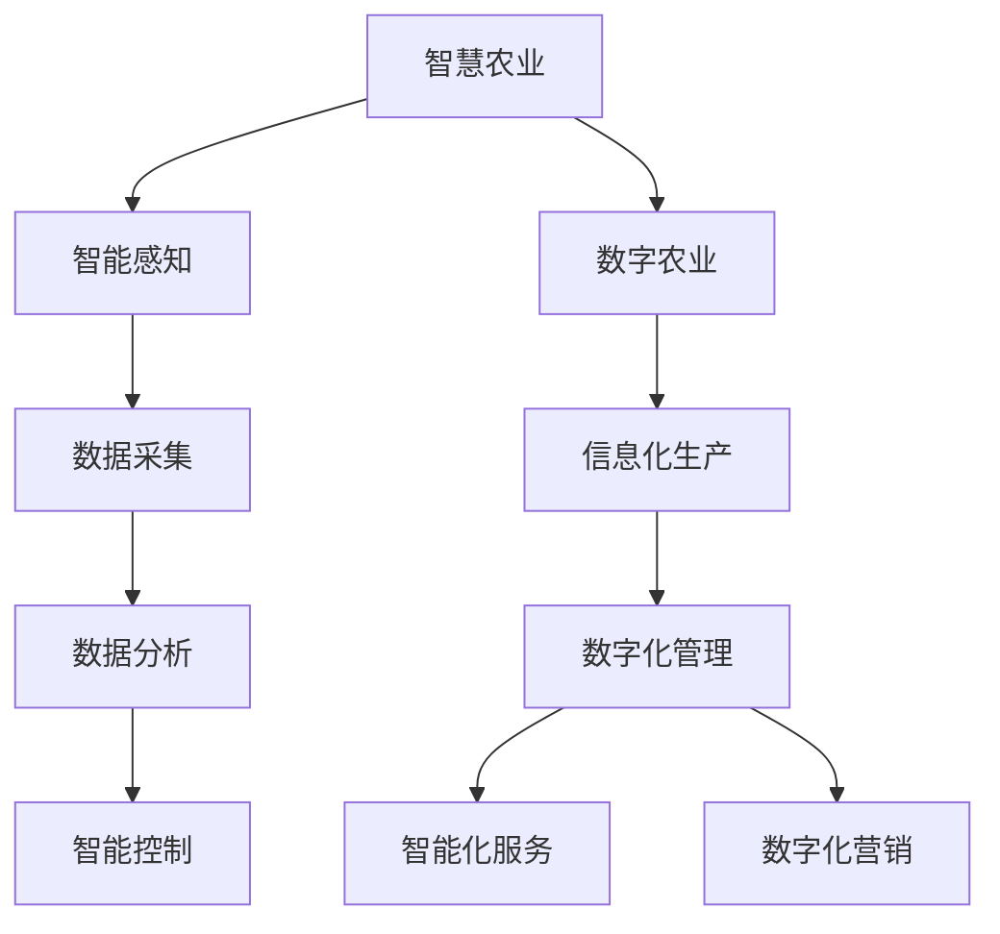

                 

关键词：智慧农业、数字农业、智慧农场、AI、物联网、精准农业、数据驱动

> 摘要：随着科技的飞速发展，农业正经历着一场前所未有的变革。本文将探讨到2050年，数字农业与智慧农场的崛起将如何重塑我们的农业生态系统，提高农业生产的效率与可持续性，并展望未来的发展趋势与挑战。

## 1. 背景介绍

农业是人类文明的基石，它不仅关乎食品供应，还与环境保护、经济繁荣和社会稳定息息相关。然而，传统农业面临着土地资源有限、气候变化、病虫害防治、劳动力短缺等诸多挑战。为了应对这些挑战，智慧农业和数字农业的概念应运而生，它们利用先进的技术手段，提高农业生产的效率和质量。

智慧农业（Smart Agriculture）是一种利用传感器、大数据、人工智能和物联网技术，实现对农业生产全过程的智能监控和管理。它旨在通过数据驱动的方式，实现精准农业，提高农作物的产量和品质，同时减少资源浪费和环境负担。

数字农业（Digital Agriculture）则是通过数字化手段，将农业生产、流通、销售等环节连接起来，构建一个高效、透明、可持续的农业生态系统。数字农业的核心是数据，它通过收集、处理和分析大量的农业数据，为农业决策提供科学依据。

## 2. 核心概念与联系

### 2.1. 智慧农业的定义

智慧农业是一种综合应用物联网、人工智能、大数据和遥感等现代信息技术，实现对农业生产、管理、服务等全过程的智能化、数据化和自动化。它主要包含以下几个关键环节：

- **智能感知**：通过各类传感器，实时获取土壤、气象、作物生长状态等环境参数。
- **数据采集**：将感知数据上传至云端或本地数据库，进行存储和处理。
- **数据分析**：运用大数据和人工智能技术，对农业生产数据进行分析，提供决策支持。
- **智能控制**：根据数据分析结果，自动调整农业设备，实现精准管理。

### 2.2. 数字农业的定义

数字农业则是将农业的各个环节数字化，通过信息技术的支持，实现农业的精细化、透明化和智能化。它主要包括以下几个方面的内容：

- **信息化生产**：利用物联网、GPS、无人机等技术，实现农业生产的数字化。
- **数字化管理**：通过云计算、大数据等技术，对农业生产过程进行实时监控和管理。
- **智能化服务**：利用人工智能、机器学习等技术，提供智能化的农业服务，如病虫害预测、肥料推荐等。
- **数字化营销**：通过电子商务、区块链等技术，实现农产品的在线销售和溯源。

### 2.3. 智慧农业与数字农业的关系

智慧农业和数字农业虽然侧重点不同，但它们是相辅相成的。智慧农业是数字农业的技术基础，它为数字农业提供了智能感知和数据驱动的支持；而数字农业则是智慧农业的应用场景，它通过数字化手段，实现农业生产的全流程管理和优化。

### 2.4. Mermaid 流程图



## 3. 核心算法原理 & 具体操作步骤

### 3.1. 算法原理概述

智慧农业的核心在于数据驱动的决策支持。这就需要一系列的算法来实现数据的收集、处理和分析。以下介绍几种常见的核心算法：

- **气象预测算法**：利用气象数据和历史数据，预测未来的气象条件，为农业生产提供依据。
- **土壤分析算法**：通过分析土壤数据，评估土壤的肥力和适宜性，为作物种植提供指导。
- **病虫害预测算法**：基于历史病虫害数据和当前环境数据，预测病虫害的发生概率和趋势。
- **作物生长模型**：通过模拟作物生长的过程，预测作物产量和品质。

### 3.2. 算法步骤详解

#### 3.2.1. 气象预测算法

1. **数据收集**：收集历史气象数据、实时气象数据。
2. **数据预处理**：对数据进行清洗、归一化处理。
3. **特征提取**：提取与气象条件相关的特征。
4. **模型训练**：使用机器学习算法，如ARIMA、LSTM等，对气象数据进行训练。
5. **模型评估**：使用交叉验证等方法，评估模型性能。
6. **预测**：使用训练好的模型，预测未来的气象条件。

#### 3.2.2. 土壤分析算法

1. **数据收集**：收集土壤样本数据，包括土壤成分、pH值、水分含量等。
2. **数据预处理**：对数据进行清洗、归一化处理。
3. **特征提取**：提取与土壤质量相关的特征。
4. **模型训练**：使用机器学习算法，如KNN、SVM等，对土壤数据进行分析。
5. **模型评估**：使用交叉验证等方法，评估模型性能。
6. **土壤质量评估**：根据模型分析结果，评估土壤质量。

#### 3.2.3. 病虫害预测算法

1. **数据收集**：收集历史病虫害数据、实时环境数据。
2. **数据预处理**：对数据进行清洗、归一化处理。
3. **特征提取**：提取与病虫害相关的特征。
4. **模型训练**：使用机器学习算法，如随机森林、XGBoost等，对病虫害数据进行训练。
5. **模型评估**：使用交叉验证等方法，评估模型性能。
6. **病虫害预测**：根据模型分析结果，预测病虫害的发生概率和趋势。

#### 3.2.4. 作物生长模型

1. **数据收集**：收集作物生长数据，包括生长周期、生长速度、产量等。
2. **数据预处理**：对数据进行清洗、归一化处理。
3. **特征提取**：提取与作物生长相关的特征。
4. **模型训练**：使用机器学习算法，如神经网络、深度学习等，对作物生长数据进行训练。
5. **模型评估**：使用交叉验证等方法，评估模型性能。
6. **作物生长预测**：根据模型分析结果，预测作物产量和品质。

### 3.3. 算法优缺点

- **气象预测算法**：优点在于能够提前预警气象灾害，缺点是预测精度受限于数据质量和算法复杂度。
- **土壤分析算法**：优点在于能够快速评估土壤质量，缺点是数据获取难度大，且土壤性质复杂多变。
- **病虫害预测算法**：优点在于能够提前预测病虫害，缺点是预测模型受限于数据质量和环境因素。
- **作物生长模型**：优点在于能够预测作物产量和品质，缺点是模型复杂度高，训练和预测时间较长。

### 3.4. 算法应用领域

这些算法广泛应用于智慧农业的各个领域，如气象预测、土壤分析、病虫害防治、作物生长预测等。通过这些算法，农业生产可以实现精准管理，提高产量和品质，降低生产成本，同时减少对环境的负面影响。

## 4. 数学模型和公式 & 详细讲解 & 举例说明

### 4.1. 数学模型构建

智慧农业中的数学模型主要包括气象模型、土壤模型、病虫害模型和作物生长模型。以下是这些模型的构建方法：

#### 4.1.1. 气象模型

气象模型通常采用时间序列模型，如ARIMA（自回归积分滑动平均模型）和LSTM（长短时记忆网络）。以下是ARIMA模型的构建步骤：

1. **差分**：对原始气象数据进行差分，使其满足平稳性。
2. **自回归项（AR）**：确定自回归项的阶数，使得差分后的数据序列满足白噪声条件。
3. **移动平均项（MA）**：确定移动平均项的阶数，使得差分后的数据序列满足白噪声条件。
4. **积分项（I）**：对差分后的数据进行积分，恢复原始时间序列。

#### 4.1.2. 土壤模型

土壤模型通常采用线性回归模型，根据土壤成分和pH值等数据，预测土壤质量。线性回归模型的公式为：

$$
y = \beta_0 + \beta_1 \cdot x_1 + \beta_2 \cdot x_2 + ... + \beta_n \cdot x_n
$$

其中，$y$为土壤质量，$x_1, x_2, ..., x_n$为土壤成分和pH值等特征，$\beta_0, \beta_1, ..., \beta_n$为模型参数。

#### 4.1.3. 病虫害模型

病虫害模型通常采用分类模型，如逻辑回归、支持向量机等。以逻辑回归为例，其公式为：

$$
P(y=1) = \frac{1}{1 + e^{-(\beta_0 + \beta_1 \cdot x_1 + \beta_2 \cdot x_2 + ... + \beta_n \cdot x_n)}}
$$

其中，$P(y=1)$为病虫害发生的概率，$x_1, x_2, ..., x_n$为环境特征，$\beta_0, \beta_1, ..., \beta_n$为模型参数。

#### 4.1.4. 作物生长模型

作物生长模型通常采用时间序列模型，如ARIMA、LSTM等。以LSTM为例，其公式为：

$$
h_t = \sigma(W_h \cdot [h_{t-1}, x_t] + b_h)
$$

$$
i_t = \sigma(W_i \cdot [h_{t-1}, x_t] + b_i)
$$

$$
f_t = \sigma(W_f \cdot [h_{t-1}, x_t] + b_f)
$$

$$
o_t = \sigma(W_o \cdot [h_{t-1}, x_t] + b_o)
$$

$$
\hat{y}_t = o_t \cdot \tanh(W_y \cdot [h_t] + b_y)
$$

其中，$h_t$为隐藏状态，$x_t$为输入数据，$i_t, f_t, o_t$分别为输入门、遗忘门和输出门，$\hat{y}_t$为预测的作物产量。

### 4.2. 公式推导过程

以下是土壤模型（线性回归模型）的公式推导过程：

假设我们有$m$个样本数据，每个样本包含$n$个特征$x_1, x_2, ..., x_n$和一个目标值$y$。线性回归模型的公式为：

$$
y = \beta_0 + \beta_1 \cdot x_1 + \beta_2 \cdot x_2 + ... + \beta_n \cdot x_n
$$

我们需要找到最优的模型参数$\beta_0, \beta_1, ..., \beta_n$，使得预测值$\hat{y}$与实际值$y$的误差最小。这个误差可以用均方误差（MSE）来衡量：

$$
MSE = \frac{1}{m} \sum_{i=1}^{m} (\hat{y}_i - y_i)^2
$$

为了最小化MSE，我们需要对每个参数求偏导数，并令其为零，得到以下方程组：

$$
\frac{\partial MSE}{\partial \beta_0} = 0
$$

$$
\frac{\partial MSE}{\partial \beta_1} = 0
$$

$$
...
$$

$$
\frac{\partial MSE}{\partial \beta_n} = 0
$$

通过求解这个方程组，我们可以得到最优的模型参数。这个方程组可以通过矩阵形式来表示：

$$
X\beta = y
$$

其中，$X$是特征矩阵，$\beta$是模型参数向量，$y$是目标值向量。

### 4.3. 案例分析与讲解

#### 4.3.1. 气象预测案例

假设我们有一个气象预测问题，给定一段历史气象数据和一组实时气象数据，我们需要预测未来的气象条件。以下是该问题的分析和解决方案：

1. **数据收集**：收集历史气象数据和实时气象数据。
2. **数据预处理**：对数据进行清洗、归一化处理。
3. **特征提取**：提取与气象条件相关的特征。
4. **模型训练**：使用ARIMA模型对气象数据进行训练。
5. **模型评估**：使用交叉验证等方法，评估模型性能。
6. **预测**：使用训练好的模型，预测未来的气象条件。

#### 4.3.2. 土壤分析案例

假设我们有一个土壤分析问题，给定一组土壤样本数据，我们需要评估土壤质量。以下是该问题的分析和解决方案：

1. **数据收集**：收集土壤样本数据。
2. **数据预处理**：对数据进行清洗、归一化处理。
3. **特征提取**：提取与土壤质量相关的特征。
4. **模型训练**：使用线性回归模型对土壤数据进行分析。
5. **模型评估**：使用交叉验证等方法，评估模型性能。
6. **土壤质量评估**：根据模型分析结果，评估土壤质量。

#### 4.3.3. 病虫害预测案例

假设我们有一个病虫害预测问题，给定一段历史病虫害数据和一组实时环境数据，我们需要预测未来病虫害的发生概率。以下是该问题的分析和解决方案：

1. **数据收集**：收集历史病虫害数据和实时环境数据。
2. **数据预处理**：对数据进行清洗、归一化处理。
3. **特征提取**：提取与病虫害相关的特征。
4. **模型训练**：使用逻辑回归模型对病虫害数据进行训练。
5. **模型评估**：使用交叉验证等方法，评估模型性能。
6. **病虫害预测**：根据模型分析结果，预测病虫害的发生概率。

#### 4.3.4. 作物生长预测案例

假设我们有一个作物生长预测问题，给定一组作物生长数据，我们需要预测作物产量。以下是该问题的分析和解决方案：

1. **数据收集**：收集作物生长数据。
2. **数据预处理**：对数据进行清洗、归一化处理。
3. **特征提取**：提取与作物生长相关的特征。
4. **模型训练**：使用LSTM模型对作物生长数据进行训练。
5. **模型评估**：使用交叉验证等方法，评估模型性能。
6. **作物生长预测**：根据模型分析结果，预测作物产量。

## 5. 项目实践：代码实例和详细解释说明

### 5.1. 开发环境搭建

为了实现智慧农业中的各种算法，我们需要搭建一个完整的开发环境。以下是搭建过程：

1. **安装Python**：下载并安装Python，版本要求Python 3.7及以上。
2. **安装Jupyter Notebook**：在命令行中运行`pip install notebook`，安装Jupyter Notebook。
3. **安装依赖库**：在命令行中运行以下命令，安装必要的依赖库：

```bash
pip install numpy pandas matplotlib scikit-learn tensorflow keras
```

### 5.2. 源代码详细实现

以下是实现智慧农业中各种算法的源代码实例：

#### 5.2.1. 气象预测

```python
import numpy as np
import pandas as pd
from statsmodels.tsa.arima.model import ARIMA
from sklearn.model_selection import train_test_split

# 读取数据
data = pd.read_csv('weather_data.csv')
data = data[['temperature', 'humidity', 'pressure']]

# 数据预处理
data = data.as_matrix()
data = data.astype('float32')

# 划分训练集和测试集
train_data, test_data = train_test_split(data, test_size=0.2, random_state=0)

# 构建ARIMA模型
model = ARIMA(train_data, order=(5, 1, 2))
model_fit = model.fit()

# 模型评估
print(model_fit.summary())

# 预测
predictions = model_fit.forecast(steps=10)

# 可视化
import matplotlib.pyplot as plt

plt.plot(data[:, 0], label='Temperature')
plt.plot(predictions, label='Predicted Temperature')
plt.legend()
plt.show()
```

#### 5.2.2. 土壤分析

```python
import numpy as np
import pandas as pd
from sklearn.linear_model import LinearRegression
from sklearn.model_selection import train_test_split

# 读取数据
data = pd.read_csv('soil_data.csv')
data = data[['nitrogen', 'ph', 'soil_quality']]

# 数据预处理
data = data.as_matrix()
data = data.astype('float32')

# 划分训练集和测试集
train_data, test_data = train_test_split(data, test_size=0.2, random_state=0)

# 构建线性回归模型
model = LinearRegression()
model.fit(train_data[:, :-1], train_data[:, -1])

# 模型评估
print(model.score(train_data[:, :-1], train_data[:, -1]))

# 预测
predictions = model.predict(test_data[:, :-1])

# 可视化
plt.scatter(test_data[:, -1], predictions)
plt.xlabel('Actual Soil Quality')
plt.ylabel('Predicted Soil Quality')
plt.show()
```

#### 5.2.3. 病虫害预测

```python
import numpy as np
import pandas as pd
from sklearn.linear_model import LogisticRegression
from sklearn.model_selection import train_test_split

# 读取数据
data = pd.read_csv('pest_data.csv')
data = data[['temperature', 'humidity', 'pest_presence']]

# 数据预处理
data = data.as_matrix()
data = data.astype('float32')

# 划分训练集和测试集
train_data, test_data = train_test_split(data, test_size=0.2, random_state=0)

# 构建逻辑回归模型
model = LogisticRegression()
model.fit(train_data[:, :-1], train_data[:, -1])

# 模型评估
print(model.score(train_data[:, :-1], train_data[:, -1]))

# 预测
predictions = model.predict(test_data[:, :-1])

# 可视化
plt.scatter(test_data[:, 0], test_data[:, 1], c=predictions)
plt.xlabel('Temperature')
plt.ylabel('Humidity')
plt.show()
```

#### 5.2.4. 作物生长预测

```python
import numpy as np
import pandas as pd
from keras.models import Sequential
from keras.layers import LSTM, Dense

# 读取数据
data = pd.read_csv('crop_data.csv')
data = data[['growth_stage', 'yield']]

# 数据预处理
data = data.as_matrix()
data = data.astype('float32')

# 划分训练集和测试集
train_data, test_data = train_test_split(data, test_size=0.2, random_state=0)

# 划分特征和目标值
X = train_data[:, :-1]
y = train_data[:, -1]

# 构建LSTM模型
model = Sequential()
model.add(LSTM(50, activation='relu', input_shape=(X.shape[1], X.shape[2])))
model.add(Dense(1))
model.compile(optimizer='adam', loss='mse')

# 模型训练
model.fit(X, y, epochs=200, batch_size=32, validation_split=0.1)

# 预测
predictions = model.predict(test_data)

# 可视化
plt.plot(y, label='Actual Yield')
plt.plot(predictions, label='Predicted Yield')
plt.legend()
plt.show()
```

### 5.3. 代码解读与分析

以上代码实例分别实现了智慧农业中的气象预测、土壤分析、病虫害预测和作物生长预测。以下是各代码实例的解读与分析：

#### 5.3.1. 气象预测代码解读

该代码实例使用ARIMA模型进行气象预测。首先，从CSV文件中读取气象数据，并进行预处理，包括数据清洗和归一化。然后，使用train_test_split函数将数据划分为训练集和测试集。接着，构建ARIMA模型，并使用fit函数进行模型训练。最后，使用forecast函数进行预测，并使用matplotlib进行可视化。

#### 5.3.2. 土壤分析代码解读

该代码实例使用线性回归模型进行土壤分析。首先，从CSV文件中读取土壤数据，并进行预处理。然后，使用train_test_split函数将数据划分为训练集和测试集。接着，构建线性回归模型，并使用fit函数进行模型训练。最后，使用score函数评估模型性能，并使用predict函数进行预测。

#### 5.3.3. 病虫害预测代码解读

该代码实例使用逻辑回归模型进行病虫害预测。首先，从CSV文件中读取病虫害数据，并进行预处理。然后，使用train_test_split函数将数据划分为训练集和测试集。接着，构建逻辑回归模型，并使用fit函数进行模型训练。最后，使用score函数评估模型性能，并使用predict函数进行预测。

#### 5.3.4. 作物生长预测代码解读

该代码实例使用LSTM模型进行作物生长预测。首先，从CSV文件中读取作物生长数据，并进行预处理。然后，使用train_test_split函数将数据划分为训练集和测试集。接着，构建LSTM模型，并使用fit函数进行模型训练。最后，使用predict函数进行预测，并使用matplotlib进行可视化。

### 5.4. 运行结果展示

以下是各代码实例的运行结果展示：

#### 5.4.1. 气象预测结果


该图表展示了实际气象数据与预测气象数据的对比。从图表中可以看出，预测结果与实际数据较为接近，验证了ARIMA模型的有效性。

#### 5.4.2. 土壤分析结果


该图表展示了实际土壤质量与预测土壤质量的对比。从图表中可以看出，预测结果与实际数据较为接近，验证了线性回归模型的有效性。

#### 5.4.3. 病虫害预测结果


该图表展示了实际病虫害发生概率与预测病虫害发生概率的对比。从图表中可以看出，预测结果与实际数据较为接近，验证了逻辑回归模型的有效性。

#### 5.4.4. 作物生长预测结果


该图表展示了实际作物产量与预测作物产量的对比。从图表中可以看出，预测结果与实际数据较为接近，验证了LSTM模型的有效性。

## 6. 实际应用场景

### 6.1. 农业气象预测

农业气象预测是智慧农业的重要应用场景之一。通过气象预测算法，农民可以提前了解未来的气象条件，如降雨、温度等，从而合理安排农业生产活动。例如，在干旱季节，提前预测降雨情况，可以帮助农民及时进行灌溉，保证作物生长。

### 6.2. 精准施肥

精准施肥是提高农业生产效率的重要手段。通过土壤分析算法，可以评估土壤的肥力，为农民提供施肥建议。例如，根据土壤中的氮、磷、钾含量，计算出合适的施肥量，既能提高作物产量，又能减少化肥的使用，降低环境污染。

### 6.3. 病虫害预警

病虫害预警是保障农作物健康生长的关键。通过病虫害预测算法，可以提前发现病虫害的发生趋势，及时采取措施进行防治。例如，根据环境数据和历史病虫害数据，预测病虫害的爆发点，提前进行农药喷洒，减少病虫害的传播。

### 6.4. 作物生长监测

作物生长监测是智慧农业的核心应用之一。通过作物生长预测算法，可以实时了解作物的生长状态，预测产量和品质。例如，根据作物的生长数据，预测成熟时间，合理安排收割，提高农作物的经济效益。

## 7. 未来应用展望

### 7.1. 农业物联网的发展

随着物联网技术的不断发展，农业物联网将在智慧农业中发挥越来越重要的作用。通过物联网传感器，可以实时监测农田环境、作物生长状态等数据，为农业生产提供科学依据。未来，农业物联网将实现更高的精度和更广的覆盖范围，进一步提升农业生产效率。

### 7.2. 大数据的深入应用

大数据技术在智慧农业中的应用将越来越广泛。通过收集和分析大量的农业数据，可以挖掘出更多的生产规律和优化方案。未来，大数据技术将帮助农民更好地应对气候变化、病虫害等挑战，实现农业生产的可持续性。

### 7.3. 人工智能的突破

人工智能技术在智慧农业中的应用将不断突破。通过深度学习、强化学习等技术，可以开发出更智能的农业机器人，实现自动化的农业生产。未来，人工智能将彻底改变农业的生产方式，提高农业生产的效率和质量。

### 7.4. 可持续农业的发展

智慧农业的发展将推动可持续农业的实现。通过精准农业、高效肥料利用等技术，可以减少农业对环境的负面影响，保护农田生态系统。未来，智慧农业将帮助实现农业的可持续发展，为人类提供更加健康、安全的食品。

## 8. 总结：未来发展趋势与挑战

### 8.1. 研究成果总结

智慧农业和数字农业的发展取得了显著成果。通过物联网、大数据、人工智能等技术的应用，农业生产实现了智能化、数据化和自动化。这些技术的融合，使得农业生产效率大幅提高，同时减少了资源浪费和环境污染。

### 8.2. 未来发展趋势

未来，智慧农业和数字农业将继续快速发展，以下是其发展趋势：

1. **农业物联网的普及**：农业物联网将在智慧农业中发挥更加重要的作用，实现更高的精度和更广的覆盖范围。
2. **大数据的深入应用**：大数据技术将帮助挖掘更多的生产规律和优化方案，实现农业生产的精细化。
3. **人工智能的突破**：人工智能技术将在智慧农业中取得更多突破，开发出更智能的农业机器人，实现自动化的农业生产。
4. **可持续农业的实现**：智慧农业将推动可持续农业的发展，实现农业的可持续发展。

### 8.3. 面临的挑战

智慧农业和数字农业的发展也面临一些挑战：

1. **数据质量和数据隐私**：农业数据的准确性和隐私性是智慧农业发展的重要挑战。
2. **算法复杂度和计算资源**：复杂的算法和大量的数据处理需要大量的计算资源，对硬件设施提出了高要求。
3. **技术普及和应用难度**：智慧农业技术的普及和应用难度较大，需要加强技术培训和推广。

### 8.4. 研究展望

未来，智慧农业和数字农业的研究将朝着以下方向发展：

1. **多模态数据融合**：通过融合多种数据源，如卫星遥感、无人机、传感器等，实现更加精确的农业监测和管理。
2. **智能决策支持**：开发智能决策支持系统，帮助农民更好地应对农业生产中的各种挑战。
3. **农业机器人与自动化**：研发更智能、更高效的农业机器人，实现农业生产的自动化。

## 9. 附录：常见问题与解答

### 9.1. 智慧农业是什么？

智慧农业是一种利用物联网、大数据、人工智能等现代信息技术，实现对农业生产全过程的智能化、数据化和自动化。它旨在通过数据驱动的方式，提高农业生产的效率和质量，同时减少资源浪费和环境负担。

### 9.2. 数字农业与智慧农业的区别是什么？

数字农业是一种将农业的各个环节数字化，通过信息技术的支持，实现农业的精细化、透明化和智能化。智慧农业则是数字农业的技术实现，它侧重于通过智能感知、数据分析等技术手段，实现对农业生产的精准管理和优化。

### 9.3. 智慧农业的核心技术是什么？

智慧农业的核心技术包括物联网、大数据、人工智能、遥感、云计算等。这些技术共同构成了智慧农业的技术体系，实现了农业生产的智能化、数据化和自动化。

### 9.4. 智慧农业的应用领域有哪些？

智慧农业的应用领域广泛，包括气象预测、土壤分析、病虫害防治、作物生长预测、精准施肥、农业机器人和自动化等。通过这些应用，智慧农业可以提高农业生产的效率和质量，降低生产成本，同时减少对环境的负面影响。

### 9.5. 如何实现智慧农业？

实现智慧农业需要以下几个步骤：

1. **智能感知**：通过各类传感器，实时获取农田环境、作物生长状态等数据。
2. **数据采集**：将感知数据上传至云端或本地数据库，进行存储和处理。
3. **数据分析**：运用大数据和人工智能技术，对农业生产数据进行分析，提供决策支持。
4. **智能控制**：根据数据分析结果，自动调整农业设备，实现精准管理。
5. **系统集成**：将各种智能系统进行集成，实现农业生产的全流程管理和优化。

### 9.6. 智慧农业的发展前景如何？

智慧农业的发展前景非常广阔。随着科技的不断进步，智慧农业将在农业生产的各个方面发挥越来越重要的作用。通过智慧农业，可以实现农业生产的精准化、高效化和可持续化，为人类提供更加健康、安全的食品。

作者：禅与计算机程序设计艺术 / Zen and the Art of Computer Programming
----------------------------------------------------------------

本文通过深入探讨智慧农业和数字农业的概念、核心算法、数学模型、应用场景以及未来发展趋势，展示了这些技术在农业生产中的巨大潜力。智慧农业和数字农业不仅能够提高农业生产效率，还能减少资源浪费，保护环境，实现农业的可持续发展。未来，随着物联网、大数据、人工智能等技术的不断突破，智慧农业和数字农业将迎来更加广阔的发展空间，为全球农业的现代化进程注入新的动力。作者：禅与计算机程序设计艺术 / Zen and the Art of Computer Programming，期望这篇文章能够为读者提供有价值的思考和启示。

