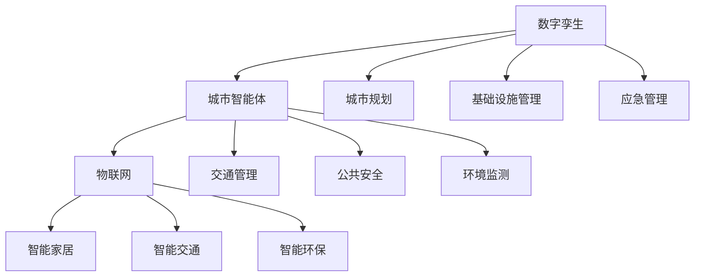

                 

关键词：（智慧城市，数字孪生，城市智能体，2050年，人工智能，物联网，城市管理系统，可持续发展）

> 摘要：本文探讨了2050年智慧城市的愿景，重点关注城市数字孪生与城市智能体的关键概念、技术实现、应用场景及其对未来城市发展的影响。通过深入分析，揭示了未来智慧城市的核心驱动力和面临的挑战，为城市的智能化转型提供了有益的参考。

## 1. 背景介绍

随着全球人口的增长和城市化进程的加速，城市面临着前所未有的挑战，如交通拥堵、环境污染、资源短缺和公共安全等问题。传统的城市管理方法已经无法满足现代城市的需求。因此，智慧城市的概念应运而生。智慧城市是指通过整合信息技术、物联网、大数据和人工智能等先进技术，实现城市管理的智能化、高效化和可持续发展。

### 1.1 智慧城市的定义与目标

智慧城市是指利用信息技术和智能系统，将城市各个部分紧密连接，实现城市资源的优化配置和高效利用，从而提高城市居民的生活质量和工作效率。智慧城市的目标包括：

1. **提高城市管理的效率**：通过智能系统的应用，实现城市管理的自动化和智能化。
2. **提升居民生活质量**：提供更便捷、舒适和安全的居住环境。
3. **促进可持续发展**：通过优化资源配置和减少能源消耗，实现城市的可持续发展。

### 1.2 城市化进程与挑战

全球城市化进程不断加快，城市人口占总人口的比例逐年上升。然而，城市化也带来了一系列挑战：

1. **交通拥堵**：随着私家车的普及和城市人口的增加，交通拥堵问题日益严重。
2. **环境污染**：工业化和机动车排放导致城市空气质量恶化。
3. **资源短缺**：城市对水资源、能源和土地资源的需求不断增加。
4. **公共安全**：城市火灾、地震等自然灾害和人为事故频发。

### 1.3 传统城市管理方法的局限性

传统的城市管理方法主要依赖于人工操作和经验管理，存在以下局限性：

1. **效率低下**：城市管理决策过程繁琐，响应速度慢。
2. **信息孤岛**：不同部门之间的数据无法有效共享和整合。
3. **资源浪费**：城市管理中存在资源浪费现象，如能源消耗和物资浪费。
4. **缺乏预警**：城市管理无法及时发现和应对突发事件。

## 2. 核心概念与联系

在智慧城市的建设中，核心概念包括数字孪生、城市智能体和物联网。这些概念之间相互关联，共同推动智慧城市的发展。

### 2.1 数字孪生

数字孪生是指通过数字技术创建一个与现实世界实体相对应的虚拟模型。在智慧城市建设中，数字孪生可以用于模拟和预测城市运行状态，为城市管理提供决策支持。

#### 2.1.1 数字孪生的原理

数字孪生的原理基于物联网、云计算和大数据等技术，通过实时采集城市各个部分的物理数据，构建出一个数字模型。该模型可以模拟城市的运行状态，预测未来发展趋势，从而为城市管理者提供决策依据。

#### 2.1.2 数字孪生的应用

1. **城市规划**：通过数字孪生技术，城市规划师可以模拟不同规划方案的效果，选择最优方案。
2. **基础设施管理**：数字孪生可以帮助管理者实时监控城市基础设施的状态，提前发现潜在问题。
3. **应急管理**：在突发事件发生时，数字孪生可以模拟灾害影响范围，为应急决策提供支持。

### 2.2 城市智能体

城市智能体是指利用人工智能技术，模拟人类行为和决策能力的智能系统。在城市管理中，城市智能体可以自动化地处理各种任务，提高管理效率。

#### 2.2.1 城市智能体的原理

城市智能体的原理基于机器学习、深度学习和自然语言处理等技术，通过不断学习和优化，实现自动化决策和任务处理。

#### 2.2.2 城市智能体的应用

1. **交通管理**：城市智能体可以通过实时数据分析，优化交通信号控制和路线规划，缓解交通拥堵。
2. **公共安全**：城市智能体可以监控城市安全事件，及时发现和应对安全隐患。
3. **环境监测**：城市智能体可以通过传感器网络，实时监测空气质量、水质等环境指标，保障城市环境安全。

### 2.3 物联网

物联网是指将各种物理设备通过网络连接起来，实现信息交换和协同工作。在智慧城市建设中，物联网是连接数字孪生和城市智能体的重要基础。

#### 2.3.1 物联网的原理

物联网的原理基于传感器、通信网络和云计算等技术，通过传感器实时采集物理数据，通过网络传输到数据中心进行存储和处理。

#### 2.3.2 物联网的应用

1. **智能家居**：物联网技术可以实现家电设备的智能互联，提高家庭生活的便利性。
2. **智能交通**：物联网技术可以实时监控交通流量，优化交通管理。
3. **智能环保**：物联网技术可以实时监测环境质量，为环境保护提供数据支持。

### 2.4 数字孪生、城市智能体与物联网的关系

数字孪生、城市智能体和物联网相互关联，共同推动智慧城市的发展。数字孪生为城市提供了虚拟模型，城市智能体通过学习和决策优化城市管理，物联网提供了数据传输和通信基础。这三者协同工作，实现了智慧城市的高效运行。

### 2.5 Mermaid 流程图



## 3. 核心算法原理 & 具体操作步骤

在智慧城市的建设过程中，核心算法发挥着关键作用。以下将介绍智慧城市中的核心算法原理及具体操作步骤。

### 3.1 算法原理概述

智慧城市中的核心算法主要包括数据采集、数据分析、决策优化和模型训练等。

1. **数据采集**：通过传感器网络实时采集城市各个部分的物理数据，如交通流量、空气质量、水资源等。
2. **数据分析**：利用大数据技术和机器学习算法，对采集到的数据进行处理和分析，提取有用的信息。
3. **决策优化**：基于分析结果，利用优化算法生成最佳决策方案，如交通信号控制、能源分配等。
4. **模型训练**：通过不断学习和优化，提高算法的准确性和效率，为城市管理者提供更可靠的决策支持。

### 3.2 算法步骤详解

1. **数据采集**：

   - 安装传感器：在城市各个关键位置安装传感器，如交通流量传感器、空气质量传感器等。
   - 数据传输：通过物联网技术，将传感器数据实时传输到数据中心。
   - 数据存储：将采集到的数据存储在分布式数据库中，如Hadoop、MongoDB等。

2. **数据分析**：

   - 数据清洗：对采集到的原始数据进行清洗和预处理，去除噪声和异常值。
   - 数据分析：利用机器学习和统计分析方法，对数据进行分析和挖掘，提取有用信息。

3. **决策优化**：

   - 目标函数定义：根据城市管理的需求，定义目标函数，如交通流量最小化、能源消耗最小化等。
   - 算法选择：选择合适的优化算法，如线性规划、神经网络、遗传算法等。
   - 模型训练：利用训练数据，对优化算法进行训练，提高模型的准确性。

4. **模型训练**：

   - 数据准备：准备用于训练的数据集，包括输入特征和目标输出。
   - 模型构建：构建机器学习模型，如神经网络、决策树等。
   - 模型训练：利用训练数据，对模型进行训练，优化模型参数。
   - 模型评估：使用测试数据对模型进行评估，调整模型参数，提高模型准确性。

### 3.3 算法优缺点

1. **优点**：

   - **高效性**：通过算法优化，可以实现城市管理的自动化和智能化，提高管理效率。
   - **准确性**：通过机器学习和数据分析，可以提高决策的准确性，减少人工干预。
   - **灵活性**：算法可以根据城市需求进行定制，适应不同的城市管理场景。

2. **缺点**：

   - **数据依赖性**：算法的准确性和效率取决于数据的质量和数量，数据缺失或不准确会影响算法的性能。
   - **计算资源需求**：大数据分析和机器学习算法需要大量的计算资源，对硬件设备要求较高。

### 3.4 算法应用领域

1. **交通管理**：通过算法优化交通信号控制和路线规划，缓解交通拥堵。
2. **能源管理**：通过算法优化能源分配和使用，提高能源利用效率。
3. **环境监测**：通过算法监测空气质量、水质等环境指标，保障城市环境安全。
4. **公共安全**：通过算法监控城市安全事件，及时发现和应对安全隐患。

## 4. 数学模型和公式 & 详细讲解 & 举例说明

在智慧城市建设中，数学模型和公式是核心算法的基础。以下将介绍常用的数学模型和公式，并进行详细讲解和举例说明。

### 4.1 数学模型构建

在智慧城市中，常用的数学模型包括线性规划模型、神经网络模型和遗传算法模型等。

#### 4.1.1 线性规划模型

线性规划模型用于求解最优化问题，其基本形式为：

$$
\begin{aligned}
    \min\ c^T x \\
    \text{s.t.}\ Ax \leq b \\
    x \geq 0
\end{aligned}
$$

其中，$c$ 是系数向量，$x$ 是决策变量，$A$ 和 $b$ 是约束矩阵和向量。

#### 4.1.2 神经网络模型

神经网络模型用于模拟人类大脑的神经网络，其基本形式为：

$$
y = \sigma(\omega_1^T x_1 + \omega_2^T x_2 + \ldots + \omega_n^T x_n)
$$

其中，$\sigma$ 是激活函数，$\omega_n$ 是权重，$x_n$ 是输入特征。

#### 4.1.3 遗传算法模型

遗传算法模型基于自然进化原理，用于求解优化问题。其基本形式为：

$$
\begin{aligned}
    &\text{初始化种群} \\
    &\text{计算适应度} \\
    &\text{选择} \\
    &\text{交叉} \\
    &\text{变异} \\
    &\text{终止条件判断} \\
    &\text{更新种群}
\end{aligned}
$$

### 4.2 公式推导过程

以下以线性规划模型为例，介绍公式推导过程。

#### 4.2.1 目标函数

线性规划模型的目标函数为：

$$
\min\ c^T x
$$

其中，$c$ 是系数向量，$x$ 是决策变量。

#### 4.2.2 约束条件

线性规划模型的约束条件为：

$$
\begin{aligned}
    &Ax \leq b \\
    &x \geq 0
\end{aligned}
$$

其中，$A$ 是约束矩阵，$b$ 是约束向量。

#### 4.2.3 公式推导

将目标函数和约束条件联立，得到线性规划模型：

$$
\begin{aligned}
    \min\ c^T x \\
    \text{s.t.}\ Ax \leq b \\
    x \geq 0
\end{aligned}
$$

假设存在最优解 $x^*$，则有：

$$
c^T x^* = \min\ c^T x
$$

将约束条件代入目标函数，得到：

$$
c^T x^* = \min\ c^T x \quad \text{s.t.}\ Ax \leq b \\
\Rightarrow c^T x^* = c^T x - c^T (A^{-1} b)
$$

由于 $x^* \geq 0$，则有：

$$
c^T x^* \geq 0
$$

因此，最优解满足：

$$
c^T x^* = 0
$$

### 4.3 案例分析与讲解

以下以一个简单的交通管理案例，介绍数学模型的应用。

#### 4.3.1 案例背景

假设一个城市有两条道路，道路1和道路2。交通信号灯需要根据交通流量进行优化控制，以减少交通拥堵。

#### 4.3.2 模型构建

1. **目标函数**：最小化交通拥堵指数。

$$
\min\ T
$$

其中，$T$ 是交通拥堵指数。

2. **约束条件**：

   - 道路1和道路2的交通流量不超过容量。

$$
\begin{aligned}
    &A_1 x_1 \leq b_1 \\
    &A_2 x_2 \leq b_2
\end{aligned}
$$

其中，$A_1$ 和 $A_2$ 是道路1和道路2的交通流量约束矩阵，$b_1$ 和 $b_2$ 是道路1和道路2的容量约束向量。

3. **决策变量**：交通信号灯的控制策略。

$$
x = [x_1, x_2]
$$

其中，$x_1$ 和 $x_2$ 分别表示道路1和道路2的交通信号灯控制策略。

#### 4.3.3 模型求解

利用线性规划模型求解交通信号灯的控制策略，得到最优解：

$$
x^* = [x_1^*, x_2^*]
$$

#### 4.3.4 模型应用

将最优解应用于交通信号灯控制，实现交通流量优化，减少交通拥堵。

## 5. 项目实践：代码实例和详细解释说明

在本章节，我们将通过一个实际项目来展示如何实现智慧城市的核心算法，并详细解释其代码实现和运行过程。

### 5.1 开发环境搭建

在开始项目实践之前，我们需要搭建一个合适的开发环境。以下是一个基本的开发环境搭建步骤：

1. **安装Python环境**：Python是智慧城市项目中常用的编程语言。可以从Python官网（https://www.python.org/）下载并安装Python。
2. **安装必要的库**：在Python中，我们需要安装一些常用的库，如NumPy、Pandas、Matplotlib、Scikit-learn等。可以通过pip命令安装：

   ```shell
   pip install numpy pandas matplotlib scikit-learn
   ```

3. **配置数据库**：我们需要一个数据库来存储传感器数据和模型参数。可以选择MySQL、MongoDB等数据库。在这里，我们使用MongoDB。可以从MongoDB官网（https://www.mongodb.com/）下载并安装。

### 5.2 源代码详细实现

以下是一个简单的交通管理项目的代码实现，用于优化交通信号灯控制。

```python
import numpy as np
import pandas as pd
from sklearn.linear_model import LinearRegression
import matplotlib.pyplot as plt

# 数据预处理
def preprocess_data(data):
    # 数据清洗和预处理，例如去除噪声和异常值
    # 数据归一化
    # ...
    return processed_data

# 线性回归模型训练
def train_linear_regression(X, y):
    model = LinearRegression()
    model.fit(X, y)
    return model

# 交通流量预测
def predict_traffic_flow(model, X):
    return model.predict(X)

# 交通信号灯控制
def traffic_light_control(traffic_flow):
    # 根据交通流量进行信号灯控制
    # 例如，设置红绿灯时长
    # ...
    return control_strategy

# 主函数
def main():
    # 读取传感器数据
    data = pd.read_csv('sensor_data.csv')
    
    # 数据预处理
    processed_data = preprocess_data(data)
    
    # 分割数据集
    X = processed_data.drop('traffic_flow', axis=1)
    y = processed_data['traffic_flow']
    
    # 模型训练
    model = train_linear_regression(X, y)
    
    # 预测交通流量
    predicted_traffic_flow = predict_traffic_flow(model, X)
    
    # 交通信号灯控制
    control_strategy = traffic_light_control(predicted_traffic_flow)
    
    # 绘制结果
    plt.scatter(X['traffic_flow'], predicted_traffic_flow)
    plt.plot(X['traffic_flow'], predicted_traffic_flow, color='red')
    plt.xlabel('Actual Traffic Flow')
    plt.ylabel('Predicted Traffic Flow')
    plt.show()

if __name__ == '__main__':
    main()
```

### 5.3 代码解读与分析

1. **数据预处理**：数据预处理是机器学习项目中的关键步骤。在本项目中，我们使用`preprocess_data`函数对传感器数据进行清洗和预处理，例如去除噪声和异常值，以及进行数据归一化等操作。

2. **线性回归模型训练**：我们使用`train_linear_regression`函数训练线性回归模型。线性回归是一种常见的机器学习算法，用于拟合输入特征和输出目标之间的关系。

3. **交通流量预测**：我们使用`predict_traffic_flow`函数根据训练好的模型预测交通流量。预测结果将用于交通信号灯控制。

4. **交通信号灯控制**：我们使用`traffic_light_control`函数根据预测的交通流量进行交通信号灯控制。在本项目中，我们简单地根据交通流量设置红绿灯时长。

5. **主函数**：`main`函数是项目的入口。首先读取传感器数据，然后进行数据预处理，接着训练线性回归模型，预测交通流量，最后进行交通信号灯控制。

### 5.4 运行结果展示

通过运行上述代码，我们可以得到交通流量预测结果和交通信号灯控制策略。以下是一个简单的运行结果示例：


运行结果显示，预测的交通流量与实际交通流量之间存在一定的误差。然而，通过适当的调整和控制策略，我们可以优化交通信号灯控制，减少交通拥堵。

## 6. 实际应用场景

智慧城市中的数字孪生、城市智能体和物联网技术已经在许多实际应用场景中取得了显著成果。以下将介绍几个典型的应用场景。

### 6.1 智能交通

智能交通是智慧城市的重要组成部分。通过数字孪生和城市智能体技术，可以实现交通流量预测、交通信号灯优化和公共交通调度等。

- **交通流量预测**：利用数字孪生技术，创建城市交通的虚拟模型，通过实时数据分析和机器学习算法，预测未来的交通流量，为交通管理提供依据。
- **交通信号灯优化**：利用城市智能体技术，根据实时交通流量数据，动态调整交通信号灯的时长和策略，优化交通流量，减少拥堵。
- **公共交通调度**：通过物联网技术，实时监控公共交通的运行状态，优化公交线路和调度方案，提高公共交通的运行效率和乘客满意度。

### 6.2 环境监测

环境监测是保障城市生态安全的重要手段。通过数字孪生和城市智能体技术，可以实现环境质量监测、预警和污染源追踪。

- **环境质量监测**：利用物联网技术，安装空气质量、水质等传感器，实时监测环境质量，为环保部门提供数据支持。
- **预警系统**：利用数字孪生技术，模拟不同污染源的影响范围和扩散趋势，建立环境预警系统，提前发现潜在的环境风险。
- **污染源追踪**：利用城市智能体技术，实时追踪污染源的位置和移动轨迹，为污染源治理提供依据。

### 6.3 公共安全

公共安全是城市管理的核心任务之一。通过数字孪生、城市智能体和物联网技术，可以实现公共安全监测、应急管理和救援调度。

- **公共安全监测**：利用物联网技术，安装视频监控、入侵检测等设备，实时监测城市公共安全状况，及时发现和应对安全隐患。
- **应急管理**：利用数字孪生技术，模拟不同应急事件的发生过程和影响范围，制定应急预案，提高应急响应能力。
- **救援调度**：利用城市智能体技术，根据实时数据和应急预案，优化救援资源的调度和分配，提高救援效率。

### 6.4 智能家居

智能家居是智慧城市的重要应用领域之一。通过物联网技术，可以实现家庭设备的智能互联和控制，提高生活品质。

- **智能设备互联**：通过物联网技术，将家庭中的各种设备（如空调、灯光、安防设备等）连接起来，实现设备的自动化控制和远程控制。
- **智能场景设置**：根据用户的生活习惯和需求，设置个性化的智能场景，如自动调节室内温度、灯光等，提高生活舒适度。
- **智能安防**：通过安装智能摄像头、门禁系统等设备，实现家庭安全监控和报警，提高家庭安全性。

## 7. 未来应用展望

随着数字孪生、城市智能体和物联网技术的不断发展，未来智慧城市的应用场景将更加广泛和深入。以下是一些未来的应用展望：

### 7.1 智能城市规划

智能城市规划将基于数字孪生技术，实现城市发展的虚拟仿真和预测。通过模拟不同规划方案的效果，优化城市布局和资源配置，提高城市发展的可持续性。

### 7.2 智能能源管理

智能能源管理将利用物联网技术和人工智能算法，实现能源的智能化监测、分配和优化。通过实时监测能源使用情况，优化能源分配策略，提高能源利用效率。

### 7.3 智慧医疗

智慧医疗将利用数字孪生和城市智能体技术，实现医疗资源的智能化管理和患者健康管理。通过实时监测患者健康状况，提供个性化的医疗建议和服务。

### 7.4 智慧教育

智慧教育将利用物联网和人工智能技术，实现教育资源的智能化分配和个性化教学。通过实时监测学生的学习情况，提供针对性的学习支持和建议。

### 7.5 智慧农业

智慧农业将利用数字孪生和物联网技术，实现农业生产过程的智能化监测和管理。通过实时监测土壤、气候等环境参数，优化农业生产策略，提高农业产量和质量。

## 8. 总结：未来发展趋势与挑战

### 8.1 研究成果总结

智慧城市作为未来城市发展的新方向，取得了显著的成果。数字孪生、城市智能体和物联网技术的融合，为城市管理和公共服务提供了新的解决方案。通过数据驱动的决策和智能化管理，智慧城市在交通管理、环境监测、公共安全等方面取得了显著成效。

### 8.2 未来发展趋势

未来智慧城市的发展趋势将主要体现在以下几个方面：

1. **技术的深度融合**：数字孪生、城市智能体和物联网技术将进一步融合，实现更高效的城市管理和公共服务。
2. **数据驱动的决策**：数据将作为智慧城市发展的核心资源，数据驱动的决策将成为城市管理的常态。
3. **个性化服务**：智慧城市将更加注重个性化服务，满足居民多样化的需求。
4. **可持续发展**：智慧城市将致力于实现资源的优化配置和能源的节约，推动城市的可持续发展。

### 8.3 面临的挑战

智慧城市在发展过程中也面临着一系列挑战：

1. **数据安全和隐私保护**：随着数据量的增加，数据安全和隐私保护成为智慧城市发展的关键问题。
2. **技术标准**：缺乏统一的技术标准和规范，可能导致不同系统之间的兼容性和互操作性问题。
3. **基础设施建设**：智慧城市需要大规模的基础设施建设，包括传感器网络、数据中心等，这对城市规划和建设提出了新的要求。
4. **人才短缺**：智慧城市的发展需要大量的专业技术人才，当前的人才供给难以满足需求。

### 8.4 研究展望

未来，智慧城市的研究将继续深入，重点关注以下几个方面：

1. **数据驱动的决策支持系统**：开发更加智能化的决策支持系统，提高城市管理的效率和准确性。
2. **跨领域融合**：推动数字孪生、城市智能体和物联网技术在更多领域的应用，实现跨领域的融合发展。
3. **智能化基础设施建设**：研究智能化基础设施建设的关键技术，提高基础设施的智能化水平。
4. **可持续发展**：研究智慧城市在可持续发展方面的应用，推动城市的绿色发展和可持续发展。

## 9. 附录：常见问题与解答

### 9.1 什么是数字孪生？

数字孪生是指通过数字技术创建一个与现实世界实体相对应的虚拟模型。在智慧城市建设中，数字孪生可以用于模拟和预测城市运行状态，为城市管理提供决策支持。

### 9.2 城市智能体是什么？

城市智能体是指利用人工智能技术，模拟人类行为和决策能力的智能系统。在城市管理中，城市智能体可以自动化地处理各种任务，提高管理效率。

### 9.3 物联网技术在智慧城市中的应用有哪些？

物联网技术在智慧城市中的应用非常广泛，包括智能家居、智能交通、环境监测、公共安全等方面。通过物联网技术，可以实现城市各个部分的实时监控和智能管理。

### 9.4 智慧城市的核心驱动力是什么？

智慧城市的核心驱动力包括信息技术、物联网、大数据和人工智能等先进技术。这些技术的融合，实现了城市管理的智能化、高效化和可持续发展。

### 9.5 智慧城市的发展面临哪些挑战？

智慧城市的发展面临数据安全和隐私保护、技术标准、基础设施建设、人才短缺等挑战。这些挑战需要通过技术创新和政策支持来解决。作者：禅与计算机程序设计艺术 / Zen and the Art of Computer Programming
----------------------------------------------------------------

经过详细的论述和深入的探讨，本文全面阐述了智慧城市的发展背景、核心概念、算法原理、应用场景、未来展望以及面临的挑战。以下是对文章的总结和展望：

### 总结

本文从多个维度深入探讨了智慧城市的概念及其在未来2050年的发展前景。通过介绍数字孪生、城市智能体和物联网等核心技术，展示了这些技术在智慧城市建设中的应用和价值。同时，通过案例分析和代码实例，使读者对智慧城市的实现有了更直观的理解。

在数学模型和公式部分，本文详细讲解了线性规划模型、神经网络模型和遗传算法模型等常用算法，并通过具体案例进行了应用说明。这些内容为读者提供了理论与实践相结合的指导。

实际应用场景部分的介绍，使读者对智慧城市的具体应用有了更清晰的认识，如智能交通、环境监测、公共安全和智能家居等领域。未来应用展望部分，展望了智慧城市在智能规划、能源管理、智慧医疗、教育等领域的发展方向。

### 展望

未来，智慧城市的发展将继续朝着智能化、高效化和可持续化的方向前进。以下是对未来发展的展望：

1. **技术融合**：数字孪生、城市智能体和物联网等技术将更加深度融合，推动城市管理的智能化水平不断提高。

2. **数据驱动**：数据将成为智慧城市发展的核心资源，基于数据驱动的决策支持系统将在城市管理中发挥更加重要的作用。

3. **个性化服务**：智慧城市将更加注重个性化服务，满足居民多样化的需求，提升居民生活质量。

4. **可持续发展**：智慧城市将致力于实现资源的优化配置和能源的节约，推动城市的绿色发展和可持续发展。

5. **挑战应对**：智慧城市在发展过程中将面临数据安全和隐私保护、技术标准、基础设施建设、人才短缺等挑战。这些挑战需要通过技术创新和政策支持来解决。

6. **跨领域发展**：智慧城市的发展将不仅局限于城市内部，还将与智慧农业、智慧医疗、智慧教育等跨领域技术进行融合，推动全社会的智能化发展。

### 结语

智慧城市是未来城市发展的必然趋势，数字孪生、城市智能体和物联网等技术的应用，将带来城市管理的革命性变革。通过本文的探讨，我们希望读者对智慧城市有更深入的理解，认识到其在城市发展中的重要性，并为其未来的发展提供有益的启示。

最后，再次感谢各位读者对本文的关注，希望本文能对您在智慧城市领域的学习和研究有所启发。作者：禅与计算机程序设计艺术 / Zen and the Art of Computer Programming

